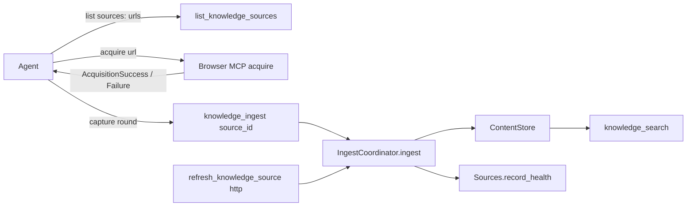

# Static Website Knowledge Ingestion Design

> Status: admitted revision 2 (2026-10-10); D1, D2, D4, and D5 accepted. Adds corrective OUT-006
> for finalization findings G10 and G11; OUT-001 through OUT-005 are unchanged. Gates restart.

## Current Ownership (observed on `dev` 4990469c1)

- Static leg: `URL_LIST -> CompositeSourceFetcher._fetch_url_list -> intake.read_url ->
  HttpxContentFetcher.fetch_response -> owlbear_web_content -> FetchedDocument ->
  IngestCoordinator.refresh/ingest -> ContentStore -> knowledge_search`.
- Change detection: `ContentStore.ingest` identity is `external_id -> uri -> title` per source;
  SHA-256 of whitespace-normalized text decides unchanged versus replaced; replacement discards
  pending enrichment entries for replaced chunks and invalidates graph evidence, deleting entities
  that lose all evidence (`ingest_coordinator.py`, `protocols/graph.py`).
- Persistence order: `Content` commits replacement rows before vector and cascade steps
  (`stores/content.py`), so a fault after `Content.ingest` cannot restore the previous document.
- Health: `IngestCoordinator.ingest` counts only the documents in its request and records
  `ok`/`degraded`/`failed` through `Sources.record_health`; `refresh` skips `ingest` when every item
  fails acquisition and never counts fetch errors in health (G1, G8). `IngestRequest.documents`
  requires at least one item (`protocols/ingest.py`). `SourceInfo` omits `health` and the
  registered URLs (G9).
- Failures: `KnowledgeFailureCode` is a closed `Literal` in `protocols/failures.py`; new codes are
  added there. Content read faults surface as `persistence_failed` (stage `persistence`), proven
  for HTTP refresh with an injected failing SQLite connection in
  `tests/test_mcp_knowledge_static_refresh.py`.
- Search: `SearchSource` exposes only `name` and `url` (`_types.py`); document URI and capture
  provenance are not visible in `knowledge_search` results.
- Scope: `_process_document` receives `scope=source.scope` (#230 closed).
- Browser leg: `BrowserContentFetcher.acquire -> AcquisitionSuccess` (redacted requested/canonical
  URLs, title, Markdown, `content_hash`, `fetched_at`) exposed through Browser MCP `acquire`, which
  runs `_check_ssrf` with direct `socket.getaddrinfo` and the closed-by-default `DomainAllowlist`.
  An exact allowlisted hostname is an explicit approval of its private DNS results; wildcard `*`
  never permits private addresses. Final-page classification returns `authentication_required`
  when a login form is detected before the 401/403 `access_denied` check (`fetcher.py`).
  `AcquisitionStatus` is declared in `owlbear_browser/contract.py`.
- Inline ingest: `knowledge_ingest(text, metadata, scope, source_url) -> str` writes one document to
  the shared `mcp-inline-{scope}` source (Knowledge MCP `server.py`).
- Source configuration is immutable through MCP: tools are register, list, refresh, delete, ingest,
  search, lookup, stats, and enrichment claim/store/retry; changing URLs means delete (purge
  cascade) and re-register. `register_knowledge_source` defaults `enrich=false`.
  `lookup_knowledge_entity` raises `ToolError` for an absent entity. `UrlListConfig.urls` has no
  length bound.
- Boundaries: `ALLOWED_IMPORTS` permits `owlbear_knowledge_mcp -> owlbear_knowledge` only, so
  Knowledge MCP cannot import Browser types; MCP servers must not import each other; Knowledge MCP
  `_BrowserContentFetcher` placeholder serves `authenticated_web` only.
- Proof: `tests/test_mcp_knowledge_static_refresh.py` covers the HTTP journey; Browser tests run
  real headless Chromium with routed synthetic pages under the default-selected `browser` marker;
  pytest-xdist uses `loadfile` distribution.

## Proposed Architecture (D1 = agent-mediated, source-bound capture)



### Source declaration and transport honesty (OUT-001)

- Registration validates kind/transport compatibility: `url_list` accepts `http` or `browser`;
  `file_glob` accepts `filesystem`; `inline` accepts `none`; `authenticated_web` accepts `browser`
  (unchanged placeholder, #227). Other combinations raise a redacted `ToolError` and persist nothing.
- `refresh_knowledge_source` on a `url_list` + `browser` source performs no acquisition, records no
  health, and returns a typed `KnowledgeFailure(stage=acquisition, code=agent_capture_required,
  retryable=false)`; `CompositeSourceFetcher` never substitutes HTTP for a browser source.

### Round health aggregation (OUT-001; D4, G1, G2, G8)

- `IngestRequest` gains acquisition failures: per-item `(uri, KnowledgeFailure)` entries that touch
  no documents; a request may carry zero documents when it carries at least one acquisition failure.
  `IngestCoordinator.ingest` counts them as processed and failed, so one aggregation produces health
  for a refresh or a capture round: no failure -> `ok`; some fail -> `degraded`; none succeed ->
  `failed`. `last_checked_at` is the round completion time; `last_error` is the redacted round
  summary (counts and failure codes only).
- `refresh` passes fetch errors into that request and calls `ingest` even when no document was
  acquired, so total acquisition failure records `failed` health without touching documents (G1)
  and partial failure records `degraded` (G8). `last_refreshed_at` and `sources_refreshed` advance
  only when at least one item succeeded.
- G2: untyped document faults become `KnowledgeFailure(code=processing_failed)` with a fixed message
  in `IngestResult.errors`, so a round with zero successes cannot report success. This is reporting
  only: a fault after `Content.ingest` committed a replacement does not restore the previous
  document (known limit).
- G4: no change; source URLs cannot change through MCP, and delete purges all source documents.

### Source listing projection (OUT-001; G9, COM-005 discovery)

- `list_knowledge_sources` rows gain `health` (`unknown|ok|degraded|failed`) and `urls` (the
  registered URL list for `url_list` sources, `null` otherwise), so a resumed agent can build a
  complete capture round from the source ID alone. URLs are returned as registered by the user.

### Browser HTTP-error classification and resolver seam (OUT-002; D2)

- `AcquisitionStatus` gains `http_error`. After navigation, a main-document response status of 400
  or above other than 401/403 returns `AcquisitionFailure(http_error)` with `response_status` in
  diagnostics, before content extraction can produce success. 401/403 keep their existing
  classification order (login form -> `authentication_required`, otherwise `access_denied`).
  Browser MCP serialization projects the new status unchanged.
- Browser MCP `AppContext` accepts an injectable resolver used by `_check_ssrf` (default
  `socket.getaddrinfo`), mirroring Knowledge's resolver seam. The allowlist and trusted-internal
  policy are unchanged.
- Everything else in the acquisition state machine remains owned by #231.

### Source-bound `knowledge_ingest` and search provenance (OUT-003; D1, D4, #229)

- New optional `source_id` with `captures`: a list of entries, each `{url, captured: {text, title?,
  canonical_url?, fetched_at?, content_hash?}}` or `{url, failed: {status, message?}}`. `status` is
  one of the Browser `AcquisitionStatus` failure literals (`authentication_required`,
  `content_not_ready`, `selector_not_found`, `access_denied`, `redirect_rejected`,
  `ambiguous_final_page`, `unsupported_target`, `download_rejected`, `navigation_failed`,
  `extraction_failed`, `http_error`) or `tool_error` when the Browser MCP call itself was refused.
  Knowledge MCP declares this literal set itself (import boundary); a workspace test keeps it in
  parity with `AcquisitionStatus`.
- Bound mode requires an active `url_list` + `browser` source and one entry per registered URL; a
  missing, unregistered, or duplicate URL, an unknown status, or `text`/`source_url`/`scope`
  supplied alongside `source_id` refuses the whole round with a redacted `ToolError` and persists
  nothing. Each captured text is bounded by the 5 MB HTTP fetcher limit.
- Captured entries become documents whose URI is the registered URL, so recaptures replace rather
  than duplicate; provenance (canonical URL, title, `fetched_at`, Browser `content_hash`) is stored
  in document metadata. Knowledge redacts the provenance URL itself rather than trusting the agent.
  Failed entries become acquisition failures `browser_capture_failed` in the same `IngestRequest`,
  naming the status and preserving the last good document.
- Without `source_id`, the existing `mcp-inline-{scope}` behavior remains, documented as
  non-refreshable; captures without URI or title gain a content-derived identity so unrelated
  captures cannot replace each other.
- Both modes return a typed result with `source_id`, `documents_created`, `documents_replaced`,
  `documents_unchanged`, `documents_failed`, `chunks_created`, `chunks_replaced`, `document_ids`,
  `health`, and typed `errors`, or a `KnowledgeFailure` for tool-level failure. Neither returns an
  `Ingested:` string or raw exception text. No compatibility path keeps the old string result.
- `knowledge_search` result `source` gains `id` (source ID), `uri` (document URI), and `provenance`
  (`canonical_url`, `fetched_at`, `content_hash` when stored, otherwise `null`).

### Vertical acceptance (OUT-004; #235)

A new file under `tests/` assembles Knowledge MCP through `build_app_context` with deterministic
embedding/vector adapters and the production SSRF policy with a synthetic public resolver, and
Browser MCP with an exact-host allowlist for the synthetic host, the injected public resolver, and a
launcher whose browser context routes the synthetic host to fixture pages and aborts and records any
other request. The test plays the agent through public tool functions only and registers the source
with `enrich=true` so enrichment and graph cleanup are discriminating. For #235's typed persistence
failure, the Knowledge assembly uses a SQLite connection factory that can fail content reads on
demand, following the existing static-refresh pattern, so a bound round reaches the persistence
failure through the real coordinator.

### Documentation (OUT-005; #237 part)

Reconcile the touched files listed in intent against source and tests; link the vertical test.

### Finalization review corrections (OUT-006; D5, G10, G11)

- Knowledge MCP `_redact_capture_url` covers at least every query name that Browser
  `owlbear_browser.contract` redacts (`_SENSITIVE_QUERY_KEYS` plus its credential suffix rule) or
  marks as correlation (`_CORRELATION_QUERY_KEYS`), compared case- and separator-insensitively.
  Knowledge keeps its own key set (the import boundary forbids importing Browser); a workspace test
  under `tests/` imports both packages and fails when a Browser-redacted or correlation name
  survives Knowledge redaction. Dropping or masking the value are both acceptable.
- `BrowserContentFetcher.acquire` drops the response-origin condition from `http_error`: any
  main-document status of 400 or above other than 401/403 is `http_error`, before the redirect,
  authentication, and content checks. Redirect policy for successful documents is unchanged
  (`redirect_rejected` still applies to a cross-origin final page with a non-error status).
- The two Browser READMEs drop the "from the requested origin" qualifier from the `http_error`
  description.
- G12 (DEC-008): the Knowledge MCP README no-op refresh sentence states that unchanged documents
  are counted in `documents_unchanged` while created, replaced, and chunk counts are `0`.

## Outcome Ownership

| Outcome | Owning paths |
| --- | --- |
| OUT-001 | `serve/knowledge/src/owlbear_knowledge/{ingest_coordinator.py,protocols/,source_fetcher.py}`, Knowledge MCP register/refresh/list in `server.py` and `SourceInfo` in `_types.py`, their package tests, `tests/test_mcp_knowledge_static_refresh.py` |
| OUT-002 | `serve/browser/src/owlbear_browser/{contract.py,fetcher.py}`, `serve/browser-mcp/src/owlbear_browser_mcp/server.py`, their package tests |
| OUT-003 | Knowledge MCP `knowledge_ingest`, its result types, `knowledge_search` source projection (`SearchSource`), Knowledge provenance redaction, Knowledge MCP tests, a workspace parity test under `tests/` |
| OUT-004 | New vertical test file and test-only fixtures under `tests/` |
| OUT-005 | Docs and agent files listed in intent |
| OUT-006 | Knowledge MCP `_helpers.py` capture redaction and its tests, Browser `fetcher.py` and its acquisition tests, a workspace redaction parity test under `tests/`, the `http_error` sentence in `serve/browser/README.md` and `serve/browser-mcp/README.md`, the no-op refresh sentence in `serve/knowledge-mcp/README.md` |

## Tradeoffs And Known Weaknesses

- A whole-round payload grows with the registered URL list; there is no URL-count cap because the
  list is user-registered, and each captured text keeps the 5 MB bound.
- Bound capture trusts the agent to submit what Browser `acquire` returned; Knowledge cannot verify
  that captured text came from Browser (accepted under the operating context).
- The failure-status literal set is duplicated across the import boundary; the parity test is the
  guard against drift.
- A document-processing fault after `Content.ingest` committed a replacement is reported as
  `processing_failed` but does not restore the previous document; last-good preservation is
  guaranteed for acquisition failures only.
- Health semantics change for existing HTTP sources: a partial acquisition failure now reports
  `degraded` instead of `ok` (intended correction, no compatibility path).
- Pre-existing raw exception text in Browser MCP DNS-failure messages and Knowledge MCP purge errors
  is not touched by this Change.
- DNS rebinding and private redirects remain accepted limits of the current SSRF policy.

## Proof Boundary

Knowledge behavior is proven at the assembled Knowledge MCP boundary (`build_app_context`, injected
HTTP transport, resolver, and SQLite connection factory below it). Browser classification is proven
with real headless Chromium and routed synthetic pages. The vertical file proves the joined journey
through both servers' public tools, including a typed persistence failure on the bound route. Docs
are proven by artifact inspection against source plus the existing agent ecosystem validation test.

## Delivery Outcomes

```yaml target-contract
kind: outcome
id: OUT-001
title: Honest transport and round health
promise: "A registered source refreshes only over a transport the system honors, and its listed health, last_checked_at, last_error, and registered URLs reflect the latest refresh round including acquisition failures."
acceptance:
  - "AC-001: Given register_knowledge_source with kind url_list and fetch_method filesystem (and, separately, file_glob with http and inline with browser), the tool raises ToolError naming the accepted transports for that kind, and list_knowledge_sources returns no new row."
  - "AC-002: Given an active url_list source registered with fetch_method browser, refresh_knowledge_source returns sources_refreshed 0 and one error whose failure is stage acquisition, code agent_capture_required, retryable false; a recording HTTP transport receives zero requests; the source's health, last_checked_at, and documents are unchanged."
  - "AC-003: Given an http url_list source with two previously ingested URLs, when the injected transport fails both URLs on the next refresh_knowledge_source, the result has sources_refreshed 0 and two typed acquisition errors; list_knowledge_sources then shows health failed, a later last_checked_at, and a non-null last_error; knowledge_search still returns both previous documents."
  - "AC-004: Given the same source, when one URL fails acquisition and the other returns content, refresh_knowledge_source returns sources_refreshed 1 and one typed error, and list_knowledge_sources shows health degraded with a non-null last_error."
  - "AC-005: Given the same source, when both URLs return content, list_knowledge_sources shows health ok and last_error null."
  - "AC-006: Given a content store that raises RuntimeError for each document of a refresh, refresh_knowledge_source returns sources_refreshed 0 and one error per document with code processing_failed and a message that does not contain the exception text; list_knowledge_sources shows health failed."
  - "AC-007: list_knowledge_sources rows include health with a value from unknown, ok, degraded, or failed, and urls equal to the registered URL list in registration order for url_list sources and null for file_glob and inline sources."
commitments: [COM-001, COM-004, COM-005, COM-008, COM-009]
dependencies: []
```

```yaml target-contract
kind: outcome
id: OUT-002
title: Browser reports HTTP error pages as failures
promise: "Browser acquisition of an error page returns a typed http_error failure instead of success, and Browser MCP runs its production SSRF check against an injectable resolver."
acceptance:
  - "AC-008: Given routed synthetic pages in headless Chromium whose main document returns 404 or 500 with a content region, BrowserContentFetcher.acquire returns AcquisitionFailure with status http_error, diagnostics response_status 404 or 500, and no Markdown."
  - "AC-009: Given routed pages returning 401 and 403 with a content region and no login form, acquire returns status access_denied; given a page returning 200 with a content region, acquire returns status success; the existing authentication_required tests for login-form pages still pass unchanged."
  - "AC-010: Given Browser MCP acquire on a 404 page requested with a URL containing query parameter token=secret, the tool returns a structured failure mapping with status http_error and response_status 404, and no field of the mapping contains the string secret."
  - "AC-011: Given a Browser MCP application context in wildcard allowlist mode (domains ['*']) with an injected resolver, acquire on http://pages.synthetic.example/a proceeds to navigation when the resolver returns 93.184.216.34 and raises ToolError naming a blocked IP address without navigation when the resolver returns 127.0.0.1; with the resolver not injected, the context resolves through socket.getaddrinfo."
commitments: [COM-001, COM-006, COM-009]
dependencies: []
```

```yaml target-contract
kind: outcome
id: OUT-003
title: Source-bound capture rounds and truthful knowledge_ingest
promise: "An agent submits one capture round for a registered browser source and receives a typed result showing what was created, replaced, unchanged, or failed, sees the captured documents with provenance in search, while anonymous inline ingestion stays available and truthful."
acceptance:
  - "AC-012: Given an active url_list browser source with URLs A and B registered with enrich true, knowledge_ingest with that source_id and captured entries for A and B returns source_id, documents_created 2, documents_failed 0, two document_ids, health ok, and errors empty; knowledge_search in the source scope returns results whose source.id is the source ID, source.uri is A or B, and source.provenance contains canonical_url, fetched_at, and content_hash."
  - "AC-013: Given the round from AC-012 resubmitted with identical text, knowledge_ingest returns documents_unchanged 2, documents_created 0, and chunks_created 0."
  - "AC-014: Given no enrichment batch claimed since AC-012, a round with changed text for A and identical text for B returns documents_replaced 1 and documents_unchanged 1; knowledge_search returns A's new text and not the replaced text; knowledge_stats chunks_pending after the round equals chunks_pending before the round minus that round's chunks_replaced plus its chunks_created."
  - "AC-015: Given a round with A failed with status http_error and B captured, knowledge_ingest returns documents_failed 1, health degraded, and one error with stage acquisition and code browser_capture_failed whose message names http_error; knowledge_search still returns A's previous text."
  - "AC-016: Given a round with A and B both failed, knowledge_ingest returns documents_created 0, documents_replaced 0, documents_unchanged 0, documents_failed 2, and health failed; list_knowledge_sources shows health failed; knowledge_search still returns both previous documents."
  - "AC-017: Given source_id with a round missing B, a round adding unregistered URL C, a round listing A twice, a failed entry with status unknown_status, a source_id naming an http source, a source_id naming a deleted source, or text supplied alongside source_id, knowledge_ingest raises ToolError in each case, and the source's document count and health are unchanged."
  - "AC-018: Given a captured entry whose canonical_url contains user:pass userinfo and query parameter token=secret, neither the knowledge_ingest result nor knowledge_search source.provenance contains pass or secret."
  - "AC-019: Given knowledge_ingest without source_id, the result is a typed mapping and never a string starting with Ingested; two untitled captures without source_url and with different text in one scope each return documents_created 1 with distinct document_ids; a persistence failure returns a typed error whose message does not contain the exception text; list_knowledge_sources shows the mcp-inline source with refreshable false."
  - "AC-020: Given a bound source with captured documents, delete_knowledge_source purges them and knowledge_search in the source scope returns none of them."
  - "AC-021: A workspace test under tests/ asserts that the Knowledge MCP failed-entry status literals equal the Browser AcquisitionStatus values other than success, plus tool_error."
commitments: [COM-001, COM-002, COM-004, COM-005, COM-008, COM-009]
dependencies: [OUT-001, OUT-002]
```

```yaml target-contract
kind: outcome
id: OUT-004
title: Vertical browser-to-knowledge acceptance
promise: "One deterministic test proves the user journey from registering a public browser source to honest re-refresh across Browser MCP and Knowledge MCP public tools."
acceptance:
  - "AC-022: A new test file under tests/ assembles Knowledge MCP through build_app_context with deterministic embedding and vector adapters and an injected public resolver, and Browser MCP with headless Chromium whose context routes the synthetic host to fixture pages and aborts and records any other request, an exact-host allowlist for the synthetic host, and an injected public resolver; it calls only public MCP tool functions of each server and patches neither server's SSRF check, the IngestCoordinator, nor BrowserContentFetcher."
  - "AC-023: In that file, after register_knowledge_source creates a two-URL browser source in scope project:vertical with enrich true, list_knowledge_sources returns its urls, acquire runs on both URLs, and one bound knowledge_ingest round succeeds, knowledge_search in project:vertical returns both documents with source.id equal to the source ID and source.uri equal to the registered URLs, and knowledge_search in scope global returns neither."
  - "AC-024: In that file, refresh_knowledge_source on the browser source returns code agent_capture_required; an identical recaptured round returns documents_unchanged 2 with health ok; after claim_enrichment_batch and store_enrichment record entity Alpha only from page A's chunk and lookup_knowledge_entity returns Alpha, a round after page A changes returns documents_replaced 1, knowledge_search returns A's new text, and lookup_knowledge_entity for Alpha raises ToolError."
  - "AC-025: In that file, when page A starts returning 404, acquire returns status http_error and the round with A failed returns documents_failed 1 and health degraded while search still returns A's last good text; when page A returns 403 without a login form, acquire returns access_denied; when both pages fail, the round returns documents_failed 2, health failed, zero created, replaced, and unchanged counts, and search still returns both last good documents."
  - "AC-026: uv run test with that file's path passes on two consecutive runs with no credential environment variables set; the recorded list of aborted non-synthetic requests is empty; the Knowledge database, vector store, and Browser profile live under pytest tmp_path and the file binds no fixed network port."
  - "AC-032: In that file, with Knowledge assembled on a SQLite connection factory that fails content reads on demand, a bound knowledge_ingest round whose entries for A and B were both captured through acquire, submitted while content reads fail, returns documents_failed 2, health failed, zero created, replaced, and unchanged counts, and errors with stage persistence and code persistence_failed whose messages contain no exception text; the result is not a string, and list_knowledge_sources then shows health failed."
commitments: [COM-002, COM-003, COM-004, COM-005, COM-006]
dependencies: [OUT-002, OUT-003]
```

```yaml target-contract
kind: outcome
id: OUT-005
title: Browser and Knowledge docs match supported behavior
promise: "A user or agent reading the touched Browser and Knowledge docs learns only behavior the code supports, including how to refresh a browser source by capture round."
acceptance:
  - "AC-027: Artifact inspection of serve/browser/README.md and serve/browser-mcp/README.md against owlbear_browser and owlbear_browser_mcp source shows that listed MCP tool names equal the registered tool names, listed environment variables and launch modes exist in source, http_error and the 401/403 classification order are documented, and no sentence claims managed SSO, Edge/CDP-only operation, or diagnostic-HTML output that the source does not produce."
  - "AC-028: Artifact inspection of serve/knowledge-mcp/README.md and share/skills/h-knowledge-ops/SKILL.md against Knowledge MCP source shows bound and inline knowledge_ingest modes, result fields, refusal cases, failure codes agent_capture_required, browser_capture_failed, and processing_failed, round health semantics, the list_knowledge_sources health and urls fields, the knowledge_search source id, uri, and provenance fields, and inline sources described as non-refreshable."
  - "AC-029: Artifact inspection of share/agents/knowledge-ingestor.agent.md shows a browser-source workflow that reads urls from list_knowledge_sources, acquires each registered URL, and submits one bound knowledge_ingest round, and instructs never to call refresh_knowledge_source for a browser source."
  - "AC-030: Artifact inspection of the Browser to Knowledge section of setup/setup-guide.md shows separate checks for MCP process startup, browser readiness, and Knowledge ingestion readiness through a bound round, states DNS rebinding and private redirects as accepted policy limits, and claims no managed SSO readiness."
  - "AC-031: The touched docs link the vertical test file from OUT-004, and uv run pytest tests/test_agent_ecosystem_validation.py passes."
commitments: [COM-001, COM-002, COM-007]
dependencies: [OUT-004]
```

```yaml target-contract
kind: outcome
id: OUT-006
title: Finalization review corrections
promise: "Captured provenance carries no credential, assertion, authorization-code, or correlation value that Browser redaction removes, every main-document error status other than 401/403 is reported as http_error regardless of the response origin, and the touched Browser and Knowledge READMEs state both behaviors and refresh counts truthfully."
acceptance:
  - "AC-033: Given a bound capture round whose captured canonical_url carries query parameters code, jwt, assertion, SAMLResponse, id_token, state, and nonce with distinct sentinel values, neither the knowledge_ingest result nor any knowledge_search source.provenance value contains any of the sentinels."
  - "AC-034: A workspace test under tests/ asserts that for every query name in the Browser redaction and correlation key sets, and for client_assertion and x_api_token as names Browser redacts only by its credential suffix rule, a URL carrying that name with a sentinel value, after Knowledge capture-provenance redaction, contains no sentinel; and that Knowledge MCP source imports no owlbear_browser module."
  - "AC-035: Given routed synthetic pages in headless Chromium where the requested URL redirects to a different-origin host whose main document returns 404 (and separately 500) with a content region, BrowserContentFetcher.acquire returns AcquisitionFailure with status http_error and diagnostics response_status 404 or 500; a different-origin redirect to a 200 page still returns redirect_rejected, and the existing AC-008 and AC-009 tests pass unchanged."
  - "AC-036: Artifact inspection shows that serve/browser/README.md and serve/browser-mcp/README.md describe http_error for any main-document status of 400 or above other than 401/403 without an origin qualifier, and uv run test with tests/test_browser_knowledge_vertical.py, tests/test_mcp_knowledge_capture_ingest.py, and tests/test_knowledge_capture_status_parity.py passes."
  - "AC-037: Artifact inspection shows that serve/knowledge-mcp/README.md describes a successful no-op refresh as reporting unchanged documents in documents_unchanged with created, replaced, and chunk counts 0, matching the assertions in tests/test_mcp_knowledge_static_refresh.py."
commitments: [COM-001, COM-002, COM-006, COM-007, COM-009]
dependencies: [OUT-002, OUT-003]
```
