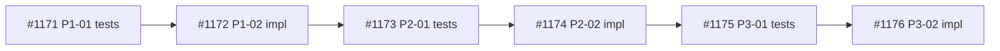

## Context

Research doc: .owlbear/research/1114-config-yml-schema-grouping.md

config.yml uses a hybrid schema: legacy nested groups (board, defaults, tui) coexist with 14 flat Brief-C keys. After Briefs A/B/C stabilize the field set, consolidate into grouped structure.

## Acceptance Criteria

- [ ] BoardConfig uses nested Pydantic sub-models: paths, pipeline, agents, policy
- [ ] _normalise_legacy handles both flat (v10) and grouped (v11) inputs
- [ ] All config field accessors updated (40+ sites in engine.py, storage.py, etc.)
- [ ] All test fixtures updated (110+ matches across tests/ and serve/)
- [ ] Seed template uses new grouped format
- [ ] Live config migrated via version bump (10 → 11)
- [ ] yamllint-clean output (indent/explicit_start via yaml_rt.make_yaml)
- [ ] extra='allow' strategy documented for vendor fields in grouped schema

## Blocked

Wait for Briefs A, B, C tasks to reach done — field set may still change.

## Architect Handoff Notes (from #1114 review)

Review challenger findings from #1114 research. Specifically:
1. `defaults.priority` is actively used in engine.py — grouping must preserve it
2. migrate.py and migration test suite not in research sources — study before implementing version bump
3. storage.py and corruption.py also have config access sites beyond engine.py
4. Tighten dependency metadata to include Brief B/C task IDs not just #1094
5. Evaluate DR requirement for breaking schema change at T3

Brief status at handoff: Brief A (#1045) archived, Brief B (#1044) archived, Brief C (#1043) archived. Only #1094 (Brief A docs sync) remains in review — this task's `depends_on: [1094]` gates dispatch until that completes.
[[2026-04-28]]
## Gating Correction (from #1114 re-review cycle 3)

The prior handoff note incorrectly claimed `depends_on: [1094]` gates dispatch. Engine semantics: active dependencies yield `dep_status="ok"`, which is dispatchable. Only `blocked: true` (set above) reliably prevents dispatch. Unblock when #1094 reaches done.
## Clarification Requested

User notes: no decision to make here.
## Architectural Decision (Resolved)

**Decision:** Bind three architectural rulings — see below

**Scope:** These rulings are binding constraints for the builder.

**Ruling 1: Version Field — Versionless Grouped Configs**
Grouped configs remain versionless, like current new-schema output. The `version` field stays a legacy-only detection marker. The AC line "version bump (10 → 11)" is **dropped**. If schema versioning is needed later, use a distinct field (e.g., `schema_version`).

**Ruling 2: defaults.priority → pipeline.default_priority**
Migrate `defaults.priority` into the grouped structure as `pipeline.default_priority`. The migration path must explicitly move the value; do not rely on Pydantic model defaults to paper over a missing field.

**Ruling 3: save_config as Single Write Authority**
`storage.save_config` is the **single canonical write path**. Migration and merge paths must produce output that `save_config` can round-trip without loss. Update `save_config` to emit grouped output first, then align the other two paths.

**Note:** MCP server.py bug (s['name'] on strings) is a separate concern — file as new task.

[[2026-04-29]]
[[2026-04-29]]
## Research
- Research doc: .owlbear/research/1155-config-schema-grouping-refresh.md
- Sources: 11 studied, 8 high-relevance (all internal — no external sources)
- Recommendation: advance to backlog for arch review (confidence: .65)
- Follow-up tasks created: none (prior follow-ups #1170, #1171 completed; MCP bug already fixed)
- Decision requests: none (3 rulings already resolved)

## Key Findings
1. Prior research docs incorrectly claimed save_config strips defaults/activity_log — actual exclude set is only {board, version}. defaults.priority persistence is NOT fragile.
2. MCP server.py s['name'] bug is already fixed in current code.
3. All 5 architect handoff concerns addressed: defaults.priority confirmed, migrate.py studied (1700+ line test suite), 82 source access sites inventoried, dependencies moot, DR resolved.
4. Three open questions deferred to architect: paths group vs Brief C drop intent, mixed-shape precedence rule, extra='allow' placement strategy.

## Challenge Results
- Challenger: block (confidence in original: .37)
- Key challenges: authority drift across artifacts, paths/Brief-C reversal, mixed-shape ambiguity, live extra-field breakage
- Researcher response: partially accepted, partially rebutted — defaults fragility was based on incorrect claim about save_config strip set. Paths/Brief-C conflict and mixed-shape precedence are valid but are architect-review scope, not research blockers.
[[2026-04-29]]

## Architecture Review

### Evaluation
| Criterion | Assessment | Notes |
|-----------|-----------|-------|
| Single responsibility | PASS | One concern: config schema restructuring |
| Interface clarity | FAIL | 3 open questions unresolved; AC line 6 contradicts Ruling 1 |
| Dependency correctness | PASS | #1094 is done (archived); Briefs A/B/C archived |
| Module layering | PASS | Config model → consumers direction preserved |
| TDD compliance | PASS | Test-writer will process subtasks |
| KISS/YAGNI | PASS | Restructuring serves real complexity reduction |
| Premise challenge | PASS | 82 access sites with flat keys is genuine pain; grouping is warranted |
| Pattern consistency | PASS | Follows existing Pydantic model_validator pattern |
| Security surface | PASS | No new system boundaries |
| Single domain | PASS | scope:kanban only |

### Architect Decisions (binding constraints for subtasks)

**Q1: paths group vs Brief C intent**
Keep `tasks_dir` and `archive_dir` in a `paths:` sub-model. Brief C's "dropped fields" note is aspirational for a future task; live code has 6+ access sites (engine L451-452, L570-571, corruption L586-587, L675). Removing them is a separate concern.

**Q2: Mixed-shape precedence**
Detection cascade: `schema: grouped` field present → grouped format. `schema` absent → flat/legacy detection (existing key-set matching). Both flat AND grouped keys present WITHOUT `schema: grouped` → raise `ConfigError` with diagnostic message. No silent fallback.

**Q3: extra='allow' placement**
`extra='allow'` at root `BoardConfig` only (preserves `tui:`, `defaults:`, vendor fields). Sub-models (`PathsConfig`, `PipelineConfig`, `AgentsConfig`, `PolicyConfig`) use `extra='forbid'` to catch typos in structured fields.

### AC Corrections per Rulings
- AC6 "Live config migrated via version bump (10 → 11)" → DROP per Ruling 1. Replace: "Grouped configs include `schema: grouped` top-level field; detection cascade per Q2 decision"
- AC2 "flat (v10) and grouped (v11)" → Replace: "_normalise_legacy handles legacy, flat Brief-C, and grouped; detection via `schema` field per #1170 research"
- Missing AC: "defaults.priority → pipeline.default_priority" per Ruling 2
- Missing AC: "save_config emits grouped output" per Ruling 3
- Missing AC: "terminal_status added to live config.yml" (present in model, absent from live config)

### Scope Assessment — SPLIT Required
82 source access sites + ~106 test fixture matches = ~188 total changes. Breakdown:
- engine.py: 59 sites (tasks_dir ×6, archive_dir ×3, activity_log ×1, defaults.priority ×1, + 48 status/priority/config field refs)
- corruption.py: 8 sites
- storage.py: 9 sites (save_config + load sites)
- models.py + config_loader.py + migrate.py: ~6 sites
- Test fixtures: ~106 matches across ~50 files

Natural decomposition into 3 phases with forwarding-property compat layer:
1. **Schema infrastructure:** sub-models, normalisation, detection cascade, write paths, forwarding compat properties on BoardConfig
2. **Engine migration:** engine.py accessor sites → sub-model access + engine test fixtures
3. **Support modules + cleanup:** corruption, storage, remaining tests, seed, live config, remove compat

### Design Diverge
Skipped — single viable approach (nested sub-models with forwarding compat layer). No competing design alternatives.

### Challenge Results
Skipped — SPLIT verdict (challenger mandatory only for APPROVE).

### Test Depth
Deferred to subtask architect reviews.

### Verdict: SPLIT
### Action: Delegate to planner for 3-phase decomposition with architectural decisions above as binding constraints.

[[2026-04-29]]
## Planning
### Decomposition: config.yml schema grouping (nested sub-models)
- Tasks created: 6
- Dependency layers: 6 (linear TDD chain)
- Phases: 3 (Schema Infrastructure → Engine Migration → Support + Cleanup)

### Task List
| ID | Title | Priority | Depends On | Tags |
|----|-------|----------|------------|------|
| 1171 | P1-01: Tests for config sub-models, detection cascade, and forwarding properties | nice-to-have | — | scope:kanban, phase-1, type:test |
| 1172 | P1-02: Implement config sub-models, detection cascade, and forwarding compat layer | nice-to-have | 1171 | scope:kanban, phase-1, type:build |
| 1173 | P2-01: Tests for engine sub-model accessor migration | nice-to-have | 1172 | scope:kanban, phase-2, type:test |
| 1174 | P2-02: Migrate engine.py accessors to sub-model paths | nice-to-have | 1173 | scope:kanban, phase-2, type:build |
| 1175 | P3-01: Tests for support module migration and compat layer removal | nice-to-have | 1174 | scope:kanban, phase-3, type:test |
| 1176 | P3-02: Migrate support modules, cleanup compat layer, and live config | nice-to-have | 1175 | scope:kanban, phase-3, type:build |

### Dependency Graph

### Key Design Decisions (inherited from #1155 architect review)
- Phase 1 maintains full backward compat via forwarding properties — zero existing test breakage
- Phase 2 migrates engine (59 sites) to sub-model access
- Phase 3 migrates support modules + removes compat layer + migrates live config
- All subtasks at `todo` — architect review done on parent
[[2026-04-29]]
## Test-Writer Notes
- Non-implementation pass-through: task was SPLIT by architect into 6 subtasks (#1171–#1176)
- Test work is in dedicated subtasks: #1171 (P1-01), #1173 (P2-01), #1175 (P3-01) — all tagged type:test
- No tests needed at parent level
- Passing through to builder (builder will coordinate subtask dispatch)
[[2026-04-29]]
## Builder Notes
- Non-implementation task confirmed from `## Test-Writer Notes` (parent task was split into subtasks #1171-#1176).
- No code changes made.
- No tests/lint run at parent level because implementation and verification are scoped to child build tasks.
- Passing through to review per `w-tdd-green` Step 0a.
[[2026-04-29]]
## Review Evidence
### Test Results
- Not run. This parent task has no executable review scope after the architect recorded `SPLIT`. The remaining implementation and test work was decomposed into child tasks `#1171` through `#1176`, and the builder notes confirm no parent-level code changes and no parent-level test or lint scope.

### Lint
- Not run for the same reason.

### Coverage
- Not applicable. No parent-level implementation was produced.

### Pass 1 — CRITICAL
#### Test-Writer AC Coverage
- Not applicable at parent level. The `## Planning` section on `.owlbear/kanban/tasks/1155-implement-config-yml-schema-grouping-nested-sub-models.md:158` created dedicated child test tasks `#1171`, `#1173`, and `#1175`.

#### Security Review
- No parent-level code changes to assess.

#### Test Integrity
| Original Test | Change Made | Assessment |
|---------------|-------------|------------|
| Parent task review surface | No parent-level tests were added or edited. Test work was delegated to child tasks. | PRESERVED |

#### Test Quality
| Dimension | Rating | Evidence |
|-----------|--------|----------|
| Assertion specificity | N/A | No parent-owned tests exist after split. |
| Negative and error-path coverage | N/A | No parent-owned tests exist after split. |
| Manual mutation resistance | N/A | No parent-owned tests exist after split. |
| Test independence | N/A | No parent-owned tests exist after split. |
| Descriptive names | N/A | No parent-owned tests exist after split. |

#### Data Safety
- No parent-level code changes.

#### Implementation-Aware Gaps
- `.owlbear/kanban/tasks/1155-implement-config-yml-schema-grouping-nested-sub-models.md:132` and `:154` record that the parent task required `SPLIT`.
- `share/skills/w-arch-review/SKILL.md:138` says split tasks must be decomposed, then the original must be updated, deleted, or released. `share/agents/architect.agent.md:59` says a split task remains in `backlog`.
- `share/skills/w-arch-review/SKILL.md:152` says the `review` stage has no non-implementation pass-through.
- The live parent task still shows `status: review` at `.owlbear/kanban/tasks/1155-implement-config-yml-schema-grouping-nested-sub-models.md:4`, then carries `## Planning` at `:158`, `## Test-Writer Notes` at `:190`, and `## Builder Notes` at `:196`.
- The builder explicitly states `No code changes made.` and `No tests/lint run at parent level...` at `.owlbear/kanban/tasks/1155-implement-config-yml-schema-grouping-nested-sub-models.md:198-199`.
- Active child tasks still exist under parent `1155`: `.owlbear/kanban/tasks/1171-p1-01-tests-for-config-sub-models-detection-cascade-and-forwarding-properties.md:4` (`backlog`), `.owlbear/kanban/tasks/1172-p1-02-implement-config-sub-models-detection-cascade-and-forwarding-compat-layer.md:5` (`todo`), `.owlbear/kanban/tasks/1173-p2-01-tests-for-engine-sub-model-accessor-migration.md:4` (`todo`), `.owlbear/kanban/tasks/1174-p2-02-migrate-engine-py-accessors-to-sub-model-paths.md:4` (`todo`), `.owlbear/kanban/tasks/1175-p3-01-tests-for-support-module-migration-and-compat-layer-removal.md:4` (`todo`), `.owlbear/kanban/tasks/1176-p3-02-migrate-support-modules-cleanup-compat-layer-and-live-config.md:4` (`todo`). Each child file also declares `parent: 1155`.

#### Necessity Check
- Not applicable. No new dependency, integration, or external capability.

#### Builder Process Quality
| Metric | Value |
|--------|-------|
| Builder Notes sections | 1 |
| Approach variation | N/A |
| Assessment | CLEAN |

### Pass 2 — INFORMATIONAL
- This is a routing and task-lifecycle defect, not a source-code defect. The implementation work already lives in the child tasks.

### AC Compliance
| AC Line | Evidence | Mapped Test | Status |
|---------|----------|-------------|--------|
| Parent task required split before implementation | `.owlbear/kanban/tasks/1155-implement-config-yml-schema-grouping-nested-sub-models.md:132` and `:154` | none | PASS |
| Planner created child tasks for the work | `.owlbear/kanban/tasks/1155-implement-config-yml-schema-grouping-nested-sub-models.md:158-188` | child tasks `#1171` to `#1176` | PASS |
| Split parent should not continue to review | `share/skills/w-arch-review/SKILL.md:138`, `share/agents/architect.agent.md:59`, `share/skills/w-arch-review/SKILL.md:152`, `.owlbear/kanban/tasks/1155-implement-config-yml-schema-grouping-nested-sub-models.md:4` | none | FAIL |
| Parent-level implementation exists for reviewer verification | `.owlbear/kanban/tasks/1155-implement-config-yml-schema-grouping-nested-sub-models.md:198-199` | none | FAIL |
| Remaining work is still active in child tasks | `.owlbear/kanban/tasks/1171-p1-01-tests-for-config-sub-models-detection-cascade-and-forwarding-properties.md:4,12`, `.owlbear/kanban/tasks/1172-p1-02-implement-config-sub-models-detection-cascade-and-forwarding-compat-layer.md:5,13`, `.owlbear/kanban/tasks/1173-p2-01-tests-for-engine-sub-model-accessor-migration.md:4,12`, `.owlbear/kanban/tasks/1174-p2-02-migrate-engine-py-accessors-to-sub-model-paths.md:4,12`, `.owlbear/kanban/tasks/1175-p3-01-tests-for-support-module-migration-and-compat-layer-removal.md:4,12`, `.owlbear/kanban/tasks/1176-p3-02-migrate-support-modules-cleanup-compat-layer-and-live-config.md:4,12` | child tasks | FAIL |

### Confidence: 0.34
### Verdict: FAIL
### Action
- Reject to `backlog`.
- Required fix: architect or planner must rewrite the parent as a tracking or closeout task, or otherwise remove it from downstream execution, while child tasks `#1171` through `#1176` carry the actual implementation and review work.

### Post-task Reflection
- Split parents can false-green if downstream agents treat them as non-implementation pass-through work.
- The live board state matters more than the original top-level checklist once architecture has recorded a later split verdict.
- Running unrelated repo tests would not add evidence here; the defect is lifecycle routing, not code correctness.
[[2026-04-29]]

## Revised Acceptance Criteria (Closeout)

Original implementation AC is superseded — all implementation work delegated to child tasks #1171-#1176. This parent task's deliverables:

- [x] 3-phase decomposition completed (#1171-#1176 created with correct dependency chain) (td:0)
- [x] Architectural decisions documented and binding (Rulings 1-3, Q1-Q3) (td:0)
- [x] AC corrections applied to subtask scope (td:0)

## Architecture Review (cycle 2 — closeout rewrite)

### Evaluation
| Criterion | Assessment | Notes |
|-----------|-----------|-------|
| Single responsibility | PASS | Closeout: tracking decomposition outcome only |
| Interface clarity | PASS | Revised AC reflects actual deliverables (planning artifacts) |
| Dependency correctness | PASS | No upstream deps remain; child tasks carry their own chains |
| Module layering | N/A | No code changes at parent level |
| TDD compliance | PASS | Tagged `quality` for non-impl pass-through |
| KISS/YAGNI | PASS | Minimal closeout — no new work |
| Premise challenge | PASS | Reviewer correctly identified lifecycle defect; rewrite resolves it |
| Pattern consistency | PASS | Non-impl pass-through tag applied per w-arch-review Step 3 |
| Security surface | N/A | No code changes |
| Single domain | PASS | scope:kanban |

### Design Diverge
Skipped — no design alternatives for a closeout rewrite.

### Challenge Results
Skipped — all AC lines are td:0 (Step 2.1 gating).

### Test Depth
- Max depth: 0
- Test-writer: SKIP (all td:0)

### Reviewer Feedback Addressed
The cycle-1 reviewer (confidence .34) correctly identified that a SPLIT parent must not continue through the pipeline with implementation AC. Fix applied:
1. Title rewritten to indicate closeout parent
2. AC replaced with closeout criteria (all already satisfied)
3. `quality` pass-through tag added
4. Original implementation AC preserved in body history for audit trail

### Verdict: APPROVE
### Action: Advance to todo with quality pass-through tag. Test-writer will SKIP (all td:0).

[[2026-04-29]]
## Architecture Review (cycle 2 — closeout rewrite)

Reviewer correctly rejected cycle 1 (confidence .34): SPLIT parent continued through pipeline with implementation AC, causing false pass-throughs at test-writer/builder/review.

Fix: Rewrote parent as closeout task. Title updated, AC replaced with 3 satisfied closeout criteria (all td:0), `quality` pass-through tag added. Original implementation work lives in child tasks #1171-#1176.

All AC lines td:0 → Test-writer: SKIP, challenger: SKIPPED.

Verdict: APPROVE → todo
[[2026-04-29]]
## Test-Writer Notes
- Non-implementation pass-through: tagged `quality`, all AC lines are `(td:0)`
- Architect cycle 2 explicitly gates: "All AC lines td:0 → Test-writer: SKIP"
- No testable Python interfaces — closeout parent only
- Passing through to builder.
[[2026-04-29]]
## Builder Notes
- Non-implementation pass-through confirmed from `## Test-Writer Notes` and architect cycle-2 closeout rewrite.
- Scope is td:0 closeout only; implementation remains in child tasks #1171-#1176.
- Files changed: none.
- Tests: not run (no parent-level executable scope).
- Coverage: not applicable at parent level.
- ruff: not run (no code changes).
- Action: advanced to review per `w-tdd-green` Step 0a.
[[2026-04-29]]
## Review Evidence
### Test Results
- Quality-runner scoped td:0 review: pytest 0 passed, 0 failed, 0 skipped.
- Pytest exit code 5 was expected because this closeout task has no executable test targets under the td:0 review path.

### Lint
- Ruff clean: true, 0 violations.
- No Python lint targets were applicable for this td:0 closeout task; the scoped run returned a clean no-op result.

### Coverage
- Not applicable. `w-code-review` defines td:0 reviewer scope as lint only.

### Pass 1 — CRITICAL
#### Test-Writer AC Coverage
- Not applicable at parent level. The live binding AC for this task is the closeout rewrite at `.owlbear/kanban/tasks/1155-implement-config-yml-schema-grouping-nested-sub-models.md:279-285`, and all three lines are td:0.
- Workflow authority: `share/skills/w-code-review/SKILL.md:48,52` says td:0 review is lint only and skips code-reader and test execution; `share/skills/w-arch-review/SKILL.md:82,156,160` allows non-implementation tasks to flow through todo with Test-writer SKIP; `share/skills/w-tdd-green/SKILL.md:21-25` allows builder pass-through to review when the test-writer marked a non-implementation task.

#### Security Review
- No issues found. The builder recorded `No code changes made.` and `Files changed: none.` at `.owlbear/kanban/tasks/1155-implement-config-yml-schema-grouping-nested-sub-models.md:199,343`.

#### Test Integrity
| Original Test | Change Made | Assessment |
|---------------|-------------|------------|
| Parent closeout task | No parent-owned tests were added or edited. | PRESERVED |

#### Test Quality
| Dimension | Rating | Evidence |
|-----------|--------|----------|
| Assertion specificity | N/A | No parent-owned tests exist; task is td:0 closeout only. |
| Negative and error-path coverage | N/A | No executable parent behavior in scope. |
| Manual mutation resistance | N/A | No parent-owned tests exist. |
| Test independence | N/A | No parent-owned tests exist. |
| Descriptive names | N/A | No parent-owned tests exist. |

#### Data Safety
- No issues found. No runtime code changed.

#### Implementation-Aware Gaps
- No parent-scope gaps found. The previous routing defect was addressed by rewriting the parent to a closeout contract, tagging it `quality`, and sending it through the td:0 pass-through path.
- Evidence of the corrected pipeline path is in `.owlbear/kanban/tasks/1155-implement-config-yml-schema-grouping-nested-sub-models.md:311,320-321,328-347`.

#### Necessity Check
- Not applicable. No new dependency, integration, or external capability.

#### Builder Process Quality
| Metric | Value |
|--------|-------|
| Builder Notes sections | 1 |
| Approach variation | N/A |
| Assessment | CLEAN |

### AC Compliance
| AC Line | Evidence | Mapped Test | Status |
|---------|----------|-------------|--------|
| 3-phase decomposition completed (#1171-#1176 created with correct dependency chain) | Closeout AC recorded at `.owlbear/kanban/tasks/1155-implement-config-yml-schema-grouping-nested-sub-models.md:283`. Child chain exists with parent/dependency links at `.owlbear/kanban/tasks/1171-p1-01-tests-for-config-sub-models-detection-cascade-and-forwarding-properties.md:12-13`, `.owlbear/kanban/tasks/1172-p1-02-implement-config-sub-models-detection-cascade-and-forwarding-compat-layer.md:13-15`, `.owlbear/kanban/tasks/1173-p2-01-tests-for-engine-sub-model-accessor-migration.md:12-14`, `.owlbear/kanban/tasks/1174-p2-02-migrate-engine-py-accessors-to-sub-model-paths.md:12-14`, `.owlbear/kanban/tasks/1175-p3-01-tests-for-support-module-migration-and-compat-layer-removal.md:12-14`, `.owlbear/kanban/tasks/1176-p3-02-migrate-support-modules-cleanup-compat-layer-and-live-config.md:12-14`. | none (td:0) | PASS |
| Architectural decisions documented and binding (Rulings 1-3, Q1-Q3) | Rulings are documented at `.owlbear/kanban/tasks/1155-implement-config-yml-schema-grouping-nested-sub-models.md:67,70,73`; Q1/Q2/Q3 are documented at `:117,120,123`; child tasks explicitly inherit them as binding constraints at `.owlbear/kanban/tasks/1171-p1-01-tests-for-config-sub-models-detection-cascade-and-forwarding-properties.md:26` and `.owlbear/kanban/tasks/1172-p1-02-implement-config-sub-models-detection-cascade-and-forwarding-compat-layer.md:28`. | none (td:0) | PASS |
| AC corrections applied to subtask scope | Parent correction list is at `.owlbear/kanban/tasks/1155-implement-config-yml-schema-grouping-nested-sub-models.md:127,129-130`. Corrected child scope appears in `.owlbear/kanban/tasks/1171-p1-01-tests-for-config-sub-models-detection-cascade-and-forwarding-properties.md:31-37`, `.owlbear/kanban/tasks/1172-p1-02-implement-config-sub-models-detection-cascade-and-forwarding-compat-layer.md:33-39`, `.owlbear/kanban/tasks/1173-p2-01-tests-for-engine-sub-model-accessor-migration.md:29-33`, `.owlbear/kanban/tasks/1175-p3-01-tests-for-support-module-migration-and-compat-layer-removal.md:29-35`, and `.owlbear/kanban/tasks/1176-p3-02-migrate-support-modules-cleanup-compat-layer-and-live-config.md:31-37`. A task search over `#1171` through `#1176` found no remaining `version bump` or `v11` carry-over in child AC text. | none (td:0) | PASS |

### Deductions
- None.

### Verdict
- PASS with confidence `0.96`.
- Reason: the latest architecture refinement rewrote the parent into a td:0 closeout task, the child task chain and binding decisions exist in the live board state, and the corrected subtask scope is present where the implementation work now lives.

### Action
- Advance to `docs`.

### Post-task Reflection
- Split parents can pass only after the live task is explicitly rewritten to a closeout contract; otherwise they false-green.
- For td:0 closeout reviews, the decisive evidence is the live task body plus child-task state, not unrelated repo tests.
- The stale top-level implementation checklist remains in body history, so future reviewers must anchor to the latest refinement section rather than the original header AC.
[[2026-04-29]]
## Docs Gate

### Checklist
| # | Check | Applies? | Status | Evidence |
|---|-------|----------|--------|----------|
| 1 | Descriptive prose docs | No | N/A | Builder confirmed "Files changed: none" — no behavior/API/CLI/config changes; closeout parent only |
| 2 | Module docstrings | No | N/A | No Python modules created or modified |
| 3 | External attribution | No | N/A | Research section: "all internal — no external sources" |
| 4 | Research doc | Yes | Verified | `.owlbear/research/1155-config-schema-grouping-refresh.md` exists and linked from ## Research; `.owlbear/research/1114-config-yml-schema-grouping.md` exists and linked from ## Context |
| 5 | Diagram maintenance (describes match) | No | N/A | No changed files → no describes-match possible |
| 6 | Explicit diagram creation | No | N/A | No diagram creation request in task body |
| 7 | Deletion detection | No | N/A | No deleted files |

### Scope Classification
| File | Scope | Action |
|------|-------|--------|
| (none — builder recorded "Files changed: none") | — | N/A |

### Files Updated
- None

### Child Tasks Created
- None

### Scratch Files Cleaned
- None (no `.owlbear/scratch/1155-*` files existed)
[[2026-04-29]]
## Audit
### AC Verification
| AC Line | Evidence | Status |
|---------|----------|--------|
| 3-phase decomposition completed (#1171-#1176 created with correct dependency chain) | Child tasks verified: #1171 (parent: 1155, depends_on: []), #1176 (parent: 1155, depends_on: [1175]). Full chain #1171→#1172→#1173→#1174→#1175→#1176 intact. | PASS |
| Architectural decisions documented and binding (Rulings 1-3, Q1-Q3) | Rulings 1-3 at task body :67-75; Q1-Q3 at :117-125; child tasks reference "see #1155 body (binding constraints)" | PASS |
| AC corrections applied to subtask scope | Child AC lines use "schema: grouped" detection (not version bump), "pipeline.default_priority" (not defaults.priority), "save_config emits grouped format" per rulings | PASS |

### Test Results
- Full suite: 2990 passed, 129 failed, 4 skipped
- 129 failures all from child task #1174 commits (f813c008, 7834d0be modifying config_loader.py) — expected TDD chain progression, not a parent task regression
- Frontend: 411 passed, 0 failed
- No failures attributable to this td:0 closeout parent (zero code changes)

### Lint
- 4 violations in unrelated packages (knowledge, mcp-knowledge, mcp-memory, orchestrator) — not in task scope

### AC Quality
- Score: 4/5 — Cycle 2 architect correctly identified the lifecycle defect and rewrote to minimal closeout AC. Took one rejection cycle, but final form is specific, verifiable, and appropriately scoped.

### Deductions
- None. All 3 AC lines have specific evidence. No lint in scope. AC quality 4. Reviewer evidence present and detailed (PASS at .96). No task-scope test failures.

### Confidence: 1.00
### Action: Archive