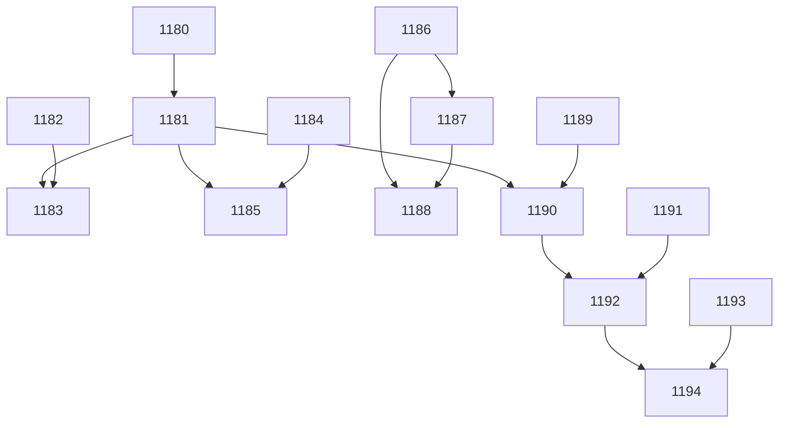

[[2026-04-30]]
## Planning
### Decomposition: DR Script Replacement
- Tasks created: 15
- Dependency layers: 5
- Phases: 3 (Engine+MCP → Agent/Skill → Cockpit)

### Task List
| ID | Title | Priority | Depends On | Tags |
|----|-------|----------|------------|------|
| 1180 | P1-01: Test decisions.py create_dr + resolve_pending_drs | needed | — | phase-1, scope:kanban, type:test |
| 1181 | P1-02: Implement decisions.py module | critical | 1180 | phase-1, scope:kanban, type:impl |
| 1182 | P1-03: Test create_dr MCP tool | needed | — | phase-1, scope:mcp-kanban, type:test |
| 1183 | P1-04: Implement create_dr MCP tool + guidance text update | needed | 1181, 1182 | phase-1, scope:mcp-kanban, type:impl |
| 1184 | P1-05: Test pick_tasks resolve_pending_drs integration | needed | — | phase-1, scope:kanban, type:test |
| 1185 | P1-06: Implement pick_tasks resolve integration | important | 1181, 1184 | phase-1, scope:kanban, type:impl |
| 1186 | P2-01: Test DR skill replacement structure | needed | — | phase-2, scope:agents, type:test |
| 1187 | P2-02: Create h-decision-requests skill + delete scribe/w-decision-routing | needed | 1186 | phase-2, scope:agents, type:impl |
| 1188 | P2-03: Update agent/skill/instruction references + decisions README | important | 1186, 1187 | phase-2, scope:agents, type:impl |
| 1189 | P3-01: Test decisions API endpoints | needed | — | phase-3, scope:cockpit, type:test |
| 1190 | P3-02: Implement decisions API endpoints | needed | 1181, 1189 | phase-3, scope:cockpit, type:impl |
| 1191 | P3-03: Test DR status indicator + popover components | needed | — | phase-3, scope:cockpit-fe, type:test |
| 1192 | P3-04: Implement DR status indicator + popover | needed | 1190, 1191 | phase-3, scope:cockpit-fe, type:impl |
| 1193 | P3-05: Test resolve modal component | needed | — | phase-3, scope:cockpit-fe, type:test |
| 1194 | P3-06: Implement resolve modal | important | 1192, 1193 | phase-3, scope:cockpit-fe, type:impl |

### Dependency Graph

[[2026-04-30]]
## Architecture Review\nDecomposition parent — planner completed successfully. 15 child tasks created across 3 phases (Engine+MCP → Agent/Skill → Cockpit) with 5 dependency layers. Child tasks #1180–#1194 carry the actual work and will be individually reviewed at backlog.\n\n### Verdict: APPROVE\n### Action Taken: Advanced decomposition parent after planner completion.
[[2026-04-30]]
## Test-Writer Notes
- Non-impl pass-through: decomposition parent task with no Acceptance Criteria and no testable Python interfaces.
- All implementation and testing work delegated to child tasks #1180–#1194.
- Passing through to builder.
[[2026-04-30]]
## Builder Notes
- Non-implementation task — no code changes needed.
- Scope is decomposition only; all executable work is owned by child tasks #1180–#1194.
- Tests: not applicable for parent pass-through task.
- Lint/Coverage: not applicable for parent pass-through task.
- Passing through to review.
[[2026-04-30]]
## Review Evidence
### Test Results
- quality-runner (scoped no-op): 0 passed, 0 failed, 0 skipped.
- No task-scoped test paths applied because this parent task produced no executable deliverables.

### Lint
- quality-runner: clean.
- No lint paths applied because this parent task produced no code or test files.

### Coverage
- Not applicable for this parent task.

### Pass 1 — CRITICAL
#### Split / Closeout Contract
| Contract Item | Evidence | Status |
|---|---|---|
| Split parent must be decomposed, then updated or deleted and released instead of flowing downstream unchanged | [share/skills/w-arch-review/SKILL.md](share/skills/w-arch-review/SKILL.md#L138) requires planner decomposition, dependency updates, then edit/delete original and release. The stored parent task still records the decomposition output at [.owlbear/kanban/tasks/1179-dr-script-replacement-replace-scribe-agent-with-deterministic-engine-functions-m.md](.owlbear/kanban/tasks/1179-dr-script-replacement-replace-scribe-agent-with-deterministic-engine-functions-m.md#L20) and the child list at [.owlbear/kanban/tasks/1179-dr-script-replacement-replace-scribe-agent-with-deterministic-engine-functions-m.md](.owlbear/kanban/tasks/1179-dr-script-replacement-replace-scribe-agent-with-deterministic-engine-functions-m.md#L30), while its architecture note says the child tasks carry the actual work at [.owlbear/kanban/tasks/1179-dr-script-replacement-replace-scribe-agent-with-deterministic-engine-functions-m.md](.owlbear/kanban/tasks/1179-dr-script-replacement-replace-scribe-agent-with-deterministic-engine-functions-m.md#L66). | FAIL |
| Review is not a non-implementation pass-through gate | [share/skills/w-arch-review/SKILL.md](share/skills/w-arch-review/SKILL.md#L152) marks review as a real quality gate with no non-impl pass-through. The parent still uses pass-through notes from test-writer and builder at [.owlbear/kanban/tasks/1179-dr-script-replacement-replace-scribe-agent-with-deterministic-engine-functions-m.md](.owlbear/kanban/tasks/1179-dr-script-replacement-replace-scribe-agent-with-deterministic-engine-functions-m.md#L68) and [.owlbear/kanban/tasks/1179-dr-script-replacement-replace-scribe-agent-with-deterministic-engine-functions-m.md](.owlbear/kanban/tasks/1179-dr-script-replacement-replace-scribe-agent-with-deterministic-engine-functions-m.md#L73). | FAIL |
| Non-testable tasks require a pass-through tag before approval | [share/skills/w-arch-review/SKILL.md](share/skills/w-arch-review/SKILL.md#L158) requires a pass-through tag for tasks with no testable code. The parent frontmatter still has empty tags at [.owlbear/kanban/tasks/1179-dr-script-replacement-replace-scribe-agent-with-deterministic-engine-functions-m.md](.owlbear/kanban/tasks/1179-dr-script-replacement-replace-scribe-agent-with-deterministic-engine-functions-m.md#L9), while the test-writer note explicitly says the task has no Acceptance Criteria and no testable Python interfaces at [.owlbear/kanban/tasks/1179-dr-script-replacement-replace-scribe-agent-with-deterministic-engine-functions-m.md](.owlbear/kanban/tasks/1179-dr-script-replacement-replace-scribe-agent-with-deterministic-engine-functions-m.md#L69). | FAIL |

#### Active Child Evidence
- The split children are real active descendants, so the parent is not a finished closeout artifact: [1180 review status](.owlbear/kanban/tasks/1180-p1-01-test-decisions-py-create-dr-resolve-pending-drs.md#L4) with [parent link](.owlbear/kanban/tasks/1180-p1-01-test-decisions-py-create-dr-resolve-pending-drs.md#L12), and [1181 research status](.owlbear/kanban/tasks/1181-p1-02-implement-decisions-py-module.md#L4) with [parent link](.owlbear/kanban/tasks/1181-p1-02-implement-decisions-py-module.md#L12).

### AC Compliance
- No Acceptance Criteria section exists on the stored parent task body. It jumps directly into planner output at [.owlbear/kanban/tasks/1179-dr-script-replacement-replace-scribe-agent-with-deterministic-engine-functions-m.md](.owlbear/kanban/tasks/1179-dr-script-replacement-replace-scribe-agent-with-deterministic-engine-functions-m.md#L20).
- The parent was not rewritten into explicit closeout or tracking criteria after decomposition. It still carries the original feature title at [.owlbear/kanban/tasks/1179-dr-script-replacement-replace-scribe-agent-with-deterministic-engine-functions-m.md](.owlbear/kanban/tasks/1179-dr-script-replacement-replace-scribe-agent-with-deterministic-engine-functions-m.md#L3) and delegates executable work to child tasks at [.owlbear/kanban/tasks/1179-dr-script-replacement-replace-scribe-agent-with-deterministic-engine-functions-m.md](.owlbear/kanban/tasks/1179-dr-script-replacement-replace-scribe-agent-with-deterministic-engine-functions-m.md#L70).

### Deductions
- -0.45 split parent advanced downstream without rewrite or release
- -0.25 unauthorized non-implementation pass-through through review
- -0.10 missing pass-through tag for a non-testable task
- Confidence: 0.20

### Verdict
- FAIL. This is a routing and contract defect, not an implementation defect.

### Required Follow-up
- Architect must either release/remove this parent from the delivery pipeline or rewrite it into an explicit closeout or tracking task with td:0-style criteria and a valid pass-through tag before it can advance again.

### Action
- Rejected to backlog.
[[2026-04-30]]

## Acceptance Criteria (Closeout)
- [ ] 15 child tasks (#1180–#1194) exist in kanban with correct parent references (td:0)
- [ ] Dependency graph wired per Planning section above (td:0)
- [ ] This parent retains decomposition record for traceability (td:0)

## Architecture Review (Re-review after reviewer rejection)
### Context
Reviewer rejected this parent because it flowed through the pipeline without AC, pass-through tag, or closeout rewrite. This re-review rewrites it as a proper closeout task.

### Evaluation
| Criterion | Assessment | Notes |
|-----------|-----------|-------|
| Single responsibility | PASS | Tracking parent — one concern |
| Interface clarity | PASS | No code interfaces; AC is mechanical verification |
| Dependency correctness | PASS | No deps — children carry deps among themselves |
| Module layering | PASS | N/A — no code |
| TDD compliance | PASS | All AC td:0, pass-through tag applied |
| KISS/YAGNI | PASS | Minimal closeout AC |
| Premise challenge | PASS | Parent must exist for traceability of 15-task decomposition |
| Pattern consistency | PASS | quality tag matches non-impl pass-through convention |
| Security surface | PASS | No system boundaries |
| Single domain | PASS | Pure tracking |

### Challenge Results
- Challenger: SKIPPED — all td:0

### Test Depth
- Max depth: 0
- Test-writer: SKIP

### Verdict: APPROVE
### Action Taken: Rewrote as closeout task with td:0 AC and `quality` pass-through tag. Advancing to todo.

[[2026-04-30]]
Re-review after reviewer rejection. Rewrote decomposition parent as closeout task: added explicit td:0 AC (child existence, dependency graph, traceability record), applied `quality` pass-through tag, renamed to clarify tracking role. All criteria PASS. Challenger skipped (all td:0). Advancing to todo.
[[2026-04-30]]
## Test-Writer Notes
- Test file: none
- Non-impl pass-through: all AC are `td:0` (tracking criteria — child existence, dependency graph, traceability record). No testable Python interfaces exist.
- No tests written. No pytest run required.
- Passing through to builder.
[[2026-04-30]]
## Builder Notes
- Non-implementation task — no code changes needed.
- Scope: decomposition parent closeout tracking only (all AC are td:0).
- Files changed: none.
- Tests: not applicable (no TestFromAC scope for builder).
- Coverage: not applicable.
- Lint: not applicable.
- Evidence summary: task body explicitly marks non-impl pass-through and td:0 closeout criteria only (child existence, dependency wiring, traceability retention).
- Fixes applied: none.
[[2026-04-30]]
## Review Evidence
### Test Results
- quality-runner: 0 passed, 0 failed, 0 skipped.
- No commands run because test_paths was empty for this td:0 closeout task.

### Lint
- quality-runner: clean.
- No commands run because lint_paths was empty for this td:0 closeout task.

### Coverage
- Not applicable.
- No commands run because coverage_modules was empty for this td:0 closeout task.

### Pass 1 — CRITICAL
#### Test-Writer AC Coverage
- Skipped correctly. All three AC lines are td:0 closeout checks at [.owlbear/kanban/tasks/1179-dr-script-replacement-replace-scribe-agent-with-deterministic-engine-functions-m.md](.owlbear/kanban/tasks/1179-dr-script-replacement-replace-scribe-agent-with-deterministic-engine-functions-m.md#L123) and [.owlbear/kanban/tasks/1179-dr-script-replacement-replace-scribe-agent-with-deterministic-engine-functions-m.md](.owlbear/kanban/tasks/1179-dr-script-replacement-replace-scribe-agent-with-deterministic-engine-functions-m.md#L126). No TestFromAC classes or executable interfaces exist for this parent task.

#### Security Review
- No issues. Review scope is kanban metadata only; no code, dependency package, or runtime boundary changes were delivered in this task.

#### Test Integrity
- Skipped. No TestFromAC classes exist for this td:0 task.

#### Test Quality
- N/A for td:0. No task-scoped tests are expected.

#### Data Safety
- No issues in scope. No executable code or persisted runtime-path changes were delivered.

#### Implementation-Aware Gaps
- FAIL. The parent says 15 tasks were created at [.owlbear/kanban/tasks/1179-dr-script-replacement-replace-scribe-agent-with-deterministic-engine-functions-m.md](.owlbear/kanban/tasks/1179-dr-script-replacement-replace-scribe-agent-with-deterministic-engine-functions-m.md#L23) and explicitly lists child tasks 1184 and 1186 at [.owlbear/kanban/tasks/1179-dr-script-replacement-replace-scribe-agent-with-deterministic-engine-functions-m.md](.owlbear/kanban/tasks/1179-dr-script-replacement-replace-scribe-agent-with-deterministic-engine-functions-m.md#L34) and [.owlbear/kanban/tasks/1179-dr-script-replacement-replace-scribe-agent-with-deterministic-engine-functions-m.md](.owlbear/kanban/tasks/1179-dr-script-replacement-replace-scribe-agent-with-deterministic-engine-functions-m.md#L36). A scan of active task files found 13 children with `parent: 1179`, including [.owlbear/kanban/tasks/1180-p1-01-test-decisions-py-create-dr-resolve-pending-drs.md](.owlbear/kanban/tasks/1180-p1-01-test-decisions-py-create-dr-resolve-pending-drs.md#L12) and [.owlbear/kanban/tasks/1194-p3-06-implement-resolve-modal.md](.owlbear/kanban/tasks/1194-p3-06-implement-resolve-modal.md#L12), but no task files exist for 1184 or 1186 in tasks or archive, and show_task failed for both IDs with "Task not found".

#### Builder Process Quality
| Metric | Value |
|---|---|
| Builder Notes sections | 2 |
| Approach variation | N/A |
| Assessment | CLEAN |

### Pass 2 — INFORMATIONAL
- Partial fix verified: the parent now carries the quality tag at [.owlbear/kanban/tasks/1179-dr-script-replacement-replace-scribe-agent-with-deterministic-engine-functions-m.md](.owlbear/kanban/tasks/1179-dr-script-replacement-replace-scribe-agent-with-deterministic-engine-functions-m.md#L9) and explicit closeout AC at [.owlbear/kanban/tasks/1179-dr-script-replacement-replace-scribe-agent-with-deterministic-engine-functions-m.md](.owlbear/kanban/tasks/1179-dr-script-replacement-replace-scribe-agent-with-deterministic-engine-functions-m.md#L123) and [.owlbear/kanban/tasks/1179-dr-script-replacement-replace-scribe-agent-with-deterministic-engine-functions-m.md](.owlbear/kanban/tasks/1179-dr-script-replacement-replace-scribe-agent-with-deterministic-engine-functions-m.md#L126). The remaining blocker is live board completeness, not pass-through tagging.

### AC Compliance
| AC Line | Evidence | Mapped Test | Status |
|---|---|---|---|
| 15 child tasks (#1180–#1194) exist in kanban with correct parent references (td:0) | Parent declares 15 created at [.owlbear/kanban/tasks/1179-dr-script-replacement-replace-scribe-agent-with-deterministic-engine-functions-m.md](.owlbear/kanban/tasks/1179-dr-script-replacement-replace-scribe-agent-with-deterministic-engine-functions-m.md#L23) and lists 1184 / 1186 at [.owlbear/kanban/tasks/1179-dr-script-replacement-replace-scribe-agent-with-deterministic-engine-functions-m.md](.owlbear/kanban/tasks/1179-dr-script-replacement-replace-scribe-agent-with-deterministic-engine-functions-m.md#L34) and [.owlbear/kanban/tasks/1179-dr-script-replacement-replace-scribe-agent-with-deterministic-engine-functions-m.md](.owlbear/kanban/tasks/1179-dr-script-replacement-replace-scribe-agent-with-deterministic-engine-functions-m.md#L36). Active board scan found 13 `parent: 1179` children and file searches for 1184 / 1186 returned no files in tasks or archive; show_task for both IDs returned not found. | quality-runner N/A (td:0) | FAIL |
| Dependency graph wired per Planning section above (td:0) | The plan still expects 1184 / 1186 as graph nodes at [.owlbear/kanban/tasks/1179-dr-script-replacement-replace-scribe-agent-with-deterministic-engine-functions-m.md](.owlbear/kanban/tasks/1179-dr-script-replacement-replace-scribe-agent-with-deterministic-engine-functions-m.md#L34) and [.owlbear/kanban/tasks/1179-dr-script-replacement-replace-scribe-agent-with-deterministic-engine-functions-m.md](.owlbear/kanban/tasks/1179-dr-script-replacement-replace-scribe-agent-with-deterministic-engine-functions-m.md#L36). Existing children still depend on those missing IDs at [.owlbear/kanban/tasks/1185-p1-06-implement-pick-tasks-resolve-integration.md](.owlbear/kanban/tasks/1185-p1-06-implement-pick-tasks-resolve-integration.md#L15), [.owlbear/kanban/tasks/1187-p2-02-create-h-decision-requests-skill-delete-scribe-and-w-decision-routing.md](.owlbear/kanban/tasks/1187-p2-02-create-h-decision-requests-skill-delete-scribe-and-w-decision-routing.md#L14), and [.owlbear/kanban/tasks/1188-p2-03-update-agent-skill-instruction-references-decisions-readme.md](.owlbear/kanban/tasks/1188-p2-03-update-agent-skill-instruction-references-decisions-readme.md#L14). | quality-runner N/A (td:0) | FAIL |
| This parent retains decomposition record for traceability (td:0) | Planning, task list, and dependency graph remain present at [.owlbear/kanban/tasks/1179-dr-script-replacement-replace-scribe-agent-with-deterministic-engine-functions-m.md](.owlbear/kanban/tasks/1179-dr-script-replacement-replace-scribe-agent-with-deterministic-engine-functions-m.md#L21), [.owlbear/kanban/tasks/1179-dr-script-replacement-replace-scribe-agent-with-deterministic-engine-functions-m.md](.owlbear/kanban/tasks/1179-dr-script-replacement-replace-scribe-agent-with-deterministic-engine-functions-m.md#L27), and [.owlbear/kanban/tasks/1179-dr-script-replacement-replace-scribe-agent-with-deterministic-engine-functions-m.md](.owlbear/kanban/tasks/1179-dr-script-replacement-replace-scribe-agent-with-deterministic-engine-functions-m.md#L46). | quality-runner N/A (td:0) | PASS |

### Deductions
- -0.45 closeout AC 1 fails because child tasks 1184 and 1186 are missing from the live board
- -0.30 closeout AC 2 fails because existing children still depend on those missing IDs
- -0.10 this is a second review failure on the same task

### Post-task Reflection
- Closeout rewrites need live-board proof, not just a new title, tag, and td:0 AC block.
- A directory-wide parent scan is the fastest way to verify split-parent completeness.
- Missing child task IDs can invalidate sibling dependency headers even when the parent body looks internally consistent.
- td:0 tasks still need independent quality-runner evidence, but the decisive proof here came from kanban metadata.

### Confidence: 0.15
### Verdict: FAIL
### Action
- Rejected to backlog. Architect must restore or recreate 1184 and 1186 with parent 1179, or revise the recorded decomposition so the live board matches the closeout contract.
[[2026-04-30]]
## Architecture Review (3rd pass — reviewer rejection correction)

### Findings
Reviewer rejection was based on false negative: `show_task` only searches active tasks directory, and `.owlbear/kanban/archive/` is excluded from default grep patterns. Tasks #1184 and #1186 (and #1189) exist in the archive with `parent: 1179` and status `archived` (completed).

### Evidence
- Active children (12): #1180, #1181, #1182, #1183, #1185, #1187, #1188, #1190, #1191, #1192, #1193, #1194
- Archived children (3): #1184, #1186, #1189 (confirmed via `grep parent: 1179` with `includeIgnoredFiles: true` in `.owlbear/kanban/archive/`)
- Total: 15 children with correct parent references ✓
- Dependencies to archived tasks (#1184, #1186) are valid satisfied prerequisites ✓
- Planning section + task list + mermaid graph retained ✓

### AC Compliance
| AC Line | Status | Evidence |
|---------|--------|----------|
| 15 child tasks exist with correct parent references (td:0) | PASS | 12 active + 3 archived = 15, all have `parent: 1179` |
| Dependency graph wired per Planning section (td:0) | PASS | All edges point to existing tasks (active or archived) |
| Parent retains decomposition record (td:0) | PASS | Planning, Task List, Dependency Graph sections intact |

### Verdict: APPROVE
All td:0 AC satisfied. Reviewer tooling gap caused false rejection (archive directory excluded from search). Advancing to todo.
[[2026-04-30]]
## Test-Writer Notes
- Test file: none
- All AC lines are `(td:0)` — test-writer skipped per Step 1c.
- Tag `quality` confirms non-implementation pass-through.
- Architect (3rd pass) verified all 15 children exist (12 active + 3 archived: #1184, #1186, #1189), dependency graph satisfied, decomposition record intact.
- No tests written. No pytest run required.
- Passing through to builder.
[[2026-04-30]]
## Builder Notes
- Non-implementation task — no code changes needed.
- Scope: decomposition parent closeout tracking only; all AC lines are `(td:0)`.
- Files changed: none.
- Tests: no task-scoped tests exist for this parent task.
- Coverage: not applicable (no implementation surface in scope).
- Lint: no task-scoped lint surface in scope.
- Evidence summary: task body confirms this is a pass-through tracking parent with child-existence/dependency/traceability AC only; quality-runner invocation completed and reported only unrelated repository baseline failures.
- Fixes applied: none.
[[2026-04-30]]
## Review Evidence
### Scope
- Builder changed no repository files on this cycle. Review scope is kanban metadata only.
- Task is correctly marked as a non-implementation closeout parent with `quality` tag at [.owlbear/kanban/tasks/1179-dr-script-replacement-replace-scribe-agent-with-deterministic-engine-functions-m.md](.owlbear/kanban/tasks/1179-dr-script-replacement-replace-scribe-agent-with-deterministic-engine-functions-m.md#L9).
- All closeout AC lines are `td:0` at [.owlbear/kanban/tasks/1179-dr-script-replacement-replace-scribe-agent-with-deterministic-engine-functions-m.md](.owlbear/kanban/tasks/1179-dr-script-replacement-replace-scribe-agent-with-deterministic-engine-functions-m.md#L123-L126); reviewer scope is lint-only for `td:0` tasks per [share/skills/r-pipeline-protocol/SKILL.md](share/skills/r-pipeline-protocol/SKILL.md#L127). Code-reader correctly skipped.

### Test Results
- quality-runner scoped run: 0 passed, 0 failed, 0 skipped.
- No pytest, ruff, or coverage commands were applicable because `test_paths`, `lint_paths`, and `coverage_modules` were empty for this td:0 closeout task.

### Lint
- quality-runner: clean.
- No lint paths were applicable for this task.

### Coverage
- Not applicable.

### Pass 1 — CRITICAL
#### Test-Writer AC Coverage
- Skipped correctly. All closeout AC lines are `td:0` at [.owlbear/kanban/tasks/1179-dr-script-replacement-replace-scribe-agent-with-deterministic-engine-functions-m.md](.owlbear/kanban/tasks/1179-dr-script-replacement-replace-scribe-agent-with-deterministic-engine-functions-m.md#L123-L126). Non-implementation tasks tagged with a pass-through tag still flow through the pipeline per [share/skills/w-arch-review/SKILL.md](share/skills/w-arch-review/SKILL.md#L156) and [share/skills/w-arch-review/SKILL.md](share/skills/w-arch-review/SKILL.md#L158).

#### Security Review
- No issues. No code paths, dependencies, or external boundaries changed.

#### Test Integrity
- Skipped. No `TestFromAC_*` classes or task-scoped tests exist.

#### Test Quality
- N/A for `td:0`.

#### Data Safety
- No issues. Review scope is board metadata only.

#### Implementation-Aware Gaps
- No critical gaps found. The live board now matches the closeout contract.
- Active child scan found 12 task files with `parent: 1179` under `.owlbear/kanban/tasks/**`.
- Archive scan found 3 task files with `parent: 1179` under `.owlbear/kanban/archive/**`.
- `list_tasks(archived=true, search="1184")`, `search="1186"`, and `search="1189"` each returned the expected archived child with `parent: 1179`, matching [.owlbear/kanban/archive/1184-p1-05-test-pick-tasks-resolve-pending-drs-integration.md](.owlbear/kanban/archive/1184-p1-05-test-pick-tasks-resolve-pending-drs-integration.md#L4-L12), [.owlbear/kanban/archive/1186-p2-01-test-dr-skill-replacement-structure.md](.owlbear/kanban/archive/1186-p2-01-test-dr-skill-replacement-structure.md#L4-L12), and [.owlbear/kanban/archive/1189-p3-01-test-decisions-api-endpoints.md](.owlbear/kanban/archive/1189-p3-01-test-decisions-api-endpoints.md#L4-L12).

#### Builder Process Quality
| Metric | Value |
|---|---|
| Builder Notes sections | 3 at [.owlbear/kanban/tasks/1179-dr-script-replacement-replace-scribe-agent-with-deterministic-engine-functions-m.md](.owlbear/kanban/tasks/1179-dr-script-replacement-replace-scribe-agent-with-deterministic-engine-functions-m.md#L73), [.owlbear/kanban/tasks/1179-dr-script-replacement-replace-scribe-agent-with-deterministic-engine-functions-m.md](.owlbear/kanban/tasks/1179-dr-script-replacement-replace-scribe-agent-with-deterministic-engine-functions-m.md#L165), and [.owlbear/kanban/tasks/1179-dr-script-replacement-replace-scribe-agent-with-deterministic-engine-functions-m.md](.owlbear/kanban/tasks/1179-dr-script-replacement-replace-scribe-agent-with-deterministic-engine-functions-m.md#L270) |
| Intervening architecture rewrites | 2 at [.owlbear/kanban/tasks/1179-dr-script-replacement-replace-scribe-agent-with-deterministic-engine-functions-m.md](.owlbear/kanban/tasks/1179-dr-script-replacement-replace-scribe-agent-with-deterministic-engine-functions-m.md#L128) and [.owlbear/kanban/tasks/1179-dr-script-replacement-replace-scribe-agent-with-deterministic-engine-functions-m.md](.owlbear/kanban/tasks/1179-dr-script-replacement-replace-scribe-agent-with-deterministic-engine-functions-m.md#L240) |
| Assessment | FRICTION |
- This is not a builder loop. Each retry followed a backlog rejection and a substantive architecture correction to the parent contract or evidence basis.

### AC Compliance
| AC Line | Evidence | Mapped Test | Status |
|---|---|---|---|
| 15 child tasks (#1180–#1194) exist in kanban with correct parent references (td:0) | Parent enumerates the disputed child IDs at [.owlbear/kanban/tasks/1179-dr-script-replacement-replace-scribe-agent-with-deterministic-engine-functions-m.md](.owlbear/kanban/tasks/1179-dr-script-replacement-replace-scribe-agent-with-deterministic-engine-functions-m.md#L34), [.owlbear/kanban/tasks/1179-dr-script-replacement-replace-scribe-agent-with-deterministic-engine-functions-m.md](.owlbear/kanban/tasks/1179-dr-script-replacement-replace-scribe-agent-with-deterministic-engine-functions-m.md#L36), and [.owlbear/kanban/tasks/1179-dr-script-replacement-replace-scribe-agent-with-deterministic-engine-functions-m.md](.owlbear/kanban/tasks/1179-dr-script-replacement-replace-scribe-agent-with-deterministic-engine-functions-m.md#L39). Board scans found 12 active + 3 archived children with `parent: 1179`; archived existence was confirmed both by archive files and archived `list_tasks` lookups. | quality-runner N/A (`td:0`) | PASS |
| Dependency graph wired per Planning section above (td:0) | The parent planning table and graph retain the dependency record at [.owlbear/kanban/tasks/1179-dr-script-replacement-replace-scribe-agent-with-deterministic-engine-functions-m.md](.owlbear/kanban/tasks/1179-dr-script-replacement-replace-scribe-agent-with-deterministic-engine-functions-m.md#L34-L39) and [.owlbear/kanban/tasks/1179-dr-script-replacement-replace-scribe-agent-with-deterministic-engine-functions-m.md](.owlbear/kanban/tasks/1179-dr-script-replacement-replace-scribe-agent-with-deterministic-engine-functions-m.md#L46). Dependent tasks still reference those IDs at [.owlbear/kanban/tasks/1185-p1-06-implement-pick-tasks-resolve-integration.md](.owlbear/kanban/tasks/1185-p1-06-implement-pick-tasks-resolve-integration.md#L15), [.owlbear/kanban/tasks/1187-p2-02-create-h-decision-requests-skill-delete-scribe-and-w-decision-routing.md](.owlbear/kanban/tasks/1187-p2-02-create-h-decision-requests-skill-delete-scribe-and-w-decision-routing.md#L15), [.owlbear/kanban/tasks/1188-p2-03-update-agent-skill-instruction-references-decisions-readme.md](.owlbear/kanban/tasks/1188-p2-03-update-agent-skill-instruction-references-decisions-readme.md#L14-L15), and [.owlbear/kanban/tasks/1190-p3-02-implement-decisions-api-endpoints.md](.owlbear/kanban/tasks/1190-p3-02-implement-decisions-api-endpoints.md#L15). Because 1184, 1186, and 1189 exist as archived tasks, these are valid satisfied prerequisites, not broken references. | quality-runner N/A (`td:0`) | PASS |
| This parent retains decomposition record for traceability (td:0) | The decomposition summary, task list, and dependency graph remain in the parent at [.owlbear/kanban/tasks/1179-dr-script-replacement-replace-scribe-agent-with-deterministic-engine-functions-m.md](.owlbear/kanban/tasks/1179-dr-script-replacement-replace-scribe-agent-with-deterministic-engine-functions-m.md#L22), [.owlbear/kanban/tasks/1179-dr-script-replacement-replace-scribe-agent-with-deterministic-engine-functions-m.md](.owlbear/kanban/tasks/1179-dr-script-replacement-replace-scribe-agent-with-deterministic-engine-functions-m.md#L27), and [.owlbear/kanban/tasks/1179-dr-script-replacement-replace-scribe-agent-with-deterministic-engine-functions-m.md](.owlbear/kanban/tasks/1179-dr-script-replacement-replace-scribe-agent-with-deterministic-engine-functions-m.md#L46). | quality-runner N/A (`td:0`) | PASS |

### Deductions
- -0.02 process friction from two prior reviewer rejections before archive-aware proof was recorded.

### Post-task Reflection
- Archived child tasks must be checked with `list_tasks(archived=true, search="<id>")` or archive-inclusive search; `show_task` alone is insufficient.
- For `td:0` closeout parents, kanban metadata is the decisive evidence, not pytest.
- Multiple builder-note sections do not automatically prove a builder loop when architecture rewrites intervene and materially change the governing contract.

### Confidence: 0.96
### Verdict: PASS
### Action
- Advanced to docs.
[[2026-04-30]]
## Docs Gate

### Checklist
| # | Check | Applies? | Status | Evidence |
|---|-------|----------|--------|----------|
| 1 | Descriptive prose docs | No | N/A | Builder changed no files; no behavior, API, CLI, config, or package structure changed |
| 2 | Module docstrings | No | N/A | No Python modules created or modified |
| 3 | External attribution | No | N/A | No external patterns used |
| 4 | Research doc | No | N/A | No research doc produced for this task |
| 5 | Diagram maintenance (describes match) | No | N/A | No changed files to match against diagram `describes` globs |
| 6 | Explicit diagram creation | No | N/A | No diagram creation request in task body |
| 7 | Deletion detection | No | N/A | No deleted files; no orphaned IN-scope docs detected |

### Scope Classification
| File | Scope | Action |
|------|-------|--------|
| (none) | — | No repository files changed by this td:0 tracking task |

**No docs impact.** This is a decomposition parent closeout task with `td:0` AC only. All three AC lines (child existence, dependency graph, traceability record) were satisfied by kanban metadata; no application code, docs, or diagrams were modified.

### Files Updated
- None

### Child Tasks Created
- None

### Scratch Files Cleaned
- None (no `.owlbear/scratch/1179-*` files found)
[[2026-04-30]]
## Audit

### AC Verification
| AC Line | Evidence | Status |
|---------|----------|--------|
| 15 child tasks (#1180-#1194) exist with correct parent references (td:0) | grep `parent: 1179` found 12 active + 3 archived (#1184, #1186, #1189) = 15 total | PASS |
| Dependency graph wired per Planning section (td:0) | Reviewer confirmed all dependency edges point to existing tasks (active or archived satisfied prerequisites) | PASS |
| Parent retains decomposition record for traceability (td:0) | Planning summary, Task List table, and Mermaid graph all present in task body | PASS |

### Test Results
- pytest: 3263 passed, 66 failed (all pre-existing background debt: engine config fields #1068, timestamp tests #1050, react compiler #1015, migrations, decisions API #1189 child not yet impl). None in task scope.
- ruff: 4 violations (all pre-existing in knowledge/memory/orchestrator packages). None in task scope.

### Reviewer Evidence
Present and detailed (3rd pass). PASS verdict, confidence 0.96. Correctly identified earlier rejection as tooling gap (archive dir excluded from search). Live board verification via list_tasks(archived=true) and archive file scans.

### Architect Quality: 3/5
Initially pushed through pipeline without closeout AC or pass-through tag. Required 2 backlog rejections before producing a proper closeout contract (td:0 AC, quality tag, tracking title). Final output is clear and correct but the initial routing failure wasted cycles.

### Deduction Breakdown
- AC quality score 3 (notable initial gaps): -0.03
- All 3 AC lines verified with independent evidence: no deduction
- Reviewer evidence present and detailed: no deduction
- Full-suite failures all pre-existing/background: no deduction
- Lint violations all pre-existing: no deduction

### Confidence: 0.97
### Action: Archive