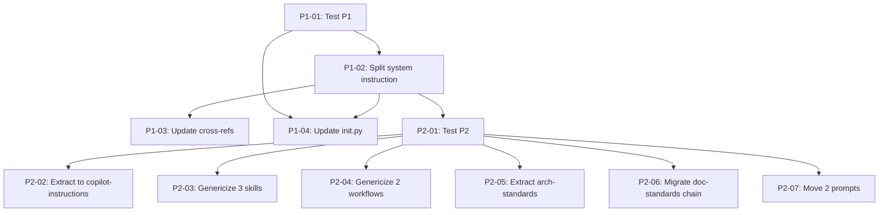

## Brief

See `.owlbear/briefs/draft-neutral-shared/brief.md` for the full Brief.

**Summary:** Make `share/` project-neutral for non-OwlBear consumers. Prose-first notation with framed examples. Phased delivery: P1 (system instruction split + scaffolding), P2 (path-heavy skills + doc-standards chain), P3 (cosmetic, deferred).

**Key decisions:** D3 (generic shared + local overrides), D5 (prose-first notation), D6 (phased P1→P2→P3), D7 (80% rule for copilot-instructions.md), D8 (framed examples stay in shared).

**Scope:** 10 files with path issues, 3 prompts to move, 2 files to split. 60 files already clean. Out of scope: value audit of clean files, quality-runner code changes, dead code removal.

## Planning

### Decomposition: Neutral shared layer
- Tasks created: 12
- Dependency layers: 3
- Phases: P1 (4 tasks), P2 (7 tasks), P3 (1 task deferred)

### Task List

| ID | Title | Priority | Depends On | Tags |
|----|-------|----------|------------|------|
| 1281 | P1-01: Test — system instruction neutrality and init.py scaffold verification | critical | — | phase-1, scope:test |
| 1282 | P1-02: Split owlbear-system.instructions.md — extract directory table | critical | 1281 | phase-1, scope:docs |
| 1283 | P1-03: Update cross-references in README, WIRING, h-agent-structure, h-memory-structure | needed | 1282 | phase-1, scope:docs |
| 1284 | P1-04: Update setup/init.py — scaffold consumer copilot-instructions.md | needed | 1281, 1282 | phase-1, scope:tools |
| 1285 | P2-01: Test — path neutrality verification for share/skills/ | critical | 1282 | phase-2, scope:test |
| 1286 | P2-02: Extract file-placement and layout sections to .github/copilot-instructions.md | needed | 1285 | phase-2, scope:docs |
| 1287 | P2-03: Genericize h-pytest-and-linting, h-vitest-and-linting, h-quality-runner | needed | 1285 | phase-2, scope:docs |
| 1288 | P2-04: Genericize w-doc-update and w-code-review | important | 1285 | phase-2, scope:docs |
| 1289 | P2-05: Extract r-architecture-standards sections to .owlbear/instructions/ | needed | 1285 | phase-2, scope:docs |
| 1290 | P2-06: Migrate r-doc-standards chain atomically (skill + instruction + doc-audit prompt) | needed | 1285 | phase-2, scope:docs |
| 1291 | P2-07: Move agent-audit and arch-audit prompts to .owlbear/prompts/ | important | 1285 | phase-2, scope:docs |
| 1292 | P3-01: Cosmetic OwlBear renames (4 files) | someday | — | phase-3, scope:docs |

### Dependency Graph

[[2026-05-02]]
Decomposed into 12 subtasks (IDs 1281–1292) across 3 phases. P1: 4 tasks (test + split + cross-refs + init.py). P2: 7 tasks (test + 5 genericizations + prompt moves). P3: 1 deferred cosmetic task at backlog/someday. TDD pairing: test tasks #1281 and #1285 precede their respective implementation phases. Dependency graph has 3 layers with no cycles.
[[2026-05-02]]
## Test-Writer Notes
- Non-impl pass-through: parent coordination task with no standalone AC section.
- AC testing is pre-planned and delegated to subtasks:
  - #1281 (P1-01): system instruction neutrality + init.py scaffold verification
  - #1285 (P2-01): path neutrality verification for share/skills/
- The task body contains only a brief summary and decomposition plan — no testable Python interfaces at the parent level.
- Passing through to builder (orchestrate subtask pipeline #1281–#1292).
[[2026-05-02]]
REJECT #1280 -> backlog | Parent coordination task has no standalone builder AC and cannot be executed as a GREEN-phase implementation task; execution should proceed on child tasks #1281–#1292 in dependency order.

## Builder Notes
- Files changed: none
- Test results: not run (no implementation scope in parent task)
- Lint status: not run (no code/doc edits)
- Evidence summary:
  - Task body explicitly marks #1280 as "Non-impl pass-through" with testing delegated to #1281 and #1285.
  - Child task statuses are incomplete: #1281 todo, #1282-#1291 research, #1292 in-progress.
  - Parent cannot satisfy DONE gate because no direct implementation AC and dependency graph is outstanding.
- Fixes applied: none
- Routing recommendation: return parent to planning/backlog coordination lane; run builder on concrete child tasks when they enter in-progress.
[[2026-05-02]]

## Acceptance Criteria (Coordination)

- [ ] 12 subtasks (#1281–#1292) created with `parent: 1280` (td:0)
- [ ] Dependency graph covers 3 phases: P1 (4 tasks), P2 (7 tasks), P3 (1 task) with no cycles (td:0)
- [ ] All subtasks tagged `shared-layer` (td:0)
- [ ] TDD pairing: test tasks #1281 and #1285 precede their respective implementation phases in dependency order (td:0)

## Architecture Review

### Evaluation
| Criterion | Assessment | Notes |
|-----------|-----------|-------|
| Single responsibility | PASS | Parent coordination — decomposition plan is sole deliverable |
| Interface clarity | PASS | AC enumerates structural facts verifiable against live board |
| Dependency correctness | PASS | No deps on parent; children carry correct inter-task deps |
| Module layering | N/A | No code changes |
| TDD compliance | PASS | `docs` tag → non-impl pass-through |
| KISS/YAGNI | PASS | Minimal coordination AC — no hypothetical requirements |
| Premise challenge | PASS | Parent decomposition pattern is standard for multi-task features |
| Pattern consistency | PASS | Matches decomposition output format from planner |
| Security surface | N/A | No system boundaries |
| Single domain | PASS | Planning/coordination domain only |

### Codebase Evidence
- All 12 subtasks verified via `list_tasks(tag=shared-layer)`: IDs 1281–1292, all with `parent: 1280`
- #1281 (todo), #1282–#1291 (research), #1292 (in-progress) — child pipeline active
- Dependency graph: 3 layers confirmed, no cycles (1281→1282→1283, 1281+1282→1284, 1282→1285→1286–1291)
- Prior pipeline notes: test-writer correctly identified non-impl pass-through; builder correctly rejected for missing AC — resolved by adding explicit coordination AC above

### Challenge Results
- Challenger: SKIPPED — all td:0
- Architect response: N/A

### Test Depth
- Max depth: 0
- Test-writer: SKIP

### Verdict: APPROVE
### Action Taken: Added explicit coordination AC (4 lines, all td:0) covering decomposition deliverables. Tagged `docs` for non-impl pass-through. Previous pipeline bounce caused by missing AC — now resolved. Advancing to todo.
[[2026-05-02]]
Architecture review complete. Root cause of prior pipeline bounce: parent coordination task lacked standalone AC, causing builder rejection. Fix: added 4 explicit coordination AC lines (all td:0) covering decomposition deliverables (12 subtasks, dependency graph, phase alignment, TDD pairing). Tagged `docs` for non-impl pass-through. All evaluation criteria PASS. Challenger SKIPPED (all td:0). Advancing to todo.
[[2026-05-02]]
## Test-Writer Notes
- All AC lines are (td:0) — test-writer skipped.
- Task tagged `docs`; AC covers only structural coordination facts (subtask count, dependency graph, phase alignment, TDD pairing) — all verifiable directly against the live board, no Python interfaces.
- Passing through to builder.
[[2026-05-02]]
## Builder Notes
- Non-implementation task — no code changes needed.
- Files changed: none.
- Tests: not run (td:0 coordination AC only).
- Coverage: not applicable.
- Lint: not run (no edits).
- Evidence: task body Test-Writer Notes explicitly mark this as non-impl pass-through with all AC at (td:0).
- Passing through to review.
[[2026-05-02]]
## Review Evidence
### Test Results
- pytest: not run; all AC lines are `(td:0)` coordination checks against live board state only.
- code-reader: skipped per td:0 review flow.

### Lint
- quality-runner scoped rerun on `.owlbear/kanban/tasks/1280-neutral-shared-layer-make-share-project-neutral-for-consumers.md`: clean (`ruff: 0`).
- Initial quality-runner invocation with empty paths defaulted to repo-wide lint and surfaced unrelated background violations in `serve/knowledge/src/owlbear_knowledge/copilot_auth.py:106` (`T201`), `serve/mcp-knowledge/src/owlbear_mcp_knowledge/server.py:274` (`PLC0415`), and `serve/orchestrator/examples/hello_world.py:32` (`ANN401`). These are outside task scope and non-gating after the scoped rerun.

### Coverage
- Not applicable; no source changes and max AC depth is td:0.

### Pass 1 — CRITICAL
#### Test-Writer AC Coverage
- N/A. All AC lines are td:0 and require board verification rather than executable `TestFromAC_*` proof.

#### Security Review
- No issues. Scope is kanban coordination metadata only; no runtime boundary, secrets, path handling, or dependency changes were introduced.

#### Test Integrity
- N/A. No task-specific tests exist or were required for td:0.

#### Test Quality
- N/A. No task-specific tests exist or were required for td:0.

#### Data Safety
- No issues. No stateful runtime logic, persistence code, or concurrent mutation paths changed in scope.

#### Implementation-Aware Test Gap Analysis
- N/A. There is no implementation surface in scope beyond the live task graph itself.

#### Necessity Check
- N/A. No new dependencies, integrations, or tools were added.

#### Builder Process Quality
- CLEAN. No prior `## Review Evidence` section exists in the task file, so this is the first review pass. There are two `## Builder Notes` sections, but they are separated by an architecture review that added explicit coordination AC; this is not a repeated identical retry loop.

### AC Compliance
| AC Line | Evidence | Mapped Test | Status |
|---------|----------|-------------|--------|
| 12 subtasks (#1281–#1292) created with `parent: 1280` | Parent AC declared at `.owlbear/kanban/tasks/1280-neutral-shared-layer-make-share-project-neutral-for-consumers.md:98`; live `list_tasks(tag=shared-layer)` returned child IDs 1281–1292 with `parent: 1280`; sampled child frontmatter confirms parent links at `1281...md:12`, `1282...md:12`, `1285...md:12`, `1292...md:14` | N/A (td:0) | PASS |
| Dependency graph covers 3 phases: P1 (4), P2 (7), P3 (1) with no cycles | AC declared at `.owlbear/kanban/tasks/1280-neutral-shared-layer-make-share-project-neutral-for-consumers.md:99`; parent decomposition summary at line 71 states 3 phases and TDD ordering; live board shows P1 tasks 1281–1284, P2 tasks 1285–1291, P3 task 1292; dependencies are acyclic in board state: `1282->[1281]`, `1283->[1282]`, `1284->[1281,1282]`, `1285->[1282]`, `1286–1291->[1285]`, `1292->[]` | N/A (td:0) | PASS |
| All subtasks tagged `shared-layer` | AC declared at `.owlbear/kanban/tasks/1280-neutral-shared-layer-make-share-project-neutral-for-consumers.md:100`; `list_tasks(tag=shared-layer)` returns the full child set 1281–1292; sampled child frontmatter shows the shared tag block for 1281, 1282, 1285, and 1292 | N/A (td:0) | PASS |
| TDD pairing: test tasks #1281 and #1285 precede their respective implementation phases in dependency order | AC declared at `.owlbear/kanban/tasks/1280-neutral-shared-layer-make-share-project-neutral-for-consumers.md:101`; live board shows `1281` is the root test task for P1 and `1282/1284` depend on it, while `1285` depends on `1282` and is the prerequisite for `1286–1291`, preserving test-first ordering for both phases | N/A (td:0) | PASS |

### Pass 2 — INFORMATIONAL
- Parent title still reads like a feature umbrella, but the current AC is explicitly coordination-only. I reviewed strictly against the refined coordination AC and did not treat incomplete child execution as a parent-task failure.
- Child task `#1292` is already in review while other children remain earlier in the pipeline. This does not violate any parent AC line, but it is worth monitoring operationally.

### Deductions
- `-0.02` initial quality-runner invocation defaulted to repo-wide lint when passed empty paths; required a scoped rerun to isolate task-relevant evidence.
- `0.00` for AC proof after scoped rerun; all four coordination lines were directly verified against live board state.

### Verdict
- PASS -> `docs`
- Confidence: `0.96`

### Action
- Released task to docs with td:0 coordination AC fully verified.

### Reflection
- Empty-path quality-runner invocations are unsafe for td:0 reviews because they default to repo-wide lint; scoped rerun on the actual task artifact avoids false gating from background debt.
- Coordination-only parent tasks can legitimately pass review when the AC is explicit and the evidence is the live board state; child completion is not an implied requirement unless the AC says so.
- Loop detection on parent coordination tasks needs context: multiple builder notes separated by an architecture AC rewrite are not the same as repeated identical retries.
[[2026-05-02]]
## Docs Gate
### Checklist
| # | Check | Applies? | Status | Evidence |
|---|-------|----------|--------|----------|
| 1 | Descriptive prose docs | No | N/A | Files changed: none (both Builder Notes). No behavior, API, CLI, or config changes. |
| 2 | Module docstrings | No | N/A | No Python modules created or modified. |
| 3 | External attribution | No | N/A | No external patterns or references used; pure coordination task. |
| 4 | Research doc | No | N/A | No research doc produced for this task. |
| 5 | Diagram maintenance (describes match) | No | N/A | No changed files to match against doc-index describes globs. |
| 6 | Explicit diagram creation | No | N/A | No diagram creation request in task body. |
| 7 | Deletion detection | No | N/A | No files deleted; no orphaned IN-scope docs detected. |

### Scope Classification
| File | Scope | Action |
|------|-------|--------|
| (none) | — | No files changed |

**No docs impact.** This is a coordination-only task. All deliverables are kanban board artifacts (subtasks 1281–1292 with correct parent, tags, and dependency graph). No IN-scope documentation files were created, modified, or deleted.

### Files Updated
- None

### Child Tasks Created
- None

### Scratch Files Cleaned
- None
[[2026-05-02]]
## Audit
### AC Verification
| AC Line | Evidence | Status |
|---------|----------|--------|
| 12 subtasks (#1281–#1292) created with `parent: 1280` | `list_tasks(tag=shared-layer)` returned 12 children (1281–1292), all with `parent: 1280` | PASS |
| Dependency graph covers 3 phases: P1 (4), P2 (7), P3 (1) with no cycles | P1: 1281–1284 (4), P2: 1285–1291 (7), P3: 1292 (1). Deps acyclic: 1282→[1281], 1283→[1282], 1284→[1281,1282], 1285→[1282], 1286–1291→[1285], 1292→[] | PASS |
| All subtasks tagged `shared-layer` | All 12 children confirmed `shared-layer` in tag arrays from board query | PASS |
| TDD pairing: #1281 and #1285 precede respective phases | 1281 is root of P1 (1282, 1284 depend on it); 1285 gates all P2 impl tasks (1286–1291 depend on it) | PASS |

### Test Results
- pytest: 3657 passed, 127 failed, 4 skipped — all failures outside task scope (zero code changes)
- vitest: 943 passed, 4 failed — all failures outside task scope
- ruff: 3 violations in knowledge/mcp-knowledge/orchestrator — outside task scope

### Architect Quality: 4/5
Initial parent task lacked explicit AC, causing a pipeline bounce (builder rejection). Architect added 4 concrete coordination AC lines (all td:0) — specific, verifiable against live board, and appropriate for a coordination parent. Minor gap: required a bounce to realize AC was needed.

### Deduction Breakdown
- AC lines without evidence: 0 (all 4 verified) → -0.00
- Lint violations in scope: 0 → -0.00
- AC quality ≤ 3: no (4/5) → -0.00
- Missing reviewer evidence: no (detailed, PASS at 0.96) → -0.00
- Full-suite failures in scope: 0 → -0.00

### Confidence: 1.00
### Action: archive

### Observation
127 pytest failures and 4 vitest failures detected in full suite. All are outside this task's scope (zero code changes). Background regression warrants separate investigation.