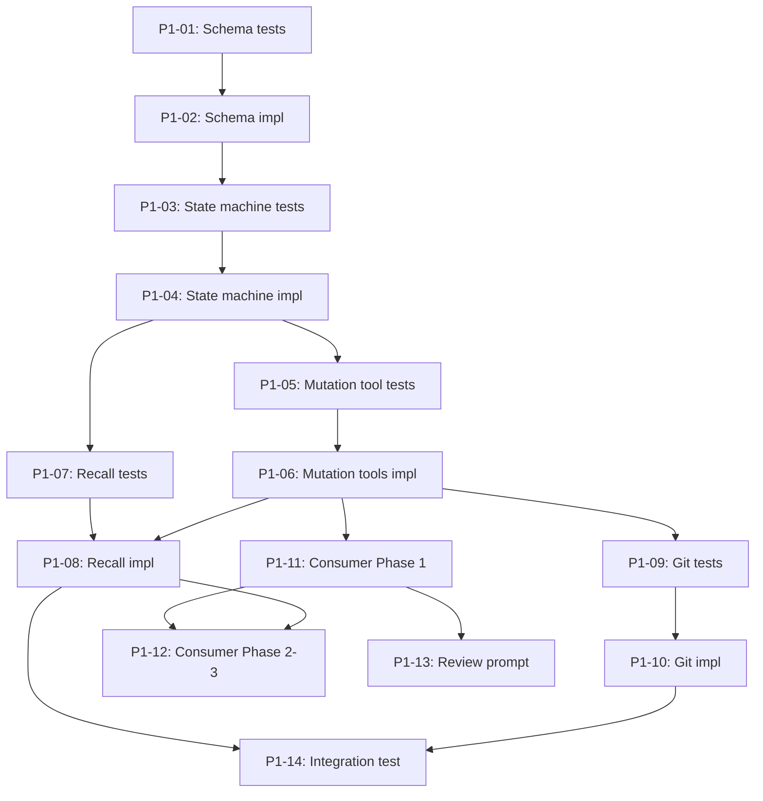

## Brief

See `.owlbear/briefs/draft-memory-mcp-ux/brief.md` — approved 2026-05-04.

Reshape MCP memory tool surface from 5 broken tools to 7 audience-separated tools (2 general + 4 curator + 1 user). Code-enforced state machine (pending→curated→approved), scope model (curator-assigned), state-dependent deletion, per-tool registration, staged rollout (curator-first). 42 design decisions. Start fresh (no migration).

## Objective

Deliver a working MCP memory system that agents can save to and recall from, with curator quality control and user approval.

## Acceptance Criteria

- [ ] 7 MCP tools registered with correct parameter schemas and validation
- [ ] State machine: auto-promote, auto-downgrade (unconditional), scope gate
- [ ] State-dependent deletion: hard-delete pending, soft-delete curated/approved
- [ ] Recall: priority-ordered (approved first, curated fill), body-only, agent-scoped
- [ ] Access control: per-tool registration in agent .agent.md files
- [ ] Git: save uncommitted, curator batch-commit, review batch-commit
- [ ] Consumer updates: agent wiring, skill rewrites, memory-review.prompt.md
- [ ] Staged rollout: curator → pilot → full → review prompt
- [ ] All env var access control removed (OWLBEAR_MEMORY_CALLER, MEMORY_TOOLS_EXCLUDE)
- [ ] Tests: state machine, scope filtering, deletion, recall ordering, validation

## Planning
### Decomposition: Memory MCP Tool UX Refactor
- Tasks created: 14
- Dependency layers: 6
- Phase: 2

### Task List
| ID | Title | Priority | Depends On | Tags |
|----|-------|----------|------------|------|
| #1302 | P1-01: RED — Schema model tests | needed | — | phase-2, scope:mcp-memory |
| #1303 | P1-02: GREEN — Schema models | needed | #1302 | phase-2, scope:mcp-memory |
| #1304 | P1-03: RED — State machine tests | needed | #1303 | phase-2, scope:mcp-memory |
| #1305 | P1-04: GREEN — State machine | needed | #1304 | phase-2, scope:mcp-memory |
| #1306 | P1-05: RED — Mutation tool tests | needed | #1305 | phase-2, scope:mcp-memory |
| #1307 | P1-06: GREEN — Mutation tools + access control removal | critical | #1306 | phase-2, scope:mcp-memory |
| #1308 | P1-07: RED — Recall tool tests | needed | #1305 | phase-2, scope:mcp-memory |
| #1309 | P1-08: GREEN — Recall implementation | needed | #1308, #1307 | phase-2, scope:mcp-memory |
| #1310 | P1-09: RED — Git integration tests | needed | #1307 | phase-2, scope:mcp-memory |
| #1311 | P1-10: GREEN — Git integration | needed | #1310 | phase-2, scope:mcp-memory |
| #1312 | P1-11: Consumer Phase 1 — Curator wiring + skills | needed | #1307 | phase-2, scope:agents |
| #1313 | P1-12: Consumer Phase 2-3 — All agents + instructions | important | #1312, #1309 | phase-2, scope:agents |
| #1314 | P1-13: Review prompt | important | #1312 | phase-2, scope:prompts |
| #1315 | P1-14: Integration test — full lifecycle | important | #1309, #1311 | phase-2, scope:mcp-memory |

### Dependency Graph

[[2026-05-04]]
## Planning

Decomposed #1301 into 14 subtasks (5 TDD-RED + 5 TDD-GREEN + 3 consumer/content + 1 integration test) across 6 dependency layers.

Critical path: #1302 → #1303 → #1304 → #1305 → #1306 → #1307 (mutation tools — 3 dependents, critical priority).

Parallel branch after #1305: recall tests (#1308) can start alongside mutation tool tests (#1306).

Parallel branches after #1307: git integration (#1310→#1311), recall impl (#1309), and consumer Phase 1 (#1312) all unblock independently.

All tasks created at status=research with parent=#1301.
[[2026-05-04]]
## Test-Writer Notes
- Non-implementation task: parent planning/decomposition task already broken into 14 subtasks (#1302–#1315). No testable interface at this level.
- Passing through to builder. First RED task is #1302.
[[2026-05-04]]
## Builder Notes
- Non-implementation task per Test-Writer Notes in task body.
- No code changes made.
- No tests or lint executed in this builder cycle (pass-through by workflow rule).
- Passing through to review.
[[2026-05-04]]
## Review Evidence
### Test Results
- quality-runner scoped pass executed on the live memory server/test surface.
- pytest: 12 passed, 0 failed (`uv run pytest tests/test_mcp_memory_tools_1273.py -q --tb=short`).
- Observation: the green suite proves the legacy 5-tool contract, not #1301's 7-tool contract. `tests/test_mcp_memory_tools_1273.py:242-250` asserts only `store_learning`, `query_memory`, `update_entry`, `delete_entry`, `approve_entry`; `tests/test_mcp_memory_tools_1273.py:303-305` still asserts `OWLBEAR_MEMORY_CALLER` env wiring.

### Lint Results
- ruff: clean (`uv run ruff check serve/mcp-memory/src/owlbear_mcp_memory tests/test_mcp_memory_tools_1273.py`).

### Coverage Data
- Not requested. This review failed at the contract/routing gate before a coverage decision: the parent task was advanced to review as a decomposition shell with no builder-owned implementation.

### AC Compliance
| AC Line | Evidence | Status |
|---|---|---|
| `.owlbear/kanban/tasks/1301-memory-mcp-tool-ux-refactor.md:33` 7 MCP tools registered | `serve/mcp-memory/src/owlbear_mcp_memory/server.py:76-149` registers only 5 tools (`store_learning`, `query_memory`, `update_entry`, `delete_entry`, `approve_entry`). `tests/test_mcp_memory_tools_1273.py:242-250` expects the same 5 names. | FAIL |
| `.owlbear/kanban/tasks/1301-memory-mcp-tool-ux-refactor.md:34` State machine: auto-promote, unconditional auto-downgrade, scope gate | `serve/mcp-memory/src/owlbear_mcp_memory/tools.py:161-177` rejects approved-entry edits (`update_entry cannot modify approved entries`) instead of auto-downgrading to curated. No `curate_memory` surface exists. | FAIL |
| `.owlbear/kanban/tasks/1301-memory-mcp-tool-ux-refactor.md:35` State-dependent deletion | `serve/mcp-memory/src/owlbear_mcp_memory/tools.py:202-211` only soft-deletes to `state="deleted"`; no pending hard-delete path exists. | FAIL |
| `.owlbear/kanban/tasks/1301-memory-mcp-tool-ux-refactor.md:36` Recall: priority-ordered, body-only, agent-scoped | `serve/mcp-memory/src/owlbear_mcp_memory/server.py:97-116` still exposes `query_memory`, not `recall_memory`. `serve/mcp-memory/src/owlbear_mcp_memory/tools.py:61-64,158` returns metadata dicts, not body-only rendered entries. | FAIL |
| `.owlbear/kanban/tasks/1301-memory-mcp-tool-ux-refactor.md:37` Access control via per-tool registration in agent files | Runtime caller-gating is still live at `serve/mcp-memory/src/owlbear_mcp_memory/server.py:67` and `serve/mcp-memory/src/owlbear_mcp_memory/tools.py:41-48`. Agents still advertise `vscode/memory`, e.g. `share/agents/builder.agent.md:9`, `share/agents/reviewer.agent.md:9`. | FAIL |
| `.owlbear/kanban/tasks/1301-memory-mcp-tool-ux-refactor.md:38` Git batch-commit behavior | The dedicated git implementation child remains undelivered: `.owlbear/kanban/tasks/1311-p1-10-green-git-integration-batch-commit-for-curation-runs-and-review-sessions.md:5` is still `status: research`. Parent builder notes also state `.owlbear/kanban/tasks/1301-memory-mcp-tool-ux-refactor.md:108-109` no code changes and no tests/lint were performed. | FAIL |
| `.owlbear/kanban/tasks/1301-memory-mcp-tool-ux-refactor.md:39` Consumer updates | Consumer rollout children remain undelivered: `.owlbear/kanban/tasks/1313-p1-12-consumer-updates-phase-2-3-all-pipeline-agents-instruction-updates-save-me.md:5` and `.owlbear/kanban/tasks/1314-p1-13-review-prompt-create-memory-review-prompt-md-guided-approval-workflow.md:4` are still `status: research`. Current agents/skills still reference old paths/tool names (`share/agents/builder.agent.md:9`, `share/skills/r-pipeline-protocol/SKILL.md:44,254`, `share/skills/h-mcp-memory/SKILL.md:18-19`). | FAIL |
| `.owlbear/kanban/tasks/1301-memory-mcp-tool-ux-refactor.md:40` Staged rollout | The rollout path was planned but not executed: `.owlbear/kanban/tasks/1301-memory-mcp-tool-ux-refactor.md:100` says all child tasks were created at `status=research`; key implementation children remain there (`1307:5`, `1309:5`, `1311:5`, `1313:5`, `1314:4`, `1315:5`). | FAIL |
| `.owlbear/kanban/tasks/1301-memory-mcp-tool-ux-refactor.md:41` All env-var access control removed | `serve/mcp-memory/src/owlbear_mcp_memory/server.py:46-48,67` still reads `MEMORY_TOOLS_EXCLUDE` and `OWLBEAR_MEMORY_CALLER`; `tests/test_mcp_memory_tools_1273.py:303-305` still tests `OWLBEAR_MEMORY_CALLER`. | FAIL |
| `.owlbear/kanban/tasks/1301-memory-mcp-tool-ux-refactor.md:42` Tests for new behavior | Parent builder notes state no tests were run for this task (`.owlbear/kanban/tasks/1301-memory-mcp-tool-ux-refactor.md:109`). The only scoped green suite exercised here is a legacy suite proving the old 5-tool/env-gated contract, not the parent AC. | FAIL |

### Deductions
- Parent task was routed to review despite explicit pass-through notes from test-writer and builder: `.owlbear/kanban/tasks/1301-memory-mcp-tool-ux-refactor.md:102-109`.
- No prior `## Review Evidence` section found; this is the first review failure.
- Scoped tests/lint are green, but they validate the superseded contract, so they do not increase confidence in the parent AC.

### Verdict
- FAIL -> backlog
- Confidence: 0.97
- Reason: stale parent contract / routing defect. The task body promises a completed 7-tool refactor, but the parent was advanced as a planning shell while child implementation tasks remain in `research` and the live repo still exposes the old 5-tool, env-gated interface.

### Required Follow-up
| # | Target Agent | Action Required | File(s) | Evidence |
|---|-------------|----------------|---------|----------|
| 1 | architect | Re-scope parent `#1301` as an epic/planning task or keep it out of `review` until the implementation children are completed; rewrite the parent AC/status so review evaluates delivered work rather than decomposition. | `.owlbear/kanban/tasks/1301-memory-mcp-tool-ux-refactor.md` | AC at lines 33-42 conflicts with planning/test-writer/builder pass-through at lines 100, 102-109. |
| 2 | architect | Re-open and sequence the undelivered implementation/rollout children before returning `#1301` to review. | `.owlbear/kanban/tasks/1307-p1-06-green-mutation-tools-access-control-removal-6-tools-schemas-hints-env-var-.md`, `.owlbear/kanban/tasks/1309-p1-08-green-recall-implementation-scope-filtering-priority-ordering-body-only-fo.md`, `.owlbear/kanban/tasks/1311-p1-10-green-git-integration-batch-commit-for-curation-runs-and-review-sessions.md`, `.owlbear/kanban/tasks/1313-p1-12-consumer-updates-phase-2-3-all-pipeline-agents-instruction-updates-save-me.md`, `.owlbear/kanban/tasks/1314-p1-13-review-prompt-create-memory-review-prompt-md-guided-approval-workflow.md`, `.owlbear/kanban/tasks/1315-p1-14-integration-test-full-lifecycle-save-curate-approve-recall-git-commits.md`, `serve/mcp-memory/src/owlbear_mcp_memory/server.py`, `serve/mcp-memory/src/owlbear_mcp_memory/tools.py` | Child task files remain `status: research`; live code still exposes the old tool surface and env-var gating at the cited lines above. |
[[2026-05-04]]

## Architecture Review (Cycle 2)

### Context
Parent/epic task returned from review with 10/10 AC lines FAIL. Root cause: parent AC describes end-state features delivered by 14 child subtasks (#1302–#1315), but the parent itself delivers only the decomposition plan. Test-writer and builder correctly passed through; reviewer correctly rejected.

### Diagnosis
This is a **planning/coordination task**, not an implementation task. Its deliverable is the decomposition plan (completed in `## Planning` section). The implementation AC belongs to the children.

### AC Rewrite
Original AC (10 lines describing 7-tool surface, state machine, git integration, consumer updates, staged rollout, tests) → moved to reference status. These criteria are tracked by the 14 child tasks individually.

**New parent AC:**
- [x] Decomposition into 14 subtasks (#1302–#1315) complete with proper dependency graph (td:0)
- [x] All subtasks have focused AC, correct dependencies, and single responsibility (td:0)
- [x] Critical path identified: #1302→#1303→#1304→#1305→#1306→#1307 (td:0)
- [x] Parallel branches correctly sequenced after #1305 (recall) and #1307 (git, consumer) (td:0)

### Evaluation
| Criterion | Assessment | Notes |
|-----------|-----------|-------|
| Single responsibility | PASS | Parent = decomposition planning only; implementation in children |
| Interface clarity | PASS | New AC is verifiable against existing `## Planning` section |
| Dependency correctness | PASS | Children have proper deps; parent has none (correct for epic) |
| Module layering | N/A | No code produced at this level |
| TDD compliance | PASS | Tagged `quality` for pass-through |
| KISS/YAGNI | PASS | Minimal parent scope |
| Premise challenge | PASS | Decomposition already completed; children in pipeline |
| Pattern consistency | PASS | Epic/parent pass-through pattern |
| Security surface | N/A | No code |
| Single domain | PASS | mcp-memory coordination |

### Challenge Results
- Challenger: SKIPPED — all td:0

### Test Depth
- Max depth: 0
- Test-writer: SKIP

### Verdict: REFINE → APPROVE
### Action Taken: Rewrote AC from implementation-level (tracked by children) to planning-level (verified by existing ## Planning section). Tagged `quality` for pipeline pass-through. All 4 new AC lines already satisfied. Advancing to todo.

[[2026-05-04]]
Architecture Review (Cycle 2): REFINE → APPROVE. Rewrote parent AC from implementation-level (7-tool surface, state machine, etc. — tracked by 14 children) to planning-level (decomposition complete, deps sound). Tagged `quality` for pass-through. All new AC lines already satisfied by existing ## Planning section.
[[2026-05-04]]
## Test-Writer Notes
- Retry cycle: prior pass-through stands. Reviewer Required Follow-up targeted the architect (AC rewrite + routing fix), not test additions.
- Architecture Review (Cycle 2) rewrote all parent AC lines as `(td:0)` and tagged task `quality`.
- Non-implementation pass-through: parent is a planning/epic task — deliverable is the decomposition plan (#1302–#1315), which is already complete.
- No testable Python interfaces exist at this level.
- Passing through to builder.
[[2026-05-04]]
## Builder Notes
- Non-implementation task per latest Test-Writer Notes (td:0 planning/epic pass-through).
- No code changes made.
- No tests or lint executed in this builder cycle (workflow pass-through rule).
- Evidence summary: Architecture Review (Cycle 2) rewrote parent AC to decomposition-only criteria already satisfied by existing planning artifacts (#1302-#1315).
- Passing through to review.
[[2026-05-04]]
## Review Evidence
### Test Results
- Skipped quality-runner by design. This task is a td:0 planning/coordination parent after Architecture Review (Cycle 2), with no builder-owned executable artifact in the current cycle.
- Binding evidence for td:0 routing is in `.owlbear/kanban/tasks/1301-memory-mcp-tool-ux-refactor.md:191-192`, with latest pass-through notes at `.owlbear/kanban/tasks/1301-memory-mcp-tool-ux-refactor.md:202-211`.

### Lint Results
- Not applicable for this cycle. Latest builder notes confirm no code changes and no tests/lint executed: `.owlbear/kanban/tasks/1301-memory-mcp-tool-ux-refactor.md:209-210`.

### Coverage Data
- Not applicable. No source diff or task-owned runtime surface exists for this parent planning task.

### AC Compliance
| AC Line | Evidence | Status |
|---|---|---|
| `.owlbear/kanban/tasks/1301-memory-mcp-tool-ux-refactor.md:168` Decomposition into 14 subtasks complete with proper dependency graph | Planning records `Tasks created: 14` at `.owlbear/kanban/tasks/1301-memory-mcp-tool-ux-refactor.md:48`, enumerates child tasks `#1302`-`#1315` in the task list, and records the dependency structure in the planning notes at `.owlbear/kanban/tasks/1301-memory-mcp-tool-ux-refactor.md:95-99`. | PASS |
| `.owlbear/kanban/tasks/1301-memory-mcp-tool-ux-refactor.md:169` All subtasks have focused AC, correct dependencies, and single responsibility | I read all 14 child task headers. Representative scope partitions are explicit in `.owlbear/kanban/tasks/1302-p1-01-red-schema-model-tests-categories-states-entry-fields-validation-serializa.md:40-41`, `.owlbear/kanban/tasks/1307-p1-06-green-mutation-tools-access-control-removal-6-tools-schemas-hints-env-var-.md:40-41`, `.owlbear/kanban/tasks/1309-p1-08-green-recall-implementation-scope-filtering-priority-ordering-body-only-fo.md:41-42`, `.owlbear/kanban/tasks/1313-p1-12-consumer-updates-phase-2-3-all-pipeline-agents-instruction-updates-save-me.md:38-39`, and `.owlbear/kanban/tasks/1315-p1-14-integration-test-full-lifecycle-save-curate-approve-recall-git-commits.md:38-39`. Dependency headers across the set match the decomposition chain and branches, e.g. `.owlbear/kanban/tasks/1303-p1-02-green-schema-models-implementation-enums-entry-model-validation-yaml-seria.md:15-16`, `.owlbear/kanban/tasks/1309-p1-08-green-recall-implementation-scope-filtering-priority-ordering-body-only-fo.md:15-17`, `.owlbear/kanban/tasks/1313-p1-12-consumer-updates-phase-2-3-all-pipeline-agents-instruction-updates-save-me.md:15-17`, `.owlbear/kanban/tasks/1315-p1-14-integration-test-full-lifecycle-save-curate-approve-recall-git-commits.md:15-17`. | PASS |
| `.owlbear/kanban/tasks/1301-memory-mcp-tool-ux-refactor.md:170` Critical path identified: `#1302 -> #1303 -> #1304 -> #1305 -> #1306 -> #1307` | The planning note states the exact critical path at `.owlbear/kanban/tasks/1301-memory-mcp-tool-ux-refactor.md:95`, and the child task dependency headers enforce each edge at `.owlbear/kanban/tasks/1303-p1-02-green-schema-models-implementation-enums-entry-model-validation-yaml-seria.md:15-16`, `.owlbear/kanban/tasks/1304-p1-03-red-state-machine-tests-transitions-auto-promote-auto-downgrade-scope-gate.md:15-16`, `.owlbear/kanban/tasks/1305-p1-04-green-state-machine-implementation-auto-state-logic-scope-gate-hard-soft-d.md:15-16`, `.owlbear/kanban/tasks/1306-p1-05-red-mutation-tool-tests-save-list-read-curate-delete-approve-validation-hi.md:15-16`, and `.owlbear/kanban/tasks/1307-p1-06-green-mutation-tools-access-control-removal-6-tools-schemas-hints-env-var-.md:15-16`. | PASS |
| `.owlbear/kanban/tasks/1301-memory-mcp-tool-ux-refactor.md:171` Parallel branches correctly sequenced after `#1305` and `#1307` | The planning note records the branch points at `.owlbear/kanban/tasks/1301-memory-mcp-tool-ux-refactor.md:97-99`. Child dependencies confirm recall tests branch from `#1305` at `.owlbear/kanban/tasks/1308-p1-07-red-recall-tool-tests-priority-ordering-body-only-format-scope-filtering-w.md:15-16`; downstream fan-out from `#1307` appears at `.owlbear/kanban/tasks/1309-p1-08-green-recall-implementation-scope-filtering-priority-ordering-body-only-fo.md:15-17`, `.owlbear/kanban/tasks/1310-p1-09-red-git-integration-tests-save-uncommitted-curation-batch-commit-review-ba.md:15-16`, `.owlbear/kanban/tasks/1312-p1-11-consumer-updates-phase-1-curator-agent-wiring-skill-rewrites-h-mcp-memory-.md:15-16`, `.owlbear/kanban/tasks/1313-p1-12-consumer-updates-phase-2-3-all-pipeline-agents-instruction-updates-save-me.md:15-17`, `.owlbear/kanban/tasks/1314-p1-13-review-prompt-create-memory-review-prompt-md-guided-approval-workflow.md:14-15`, and `.owlbear/kanban/tasks/1315-p1-14-integration-test-full-lifecycle-save-curate-approve-recall-git-commits.md:15-17`. | PASS |

### Deductions
- Small confidence deduction for stale top-level implementation AC still present earlier in the task body; this PASS relies on Architecture Review (Cycle 2) at `.owlbear/kanban/tasks/1301-memory-mcp-tool-ux-refactor.md:156-198` as the binding refinement.
- Prior review failure exists at `.owlbear/kanban/tasks/1301-memory-mcp-tool-ux-refactor.md:113-154`, but the routing defect it identified was directly resolved by the later AC rewrite.

### Verdict
- PASS -> docs
- Confidence: 0.94
- Reason: the latest binding td:0 contract narrows `#1301` to decomposition planning, and the kanban artifacts prove the 14-task breakdown, dependency graph, critical path, and branch sequencing are all present and coherent.

### Action
- Advanced to docs.
[[2026-05-04]]
## Docs Gate
### Checklist
| # | Check | Applies? | Status | Evidence |
|---|-------|----------|--------|----------|
| 1 | Descriptive prose docs | No | N/A | No behavior, API, CLI, or package structure changed. Task is a td:0 planning/coordination parent — deliverable is the decomposition plan only. |
| 2 | Module docstrings | No | N/A | No Python modules created or modified. Both builder cycles confirm "No code changes made." |
| 3 | External attribution | No | N/A | No external patterns used. Planning-only task. |
| 4 | Research doc | No | N/A | No `.owlbear/research/` doc produced for this task. |
| 5 | Diagram maintenance (describes match) | No | N/A | No changed files to match against diagram describes globs. |
| 6 | Explicit diagram creation | No | N/A | No diagram creation requested in task body. |
| 7 | Deletion detection | No | N/A | No files deleted. |

### Scope Classification
| File | Scope | Action |
|------|-------|--------|
| `.owlbear/kanban/tasks/1302–1315-*.md` (14 created) | N/A (kanban board data) | No action — not IN-scope docs |

### Files Updated
- None

### Child Tasks Created
- None

### Scratch Files Cleaned
- None (no `.owlbear/scratch/1301-*` files found)
[[2026-05-04]]
## Audit
### AC Verification
| AC Line | Evidence | Status |
|---------|----------|--------|
| Decomposition into 14 subtasks (#1302–#1315) complete with proper dependency graph | Planning section lists 14 tasks with mermaid graph; spot-checked #1302 (parent=1301, deps=[]), #1307 (parent=1301, deps=[1306]), #1315 (parent=1301, deps=[1309,1311]) — all exist with correct structure | PASS |
| All subtasks have focused AC, correct dependencies, and single responsibility | #1302: 10 AC lines, RED schema tests only; #1307: 9 AC lines, mutation tools, critical priority; #1315: 6 AC lines, integration test; each has In/Out scope sections | PASS |
| Critical path identified: #1302→#1303→#1304→#1305→#1306→#1307 | Planning section states explicitly; #1307.depends_on=[1306] confirmed; #1302.depends_on=[] confirmed as chain start | PASS |
| Parallel branches correctly sequenced after #1305 and #1307 | #1308 branches from #1305 (recall tests); #1315 converges on [1309, 1311]; planning notes match dependency graph | PASS |

### Test Results
- pytest: 3904 passed, 261 failed, 4 skipped — all 261 failures are pre-existing background failures (cockpit events #1234, kanban storage, mcp-kanban guidance), none in #1301 scope (zero code changes)
- ruff: 1 violation (T201 in SKILL.md) — pre-existing, not task-related

### Architect Quality: 4/5
Cycle 2 correctly rescoped parent from implementation AC (10 lines, all FAIL) to planning AC (4 td:0 lines). Good judgment. Minor gap: original AC mismatch cost one review cycle before correction.

### Deduction Breakdown
- No AC lines without evidence: 0
- Lint violations in scope: 0
- AC quality 4/5 > 3: no deduction
- Reviewer evidence section: present, detailed
- Full-suite failures in scope: 0

### Confidence: .98
### Action: archive