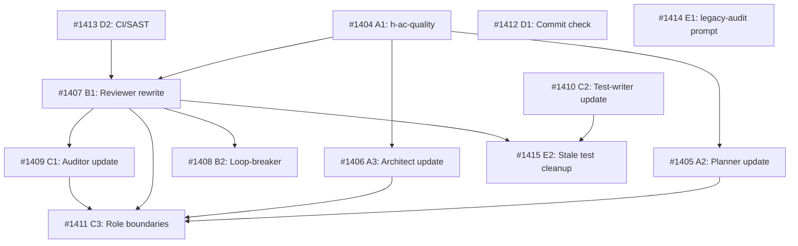

[[2026-05-07]]
## Architecture Review

**Verdict: REJECT — empty body, no actionable scope**

Task has no body content: no acceptance criteria, no problem statement, no research pointers, no scope definition. The title references three distinct concerns (quality gates, AC schema, reviewer workflow) but provides no constraints, desired outcomes, or evidence of prior analysis.

### Required before re-submission to backlog

1. **Problem statement** — what specific pipeline failures or inefficiencies motivate this change? Cite concrete examples (task IDs, failure modes, time waste).
2. **Scope boundary** — "restructure quality gates, AC schema, and reviewer workflow" spans at least 3 independent concerns. Each likely needs its own task. Research should determine whether these are truly coupled or should be decomposed.
3. **Acceptance criteria** — verifiable conditions for each scoped concern.
4. **Research pointers** — link to `.owlbear/research/` analysis or ideation artifacts that ground the proposed changes.

The `ideation` tag suggests this originated from an ideation session — the ideation output should be captured in the body or linked as a research doc before architecture review can proceed.
[[2026-05-07]]
## Planning
### Decomposition: Pipeline Review Rethink
- Tasks created: 12
- Dependency layers: 4
- Workstreams: 5 (A: AC Quality, B: Reviewer, C: Roles, D: Protocol, E: Cleanup)

### Task List
| ID | Title | Priority | Depends On | Tags |
|----|-------|----------|------------|------|
| #1404 | A1: h-ac-quality skill — unified two-tier, six-rule AC schema | critical | — | pipeline, ws-ac-quality, scope:agents |
| #1405 | A2: Planner skill update — AC drafting, consolidation-test, routing | needed | #1404 | pipeline, ws-ac-quality, scope:agents |
| #1406 | A3: Architect/challenger skill update — AC validation, consolidation-test backstop | needed | #1404 | pipeline, ws-ac-quality, scope:agents |
| #1407 | B1: Reviewer rewrite — batch findings, finding vs opinion, trust builder, protocol | critical | #1404, #1413 | pipeline, ws-reviewer, scope:agents |
| #1408 | B2: Loop-breaker protocol update — 2-batch-cycle threshold | important | #1407 | pipeline, ws-reviewer, scope:agents |
| #1409 | C1: Auditor skill update — regression + intent, remove reviewer overlap | needed | #1407 | pipeline, ws-roles, scope:agents |
| #1410 | C2: Test-writer skill update — exact-value assertions, structural separation | needed | — | pipeline, ws-roles, scope:agents |
| #1411 | C3: Role boundary documentation — in-scope/out-of-scope per agent | important | #1405, #1406, #1407, #1409 | pipeline, ws-roles, scope:agents |
| #1412 | D1: Pre-end_work scoped commit check — domain-scoped verification | important | — | pipeline, ws-protocol, scope:agents |
| #1413 | D2: CI/SAST baseline — deterministic security scanning | needed | — | pipeline, ws-protocol, scope:infra |
| #1414 | E1: legacy-audit.prompt.md — cleanup scan prompt | important | — | pipeline, ws-cleanup, scope:agents |
| #1415 | E2: Stale test cleanup — delete/archive stale task-scoped tests | important | #1410, #1407 | pipeline, ws-cleanup, scope:tests |

### Dependency Graph

### Critical Path
A1 (#1404) → B1 (#1407) → C1 (#1409)

### Parallel Start (Layer 0, no deps)
#1404 (A1), #1410 (C2), #1412 (D1), #1413 (D2), #1414 (E1)

### Notes
- All deliverables are agent-ecosystem artifacts (skills, protocols, prompts, documentation) — no TDD pairing required (no code implementation tasks).
- B1 (#1407) depends on both A1 (#1404) and D2 (#1413) — CI/SAST must be ready before reviewer stops cognitive security scanning.
- C3 (#1411) is the capstone documentation task with 4 dependencies — scheduled last.
- E2 (#1415) requires both C2 (#1410) conventions and B1 (#1407) TestFromAC immutability removal.
[[2026-05-07]]
## Architecture Review (pass 2)\n\n**Verdict: APPROVED — decomposition complete, advancing parent**\n\nPlanner decomposed into 12 subtasks (#1404–#1415) across 5 workstreams with 4 dependency layers. Verified:\n\n- All 12 subtasks exist with AC, scope boundaries, parent=#1403, and correct dependency edges\n- Dependency graph is acyclic with clear critical path: A1→B1→C1\n- 5 layer-0 tasks can start in parallel (#1404, #1410, #1412, #1413, #1414)\n- Pipeline already in motion: #1413 in todo (sub-decomposed into #1416–#1419), #1407/#1412 in research, #1404/#1410 in backlog\n- All deliverables are agent-ecosystem artifacts — no code implementation in parent scope\n\nParent task is a tracking umbrella. Real work happens in subtasks.
[[2026-05-07]]
## Test-Writer Notes
- Non-implementation task (tagged `quality`, `pipeline`, `ideation`) — no tests applicable.
- Architect verdict confirmed: all deliverables are agent-ecosystem artifacts (skills, protocols, prompts, documentation); no code implementation in parent scope.
- This is a tracking umbrella for 12 subtasks (#1404–#1415) across 5 workstreams. Test-writer involvement happens at the individual subtask level, not at the umbrella.
- Passing through to builder.
[[2026-05-07]]
## Builder Notes
- Non-implementation task - no code changes needed.
- Test-writer pass-through confirmed from task body.
- Passing through to review.
[[2026-05-08]]
## Review Evidence

### Test Results
- td:0 / non-implementation tracking task. No source or test files are in scope for the parent.
- quality-runner skipped by design. Review evidence came from direct artifact inspection of the parent task, the brief, child task files, and live board state.

### Lint Results
- N/A — no source/test files changed in the parent scope.

### Coverage
- N/A — no executable code in the parent scope.

### AC Compliance
| AC / Binding Contract | Evidence | Status |
|---|---|---|
| Decomposition exists as 12 child tasks across the planned workstreams | Parent planning table lists #1404-#1415. Live board query confirms #1404-#1415 all exist with parent=1403. Each child task file contains a `## Acceptance Criteria` section. | PASS |
| Dependency structure matches the declared critical path and parallel starts | Parent dependency graph declares A1->A2/A3/B1, D2->B1, B1->B2/C1, A2/A3/B1/C1->C3, C2/B1->E2. Live board query matches the declared dependency edges (for example: #1405 depends on #1404, #1407 depends on #1404 and #1413, #1411 depends on #1405/#1406/#1407/#1409, #1415 depends on #1410 and #1407). | PASS |
| Parent is a tracking umbrella; real implementation work happens in subtasks | Latest Architecture Review says: "Parent task is a tracking umbrella. Real work happens in subtasks." Test-writer and builder both correctly treated the task as non-implementation pass-through. Grounding brief exists at `.owlbear/briefs/draft-pipeline-review-rethink/brief.md` with Problem, Deliverables, and Sequencing sections. | PASS |

### Pass 1 — Critical
- TestFromAC coverage / integrity: N/A. No tests authored or modified on the parent task.
- Security / data safety: N/A. No code changed in the parent scope.
- Builder process quality: CLEAN. Single pass-through builder note; no loop pattern or overclaiming.

### Deductions
- -0.03: Parent body contains stale live-status snapshot text in the Architecture Review summary. Current board state has already moved several children beyond those statuses. Informational only; the decomposition artifact itself is still valid.
- -0.02: The narrowed closeout contract lives in the latest Architecture Review + brief rather than a dedicated parent `## Acceptance Criteria` section, which increases review ambiguity.

### Verdict
PASS — confidence .95. This is a valid decomposition/tracking pass-through: the brief exists, the 12 planned children exist with AC and matching dependency structure, and no implementation evidence is expected on the parent itself.

### Action
Advance to docs.

### Reflection
- Split/tracking parents are reviewable when the narrowed contract is recoverable from live artifacts, even with no code changes.
- Embedded child-status snapshots go stale quickly; board state remains the source of truth.
- A dedicated closeout AC section on parent shells would reduce review ambiguity and speed future pass-through reviews.
[[2026-05-08]]
## Docs Gate

### Checklist
| # | Check | Applies? | Status | Evidence |
|---|-------|----------|--------|----------|
| 1 | Descriptive prose docs | No | N/A | Non-implementation umbrella; no source or doc files changed in parent scope |
| 2 | Module docstrings | No | N/A | No Python modules created or modified |
| 3 | External attribution | No | N/A | No external patterns used |
| 4 | Research doc | No | N/A | No `.owlbear/research/*1403*` file found; brief at `.owlbear/briefs/` is not IN-scope |
| 5 | Diagram maintenance (describes match) | No | N/A | Doc-index consulted; no diagram describes-match for changed files |
| 6 | Explicit diagram creation | No | N/A | No diagram creation request in task body |
| 7 | Deletion detection | No | N/A | No files deleted; no orphaned IN-scope docs |

### Scope Classification
| File | Scope | Action |
|------|-------|--------|
| (none — tracking umbrella; all deliverables in child tasks #1404–#1415) | OUT | N/A |

### Files Updated
- None

### Child Tasks Created
- None

### Scratch Files Cleaned
- None (no `.owlbear/scratch/1403-*` files existed)

No docs impact. Tracking umbrella; real work and artifacts are in subtasks. Advancing to done.
[[2026-05-08]]
## Audit

### AC Verification (derived from Architecture Review + Planning section)
| AC Line | Evidence | Status |
|---------|----------|--------|
| Decomposition exists as 12 child tasks across 5 workstreams | All 12 task files exist on disk (#1404-#1415); spot-checked #1404 (parent=1403, done), #1407 (parent=1403, depends_on=[1404,1413]), #1411 (parent=1403, depends_on=[1405,1406,1407,1409]) | PASS |
| Dependency structure matches declared critical path and parallel starts | #1407 depends_on=[1404,1413] matches graph. #1411 depends_on=[1405,1406,1407,1409] matches capstone position. #1404 has no deps (Layer 0). | PASS |
| Parent is tracking umbrella; real work in subtasks | Test-writer, builder, reviewer, doc-writer all confirmed pass-through. Brief committed at 6143c689. Child #1404 delivered skill at c474918e. | PASS |

### Test Results
- pytest: 229 failures + 6 errors, ALL from other in-progress tasks (memory schema #1266, edit contract #1348, engine accessor migration, cache SSE #1401). Zero failures attributable to #1403.
- vitest: 3 failures in ArchivalModal_1375 (different task scope). Zero attributable to #1403.
- No code changes in parent scope.

### Lint Results
- ruff: 13 violations in other packages (knowledge, tools). None attributable.
- eslint: 4 problems in other test/hook files. None attributable.

### Coverage
- N/A: no executable code in parent scope.

### Architect Quality: 4/5
Initial REJECT of empty body was correct. After planner decomposition, child tasks have specific verifiable AC (8 lines in #1404, 10 in #1407, 5 in #1411). Minor gap: parent lacks formal AC section, making closeout contract implicit.

### Deduction Breakdown
- Start: 1.00
- -0.02: No dedicated AC section on parent; closeout contract scattered across Architecture Review + Planning sections
- -0.01: Stale status snapshots in body (informational only)

### Confidence: .97
### Action: archive