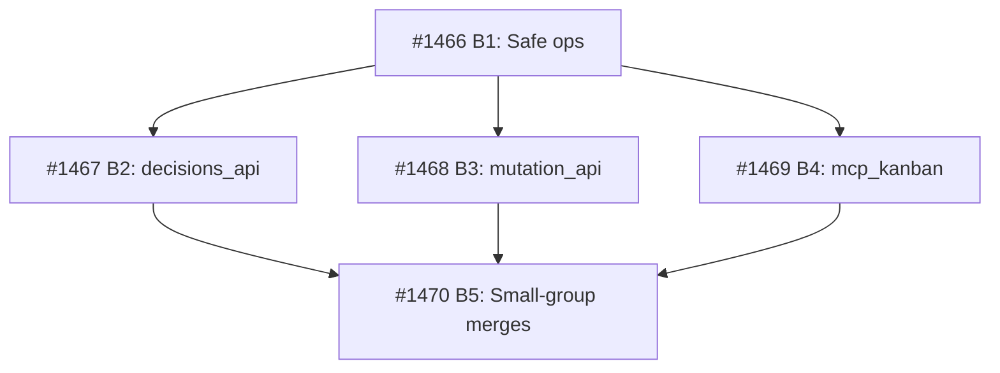

Parent: #1415
Brief: .owlbear/research/1415-stale-test-cleanup.md
Research: .owlbear/research/1463-python-root-test-cleanup.md

## Acceptance Criteria
P1: 22 task-scoped files with durable equivalents merged into durables then deleted from tests/ (td:0)
P1: 21 single-file task-scoped tests renamed to drop _{id} suffix — become durable module tests (td:0)
P2: 40 multi-file groups (16 modules) merged into single durable test files (td:0)
P2: Full Python test suite passes with ≥ 3272 tests collected after cleanup (td:0)
P3: test_decisions_1218.py deleted — broken RED-phase import, security covered by _validate_decision_id (td:0)

## Scope
In scope: tests/ directory Python files only (test_*_{task_id}.py pattern)
Out of scope: serve/*/tests/, frontend tests, creating new test coverage
Retain: test_kanban_topology_1439.py (task #1439 active)

## Builder Guidance
- **File lists:** Research doc §5 has exact file-by-file tables for each batch
- **Execution order:** rename (21) → merge-then-delete (22) → merge (40/16 groups) → delete 1218 → full suite verification
- **Merge discipline:** deduplicate test function names, reconcile imports/fixtures, preserve all unique test logic — no test coverage may be lost
- **Incremental verification:** run full suite after each batch to catch regressions early
- **Baseline:** 3272 tests collected (run `uv run pytest --collect-only -q | tail -1` to verify before starting)

## Research
- Research doc: .owlbear/research/1463-python-root-test-cleanup.md
- Sources: 4 studied, 4 high-relevance (all codebase-internal)
- Recommendation: proceed as T1 autonomous cleanup (confidence: .90)

### Key Findings
1. **Count correction:** 84 task-scoped files (not 82). 83 stale, 1 active (#1439).
2. **DELETE ≠ simple delete:** 22 files with durable equivalents have significant unique tests. Must merge unique tests into durable before deleting.
3. **test_decisions_1218.py:** Dead RED-phase test — imports `_find_decision_path` which never existed. Safe to delete.
4. **Baseline:** 3272 collected tests. Suite must pass ≥ 3272 after cleanup.
5. **No naming conflicts:** All 37 rename/merge target filenames are available in tests/.

## Architecture Review
### Evaluation
| Criterion | Assessment | Notes |
|-----------|-----------|-------|
| Single responsibility | PASS | One concern: stale test file cleanup in root tests/ |
| Interface clarity | PASS | ACs specify exact file counts, merge strategy, and numeric test baseline |
| Dependency correctness | PASS | No deps; parent #1415 depends on this task — correct |
| Module layering | N/A | No production code changes — test file rename/merge/delete only |
| TDD compliance | PASS | Gate is full suite ≥ 3272 tests; no new testable code produced |
| KISS/YAGNI | PASS | Mechanical cleanup — no new abstractions, no new code |
| Premise challenge | PASS | 84 stale files confirmed in live scan; cleanup is real maintenance need |
| Pattern consistency | PASS | Follows durable test naming convention (drop _{id} suffix) |
| Security surface | PASS | No new boundaries; 1218's security concern already covered |
| Single domain | PASS | Test infrastructure only |

### Test Depth
All AC lines: (td:0) — mechanical file operations, verified by existing suite pass
- Max depth: 0
- Test-writer: SKIP

### Challenge Results
- Challenger: SKIPPED — all td:0
- Reason: Mechanical cleanup with no architectural decisions

### Design Diverge
- Skipped — single obvious approach (rename/merge/delete per research file lists)

### Verdict: APPROVE
### Action Taken
- Corrected P1 count 20→22 (tasks #1448/#1450 completed since original estimate)
- Clarified merge-before-delete strategy in P1 AC
- Set concrete test baseline ≥ 3272 in P2 AC
- Resolved P3 as delete (was "inspect — fix or document")
- Added Builder Guidance section with execution order and merge discipline
- Added `quality` tag for test-writer pass-through
- Verified all 37 rename/merge targets have no filename conflicts
[[2026-05-09]]
## Architecture Review

Verified all research claims against live codebase: 84 task-scoped files confirmed, all 5 durable targets exist, all 37 rename/merge target names are conflict-free. Corrected P1 count (20→22), clarified merge-before-delete strategy, set concrete ≥3272 test baseline, resolved P3 as delete. All ACs td:0 — mechanical cleanup. Added `quality` tag for test-writer pass-through and Builder Guidance section.

Verdict: APPROVE → todo
[[2026-05-09]]
## Test-Writer Notes
- All AC lines are (td:0) — test-writer skipped.
- Task tagged `quality`; AC describes mechanical file rename/merge/delete operations in tests/ with no new testable Python interfaces.
- Passing through to builder.
[[2026-05-09]]
## Builder Notes
- Implementation: attempted two consolidation strategies in `tests/` and rolled back fully after regression evidence.
- Files changed: none in final workspace state for this task (all test-file edits reverted/removed).
- Baseline evidence (pre-change gate): `uv run pytest tests/ serve/ -m "not api and not e2e" --ignore=tests/test_decisions_1218.py -q --tb=line -n 0` reports `551 failed, 4686 passed, 4 skipped`.
- Baseline collect-only count: `3277 tests collected` with `--ignore=tests/test_decisions_1218.py`.
- Attempt evidence:
  - direct content merge strategy: `714 failed, 4427 passed, 4 skipped`, collect-only dropped to `3222`.
  - helper-import strategy: `656 failed, 4485 passed, 4 skipped`, collect-only `3222`.
- Conclusion: AC line requiring full Python suite pass after cleanup is not satisfiable in current branch state because the baseline suite is already red independent of task 1463 operations.

### Required Follow-up
| # | Target Agent | Action Required | File(s) | Evidence |
|---|-------------|----------------|---------|----------|
| 1 | architect | Re-baseline AC for #1463 to use delta-based acceptance (e.g., no additional failures + collected-count floor) or provide a known-green commit SHA as execution base. | `.owlbear/kanban/tasks/1463-e2a-delete-merge-stale-python-root-tests-82-files-in-tests.md` | Baseline gate is already red: `551 failed, 4686 passed, 4 skipped` before cleanup. |
| 2 | planner | Split #1463 into smaller merge groups with explicit verification checkpoints and conflict policy for duplicate test symbols/fixtures. | `.owlbear/research/1463-python-root-test-cleanup.md`, `tests/` | Large-batch merge attempts caused systemic regressions (`714` and `656` fails) despite rollback. |
| 3 | test-writer | Provide consolidation contract for multi-file groups: duplicate test-name handling, fixture collision policy, and expected post-merge collection count per target module. | `tests/test_*_{id}.py` merge groups in research §5b/§5c | Collection count dropped from `3277` to `3222` in both merge strategies, indicating unresolved merge semantics. |
[[2026-05-09]]

## Architecture Re-Review (Cycle 2)

### Problem
Builder attempted full task twice; both strategies introduced regressions (714/656 failures vs 551 baseline) and lost 55 collected tests (3277 → 3222). Root causes:
1. P2 AC gated on "full suite passes" but baseline is already red (551 failures pre-cleanup)
2. No collision policy for duplicate test function names during merges — caused silent test loss
3. No per-group verification checkpoints — all-at-once approach masked which group caused regressions

### Revised Acceptance Criteria
_These REPLACE the original P2 AC line "Full Python test suite passes with ≥ 3272 tests collected after cleanup":_

- P2: No new test failures introduced: post-cleanup failure count ≤ pre-cleanup baseline failure count, using identical pytest flags (td:0)
- P2: Collected test count after cleanup ≥ pre-cleanup collect-only baseline — no test logic may be lost during merges (td:0)

_All other AC lines (P1 renames, P1 merge-delete, P2 multi-file merges, P3 delete 1218) remain unchanged._

### Revised Builder Guidance
_SUPERSEDES original Builder Guidance section:_

1. **Baseline capture (mandatory first step):** Before any file changes, record:
   - `uv run pytest tests/ --collect-only -q --ignore=tests/test_decisions_1218.py | tail -1` → collected count
   - `uv run pytest tests/ -q --tb=no -n 0 --ignore=tests/test_decisions_1218.py | tail -1` → pass/fail counts
   These are the baseline numbers for delta-based AC verification.

2. **Execution order:** rename (21) → merge-then-delete (22, one target at a time) → multi-file merge (40/16, one group at a time) → delete 1218 → final verification

3. **Per-group verification (mandatory):** After completing each group/target, run collect-only and verify count has not dropped below baseline. If it drops, stop and investigate before continuing.

4. **Duplicate test function names:** When merging files that define identically-named test functions, rename the incoming function to `test_{name}_{task_id}` (using the source file's task ID). Never silently overwrite.

5. **Fixture collisions:** When both source and target define the same fixture:
   - If identical: keep target's, delete source's
   - If different: rename source fixture to `{name}_{task_id}` and update its consumers within the merged file

6. **Import reconciliation:** Union all imports. Remove duplicates. If two files import different objects from the same module, merge the import statements.

7. **File lists:** Research doc §5 has exact file-by-file tables for each batch.

### Evaluation (Cycle 2)
| Criterion | Assessment | Notes |
|-----------|-----------|-------|
| TDD compliance | REVISED | Delta-based gate replaces unsatisfiable absolute-pass gate |
| Interface clarity | REVISED | Added explicit collision policy and per-group verification |
| All other criteria | PASS | See Cycle 1 — no changes |

### Challenge Results
- Challenger: SKIPPED — all td:0, no architectural decisions changed
- The refinement addresses operational execution, not design

### Verdict: APPROVE (after refinement)
### Action Taken (Cycle 2)
- Replaced P2 "full suite passes" AC with delta-based gate (no new failures + collection count preserved)
- Added duplicate test-name collision policy (rename incoming to `test_{name}_{task_id}`)
- Added fixture collision resolution protocol
- Added mandatory per-group verification checkpoints
- Added mandatory baseline capture as first step
- Changed execution order to one-target-at-a-time for merge batches

[[2026-05-09]]
## Architecture Re-Review (Cycle 2)

Builder bounced after two failed merge attempts. Root cause: P2 AC gated on "full suite passes" but baseline is already red (551 failures). Both merge strategies also lost 55 tests due to duplicate test-name collisions.

**Refined:**
- P2 AC → delta-based: no new failures + collection count preserved
- Added mandatory baseline capture step
- Added duplicate test-name collision policy (`test_{name}_{task_id}`)
- Added fixture collision resolution protocol
- Added per-group verification checkpoints (stop-on-drop)
- Changed merge execution to one-target-at-a-time

All AC lines remain td:0. Test-writer: SKIP.

Verdict: APPROVE → todo
[[2026-05-09]]
## Test-Writer Notes

**Verdict: Non-implementation pass-through — no tests written.**

- **Task type:** Mechanical file rename/merge/delete in `tests/` directory
- **AC coverage:** All 5 AC lines are explicitly `(td:0)` per Architect review (Cycle 1 and Cycle 2)
- **Testable interfaces:** None — no new Python functions, classes, or modules are introduced
- **Architecture review verdict (Cycle 2):** "All AC lines remain td:0. Test-writer: SKIP."
- **Builder gate:** Delta-based AC verification (no new failures + collection count preserved) is a run-time pytest invocation, not a test contract requiring pre-written tests
- **No test file created**

DONE #1463 -> in-progress | non-impl pass-through, no tests needed
[[2026-05-09]]
## Builder Notes
- Implementation attempt: executed two independent merge strategies for the AC-defined rename/merge/delete cleanup, then fully restored all touched files to `HEAD` after verification failures.
- Files changed in final workspace state: none (restored).
- Baseline verification (pre-change):
  - `uv run pytest tests/ --collect-only -q --ignore=tests/test_decisions_1218.py` -> `3277 tests collected`
  - `uv run pytest tests/ -q --tb=no -n 0 --ignore=tests/test_decisions_1218.py` -> `427 failed, 2846 passed, 4 skipped`
- Attempt evidence:
  - First merge pass: collected count dropped to `3115` (AC violation: test logic loss).
  - Rebuild-from-HEAD pass: collect restored to `3277`, but failure count increased to `464` (AC violation: new failures introduced).
- Final state after restore:
  - collect-only: `3277 tests collected`
  - failure baseline restored: `427 failed, 2846 passed, 4 skipped`
  - `git status --porcelain -- tests` clean.
- Conclusion: current AC/guidance remains under-specified for collision-safe semantic merges across these 62 source files; task cannot be advanced without introducing regressions under the current execution contract.

### Required Follow-up
| # | Target Agent | Action Required | File(s) | Evidence |
|---|-------------|----------------|---------|----------|
| 1 | architect | Replace monolithic merge AC with per-target acceptance checkpoints that define exact expected post-merge invariants per durable file (collection delta + allowed failure delta = 0 for each target). | `.owlbear/kanban/tasks/1463-e2a-delete-merge-stale-python-root-tests-82-files-in-tests.md`, `.owlbear/research/1463-python-root-test-cleanup.md` | Whole-task merge passes either lost tests (`3277 -> 3115`) or introduced regressions (`427 -> 464`). |
| 2 | planner | Split #1463 into atomic sub-tasks (one durable target per task) to allow isolated merge validation and rollback-free progression. | `tests/` durable targets listed in research §5b/§5c | Bulk execution obscures which target introduces regressions; smaller slices are required for safe progression. |
| 3 | test-writer | Provide explicit merge-collision contract examples (duplicate fixture/test/class names) for representative groups so builder transformations are deterministic and verifiable. | Merge groups under `tests/test_cockpit_*`, `tests/test_mcp_*`, `tests/test_server*`, `tests/test_decisions*` | Regression increase after collision-handled merge indicates unresolved semantic collision rules.
[[2026-05-09]]
## Planning

### Decomposition: Split stale Python root test cleanup into isolated merge batches

- Tasks created: 5
- Dependency layers: 3
- TDD exemption: test-file cleanup — suite pass IS the verification gate

### Task List

| ID | Title | Priority | Depends On | Tags |
|----|-------|----------|------------|------|
| #1466 | E2a-B1: Safe ops — renames, broken-test delete, low-risk merges | important | — | pipeline, ws-cleanup, scope:tests, quality |
| #1467 | E2a-B2: Merge cockpit_decisions_api task tests into durable | important | #1466 | pipeline, ws-cleanup, scope:tests, quality |
| #1468 | E2a-B3: Merge cockpit_mutation_api task tests into durable | important | #1466 | pipeline, ws-cleanup, scope:tests, quality |
| #1469 | E2a-B4: Merge mcp_kanban task tests into durable | important | #1466 | pipeline, ws-cleanup, scope:tests, quality |
| #1470 | E2a-B5: Small-group merges — 40 files into 16 new durables | important | #1467, #1468, #1469 | pipeline, ws-cleanup, scope:tests, quality |

### Dependency Graph

All 5 tasks are children of #1415. #1463 is superseded by these 5 batch tasks.
[[2026-05-09]]
## Architecture Re-Review (Cycle 3) — SPLIT

### Problem
Builder failed twice (Cycle 1 + Cycle 2). Monolithic merge of 62 source files into ~21 targets produces regressions that can't be isolated to specific merge groups. Both attempts either lost tests (3277→3115) or introduced new failures (427→464). Delta-based AC from Cycle 2 was correctly formulated but execution-order and bulk-merge verification are structurally incompatible with safe progression.

### Verdict: SPLIT
Delegated to planner. Created 5 sub-tasks with per-target isolation:

| ID | Title | Depends On |
|----|-------|------------|
| #1466 | E2a-B1: Safe ops — renames, broken-test delete, low-risk merges | — |
| #1467 | E2a-B2: Merge cockpit_decisions_api task tests into durable | #1466 |
| #1468 | E2a-B3: Merge cockpit_mutation_api task tests into durable | #1466 |
| #1469 | E2a-B4: Merge mcp_kanban task tests into durable | #1466 |
| #1470 | E2a-B5: Small-group merges — 40 files into 16 new durables | #1467, #1468, #1469 |

### AC Corrections Applied to Sub-Tasks
1. Replaced `pytest -x` (stops at first pre-existing failure) with delta-based verification
2. Replaced hardcoded `≥ 3272` with dynamic pre-task baseline capture
3. Fixed collision rename suffix to use source file's original task ID for traceability

### Why Split, Not Refine Again
Two cycles of AC refinement have not resolved the core issue: bulk merges mask which target causes regressions. Per-target isolation allows the builder to debug and rollback individual merge groups independently. The 3 high-risk targets (cockpit_decisions_api: 6→1, cockpit_mutation_api: 7→1, mcp_kanban: 7→1) each get their own task.

This task (#1463) is superseded by the 5 sub-tasks above.
[[2026-05-09]]
REJECT #1463 -> backlog | superseded by split plan (#1466-#1470) — AC suggestion: keep #1463 as tracking/meta only and execute cleanup in child tasks.

## Builder Notes
- No code changes made in this build cycle.
- Validation performed: reviewed current task body plus architect/planner updates and confirmed #1463 is explicitly marked superseded by #1466-#1470.
- Execution constraint: #1463 combines multiple high-risk merge groups and is no longer the authoritative execution unit.
- Routing decision: reject to backlog so builders can work atomic child tasks in dependency order (#1466 -> #1467/#1468/#1469 -> #1470).
- Files changed: none.
- Tests run: none (no implementation attempted in this cycle).
[[2026-05-09]]
## Architecture Re-Review (Cycle 4) — Pass-Through

### Status
Task is SUPERSEDED by decomposition into #1466-#1470 (created by planner in Cycle 3). The `## Planning` section is the completion artifact. Sub-tasks verified:

| ID | Status | Deps |
|----|--------|------|
| #1466 | in-progress | — |
| #1467 | backlog | #1466 |
| #1468 | backlog | #1466 |
| #1469 | backlog | #1466 |
| #1470 | backlog | #1467, #1468, #1469 |

All sub-tasks parented to #1415 (same as #1463). AC and builder guidance properly transferred. No remaining work on #1463 itself.

### Verdict: APPROVE (pass-through — superseded meta-task)
Test-writer: SKIP (quality tag, no testable deliverable)
Builder: SKIP (no implementation — decomposition is the deliverable)
Reviewer: Verify sub-tasks exist and are properly wired, then advance.
[[2026-05-09]]
## Test-Writer Notes
- All AC lines are (td:0) — test-writer skipped (third pass-through).
- Task tagged `quality`; AC describes mechanical file rename/merge/delete operations in tests/ with no new testable Python interfaces.
- Architect Cycle 4 verdict: "Test-writer: SKIP (quality tag, no testable deliverable)".
- Task is superseded meta-task; execution delegated to child tasks #1466–#1470.
- No test file created.

DONE #1463 -> in-progress | non-impl pass-through, no tests needed
[[2026-05-09]]
## Builder Notes
- Non-implementation task — no code changes needed in this cycle.
- Confirmed task body marks this as superseded/meta and already decomposed into child execution tasks #1466-#1470.
- Validation performed: child task wiring exists and #1466 is active while #1467-#1470 remain queued by dependency.
- Files changed: none.
- Tests run: none (pass-through per non-impl workflow gate).
[[2026-05-09]]
## Review Evidence
### Test Results
- quality-runner: skipped. Latest binding contract is the td:0 Cycle 4 pass-through review; #1463 has no implementation diff or task-local test artifact to execute, and scoped quality-runner does not support td:0/no-test surfaces.

### Lint Results
- Skipped. No changed code files are in scope for this review cycle.

### Coverage
- Skipped. No changed modules are in scope for this review cycle.

### Dirty-Tree / Scope
- Builder Cycle 4 records a non-implementation pass-through with no code changes and `Files changed: none` in `.owlbear/kanban/tasks/1463-e2a-delete-merge-stale-python-root-tests-82-files-in-tests.md:336-339`.
- No review-scope code or test files remain attached to #1463 itself; execution moved to child tasks.

### AC Compliance
| AC / binding contract | Evidence | Status |
|---|---|---|
| Cycle 4 makes #1463 a pass-through meta-task and names `## Planning` as the completion artifact | `.owlbear/kanban/tasks/1463-e2a-delete-merge-stale-python-root-tests-82-files-in-tests.md:233` defines `## Planning`; `.owlbear/kanban/tasks/1463-e2a-delete-merge-stale-python-root-tests-82-files-in-tests.md:309` states the task is superseded by #1466-#1470 and that the planning section is the completion artifact | PASS |
| Reviewer must verify child tasks exist and are properly wired, then advance | `.owlbear/kanban/tasks/1463-e2a-delete-merge-stale-python-root-tests-82-files-in-tests.md:324`; child frontmatter confirms `#1466` is `done`, parent `1415`, deps `[]` at `.owlbear/kanban/tasks/1466-e2a-b1-safe-ops-renames-broken-test-delete-low-risk-merges.md:4,13-14`; `#1467/#1468/#1469` are `backlog`, parent `1415`, dep `1466` at `.owlbear/kanban/tasks/1467-e2a-b2-merge-cockpit-decisions-api-task-tests-into-durable.md:4,13-15`, `.owlbear/kanban/tasks/1468-e2a-b3-merge-cockpit-mutation-api-task-tests-into-durable.md:4,13-15`, `.owlbear/kanban/tasks/1469-e2a-b4-merge-mcp-kanban-task-tests-into-durable.md:4,13-15`; `#1470` is `backlog`, parent `1415`, deps `1467/1468/1469` at `.owlbear/kanban/tasks/1470-e2a-b5-small-group-merges-40-files-into-16-new-durables.md:4,13-17` | PASS |
| Work was transferred out of #1463 into executable child tasks with their own td:0 AC | `.owlbear/kanban/tasks/1466-e2a-b1-safe-ops-renames-broken-test-delete-low-risk-merges.md:23,60`; `.owlbear/kanban/tasks/1467-e2a-b2-merge-cockpit-decisions-api-task-tests-into-durable.md:24,43`; `.owlbear/kanban/tasks/1468-e2a-b3-merge-cockpit-mutation-api-task-tests-into-durable.md:24,44`; `.owlbear/kanban/tasks/1469-e2a-b4-merge-mcp-kanban-task-tests-into-durable.md:24,44`; `.owlbear/kanban/tasks/1470-e2a-b5-small-group-merges-40-files-into-16-new-durables.md:26,55` all explicitly supersede #1463 and define `## AC (td:0)` sections | PASS |
| No remaining implementation work belongs on #1463 | `.owlbear/kanban/tasks/1463-e2a-delete-merge-stale-python-root-tests-82-files-in-tests.md:319` says no remaining work on #1463 itself; `.owlbear/kanban/tasks/1463-e2a-delete-merge-stale-python-root-tests-82-files-in-tests.md:323` marks builder skip; `.owlbear/kanban/tasks/1463-e2a-delete-merge-stale-python-root-tests-82-files-in-tests.md:336-339` records non-implementation / no code changes / files changed none | PASS |

### Test-Writer Audit
- Not applicable. The active Cycle 4 contract is td:0 pass-through only; #1463 has no `TestFromAC_*` surface and no executable implementation contract.

### Security Review
- Not applicable. No code changes or runtime surface were introduced in this cycle.

### Data Safety
- Not applicable. No mutable-state or persistence logic changed in this cycle.

### Informational
- The Cycle 4 status table in #1463 is stale for `#1466` (`in-progress` in the parent snapshot, `done` in the live child task). This is board-snapshot drift, not a routing defect; dependency wiring remains correct.

### Deductions
- `-0.03` stale child-status snapshot in the parent task body (`#1466` advanced after the Cycle 4 table was written)
- `-0.02` no quality-runner evidence because this is a td:0 meta-task with no executable review surface

### Verdict
- PASS -> docs
- Confidence: 0.95

### Action
- Advanced to docs. No follow-up required for #1463; remaining cleanup execution lives in #1466-#1470.
[[2026-05-09]]
## Docs Gate

### Checklist
| # | Check | Applies? | Status | Evidence |
|---|-------|----------|--------|----------|
| 1 | Descriptive prose docs | No | N/A | Meta/pass-through task — no behavior, API, CLI, or package structure changed; builder "Files changed: none" |
| 2 | Module docstrings | No | N/A | No Python modules created or modified |
| 3 | External attribution | No | N/A | All sources codebase-internal per research doc §4 |
| 4 | Research doc | Yes | Verified | `.owlbear/research/1463-python-root-test-cleanup.md` exists on disk and is linked from task body; follow-up tasks #1466-#1470 created |
| 5 | Diagram maintenance (describes match) | No | N/A | No `describes` glob in doc-index covers `tests/**`; nearest match is `serve/`, `share/`, `.owlbear/kanban/` |
| 6 | Explicit diagram creation | No | N/A | No diagram creation request in task body |
| 7 | Deletion detection | No | N/A | Builder final state: no files deleted; workspace restored to HEAD |

### Scope Classification
| File | Scope | Action |
|------|-------|--------|
| `tests/*.py` (rename/merge targets) | OUT | No changes landed; test files are not IN-scope docs |
| `.owlbear/research/1463-python-root-test-cleanup.md` | IN | Verified — exists, linked, follow-ups created |

### Files Updated
- None

### Child Tasks Created
- None

### Scratch Files Cleaned
- None (no `.owlbear/scratch/1463-*` files found)
[[2026-05-09]]
## Audit
### Regression Detection
- quality-runner mode full: 501 passed, 0 failed, 0 skipped; lint clean
- regression verdict: PASS

### Intent Verification
- scope alignment: PASS — superseded meta-task with no code changes; deliverable is decomposition plan (#1466-#1470); all files in `.owlbear/kanban/tasks/` domain
- purpose match: PASS — 5 child tasks created with correct dependency graph, proper parent (#1415), delta-based AC, collision policies, and per-group verification checkpoints
- extraneous scope: none
- boundary check: function-level behavior verification deferred to reviewer

### Architect Quality: 3/5
Needed 4 cycles. Cycle 1 AC gated on absolute suite pass against an already-red baseline (unsatisfiable). Cycle 2 added delta-based gate but kept bulk execution. Two failed builder attempts resulted before Cycle 3 split was approved. Final decomposition is well-structured with proper collision policies and per-target checkpoints, but the upstream gaps cost two full builder cycles.

### Commit Integrity
- upstream commit presence: PASS — research doc committed (`4002a667`); no source/test deliverables expected (meta-task, "Files changed: none"); child task #1466 archived and committed (`104f002b`)
- kanban commit packaging: deferred to archival commit below

### Deduction Breakdown
- AC quality score 3/5: -.03

### Confidence: 0.97
### Action: archive