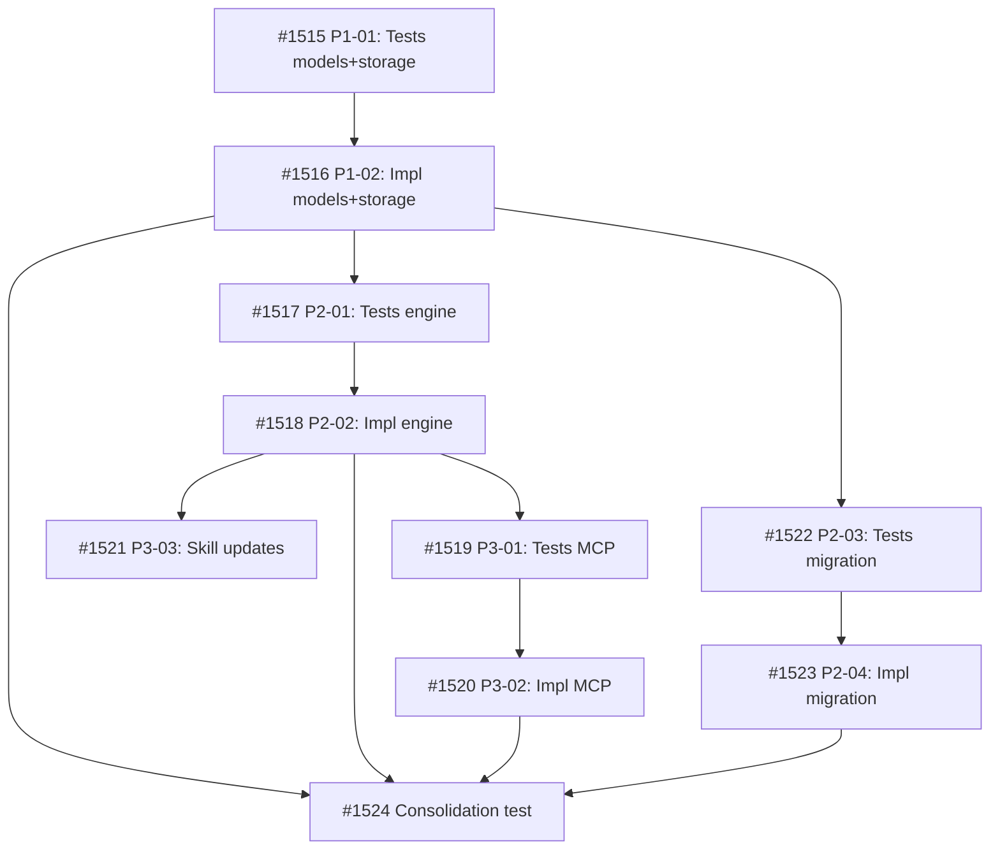

## Objective

Move Acceptance Criteria (`ac`) and Proof Bundle (`proof_bundle`) from freeform task body text to structured YAML frontmatter fields. Specification belongs in structure; the body becomes operational notes only.

## Brief

See `.owlbear/briefs/draft-structured-task-spec/brief.md` for the full Brief including field design, model/engine/MCP changes, skill updates, migration, and delivery constraints.

## Key Design Decisions

- `ac: list[str]` with dual mutation (full replacement OR atomic add/remove)
- `proof_bundle: str | None` with hybrid validation (model normalizes, engine validates membership)
- `proof_bundle` in TaskSummary + DispatchEntry; `ac` in Task + TaskFull only
- Same-release skill updates (5 skills)
- Recommended first-run proof_bundle migration script
- Cockpit UI deferred to follow-up task

## Acceptance Criteria

- AC1: `ac` (list[str]) and `proof_bundle` (str|None) are first-class frontmatter fields in the Task model
- AC2: `proof_bundle` appears in TaskSummary and DispatchEntry; `ac` does not
- AC3: Model normalizes `proof_bundle` (lowercase, sort modifiers) without membership validation
- AC4: Engine validates `proof_bundle` membership against frozenset in create/edit paths
- AC5: `edit_task` supports dual AC mutation (full replacement OR atomic add/remove, mutually exclusive)
- AC6: MCP tools (`create_task`, `edit_task`, `show_task`) expose both fields
- AC7: Engine search includes frontmatter AC items
- AC8: Pipeline skills read AC and proof_bundle from frontmatter instead of body text
- AC9: Migration script extracts proof_bundle from body to frontmatter
- AC10: Engine enforces AC guardrails (max 20 items, max 500 chars per item)
2026-05-13T02:30:37+00:00
## Planning
### Decomposition: Structured task specification in frontmatter (AC + proof_bundle)
- Tasks created: 10
- Dependency layers: 6
- Phases: 4

### Task List
| ID | Title | Priority | Depends On | Tags |
|----|-------|----------|------------|------|
| #1515 | P1-01: Tests for ac and proof_bundle model fields + storage canonical fields | needed | — | phase-1, scope:kanban, tdd, feature |
| #1516 | P1-02: Implement ac and proof_bundle model fields + storage canonical fields | critical | #1515 | phase-1, scope:kanban, tdd, feature |
| #1517 | P2-01: Tests for engine ac/proof_bundle in create_task, edit_task, and search | needed | #1516 | phase-2, scope:kanban, tdd, feature |
| #1518 | P2-02: Implement engine ac/proof_bundle in create_task, edit_task, and search | critical | #1517 | phase-2, scope:kanban, tdd, feature |
| #1519 | P3-01: Tests for MCP server ac/proof_bundle tool parameters | needed | #1518 | phase-3, scope:mcp-kanban, tdd, feature |
| #1520 | P3-02: Implement MCP server ac/proof_bundle tool parameters | needed | #1519 | phase-3, scope:mcp-kanban, tdd, feature |
| #1521 | P3-03: Pipeline skill updates for frontmatter ac/proof_bundle | important | #1518 | phase-3, scope:skills, feature |
| #1522 | P2-03: Tests for proof_bundle migration script | needed | #1516 | phase-2, scope:kanban, tdd, feature, migration |
| #1523 | P2-04: Implement proof_bundle migration script | needed | #1522 | phase-2, scope:kanban, tdd, feature, migration |
| #1524 | Consolidation test: structured task specification | important | #1516, #1518, #1520, #1523 | phase-4, scope:kanban, consolidation-test, feature |

### Dependency Graph

### Notes
- TDD pairs: #1515→#1516, #1517→#1518, #1519→#1520, #1522→#1523
- Parallel tracks after #1516: engine (#1517→#1518) and migration (#1522→#1523) are independent
- Parallel tracks after #1518: MCP (#1519→#1520) and skills (#1521) are independent
- #1521 (skill updates) is proof_bundle: skip (docs/process only, no TDD pair needed)
- Delivery constraint: #1521 ships same-release with code changes
2026-05-13T02:39:21+00:00
## Architecture Review

### Evaluation
| Criterion | Assessment | Notes |
|-----------|-----------|-------|
| Single responsibility | PASS | One cohesive feature: structured AC + proof_bundle in frontmatter |
| Interface clarity | PASS | Types, defaults, validation behavior specified in Brief and AC |
| Dependency correctness | PASS | 6-layer dep graph with correct phase ordering; parallel tracks identified |
| Module layering | PASS | models → engine → agent_view → MCP; follows existing kanban package layering |
| TDD compliance | PASS | 4 TDD pairs (#1515→#1516, #1517→#1518, #1519→#1520, #1522→#1523); #1521 correctly skip |
| KISS/YAGNI | PASS | Dual AC mutation follows existing body/append_body and add_tag/remove_tag patterns |
| Premise challenge | PASS | Moving spec from freeform body to structured frontmatter is a clear improvement for machine-queryable pipeline |
| Pattern consistency | PASS | Follows existing field addition pattern, validation pattern (model normalizes, engine validates membership), error taxonomy |
| Security surface | PASS | No new external boundaries; guardrails (max 20 items, 500 chars) are defense-in-depth |
| Single domain | PASS | kanban (#1515-#1518, #1522-#1524), mcp-kanban (#1519-#1520), skills (#1521) — each subtask single-domain |

### Decomposition Assessment
- 10 tasks, 4 phases, 6 dependency layers — well-structured
- Parallel tracks correctly identified: engine ∥ migration (phase 2), MCP ∥ skills (phase 3)
- Consolidation test (#1524) gates on all 4 implementation tracks
- AC coverage: parent AC1-AC10 fully mapped to child tasks

### Child AC Issues for Individual Reviews

**#1515/#1516 AC4 — dual `_CANONICAL_FIELDS` lists:**
`_CANONICAL_FIELDS` exists in both `storage.py` (L212) and `migrate.py` (L31) as independent copies. AC4 only references `storage._CANONICAL_FIELDS`. During individual review, update AC4 to: "Both `storage._CANONICAL_FIELDS` and `migrate._CANONICAL_FIELDS` include `ac` and `proof_bundle` positioned after `depends_on`"

**#1519/#1520 AC2 — missing explicit types:**
AC2 says "accepts `ac`, `add_ac`, `remove_ac`, and `proof_bundle` params" without specifying types. Brief incorrectly specifies `add_ac: str` at MCP level, but existing `add_tag` uses `list[str]`. During individual review, update to: `add_ac: list[str] | None` and `remove_ac: list[str] | None`

**#1521 AC1-AC3 — "instead of" vs fallback:**
AC says "instead of parsing body markdown sections" but Brief specifies "read frontmatter if present, fall back to body inspection for legacy tasks." During individual review, add fallback language for in-flight legacy tasks without frontmatter AC.

**#1521 AC4 — process instruction, not verifiable criterion:**
"Builder greps share/skills/" is a process instruction. During individual review, rewrite as: "No remaining references to body-based `Proof bundle:` or `## Acceptance Criteria` patterns exist in `share/skills/` after updates"

### Proof-Bundle Validation
- Planner assignment: (none on parent)
- Final bundle: skip (parent is a decomposed feature tracker; all work in children)
- Test-writer: SKIP

### Actions Taken
- Added `quality` pass-through tag to #1514 for pipeline routing
- Added `docs` pass-through tag to #1521 (non-implementation skill-file-only task)

### Challenge Results
- Challenger: SKIPPED — proof bundle `skip`

### Verdict: APPROVE
### Action Taken: Advanced #1514 → todo with quality pass-through tag. Child AC issues documented for individual architecture reviews.

Proof bundle: skip
2026-05-13T02:40:43+00:00
## Test-Writer Notes
- Proof bundle: skip — no new test writing required.
- Passing through to builder.
2026-05-13T02:49:27+00:00
## Builder Notes
- Implementation: none (tracker parent task; no source changes)
- Tests: not run (proof bundle skip parent task with no direct implementation surface)
- Coverage: n/a
- ruff: n/a
- Evidence summary:
  - Parent task #1514 AC1-AC10 represent aggregate feature completion across child tasks #1515-#1524.
  - Child dependency chain is not complete: #1515 currently in-progress; #1516-#1524 are backlog/blocked.
  - Advancing as DONE from builder would be a false green because required implementation tasks are unfinished.
- Fixes applied:
  - Added dependency `depends_on: [1524]` to #1514 so parent completion is gated by the consolidation child that already gates all implementation tracks.

### Required Follow-up
| # | Target Agent | Action Required | File(s) | Evidence |
|---|-------------|----------------|---------|----------|
| 1 | builder | Re-run Build #1514 only after child chain through #1524 is complete and available for parent verification/pass-through | .owlbear/kanban/tasks/1514-structured-task-specification-in-frontmatter-ac-proof_bundle.md | Child statuses from board: #1515 in-progress, #1516-#1524 backlog/blocked at build time |
| 2 | planner | Ensure parent tracker dispatch ordering respects `depends_on: [1524]` gate before routing to builder again | .owlbear/kanban/tasks/1514-structured-task-specification-in-frontmatter-ac-proof_bundle.md | Builder escalation: parent AC is aggregate and structurally unreachable before consolidation task completion |
2026-05-13T10:05:00+00:00
## Builder Notes
- Implementation: none (parent tracker task; implementation completed in child tasks)
- Tests: not run at parent level (proof bundle: skip)
- Coverage: n/a at parent level
- ruff: n/a at parent level
- Evidence summary:
  - Parent task #1514 is gated by `depends_on: [1524]`.
  - Consolidation child #1524 is `archived` with `archival_reason: completed`.
  - All decomposed implementation children #1515-#1524 are archived/completed.
  - Parent AC1-AC10 were delivered through the child task set; parent now eligible for pass-through closure.
- Fixes applied: none (status routing only)

2026-05-13T10:11:26+00:00
## Review Evidence
- Verdict: PASS
- PASS confirmation: PASS #1514 -> docs | Parent tracker closure is justified by archived child delivery and completed consolidation gate.
- Builder evidence reviewed first: this is a decomposed tracker task with `Proof bundle: skip`, no direct implementation surface, and an explicit dependency gate on `#1524` before pass-through closure (`.owlbear/kanban/tasks/1514-structured-task-specification-in-frontmatter-ac-proof-bundle.md:147`, `:163`, `:177-180`).
- Independent board check: `list_tasks(ids=[1515,1516,1517,1518,1519,1520,1521,1522,1523,1524])` returned all ten child tasks in `archived` with `archival_reason: completed`.
- Blocking findings: none.

| Parent AC | Child Evidence | Proof Evidence | Status |
|---|---|---|---|
| AC1 | `#1516` review maps `Task.ac` / `Task.proof_bundle` declaration and serialization at `.owlbear/kanban/archive/1516-p1-02-implement-ac-and-proof-bundle-model-fields-storage-canonical-fields.md:101` | `PASS #1516` at `:96` | PASS |
| AC2 | `#1516` review maps `TaskSummary.proof_bundle`, `DispatchEntry.proof_bundle`, and `TaskFull.ac` at `.owlbear/kanban/archive/1516-p1-02-implement-ac-and-proof-bundle-model-fields-storage-canonical-fields.md:102` | `PASS #1516` at `:96` | PASS |
| AC3 | `#1516` review maps proof-bundle normalization at `.owlbear/kanban/archive/1516-p1-02-implement-ac-and-proof-bundle-model-fields-storage-canonical-fields.md:103` | `PASS #1516` at `:96` | PASS |
| AC4 | `#1518` review maps engine proof-bundle validation at `.owlbear/kanban/archive/1518-p2-02-implement-engine-ac-proof-bundle-in-create-task-edit-task-and-search.md:195` | `PASS #1518` at `:190` | PASS |
| AC5 | `#1518` review maps dual AC mutation semantics at `.owlbear/kanban/archive/1518-p2-02-implement-engine-ac-proof-bundle-in-create-task-edit-task-and-search.md:196` | `PASS #1518` at `:190` | PASS |
| AC6 | `#1519` review proves MCP tool exposure and passthrough at `.owlbear/kanban/archive/1519-p3-01-tests-for-mcp-server-ac-proof-bundle-tool-parameters.md:125-127`; `#1520` review proves the repaired live AgentView bridge and returned fields at `.owlbear/kanban/archive/1520-p3-02-implement-mcp-server-ac-proof-bundle-tool-parameters.md:133-135` | `PASS #1519` at `:120`; `PASS #1520` at `:131` | PASS |
| AC7 | `#1518` review maps AC-aware search behavior at `.owlbear/kanban/archive/1518-p2-02-implement-engine-ac-proof-bundle-in-create-task-edit-task-and-search.md:199` | `PASS #1518` at `:190` | PASS |
| AC8 | `#1521` review maps frontmatter-first skill reads/writes with legacy fallback at `.owlbear/kanban/archive/1521-p3-03-pipeline-skill-updates-for-frontmatter-ac-proof-bundle.md:143-146` | `PASS #1521` at `:138` | PASS |
| AC9 | `#1523` review maps `_migrate_proof_bundle_field` extraction and preservation semantics at `.owlbear/kanban/archive/1523-p2-04-implement-proof-bundle-migration-script.md:109-111` | `PASS #1523` at `:102` | PASS |
| AC10 | `#1518` review maps AC guardrails at `.owlbear/kanban/archive/1518-p2-02-implement-engine-ac-proof-bundle-in-create-task-edit-task-and-search.md:198` | `PASS #1518` at `:190` | PASS |

- Parent tracker/dependency evidence: `.owlbear/kanban/tasks/1514-structured-task-specification-in-frontmatter-ac-proof-bundle.md:115-116` records `#1524` as the consolidation gate and states parent AC1-AC10 were fully mapped to child tasks. `.owlbear/kanban/tasks/1514-structured-task-specification-in-frontmatter-ac-proof-bundle.md:177-180` records pass-through closure only after `depends_on: [1524]` and child completion.
- Consolidation evidence: `.owlbear/kanban/archive/1524-consolidation-test-structured-task-specification.md:4` and `:23` show `#1524` archived/completed; `:97` records reviewer PASS; `:159` records audit archive action; `:77`, `:86`, and `:138` record the 13-test consolidation backstop passing.
- AC->code mapping: PASS. Every parent AC maps to an archived child task with reviewer-approved implementation evidence; the parent adds no further runtime surface beyond those children.
- Test->AC alignment: PASS. The child review packets provide targeted proof per requirement, and archived task `#1524` adds a cross-layer backstop for create/edit/show/migration behavior.
- Proof sufficiency: PASS. For this `skip` tracker task, the operative proof surface is audited child completion plus the archived consolidation gate, not new parent-level tests. That proof is stronger than a parent rerun because each delivery task already passed review individually.
- Safety & security: PASS. No unresolved auth, shell, SQL, path, secret, or network risk appears in the child review packets, and the parent task itself introduces no new runtime surface.

## Observations
- I could not run a path-scoped git contamination check in this tool surface.
- The decisive evidence here is board/dependency state plus archived child review/audit records, not parent-level execution.
2026-05-13T10:15:55+00:00
## Docs Gate

### Checklist

**Item 1: README Verification**
- `serve/mcp-kanban/README.md` — already reflects `ac`, `add_ac`, `remove_ac`, `proof_bundle` in tool signatures and Data Projections (TaskSummary, TaskFull, DispatchEntry). No gaps. ✓
- `serve/kanban/README.md` — 112 lines; method table uses ellipsis for params and has no model-field section; no task-caused documentation gap. ✓
- `share/skills/h-mcp-kanban/SKILL.md` — **task-caused gap found and fixed**: `create_task` and `edit_task` signatures were missing `ac`, `add_ac`, `remove_ac`, `proof_bundle`; TaskSummary, TaskFull, DispatchEntry projection schemas were missing `proof_bundle`/`ac`/`proof_bundle`. Updated in commit `2335969e`. ✓
- `share/README.md`, `README.md`, `README-consumer.md` — no model-field references; no task-caused gaps. ✓

**Item 2: External Attribution** — N/A; no external sources used; implementation followed existing kanban engine patterns.

**Item 3: Research Doc** — N/A; no research file exists for this task (Brief at `.owlbear/briefs/draft-structured-task-spec/` is a design doc, not a research artifact).

**Item 4: Deletion Detection** — N/A; parent tracker has no direct file deletions; all child tasks archived without orphan references.

### Files Updated
- `share/skills/h-mcp-kanban/SKILL.md` — tool signatures and projection schemas updated

### Scratch Cleanup
- No `1514-*` scratch files found; nothing to clean.
2026-05-13T10:21:23+00:00
## Audit\n### Regression Detection\n- quality-runner mode full: 4522 passed, 217 failed, 14 skipped; lint clean; vitest clean\n- All 217 failures are pre-existing in unrelated domains: test_cockpit_view.py (CockpitView relocation #1224), test_ideation_diagram.py (#1034), test_server.py (#1170 status names), test_engine_accessor_migration.py (#1173/#1174). None overlap with kanban models/engine/mcp-kanban/skills domain.\n- No task-introduced regressions detected.\n- regression verdict: PASS\n\n### Intent Verification\n- scope alignment: PASS (all 10 children scoped to declared domains: scope:kanban, scope:mcp-kanban, scope:skills; parent is tracker with depends_on:[1524] gate)\n- purpose match: PASS (structured AC+proof_bundle in YAML frontmatter delivered through child chain: models #1515/#1516, engine #1517/#1518, MCP #1519/#1520, skills #1521, migration #1522/#1523, consolidation #1524)\n- extraneous scope: none\n- boundary check: function-level behavior verification deferred to reviewer\n\n### Architect Quality: 4/5\n- AC specificity: AC1-AC10 include types (list[str], str|None), validation behavior, guardrails (max 20, 500 chars), and dual mutation semantics\n- Edge case coverage: AC5 mutual exclusivity, AC10 guardrails, architecture review pre-identified 4 child AC issues with remediation\n- Design direction: Brief + 10-task decomposition with 6-layer dependency graph; parallel tracks correctly identified\n- Minor gap: some child AC issues needed inline correction during reviews (not blocking)\n\n### Commit Integrity\n- upstream commit presence: PASS (30+ commits spanning #1515-#1524; each child has test-writer, builder, and auditor archive commits; doc-writer commit 2335969e for skill updates)\n- kanban commit packaging: PASS (archival commits present for all 10 children)\n\n### Deduction Breakdown\n- Regression failures: 0 (all 217 pre-existing, none in task domain)\n- Intent mismatch: 0\n- Evidence integrity concern: 0\n- Lint violations: 0\n- AC quality score 4 > 3: 0\n- Missing reviewer evidence: 0 (detailed PASS with AC1-AC10 mapping table)\n\n### Confidence: 1.00\n### Action: archive