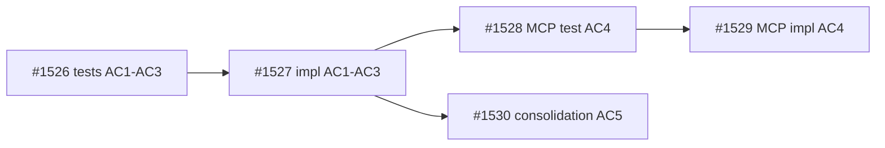

## Summary

Decomposition parent for dep-status guidance in `start_work()`. All implementation and proof is delegated to child tasks #1526-#1530.

## Brief

`.owlbear/briefs/draft-dep-status-guidance/brief.md`

## Acceptance Criteria

- AC1: All child tasks (#1526-#1530) reach `done` or `archived` status with passing proof bundles
- AC2: Combined child proof covers the original feature scope: dep-blocked guidance format (#1526/#1527), MCP passthrough (#1528/#1529), exception-tuple parity consolidation (#1530)

## Design

- Inline dep iteration after successful claim in `agent_view.start_work()`
- Compute dep_status via existing `engine._compute_dep_status()`
- Blocked-only scope (redirect dropped)
- ~15 LoC change, no schema changes, no MCP surface changes

## Test Strategy

Proof delegated to children:
- Unit tests: #1526/#1527 (original AC1-AC3)
- MCP integration: #1528/#1529 (original AC4)
- Consolidation: #1530 (original AC5)

## Planning
### Decomposition: Add dep-status guidance to start_work()
- Tasks created: 5
- Dependency layers: 3
- Phases: 1 (kanban unit), 2 (MCP integration), 3 (consolidation)

### Task List
| ID | Title | Priority | Depends On | Tags |
|----|-------|----------|------------|------|
| #1526 | P1-01: tests for dep-status guidance in start_work (AC1-AC3) | critical | — | phase-1, scope:kanban, test |
| #1527 | P1-02: implement dep-status guidance in start_work (AC1-AC3) | critical | #1526 | phase-1, scope:kanban, feature |
| #1528 | P2-01: MCP integration test for start_work guidance passthrough (AC4) | needed | #1527 | phase-2, scope:mcp-kanban, test |
| #1529 | P2-02: implement MCP start_work guidance passthrough (AC4) | needed | #1528 | phase-2, scope:mcp-kanban, feature |
| #1530 | P3-01: consolidation test — dep-lookup exception tuple parity (AC5) | needed | #1527 | phase-3, scope:kanban, consolidation-test |

### Dependency Graph

## Review History

### First pass (rejected)
- Original ACs were executable (AC1-AC5 specified exact format strings and test assertions)
- Parent was routed as `Proof bundle: skip` with executable ACs — creating an impossible review gate
- Children #1528, #1529, #1530 still in `research`; #1526 in `todo`; #1527 in `research`
- Reviewer correctly identified structural mismatch: skip-bundle parent cannot prove executable ACs
- Re-scoped: executable ACs moved to children where proof lives; parent now gates on child completion via depends_on

Proof bundle: skip
2026-05-13T13:06:49+00:00
## Architecture Review (Re-scope Pass)

### Context
Reviewer correctly rejected first pass: parent carried executable ACs (exact format strings, assertion targets) but `Proof bundle: skip` — structurally impossible to prove at parent level when children are undelivered.

### Changes Applied
1. **ACs rewritten to umbrella-level:** AC1 = all children reach done/archived; AC2 = combined child proof covers original scope
2. **Dependencies added:** `depends_on: [1529, 1530]` gates parent on terminal children (phase-2 impl + phase-3 consolidation)
3. **Review history preserved** for audit trail

### Evaluation
| Criterion | Assessment | Notes |
|-----------|-----------|-------|
| Single responsibility | PASS | Umbrella tracking only |
| Interface clarity | PASS | ACs reference specific child IDs and their scopes |
| Dependency correctness | PASS | depends_on [1529, 1530] covers both terminal phases; #1527 implicitly covered via chain |
| Module layering | PASS | N/A (non-impl) |
| TDD compliance | PASS | N/A (non-impl, quality tag) |
| KISS/YAGNI | PASS | Minimal umbrella — no redundant AC duplication |
| Premise challenge | PASS | Decomposition parent is valid coordination artifact |
| Pattern consistency | PASS | Standard umbrella + depends_on gating |
| Security surface | PASS | No new boundaries |
| Single domain | PASS | Kanban domain only |

### Challenge Results
- Challenger: SKIPPED — proof bundle `skip`

### Proof-Bundle Validation
- Planner assignment: skip (decomposition parent)
- Final bundle: skip
- Existing proof scope: N/A
- Test-writer: SKIP

### Verdict: APPROVE (REFINE path — ACs rewritten + deps added, then advanced)
### Action Taken: Re-scoped executable ACs to umbrella-level, added depends_on [1529, 1530], advanced to todo. Task will be dep-blocked until terminal children deliver.
2026-05-13T17:26:49+00:00
## Test-Writer Notes
- Proof bundle: skip — no new test writing required.
- Decomposition parent umbrella task; also tagged `quality` (non-impl).
- Passing through to builder.
2026-05-13T17:27:44+00:00
## Builder Notes
- Task type: non-implementation umbrella pass-through (`Proof bundle: skip`).
- Files changed: none.
- Quality-runner: not required for this parent pass-through per proof-bundle skip routing.

### AC Verification
- AC1 (all children #1526-#1530 done/archived with passing proof): PASS.
  - #1526 archived (phase-1 tests)
  - #1527 archived (phase-1 implementation + review/audit pass)
  - #1528 archived (phase-2 MCP integration tests)
  - #1529 archived (phase-2 MCP passthrough implementation verify-only + review/audit pass)
  - #1530 archived (phase-3 consolidation test + review/audit pass)

- AC2 (combined child proof covers original feature scope): PASS.
  - Dep-blocked guidance format scope (#1526/#1527): covered by phase-1 tests + implementation evidence in #1527 review/audit.
  - MCP passthrough scope (#1528/#1529): covered by existing-proof MCP guidance passthrough tests and verification in #1529 review/audit.
  - Exception-tuple parity consolidation scope (#1530): covered by AST parity drift-guard tests in #1530 review/audit.

### Evidence Summary
- Parent #1525 is a decomposition coordinator only; no direct source edit is required.
- Dependency chain is complete and archived with passing review/audit sections on each terminal child.
- Parent acceptance criteria are therefore satisfied; advancing to review.
2026-05-13T17:31:04+00:00
## Review Evidence
- Verdict: PASS
- PASS confirmation: PASS #1525 -> docs | AC mapped to code and evidence sufficient.
- Blocking findings: none.
- Builder evidence reviewed first: parent #1525 is a non-implementation umbrella pass-through with no changed files. Independent verification was limited to the archived child task records because AC1-AC2 are about child completion and downstream proof coverage, not parent-local source edits.

| AC Line | Code Evidence | Test Evidence | Status |
|---|---|---|---|
| AC1 | `.owlbear/kanban/archive/1526-p1-01-tests-for-dep-status-guidance-in-start-work-ac1-ac3.md:4`, `.owlbear/kanban/archive/1527-p1-02-implement-dep-status-guidance-in-start-work-ac1-ac3.md:4`, `.owlbear/kanban/archive/1528-p2-01-mcp-integration-test-for-start-work-guidance-passthrough-ac4.md:4`, `.owlbear/kanban/archive/1529-p2-02-implement-mcp-start-work-guidance-passthrough-ac4.md:4`, and `.owlbear/kanban/archive/1530-p3-01-consolidation-test-dep-lookup-exception-tuple-parity-ac5.md:4` all record `status: archived`; corresponding child review PASS confirmations appear at `:89`, `:145`, `:108`, `:106`, and `:103`; archival completion is recorded at `:150`, `:205`, `:167`, `:158`, and `:159`. | Child proof bundles were already accepted in the downstream review chain before archival; no parent-local executable proof is required for this `Proof bundle: skip` umbrella task. | PASS |
| AC2 | Dep-guidance scope is defined in `.owlbear/kanban/archive/1526-p1-01-tests-for-dep-status-guidance-in-start-work-ac1-ac3.md:28-30` and `.owlbear/kanban/archive/1527-p1-02-implement-dep-status-guidance-in-start-work-ac1-ac3.md:29-31`; implementation review maps exact guidance, no-active suppression, and exception/claim semantics at `.owlbear/kanban/archive/1527-p1-02-implement-dep-status-guidance-in-start-work-ac1-ac3.md:151-153`. MCP passthrough scope is defined at `.owlbear/kanban/archive/1528-p2-01-mcp-integration-test-for-start-work-guidance-passthrough-ac4.md:29` and `.owlbear/kanban/archive/1529-p2-02-implement-mcp-start-work-guidance-passthrough-ac4.md:29`; review proof maps passthrough/non-overwrite at `.owlbear/kanban/archive/1528-p2-01-mcp-integration-test-for-start-work-guidance-passthrough-ac4.md:113` and `.owlbear/kanban/archive/1529-p2-02-implement-mcp-start-work-guidance-passthrough-ac4.md:112`. Exception-tuple parity scope is defined at `.owlbear/kanban/archive/1530-p3-01-consolidation-test-dep-lookup-exception-tuple-parity-ac5.md:29` and proven at `.owlbear/kanban/archive/1530-p3-01-consolidation-test-dep-lookup-exception-tuple-parity-ac5.md:96`. | Proof sufficiency is explicitly recorded for MCP passthrough at `.owlbear/kanban/archive/1529-p2-02-implement-mcp-start-work-guidance-passthrough-ac4.md:114` and for exception-tuple parity at `.owlbear/kanban/archive/1530-p3-01-consolidation-test-dep-lookup-exception-tuple-parity-ac5.md:110`; dep-guidance proof is already batched in the implementation child review table at `.owlbear/kanban/archive/1527-p1-02-implement-dep-status-guidance-in-start-work-ac1-ac3.md:151-153`. | PASS |

## Observations
- The earlier re-scope fixed the structural gate correctly: parent umbrella ACs now live in `.owlbear/kanban/tasks/1525-add-dep-status-guidance-to-start-work.md:32-33`, while all executable proof lives in archived children. That avoids the original impossible `skip`-bundle review condition.
- No independent quality-runner rerun was needed. This task has no changed files, and the parent ACs are satisfied by the archived child status/proof chain already recorded in the board.
2026-05-13T17:33:06+00:00
## Docs Gate

**Verdict: PASS — no docs impact**

### Checklist

| Item | Result | Evidence |
|------|--------|----------|
| README Verification | N/A | No changed files; umbrella pass-through with all implementation in archived children #1526–#1530 — no README targets map |
| External Attribution | N/A | No external sources referenced |
| Research Doc | N/A | No research artifact; brief is a planning artifact only |
| Deletion Detection | N/A | No files deleted |

### Scratch Cleanup
No `.owlbear/scratch/1525-*` files existed.
2026-05-13T17:38:03+00:00
## Audit\n### Regression Detection\n- quality-runner mode full: 4605 passed, 210 failed (pre-existing), 14 skipped, lint clean\n- All failures are pre-existing across test_cockpit_view, test_server, test_engine_accessor_migration, test_ideation_diagram — verified by independent rerun; none related to this zero-code-change umbrella task\n- regression verdict: PASS\n\n### Intent Verification\n- scope alignment: PASS (decomposition parent with no code changes; all 5 children #1526-#1530 archived with archival_reason=completed)\n- purpose match: PASS (umbrella coordinates dep-status guidance feature across kanban unit tests, MCP integration, and consolidation phases)\n- extraneous scope: none\n- boundary check: function-level behavior verification deferred to reviewer\n\n### Architect Quality: 4/5\n- Initial pass had structural mismatch (executable ACs on skip-bundle parent) — caught by reviewer and correctly re-scoped\n- Re-scope was well-executed: umbrella ACs rewritten to child-completion gating, depends_on correctly set to terminal children [1529, 1530]\n- Decomposition quality is good: 5 tasks, 3 phases, clean dependency graph, single-responsibility per child\n- Minor deduction for the initial structural error requiring a review rejection cycle\n\n### Commit Integrity\n- upstream commit presence: PASS (all 5 children have source/test commits: 523c28d7, 9a29e420, 465fa185, e2abaf16, ceeeb964 + archival commits for each)\n- kanban commit packaging: pending (this archival commit)\n- no source commits expected for this non-implementation parent\n\n### Deduction Breakdown\n- No deductions apply: no intent mismatch, no evidence integrity concerns, lint clean, AC quality 4/5 (>3), reviewer evidence section present and detailed, no regressions attributable to this task\n\n### Confidence: 1.00\n### Action: archive