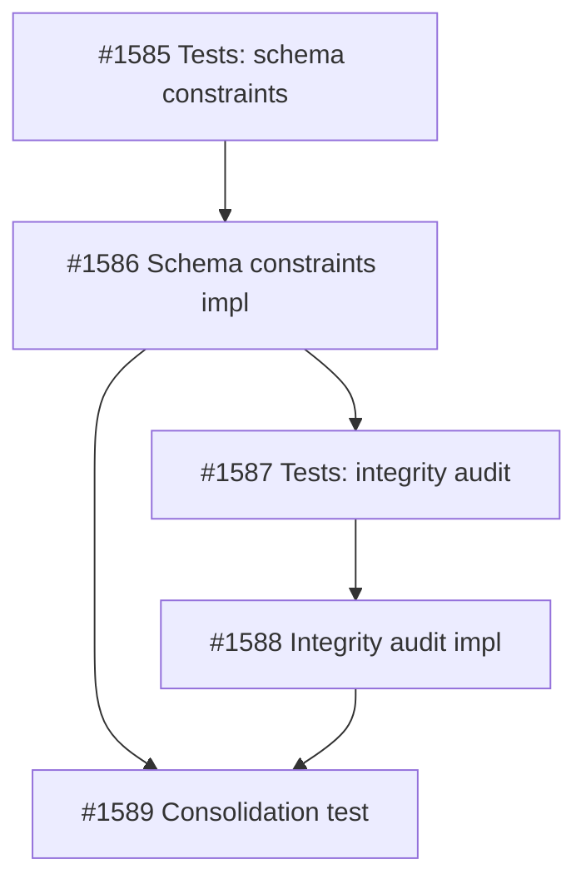

Context:
Knowledge module audit found that the SQLite schema does not currently prevent the orphan states being fixed in service code. `init_db(...)` explicitly sets `PRAGMA foreign_keys = OFF`, and several key provenance fields remain nullable or unenforced. Current and recent bugs can insert orphan documents, chunks, entities, edges, or stale vectors without the database rejecting them.

Intent:
Do not overload the core source/enrichment repair tasks. First establish the intended invariants after #1556 and #1557, then add a practical repair/check/enforcement layer.

Scope:
- In scope: define and verify database-level knowledge invariants for documents, chunks, entities, edges, sources, reviewed pairs, and vector payload linkage; add repair/audit tooling or schema constraints where practical; document any invariant intentionally enforced in service code instead of SQLite DDL.
- Out of scope: full corpus ingestion, source lifecycle UX, Cockpit UI, automatic enrichment, and changing the manual enrichment model.

Functional acceptance note:
Acceptance is based on persisted-state inspection and invariant checks. Passing or failing tests alone is not functional proof.

Acceptance Criteria:
AC-1: Define the required invariants for source-linked documents, chunks, phase-1 entities, phase-2 edges, and vector payload IDs after #1556/#1557 are complete.
AC-2: Provide an invariant audit/repair command or function that detects existing orphan rows and reports actionable counts/IDs without mutating data unless explicitly requested.
AC-3: Add SQLite constraints, indexes, triggers, or explicit write-path guards for invariants that can be enforced safely without blocking valid manual-enrichment workflows.
AC-4: If `PRAGMA foreign_keys` remains disabled, document why and prove equivalent enforcement for the affected relationships; otherwise enable it deliberately and prove core write paths still work.
AC-5: Proof must create at least one invalid/orphan scenario and show that the invariant layer detects or rejects it, then create valid source-linked/enriched data and show it passes.

Dependencies:
Wait for source/document/vector identity repair and manual enrichment persistence repair so this task hardens the final intended model, not today’s broken intermediate state.
2026-05-15T16:25:23+00:00
## Planning
### Decomposition: Harden knowledge database integrity invariants
- Tasks created: 5
- Dependency layers: 4
- Phase: 1

### Task List
| ID | Title | Priority | Depends On | Tags |
|----|-------|----------|------------|------|
| #1585 | P1-01: Tests — knowledge schema constraint enforcement | critical | — | phase-1, scope:knowledge, type:test, db-integrity |
| #1586 | P1-02: Knowledge schema constraint enforcement | critical | #1585 | phase-1, scope:knowledge, type:build, db-integrity, hardening |
| #1587 | P1-03: Tests — knowledge integrity audit function | needed | #1586 | phase-1, scope:knowledge, type:test, db-integrity |
| #1588 | P1-04: Knowledge integrity audit function | needed | #1587 | phase-1, scope:knowledge, type:build, db-integrity |
| #1589 | Consolidation test: knowledge DB integrity hardening | important | #1586, #1588 | consolidation-test, scope:knowledge, type:test, db-integrity |

### Dependency Graph

### Design Rationale
- **FK enablement before audit**: Schema constraints (#1586) must land first so the audit function (#1588) operates against the hardened schema. The audit function catches pre-existing violations and states that FK enforcement alone cannot detect (e.g., databases migrated from pre-v12).
- **NOT NULL scope**: Migration v12 targets `entities.document_id` and `edges.document_id` — provenance columns that must be populated after #1556/#1557. `documents.source_id` left nullable (ad-hoc documents without sources are legitimate).
- **Orphan injection in tests**: Audit and consolidation tests inject orphans via direct SQL with `PRAGMA foreign_keys = OFF` to simulate pre-migration data or edge-case corruption.

[[2026-05-17T02:47:20+02:00]]
## Architecture Review
### Evaluation
| Criterion | Assessment | Notes |
|-----------|-----------|-------|
| Single responsibility | PASS | Parent task is a coordination container for DB integrity hardening |
| Interface clarity | PASS | All 5 parent ACs decomposed into precise subtask ACs |
| Dependency correctness | PASS | #1556 (archived), #1557 (archived), #1589 (archived) — all completed |
| Module layering | PASS | All work within serve/knowledge/ domain |
| TDD compliance | PASS | Each subtask pair followed RED/GREEN; consolidation test exists |
| KISS/YAGNI | PASS | Minimal decomposition: 4 TDD tasks + 1 consolidation test |
| Premise challenge | PASS | All confirmed bugs addressed: FK enabled, NOT NULL enforced, audit function extracted |
| Pattern consistency | PASS | Follows existing knowledge module patterns |
| Security surface | PASS | FK enforcement and NOT NULL constraints improve data integrity |
| Single domain | PASS | Knowledge module only |

### Parent AC Coverage
| Parent AC | Subtask | Evidence |
|-----------|---------|----------|
| AC-1 (define invariants) | #1586 | Schema v13: FK ON, NOT NULL on entities.document_id and edges.document_id |
| AC-2 (audit function) | #1587 + #1588 | audit_integrity() in owlbear_knowledge.integrity, 8 tests, read-only |
| AC-3 (SQLite constraints) | #1585 + #1586 | FK enforcement, NOT NULL, v12→v13 migration with orphan/transitive cleanup |
| AC-4 (FK pragma decision) | #1586 | PRAGMA foreign_keys = ON enabled deliberately; write paths proven (store_chunks, store_extractions, delete_document_data) |
| AC-5 (proof with orphan+valid) | #1589 | Consolidation test: clean chain with linkage assertions + orphan injection detection |

### Subtask Status
- #1585 (tests, schema constraints): archived/completed
- #1586 (schema constraint enforcement): archived/completed
- #1587 (tests, integrity audit): archived/completed
- #1588 (integrity audit extraction): archived/completed
- #1589 (consolidation test): archived/completed

### Challenge Results
- Challenger: SKIPPED — all subtasks archived with full review cycles; parent is a coordination container with no independent design decisions

### Proof-Bundle Validation
- Planner assignment: null (parent task)
- Final bundle: N/A (work done in subtasks; parent has `quality` pass-through tag)
- Test-writer: PASS-THROUGH (quality tag)

### Verdict: APPROVE
### Action Taken: All 5 subtasks archived/completed. All 3 dependencies satisfied. Parent ACs fully covered by decomposition. Advanced to todo with quality pass-through tag.

[[2026-05-17T02:47:49+02:00]]
## Test-Writer Notes
- Non-implementation task (tagged `quality`) — parent coordination container, no testable interfaces.
- All 5 subtasks (#1585, #1586, #1587, #1588, #1589) archived with full TDD RED/GREEN cycles.
- Passing through to builder.

[[2026-05-17T02:49:33+02:00]]
## Builder Notes
- Classification: Non-implementation pass-through (tagged quality) confirmed from Test-Writer Notes.
- Code changes: None.
- Files changed by builder implementation: None.
- Verification evidence (quality-runner scoped):
  - Tests: 2 passed, 0 failed, 0 skipped
  - Test path: tests/test_knowledge_integrity_consolidation_1589.py
  - Lint: clean (ruff violations: 0)
  - Coverage snapshot (scoped run): integrity.py 100%, models.py 94%, protocol.py 100% (overall 27% due scoped execution)
- AC evidence summary inherited from completed subtasks:
  - AC-1/AC-3/AC-4: schema hardening completed in #1586
  - AC-2: invariant audit function completed in #1588
  - AC-5: invalid+valid scenario proof completed in #1589 consolidation test
- Fixes applied in this builder step: None required (parent coordination container only).
- Routing decision: advance to review with fresh scoped proof attached.

[[2026-05-17T03:04:41+02:00]]
## Review Evidence
- Verdict: PASS
- PASS confirmation: PASS #1580 -> docs | AC mapped to code and evidence sufficient.
- Builder evidence reviewed first: the parent builder step correctly identified this as a coordination/pass-through task with no new implementation files, and its scoped proof on `tests/test_knowledge_integrity_consolidation_1589.py` is consistent with the live file state.
- Coordination closure verified: explicit child set `#1585`-`#1589` is archived/completed, and prerequisite dependency tasks `#1556` and `#1557` are also archived/completed.

| AC Line | Code/Test Evidence | Status |
|---|---|---|
| AC-1 | Invariant definitions and proof are distributed across the dependency surface this parent explicitly depends on: source-linked document identity and vector-linkage proof in `tests/test_knowledge_ingest_source_identity_1556.py:163-268`, `tests/test_knowledge_ingest_source_identity_1556.py:279-340`, `tests/test_knowledge_ingest_source_identity_1556.py:1365-1468`, and `tests/test_knowledge_ingest_source_identity_1556.py:1524-1608`; phase-1/phase-2 provenance and durable reviewed-pair identity in `tests/test_enrichment_persistence_1557.py:167-178`, `tests/test_enrichment_persistence_1557.py:204-390`, and `tests/test_enrichment_persistence_1557.py:750-840`; DB hardening invariants in `serve/knowledge/src/owlbear_knowledge/schema.py:23-24`, `serve/knowledge/src/owlbear_knowledge/schema.py:46-95`, and `serve/knowledge/src/owlbear_knowledge/schema.py:439-525`. | PASS |
| AC-2 | Read-only invariant audit exists in `serve/knowledge/src/owlbear_knowledge/integrity.py:11-75` and returns actionable count/id buckets for orphan chunks, orphan entities, dangling edges, and orphan status rows. Detection and read-only behavior are proved in `tests/test_knowledge_integrity_extraction_1588.py:101-330` and consolidated in `tests/test_knowledge_integrity_consolidation_1589.py:136-177`. | PASS |
| AC-3 | SQLite-enforceable invariants are hardened via FK enablement, NOT NULL provenance columns, and durable reviewed-pair identity in `serve/knowledge/src/owlbear_knowledge/schema.py:46-95`, `serve/knowledge/src/owlbear_knowledge/schema.py:324-410`, and `serve/knowledge/src/owlbear_knowledge/schema.py:452-525`; write-path guards and cleanup live in `serve/knowledge/src/owlbear_knowledge/document_store.py:45-309`. Proof exists in `tests/test_schema_constraint_enforcement_1586.py:116-393`, plus source/vector and enrichment guard tests in `tests/test_knowledge_ingest_source_identity_1556.py:1365-1608` and `tests/test_enrichment_persistence_1557.py:204-390`. | PASS |
| AC-4 | `init_db()` deliberately enables `PRAGMA foreign_keys = ON` in `serve/knowledge/src/owlbear_knowledge/schema.py:452-519`, and migration/write-path proof exists in `tests/test_schema_constraint_enforcement_1586.py:128-393`. | PASS |
| AC-5 | Invalid/orphan scenarios are created and detected in `tests/test_knowledge_integrity_consolidation_1589.py:136-177` and `tests/test_knowledge_integrity_extraction_1588.py:160-304`. Valid source-linked/vector behavior is proved in `tests/test_knowledge_ingest_source_identity_1556.py:163-268`, `tests/test_knowledge_ingest_source_identity_1556.py:279-340`, and `tests/test_knowledge_ingest_source_identity_1556.py:1524-1608`. Valid enriched provenance/identity behavior is proved in `tests/test_enrichment_persistence_1557.py:167-178`, `tests/test_enrichment_persistence_1557.py:204-390`, and `tests/test_enrichment_persistence_1557.py:750-840`. For a coordination container, that inherited proof surface is sufficient. | PASS |

- Blocking findings: none.

## Observations
- The parent Architecture Review coverage table and Builder Notes understate inherited proof by mapping the parent mostly to `#1586`, `#1588`, and `#1589`; the real closure basis also includes explicit dependency tasks `#1556` and `#1557`. This is a documentation-quality issue in the task summary, not a correctness gap.
- `#1589` is correctly narrow: it proves the hardened relational audit layer and clean document→chunk→entity→edge chain. Source-linked document identity, vector payload linkage, and reviewed-pair provenance remain owned by `#1556` and `#1557`, which is consistent with the parent task's dependency structure.
- No independent `quality-runner` rerun was needed because the blocker question was proof scoping, not conflicting test output, and the live code/tests aligned with the archived dependency proofs.

[[2026-05-17T03:06:40+02:00]]
## Docs Gate
### Checklist
| # | Check | Applies? | Status | Evidence |
|---|-------|----------|--------|----------|
| 1 | README verification | No | N/A | No public API changes. `integrity.py` exports `audit_integrity()` as internal only — not in `__init__.py`. `schema.py` FK enforcement and `document_store.py` write-path guards are internal changes. README module table (`DocumentStore`, `init_db`, `GraphStore`, etc.) remains accurate. |
| 2 | External attribution | No | N/A | No external sources cited in task body, builder notes, or review evidence. |
| 3 | Research doc | No | N/A | No research artifact linked or expected for this coordination container task. |
| 4 | Deletion detection | No | N/A | No files deleted. Subtasks added `integrity.py` and hardened existing `schema.py` and `document_store.py`. No orphaned references. |

### Verification Layers
- Layer 1 — grep: `__init__.py` confirmed `audit_integrity` absent from exports; README module table lists only public symbols. No removed symbols, flags, or commands.
- Layer 2 — editorial: README accurately describes the library API, launch pattern, module groups, and dependency extras. Schema hardening (FK ON, NOT NULL) and new internal audit function do not change any documented public interface.

### Scratch Cleanup
No `.owlbear/scratch/1580-*` files found — nothing to clean.

[[2026-05-17T03:13:03+02:00]]
## Audit
### Regression Detection
- quality-runner mode full: 6508 passed (4639 Python + 1869 frontend), 20 failed, 14 skipped; lint clean (ruff 0, eslint 0)
- 20 failures are all in non-knowledge domains: test_ideation_diagram (1), test_cockpit_view (10), test_server (4), test_engine_accessor_migration (1), frontend FilterPanel/ResolveModal/SidecarCollapse (4). Zero knowledge-domain test failures.
- regression verdict: PASS (pre-existing background failures only; no knowledge regressions)

### Intent Verification
- scope alignment: PASS (all changed files within serve/knowledge/ and tests/test_knowledge_*|test_schema_*|test_enrichment_* — correct domain for knowledge DB integrity hardening)
- purpose match: PASS (coordination parent; 5 subtasks archived/completed covering schema FK enforcement, NOT NULL constraints, integrity audit function, and consolidation proof)
- extraneous scope: none
- boundary check: function-level behavior verification deferred to reviewer

### Architect Quality: 4/5
AC lines were specific and actionable: 5 ACs covering invariant definition, audit function, constraints, FK pragma decision, and orphan+valid proof. Decomposition into 4 TDD pairs + 1 consolidation test was clean. Minor gap: AC-1 (\"define required invariants\") is slightly abstract, but was concretized well by the subtask decomposition. Edge cases well covered via orphan injection and write-path proof requirements.

### Commit Integrity
- upstream commit presence: PASS (git log shows commits from all 5 subtasks: schema.py, integrity.py, document_store.py, and 3 test files all committed with proper task attribution)
- kanban commit packaging: pending (will commit after end_work)

### Deduction Breakdown
No deductions applied:
- Intent mismatch: 0
- Evidence integrity concern: 0
- Lint violations: 0
- AC quality (4/5 > 3): 0
- Missing reviewer evidence: 0 (detailed PASS with full AC-to-code mapping)
- Regression failures: 0 (no knowledge-domain regressions)

### Confidence: 1.00
### Action: archive
