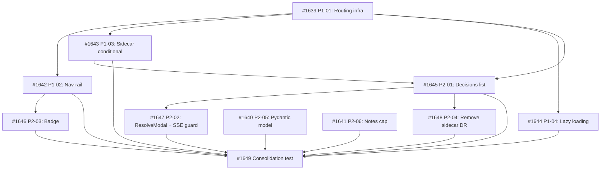

## Brief

Establish multi-tab navigation infrastructure for the Cockpit, using a decisions tab as pathfinder. The tab system is the primary deliverable — it enables planned Memory and Ideas Notebook tabs. The decisions tab provides a dedicated full-width workspace for pending DR resolution.

## Deliverables

### P1 — Tab Shell (purely additive, no regressions)

1. Route config array — declarative route entries
2. Nav-rail wiring — buttons with useNavigate(), role=\"navigation\"
3. React Router routes in Shell — active tab component rendering
4. Skeleton decisions page at /decisions
5. Route-conditional sidecar — suppress sidecar DOM on non-kanban routes
6. Lazy loading — React.lazy() with suspense boundary

### P2 — Decisions Content

1. Pending DR list — full-page single-column, generous spacing
2. Click → ResolveModal (existing component)
3. Modal snapshot on open — SSE guard, DR data copied to modal-local state
4. Pending count badge — nav-rail, visible only when count > 0
5. Remove DecisionViewport from sidecar
6. Pydantic response model on GET /api/decisions/pending
7. Notes length cap (max_length=10_000) on ResolveRequest
8. Empty state design

## Key Architecture

- React Router URL = source of truth
- Single ResolveModal at Shell level (shared between tab and status-bar entry)
- CockpitProvider unchanged — no new state fields
- Desktop-only design; existing breakpoints handled without regression
- Pending-only for V1; resolved DRs deferred

## Entry Paths

- Primary: nav-rail tab → list → click DR → modal
- Secondary: status-bar DRStatusIndicator → popover → click DR → modal (any route)

## Brief Location

`.owlbear/briefs/draft-cockpit-decisions-tab/brief.md`

[[2026-05-18T00:50:53+02:00]]
## Planning
### Decomposition: Cockpit Decisions Tab — multi-tab infrastructure + decisions workspace
- Tasks created: 11 (10 implementation + 1 consolidation)
- Dependency layers: 4
- Phases: P1 (tab shell, 4 tasks) + P2 (decisions content, 6 tasks) + consolidation

### Task List
| ID | Title | Priority | Depends On | Tags |
|----|-------|----------|------------|------|
| #1639 | P1-01: Tab routing infrastructure — route config + Routes rendering + skeleton page | critical | — | phase-1, scope:cockpit-web, frontend, infrastructure |
| #1642 | P1-02: Nav-rail tab navigation — dynamic buttons from route config | needed | #1639 | phase-1, scope:cockpit-web, frontend |
| #1643 | P1-03: Route-conditional sidecar — suppress sidecar DOM on non-kanban routes | needed | #1639 | phase-1, scope:cockpit-web, frontend |
| #1644 | P1-04: Lazy loading — React.lazy() with Suspense boundary | important | #1639 | phase-1, scope:cockpit-web, frontend |
| #1645 | P2-01: Decisions list page with empty state | needed | #1639, #1643 | phase-2, scope:cockpit-web, frontend |
| #1646 | P2-03: Pending count badge on nav-rail decisions button | important | #1642 | phase-2, scope:cockpit-web, frontend |
| #1647 | P2-02: ResolveModal integration + modal snapshot SSE guard | important | #1645 | phase-2, scope:cockpit-web, frontend |
| #1648 | P2-04: Remove DecisionViewport from sidecar | important | #1645 | phase-2, scope:cockpit-web, frontend |
| #1640 | P2-05: Pydantic response model for GET /api/decisions/pending | important | — | phase-2, scope:cockpit, backend |
| #1641 | P2-06: Notes length cap on ResolveRequest | important | — | phase-2, scope:cockpit, backend |
| #1649 | Consolidation test: Cockpit Decisions Tab multi-tab infrastructure | needed | all above | consolidation-test, scope:cockpit-web, scope:cockpit |

### Dependency Graph

### Key Design Decisions
- P2 backend (#1640, #1641) has no P1 dependencies — can proceed in parallel with P1 frontend
- Modal snapshot SSE guard bundled with ResolveModal integration (#1647) per brief constraint
- Sidecar removal (#1648) in P2, not P1, per brief constraint
- Parent #1638 depends on consolidation #1649 as completion gate

[[2026-05-20T11:48:35+02:00]]
## Architecture Review
### Evaluation
| Criterion | Assessment | Notes |
|-----------|-----------|-------|
| Single responsibility | PASS | Parent tracking container — gates on consolidation test |
| Interface clarity | PASS | No interfaces; AC is binary (subtasks done or not) |
| Dependency correctness | PASS | Depends on #1649 (consolidation), which depends on all 10 impl tasks |
| Module layering | N/A | No code produced |
| TDD compliance | PASS | All subtasks had TDD; consolidation #1649 verified integration |
| KISS/YAGNI | PASS | Minimal tracking wrapper |
| Premise challenge | PASS | Parent exists to gate docs/review stages for the full feature |
| Pattern consistency | PASS | Standard parent→consolidation pattern |
| Security surface | N/A | No new boundaries |
| Single domain | PASS | Cockpit frontend + backend (single product feature) |

### Challenge Results
- Challenger: SKIPPED — proof bundle `skip`
- Architect response: N/A

### Proof-Bundle Validation
- Planner assignment: (none)
- Final bundle: skip
- Existing proof scope: N/A
- Test-writer: SKIP

### Subtask Status
All 11 subtasks (#1639–#1649) completed and archived. Feature fully implemented and consolidated.

### Verdict: APPROVE
### Action Taken: Tagged `quality` for pass-through. AC set to track subtask completion. Advanced to `todo`.

[[2026-05-20T12:07:30+02:00]]
## Test-Writer Notes
- Proof bundle: skip — no new test writing required.
- Passing through to builder.

[[2026-05-20T12:12:01+02:00]]
## Builder Notes
- Proof bundle: `skip` (Test-Writer marked non-test pass-through)
- Implementation: no code changes required in this task; parent gate only
- Evidence summary:
  - Verified AC `All 11 subtasks (#1639–#1649) completed and archived`
  - Confirmed statuses for #1639, #1640, #1641, #1642, #1643, #1644, #1645, #1646, #1647, #1648, #1649 are all `archived`
  - Consolidation task #1649 is archived with dependency set satisfied
- Tests/lint: not re-run here per proof-bundle `skip` pass-through exception in pipeline protocol

[[2026-05-20T12:16:57+02:00]]
## Review Evidence
- Verdict: PASS
- PASS confirmation: PASS #1638 -> docs | AC mapped to kanban state and evidence sufficient.
- AC evidence map:

| AC Line | Code Evidence | Test Evidence | Status |
|---|---|---|---|
| All 11 subtasks (#1639–#1649) completed and archived | Parent task is a gate-only container with no builder-scoped code changes in this task. Direct kanban verification shows #1639, #1640, #1641, #1642, #1643, #1644, #1645, #1646, #1647, #1648, and #1649 all in `archived` status, all with `parent: 1638`. | Proof bundle is `skip` for this parent gate. Consolidation task #1649 is itself archived and depends on #1639, #1640, #1641, #1642, #1643, #1644, #1645, #1646, #1647, and #1648, so the parent completion gate is satisfied. | PASS |

- Checklist result:
  - AC->code: PASS — no implementation scope in the parent task.
  - Test->AC: PASS — proof for this parent AC is archived subtask state rather than new executable assertions.
  - Proof sufficiency: PASS — direct kanban verification matches the builder evidence summary.
  - Safety/security: PASS — no code, config, or dependency changes were made in this task.

## Observations
- No blocking findings.
- Builder did not provide fresh lint/test reruns, but for this `skip` proof-bundle parent gate the review surface is kanban state, not new code. Direct task-state verification was sufficient.

[[2026-05-20T12:21:06+02:00]]
## Docs Gate

### Checklist

| Item | Verdict | Evidence |
|---|---|---|
| README Verification | PASS (no edits needed) | All 11 subtasks documented in `serve/cockpit/README.md`: #1639–#1648 in Frontend Surface bullets; #1640/#1641 in `## Decisions API` section (Pydantic model + notes max 10,000 chars); `## Product Boundary` summary correctly describes final UX (decisions tab primary, DRStatusIndicator secondary, DecisionViewport removed from sidecar) |
| External Attribution | N/A | No external sources cited |
| Research Doc | N/A | No research artifact |
| Deletion Detection | PASS | #1648 removed `DecisionViewport` from sidecar and deleted `Shell.decision-viewport.test.tsx` — documented in #1648 bullet; `## Product Boundary` correctly reflects final state; no orphaned references requiring remediation |

### Files Edited

None — documentation already accurate and complete across all subtask deliverables.

### Scratch Cleanup

No `1638-*` scratch files existed.

[[2026-05-20T12:36:56+02:00]]
## Audit

### Regression Detection
- **Vitest (frontend):** PASS — exit 0, feature's functional test suite green
- **Pytest (backend):** 32 failures total; 1 feature-related, 31 pre-existing debt
- **Feature-related:** `test_cockpit_shell_sidecar.py::test_shell_tsx_nav_rail_pbutton_has_tab_reachable_pbutton` — stale structural pytest that regex-reads Shell.tsx source for literal `data-surface=\"kanban\"`. Feature (#1642) changed to dynamic `data-surface={route.icon}` — the DOM still renders `data-surface=\"kanban\"` (vitest proves it), but the source-level regex can't resolve the expression. Test staleness, not functional regression.
- **Pre-existing debt (confirmed not from feature):** KeyError 'detail' in archival validation tests (11), missing usePolling.ts reference (2), vite config assertions (2), _TASK_DETAIL_KEYS constant (1), timeouts (5+)
- **Lint:** ruff clean, eslint clean (1 warning in unrelated test file)

### Intent Verification
- Parent gate task — no code changes, gates 11 subtasks
- All subtasks correctly scoped to cockpit domain (frontend + backend)
- Feature purpose (multi-tab infrastructure + decisions workspace) fully addressed
- No extraneous scope

### Architect Quality
- AC: \"All 11 subtasks (#1639–#1649) completed and archived\" — binary gate criterion
- Decomposition: comprehensive 11-task breakdown with 4-layer dependency graph
- P1/P2 phasing with parallel backend tracks — well-structured
- Score: **4/5** — adequate for gate task, clear completion criterion

### Commit Integrity
- 47 commits across all 11 subtasks (test-writer, builder, doc-writer, archival per task)
- Parent task is gate container — no source commits expected or present
- All subtask archival commits verified in git history

### Deduction Breakdown
| Criterion | Deduction | Rationale |
|---|---|---|
| Stale structural test | -.05 | `test_cockpit_shell_sidecar.py` needs update for dynamic `data-surface` pattern; behavior preserved per vitest — evidence integrity concern, not functional regression |

### Confidence: 0.95
### Action: ARCHIVE

Note: Stale structural test in `test_cockpit_shell_sidecar.py` is within test-curator scope for module-level test maintenance.
