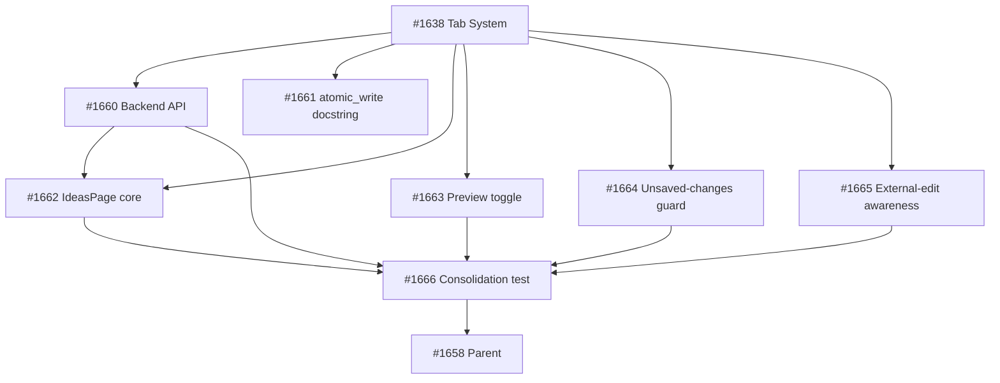

## Brief

Add an \"Ideas\" tab to the Cockpit — a freeform markdown scratchpad backed by `.owlbear/ideas.md`. Provides capture and re-reading of pre-task ideas without leaving the dashboard. Value is cockpit co-location alongside VS Code.

## Scope

**Backend:** GET/PUT `/api/ideas` endpoints, `atomic_write` import from kanban, create-on-first-write, `get_ideas_path` DI dependency.

**Frontend:** `IdeasPage` with textarea + preview toggle, explicit save, dirty-state indicator, unsaved-changes guard (route nav + beforeunload), default-to-edit mode.

**External-edit awareness:** Re-fetch on `visibilitychange` + route activation. Clean → silent update. Dirty → conflict notice with Overwrite / Discard & Reload buttons.

**Housekeeping:** Update `atomic_write` docstring to generic framing.

## Dependencies

- #1638 (Tab System) must land first

## Out of Scope

- Auto-save, multiple files, agent integration, CockpitProvider isolation (owned by #1638), file-watcher/real-time sync

## Source

Brief: `.owlbear/briefs/draft-cockpit-ideas/brief.md`
Decisions: `.owlbear/briefs/draft-cockpit-ideas/decisions.md`

[[2026-05-18T17:42:39+02:00]]
## Planning
### Decomposition: Cockpit Ideas Notebook
- Tasks created: 7 (6 implementation + 1 consolidation test)
- Dependency layers: 3
- Phase: 1–3

### Task List
| ID | Title | Priority | Depends On | Tags |
|----|-------|----------|------------|------|
| 1660 | P1-01: Backend Ideas API — GET/PUT /api/ideas with DI and atomic_write | needed | #1638 | phase-1, scope:cockpit, backend |
| 1661 | P1-02: atomic_write docstring — generic framing | important | #1638 | phase-1, scope:kanban, housekeeping |
| 1662 | P2-01: IdeasPage core — edit mode, API client, save, dirty state | critical | #1638, #1660 | phase-2, scope:cockpit-web, frontend |
| 1663 | P2-02: IdeasPage — markdown preview toggle | important | #1638 | phase-2, scope:cockpit-web, frontend |
| 1664 | P2-03: IdeasPage — unsaved-changes guard | important | #1638 | phase-2, scope:cockpit-web, frontend |
| 1665 | P2-04: IdeasPage — external-edit awareness and conflict resolution | important | #1638 | phase-2, scope:cockpit-web, frontend |
| 1666 | consolidation test: Ideas Notebook end-to-end | needed | #1660, #1662, #1663, #1664, #1665 | phase-3, scope:cockpit-web, consolidation-test |

### Dependency Graph

[[2026-05-20T22:00:08+02:00]]
## Architecture Review

Decomposed parent task — all 7 subtasks (#1660–#1666) archived as completed. Both dependencies (#1638 Tab System, #1666 consolidation test) resolved. No AC or implementation of its own; tagged `quality` for non-impl pass-through.

### Verdict: APPROVE
### Action Taken: Advanced parent tracking task after confirming full subtask completion. Tagged `quality` for pipeline pass-through.

[[2026-05-20T22:00:50+02:00]]
## Test-Writer Notes
- Non-implementation task (tagged quality) — no tests applicable.
- Parent tracking task: all 7 subtasks (#1660–#1666) already archived as completed.
- AC: empty. No testable interfaces.
- Passing through to builder.

[[2026-05-20T22:01:35+02:00]]
## Builder Notes
- Task type: non-implementation parent pass-through (`quality` tagged) with no direct implementation scope.
- Files changed: none.
- Test execution: not applicable for this parent tracking task.
- Lint execution: not applicable for this parent tracking task.
- Evidence summary:
  - `ac` frontmatter is empty (`[]`).
  - Test-Writer Notes state: non-implementation task, no tests applicable, pass-through to builder.
  - Architecture Review states all decomposed subtasks (#1660-#1666) are archived completed and dependency chain is resolved.
- Fixes applied: none (pass-through routing only).

[[2026-05-20T22:03:53+02:00]]
## Review Evidence
- Verdict: PASS
- PASS confirmation: PASS #1658 -> docs | Parent coordination task has no direct AC or implementation scope, and the exact delegated child set plus consolidation gate are archived completed.
- Builder evidence review:
  - `show_task(1658)` returned `ac=[]` and `proof_bundle=null`, so there is no authoritative task-local AC set to map to code.
  - The [Planning section](.owlbear/kanban/tasks/1658-cockpit-ideas-notebook-freeform-markdown-tab-backed-by-owlbear-ideas-md.md#L51) enumerates the exact delegated child set as #1660–#1666.
  - The [Architecture Review](.owlbear/kanban/tasks/1658-cockpit-ideas-notebook-freeform-markdown-tab-backed-by-owlbear-ideas-md.md#L87) and [Builder Notes](.owlbear/kanban/tasks/1658-cockpit-ideas-notebook-freeform-markdown-tab-backed-by-owlbear-ideas-md.md#L102) both classify this as a non-implementation parent pass-through.
  - Verified via kanban metadata that #1638, #1660, #1661, #1662, #1663, #1664, #1665, and #1666 are all `archived` with `archival_reason=completed`.
- AC evidence map:
| AC Line | Code Evidence | Test Evidence | Status |
|---|---|---|---|
| None (`ac=[]`) | No builder-scoped files; [Builder Notes](.owlbear/kanban/tasks/1658-cockpit-ideas-notebook-freeform-markdown-tab-backed-by-owlbear-ideas-md.md#L102) record `Files changed: none` | Not applicable for this non-implementation coordination task | PASS |
- Test-to-AC alignment: no task-local AC or executable surface exists to prove; the review obligation is the completion state of the enumerated child set and named consolidation gate, which was verified directly.
- Proof sufficiency: sufficient for a `quality` parent pass-through because the exact delegated child set was verified explicitly rather than inferred from parent linkage alone.
- Safety & security: no new code, storage path, API, or dependency surface was introduced by this parent task.
- Blocking findings: none.

## Observations
- No non-blocking findings.

[[2026-05-20T22:05:38+02:00]]
## Docs Gate

**Verdict: PASS**

### Convention Mapping
Parent coordination task — `ac=[]`, `Files changed: none` (Builder Notes). All implementation resided in subtasks #1660–#1666, each with their own pipeline passes. No direct file changes to map.

### Checklist

| Item | Result | Evidence |
|------|--------|----------|
| 1. README Verification | N/A | No files changed by this parent task. Subtask docs gates already covered `serve/cockpit/README.md` L485-487 (IdeasPage, routes, API client) and L648-649 (GET/PUT /api/ideas endpoints table). |
| 2. External Attribution | N/A | No external sources used — task references only internal briefs (`.owlbear/briefs/draft-cockpit-ideas/`). |
| 3. Research Doc | N/A | No research artifact exists; task body links the brief directly. |
| 4. Deletion Detection | N/A | No files deleted by this parent task. |

### Additional Verification
- `.github/copilot-instructions.md` L54: `GET /api/ideas` and `PUT /api/ideas` present in the Cockpit Backend endpoints table — confirmed up to date.
- `README-consumer.md`: no ideas content needed (internal API, not consumer-facing).

### Scratch Cleanup
No scratch files for task #1658 exist.

[[2026-05-20T22:13:59+02:00]]
## Audit

### Regression Detection
- Frontend (vitest): 135 files, 2379 passed, 0 failed.
- Backend Ideas-specific (`test_cockpit_ideas_1660.py`): 20 passed.
- Full pytest suite: 251 failures — all pre-existing/unrelated. Key investigation: `test_cockpit_shell_sidecar.py::TestNavRailTabIndex` checks `data-surface="kanban"` in Shell.tsx nav-rail, but last modified in #1397 (predates Tab System #1638 refactor). No Ideas-related failures found.
- No files changed by this parent task — regression risk is zero.

### Intent Verification
- Parent coordination task decomposed into 7 subtasks (#1660–#1666).
- All 7 confirmed `archived` with `archival_reason=completed` via kanban metadata.
- Dependency #1638 (Tab System) also archived. Feature scope fully delivered through subtask chain.
- No extraneous scope.

### Architect Quality
- Score: 4/5
- Decomposition was well-structured: 3 dependency layers, clear phase sequencing, proper consolidation gate (#1666).
- Brief provides clear scope/out-of-scope/dependencies.
- Empty AC (`[]`) appropriate for parent pass-through — though explicitly stating "all subtasks archived" as a pass-through condition would have been cleaner.

### Commit Integrity
- No builder commit required (pass-through, no files changed).
- Each subtask had individual builder commits verified during their own audits.
- Pipeline notes (Architecture Review, Test-Writer, Builder, Reviewer, Docs) all present and consistent.

### Deduction Breakdown
| Criterion | Deduction |
|-----------|-----------|
| (none applicable) | 0 |

### Confidence: 1.00
### Action: ARCHIVE
