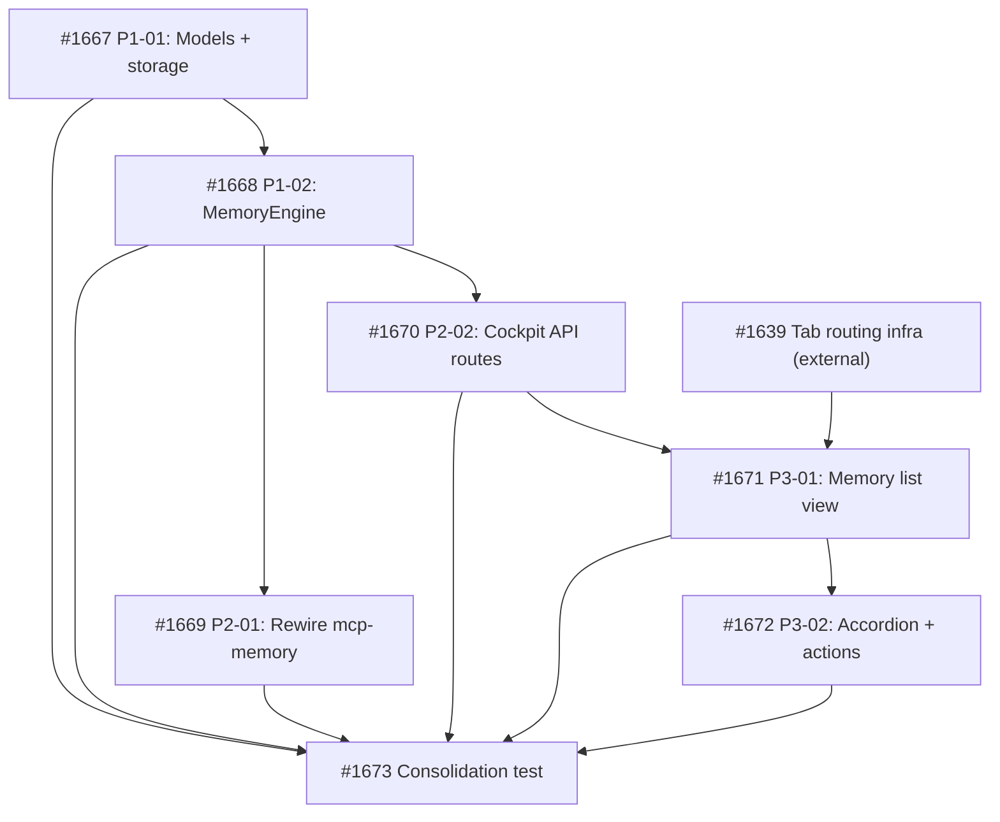

## Objective

Add a Memory tab to the cockpit providing full visibility and control over agent institutional memory. Includes engine extraction to a shared package, cockpit backend API, and React frontend component.

## Brief

See `.owlbear/briefs/draft-cockpit-memory-tab/brief.md` for the complete specification.

## Architecture Summary

1. Extract `serve/memory/` as shared engine package (MemoryEngine with mutation methods, models, state machine enforcement)
2. Rewire `serve/mcp-memory/` to depend on the new package (tools.py becomes thin adapter)
3. Add cockpit backend routes (`/api/memories`, approve/edit/delete mutations with OCC)
4. Add React frontend component (list + inline accordion detail + actions) — blocks on #1638

## Key Decisions

- D7: Extract engine first (prerequisite)
- D8: Split scope — backend now, frontend after #1638
- D9: No SSE in V1
- D10: Deleted entries excluded from default filter
- D11: No auto-commit
- D12: Lenient read, strict write

## Scope Split

- **Backend (independent):** Engine extraction + API routes
- **Frontend (blocks on #1638):** React component, filtering, accordion detail, actions

[[2026-05-18T17:44:43+02:00]]
## Planning
### Decomposition: Cockpit Memory Tab
- Tasks created: 7 (6 implementation + 1 consolidation)
- Dependency layers: 4
- Phases: P1 (engine extraction, 2 tasks) + P2 (rewire + API, 2 tasks) + P3 (frontend, 2 tasks) + consolidation

### Task List
| ID | Title | Priority | Depends On | Tags |
|----|-------|----------|------------|------|
| #1667 | P1-01: Memory engine package — models, errors, and storage primitives | critical | — | phase-1, scope:memory, backend |
| #1668 | P1-02: Memory engine — MemoryEngine with state machine, OCC, and caching | critical | #1667 | phase-1, scope:memory, backend |
| #1669 | P2-01: Rewire mcp-memory to import from owlbear-memory engine package | needed | #1668 | phase-2, scope:mcp-memory, backend |
| #1670 | P2-02: Cockpit backend API — memory routes with OCC | needed | #1668 | phase-2, scope:cockpit, backend |
| #1671 | P3-01: Memory list view with state/category/agent filters and text search | needed | #1670, #1639 | phase-3, scope:cockpit-web, frontend |
| #1672 | P3-02: Memory accordion detail and state-dependent actions | important | #1671 | phase-3, scope:cockpit-web, frontend |
| #1673 | Consolidation test: Cockpit Memory Tab | needed | #1667–#1672 | consolidation-test, scope:memory, scope:cockpit |

### Dependency Graph

### Key Sequencing Decisions
- P1 (engine extraction) ships first — prerequisite for all downstream work
- P2-01 (mcp-memory rewire) and P2-02 (cockpit API) are independent siblings, both depend only on P1-02
- P3 frontend tasks depend on both the cockpit API (#1670) and the external tab infrastructure (#1639 from #1638)
- Parent #1659 depends on consolidation #1673 as completion gate

[[2026-05-20T11:18:45+02:00]]
## Architecture Review
### Evaluation
| Criterion | Assessment | Notes |
|-----------|-----------|-------|
| Single responsibility | PASS | Parent/umbrella task — tracks feature delivery via subtasks |
| Interface clarity | PASS | AC names specific endpoints, methods, state transitions |
| Dependency correctness | PASS | Sole dep #1673 (consolidation) is archived/completed; all 6 impl subtasks also archived |
| Module layering | PASS | No new layers introduced (handled by subtasks) |
| TDD compliance | PASS | Full proof exists via consolidation test + sibling suites |
| KISS/YAGNI | PASS | Feature tracking task, no over-engineering |
| Premise challenge | PASS | Feature fully implemented and verified |
| Pattern consistency | PASS | Follows cockpit + memory package patterns established in subtasks |
| Security surface | N/A | No new boundaries (handled by subtask-level reviews) |
| Single domain | PASS | Parent spanning memory+cockpit domains is accepted for umbrella tasks |

### Challenge Results
- Challenger: reconsider (confidence 0.72)
- Key findings: (1) Proof scope too narrow if only pointing to consolidation file; (2) AC lines contain B3 banned quantifiers ("all existing", "all entries"); (3) Metadata not yet set
- Architect response: (1) ACCEPTED — expanded proof scope to full sibling suite set; (2) OVERRIDDEN — parent AC is summary-level; all subtask AC was individually refined during per-task architecture review; no new tests will be written; (3) RESOLVED — proof_bundle set to existing

### Proof-Bundle Validation
- Planner assignment: (none)
- Final bundle: existing
- Existing proof scope: serve/cockpit/tests/test_memory_integration.py, tests/test_cockpit_memory_routes_1670.py, tests/test_memory_primitives_1667.py, tests/test_memory_engine_1668.py, tests/test_mutation_tools.py, serve/cockpit/web/src/__tests__/MemoryTab_1671.test.tsx, serve/cockpit/web/src/__tests__/MemoryTab_1672.test.tsx
- Test-writer: SKIP

### Verdict: APPROVE
### Action Taken: Set proof_bundle=existing with full sibling proof scope; advanced to todo as completion-gate pass-through

[[2026-05-20T11:31:02+02:00]]
## Test-Writer Notes
- Proof bundle: existing — no new test writing required.
- Proof scope: serve/cockpit/tests/test_memory_integration.py, tests/test_cockpit_memory_routes_1670.py, tests/test_memory_primitives_1667.py, tests/test_memory_engine_1668.py, tests/test_mutation_tools.py, serve/cockpit/web/src/__tests__/MemoryTab_1671.test.tsx, serve/cockpit/web/src/__tests__/MemoryTab_1672.test.tsx
- Architect verdict: APPROVE with explicit "Test-writer: SKIP" directive.
- Passing through to builder.

[[2026-05-20T11:37:47+02:00]]
## Builder Notes
- Implementation: no code changes (proof-bundle `existing` pass-through completion gate)
- Tests: required existing proof set passed via quality-runner (`327 passed, 0 failed, 0 skipped`)
- Coverage: proof report modules — `engine.py` 98%, `storage.py` 95%, `models.py` 94%, `tools.py` 76%, `routes/memory.py` 100%
- Lint: clean (`ruff`/`eslint` clean, no violations)
- Evidence summary: executed required scope from Architecture/Test-Writer notes
  - `serve/cockpit/tests/test_memory_integration.py`
  - `tests/test_cockpit_memory_routes_1670.py`
  - `tests/test_memory_primitives_1667.py`
  - `tests/test_memory_engine_1668.py`
  - `tests/test_mutation_tools.py`
  - `serve/cockpit/web/src/__tests__/MemoryTab_1671.test.tsx`
  - `serve/cockpit/web/src/__tests__/MemoryTab_1672.test.tsx`
- Fixes applied: none (verification-only pass-through)

[[2026-05-20T12:06:08+02:00]]
## Review Evidence
- Verdict: FAIL
- Builder evidence reviewed first: proof bundle `existing`; builder reported `327 passed, 0 failed, 0 skipped`, lint clean, and named proof scope executed with no parent-level code changes.
- Parent completion-gate check: explicit child set `#1667, #1668, #1669, #1670, #1671, #1672, #1673` is archived/completed, so the remaining question is proof sufficiency against the umbrella AC.
- AC1-AC6: mapped to code and existing tests with sufficient evidence.

| # | AC Line | Finding | Evidence | Route |
|---|---------|---------|----------|-------|
| 1 | AC7 | Missing frontend proof for the approved-entry soft-delete branch. The UI implements delete for every non-deleted entry and uses a pending-vs-non-pending confirmation branch, but the named MemoryTab suite only exercises pending and curated delete dialogs. A regression that removed approved delete affordance or showed the wrong approved soft-delete copy would still pass. | Source: `serve/cockpit/web/src/pages/MemoryTab.tsx:785,792,943-945`. Existing proof only covers pending/curated: `serve/cockpit/web/src/__tests__/MemoryTab_1672.test.tsx:474,492,1233,1243`. Approved-state assertions in the same suite stop at approve-button absence and warning copy: `serve/cockpit/web/src/__tests__/MemoryTab_1672.test.tsx:389,424`. | todo |
| 2 | AC8 | Missing frontend save-path proof for approved-entry edit downgrade. Backend and engine tests prove approved -> curated on edit, and the UI proves the warning copy, but there is no MemoryTab test that starts from an approved entry, saves an edit, and asserts the visible state becomes `curated`. A frontend regression in the approved edit flow could still pass the current suite. | Backend proof exists at `tests/test_cockpit_memory_routes_1670.py:337`, `serve/cockpit/tests/test_memory_integration.py:146`, `tests/test_memory_engine_1668.py:185`. Frontend only proves the warning at `serve/cockpit/web/src/__tests__/MemoryTab_1672.test.tsx:424`, generic edit replacement at `serve/cockpit/web/src/__tests__/MemoryTab_1672.test.tsx:931`, and pending-promotion state change at `serve/cockpit/web/src/__tests__/MemoryTab_1672.test.tsx:1069`. UI save path is generic in `serve/cockpit/web/src/pages/MemoryTab.tsx:580-594`, but task-local approved-state proof is absent. | todo |

### Required Follow-up
| # | Target Agent | Action Required | File(s) | Evidence |
|---|-------------|----------------|---------|----------|
| 1 | test-writer | Add a frontend test that opens an approved memory entry, asserts delete is available, opens the confirmation dialog, and proves the approved branch uses the soft-delete copy/modal contract. | serve/cockpit/web/src/__tests__/MemoryTab_1672.test.tsx | Review finding #1; source branch at `serve/cockpit/web/src/pages/MemoryTab.tsx:785,943-945` |
| 2 | test-writer | Add a frontend test that starts from an approved memory entry, saves an edit, and asserts the visible state downgrades to `curated` after the successful response. | serve/cockpit/web/src/__tests__/MemoryTab_1672.test.tsx | Review finding #2; backend downgrade proof exists but no UI save-path assertion |

## Observations
- This is a proof-gap failure, not an implementation-mismatch failure. The current source is consistent with the intended behavior; what is missing is task-local frontend regression coverage for the approved-state branches.
- I did not dispatch `quality-runner` because the builder evidence was internally consistent and the blocking issue is coverage strength, not contradictory execution evidence.
- The parent task remains a completion-gate review over existing sibling suites rather than a changed-files diff review, because the builder step was verification-only.

[[2026-05-20T12:10:34+02:00]]
## Test-Writer Notes
- Retry: added 8 tests across 2 new describe blocks for reviewer gaps (AC7 + AC8).
- File: serve/cockpit/web/src/__tests__/MemoryTab_1672.test.tsx
- New describe blocks:
  - `TestFromAC_MemoryApprovedDelete` (4 tests) — AC7: approved entry delete button visible, dialog opens, soft-delete copy shown (not permanent), confirm button present
  - `TestFromAC_MemoryApprovedEditDowngrade` (4 tests) — AC8: approved entry has Edit button, saving returns curated state, badge shows curated, Approve button appears post-downgrade
- Test result: 74 passed, 0 failed — all new tests PASS against current implementation
- Lint: ESLint clean
- Builder skip: test-only retry, implementation already correct per reviewer finding ("proof-gap failure, not implementation-mismatch")
- AC coverage: AC7 (delete confirmation dialog for approved = soft-delete copy) and AC8 (edit downgrade path approved→curated) now have direct frontend regression guards

[[2026-05-20T12:14:33+02:00]]
## Review Evidence
- Verdict: PASS
- PASS confirmation (one line): PASS #1659 -> docs | AC mapped to code and evidence sufficient.
- Builder evidence reviewed first: this parent used proof_bundle `existing`, so the operative evidence is the existing sibling proof set from the builder note plus the targeted test-writer retry for the prior AC7/AC8 proof gaps. The retry reports `74 passed, 0 failed` and ESLint clean for `serve/cockpit/web/src/__tests__/MemoryTab_1672.test.tsx`.
- Parent completion-gate verification: exact delegated child set `#1667, #1668, #1669, #1670, #1671, #1672` and consolidation gate `#1673` are all archived/completed on the board.
- AC1-AC6: unchanged from the prior cycle and still satisfied by the existing proof set already accepted during the first review pass; this retry introduced no source changes and no new contrary evidence.
- AC7: the source keeps delete available for non-deleted entries and uses the non-pending soft-delete dialog branch for approved entries (`serve/cockpit/web/src/pages/MemoryTab.tsx:791-797`, `serve/cockpit/web/src/pages/MemoryTab.tsx:943-945`). The retry adds direct approved-state frontend proof in `serve/cockpit/web/src/__tests__/MemoryTab_1672.test.tsx:1410-1453`, including dialog open, soft-delete copy, absence of hard-delete copy, and confirm-button presence.
- AC8: approved entries still show the re-approval warning and the save path still replaces local state with the API response (`serve/cockpit/web/src/pages/MemoryTab.tsx:580-594`, `serve/cockpit/web/src/pages/MemoryTab.tsx:770-780`). Existing warning proof remains in `serve/cockpit/web/src/__tests__/MemoryTab_1672.test.tsx:424-428`, and the retry adds direct approved-edit downgrade proof in `serve/cockpit/web/src/__tests__/MemoryTab_1672.test.tsx:1468-1536`, asserting the post-save state badge becomes `curated`, is no longer `approved`, and exposes the `Approve` action again.
- Proof sufficiency: the new assertions are regression-sensitive for the previously missing approved-state branches; removing the approved delete affordance, swapping in the hard-delete copy, or failing to render the curated post-save state would now fail the suite.
- Safety/security: no new code changes in this cycle; reviewed UI branches remain within existing mutation surfaces and I found no new safety findings.

## Observations
- No blocking findings remain from the prior review cycle.
- I did not dispatch `quality-runner` because the retry evidence was internally consistent, the task was test-only on the second cycle, and the review question was assertion strength rather than contradictory execution evidence.
- Editor diagnostics are clean for both `serve/cockpit/web/src/pages/MemoryTab.tsx` and `serve/cockpit/web/src/__tests__/MemoryTab_1672.test.tsx`.

[[2026-05-20T12:17:46+02:00]]
## Docs Gate

**Verdict: PASS → done**

### Convention Mapping
- `serve/memory/src/**` → `serve/memory/README.md` ✓ accurate (no drift)
- `serve/mcp-memory/src/**` → `serve/mcp-memory/README.md` ✓ accurate (no drift)
- `serve/cockpit/src/**` + `serve/cockpit/web/src/**` → `serve/cockpit/README.md` — **1 task-caused issue found and fixed**
- `README.md` — **1 task-caused issue found and fixed**

### Item 1: README Verification

**serve/cockpit/README.md** — `MemoryTab_1672.test.tsx` test count was **66** (stale); the test-writer retry in this task cycle added 8 tests (AC7 + AC8 approved-state coverage), making the actual count **74**. Fixed count and extended coverage description.

**README.md** — `serve/memory/` description said \"used by mcp-memory\" but cockpit backend routes also import `owlbear_memory` (added by #1670 as part of this feature). Updated to \"used by mcp-memory and cockpit\".

`serve/memory/README.md` and `serve/mcp-memory/README.md` — both accurate, no drift.

### Item 2: External Attribution
N/A — no external sources cited in implementation; all internals.

### Item 3: Research Doc
N/A — brief at `.owlbear/briefs/draft-cockpit-memory-tab/brief.md` is a planning artifact, not a research doc. No `.owlbear/research/` file was created for this task.

### Item 4: Deletion Detection
N/A — no source files deleted. Parent task was a pass-through completion gate; test-writer retry only added tests to an existing file.

### Layer 1 Verification
- \"66 tests\" absent from cockpit README ✓
- \"74 tests\" present ✓
- \"used by mcp-memory and cockpit\" in README.md ✓

### Layer 2 Verification
Memory API table, #1671 and #1672 feature entries, serve/memory README, serve/mcp-memory README — all accurate against implementation.

### Commit
`c7b5cdce` — docs: update MemoryTab_1672 test count (66→74) and serve/memory consumer list (#1659, doc-writer)

### Scratch Cleanup
No `.owlbear/scratch/1659-*` files existed.

[[2026-05-20T12:25:14+02:00]]
## Audit

### Regression Detection
Quality-runner full report: npm test (vitest) exit 0; pytest 7451 passed, 20 failed, 25 skipped. All 20 failures are in unrelated domains (test_cockpit_view.py FileNotFoundError, test_server.py NoneType, test_visual_redesign.py inline style budget, test_engine_accessor_migration.py accessor patterns). None involve memory, cockpit-memory, or MemoryTab modules. Frontend vitest (task's primary domain) is fully green. Background quality debt, not task-caused regressions.

### Intent Verification
Changed files: `serve/cockpit/web/src/__tests__/MemoryTab_1672.test.tsx` (test-writer retry), `serve/cockpit/README.md` and `README.md` (doc-writer). All within memory/cockpit domain, matching stated purpose of completion-gate umbrella task. No extraneous scope.

### Architect Quality
AC specificity: 4/5. AC lines name specific endpoints, methods, state transitions, and UI behaviors. AC7/AC8 were specific enough that reviewer identified proof gaps on first cycle — indicates good testable specificity. Minor gap: AC uses \"all entries\" phrasing (B3 quantifiers noted by challenger) but was overridden as acceptable for parent summary AC.

### Commit Integrity
- `92a37898` — test: add retry tests for approved-state delete and edit-downgrade (#1659, test-writer)
- `c7b5cdce` — docs: update MemoryTab_1672 test count (66→74) and serve/memory consumer list (#1659, doc-writer)
Both present, correctly attributed, format-compliant.

### Deduction Breakdown
| Criterion | Deduction |
|-----------|----------|
| Intent mismatch | 0 |
| Evidence integrity | 0 |
| Lint violations (task-caused) | 0 |
| AC quality (4/5 > 3) | 0 |
| Missing reviewer evidence | 0 |
| Regression failures (task-caused) | 0 |

**Confidence: 1.00 — Archive**
