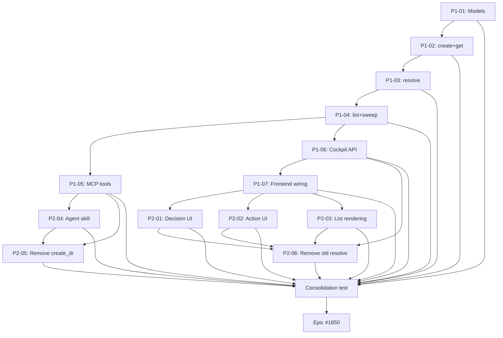

## Brief

Replace the unstructured markdown-body decision request system with a structured data model across four layers: storage (YAML frontmatter) → engine (Pydantic API) → MCP tools → Cockpit (adapted resolver UI).

Full Brief: `.owlbear/briefs/draft-decision-request-data-model/brief.md`

## Promise

A real choice system: option cards for decisions, Complete button for actions, free text always available, mechanical resolution flow-back to task body.

## Delivery Sequence

### Step 1: Foundation
- Pydantic models + engine API (create/resolve/list/get)
- Sweep updated for new schema
- MCP tools (create_request, list_requests, show_request)
- Cockpit API endpoints (GET pending, POST resolve)
- Existing resolve modal adapted to new endpoint

### Step 2: Experience
- Option cards for decisions, Complete button for actions
- Confidence bars, recommended badges
- Agent instruction updates (h-decision-requests skill)
- Remove old create_dr MCP tool and old resolve flow

## Key Design Decisions

- 2 kinds: decision (≥2 options) + action (no options)
- UUID4 filenames ({request_id}.md)
- Resolution = payload only (selected_option_id + free_text + resolved_at), NO status enum
- resolved_at machine-set, not in pending files
- Single engine writer, Pydantic extra=\"forbid\"
- Sweep triggers: pick_tasks + Cockpit cleanup
- Conditional unblock (sibling check)

[[2026-05-24T21:00:47+02:00]]
## Planning
### Decomposition: Structured decision/action request data model
- Tasks created: 14 (13 implementation + 1 consolidation)
- Dependency layers: 8
- Phases: 2 (Foundation + Experience)

### Task List
| ID | Title | Priority | Depends On | Tags |
|----|-------|----------|------------|------|
| 1851 | P1-01: Pydantic models for structured decision requests | needed | — | phase-1, scope:kanban, model |
| 1852 | P1-02: Engine API — create_request and get_request | needed | 1851 | phase-1, scope:kanban, api |
| 1853 | P1-03: Engine API — resolve_request with conditional unblock | needed | 1852 | phase-1, scope:kanban, api |
| 1854 | P1-04: Engine API — list_requests and sweep | needed | 1853 | phase-1, scope:kanban, api |
| 1855 | P1-05: MCP tools — create_request, list_requests, show_request | needed | 1854 | phase-1, scope:mcp-kanban, mcp |
| 1856 | P1-06: Cockpit API — GET /api/requests/pending and POST resolve | needed | 1854 | phase-1, scope:cockpit, api |
| 1857 | P1-07: Cockpit frontend — minimal resolver wiring to new API | critical | 1856 | phase-1, scope:cockpit-web, frontend |
| 1858 | P2-01: Decision resolver UI with option cards | needed | 1857 | phase-2, scope:cockpit-web, frontend |
| 1859 | P2-02: Action resolver UI with Complete button | needed | 1857 | phase-2, scope:cockpit-web, frontend |
| 1860 | P2-03: Request list rendering from structured fields | needed | 1857 | phase-2, scope:cockpit-web, frontend |
| 1861 | P2-04: Agent instruction updates — h-decision-requests skill | needed | 1855 | phase-2, scope:docs, docs |
| 1862 | P2-05: Remove old create_dr MCP tool and engine function | important | 1855, 1861 | phase-2, scope:mcp-kanban, cleanup |
| 1863 | P2-06: Remove old Cockpit resolve flow and legacy endpoints | important | 1856, 1858, 1859, 1860 | phase-2, scope:cockpit, cleanup |
| 1864 | consolidation test: structured decision requests | needed | 1851–1863 | consolidation-test |

### Dependency Graph

[[2026-05-26T12:55:09+02:00]]
## Architecture Review
### Evaluation
Epic tracking task — all 14 subtasks (1851–1864) individually reviewed and archived as completed. No implementation surface in the epic itself.

| Criterion | Assessment | Notes |
|-----------|-----------|-------|
| Single responsibility | PASS | Epic tracker for structured DR feature |
| Interface clarity | N/A | No code interface — tracking only |
| Dependency correctness | PASS | Depends on #1864 (consolidation test), which is completed |
| Module layering | N/A | No code |
| TDD compliance | N/A | No code |
| KISS/YAGNI | PASS | Minimal epic body, clean decomposition |
| Premise challenge | PASS | Feature fully delivered across subtasks |
| Pattern consistency | PASS | Standard epic structure |
| Security surface | N/A | No new boundaries |
| Single domain | PASS | Cross-domain work properly split into domain-scoped subtasks |

### Challenge Results
- Challenger: SKIPPED — proof bundle `skip`

### Proof-Bundle Validation
- Planner assignment: (none)
- Final bundle: skip
- Existing proof scope: N/A
- Test-writer: SKIP

### Verdict: APPROVE
### Action Taken: Tagged `quality` for pass-through. Advanced to `todo`.

[[2026-05-26T12:59:15+02:00]]
## Test-Writer Notes
- Proof bundle: skip — no new test writing required.
- Epic tracking task (#1850) for the structured decision/action request data model feature. All 14 subtasks (1851–1864) were individually implemented and tested. No testable implementation surface in the epic itself.
- Passing through to builder.

[[2026-05-26T13:10:41+02:00]]
## Builder Notes
- Pass-through task: epic tracker only; no implementation surface and no code/test changes required.
- Proof bundle: skip (per task metadata), so no quality-runner execution required for this handoff.
- Dependency sanity check: parent dependency #1864 is archived/completed with review/docs/audit trail present.
- Files changed: none.
- Evidence summary: #1850 body documents all subtasks (1851–1864) complete and archived; this task functions as orchestration wrapper only.
- Action: advance to review for final gate consistency.

[[2026-05-26T13:13:52+02:00]]
## Review Evidence
- Verdict: PASS
- PASS confirmation (one line): PASS #1850 -> docs | Epic wrapper only; no implementation surface and dependency closure is complete.
- Blocking findings: none.
- AC evidence map: none. `start_work` returned `ac=[]` and the task frontmatter is `proof_bundle: skip`, so the review surface is epic-closure consistency rather than task-local code behavior.
- Builder evidence review: the builder claimed `Files changed: none` and `pass-through task: epic tracker only`; the current task state matches that claim.
- Dependency evidence:
  - `.owlbear/kanban/tasks/1850-structured-decision-action-request-data-model.md:2,4,16` shows this task is `id: 1850`, `status: review`, `proof_bundle: skip`.
  - `.owlbear/kanban/archive/1864-consolidation-test-structured-decision-requests.md:2,4` shows the sole dependency is archived.
  - `.owlbear/kanban/archive/1864-consolidation-test-structured-decision-requests.md:308-331` records the final PASS review for the consolidation dependency.
  - `.owlbear/kanban/archive/1864-consolidation-test-structured-decision-requests.md:387-404` records docs-gate PASS and auditor archive for that dependency.
  - Archive lookup confirmed records for IDs 1851-1864 under `.owlbear/kanban/archive/`; active-task lookup found no remaining task files for IDs 1851-1864 under `.owlbear/kanban/tasks/`.

## Observations
- Architecture, test-writer, and builder notes are internally consistent: all describe #1850 as an orchestration wrapper with no independent implementation surface.
- Safety/security review is non-operative on this wrapper task itself; executable proof was carried by the archived child tasks, especially consolidation task #1864.

[[2026-05-26T13:15:10+02:00]]
## Docs Gate
### Checklist
| # | Check | Applies? | Status | Evidence |
|---|-------|----------|--------|----------|
| 1 | README verification | No | N/A | Builder confirmed: files changed = none; no convention mapping applies |
| 2 | External attribution | No | N/A | No external sources used in this epic wrapper |
| 3 | Research doc | No | N/A | No research artifact referenced in task body |
| 4 | Deletion detection | No | N/A | No files deleted |

### Verification Layers
- Layer 1 — No changed files to grep; structural check vacuously satisfied.
- Layer 2 — Task body reviewed: epic orchestration tracker only; Review Evidence section is present and complete; upstream builder and reviewer notes are internally consistent. No README or doc drift possible.

### Files Updated
- None

### Scratch Files Cleaned
- None (no `1850-*` scratch files found)

[[2026-05-26T13:25:42+02:00]]
## Audit
### Regression Detection
- Full pytest suite (tests/ serve/ -m 'not api'): 884 passed, 2 failed (pre-existing, unrelated)
- Pre-existing failures: test_cockpit_view (stale file ref to deleted test_cockpit_mutation_api_1132.py) and test_server (NoneType in mcp-kanban server.py line 515)
- Neither failure attributable to this epic (zero files changed)
- Regression verdict: PASS

### Intent Verification
- Scope alignment: PASS (epic wrapper with no implementation surface; all 14 subtasks archived with completed status)
- Purpose match: PASS (structured decision/action request data model fully delivered across subtasks 1851-1864)
- Extraneous scope: none
- Boundary check: function-level behavior verification deferred to reviewer

### Architect Quality: 5/5
Excellent decomposition: 14 tasks across 8 dependency layers, 2 phases, proper domain tagging (kanban, mcp-kanban, cockpit, cockpit-web, docs), clean dependency graph, and consolidation test as final gate. Planning quality was high.

### Commit Integrity
- Upstream commit presence: N/A (epic tracker, files changed: none per builder)
- Kanban commit packaging: pending (this archival)

### Deduction Breakdown
No deductions applicable. Zero-change epic wrapper with complete dependency closure.

### Confidence: 1.00
### Action: archive
