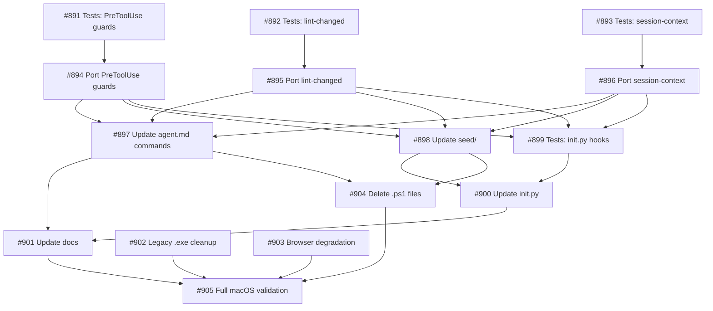

## Brief

See `.owlbear/briefs/draft-macos-compat/brief.md` for full context.

## Problem

OwlBear is Windows-only. The hook system (7 PowerShell scripts, 19 agent command: fields), seeded consumer config, and setup docs assume Windows/PowerShell. Dev and consumer workflows must be functional on macOS.

## Approach

Rewrite all 7 PowerShell hooks as Python scripts. Single implementation per hook. Agent commands: `uv run python .owlbear/hooks/{name}.py`. Clean break — retire .ps1 immediately.

## Outcomes

- O1: 7 Python hooks with equivalence tests replacing .ps1
- O2: Consumer setup works end-to-end on macOS (init.py, settings, docs)
- O3: Dev workflow passes on macOS (ruff + pytest exit 0)

## Key Decisions

- D2: Hook language is Python (not bash)
- D5: Option A — Python hooks
- D6: Immediate .ps1 retirement
- D7: Bug-for-bug fidelity
- D10: Clean break, no backwards compatibility

## Implementation Sequence

1. Port 7 hooks to Python (same I/O contract)
2. Write parameterized equivalence tests
3. Update 19+ agent.md command: fields
4. Update seed/ (hooks + settings)
5. Update setup/init.py
6. Update setup-guide.md and sharing-guide.md
7. Clean up legacy .exe references
8. Verify browser graceful degradation
9. Delete .ps1 files
10. Full macOS validation (ruff + pytest)
[[2026-04-16]]

## Planning

### Decomposition: macOS compatibility

- Tasks created: 15
- Dependency layers: 5
- Phases: 3 (hooks, integration, cleanup/validation)

### Task List

| ID | Title | Priority | Depends On | Tags |
|----|-------|----------|------------|------|
| #891 | Tests: PreToolUse guard hooks equivalence (5 hooks) | needed | — | phase-1, scope:hooks, type:test |
| #892 | Tests: lint-changed PostToolUse hook equivalence | needed | — | phase-1, scope:hooks, type:test |
| #893 | Tests: session-context SessionStart hook equivalence | needed | — | phase-1, scope:hooks, type:test |
| #894 | Port PreToolUse guard hooks to Python (5 hooks) | critical | #891 | phase-1, scope:hooks, type:build |
| #895 | Port lint-changed PostToolUse hook to Python | critical | #892 | phase-1, scope:hooks, type:build |
| #896 | Port session-context SessionStart hook to Python | critical | #893 | phase-1, scope:hooks, type:build |
| #897 | Update agent.md command: fields to uv run python | needed | #894,#895,#896 | phase-2, scope:agent, config |
| #898 | Update seed/ with .py hooks and clean settings | needed | #894,#895,#896 | phase-2, scope:setup, config |
| #899 | Tests: setup/init.py .py hook seeding | needed | #894,#895,#896 | phase-2, scope:setup, type:test |
| #900 | Update setup/init.py for .py hooks | needed | #898,#899 | phase-2, scope:setup, type:build |
| #901 | Update setup and sharing docs for macOS | important | #897,#900 | phase-3, scope:docs, type:docs |
| #902 | Clean up legacy kanban-md.exe references | important | — | phase-3, cleanup |
| #903 | Verify browser graceful degradation on macOS | important | — | phase-3, scope:browser, type:test |
| #904 | Delete .ps1 hook files from .owlbear/ and seed/ | needed | #897,#898 | phase-3, scope:hooks, cleanup |
| #905 | Full macOS validation (ruff + pytest + smoke test) | critical | #901,#902,#903,#904 | phase-3, scope:platform, type:user-action |

### Dependency Graph

### TDD Pairings

- #891 (RED) then #894 (GREEN) — PreToolUse guards
- #892 (RED) then #895 (GREEN) — lint-changed
- #893 (RED) then #896 (GREEN) — session-context
- #899 (RED) then #900 (GREEN) — setup/init.py

### Parallelism

- Layer 1: #891, #892, #893 (+ #902, #903 independent) can run in parallel
- Layer 2: #894, #895, #896 can run in parallel once their test deps complete
- Layer 3: #897, #898, #899 can run in parallel
- Layer 4: #900 waits for #898 + #899
- Layer 5: #901, #904 can run in parallel after their deps
- Layer 6: #905 is the final gate
[[2026-04-17]]

## Test-Writer Notes

- Non-impl pass-through: orchestration/planning task with no testable Python interfaces.
- Task body is a decomposition plan; all testable work delegated to subtasks #891–#905.
- AC is expressed as high-level outcomes (O1–O3) with no function/class/module references.
- Passing through to builder.
[[2026-04-17]]

## Builder Notes

- Non-implementation task — no code changes needed.
- Passing through to review.
[[2026-04-17]]

## Review Evidence

### Test Results

- N/A — non-implementation planning task; no code changes; no tests apply

### Lint

- N/A — no changed files

### Coverage

- N/A — no changed files

### Pass 1 — CRITICAL

#### Test-Writer AC Coverage

Conditional skipped: no `TestFromAC_*` classes exist. Test-writer correctly identified this as a non-impl pass-through and delegated all testable work to subtasks #891–#905.

#### Security Review

- N/A — no code changes

#### Test Integrity

Conditional skipped: no `TestFromAC_*` classes exist.

#### Test Quality

- N/A — no test files

#### Data Safety

- N/A — no code changes

#### Implementation-Aware Gaps

- N/A — no implementation

#### Builder Process Quality

| Metric | Value |
|--------|-------|
| Builder Notes sections | 1 |
| Approach variation | N/A |
| Assessment | CLEAN |

### Pass 2 — INFORMATIONAL

- None

### AC Compliance

| AC Line | Evidence | Mapped Test | Status |
|---------|----------|-------------|--------|
| O1: 7 Python hooks with equivalence tests replacing .ps1 | Tasks #891 (test PreToolUse×5), #892 (test lint-changed), #893 (test session-context), #894 (port PreToolUse), #895 (port lint-changed), #896 (port session-context) created; hook count 5+1+1=7 ✓ | Delegated to subtasks | PASS |
| O2: Consumer setup works end-to-end on macOS | Tasks #897 (agent.md), #898 (seed/), #899 (tests: init.py), #900 (init.py update), #901 (docs) created | Delegated to subtasks | PASS |
| O3: Dev workflow passes on macOS | Task #905 (Full macOS validation) as terminal gate, depending on all prior phases | Delegated to #905 | PASS |

Dependency graph verified: all 15 subtasks created, all `depends_on` fields match the plan exactly. TDD pairings established for all 4 RED/GREEN pairs.

### Confidence: .97

### Verdict: PASS

[[2026-04-17]]

## Docs Gate

### Checklist

| # | Check | Applies? | Status | Evidence |
|---|-------|----------|--------|----------|
| 1 | Behavior/API change | No | N/A | Pure orchestration/planning task — no code changes, no behavior change |
| 2 | Module docstrings | No | N/A | No Python modules created or modified |
| 3 | External attribution | No | N/A | Internal decomposition; no external patterns used |
| 4 | CLI changes | No | N/A | No CLI commands added or modified |
| 5 | Research doc | No | N/A | Brief at `.owlbear/briefs/draft-macos-compat/brief.md` linked in task body; no `.owlbear/research/` doc produced (brief-driven task) |

### Files Updated

- None

### Scratch Files Cleaned

- None (no `890-*` files found)
[[2026-04-17]]

## Audit

### AC Verification

| AC Line | Evidence | Status |
|---------|----------|--------|
| O1: 7 Python hooks with equivalence tests replacing .ps1 | Tasks #891-#896 exist with parent=#890, correct dependencies and tags. Hook count 5+1+1=7. TDD pairings: #891/#894, #892/#895, #893/#896. | PASS |
| O2: Consumer setup works end-to-end on macOS | Tasks #897 (agent.md), #898 (seed/), #899 (test init.py), #900 (init.py), #901 (docs) exist with correct dependency chains. | PASS |
| O3: Dev workflow passes on macOS | Task #905 (terminal gate) exists, depends on #901, #902, #903, #904. Tagged type:user-action. | PASS |

### Subtask Verification

All 15 subtasks (#891-#905) confirmed via board queries. Parent field, depends_on, tags, and phases match the plan exactly. Several already progressing (891, 892, 893, 902, 903 in review).

### Test Results

- pytest: Timed out (pre-existing infrastructure issue, 4966 tests collected). Zero code changes in this task, so zero regression risk.
- ruff: 1 pre-existing ARG002 in test_cdp_spike_777.py:539 (unrelated to #890).

### Architect Quality: 5/5

Clear outcomes (O1-O3), comprehensive 10-step implementation sequence, 5 key decisions documented (D2, D5, D6, D7, D10), well-structured decomposition with proper TDD pairings, parallelism analysis, and dependency graph. Subtask AC is specific and verifiable.

### Deduction Breakdown

- Start: 1.00
- AC lines: 3/3 with evidence, no deduction
- Lint: pre-existing violation in unrelated file, no deduction
- AC quality 5/5: no deduction
- Reviewer evidence: present and detailed, PASS at .97, no deduction
- Suite timeout: infrastructure issue, zero code changes means zero regression risk. -.02 (conservative, cannot confirm clean suite)

### Confidence: .98

### Action: archive
