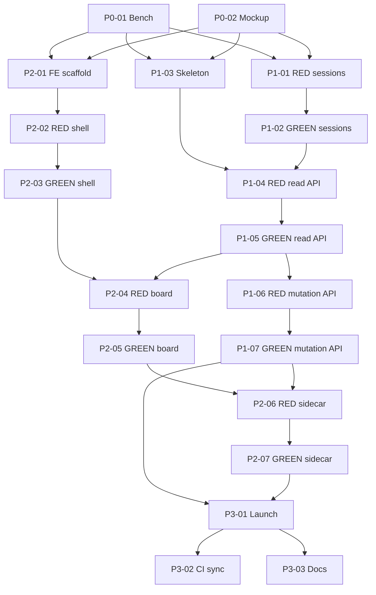

# Cockpit v1 — Brief

> Full Brief: `.owlbear/briefs/draft-cockpit/brief.md`
> Decisions: `.owlbear/briefs/draft-cockpit/decisions.md` (D1–D15)
> Research: `.owlbear/briefs/draft-cockpit/research-notes.md`
> Panel synthesis: `.owlbear/briefs/draft-cockpit/synthesis.md`
> Voices: `.owlbear/briefs/draft-cockpit/voices/{architect,data,enduser,security}.md`

## Summary

Build an extensible web GUI for OwlBear — the **steering cockpit** — whose v1 surface is the kanban board plus a Work Sessions activity panel. The cockpit is a *stop-and-redirect* operator console, not a read-only dashboard. It runs as a single FastAPI process serving a static React SPA, importing `owlbear_kanban` directly. The shell is structured for future surfaces (decision queue, knowledge search, memory curation, agent/skill/instruction editor, recurring-tasks panel, VS Code settings controller, drag-task-onto-chat dispatch) without architectural rework.

## Investment Tier — Shared

## Intervention Principle (D4)

> **Humans may RELEASE work (with confirmation). Only agents may CLAIM or advance work-state.**

Cockpit cannot reliably distinguish a stuck claim from an actively-running one (we only see status changes, not running processes), so the operator's confirmation is the gate, not a backend stuck-check.

## Outcomes

- **O1 Board at a glance.** At 1440×900 with ≥700 tasks, all status columns visible; "what's in review?" / "what's blocked?" answerable without clicking. Cold-load time is *not* a pass/fail; post-load smoothness is.
- **O2 Intervene without leaving the surface.** Six v1 mutations (move, reprioritise, block/unblock, unclaim, edit body, edit allowlisted YAML: `title`, `tags`, `priority`, `depends_on`, `parent`, `block_reason`). Quick mutations ≤2 clicks. GUI mutation visible to MCP `list_tasks` within 5 s. Destructive confirms.
- **O3 I know what's running, view is fresh.** Work Sessions vocabulary: *running, stuck, released, completed-pass, completed-fail, completed-rejected*. Status traffic light reflects engine health within one poll interval.
- **O4a Shell welcomes new surfaces.** Hello-world second surface = route + component + nav entry; contract documented; no shell-layout changes.
- **O4b Cockpit layout philosophy.** Top status bar · left icon rail · workspace center · sidecar with **Detail + Activity** tabs. Sidecar always-visible vs overlay/drawer decided by D13 outcome; panel contract is invariant.
- **O5 Coherent tokenized design.** Porsche DS primitives + tokens (or fallback DS). No hand-rolled hex outside tokens.
- **O6 Safe intervention.** Read-only fields have no UI. Destructive mutations confirm. `updated`-timestamp save-time conflict detection. Optimistic UI rollback on engine error.
- **O7 Trustworthy foundation.** Adapter test coverage at Shared bar. Engine surface documented. Engine failure → visible recoverable error state within one poll interval.

## Phases

### Phase 0 — Gating Validations (planner's FIRST tasks; block Phase 1)

| Task | Branch |
|------|--------|
| **Bench `list_tasks()` at 700 / 1500 tasks** | <150 ms ship; 150–500 ms YAML-head-only parse; >500 ms cache or watcher |
| **Static layout mockup** at 1440×900 + sidecar + 700 tasks | Cols ≥100 px planned layout; <100 px sidecar = overlay/drawer |

### Phase 1 — Backend (`serve/cockpit/`)

- New uv workspace member; deps `owlbear-kanban`, `fastapi`, `uvicorn`, `pydantic`
- FastAPI binds `127.0.0.1` only
- Routes: `GET /api/board`, `GET /api/tasks`, `GET /api/tasks/{id}` (with `updated` snapshot), `POST /api/tasks/{id}/move`, `POST /api/tasks/{id}/edit` (allowlisted YAML + body, requires snapshot), `POST /api/tasks/{id}/release`, `GET /api/sessions?filter=`
- `list_sessions()` engine helper — DERIVES sessions from existing `activity.jsonl` events; no new log schema
- Mtime-scan polling (per-instance revision counter does NOT see cross-process writes)
- Audit: cockpit writes `actor: "cockpit"` to existing activity log
- Engine adapter discipline: linter/boundary test prevents importing `claim_task`, `start_work`, `end_work`, `pick_dispatchable`

### Phase 2 — Frontend (`serve/cockpit/web/`)

- React 19 + Vite + TypeScript + Porsche DS React wrapper (Radix UI + Tailwind on PDS tokens as fallback if PDS card customisation proves heavy)
- App shell per O4b layout
- Kanban surface: drag-to-move with valid-target highlighting; context menu for long-distance moves; cards ~48–56 px; priority border + block badge + running indicator
- Detail tab: structured YAML controls + react-markdown + remark-gfm + rehypeSanitize body editor; save-time `updated` conflict check; History subtab
- Activity tab (Work Sessions): default filter = active; switch to all / failed-or-rejected / released; click row → Detail+History
- Polling @ 3 s, mtime-aware, skip 1 cycle after local mutation
- Optimistic UI + rollback; "oppose-the-flow = confirm" (backward moves, unclaim, unblock); unblock surfaces existing reason
- Strict CSP; no `dangerouslySetInnerHTML`; rehypeSanitize on body
- Designed empty / error / loading states

### Phase 3 — Packaging

- `uv run cockpit` starts FastAPI + auto-opens browser to `http://127.0.0.1:<port>/`
- CI sync builds SPA into `main` (consumers need no Node toolchain)
- Docs page: engine surface used + future-surface contract + hello-world walkthrough

## Out of Scope

Task creation, claim/start_work/end_work/dispatch/archive (agent-only), edit timestamps/ids/claim fields, save-time per-field conflict detection, SSE/WebSocket, multi-user/auth/remote binding, mobile/responsive. **Future surfaces** (decision queue, knowledge search, memory curation, agent/skill/instruction editor, recurring-tasks panel, VS Code settings controller, drag-task-onto-chat dispatch — North Star).

## Risks

| # | Item | Mitigation |
|---|------|-----------|
| R1 | `list_tasks()` perf at 700+ unknown | D11 benchmark gates Phase 1 |
| R2 | Sidecar layout at 1440×900 may compress columns | D13 mockup gates Phase 1; overlay/drawer fallback |
| R3 | Per-instance revision counter doesn't see cross-process writes | Mtime-scan polling |
| R4 | Concurrent same-task edits | D9 timestamp check + traffic light |
| R5 | Markdown XSS | rehypeSanitize + strict CSP (load-bearing security control) |
| R6 | PDS card override may be heavy | Radix + Tailwind on PDS tokens fallback |
| R7 | Sessions are derived view (no new schema/writer) | Accepted: legacy activity.jsonl preserved |
| R8 | Polling vs in-flight mutation | Skip 1 poll cycle + mtime check |

## Adoption Notes

- **Pipeline agents:** No behavioural change. Engine adds only `list_sessions` (derived view). MCP server unaffected.
- **User:** `uv run cockpit` starts cockpit on 127.0.0.1; browser opens.
- **Future-surface authors:** Follow hello-world walkthrough; register route + component + optional nav entry; use engine adapter; do not touch shell layout.

[[2026-04-17]]

## Planning

### Decomposition: Cockpit v1 — extensible web GUI starting with kanban + activity

- Tasks created: 19
- Dependency layers: 8
- Phases: 0 (gating), 1 (engine + backend), 2 (frontend), 3 (packaging)

### Task List

| ID | Title | Priority | Depends On | Tags |
|----|-------|----------|------------|------|
| 921 | P0-01: Bench list_tasks() at 700/1500 tasks (D11) | needed | — | cockpit,engine,phase-0,type:bench |
| 922 | P0-02: Static layout mockup 1440x900 (D13) | needed | — | cockpit,frontend,phase-0,type:user-action |
| 923 | P1-01: RED — list_sessions() engine helper tests | important | 921,922 | cockpit,engine,phase-1,type:test |
| 924 | P1-03: Cockpit package skeleton + boundary test | needed | 921,922 | cockpit,backend,phase-1,type:build |
| 925 | P2-01: Frontend scaffold (Vite+React 19+TS+PDS) | needed | 921,922 | cockpit,frontend,phase-2,type:build |
| 926 | P1-02: GREEN — list_sessions() implementation | important | 923 | cockpit,engine,phase-1,type:build |
| 927 | P2-02: RED — App shell tests | important | 925 | cockpit,frontend,phase-2,type:test |
| 928 | P1-04: RED — Cockpit read API tests | important | 924,926 | cockpit,backend,phase-1,type:test |
| 929 | P2-03: GREEN — App shell implementation | important | 927 | cockpit,frontend,phase-2,type:build |
| 930 | P1-05: GREEN — Cockpit read API + mtime-scan cache | important | 928 | cockpit,backend,phase-1,type:build |
| 931 | P2-04: RED — Kanban board surface tests | important | 929,930 | cockpit,frontend,phase-2,type:test |
| 932 | P1-06: RED — Cockpit mutation API tests | important | 930 | cockpit,backend,phase-1,type:test |
| 933 | P2-05: GREEN — Kanban board surface | important | 931 | cockpit,frontend,phase-2,type:build |
| 934 | P1-07: GREEN — Cockpit mutation API | important | 932 | cockpit,backend,phase-1,type:build |
| 935 | P2-06: RED — Sidecar (Detail+Activity) + polling tests | important | 933,934 | cockpit,frontend,phase-2,type:test |
| 936 | P2-07: GREEN — Sidecar (Detail+Activity) + polling + optimistic UI | important | 935 | cockpit,frontend,phase-2,type:build |
| 937 | P3-01: Launch command (uv run cockpit) + browser auto-open | important | 934,936 | cockpit,backend,phase-3,type:build |
| 938 | P3-02: CI sync — build SPA bundle into main branch | important | 937 | cockpit,docs,phase-3,type:build |
| 939 | P3-03: Docs — engine surface + contract + hello-world | important | 937 | cockpit,docs,phase-3,type:docs |

### Dependency Graph

### Decomposition Decisions

1. **list_sessions() separated as engine-domain work** (P1-01/P1-02) per user guidance — it lives in `owlbear_kanban`, not `owlbear_cockpit`.
2. **Detail + Activity tabs combined** into one TDD pair (P2-06/P2-07) because they share the sidecar container, tab-switching logic, and polling infrastructure. Splitting would exceed 20 tasks; the pair is still single-domain (frontend/sidecar).
3. **Phase 0 gating tasks are research, not TDD-paired** — they produce data/decisions, not production code.
4. **P1-03 skeleton includes the boundary test** as a guardrail, not a TDD pair — no "GREEN" counterpart because it validates an invariant (absence of forbidden imports).
5. **Phase 1 backend and Phase 2 frontend overlap**: P1-03, P2-01, and P1-01 all start in parallel once Phase 0 resolves. The chains converge at P2-04 (board needs read API) and P2-06 (sidecar needs mutation API).
6. **P3-02 and P3-03 are parallel** — both depend only on P3-01 (launch command).
[[2026-04-17]]

## Test-Writer Notes

- Non-impl pass-through: Brief/planning task (tagged `brief`) — no testable Python interfaces.
- The task body is the Cockpit v1 Brief. Its deliverables are planning documents + sub-task decomposition (19 tasks created: #921–#939).
- Implementation keywords in the body describe what sub-tasks will build, not AC for this task.
- Test-writing is covered by dedicated RED sub-tasks: #923 (list_sessions), #927 (app shell), #928 (read API), #932 (mutation API), #935 (sidecar/polling).
- Passing through to builder (no builder action expected for a brief task).
[[2026-04-17]]

## Builder Notes

**Type:** Brief/planning task — no testable Python interfaces, no implementation required.

**Action:** Pass-through per test-writer guidance ("no builder action expected for a brief task").

**Deliverables already present:** 19 sub-tasks created (#921–#939) covering Phase 0 (bench + mockup), Phase 1 (engine + backend), Phase 2 (frontend), and Phase 3 (packaging). Dependency graph documented in task body.

**Test results:** N/A — no production code to test.
**Lint status:** N/A.
**Coverage:** N/A.

**Next:** Phase 0 gating tasks #921 (bench list_tasks) and #922 (static layout mockup) are first to execute.
[[2026-04-17]]

## Review Evidence

### Test Results

- pytest: N/A — brief/planning task, no production code

### Lint: N/A

### Coverage: N/A

### Pass 1 — CRITICAL

#### Test-Writer AC Coverage

No `TestFromAC_*` classes — brief task, skip per skill conditional.

#### Security Review

No implementation code changed. N/A.

#### Test Integrity

No `TestFromAC_*` classes — skip per skill conditional.

#### Test Quality

N/A — no tests produced or expected for brief task type.

#### Data Safety

N/A.

#### Implementation-Aware Test Gap Analysis

N/A — no implementation code.

#### Necessity Check

N/A — no new dependencies.

#### Builder Process Quality

Single pass-through cycle, no retries. Appropriate for brief task type. CLEAN.

### AC Compliance

| Deliverable | Evidence | Status |
|-------------|----------|--------|
| Brief documents exist | `.owlbear/briefs/draft-cockpit/`: brief.md, decisions.md, synthesis.md, research-notes.md, voices/{architect,data,enduser,security}.md all present | PASS |
| 19 sub-tasks created (#921–#939) | All 19 tasks exist on kanban board with correct parent=920, dependencies per graph | PASS |
| Dependency graph documented | Mermaid graph in task body matches task depends_on fields | PASS |
| Decomposition decisions documented | 6 decisions in task body | PASS |
| Two extra tasks (#940, #941) | Valid proactive Phase-0 remediation tasks per bench threshold table in brief; `depends_on: [921]`; not counted in "19 tasks" note (informational only, not a defect) | INFO |

### Deductions

0 deductions.

### Verdict

Confidence: .97 → PASS → docs
[[2026-04-17]]

## Docs Gate

### Checklist

| # | Check | Applies? | Status | Evidence |
|---|-------|----------|--------|----------|
| 1 | Behavior/API change | No | N/A | Brief/planning task — no production code shipped, no system behavior changed. copilot-instructions.md update is deferred to task #939 (P3-03 Docs, already in decomposition). |
| 2 | Module docstrings | No | N/A | No Python modules created or modified. |
| 3 | External attribution | No | N/A | Brief research-notes contain internal codebase scan and general ecosystem comparison. Layout/drag-and-drop sources already attributed in `sources/overview.md` via task #922. No new entries required. |
| 4 | CLI changes | No | N/A | No CLI commands added or modified. |
| 5 | Research doc | Yes | Verified | `.owlbear/briefs/draft-cockpit/research-notes.md` exists and is linked in task body header. Briefs-folder placement is correct for brief tasks (not `.owlbear/research/`). |

### Files Updated

- None

### Scratch Files Cleaned

- None found (`/scratch/920-*` search returned empty)
[[2026-04-17]]

## Audit

### AC Verification

| AC Line | Evidence | Status |
|---------|----------|--------|
| Brief documents exist | `.owlbear/briefs/draft-cockpit/`: brief.md, decisions.md, synthesis.md, research-notes.md, context.md, voices/{architect,data,enduser,security}.md all present on disk | PASS |
| 19 sub-tasks created (#921-#939) | All 19 tasks on board with parent=920, correct dependencies per Mermaid graph | PASS |
| Dependency graph documented | Mermaid graph in task body, verified against actual `depends_on` fields | PASS |
| Decomposition decisions documented | 6 decisions in task body explaining TDD pairing, phase gating, pass-through routing | PASS |
| Extra tasks #940, #941 | Phase-0 remediation from #921 research, properly parented and dependency-linked | INFO |

### Test Results

- pytest: 238 passed, 6 failed (all in mcp-knowledge, pre-existing, none in task scope)
- ruff: 1 violation (mcp-knowledge test file INP001, pre-existing, not in scope)

### Architect Quality: 5/5

Brief is exceptional: measurable outcomes (O1-O7), gated phases, 15 decisions, 8 risks with mitigations, clear API surface, coherent TDD-paired decomposition across 19 tasks.

### Deduction Breakdown

- AC lines without evidence: 0
- In-scope test failures: 0
- Lint violations in scope: 0
- AC quality penalty: 0 (score 5/5)
- Missing reviewer evidence: 0 (detailed, PASS .97)

### Confidence: 1.00

### Action: archive
