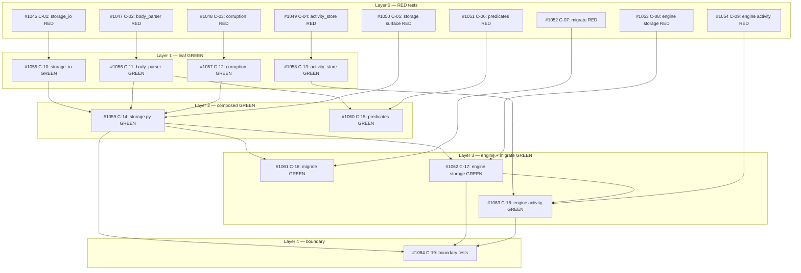

## Brief

Source brief: .owlbear/briefs/draft-kanban-storage-c-2026-04-20/brief.md
Normative source: .owlbear/briefs/draft-kanban-storage-c-2026-04-20/paper-c.md
Upstream engine contract: .owlbear/briefs/draft-kanban-engine-b-2026-04-20/paper-integration.md

Scope: storage boundary, structured body parsing, migration, activity-stream reset, corruption and repair primitives, and storage-facing tests.

## Planner Source

Decompose from paper-c.md §8 acceptance criteria and §11 implementation map.
Treat the structured-body rewrite as its own workstream.
Keep activity.jsonl reset semantics aligned with the revised brief: do not create legacy-compat tasks for old activity history.

## Notes

- This is the bottom layer. Downstream Brief B and Brief A tasks depend on it.
- Cockpit UI/product work is out of scope here.

[[2026-04-21]]
## Planning

19 tasks created in 5 layers, all children of #1043.

### Task Breakdown

| ID | Title | Layer | Priority | Depends On |
|----|-------|-------|----------|------------|
| #1046 | C-01: RED — storage_io atomic-write & ID-allocation tests | 0 | needed | — |
| #1047 | C-02: RED — body_parser round-trip tests | 0 | needed | — |
| #1048 | C-03: RED — corruption detection & auto-fix tests | 0 | needed | — |
| #1049 | C-04: RED — activity_store tests | 0 | needed | — |
| #1050 | C-05: RED — storage surface tests | 0 | critical | — |
| #1051 | C-06: RED — predicate tests | 0 | important | — |
| #1052 | C-07: RED — migrate tests | 0 | important | — |
| #1053 | C-08: RED — engine storage-integration tests | 0 | needed | — |
| #1054 | C-09: RED — engine activity/session tests | 0 | needed | — |
| #1055 | C-10: GREEN — storage_io atomic-write & ID-allocation | 1 | needed | #1046 |
| #1056 | C-11: GREEN — body_parser structured-body rewrite | 1 | needed | #1047 |
| #1057 | C-12: GREEN — corruption detection & auto-fix | 1 | needed | #1048 |
| #1058 | C-13: GREEN — activity_store append/query/compact | 1 | needed | #1049 |
| #1059 | C-14: GREEN — storage.py public surface | 2 | critical | #1050, #1055, #1056, #1057 |
| #1060 | C-15: GREEN — predicates section-based rewrite | 2 | important | #1051, #1056 |
| #1061 | C-16: GREEN — kanban-migrate entry point | 3 | important | #1052, #1059 |
| #1062 | C-17: GREEN — engine storage integration | 3 | needed | #1053, #1059 |
| #1063 | C-18: GREEN — engine activity/session wiring | 3 | needed | #1054, #1058, #1062 |
| #1064 | C-19: Boundary test updates | 4 | important | #1059, #1062, #1063 |

### Dependency Graph

### Workstreams

1. **Atomic I/O:** C-01 → C-10
2. **Structured body (body_parser):** C-02 → C-11 → C-14, C-15
3. **Corruption:** C-03 → C-12 → C-14
4. **Activity stream:** C-04 → C-13 → C-18
5. **Storage surface:** C-05 → C-14 → C-16, C-17, C-19
6. **Predicates:** C-06 → C-15
7. **Migration:** C-07 → C-16
8. **Engine (storage):** C-08 → C-17 → C-18, C-19
9. **Engine (activity):** C-09 → C-18 → C-19
[[2026-04-21]]
## Test-Writer Notes
- Non-implementation pass-through: container task with 19 child tasks (all planning complete).
- No direct testable AC on this parent — all AC lives in RED children #1046–#1054.
- Passing through to in-progress; proceeding to write tests for all 9 RED children.