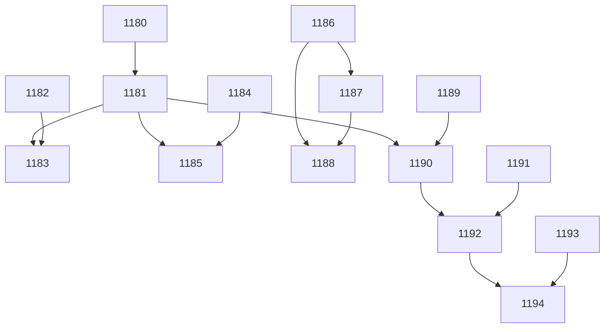

[[2026-04-30]]
## Planning
### Decomposition: DR Script Replacement
- Tasks created: 15
- Dependency layers: 5
- Phases: 3 (Engine+MCP → Agent/Skill → Cockpit)

### Task List
| ID | Title | Priority | Depends On | Tags |
|----|-------|----------|------------|------|
| 1180 | P1-01: Test decisions.py create_dr + resolve_pending_drs | needed | — | phase-1, scope:kanban, type:test |
| 1181 | P1-02: Implement decisions.py module | critical | 1180 | phase-1, scope:kanban, type:impl |
| 1182 | P1-03: Test create_dr MCP tool | needed | — | phase-1, scope:mcp-kanban, type:test |
| 1183 | P1-04: Implement create_dr MCP tool + guidance text update | needed | 1181, 1182 | phase-1, scope:mcp-kanban, type:impl |
| 1184 | P1-05: Test pick_tasks resolve_pending_drs integration | needed | — | phase-1, scope:kanban, type:test |
| 1185 | P1-06: Implement pick_tasks resolve integration | important | 1181, 1184 | phase-1, scope:kanban, type:impl |
| 1186 | P2-01: Test DR skill replacement structure | needed | — | phase-2, scope:agents, type:test |
| 1187 | P2-02: Create h-decision-requests skill + delete scribe/w-decision-routing | needed | 1186 | phase-2, scope:agents, type:impl |
| 1188 | P2-03: Update agent/skill/instruction references + decisions README | important | 1186, 1187 | phase-2, scope:agents, type:impl |
| 1189 | P3-01: Test decisions API endpoints | needed | — | phase-3, scope:cockpit, type:test |
| 1190 | P3-02: Implement decisions API endpoints | needed | 1181, 1189 | phase-3, scope:cockpit, type:impl |
| 1191 | P3-03: Test DR status indicator + popover components | needed | — | phase-3, scope:cockpit-fe, type:test |
| 1192 | P3-04: Implement DR status indicator + popover | needed | 1190, 1191 | phase-3, scope:cockpit-fe, type:impl |
| 1193 | P3-05: Test resolve modal component | needed | — | phase-3, scope:cockpit-fe, type:test |
| 1194 | P3-06: Implement resolve modal | important | 1192, 1193 | phase-3, scope:cockpit-fe, type:impl |

### Dependency Graph

[[2026-04-30]]
## Architecture Review\nDecomposition parent — planner completed successfully. 15 child tasks created across 3 phases (Engine+MCP → Agent/Skill → Cockpit) with 5 dependency layers. Child tasks #1180–#1194 carry the actual work and will be individually reviewed at backlog.\n\n### Verdict: APPROVE\n### Action Taken: Advanced decomposition parent after planner completion.