[[2026-05-01]]
## Planning
### Decomposition: Filter/Search UX for Kanban Board
- Tasks created: 9
- Dependency layers: 5 (linear TDD chain)
- Phases: 5 (filter logic → component → board integration → accessibility → integration verification)

### Task List
| ID | Title | Priority | Depends On | Tags |
|----|-------|----------|------------|------|
| 1248 | P1-01: RED — filterTasks unit tests | critical | — | phase-1, scope:cockpit-web, tdd:red |
| 1249 | P1-02: GREEN — filterTasks pure function + FilterState type | critical | 1248 | phase-1, scope:cockpit-web, tdd:green |
| 1250 | P2-01: RED — FilterPanel component tests | needed | 1249 | phase-2, scope:cockpit-web, tdd:red |
| 1251 | P2-02: GREEN — FilterPanel controlled component | needed | 1250 | phase-2, scope:cockpit-web, tdd:green |
| 1252 | P3-01: RED — KanbanBoard filter integration tests | needed | 1251 | phase-3, scope:cockpit-web, tdd:red |
| 1253 | P3-02: GREEN — KanbanBoard filter state and layout integration | needed | 1252 | phase-3, scope:cockpit-web, tdd:green |
| 1254 | P4-01: RED — Filter accessibility tests | important | 1253 | phase-4, scope:cockpit-web, tdd:red |
| 1255 | P4-02: GREEN — Filter accessibility implementation | important | 1254 | phase-4, scope:cockpit-web, tdd:green |
| 1256 | P5-01: Integration tests — full board filter flow | important | 1255 | phase-5, scope:cockpit-web, test:integration |

### Dependency Graph

```mermaid
graph LR
  1248[P1-01 RED filterTasks tests] --> 1249[P1-02 GREEN filterTasks impl]
  1249 --> 1250[P2-01 RED FilterPanel tests]
  1250 --> 1251[P2-02 GREEN FilterPanel impl]
  1251 --> 1252[P3-01 RED Board integration tests]
  1252 --> 1253[P3-02 GREEN Board integration]
  1253 --> 1254[P4-01 RED A11y tests]
  1254 --> 1255[P4-02 GREEN A11y impl]
  1255 --> 1256[P5-01 Integration verification]
```

[[2026-05-01]]
## Architecture Review — Decomposition Validation

### Verdict: APPROVE (decomposition parent advance)

Planner completed decomposition: 9 subtasks across 5 phases with linear TDD chain. Planning section present and structurally sound.

### Decomposition Assessment

| Criterion | Assessment |
|-----------|-----------|
| Phase granularity | PASS — 5 phases (pure logic → component → integration → a11y → verification) follow clean incremental layering |
| TDD pairing | PASS — RED/GREEN pairs for phases 1–4; phase 5 is verification-only |
| Dependency chain | PASS — linear chain is correct; each GREEN depends on preceding RED |
| Single responsibility | PASS — each task has one concern |
| Codebase alignment | PASS — Task interface has all needed fields (title, priority, tags, blocked); Board provides priorities list; PDS v4 exports PSelect, PMultiSelect, PSwitch |

### Issues for Subtask Reviews

1. **Path inconsistency:** #1249 AC says `lib/filterTasks.ts` but #1248 research says `../utils/filterTasks`. Codebase has `hooks/`, `components/`, `api/`, `__tests__/` — no `lib/` or `utils/`. Recommend `utils/filterTasks.ts` (more descriptive for non-hook pure functions). Fix in #1249 architect review.
2. **#1256 tagging:** Tagged `test:integration` but needs `type:test` pass-through tag for test-writer routing. Fix in #1256 architect review.
3. **Subtask pipeline status:** #1249–#1256 created in `research` — they have complete AC and will route through researcher before reaching architect. Normal pipeline flow; researchers may add useful codebase context.

### Codebase Evidence

- KanbanBoard.tsx: manages contextMenu, moveError, dragSourceStatus state — AC for #1252/#1253 correctly references these for filter interaction rules
- Task interface (useBoard.ts): `title: string`, `priority: string`, `tags: string[]`, `blocked: boolean` — all four filter dimensions present
- Board interface: `priorities: string[]` — available for priority dropdown
- PDS package verified: PSelect, PSelectOption, PMultiSelect, PMultiSelectOption, PSwitch all exported from @porsche-design-system/components-react ^4.0.0
- No existing filter/search code — this is greenfield

### Action

Tagged parent `type:config` for test-writer pass-through. Advanced to todo.
[[2026-05-01]]
## Test-Writer Notes
- Non-implementation task (tagged type:config) — no tests applicable.
- Parent decomposition task: 9 subtasks created across 5 TDD phases (#1248–#1256).
- Passing through to builder.
[[2026-05-01]]
## Builder Notes
- Non-implementation task — no code changes needed.
- Tests: not applicable (decomposition/config pass-through task).
- Coverage: not applicable.
- ruff: not applicable.
- Passing through to review.
[[2026-05-01]]
## Review Evidence
### Review Scope
- Non-implementation parent/config task. Quality-runner confirmed tests, lint, and coverage are not applicable for an empty scoped run on this task.
- Task 1247 has no explicit `## Acceptance Criteria` section, so review anchored to the decomposition deliverable in `.owlbear/kanban/tasks/1247-filter-search-ux-for-kanban-board.md` plus the referenced filter/search brief and created child-task artifacts.

### Test Results
- quality-runner: N/A. `test_paths=[]` was respected for this decomposition/config task.
- Structured report: 0 passed, 0 failed, 0 skipped; status N/A.

### Lint
- quality-runner: N/A. `lint_paths=[]` was respected for this decomposition/config task.
- Structured report: clean=true; status N/A.

### Coverage
- N/A. No source modules or task-owned tests are in scope for task 1247.

### Pass 1 — CRITICAL
#### Test-Writer AC Coverage
- Skipped. Parent config task has no `TestFromAC_*` classes, and both upstream notes marked tests not applicable.

#### Security Review
- No executable code changes are in scope. Builder notes explicitly state "no code changes needed" at `.owlbear/kanban/tasks/1247-filter-search-ux-for-kanban-board.md:92`.

#### Test Integrity
- N/A. No `TestFromAC_*` content exists on this parent task.

#### Test Quality
- N/A. No task-owned tests.

#### Data Safety
- No issues in scope. This task delivered task decomposition and metadata only.

#### Implementation-Aware Gaps
| Finding | Evidence | Status |
|---------|----------|--------|
| Child-task path contract drift | Parent architecture review records an unresolved inconsistency at `.owlbear/kanban/tasks/1247-filter-search-ux-for-kanban-board.md:70`. Child task 1249 still requires `lib/filterTasks.ts` at `.owlbear/kanban/tasks/1249-p1-02-green-filtertasks-pure-function-filterstate-type.md:24`. The governing brief also specifies `lib/filterTasks.ts` at `.owlbear/briefs/draft-filter-search-ux/brief.md:19`, `.owlbear/briefs/draft-filter-search-ux/brief.md:54`, and `.owlbear/briefs/draft-filter-search-ux/brief.md:234`. But the already-created RED suite imports `../utils/filterTasks` at `serve/cockpit/web/src/__tests__/filterTasks_1248.test.ts:19`, and the stub exists in `serve/cockpit/web/src/utils/filterTasks.ts:11`. The decomposition therefore hands downstream agents conflicting file targets. | FAIL |
| Child-task routing metadata defect | Parent architecture review records that child task 1256 needs a `type:test` pass-through tag at `.owlbear/kanban/tasks/1247-filter-search-ux-for-kanban-board.md:71`. The child task header currently includes only `test:integration` at `.owlbear/kanban/tasks/1256-p5-01-integration-tests-full-board-filter-flow.md:11`, and no `type:test` tag is present. This leaves the integration-test subtask misrouted. | FAIL |

#### Builder Process Quality
| Metric | Value |
|--------|-------|
| Builder Notes sections | 1 |
| Approach variation | N/A |
| Assessment | CLEAN |

### Pass 2 — INFORMATIONAL
- Structural positives verified: task file records 9 subtasks, 5 dependency layers, and 5 phases at `.owlbear/kanban/tasks/1247-filter-search-ux-for-kanban-board.md:22`, `.owlbear/kanban/tasks/1247-filter-search-ux-for-kanban-board.md:23`, and `.owlbear/kanban/tasks/1247-filter-search-ux-for-kanban-board.md:24`.
- Rejection is not about missing code or skipped tests. It is about unresolved decomposition defects in the child-task contracts.

### AC Compliance
| AC Line | Evidence | Mapped Test | Status |
|---------|----------|-------------|--------|
| Decompose the feature into a linear 5-phase TDD chain | Verified in `.owlbear/kanban/tasks/1247-filter-search-ux-for-kanban-board.md:22`, `.owlbear/kanban/tasks/1247-filter-search-ux-for-kanban-board.md:23`, and `.owlbear/kanban/tasks/1247-filter-search-ux-for-kanban-board.md:24`. | N/A | PASS |
| Child-task contracts remain internally consistent with brief authority and adjacent phase artifacts | Conflicting file target across `.owlbear/briefs/draft-filter-search-ux/brief.md:19`, `.owlbear/briefs/draft-filter-search-ux/brief.md:54`, `.owlbear/kanban/tasks/1249-p1-02-green-filtertasks-pure-function-filterstate-type.md:24`, `serve/cockpit/web/src/__tests__/filterTasks_1248.test.ts:19`, `serve/cockpit/web/src/utils/filterTasks.ts:11`, and parent note `.owlbear/kanban/tasks/1247-filter-search-ux-for-kanban-board.md:70`. | N/A | FAIL |
| Downstream test task routes correctly through the pipeline | Parent note `.owlbear/kanban/tasks/1247-filter-search-ux-for-kanban-board.md:71` identifies the required `type:test` tag, but child header `.owlbear/kanban/tasks/1256-p5-01-integration-tests-full-board-filter-flow.md:11` still only carries `test:integration`. | N/A | FAIL |

### Confidence: .73
### Verdict: FAIL

### Required Follow-up
1. Correct the file-path contract across the brief and child tasks so phase 1 and phase 2 reference one authoritative `filterTasks` module path.
2. Add the missing `type:test` routing tag to task 1256.
3. Re-run review after the decomposition artifacts are internally consistent.

### Reflection
- Problem faced: the parent task has no explicit acceptance-criteria block, so the review had to ground itself in the decomposition artifact plus brief authority.
- Pattern discovered: parent decomposition reviews must verify child-task metadata and routing, not just task counts and dependency shape.
- Quality gap: architecture review documented both defects but still advanced the parent, which would push avoidable churn into downstream subtasks.
[[2026-05-01]]
## Architecture Review — Reviewer Rejection Resolution

### Context
Reviewer rejected #1247 (confidence .73) with two decomposition defects in child-task contracts. Both defects documented in prior architecture review but not corrected at that time. This review resolves them.

### Defect Resolution

| Defect | Reviewer Finding | Action Taken |
|--------|-----------------|--------------|
| Path contract drift | #1249 AC says `lib/filterTasks.ts`; RED suite (#1248) imports `../utils/filterTasks`; stub committed at `utils/filterTasks.ts` | Appended binding path correction to #1249 body: `lib/filterTasks.ts` → `utils/filterTasks.ts`. Authoritative path: `serve/cockpit/web/src/utils/filterTasks.ts` (committed stub + RED import). Downstream architect for #1249 will refine AC text to match. |
| Missing routing tag | #1256 tagged `test:integration` only; needs `type:test` for test-writer pass-through | Added `type:test` tag to #1256 via `edit_task`. Tag now present: `phase-5, scope:cockpit-web, test:integration, type:test`. |

### Brief vs Reality
The brief at `.owlbear/briefs/draft-filter-search-ux/brief.md` still references `lib/filterTasks.ts`. Brief is a design artifact superseded by implemented reality. Task AC (corrected) takes precedence for builders. No brief edit needed — it served its purpose during planning.

### Evaluation (re-review scope: decomposition consistency only)

| Criterion | Assessment | Notes |
|-----------|-----------|-------|
| Single responsibility | PASS | Decomposition parent; no code |
| Interface clarity | PASS (after fix) | Path contract now consistent across #1248 (committed) and #1249 (corrected) |
| Dependency correctness | PASS | 9 subtasks, linear chain, all deps verified |
| Module layering | PASS | N/A for parent |
| TDD compliance | PASS | RED/GREEN pairs for phases 1-4; phase 5 is verification |
| KISS/YAGNI | PASS | Minimal decomposition for feature scope |
| Premise challenge | PASS | No existing filter code in codebase |
| Pattern consistency | PASS | Follows established task naming, tagging, and dependency conventions |
| Security surface | PASS | N/A for decomposition |
| Single domain | PASS | cockpit-web only |

### Test Depth
- Max depth: 0 (decomposition parent, no code)
- Test-writer: SKIP

### Challenge Results
- Challenger: SKIPPED — all td:0 (decomposition parent)

### Verdict: APPROVE
### Action Taken: Fixed both reviewer-identified defects (path correction on #1249, routing tag on #1256). Re-approved decomposition parent. Advanced to todo.
[[2026-05-01]]
## Test-Writer Notes
- Non-implementation task (tagged `type:config`) — no tests applicable (second pass after review rejection fix).
- Decomposition defects resolved by architect: path contract corrected on #1249, `type:test` tag added to #1256.
- Subtask pipeline proceeds normally: #1248 already in-progress with 19 RED tests.
- Passing through to builder.