[[2026-05-01]]
## Planning
### Decomposition: Filter/Search UX for Kanban Board
- Tasks created: 9
- Dependency layers: 5 (linear TDD chain)
- Phases: 5 (filter logic → component → board integration → accessibility → integration verification)

### Task List
| ID | Title | Priority | Depends On | Tags |
|----|-------|----------|------------|------|
| 1248 | P1-01: RED — filterTasks unit tests | critical | — | phase-1, scope:cockpit-web, tdd:red |
| 1249 | P1-02: GREEN — filterTasks pure function + FilterState type | critical | 1248 | phase-1, scope:cockpit-web, tdd:green |
| 1250 | P2-01: RED — FilterPanel component tests | needed | 1249 | phase-2, scope:cockpit-web, tdd:red |
| 1251 | P2-02: GREEN — FilterPanel controlled component | needed | 1250 | phase-2, scope:cockpit-web, tdd:green |
| 1252 | P3-01: RED — KanbanBoard filter integration tests | needed | 1251 | phase-3, scope:cockpit-web, tdd:red |
| 1253 | P3-02: GREEN — KanbanBoard filter state and layout integration | needed | 1252 | phase-3, scope:cockpit-web, tdd:green |
| 1254 | P4-01: RED — Filter accessibility tests | important | 1253 | phase-4, scope:cockpit-web, tdd:red |
| 1255 | P4-02: GREEN — Filter accessibility implementation | important | 1254 | phase-4, scope:cockpit-web, tdd:green |
| 1256 | P5-01: Integration tests — full board filter flow | important | 1255 | phase-5, scope:cockpit-web, test:integration |

### Dependency Graph

```mermaid
graph LR
  1248[P1-01 RED filterTasks tests] --> 1249[P1-02 GREEN filterTasks impl]
  1249 --> 1250[P2-01 RED FilterPanel tests]
  1250 --> 1251[P2-02 GREEN FilterPanel impl]
  1251 --> 1252[P3-01 RED Board integration tests]
  1252 --> 1253[P3-02 GREEN Board integration]
  1253 --> 1254[P4-01 RED A11y tests]
  1254 --> 1255[P4-02 GREEN A11y impl]
  1255 --> 1256[P5-01 Integration verification]
```
