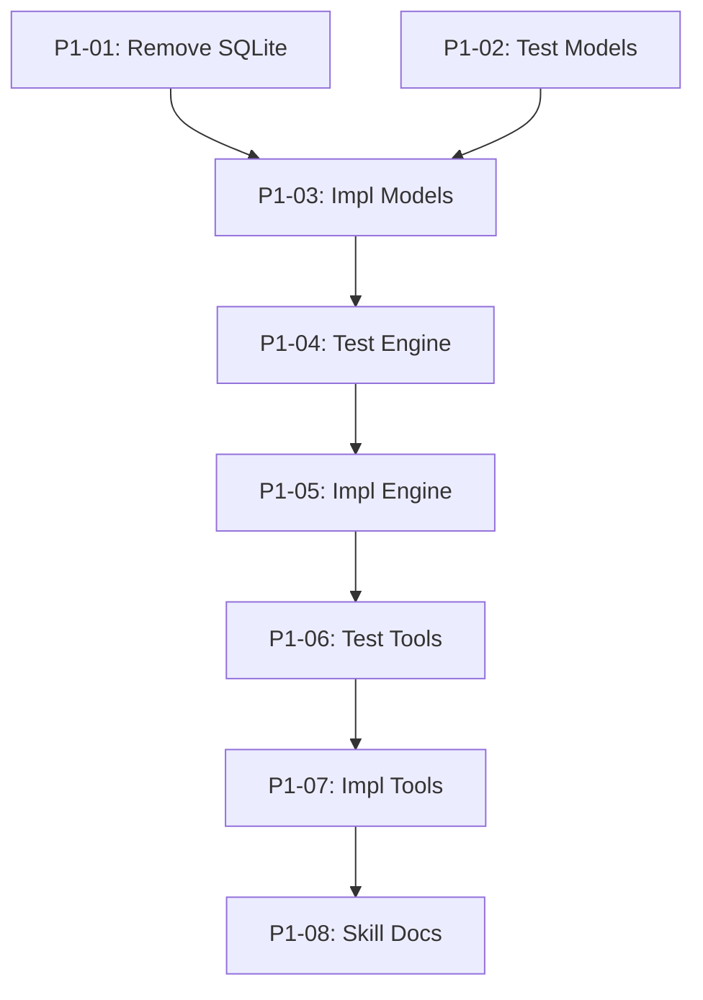

## Objective

Restructure `serve/mcp-memory/` from unused SQLite storage to a markdown+frontmatter file engine in `.owlbear/memory/`, with quality-gated MCP tools for storage, retrieval, and curation. Internal architecture mirrors the kanban module: data engine → business logic → MCP tool layer.

## Brief

`.owlbear/briefs/draft-memory-module/brief.md`

## Key Design Decisions

- Per-entry `.md` files in flat `.owlbear/memory/` directory
- Filename: `{slug}-{id6}.md` (slug from title, frozen at creation)
- State machine: pending → curated → approved → deleted (quality ladder: agent → curator → user)
- 9 categories (multi-value): knowledge, behaviour, pitfall, process, tool, goal, personality, preference, context
- Single confidence value [0.7, 1.0]: correctness and reproducibility
- scope_agents as list, no scope_project (repo-scoped by location)
- MtimeScanCache for reload, atomic writes, no OCC
- Mutation access: any agent creates (pending); curator promotes/edits/deletes; user approves
- No migration needed (SQLite never used)

## Acceptance Criteria

- [ ] File engine reads/writes `.owlbear/memory/*.md` with YAML frontmatter
- [ ] 5 MCP tools operational: store_learning, query_memory, update_entry, delete_entry, approve_entry
- [ ] State transitions enforced (pending→curated→approved→deleted)
- [ ] Mutation access restricted per tool (allowed_agents config)
- [ ] MtimeScanCache skips re-parse when dir mtime unchanged
- [ ] Retrieval returns curated+approved by default, sorted approved-first then confidence desc
- [ ] All SQLite code removed
- [ ] Skills updated: h-mcp-memory, h-memory-structure, w-mem-curation, r-pipeline-protocol
- [ ] Unit tests pass for engine, tools, validation, state transitions

[[2026-05-02]]
## Planning

### Decomposition: mcp-memory restructure (SQLite → file engine)
- Tasks created: 8
- Dependency layers: 6
- Phase: 1

### Task List

| ID | Title | Priority | Depends On | Tags |
|----|-------|----------|------------|------|
| 1267 | P1-01: Remove SQLite code and legacy tests | needed | — | phase-1, scope:mcp-memory, cleanup |
| 1268 | P1-02: Test — MemoryEntry model validation | needed | — | phase-1, scope:mcp-memory, tests |
| 1269 | P1-03: Implement MemoryEntry Pydantic model | needed | 1267, 1268 | phase-1, scope:mcp-memory |
| 1270 | P1-04: Test — File engine read/write/parse | needed | 1269 | phase-1, scope:mcp-memory, tests |
| 1271 | P1-05: Implement file engine with MtimeScanCache | needed | 1270 | phase-1, scope:mcp-memory |
| 1272 | P1-06: Test — MCP tools (5 tools, access control) | needed | 1271 | phase-1, scope:mcp-memory, tests |
| 1273 | P1-07: Implement MCP tool layer with access control | needed | 1272 | phase-1, scope:mcp-memory |
| 1274 | P1-08: Update memory skill documentation | important | 1273 | phase-1, scope:docs |

### Dependency Graph

### Execution Notes

- Layer 0 tasks (#1267, #1268) can execute in parallel — no shared deps
- TDD pairing: test tasks precede impl tasks via explicit dependency
- All tasks set to `todo` — ready for dispatch when deps are met
- Status skip (research→todo) intentional: scope fully defined by Brief, no further research needed