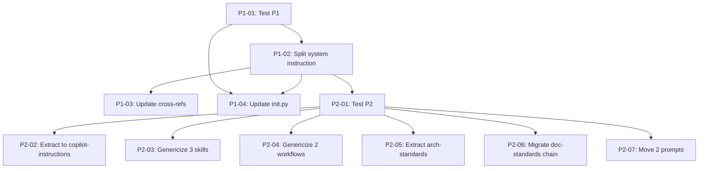

## Brief

See `.owlbear/briefs/draft-neutral-shared/brief.md` for the full Brief.

**Summary:** Make `share/` project-neutral for non-OwlBear consumers. Prose-first notation with framed examples. Phased delivery: P1 (system instruction split + scaffolding), P2 (path-heavy skills + doc-standards chain), P3 (cosmetic, deferred).

**Key decisions:** D3 (generic shared + local overrides), D5 (prose-first notation), D6 (phased P1→P2→P3), D7 (80% rule for copilot-instructions.md), D8 (framed examples stay in shared).

**Scope:** 10 files with path issues, 3 prompts to move, 2 files to split. 60 files already clean. Out of scope: value audit of clean files, quality-runner code changes, dead code removal.

## Planning

### Decomposition: Neutral shared layer
- Tasks created: 12
- Dependency layers: 3
- Phases: P1 (4 tasks), P2 (7 tasks), P3 (1 task deferred)

### Task List

| ID | Title | Priority | Depends On | Tags |
|----|-------|----------|------------|------|
| 1281 | P1-01: Test — system instruction neutrality and init.py scaffold verification | critical | — | phase-1, scope:test |
| 1282 | P1-02: Split owlbear-system.instructions.md — extract directory table | critical | 1281 | phase-1, scope:docs |
| 1283 | P1-03: Update cross-references in README, WIRING, h-agent-structure, h-memory-structure | needed | 1282 | phase-1, scope:docs |
| 1284 | P1-04: Update setup/init.py — scaffold consumer copilot-instructions.md | needed | 1281, 1282 | phase-1, scope:tools |
| 1285 | P2-01: Test — path neutrality verification for share/skills/ | critical | 1282 | phase-2, scope:test |
| 1286 | P2-02: Extract file-placement and layout sections to .github/copilot-instructions.md | needed | 1285 | phase-2, scope:docs |
| 1287 | P2-03: Genericize h-pytest-and-linting, h-vitest-and-linting, h-quality-runner | needed | 1285 | phase-2, scope:docs |
| 1288 | P2-04: Genericize w-doc-update and w-code-review | important | 1285 | phase-2, scope:docs |
| 1289 | P2-05: Extract r-architecture-standards sections to .owlbear/instructions/ | needed | 1285 | phase-2, scope:docs |
| 1290 | P2-06: Migrate r-doc-standards chain atomically (skill + instruction + doc-audit prompt) | needed | 1285 | phase-2, scope:docs |
| 1291 | P2-07: Move agent-audit and arch-audit prompts to .owlbear/prompts/ | important | 1285 | phase-2, scope:docs |
| 1292 | P3-01: Cosmetic OwlBear renames (4 files) | someday | — | phase-3, scope:docs |

### Dependency Graph

[[2026-05-02]]
Decomposed into 12 subtasks (IDs 1281–1292) across 3 phases. P1: 4 tasks (test + split + cross-refs + init.py). P2: 7 tasks (test + 5 genericizations + prompt moves). P3: 1 deferred cosmetic task at backlog/someday. TDD pairing: test tasks #1281 and #1285 precede their respective implementation phases. Dependency graph has 3 layers with no cycles.