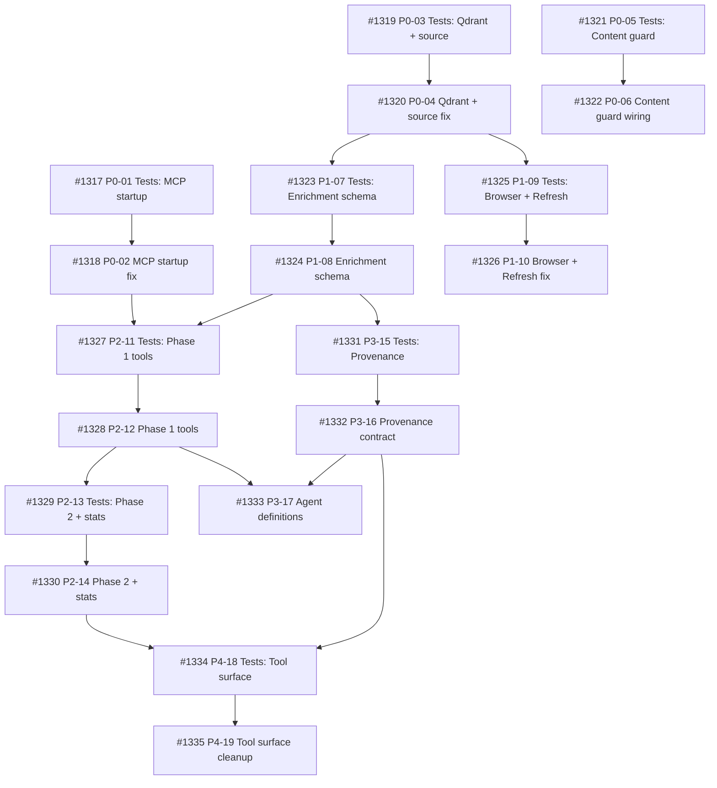

## Brief

See `.owlbear/briefs/draft-knowledge-activation/brief.md` for the full approved Brief.

### Summary

Activate the existing knowledge engine (`serve/knowledge/`) and its MCP server (`serve/mcp-knowledge/`) for end-to-end domain knowledge retrieval with cross-source graph-augmented search. Includes: MCP startup fix, browser integration, content guard wiring, enrichment worker subsystem (new construction), search provenance contract, revised 8-tool MCP surface, and 2 agent roles (ingestor + enricher).

### Outcomes

- O1: MCP server starts cleanly
- O2: Ingest pipeline works (local files, public URLs, authenticated pages)
- O3: Browser detection with user validation
- O4: Enrichment via VS Code agent workers (Phase 1 + Phase 2)
- O5: Graph-augmented retrieval with provenance
- O6: Persistent local DB (Qdrant + SQLite)
- O7: 8 active MCP tools, 4 deferred scope stubs
- O8: Per-source enrichment flag
- O9: Content injection guard at ingest

### Dependency Ordering

Layer 0: Foundation (startup, Qdrant persistence, source identity, content guard)
Layer 1: Schema + Wiring (enrichment_state, worker claims, edge uniqueness, browser, refresh fix)
Layer 2: Enrichment Workers (get_next_batch, store_enrichment, get_consolidation_candidates, get_stats)
Layer 3: Search + Agents (provenance contract, ingestor agent, enricher agent)
Layer 4: Tool Surface Cleanup (remove inactive, register scope stubs)

### Decisions

20 decisions recorded (D1-D20). See `.owlbear/briefs/draft-knowledge-activation/decisions.md`.

## Planning

### Decomposition: Knowledge Engine Activation
- Tasks created: 19
- Dependency layers: 5 (L0–L4)
- TDD pairs: 9 (test → impl), 1 standalone agent-config task

### Task List

| ID | Title | Priority | Depends On | Tags |
|----|-------|----------|------------|------|
| #1317 | P0-01: Tests — MCP startup | critical | — | phase-0, scope:mcp-knowledge, test |
| #1318 | P0-02: MCP startup fix | critical | #1317 | phase-0, scope:mcp-knowledge |
| #1319 | P0-03: Tests — Qdrant persistence + source identity | critical | — | phase-0, scope:knowledge, test |
| #1320 | P0-04: Qdrant persistence + source identity fix | critical | #1319 | phase-0, scope:knowledge |
| #1321 | P0-05: Tests — Content guard wiring | critical | — | phase-0, scope:knowledge, test |
| #1322 | P0-06: Content guard wiring | critical | #1321 | phase-0, scope:knowledge |
| #1323 | P1-07: Tests — Enrichment schema | needed | #1320 | phase-1, scope:knowledge, test |
| #1324 | P1-08: Enrichment schema additions | needed | #1323 | phase-1, scope:knowledge |
| #1325 | P1-09: Tests — Browser + RefreshOrchestrator | needed | #1320 | phase-1, scope:knowledge, test |
| #1326 | P1-10: Browser + RefreshOrchestrator fix | needed | #1325 | phase-1, scope:knowledge |
| #1327 | P2-11: Tests — Phase 1 enrichment tools | needed | #1324, #1318 | phase-2, scope:mcp-knowledge, test |
| #1328 | P2-12: Phase 1 enrichment tools | needed | #1327 | phase-2, scope:mcp-knowledge |
| #1329 | P2-13: Tests — Phase 2 + stats tools | needed | #1328 | phase-2, scope:mcp-knowledge, test |
| #1330 | P2-14: Phase 2 + stats tools | needed | #1329 | phase-2, scope:mcp-knowledge |
| #1331 | P3-15: Tests — Search provenance contract | important | #1324 | phase-3, scope:mcp-knowledge, test |
| #1332 | P3-16: Search provenance contract | important | #1331 | phase-3, scope:mcp-knowledge |
| #1333 | P3-17: Agent definitions + prompts | important | #1328, #1332 | phase-3, scope:agents, agent |
| #1334 | P4-18: Tests — Tool surface validation | important | #1330, #1332 | phase-4, scope:mcp-knowledge, test |
| #1335 | P4-19: Tool surface cleanup + scope stubs | important | #1334 | phase-4, scope:mcp-knowledge |

### Dependency Graph

[[2026-05-04]]
## Planning

Decomposed Knowledge Engine Activation into 19 subtasks across 5 layers (L0–L4), following the Brief's dependency ordering.

- 9 TDD pairs (test-writer → builder), 1 standalone agent-config task
- Layer 0 (Foundation): 6 tasks — MCP startup fix, Qdrant persistence + source identity, content guard wiring
- Layer 1 (Schema + Wiring): 4 tasks — enrichment schema, browser + RefreshOrchestrator wiring
- Layer 2 (Enrichment Workers): 4 tasks — Phase 1 tools (get_next_batch, store_enrichment), Phase 2 + stats tools
- Layer 3 (Search + Agents): 3 tasks — provenance contract, agent definitions + prompts
- Layer 4 (Tool Surface): 2 tasks — validation + cleanup + scope stubs

All 9 outcomes (O1-O9) mapped. Key decisions (D7-D20) referenced in AC. Out-of-scope items (§6) excluded.

Created: #1317–#1335 (19 tasks), all parented to #1316.
[[2026-05-04]]
Verified existing decomposition: all 19 subtasks (#1317–#1335) confirmed on board with correct dependency chains, TDD pairing, priorities, tags, and parent linkage. No new tasks needed — decomposition was completed in a prior session.
[[2026-05-04]]

## Architecture Review

### Context
Parent container task for Knowledge Engine Activation. Decomposed into 19 subtasks (#1317–#1335) across 5 dependency layers via planner. Codebase analysis confirmed:

- `serve/knowledge/` has ~35 modules with working SQLite schema (v9), Qdrant vector store, graph store, ingest pipeline, content guard, SSRF protection
- `serve/mcp-knowledge/` has 14 registered MCP tools — Brief targets 8 active + 4 stubs
- Lifespan contains copilot_auth device-flow that crashes in stdio context (confirmed in server.py L260-280)
- RefreshOrchestrator instantiated without content_fetcher/graph_store (confirmed in server.py L318-322)
- ContentInjectionGuard exists but is not wired into IngestPipeline in the MCP server (confirmed — pipeline constructed without guard in lifespan)

### Evaluation
| Criterion | Assessment | Notes |
|-----------|-----------|-------|
| Single responsibility | PASS | Parent container; each subtask has single responsibility |
| Interface clarity | PASS | AC on each subtask specifies concrete functions, modules, and expected behavior |
| Dependency correctness | PASS | 5-layer ordering matches Brief §4.1; TDD pairs have test→impl deps |
| Module layering | PASS | Changes scoped to serve/knowledge/ and serve/mcp-knowledge/; no upward imports |
| TDD compliance | PASS | 9 TDD pairs with test tasks preceding implementation tasks |
| KISS/YAGNI | PASS | Brief §6 out-of-scope items excluded; scope stubs deferred per D12/D16 |
| Premise challenge | PASS | Knowledge engine exists (~35 modules); activation is valid — not greenfield |
| Pattern consistency | PASS | Follows existing FastMCP tool patterns, SQLite schema conventions |
| Security surface | PASS | Content guard (O9), SSRF protection already exists, content_safety wrapping |
| Single domain | PASS | All work in knowledge domain; agent task (#1333) is tagged `agent` for pass-through |

### Challenge Results
- Challenger: SKIPPED — parent container, no approval verdict (subtasks will be individually reviewed)

### Test Depth
- Max depth: N/A (parent container)
- Test-writer: N/A (subtasks have their own TDD pairs)

### Verdict: DECOMPOSED
### Action Taken: Delegated to planner → 19 subtasks (#1317–#1335) created under parent #1316. All subtasks in `research` for pipeline processing. Parent remains in-progress as container.

[[2026-05-04]]
Architecture review complete. Parent container task decomposed into 19 subtasks (#1317–#1335). Keeping in-progress as container — parent completes when all children reach done.