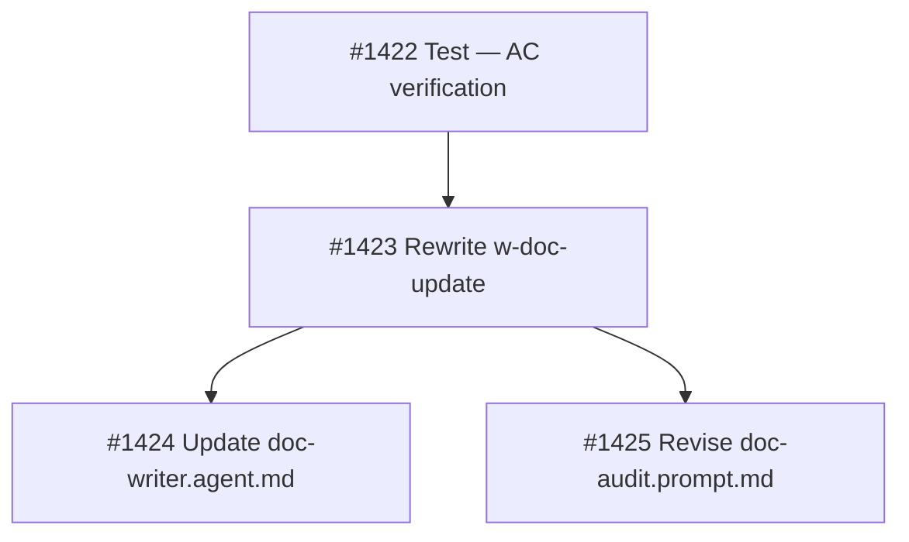

## Brief Summary

Rewrite `w-doc-update` skill and revise `doc-audit.prompt.md` to make the `docs` pipeline stage produce honest documentation updates.

**Deliverables:**
1. `share/skills/w-doc-update/SKILL.md` — rewrite with 4-item checklist, convention mapping, grep+LLM verification, visible TODO markers
2. `share/agents/doc-writer.agent.md` — remove diagram references
3. `.owlbear/prompts/doc-audit.prompt.md` — batch TODO resolution, diagram ownership

**Key design decisions:**
- Convention mapping: `serve/{pkg}/src/**` → `serve/{pkg}/README.md`
- Verification: grep for removals (Layer 1) + LLM editorial full-file read (Layer 2)
- TODO format: `> **TODO:** {category} — {description} [#{id}]` (always visible)
- Categories: stale | inaccurate | missing | unverified
- Gate: unverified on task content blocks; unverified on pre-existing passes
- Diagrams: removed from doc-writer, moved to doc-audit
- Sync-to-main: warning on unresolved markers, not hard gate

**Full brief:** `.owlbear/briefs/draft-doc-writer-quality/brief.md`
[[2026-05-08]]
## Planning
### Decomposition: Doc-writer quality redesign
- Tasks created: 4
- Dependency layers: 3
- Phase: 1

### Task List
| ID | Title | Priority | Depends On | Tags |
|----|-------|----------|------------|------|
| #1422 | P1-01: Test — verify doc-writer quality redesign AC | needed | — | phase-1, scope:shared, brief:doc-writer-quality |
| #1423 | P1-02: Rewrite w-doc-update skill — 4-item checklist + verification layers | needed | #1422 | phase-1, scope:shared, brief:doc-writer-quality |
| #1424 | P1-03: Update doc-writer.agent.md — remove diagram responsibility | important | #1423 | phase-1, scope:shared, brief:doc-writer-quality |
| #1425 | P1-04: Revise doc-audit.prompt.md — TODO resolution + diagram ownership | important | #1423 | phase-1, scope:shared, brief:doc-writer-quality |

### Dependency Graph

All tasks at `research` status, parent #1421.