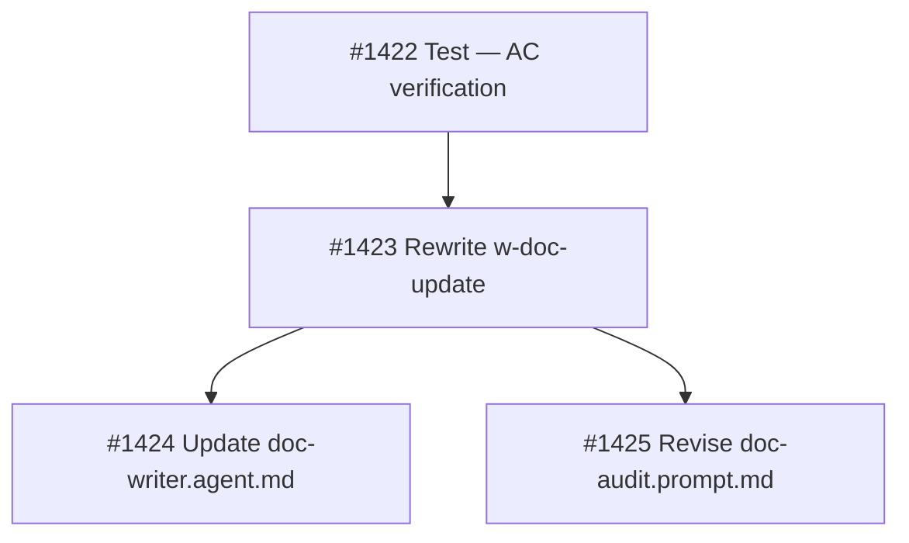

## Brief Summary

Rewrite `w-doc-update` skill and revise `doc-audit.prompt.md` to make the `docs` pipeline stage produce honest documentation updates.

**Deliverables:**
1. `share/skills/w-doc-update/SKILL.md` — rewrite with 4-item checklist, convention mapping, grep+LLM verification, visible TODO markers
2. `share/agents/doc-writer.agent.md` — remove diagram references
3. `.owlbear/prompts/doc-audit.prompt.md` — batch TODO resolution, diagram ownership

**Key design decisions:**
- Convention mapping: `serve/{pkg}/src/**` → `serve/{pkg}/README.md`
- Verification: grep for removals (Layer 1) + LLM editorial full-file read (Layer 2)
- TODO format: `> **TODO:** {category} — {description} [#{id}]` (always visible)
- Categories: stale | inaccurate | missing | unverified
- Gate: unverified on task content blocks; unverified on pre-existing passes
- Diagrams: removed from doc-writer, moved to doc-audit
- Sync-to-main: warning on unresolved markers, not hard gate

**Full brief:** `.owlbear/briefs/draft-doc-writer-quality/brief.md`
[[2026-05-08]]
## Planning
### Decomposition: Doc-writer quality redesign
- Tasks created: 4
- Dependency layers: 3
- Phase: 1

### Task List
| ID | Title | Priority | Depends On | Tags |
|----|-------|----------|------------|------|
| #1422 | P1-01: Test — verify doc-writer quality redesign AC | needed | — | phase-1, scope:shared, brief:doc-writer-quality |
| #1423 | P1-02: Rewrite w-doc-update skill — 4-item checklist + verification layers | needed | #1422 | phase-1, scope:shared, brief:doc-writer-quality |
| #1424 | P1-03: Update doc-writer.agent.md — remove diagram responsibility | important | #1423 | phase-1, scope:shared, brief:doc-writer-quality |
| #1425 | P1-04: Revise doc-audit.prompt.md — TODO resolution + diagram ownership | important | #1423 | phase-1, scope:shared, brief:doc-writer-quality |

### Dependency Graph

All tasks at `research` status, parent #1421.
[[2026-05-08]]
## Test-Writer Notes
- Test file: tests/test_doc_writer_quality_1422.py
- Classes: TestFromAC_DocUpdateSkillContent, TestFromAC_DocWriterAgentNoDiagrams, TestFromAC_DocAuditPromptContent, TestFromAC_NoOldDiagramItems, TestFromAC_TodoMarkerFormat
- Tests per category: happy 0, edge 0, error 0, boundary 0 (file-content assertions — all AC-mapping checks)
- Total: 25 tests, all FAIL
- ruff: clean
- Note: task #1421 is the parent coordination task; test file ID uses #1422 (designated test subtask per planning decomposition). Builder should target #1423 next (rewrite w-doc-update skill), then #1424 and #1425.

### AC Coverage
| AC | Tests |
|----|-------|
| AC1: w-doc-update/SKILL.md content | test_convention_mapping_serve_pkg_pattern, test_convention_mapping_serve_pkg_to_readme, test_checklist_has_exactly_four_items, test_checklist_has_no_diagram_maintenance_item, test_checklist_has_no_explicit_diagram_creation_item, test_verification_procedure_layer1_grep_present, test_verification_procedure_layer2_editorial_present, test_todo_marker_insertion_rules_present, test_todo_marker_blockquote_format_documented, test_gate_rule_task_caused_content_blocks, test_gate_rule_preexisting_content_passes |
| AC2: doc-writer.agent.md no diagrams | test_no_diagram_references_anywhere, test_no_excalidraw_file_references, test_no_excalidraw_brand_references |
| AC3: doc-audit.prompt.md new content | test_todo_marker_batch_resolution_dimension_present, test_diagram_ownership_section_present, test_describes_based_diagram_verification_present |
| AC4: no old items 5/6 in w-doc-update | test_no_item_5_section_heading, test_no_item_6_section_heading, test_output_template_no_diagram_row_5, test_output_template_no_diagram_row_6 |
| AC5: TODO marker format | test_todo_marker_format_verbatim_in_skill, test_four_todo_categories_documented, test_todo_marker_includes_task_ref_placeholder, test_todo_marker_format_is_greppable |