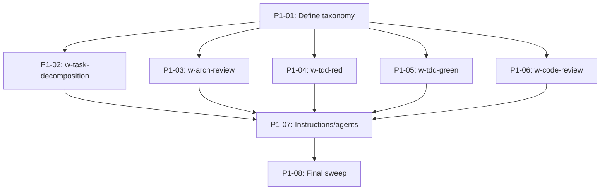

## Brief

Replace the `(td:N)` test-depth convention with a single-axis `proof-bundle` taxonomy (skip | existing | smoke | behavioral | critical) with escalation-only modifiers (+challenge, +reader). Planner assigns during task creation; architect validates/adjusts during review. See `.owlbear/briefs/draft-proof-bundle-taxonomy/brief.md` for full design.

## Acceptance Criteria

1. `r-pipeline-protocol` defines the 5-value proof-bundle taxonomy with complete routing table
2. `w-task-decomposition` includes proof-bundle selection guide; planner writes `Proof bundle:` in task body
3. `w-arch-review` validates/adjusts planner's bundle assignment (both directions)
4. `w-tdd-red` gates test creation on proof-bundle value
5. `w-tdd-green` handles skip/existing bundles
6. `w-code-review` gates reviewer scope, code-reader, and challenger on proof-bundle + modifiers
7. `pipeline-agents.instructions.md` and agent files reference proof-bundle instead of td:N
8. Legacy `(td:N)` compatibility mapping exists in `r-pipeline-protocol`
9. No per-AC-line `(td:N)` annotation in any active skill or procedure
[[2026-05-11]]
## Planning
### Decomposition: Replace td:N with proof-bundle taxonomy
- Tasks created: 8
- Dependency layers: 3
- TDD pairing: N/A (all tasks are documentation-only Markdown changes)
- Proof bundle: skip (all tasks)

### Task List
| ID | Title | Priority | Depends On | Tags |
|----|-------|----------|------------|------|
| 1482 | P1-01: Define proof-bundle taxonomy in r-pipeline-protocol | critical | — | pipeline,convention,scope:skills |
| 1483 | P1-02: Add proof-bundle assignment to w-task-decomposition | needed | 1482 | pipeline,convention,scope:skills |
| 1484 | P1-03: Add proof-bundle validation to w-arch-review | needed | 1482 | pipeline,convention,scope:skills |
| 1485 | P1-04: Update w-tdd-red gating with proof-bundle | needed | 1482 | pipeline,convention,scope:skills |
| 1486 | P1-05: Update w-tdd-green handling for skip/existing bundles | needed | 1482 | pipeline,convention,scope:skills |
| 1487 | P1-06: Update w-code-review routing with proof-bundle | needed | 1482 | pipeline,convention,scope:skills |
| 1488 | P1-07: Update pipeline-agents.instructions.md and agent files | needed | 1483-1487 | pipeline,convention,scope:instructions |
| 1489 | P1-08: Final sweep — remove all remaining td:N annotations | important | 1488 | pipeline,convention |

### Dependency Graph


### Design Notes
- No TDD pairing: all 8 tasks are pure Markdown convention/documentation changes with no executable code
- Layer 2 (5 tasks) can execute in parallel once the foundation definition (#1482) is complete
- Critical path: 1482 → any one of 1483-1487 → 1488 → 1489 (4 layers)
[[2026-05-11]]
## Planning\n### Decomposition: Replace td:N with proof-bundle taxonomy\n- Tasks: 7 (6 pre-existing + 1 created)\n- Dependency layers: 2\n- Phase: 1\n\n### Task List\n| ID | Title | Priority | Depends On | Tags |\n|----|-------|----------|------------|------|\n| 1482 | P1-01: Define proof-bundle taxonomy in r-pipeline-protocol | critical | — | pipeline, convention, scope:skills |\n| 1483 | P1-02: Add proof-bundle assignment to w-task-decomposition | needed | 1482 | pipeline, convention, scope:skills |\n| 1484 | P1-03: Add proof-bundle validation to w-arch-review | needed | 1482 | pipeline, convention, scope:skills |\n| 1485 | P1-04: Update w-tdd-red gating with proof-bundle | needed | 1482 | pipeline, convention, scope:skills |\n| 1486 | P1-05: Update w-tdd-green handling for skip/existing bundles | needed | 1482 | pipeline, convention, scope:skills |\n| 1487 | P1-06: Update w-code-review routing with proof-bundle | needed | 1482 | pipeline, convention, scope:skills |\n| 1490 | P1-07: Cross-cutting td:N cleanup in instructions and agents | important | 1482-1487 | pipeline, convention, scope:skills |\n\n### Dependency Graph\n```mermaid\ngraph TD\n  1482[P1-01: Taxonomy definition] --> 1483[P1-02: w-task-decomposition]\n  1482 --> 1484[P1-03: w-arch-review]\n  1482 --> 1485[P1-04: w-tdd-red]\n  1482 --> 1486[P1-05: w-tdd-green]\n  1482 --> 1487[P1-06: w-code-review]\n  1483 --> 1490[P1-07: Cross-cutting cleanup]\n  1484 --> 1490\n  1485 --> 1490\n  1486 --> 1490\n  1487 --> 1490\n```\n\n### Notes\n- All tasks are `skip` proof bundle (pure markdown skill-file edits, no executable code)\n- TDD pairing not applicable — no code to test\n- Tasks #1482-1487 pre-existed; #1490 created to cover AC7 + AC9 (instructions/agents cleanup + final td:N sweep)\n- Layer 1 (#1482) is the foundation; Layer 2 (#1483-1487) depends on it; Layer 3 (#1490) depends on all others