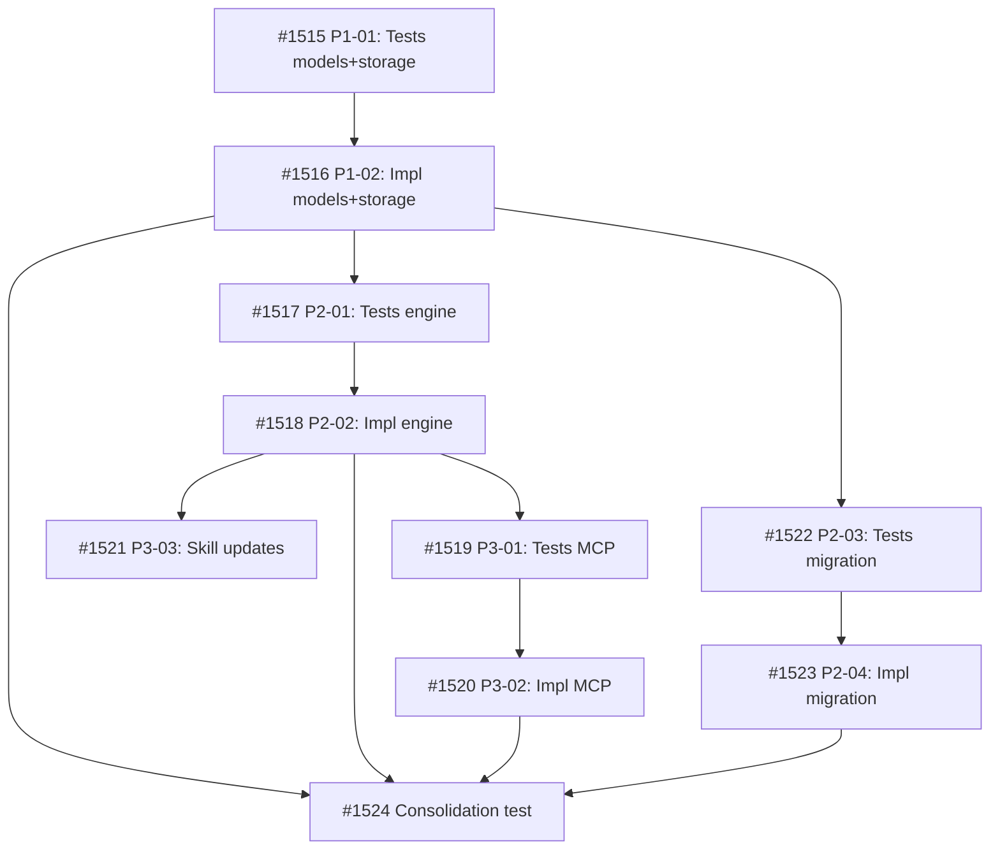

## Objective

Move Acceptance Criteria (`ac`) and Proof Bundle (`proof_bundle`) from freeform task body text to structured YAML frontmatter fields. Specification belongs in structure; the body becomes operational notes only.

## Brief

See `.owlbear/briefs/draft-structured-task-spec/brief.md` for the full Brief including field design, model/engine/MCP changes, skill updates, migration, and delivery constraints.

## Key Design Decisions

- `ac: list[str]` with dual mutation (full replacement OR atomic add/remove)
- `proof_bundle: str | None` with hybrid validation (model normalizes, engine validates membership)
- `proof_bundle` in TaskSummary + DispatchEntry; `ac` in Task + TaskFull only
- Same-release skill updates (5 skills)
- Recommended first-run proof_bundle migration script
- Cockpit UI deferred to follow-up task

## Acceptance Criteria

- AC1: `ac` (list[str]) and `proof_bundle` (str|None) are first-class frontmatter fields in the Task model
- AC2: `proof_bundle` appears in TaskSummary and DispatchEntry; `ac` does not
- AC3: Model normalizes `proof_bundle` (lowercase, sort modifiers) without membership validation
- AC4: Engine validates `proof_bundle` membership against frozenset in create/edit paths
- AC5: `edit_task` supports dual AC mutation (full replacement OR atomic add/remove, mutually exclusive)
- AC6: MCP tools (`create_task`, `edit_task`, `show_task`) expose both fields
- AC7: Engine search includes frontmatter AC items
- AC8: Pipeline skills read AC and proof_bundle from frontmatter instead of body text
- AC9: Migration script extracts proof_bundle from body to frontmatter
- AC10: Engine enforces AC guardrails (max 20 items, max 500 chars per item)
2026-05-13T02:30:37+00:00
## Planning
### Decomposition: Structured task specification in frontmatter (AC + proof_bundle)
- Tasks created: 10
- Dependency layers: 6
- Phases: 4

### Task List
| ID | Title | Priority | Depends On | Tags |
|----|-------|----------|------------|------|
| #1515 | P1-01: Tests for ac and proof_bundle model fields + storage canonical fields | needed | — | phase-1, scope:kanban, tdd, feature |
| #1516 | P1-02: Implement ac and proof_bundle model fields + storage canonical fields | critical | #1515 | phase-1, scope:kanban, tdd, feature |
| #1517 | P2-01: Tests for engine ac/proof_bundle in create_task, edit_task, and search | needed | #1516 | phase-2, scope:kanban, tdd, feature |
| #1518 | P2-02: Implement engine ac/proof_bundle in create_task, edit_task, and search | critical | #1517 | phase-2, scope:kanban, tdd, feature |
| #1519 | P3-01: Tests for MCP server ac/proof_bundle tool parameters | needed | #1518 | phase-3, scope:mcp-kanban, tdd, feature |
| #1520 | P3-02: Implement MCP server ac/proof_bundle tool parameters | needed | #1519 | phase-3, scope:mcp-kanban, tdd, feature |
| #1521 | P3-03: Pipeline skill updates for frontmatter ac/proof_bundle | important | #1518 | phase-3, scope:skills, feature |
| #1522 | P2-03: Tests for proof_bundle migration script | needed | #1516 | phase-2, scope:kanban, tdd, feature, migration |
| #1523 | P2-04: Implement proof_bundle migration script | needed | #1522 | phase-2, scope:kanban, tdd, feature, migration |
| #1524 | Consolidation test: structured task specification | important | #1516, #1518, #1520, #1523 | phase-4, scope:kanban, consolidation-test, feature |

### Dependency Graph

### Notes
- TDD pairs: #1515→#1516, #1517→#1518, #1519→#1520, #1522→#1523
- Parallel tracks after #1516: engine (#1517→#1518) and migration (#1522→#1523) are independent
- Parallel tracks after #1518: MCP (#1519→#1520) and skills (#1521) are independent
- #1521 (skill updates) is proof_bundle: skip (docs/process only, no TDD pair needed)
- Delivery constraint: #1521 ships same-release with code changes
2026-05-13T02:39:21+00:00
## Architecture Review

### Evaluation
| Criterion | Assessment | Notes |
|-----------|-----------|-------|
| Single responsibility | PASS | One cohesive feature: structured AC + proof_bundle in frontmatter |
| Interface clarity | PASS | Types, defaults, validation behavior specified in Brief and AC |
| Dependency correctness | PASS | 6-layer dep graph with correct phase ordering; parallel tracks identified |
| Module layering | PASS | models → engine → agent_view → MCP; follows existing kanban package layering |
| TDD compliance | PASS | 4 TDD pairs (#1515→#1516, #1517→#1518, #1519→#1520, #1522→#1523); #1521 correctly skip |
| KISS/YAGNI | PASS | Dual AC mutation follows existing body/append_body and add_tag/remove_tag patterns |
| Premise challenge | PASS | Moving spec from freeform body to structured frontmatter is a clear improvement for machine-queryable pipeline |
| Pattern consistency | PASS | Follows existing field addition pattern, validation pattern (model normalizes, engine validates membership), error taxonomy |
| Security surface | PASS | No new external boundaries; guardrails (max 20 items, 500 chars) are defense-in-depth |
| Single domain | PASS | kanban (#1515-#1518, #1522-#1524), mcp-kanban (#1519-#1520), skills (#1521) — each subtask single-domain |

### Decomposition Assessment
- 10 tasks, 4 phases, 6 dependency layers — well-structured
- Parallel tracks correctly identified: engine ∥ migration (phase 2), MCP ∥ skills (phase 3)
- Consolidation test (#1524) gates on all 4 implementation tracks
- AC coverage: parent AC1-AC10 fully mapped to child tasks

### Child AC Issues for Individual Reviews

**#1515/#1516 AC4 — dual `_CANONICAL_FIELDS` lists:**
`_CANONICAL_FIELDS` exists in both `storage.py` (L212) and `migrate.py` (L31) as independent copies. AC4 only references `storage._CANONICAL_FIELDS`. During individual review, update AC4 to: "Both `storage._CANONICAL_FIELDS` and `migrate._CANONICAL_FIELDS` include `ac` and `proof_bundle` positioned after `depends_on`"

**#1519/#1520 AC2 — missing explicit types:**
AC2 says "accepts `ac`, `add_ac`, `remove_ac`, and `proof_bundle` params" without specifying types. Brief incorrectly specifies `add_ac: str` at MCP level, but existing `add_tag` uses `list[str]`. During individual review, update to: `add_ac: list[str] | None` and `remove_ac: list[str] | None`

**#1521 AC1-AC3 — "instead of" vs fallback:**
AC says "instead of parsing body markdown sections" but Brief specifies "read frontmatter if present, fall back to body inspection for legacy tasks." During individual review, add fallback language for in-flight legacy tasks without frontmatter AC.

**#1521 AC4 — process instruction, not verifiable criterion:**
"Builder greps share/skills/" is a process instruction. During individual review, rewrite as: "No remaining references to body-based `Proof bundle:` or `## Acceptance Criteria` patterns exist in `share/skills/` after updates"

### Proof-Bundle Validation
- Planner assignment: (none on parent)
- Final bundle: skip (parent is a decomposed feature tracker; all work in children)
- Test-writer: SKIP

### Actions Taken
- Added `quality` pass-through tag to #1514 for pipeline routing
- Added `docs` pass-through tag to #1521 (non-implementation skill-file-only task)

### Challenge Results
- Challenger: SKIPPED — proof bundle `skip`

### Verdict: APPROVE
### Action Taken: Advanced #1514 → todo with quality pass-through tag. Child AC issues documented for individual architecture reviews.

Proof bundle: skip
2026-05-13T02:40:43+00:00
## Test-Writer Notes
- Proof bundle: skip — no new test writing required.
- Passing through to builder.
2026-05-13T02:49:27+00:00
## Builder Notes
- Implementation: none (tracker parent task; no source changes)
- Tests: not run (proof bundle skip parent task with no direct implementation surface)
- Coverage: n/a
- ruff: n/a
- Evidence summary:
  - Parent task #1514 AC1-AC10 represent aggregate feature completion across child tasks #1515-#1524.
  - Child dependency chain is not complete: #1515 currently in-progress; #1516-#1524 are backlog/blocked.
  - Advancing as DONE from builder would be a false green because required implementation tasks are unfinished.
- Fixes applied:
  - Added dependency `depends_on: [1524]` to #1514 so parent completion is gated by the consolidation child that already gates all implementation tracks.

### Required Follow-up
| # | Target Agent | Action Required | File(s) | Evidence |
|---|-------------|----------------|---------|----------|
| 1 | builder | Re-run Build #1514 only after child chain through #1524 is complete and available for parent verification/pass-through | .owlbear/kanban/tasks/1514-structured-task-specification-in-frontmatter-ac-proof_bundle.md | Child statuses from board: #1515 in-progress, #1516-#1524 backlog/blocked at build time |
| 2 | planner | Ensure parent tracker dispatch ordering respects `depends_on: [1524]` gate before routing to builder again | .owlbear/kanban/tasks/1514-structured-task-specification-in-frontmatter-ac-proof_bundle.md | Builder escalation: parent AC is aggregate and structurally unreachable before consolidation task completion |