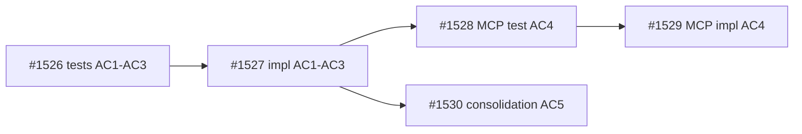

## Summary

Decomposition parent for dep-status guidance in `start_work()`. All implementation and proof is delegated to child tasks #1526-#1530.

## Brief

`.owlbear/briefs/draft-dep-status-guidance/brief.md`

## Acceptance Criteria

- AC1: All child tasks (#1526-#1530) reach `done` or `archived` status with passing proof bundles
- AC2: Combined child proof covers the original feature scope: dep-blocked guidance format (#1526/#1527), MCP passthrough (#1528/#1529), exception-tuple parity consolidation (#1530)

## Design

- Inline dep iteration after successful claim in `agent_view.start_work()`
- Compute dep_status via existing `engine._compute_dep_status()`
- Blocked-only scope (redirect dropped)
- ~15 LoC change, no schema changes, no MCP surface changes

## Test Strategy

Proof delegated to children:
- Unit tests: #1526/#1527 (original AC1-AC3)
- MCP integration: #1528/#1529 (original AC4)
- Consolidation: #1530 (original AC5)

## Planning
### Decomposition: Add dep-status guidance to start_work()
- Tasks created: 5
- Dependency layers: 3
- Phases: 1 (kanban unit), 2 (MCP integration), 3 (consolidation)

### Task List
| ID | Title | Priority | Depends On | Tags |
|----|-------|----------|------------|------|
| #1526 | P1-01: tests for dep-status guidance in start_work (AC1-AC3) | critical | — | phase-1, scope:kanban, test |
| #1527 | P1-02: implement dep-status guidance in start_work (AC1-AC3) | critical | #1526 | phase-1, scope:kanban, feature |
| #1528 | P2-01: MCP integration test for start_work guidance passthrough (AC4) | needed | #1527 | phase-2, scope:mcp-kanban, test |
| #1529 | P2-02: implement MCP start_work guidance passthrough (AC4) | needed | #1528 | phase-2, scope:mcp-kanban, feature |
| #1530 | P3-01: consolidation test — dep-lookup exception tuple parity (AC5) | needed | #1527 | phase-3, scope:kanban, consolidation-test |

### Dependency Graph

## Review History

### First pass (rejected)
- Original ACs were executable (AC1-AC5 specified exact format strings and test assertions)
- Parent was routed as `Proof bundle: skip` with executable ACs — creating an impossible review gate
- Children #1528, #1529, #1530 still in `research`; #1526 in `todo`; #1527 in `research`
- Reviewer correctly identified structural mismatch: skip-bundle parent cannot prove executable ACs
- Re-scoped: executable ACs moved to children where proof lives; parent now gates on child completion via depends_on

Proof bundle: skip
2026-05-13T13:06:49+00:00
## Architecture Review (Re-scope Pass)

### Context
Reviewer correctly rejected first pass: parent carried executable ACs (exact format strings, assertion targets) but `Proof bundle: skip` — structurally impossible to prove at parent level when children are undelivered.

### Changes Applied
1. **ACs rewritten to umbrella-level:** AC1 = all children reach done/archived; AC2 = combined child proof covers original scope
2. **Dependencies added:** `depends_on: [1529, 1530]` gates parent on terminal children (phase-2 impl + phase-3 consolidation)
3. **Review history preserved** for audit trail

### Evaluation
| Criterion | Assessment | Notes |
|-----------|-----------|-------|
| Single responsibility | PASS | Umbrella tracking only |
| Interface clarity | PASS | ACs reference specific child IDs and their scopes |
| Dependency correctness | PASS | depends_on [1529, 1530] covers both terminal phases; #1527 implicitly covered via chain |
| Module layering | PASS | N/A (non-impl) |
| TDD compliance | PASS | N/A (non-impl, quality tag) |
| KISS/YAGNI | PASS | Minimal umbrella — no redundant AC duplication |
| Premise challenge | PASS | Decomposition parent is valid coordination artifact |
| Pattern consistency | PASS | Standard umbrella + depends_on gating |
| Security surface | PASS | No new boundaries |
| Single domain | PASS | Kanban domain only |

### Challenge Results
- Challenger: SKIPPED — proof bundle `skip`

### Proof-Bundle Validation
- Planner assignment: skip (decomposition parent)
- Final bundle: skip
- Existing proof scope: N/A
- Test-writer: SKIP

### Verdict: APPROVE (REFINE path — ACs rewritten + deps added, then advanced)
### Action Taken: Re-scoped executable ACs to umbrella-level, added depends_on [1529, 1530], advanced to todo. Task will be dep-blocked until terminal children deliver.