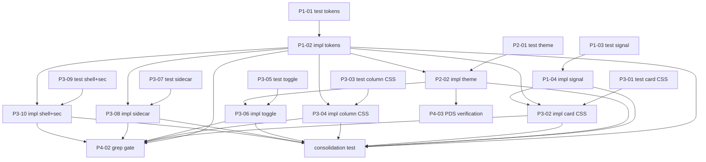

## Objective

Apply comprehensive PDS design token-based styling to the Cockpit board. Transform the visually invisible board into a finished product in both light and dark themes with operational-state card signaling.

## Brief

`.owlbear/briefs/draft-board-visual-design/brief.md`

## Key Deliverables

1. Token architecture: agnostic names + dark overrides + shadow/radius/spacing expansion
2. Theme system: bootstrap script + useTheme hook + status-bar toggle
3. Card signal model: left-border operational state (orange > red > purple > grey > white/black)
4. Per-component CSS: Card, Column, KanbanBoard, FilterPanel, DetailTab, ActivityTab
5. Shell.css token migration
6. Sidecar collapse toggle
7. Column fixed header + scrolling body
8. Context menu visual treatment
9. Empty state illustration prompts + text fallback
10. Migration verification grep gate

## Scope Boundaries

- Frontend CSS + token restructuring + card signal model data wiring
- JSX changes for visual quality + signal model (no new features beyond stated)
- DnD: keep, style minimally
- Out: grouping, search, decisions tab redesign, PDS component adoption, backend changes
2026-05-13T18:44:16+00:00
## Planning
### Decomposition: Board Visual Design
- Tasks created: 20
- Dependency layers: 5
- Phases: 1–5 (foundation → theme → components → verification → consolidation)

### Task List
| ID | Title | Priority | Depends On | Tags |
|----|-------|----------|------------|------|
| 1535 | P1-01: test — token architecture | critical | — | phase-1, scope:cockpit, css, test |
| 1543 | P1-02: impl — token architecture | critical | 1535 | phase-1, scope:cockpit, css |
| 1536 | P1-03: test — card signal data model | needed | — | phase-1, scope:cockpit, data, test |
| 1544 | P1-04: impl — card signal data model | needed | 1536 | phase-1, scope:cockpit, data |
| 1537 | P2-01: test — theme bootstrap + useTheme | needed | — | phase-2, scope:cockpit, theme, test |
| 1545 | P2-02: impl — theme bootstrap + useTheme | needed | 1537, 1543 | phase-2, scope:cockpit, theme |
| 1538 | P3-01: test — card component CSS | important | — | phase-3, scope:cockpit, css, test |
| 1546 | P3-02: impl — card component CSS | important | 1538, 1543, 1544 | phase-3, scope:cockpit, css |
| 1539 | P3-03: test — column component CSS | important | — | phase-3, scope:cockpit, css, test |
| 1547 | P3-04: impl — column component CSS | important | 1539, 1543 | phase-3, scope:cockpit, css |
| 1540 | P3-05: test — theme toggle UI | important | — | phase-3, scope:cockpit, theme, test |
| 1548 | P3-06: impl — theme toggle UI | important | 1540, 1545 | phase-3, scope:cockpit, theme |
| 1541 | P3-07: test — sidecar collapse | important | — | phase-3, scope:cockpit, css, test |
| 1549 | P3-08: impl — sidecar collapse | important | 1541, 1543 | phase-3, scope:cockpit, css |
| 1542 | P3-09: test — Shell + secondary CSS | important | — | phase-3, scope:cockpit, css, test |
| 1550 | P3-10: impl — Shell + secondary CSS | important | 1542, 1543 | phase-3, scope:cockpit, css |
| 1551 | P4-01: empty state prompts doc | nice-to-have | — | phase-4, docs, type:user-action |
| 1552 | P4-02: migration grep gate | important | 1543,1546–1550 | phase-4, scope:cockpit, test |
| 1553 | P4-03: PDS dark-mode verification | important | 1545 | phase-4, scope:cockpit, theme, test |
| 1554 | consolidation test: board visual design | important | 1543–1550 | phase-5, consolidation-test |

### Dependency Graph

2026-05-13T18:46:50+00:00
## Architecture Review\n\nParent task with completed planner decomposition. 20 subtasks created across 5 phases (foundation → theme → components → verification → consolidation). Decomposition quality verified:\n\n- TDD pairs correctly wired (test → impl dependency)\n- Dependency graph acyclic with proper layering\n- Consolidation test (#1554) covers all impl tasks\n- User-action task (#1551) tagged appropriately\n- Migration grep gate (#1552) gates on all impl completions\n\n### Verdict: APPROVE (decomposition-complete parent)\n### Action Taken: Advanced parent task; subtasks will receive individual architect reviews as they reach backlog.
2026-05-13T19:25:46+00:00
## Test-Writer Notes
- Non-impl pass-through: parent coordination task — no testable interfaces of its own.
- All implementation delegated to 20 subtasks across 5 phases; 8 dedicated test-subtasks (1535–1542) carry all TDD RED work for individual components.
- Brief scope is 100% frontend (CSS, TSX, HTML tokens) — no Python implementation intent found.
- Architecture review confirmed "decomposition-complete parent"; advancing to in-progress for builder (no builder action needed at parent level).
2026-05-13T20:00:44+00:00
## Builder Notes
- Scope assessment: Parent coordination task only; no direct implementation surface.
- Source of truth: Test-Writer Notes explicitly mark this as "Non-impl pass-through" with all implementation delegated to subtasks #1543–#1550.
- Files changed: none.
- Tests run: none (pass-through task; no task-level executable interface).
- Lint status: not run (no code changes).
- Evidence summary: task body confirms decomposition-complete parent with delegated TDD/implementation subtasks and no builder action required at parent level.
- Fixes applied: none.
- Result: pass-through advance to review for coordination closure.
2026-05-13T20:21:44+00:00
## Review Evidence
- Verdict: FAIL
- FAIL signal: FAIL #1534 -> in-progress | Parent coordination task reached review before delegated subtasks closed.

| # | AC Line | Finding | Evidence | Route |
|---|---------|---------|----------|-------|
| 1 | Objective; Key Deliverables 1-10 | The parent still owns delivery of the board visual redesign, but the delegated child graph is far from complete. A non-impl pass-through is valid for the parent code surface; it is not sufficient to prove completion of the parent feature. | Parent still states the product outcome and deliverables at `.owlbear/kanban/tasks/1534-board-visual-design-pds-token-architecture-card-signal-model-dark-theme-componen.md:22,30,39`, decomposes them into 20 child tasks at `:50`, and includes a phase-5 consolidation test at `:76`. The architecture note at `:113` approves decomposition only and says subtasks will receive individual architect reviews later. Test-writer/builder then record delegated work with no parent files/tests changed at `:117,122-125,129`. Current child-state audit (`list_tasks(parent=1534)`) shows 0/20 children done or archived; representative statuses are `1535` review (`.owlbear/kanban/tasks/1535-p1-01-test-token-architecture-agnostic-rename-expansion-dark-overrides.md:4`), `1543` research (`.owlbear/kanban/tasks/1543-p1-02-impl-token-architecture-agnostic-rename-expansion-dark-overrides.md:4`), and `1554` backlog (`.owlbear/kanban/tasks/1554-consolidation-test-board-visual-design.md:4`). | in-progress |

### Required Follow-up
| # | Target Agent | Action Required | File(s) | Evidence |
|---|-------------|----------------|---------|----------|
| 1 | builder | Keep the parent out of review until child tasks `#1535–#1554` are resolved and the parent note includes a child-status closure summary showing the delegated deliverables and consolidation gate are complete. | `.owlbear/kanban/tasks/1534-board-visual-design-pds-token-architecture-card-signal-model-dark-theme-componen.md` | Parent AC remains open at `:22-39`; decomposition-only architect note at `:113`; current child graph still open via `list_tasks(parent=1534)` and representative status files `1535:4`, `1543:4`, `1554:4`. |

## Observations
- No independent quality-runner run was warranted. The blocker is task-state/AC closure, not missing executable proof on a changed parent code surface.
- Archived precedent `.owlbear/kanban/archive/619-migrate-dispatcher-to-pick-tasks-mcp-tool-in.md:152,183` used the same reject-to-in-progress pattern for a parent coordination task whose subtasks were still open.
2026-05-13T20:49:10+00:00
## Builder Notes
- Scope assessment: Parent coordination task has no direct implementation surface; all product work is delegated to child tasks.
- Action taken: Added explicit dependencies on child tasks #1535-#1554 to encode the closure gate directly in task metadata.
- Child-state snapshot: 0/20 children are done or archived at execution time; implementation subtasks (#1543-#1550) remain in `research`, verification subtasks (#1552-#1553) remain in `research`, and consolidation (#1554) remains in `backlog`.
- Files changed: none.
- Tests run: none (no task-level executable interface; blocker is lifecycle state).
- Lint status: not run (no code changes).
- Evidence summary: Reviewer finding requires keeping parent out of review until delegated child graph closes; current board state does not satisfy that gate.
- Fixes applied: workflow/state fix only (dependency + blocked routing), no source changes.

### Required Follow-up
| # | Target Agent | Action Required | File(s) | Evidence |
|---|-------------|----------------|---------|----------|
| 1 | builder | Complete and advance implementation and verification child tasks #1543-#1554 (with their paired test tasks) through pipeline to done/archived status before retrying parent closure. | .owlbear/kanban/tasks/1534-board-visual-design-pds-token-architecture-card-signal-model-dark-theme-componen.md | `list_tasks(parent=1534)` shows open child graph and no done/archived children at time of routing. |
| 2 | builder | When child graph is complete, append a child-status closure summary to this parent task and then re-advance to review. | .owlbear/kanban/tasks/1534-board-visual-design-pds-token-architecture-card-signal-model-dark-theme-componen.md | Reviewer routing note in task body requires parent closure evidence before review progression. |