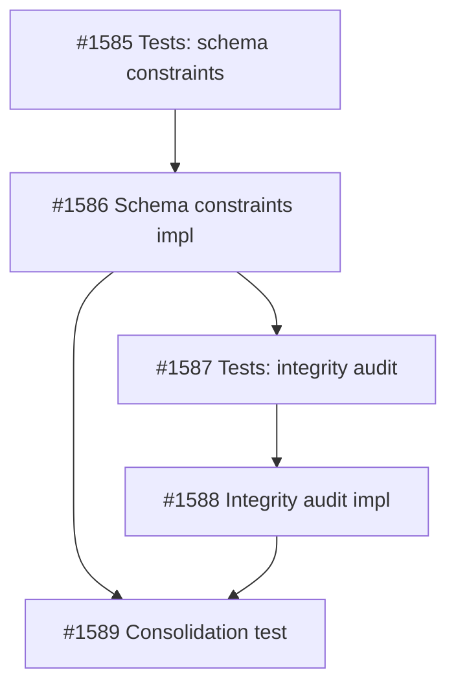

Context:
Knowledge module audit found that the SQLite schema does not currently prevent the orphan states being fixed in service code. `init_db(...)` explicitly sets `PRAGMA foreign_keys = OFF`, and several key provenance fields remain nullable or unenforced. Current and recent bugs can insert orphan documents, chunks, entities, edges, or stale vectors without the database rejecting them.

Intent:
Do not overload the core source/enrichment repair tasks. First establish the intended invariants after #1556 and #1557, then add a practical repair/check/enforcement layer.

Scope:
- In scope: define and verify database-level knowledge invariants for documents, chunks, entities, edges, sources, reviewed pairs, and vector payload linkage; add repair/audit tooling or schema constraints where practical; document any invariant intentionally enforced in service code instead of SQLite DDL.
- Out of scope: full corpus ingestion, source lifecycle UX, Cockpit UI, automatic enrichment, and changing the manual enrichment model.

Functional acceptance note:
Acceptance is based on persisted-state inspection and invariant checks. Passing or failing tests alone is not functional proof.

Acceptance Criteria:
AC-1: Define the required invariants for source-linked documents, chunks, phase-1 entities, phase-2 edges, and vector payload IDs after #1556/#1557 are complete.
AC-2: Provide an invariant audit/repair command or function that detects existing orphan rows and reports actionable counts/IDs without mutating data unless explicitly requested.
AC-3: Add SQLite constraints, indexes, triggers, or explicit write-path guards for invariants that can be enforced safely without blocking valid manual-enrichment workflows.
AC-4: If `PRAGMA foreign_keys` remains disabled, document why and prove equivalent enforcement for the affected relationships; otherwise enable it deliberately and prove core write paths still work.
AC-5: Proof must create at least one invalid/orphan scenario and show that the invariant layer detects or rejects it, then create valid source-linked/enriched data and show it passes.

Dependencies:
Wait for source/document/vector identity repair and manual enrichment persistence repair so this task hardens the final intended model, not today’s broken intermediate state.
2026-05-15T16:25:23+00:00
## Planning
### Decomposition: Harden knowledge database integrity invariants
- Tasks created: 5
- Dependency layers: 4
- Phase: 1

### Task List
| ID | Title | Priority | Depends On | Tags |
|----|-------|----------|------------|------|
| #1585 | P1-01: Tests — knowledge schema constraint enforcement | critical | — | phase-1, scope:knowledge, type:test, db-integrity |
| #1586 | P1-02: Knowledge schema constraint enforcement | critical | #1585 | phase-1, scope:knowledge, type:build, db-integrity, hardening |
| #1587 | P1-03: Tests — knowledge integrity audit function | needed | #1586 | phase-1, scope:knowledge, type:test, db-integrity |
| #1588 | P1-04: Knowledge integrity audit function | needed | #1587 | phase-1, scope:knowledge, type:build, db-integrity |
| #1589 | Consolidation test: knowledge DB integrity hardening | important | #1586, #1588 | consolidation-test, scope:knowledge, type:test, db-integrity |

### Dependency Graph

### Design Rationale
- **FK enablement before audit**: Schema constraints (#1586) must land first so the audit function (#1588) operates against the hardened schema. The audit function catches pre-existing violations and states that FK enforcement alone cannot detect (e.g., databases migrated from pre-v12).
- **NOT NULL scope**: Migration v12 targets `entities.document_id` and `edges.document_id` — provenance columns that must be populated after #1556/#1557. `documents.source_id` left nullable (ad-hoc documents without sources are legitimate).
- **Orphan injection in tests**: Audit and consolidation tests inject orphans via direct SQL with `PRAGMA foreign_keys = OFF` to simulate pre-migration data or edge-case corruption.
