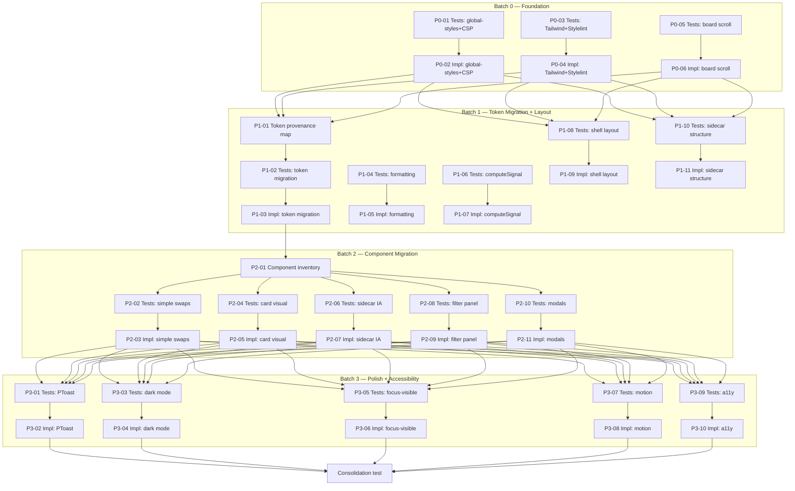

## Summary

Refactor the cockpit frontend from its current 10/100 visual state to a PDS v4-native application. Four sequential batches: Foundation → Token Migration + Layout → Component Migration → Polish.

## Brief

`.owlbear/briefs/draft-cockpit-visual-redesign/brief.md`

## Batches

- **Batch 0 — Foundation:** PDS global-styles import, CSP font-src relaxation, @tailwindcss/vite ^4 install, Stylelint config, board scroll fix
- **Batch 1 — Token Migration + Layout:** Token provenance map, atomic tokens.css deletion + migration, formatting utilities, computeSignal unknown state, shell layout, sidecar structure
- **Batch 2 — Component Migration:** Complexity inventory, simple swaps (preserving intentional native controls), card visual treatment, sidecar IA, filter panel, complex integrations (modals→PModal)
- **Batch 3 — Polish + Accessibility:** Success feedback (PToast), dark mode audit, focus-visible rings, motion/transitions, accessibility sweep

## Key Decisions

- D4: Follow PDS v4 docs strictly (user directive)
- D6: Relax CSP for Porsche CDN fonts
- D7: No inter-batch checkpoint; execute continuously

## Constraints

- @tailwindcss/vite only (no PostCSS)
- Token migration is atomic
- Accessibility is cross-cutting (every batch preserves it)
- No new product features
- Desktop-only (preserve existing mobile paths)
- PDS documentation governs

[[2026-05-16T05:38:34+02:00]]
## Planning
### Decomposition: Cockpit Visual Redesign — PDS v4 Foundation + Full Migration
- Tasks created: 39
- Dependency layers: 8 (B0-test → B0-impl → B1-research/test → B1-impl → B2-research → B2-test → B2-impl → B3-test → B3-impl → consolidation)
- Phases: 0 (Foundation), 1 (Token Migration + Layout), 2 (Component Migration), 3 (Polish + Accessibility)

### Task List
| ID | Title | Priority | Depends On | Tags |
|----|-------|----------|------------|------|
| 1591 | P0-01: Tests — PDS global-styles import + CSP font relaxation | critical | — | frontend, pds, phase-0 |
| 1594 | P0-02: PDS global-styles import + CSP font relaxation | critical | 1591 | frontend, pds, phase-0 |
| 1592 | P0-03: Tests — Tailwind v4 Vite plugin + Stylelint config | critical | — | frontend, pds, phase-0 |
| 1595 | P0-04: Install @tailwindcss/vite + configure Stylelint for Tailwind v4 | critical | 1592 | frontend, pds, phase-0 |
| 1593 | P0-05: Tests — board horizontal scroll | critical | — | frontend, pds, phase-0 |
| 1596 | P0-06: Board horizontal scroll fix | critical | 1593 | frontend, pds, phase-0 |
| 1597 | P1-01: Token provenance map | important | 1594,1595,1596 | frontend, pds, phase-1 |
| 1600 | P1-02: Tests — atomic token migration | important | 1597 | frontend, pds, phase-1 |
| 1603 | P1-03: Atomic token migration — delete tokens.css + migrate references | important | 1600 | frontend, pds, phase-1 |
| 1598 | P1-04: Tests — formatting utilities | important | — | frontend, pds, phase-1 |
| 1604 | P1-05: Formatting utilities | important | 1598 | frontend, pds, phase-1 |
| 1599 | P1-06: Tests — computeSignal unknown state | important | — | frontend, pds, phase-1 |
| 1605 | P1-07: Extend computeSignal with unknown state | important | 1599 | frontend, pds, phase-1 |
| 1601 | P1-08: Tests — shell layout | important | 1594,1595,1596 | frontend, pds, phase-1 |
| 1606 | P1-09: Shell layout — sticky header + responsive sidebar | important | 1601 | frontend, pds, phase-1 |
| 1602 | P1-10: Tests — sidecar structure | important | 1594,1595,1596 | frontend, pds, phase-1 |
| 1607 | P1-11: Sidecar structure — padding, sections, typography | important | 1602 | frontend, pds, phase-1 |
| 1608 | P2-01: Component complexity inventory | important | 1603 | frontend, pds, phase-2 |
| 1609 | P2-02: Tests — simple component swaps | important | 1608 | frontend, pds, phase-2 |
| 1614 | P2-03: Simple component swaps | important | 1609 | frontend, pds, phase-2 |
| 1610 | P2-04: Tests — card visual treatment | important | 1608 | frontend, pds, phase-2 |
| 1615 | P2-05: Card visual treatment | important | 1610 | frontend, pds, phase-2 |
| 1611 | P2-06: Tests — sidecar information architecture | important | 1608 | frontend, pds, phase-2 |
| 1616 | P2-07: Sidecar information architecture | important | 1611 | frontend, pds, phase-2 |
| 1612 | P2-08: Tests — filter panel PDS controls | important | 1608 | frontend, pds, phase-2 |
| 1617 | P2-09: Filter panel PDS controls | important | 1612 | frontend, pds, phase-2 |
| 1613 | P2-10: Tests — complex integrations (modals → PModal) | important | 1608 | frontend, pds, phase-2 |
| 1618 | P2-11: Complex integrations — modals → PModal | important | 1613 | frontend, pds, phase-2 |
| 1619 | P3-01: Tests — success feedback (PToast) | important | 1614,1615,1616,1617,1618 | frontend, pds, phase-3 |
| 1624 | P3-02: Success feedback — PToast notifications | important | 1619 | frontend, pds, phase-3 |
| 1620 | P3-03: Tests — dark mode audit | important | 1614,1615,1616,1617,1618 | frontend, pds, phase-3 |
| 1625 | P3-04: Dark mode audit — border contrast + token compliance | important | 1620 | frontend, pds, phase-3 |
| 1621 | P3-05: Tests — focus-visible rings | important | 1614,1615,1616,1617,1618 | frontend, pds, phase-3 |
| 1626 | P3-06: Focus-visible rings — PDS focus styling | important | 1621 | frontend, pds, phase-3 |
| 1622 | P3-07: Tests — motion/transitions | important | 1614,1615,1616,1617,1618 | frontend, pds, phase-3 |
| 1627 | P3-08: Motion/transitions — PDS duration + easing tokens | important | 1622 | frontend, pds, phase-3 |
| 1623 | P3-09: Tests — accessibility sweep | important | 1614,1615,1616,1617,1618 | frontend, pds, phase-3 |
| 1628 | P3-10: Accessibility sweep | important | 1623 | frontend, pds, phase-3 |
| 1629 | Consolidation test: cockpit visual redesign | important | all 18 impl tasks | frontend, pds, consolidation-test |

### Dependency Graph

### Notes
- P1-04/P1-05 (formatting) and P1-06/P1-07 (computeSignal) have NO Batch 0 dependency — pure JS, can start immediately
- Token migration (P1-03) has proof_bundle=critical due to atomic constraint C4
- Consolidation test (#1629) moved to backlog; all other tasks at entry status (research)
