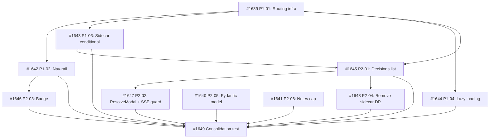

## Brief

Establish multi-tab navigation infrastructure for the Cockpit, using a decisions tab as pathfinder. The tab system is the primary deliverable — it enables planned Memory and Ideas Notebook tabs. The decisions tab provides a dedicated full-width workspace for pending DR resolution.

## Deliverables

### P1 — Tab Shell (purely additive, no regressions)

1. Route config array — declarative route entries
2. Nav-rail wiring — buttons with useNavigate(), role=\"navigation\"
3. React Router routes in Shell — active tab component rendering
4. Skeleton decisions page at /decisions
5. Route-conditional sidecar — suppress sidecar DOM on non-kanban routes
6. Lazy loading — React.lazy() with suspense boundary

### P2 — Decisions Content

1. Pending DR list — full-page single-column, generous spacing
2. Click → ResolveModal (existing component)
3. Modal snapshot on open — SSE guard, DR data copied to modal-local state
4. Pending count badge — nav-rail, visible only when count > 0
5. Remove DecisionViewport from sidecar
6. Pydantic response model on GET /api/decisions/pending
7. Notes length cap (max_length=10_000) on ResolveRequest
8. Empty state design

## Key Architecture

- React Router URL = source of truth
- Single ResolveModal at Shell level (shared between tab and status-bar entry)
- CockpitProvider unchanged — no new state fields
- Desktop-only design; existing breakpoints handled without regression
- Pending-only for V1; resolved DRs deferred

## Entry Paths

- Primary: nav-rail tab → list → click DR → modal
- Secondary: status-bar DRStatusIndicator → popover → click DR → modal (any route)

## Brief Location

`.owlbear/briefs/draft-cockpit-decisions-tab/brief.md`

[[2026-05-18T00:50:53+02:00]]
## Planning
### Decomposition: Cockpit Decisions Tab — multi-tab infrastructure + decisions workspace
- Tasks created: 11 (10 implementation + 1 consolidation)
- Dependency layers: 4
- Phases: P1 (tab shell, 4 tasks) + P2 (decisions content, 6 tasks) + consolidation

### Task List
| ID | Title | Priority | Depends On | Tags |
|----|-------|----------|------------|------|
| #1639 | P1-01: Tab routing infrastructure — route config + Routes rendering + skeleton page | critical | — | phase-1, scope:cockpit-web, frontend, infrastructure |
| #1642 | P1-02: Nav-rail tab navigation — dynamic buttons from route config | needed | #1639 | phase-1, scope:cockpit-web, frontend |
| #1643 | P1-03: Route-conditional sidecar — suppress sidecar DOM on non-kanban routes | needed | #1639 | phase-1, scope:cockpit-web, frontend |
| #1644 | P1-04: Lazy loading — React.lazy() with Suspense boundary | important | #1639 | phase-1, scope:cockpit-web, frontend |
| #1645 | P2-01: Decisions list page with empty state | needed | #1639, #1643 | phase-2, scope:cockpit-web, frontend |
| #1646 | P2-03: Pending count badge on nav-rail decisions button | important | #1642 | phase-2, scope:cockpit-web, frontend |
| #1647 | P2-02: ResolveModal integration + modal snapshot SSE guard | important | #1645 | phase-2, scope:cockpit-web, frontend |
| #1648 | P2-04: Remove DecisionViewport from sidecar | important | #1645 | phase-2, scope:cockpit-web, frontend |
| #1640 | P2-05: Pydantic response model for GET /api/decisions/pending | important | — | phase-2, scope:cockpit, backend |
| #1641 | P2-06: Notes length cap on ResolveRequest | important | — | phase-2, scope:cockpit, backend |
| #1649 | Consolidation test: Cockpit Decisions Tab multi-tab infrastructure | needed | all above | consolidation-test, scope:cockpit-web, scope:cockpit |

### Dependency Graph

### Key Design Decisions
- P2 backend (#1640, #1641) has no P1 dependencies — can proceed in parallel with P1 frontend
- Modal snapshot SSE guard bundled with ResolveModal integration (#1647) per brief constraint
- Sidecar removal (#1648) in P2, not P1, per brief constraint
- Parent #1638 depends on consolidation #1649 as completion gate
