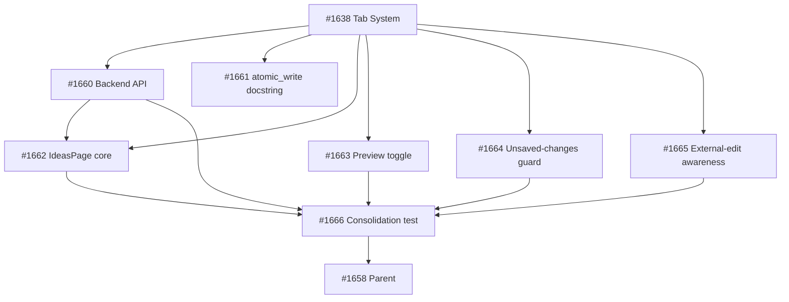

## Brief

Add an \"Ideas\" tab to the Cockpit — a freeform markdown scratchpad backed by `.owlbear/ideas.md`. Provides capture and re-reading of pre-task ideas without leaving the dashboard. Value is cockpit co-location alongside VS Code.

## Scope

**Backend:** GET/PUT `/api/ideas` endpoints, `atomic_write` import from kanban, create-on-first-write, `get_ideas_path` DI dependency.

**Frontend:** `IdeasPage` with textarea + preview toggle, explicit save, dirty-state indicator, unsaved-changes guard (route nav + beforeunload), default-to-edit mode.

**External-edit awareness:** Re-fetch on `visibilitychange` + route activation. Clean → silent update. Dirty → conflict notice with Overwrite / Discard & Reload buttons.

**Housekeeping:** Update `atomic_write` docstring to generic framing.

## Dependencies

- #1638 (Tab System) must land first

## Out of Scope

- Auto-save, multiple files, agent integration, CockpitProvider isolation (owned by #1638), file-watcher/real-time sync

## Source

Brief: `.owlbear/briefs/draft-cockpit-ideas/brief.md`
Decisions: `.owlbear/briefs/draft-cockpit-ideas/decisions.md`

[[2026-05-18T17:42:39+02:00]]
## Planning
### Decomposition: Cockpit Ideas Notebook
- Tasks created: 7 (6 implementation + 1 consolidation test)
- Dependency layers: 3
- Phase: 1–3

### Task List
| ID | Title | Priority | Depends On | Tags |
|----|-------|----------|------------|------|
| 1660 | P1-01: Backend Ideas API — GET/PUT /api/ideas with DI and atomic_write | needed | #1638 | phase-1, scope:cockpit, backend |
| 1661 | P1-02: atomic_write docstring — generic framing | important | #1638 | phase-1, scope:kanban, housekeeping |
| 1662 | P2-01: IdeasPage core — edit mode, API client, save, dirty state | critical | #1638, #1660 | phase-2, scope:cockpit-web, frontend |
| 1663 | P2-02: IdeasPage — markdown preview toggle | important | #1638 | phase-2, scope:cockpit-web, frontend |
| 1664 | P2-03: IdeasPage — unsaved-changes guard | important | #1638 | phase-2, scope:cockpit-web, frontend |
| 1665 | P2-04: IdeasPage — external-edit awareness and conflict resolution | important | #1638 | phase-2, scope:cockpit-web, frontend |
| 1666 | consolidation test: Ideas Notebook end-to-end | needed | #1660, #1662, #1663, #1664, #1665 | phase-3, scope:cockpit-web, consolidation-test |

### Dependency Graph

