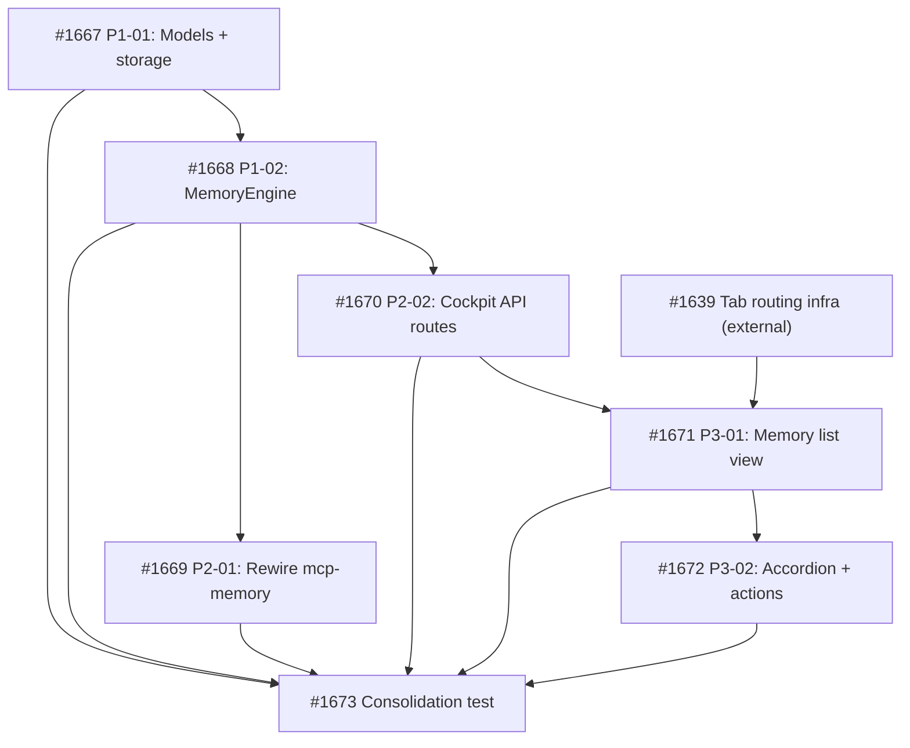

## Objective

Add a Memory tab to the cockpit providing full visibility and control over agent institutional memory. Includes engine extraction to a shared package, cockpit backend API, and React frontend component.

## Brief

See `.owlbear/briefs/draft-cockpit-memory-tab/brief.md` for the complete specification.

## Architecture Summary

1. Extract `serve/memory/` as shared engine package (MemoryEngine with mutation methods, models, state machine enforcement)
2. Rewire `serve/mcp-memory/` to depend on the new package (tools.py becomes thin adapter)
3. Add cockpit backend routes (`/api/memories`, approve/edit/delete mutations with OCC)
4. Add React frontend component (list + inline accordion detail + actions) — blocks on #1638

## Key Decisions

- D7: Extract engine first (prerequisite)
- D8: Split scope — backend now, frontend after #1638
- D9: No SSE in V1
- D10: Deleted entries excluded from default filter
- D11: No auto-commit
- D12: Lenient read, strict write

## Scope Split

- **Backend (independent):** Engine extraction + API routes
- **Frontend (blocks on #1638):** React component, filtering, accordion detail, actions

[[2026-05-18T17:44:43+02:00]]
## Planning
### Decomposition: Cockpit Memory Tab
- Tasks created: 7 (6 implementation + 1 consolidation)
- Dependency layers: 4
- Phases: P1 (engine extraction, 2 tasks) + P2 (rewire + API, 2 tasks) + P3 (frontend, 2 tasks) + consolidation

### Task List
| ID | Title | Priority | Depends On | Tags |
|----|-------|----------|------------|------|
| #1667 | P1-01: Memory engine package — models, errors, and storage primitives | critical | — | phase-1, scope:memory, backend |
| #1668 | P1-02: Memory engine — MemoryEngine with state machine, OCC, and caching | critical | #1667 | phase-1, scope:memory, backend |
| #1669 | P2-01: Rewire mcp-memory to import from owlbear-memory engine package | needed | #1668 | phase-2, scope:mcp-memory, backend |
| #1670 | P2-02: Cockpit backend API — memory routes with OCC | needed | #1668 | phase-2, scope:cockpit, backend |
| #1671 | P3-01: Memory list view with state/category/agent filters and text search | needed | #1670, #1639 | phase-3, scope:cockpit-web, frontend |
| #1672 | P3-02: Memory accordion detail and state-dependent actions | important | #1671 | phase-3, scope:cockpit-web, frontend |
| #1673 | Consolidation test: Cockpit Memory Tab | needed | #1667–#1672 | consolidation-test, scope:memory, scope:cockpit |

### Dependency Graph

### Key Sequencing Decisions
- P1 (engine extraction) ships first — prerequisite for all downstream work
- P2-01 (mcp-memory rewire) and P2-02 (cockpit API) are independent siblings, both depend only on P1-02
- P3 frontend tasks depend on both the cockpit API (#1670) and the external tab infrastructure (#1639 from #1638)
- Parent #1659 depends on consolidation #1673 as completion gate
