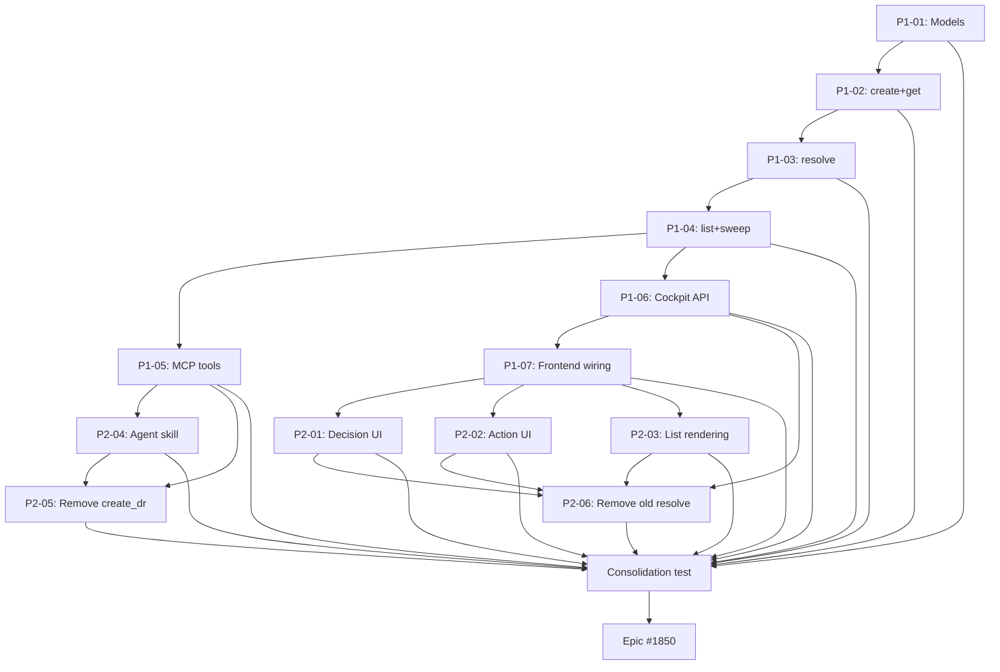

## Brief

Replace the unstructured markdown-body decision request system with a structured data model across four layers: storage (YAML frontmatter) → engine (Pydantic API) → MCP tools → Cockpit (adapted resolver UI).

Full Brief: `.owlbear/briefs/draft-decision-request-data-model/brief.md`

## Promise

A real choice system: option cards for decisions, Complete button for actions, free text always available, mechanical resolution flow-back to task body.

## Delivery Sequence

### Step 1: Foundation
- Pydantic models + engine API (create/resolve/list/get)
- Sweep updated for new schema
- MCP tools (create_request, list_requests, show_request)
- Cockpit API endpoints (GET pending, POST resolve)
- Existing resolve modal adapted to new endpoint

### Step 2: Experience
- Option cards for decisions, Complete button for actions
- Confidence bars, recommended badges
- Agent instruction updates (h-decision-requests skill)
- Remove old create_dr MCP tool and old resolve flow

## Key Design Decisions

- 2 kinds: decision (≥2 options) + action (no options)
- UUID4 filenames ({request_id}.md)
- Resolution = payload only (selected_option_id + free_text + resolved_at), NO status enum
- resolved_at machine-set, not in pending files
- Single engine writer, Pydantic extra=\"forbid\"
- Sweep triggers: pick_tasks + Cockpit cleanup
- Conditional unblock (sibling check)

[[2026-05-24T21:00:47+02:00]]
## Planning
### Decomposition: Structured decision/action request data model
- Tasks created: 14 (13 implementation + 1 consolidation)
- Dependency layers: 8
- Phases: 2 (Foundation + Experience)

### Task List
| ID | Title | Priority | Depends On | Tags |
|----|-------|----------|------------|------|
| 1851 | P1-01: Pydantic models for structured decision requests | needed | — | phase-1, scope:kanban, model |
| 1852 | P1-02: Engine API — create_request and get_request | needed | 1851 | phase-1, scope:kanban, api |
| 1853 | P1-03: Engine API — resolve_request with conditional unblock | needed | 1852 | phase-1, scope:kanban, api |
| 1854 | P1-04: Engine API — list_requests and sweep | needed | 1853 | phase-1, scope:kanban, api |
| 1855 | P1-05: MCP tools — create_request, list_requests, show_request | needed | 1854 | phase-1, scope:mcp-kanban, mcp |
| 1856 | P1-06: Cockpit API — GET /api/requests/pending and POST resolve | needed | 1854 | phase-1, scope:cockpit, api |
| 1857 | P1-07: Cockpit frontend — minimal resolver wiring to new API | critical | 1856 | phase-1, scope:cockpit-web, frontend |
| 1858 | P2-01: Decision resolver UI with option cards | needed | 1857 | phase-2, scope:cockpit-web, frontend |
| 1859 | P2-02: Action resolver UI with Complete button | needed | 1857 | phase-2, scope:cockpit-web, frontend |
| 1860 | P2-03: Request list rendering from structured fields | needed | 1857 | phase-2, scope:cockpit-web, frontend |
| 1861 | P2-04: Agent instruction updates — h-decision-requests skill | needed | 1855 | phase-2, scope:docs, docs |
| 1862 | P2-05: Remove old create_dr MCP tool and engine function | important | 1855, 1861 | phase-2, scope:mcp-kanban, cleanup |
| 1863 | P2-06: Remove old Cockpit resolve flow and legacy endpoints | important | 1856, 1858, 1859, 1860 | phase-2, scope:cockpit, cleanup |
| 1864 | consolidation test: structured decision requests | needed | 1851–1863 | consolidation-test |

### Dependency Graph

