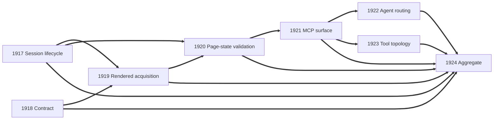
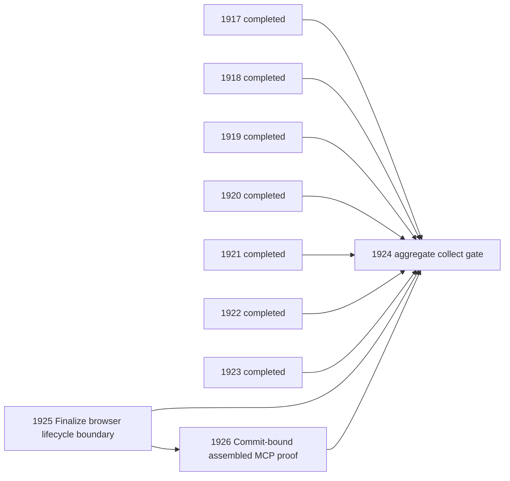

Planning source: `openspec/changes/complete-browser-content-acquisition/`

Aggregate intent: deliver reliable structured single-page browser acquisition through the reusable Python API and thin MCP surface, with session-assisted authentication and complete DDGS retirement.

This parent is a collect gate only. It owns no direct implementation and remains blocked by the seven build leaves.

Preserved remainder: linked-page approval, source registration, refresh, and knowledge ingestion require the separately confirmed next OpenSpec proposal. That work is not builder discretion and is not part of this aggregate's completion claim.

## Shape Notes

### Planning Readiness
- Product outcome and invocation: Proposal Normal Workflow and `browser-content-acquisition` spec define an agent invocation with a known HTTP(S) URL and structured Markdown-first result.
- Existing-system fit and authority: `serve/browser` owns reusable acquisition behavior; `serve/mcp-browser` owns the FastMCP adapter; package imports permit `owlbear_mcp_browser` to depend on `owlbear_browser`; knowledge packages remain read-only.
- Normal-path proof: real MCP client through running browser MCP and real Playwright against deterministic delayed-render and persistent-session pages; fixture hosting may replace the remote site, but FastMCP registration, lifespan, Playwright, and the acquisition API may not be bypassed.
- Completion and change contract: DDGS is removed; built-in web access, MarkItDown, and interactive browser operations are retained; crawling and knowledge ingestion remain outside this change under the active user sequencing decision.
- Readiness verdict: sufficient for build decomposition; strict OpenSpec validation passed on 2026-07-13 with zero issues.

### Artifact Authorities
- Proposal owns product intent, boundaries, accepted DDGS search loss, and the required separate knowledge-integration continuation.
- Capability specs own normative browser acquisition and web-content routing behavior.
- Design owns source-grounded architecture and proof boundaries, subject to current source.
- OpenSpec `tasks.md` is advisory and was merged by outcome and repository domain.

### Contract Authorities
| Claim | Authority | Evidence State | Confidence |
|---|---|---|---|
| Current browser fetch captures immediately after `domcontentloaded` and returns `str` | `serve/browser/src/owlbear_browser/fetcher.py` | observed | high |
| Current launcher requires Microsoft SSO extension discovery before launch | `serve/browser/src/owlbear_browser/playwright_launcher.py` | observed | high |
| Python extraction uses trafilatura with local lxml Markdown fallback | `serve/browser/src/owlbear_browser/extractor.py` and `cleaner.py` | observed | high |
| Browser MCP currently owns interactive tools, static allowlist, private-address rejection, and startup degradation | `serve/mcp-browser/src/owlbear_mcp_browser/server.py` and `allowlist.py` | observed | high |
| MCP-browser may import browser core but not another MCP server | `tests/test_package_boundary.py` and package manifests | observed | high |
| Playwright Chromium plus Microsoft SSO extension and persistent profile acquired SharePoint, Jira, and Confluence on managed Windows | `.owlbear/research/cdp-spike-results.md` | observed assembled evidence | high |
| Microsoft corporate SSO on the future managed Mac | future managed-macOS environment | assumed | low; explicitly non-blocking |
| DDGS remains in dependency, MCP, setup, agent, and research surfaces | root metadata/config plus targeted repository search on 2026-07-13 | observed | high |

### Scope Decision
- Run `/shape`, not `/opsx:apply`: repository policy makes OpenSpec the planning authority and Kanban the execution authority. Direct apply would bypass task complexity, domain ownership, dependency routing, and pipeline verification.
- The seven build leaves replace fifteen advisory implementation/proof checkboxes. Contract/pure helper work was merged; rendered navigation and extraction were kept together; authentication/final-page validation was split because its security failure mode and headed proof differ; proof-only closure work moved to this collect gate.
- Seven leaves exceed the preferred six because browser lifecycle, rendered readiness, and authentication/final-page validation require distinct failure-domain proofs, while MCP, distribution, and agent configuration are separate architecture domains.
- The larger linked-page approval and knowledge-ingestion promise is not silently dropped: Proposal records the user's active decision that it requires a separate next OpenSpec change. No current builder task may invent that integration.

### Change Module Map
| Module | Current Responsibility | Planned Change | Interface Impact | Owning Task |
|---|---|---|---|---|
| `serve/browser` public types, exports, extractor helpers | String extraction and package exports | Add shared typed request/result and pure content contract | changed public API | #1918 |
| `serve/browser/playwright_launcher.py` and session ownership | Windows-oriented persistent launch requiring SSO extension | Make session startup capability-based and preserve optional Windows SSO | changed launcher/lifecycle API | #1917 |
| `serve/browser/fetcher.py`, extractor, cleaner | Immediate one-page capture and Markdown extraction | Add stable rendered acquisition, selectors, redirects, download rejection, provenance, and inert links | changed acquisition API | #1919 |
| `serve/browser` page-state validation and errors | Declared authentication exception without operational detection | Add authentication/final-page classification and manual retry handoff | changed result semantics | #1920 |
| `serve/mcp-browser` | Interactive FastMCP tools and lifespan | Add thin structured acquisition operation and honest unavailable behavior | new MCP operation; existing operations retained | #1921 |
| Root dependency/config, seed config, `setup/` | DDGS registration and five-server setup | Replace DDGS registration with browser MCP and update installation/setup | changed distribution topology | #1923 |
| `share/agents`, `share/skills`, `share/instructions` | DDGS grants and recommendations | Route known content among web, browser acquisition, and MarkItDown | changed agent tool/guidance contract | #1922 |
| `serve/knowledge` and `serve/mcp-knowledge` | Source lifecycle plus intentionally unwired browser transport | Read-only scope guard | none | #1924 |

### Product Invariant Map
| Product Invariant | Owning Task | Normal-Path Boundary | Proof / Allowed Replacement |
|---|---|---|---|
| Shared callers receive one structured Markdown-first contract without secret leakage | #1918 | public browser API models/helpers | focused contract proof; serializers may be replaced |
| Persistent sessions work without optional corporate SSO and report host capability | #1917 | real Playwright persistent context lifecycle | local protected fixture may replace corporate site |
| Delayed rendered pages return stable content, provenance, and inert links | #1919 | public core API through real Playwright | local fixture may replace remote page |
| Authentication and invalid final pages never become content success | #1920 | persistent context through public acquisition API | deterministic auth/denial fixtures may replace enterprise identity pages |
| Agents can invoke acquisition through the assembled MCP runtime | #1921 | real MCP client, FastMCP lifespan, core API, and Playwright | local page host may be replaced |
| Fresh installation/configuration contains browser MCP and no DDGS | #1923 | dependency resolution plus setup-generated MCP inventory | temporary target workspace may replace user workspace |
| Active agents select web, browser acquisition, or MarkItDown and cannot select DDGS | #1922 | loaded distributed customization artifacts | artifact inspection and structural validator |

### Decomposition: Complete Browser Content Acquisition
- Tasks created: 8 total; 7 build leaves and 1 collect aggregate.
- Dependency layers: 6 including aggregate collection.
- Phase: phase-1 for this standalone OpenSpec change.

### Task List
| ID | Title | Priority | Depends On | Status |
|---|---|---|---|---|
| 1918 | Define the browser acquisition contract | high | none | build |
| 1917 | Make persistent browser sessions capability-based | high | none | build |
| 1919 | Acquire stable rendered page content | medium | 1917, 1918 | build |
| 1920 | Reject authentication and invalid final-page states | medium | 1917, 1919 | build |
| 1921 | Expose browser acquisition through MCP | high | 1920 | build |
| 1923 | Replace DDGS in workspace tool topology | low | 1921 | build |
| 1922 | Route agents away from DDGS | low | 1921 | build |
| 1924 | Complete browser content acquisition | high | 1917 through 1923 | collect |

### Dependency Graph

### Architecture Notes
- `serve/browser` is the deep module. Deleting it would force session, readiness, validation, extraction, and provenance policy into each caller; the reusable API therefore passes the Deletion Test.
- `serve/mcp-browser` remains a transport adapter with real variation: agents use MCP while the future knowledge integration uses the in-process API. It must not duplicate acquisition policy.
- The current allowlist/private-address policy remains attached to existing interactive tools; acquisition uses the narrower explicit-user-URL, one-page, no-script, no-crawl contract.
- No external research cycle is required: current source plus the existing managed-Windows spike resolve the architecture; managed-macOS Microsoft SSO remains an explicit non-blocking open fact.

### Challenger Result
- Pending concrete-board review.

### Challenger Result (Final)
- Decision: pass; approval upheld with no readiness, authority, invariant, proof-boundary, AC, dependency, or Product Promise defect.
- Review basis: challenger read the complete current OpenSpec package and evaluated the supplied concrete graph; the shaper separately audited task IDs #1917 through #1924 through Kanban after creation.
- Non-blocking ownership check resolved: #1917 exclusively owns environment capability reporting; #1918 owns acquisition request/result and pure content contract types, so no parallel capability-report model is planned.
- This final result supersedes the earlier pending marker.

[[2026-07-13T06:08:03+02:00]]
## Collect Notes

Classification: aggregate EPIC.

Intent source: the parent aggregate intent plus `## Shape Notes`, especially the Artifact Authorities, Scope Decision, Change Module Map, Product Invariant Map, Task List, and Dependency Graph. The promised outcome is structured single-page acquisition through the reusable browser API and thin MCP surface, persistent-session authentication handling, complete DDGS retirement, and preservation of separate interactive browser, built-in web, and MarkItDown ownership. Linked-page approval and knowledge ingestion are explicitly preserved for a separate confirmed OpenSpec change and are not residual scope here.

Invariant map coverage: #1918 covers the structured non-sensitive contract; #1917 persistent capability-based sessions; #1919 stable rendered acquisition and provenance; #1920 authentication and invalid terminal states; #1921 assembled MCP invocation; #1923 dependency/setup topology and DDGS removal; #1922 active agent routing and DDGS removal.

Child coverage: the direct parent query returned no active children because all seven are archived, while direct lookup of dependencies #1917 through #1923 confirms each has `parent: 1924`, `status: archived`, and `archival_reason: completed`. Their final `## Verify Notes` record PASS and verifier-challenger pass. Final evidence includes real Chromium persistent-profile proof (#1917), public contract proof (#1918), real Chromium delayed-render/redirect/subresource proof (#1919), real Playwright authentication and invalid-state proof (#1920), real stdio MCP client through FastMCP lifespan and Playwright (#1921), agent-routing validation (#1922), and dependency/config/setup validation (#1923).

Dependency gate: parent `depends_on` is exactly #1917 through #1923 and `dep_status: ok`.

Tested commit and aggregate proof: not satisfied. Current `HEAD` is `89eb9059f8139e5d1ada18d5c829a4153d69856d`, but task-owned files `serve/browser/src/owlbear_browser/contract.py`, `serve/browser/src/owlbear_browser/fetcher.py`, `serve/browser/src/owlbear_browser/playwright_launcher.py`, and `serve/browser/tests/test_acquisition.py` have uncommitted modifications. Therefore `HEAD` does not identify the assembled implementation represented by the archived child evidence, and the existing real MCP/Playwright probe is not tied to a commit containing the current browser-core state. A SHA string from individual leaves is insufficient for the aggregate normal-path AC.

Residual decisions: no pending request exists for #1924. The separate linked-page/knowledge-ingestion continuation is an explicit scope decision, not an unresolved decision.

Archive rationale: REJECT. Child completion and invariant coverage are present, but the mandatory SHA-linked aggregate normal-path proof is missing and cannot be established while task-owned implementation remains outside a commit.

### Required Follow-up
| # | Target Agent | Action Required | File(s) | Evidence |
|---|-------------|----------------|---------|----------|
| 1 | shaper via `/shape` | Restore a build/verify path that commits the final browser-core implementation and produces a real MCP-client through FastMCP, Playwright, and public acquisition proof tied to that commit SHA or a later descendant; then return the aggregate to collect. | `serve/browser/src/owlbear_browser/contract.py`, `serve/browser/src/owlbear_browser/fetcher.py`, `serve/browser/src/owlbear_browser/playwright_launcher.py`, `serve/browser/tests/test_acquisition.py`, plus the existing MCP proof surface | `git rev-parse HEAD` returned `89eb9059f8139e5d1ada18d5c829a4153d69856d`; `git status --short` showed all four task-owned files modified, so no tested commit represents the assembled state. |

[[2026-07-13T16:35:12+02:00]]
## Shape Notes

### Refinement Source and Readiness
- Re-entry cause: collector rejected aggregate closure because task-owned browser-core files were uncommitted at tested `HEAD` `89eb9059f8139e5d1ada18d5c829a4153d69856d`; no real MCP/Playwright proof was tied to a commit containing the final browser state.
- Planning source: native OpenSpec change `openspec/changes/complete-browser-content-acquisition/`, schema `spec-driven`. `openspec status` resolved Proposal, Design, two Specs, and advisory Tasks; `openspec validate complete-browser-content-acquisition --strict` passed.
- Product outcome and invocation remain unchanged: a known HTTP(S) URL is acquired through the agent-callable MCP operation and reusable Python API as structured meaningful Markdown with provenance, inert links, session-assisted authentication, and explicit non-success states.
- Completion/change contract remains unchanged: DDGS is retired; built-in public web access, MarkItDown, and interactive browser operations retain their owned roles; crawling, approval, registration, refresh, and knowledge ingestion remain the Proposal's explicit preserved remainder for a separate change.

### Source and Contract Findings
- Current source confirms `serve/browser` owns request/result semantics and acquisition behavior; `serve/mcp-browser` owns FastMCP composition.
- The uncommitted final delta in `contract.py`, `fetcher.py`, `playwright_launcher.py`, and `test_acquisition.py` includes bounded authentication retry and ambiguous-page rejection but is not represented by the prior tested commit.
- `PlaywrightLauncher.context` currently exposes raw `BrowserContext`, contradicting the final #1917 verified boundary because callers can reach cookie and storage-state APIs.
- MCP `acquire` currently calls the interactive `DomainAllowlist`, contradicting Proposal and spec authorization for an explicitly supplied syntactically valid private/intranet HTTP(S) URL. Interactive operations retain their existing allowlist and SSRF policy.
- No deep external research was needed: current source, complete OpenSpec authorities, and archived leaf evidence resolved ownership and proof requirements.

### Corrective Change Module Map
| Module | Current Responsibility | Planned Change | Interface Impact | Owning Task |
|---|---|---|---|---|
| `serve/browser` contract, fetcher, launcher | Shared result semantics, acquisition, persistent lifecycle | Reconcile uncommitted final behavior and replace raw-context exposure with launcher-owned acquisition composition | public API corrected | #1925 |
| `serve/mcp-browser` server | FastMCP lifespan, tool registration, serialization | Compose through corrected browser API, remove acquisition-only allowlist contradiction, preserve interactive policy | acquisition operation corrected | #1926 |
| dependency/setup and agent guidance surfaces | DDGS removal and routing | Read-only; already completed | none | #1923 and #1922 |
| knowledge packages | Future source lifecycle/ingestion consumer | Read-only explicit preserved remainder | none | #1924 |

### Corrective Product Invariant Map
| Product Invariant | Owning Task | Normal-Path Boundary | Proof / Allowed Replacement |
|---|---|---|---|
| Final reusable acquisition and persistent-session behavior is committed without exposing raw session-secret APIs | #1925 | public browser acquisition and launcher API through real Playwright | local page host may replace remote site |
| Explicit private/intranet HTTP(S) acquisition works through the registered agent operation while interactive policy remains unchanged | #1926 | real stdio MCP client through FastMCP lifespan and public browser acquisition | local page host may replace remote site |
| Aggregate delayed-render and session-reuse proof identifies a commit containing final browser and MCP state | #1926 | real stdio MCP client through FastMCP and Playwright | no replacement of MCP registration, lifespan, public acquisition, or Playwright |
| DDGS stays absent and supported web/document/interactive ownership remains intact | #1923 and #1922 | clean install/setup plus distributed customization inspection | temporary initialized workspace may replace user workspace |
| Linked-page approval and knowledge ingestion remain owned future work | #1924 | Proposal scope and changed-path inspection | no implementation permitted in this change |

### Corrective Decomposition
- Created #1925 `P1-09: Finalize browser acquisition lifecycle boundary` in `build`, parent #1924, no dependencies.
- Created #1926 `P1-10: Prove assembled browser acquisition at a committed revision` in `build`, parent #1924, depends on #1925.
- Parent #1924 now depends on archived-completed #1917 through #1923 plus active #1925 and #1926. It owns no direct implementation and returns to `collect` behind those dependencies.
- The split follows repository ownership and proof mode: browser-core lifecycle/public API first; MCP authorization/composition and commit-bound assembled proof second.

### AC and Product Promise Check
- #1925 has two behavior AC covering the final public acquisition behavior and the non-exposing launcher composition boundary.
- #1926 has two behavior AC covering private/intranet acquisition without changing interactive policy and real stdio MCP-to-Playwright evidence tied to the task commit SHA.
- Parent AC-1 through AC-3 remain aggregate criteria and are fulfilled transitively by completed leaves plus #1925/#1926; collector must cite those leaf proofs rather than re-derive an untethered aggregate claim.
- The concrete graph covers the full active Proposal. The only omitted end-state outcomes are linked-page approval, source registration, refresh, and knowledge ingestion, which Proposal explicitly records as a user-approved separate change.

### Challenger Result
- Decision: pass.
- Challenger independently confirmed the raw-context and acquisition-allowlist source contradictions, dependency order, statuses, acceptance criteria, invariant ownership, normal-path proof boundary, DDGS ownership, and complete Product Promise coverage.
- Collection guard: archive only after #1925 and #1926 complete, and tie aggregate proof to #1926's recorded tested commit rather than the rejected `89eb9059` state.

### Shaper Evidence
- Board audit confirmed #1925 and #1926 are `build` leaves with parent #1924; #1926 depends on #1925; parent dependencies include #1917 through #1923, #1925, and #1926.
- Shaper-owned board artifacts committed as `f01d49858acd7fa19c7130d4bc7a9cb7b2ba1c28`.
- Saved reusable memory candidate `8853908d-b4c0-4509-9166-537d6375fc78` about matching aggregate proof to committed final state.
