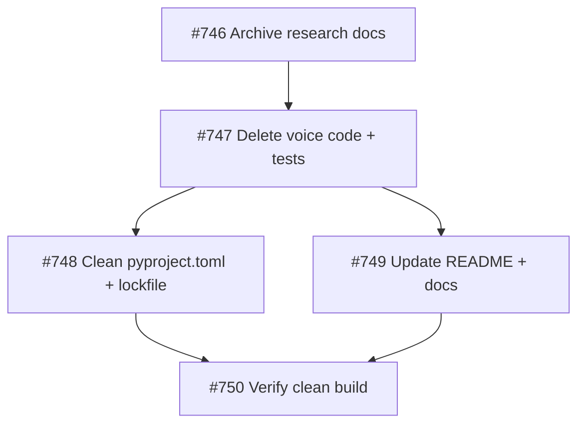

## Investment Tier: Scratch

## Problem
OwlBear v2 carries a voice I/O subsystem (STT, TTS, subprocess protocol, VoiceChannel, VoiceProcessManager) that was designed as a bidirectional voice channel but will never be completed. Voice dictation has been determined to be a separate product concern, not an OwlBear feature. The code is dead weight.

## Outcomes
1. All voice I/O code, dependencies, and documentation references removed from OwlBear
2. Tests referencing voice I/O code removed or updated — test suite passes clean
3. README and docs updated to remove voice I/O references

## CRITICAL: "Voice" Disambiguation
- **Voice I/O** (STT, TTS, VoiceChannel, subprocess) — REMOVE THIS
- **Ideation domain voices** (architect-voice, critic-voice, etc.) — DO NOT TOUCH

Deletion scope: `serve/voice/`, `serve/orchestrator/src/owlbear/voice/`, `tests/test_voice_*.py`, voice deps in pyproject.toml/uv.lock, voice refs in README.md. Never touch `share/agents/`, `share/skills/`, `share/instructions/`.

## Approach
Surgical removal. Archive voice research docs (may be useful to the new dictation project) before deleting. Check imports before deleting to avoid breaking non-voice modules.

## Brief Reference
`.owlbear/briefs/draft-voice-rethink/brief.md`
Handoff for new project: `.owlbear/briefs/draft-voice-rethink/handoff-dictation-project.md`
[[2026-04-10]]
## Planning
### Decomposition: Remove voice I/O infrastructure from OwlBear
- Tasks created: 5
- Dependency layers: 3
- Phase: 1
- TDD note: Pure deletion work — no new behavior to test. P1-05 (verification) serves as exit gate.

### Task List
| ID | Title | Priority | Depends On | Tags |
|----|-------|----------|------------|------|
| #746 | P1-01: Archive voice I/O research docs to handoff location | needed | — | phase-1, type:archive, cleanup, scope-reduction |
| #747 | P1-02: Delete all voice I/O code and test files | critical | #746 (implicit*) | phase-1, type:cleanup, cleanup, scope-reduction |
| #748 | P1-03: Remove voice from workspace pyproject.toml and regenerate lockfile | needed | #747 | phase-1, type:cleanup, cleanup, scope-reduction, scope:infra |
| #749 | P1-04: Remove voice I/O references from README and docs | important | #747 | phase-1, type:docs, cleanup, scope-reduction |
| #750 | P1-05: Verify clean build after voice I/O removal | critical | #748, #749 | phase-1, type:verification, cleanup, scope-reduction |

*NOTE: #747 depends on #746 (archive before delete) but `edit_task` tool was unavailable to add this dependency retroactively. Dispatchers must enforce ordering: #746 before #747.

### Dependency Graph

### Execution Notes
- Voice I/O is fully self-contained: no non-voice orchestrator modules import from `owlbear.voice` or `owlbear_voice`
- 11 research docs to archive (9 voice-*.md + 2 moonshine-*.md)
- `serve/voice/` is a uv workspace member via `serve/*` glob — deleting the directory is sufficient; lockfile regen handles the rest
- CRITICAL guardrail propagated to all subtasks: never touch `share/agents/`, `share/skills/`, `share/instructions/`
