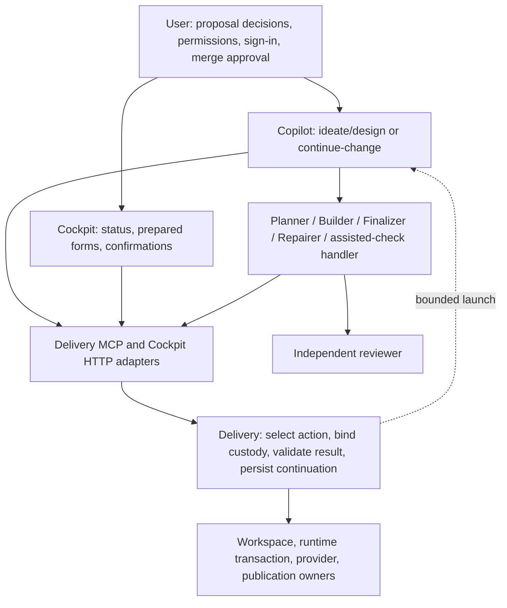

# Change-Scoped Continuation and Recoverable Delivery

> **Owning request:** User-authorized direct implementation of the Delivery redesign on `dev`.
> **Updated:** 2026-09-13
> **Source baseline:** `8198cdff9d373bb903ee136fc89884a5ecbc7426` on `dev`, plus the explicitly identified untracked research/packages below.
> **Question:** Can one Change-scoped continuation session carry approved intent through implementation, recovery, verification, publication, and accepted completion without requiring the user to run tests, edit worktrees, or operate Delivery internals?
> **Status:** Active direct-development plan. Section 0 owns execution and status; sections 1-11 and 13-14 retain product requirements, design evidence and acceptance. Proposed product APIs are not claims that those APIs have shipped.

**Execution status:** Reviewed P01, P02, P02-W and P03 implementation from Change head `7580a8caacbd6f849081adf9f61bf28165b4851c` is merged into `dev` at `364daf61c`. D01 is complete at independently reviewed candidate `dcee688c654b1627cd9f8bbca5c241d02733447f`, including the readiness UI and assembled gates. D02 is next; P05 offline diagnosis is not implemented. The [P00/P01 record](delivery-action-readiness-p00.md) is historical evidence, not an active launch instruction.

**Reading route:** Start with section 0 for the next direct work package. Sections 1-11 explain the product and technical contracts; section 12 retains the original WP/P identifiers for traceability only; section 13 supplies proof scenarios. Do not invoke Delivery to execute this programme.

## 0. Direct Implementation Decision

The user explicitly authorized consolidation into `dev`, removal of unnecessary bootstrap work,
and direct implementation. This changes how the redesign is built, not its promised behavior.
No admission, task plan, claim acquisition, result submission, per-packet worktree, host model
attestation, or automatic Delivery transition is a prerequisite for programme development.
This section replaces all earlier wave-launch and native-execution instructions, including those
in historical Design packages and the P00 handoff. Product runtime claims/receipts remain required
features where the design specifies them; they are tested with disposable data, not used to govern
their own implementation.

### Consolidation and Boundaries

- Retain selected acquisition, the direct-tool workaround, readiness/report storage, registered MCP
  contracts, restricted inspection/finalizer wiring, HTTP adapters and their tests. They provide
  product behavior, not just programme administration.
- Merge the complete reviewed readiness branch, preserving its commit history and package snapshot.
  Reconcile the four overlapping primary-checkout edits; do not overwrite them with an older copy.
- Remove the unused controller-switch bootstrap, its dedicated tests, ignore rule and setup guide
  section. Its old commits remain recoverable. Do not build a release manager to unblock this work.
- Preserve D1, B1, B5, offline-diagnostics drafts, private state, memory candidates and unrelated issue
  worktrees. Existing readiness records are a historical snapshot; do not manufacture completion,
  abandon records, or edit their JSON to match the new process.
- Keep the merged readiness worktree/branch as a recovery reference for now. No further writer is
  assigned there. Physical deletion is not worth making retained coordination point at missing files.
- P00 is closed as preparation. Completed code is not reimplemented. WP1 as a user-facing feature is
  not complete until its UI and assembled checks pass.

Consolidation verification: **739 tests passed** across Delivery core/report storage/workspaces,
MCP adapters and registration, Cockpit HTTP, package boundaries, agent ecosystem and normal setup.
The product files match reviewed readiness head `7580a8caa`; the only merge conflict was the tool
inventory, resolved by retaining both finalization context and report operations. This is a scoped
regression result, not full V01-V24 acceptance or live activation. The previously documented
checkpoint replay test remains D01 work and was not included in this scope. Document links/fences,
D00-D08 uniqueness and retained V01-V24 rows were checked; no Markdownlint pass is claimed.

### Development and Review

Use one primary coding session and one writer on `dev`. Work in small domain-local commits; a work
package may contain sequential core, adapter, UI and documentation substeps without becoming several
Delivery Changes. Read-only reviewers can run independently. Do not run parallel source writers on
this shared checkout. Update this section at package closeout with commits, tests and the next step.

Keep the selected model preferences: T3 Astra for consequential contracts, T2 Opus for bounded
implementation, T1 Luna only for settled low-risk presentation. Different-family independent review
is required for implementation commits. Use an ordinary read-only code-review invocation, not a
native build-reviewer receipt that requires a Delivery claim. Model selection guides staffing; it
must not create a new routing engine or require proof of hidden serving weights.

The agent owns dependency setup, focused tests, scoped commits, independent review and handoff.
Existing approved product meaning stands; ask only for a genuinely new product, destructive-action,
privacy or permission decision. A local coding defect is fixed locally, not returned through a graph.
No blanket test exclusions or acceptance waivers are introduced by direct development.

The user authorized sequential delegated D01-D08 implementation on 2026-09-13. Dispatch one writer
at a time with the selected tier/model: Astra for critical contracts, Opus for bounded implementation,
Luna for settled low-risk work. Complete each package's proof and independent review before the next.
Do not silently substitute expensive lead-model implementation if model dispatch is unavailable.
Stop before live activation and report readiness; no automatic live cutover is authorized.

### Live State Safety

Delivery MCP and Cockpit launched from this checkout are stopped. The local Delivery entry in
[MCP configuration](../../.vscode/mcp.json) is intentionally removed; the other servers and seed
configuration are unchanged. Do not restore it or launch Cockpit against live state as an inner-loop
check. Run the actual server/UI against temporary fixture repositories and isolated ports.

Before live activation, the agent checks for active work and pending effects, preserves current
configuration/state, rehearses any schema transition on a copy, and verifies the tested revision
can start and perform a read against that copy. Restore the standard MCP entry only at the explicit
activation checkpoint. Never restore old state over new evidence to make a rollback start. If live
operation is needed during development, arrange a separate known-good checkout without introducing
another scheduler or controller-switch framework. The user performs no manual tests or Git repair.

### Recut Work Packages

These nine packages replace the seventeen-wave launch sequence. D01-D08 run serially; numbers are
checklist labels, not runtime tasks. The old P identifiers remain only to show requirement coverage.

| Package | Result | Prior scope | Tier / dependency |
| --- | --- | --- | --- |
| D00 | Consolidate reviewed work into `dev`, remove unused bootstrap and retire self-hosted execution | P00 plus completed P01/P02/P02-W/P03 | Complete; 739 scoped checks passed |
| D01 | Finish readiness UI and prove the existing core -> MCP/HTTP -> rendered controls; settle the known failing baseline test | Remaining P04 and WP1 assembled proof | Complete; reviewed `dcee688c654`, 311 frontend and 22/22 E2E passed |
| D02 | One Change continuation entry using the existing actions, finalization and typed result routes | P06/P07 and required adapter companions | Critical core candidate implemented; T2 wiring, remaining P06 companion and review pending |
| D03 | Preservation-first recovery, worker exclusion, bounded retries and a minimal read-only offline diagnostic entry | P05/P10/P11 | T3 core, T2 adapters; after D02 |
| D04 | Versioned Design revision, restartable activation, evidence applicability and precise requests | P12/P13/P14 | T3 contracts, T2 workflow; after D03 |
| D05 | Exact-head user merge approval, provider readback and Cockpit confirmation | P08/P09 | T3 provider, T2 UI; after D04 |
| D06 | Prepared local assistance, private-input handling, B1 runner and evidence UI | P15/P16/P17/P18 | T3 privacy/core, T2 runner, T1 presentation; after D04/D05 |
| D07 | Supported offline repair/migration and minimum release/restart procedure with setup parity | P19/P20/P21 | T3; after D03/D04, before any live state migration |
| D08 | Reconcile public docs, run cumulative fault matrix, rehearse actual host flow and activate deliberately | P22/P23/P24 | T3 owns acceptance; after D01-D07 |

No product scope is removed by grouping packets. P20's required safe upgrade behavior is retained
in D07/D08, but the deleted custom bootstrap is not the mandated implementation. Prefer existing
Git/uv/process capabilities and one tested procedure unless evidence requires more.

### D01 Closeout

D01 is complete. Commits: `8e82d071e` (replay regression), `41e07003c`
(E2E fixture), `e67f99a68` (readiness UI and tests), `a6213e1fd` (fixture cleanup containment) and
`3cc965eb6` (first-review corrections), followed by `dcee688c654` (coherent state fixtures and
awaited inspector roundtrip). Independent read-only review passed cumulative candidate
`dcee688c654b1627cd9f8bbca5c241d02733447f`. Implementation used the requested Opus route and review
the requested Astra route; this records dispatch choices, not hidden serving-model attestation.

Delivered: [workItems.ts](../../serve/cockpit/web/src/api/workItems.ts) now types the engine
`DeliveryReadiness` DTO, the `unavailable_changes` list and the discriminated Work Item detail
response. The detail panel renders the six readiness states, the truthful `checks-not-run` label,
the engine reason and basis identities, and the retained finalization attempt. An unavailable Change
renders read-only inspection evidence with no operation control. Eligibility is not recomputed in
the client; `action.kind` still comes from engine readiness.

The retained checkpoint replay failure was a stale fixture, not a product defect. `1678cba73`
added the bounded retry window to `reconcile_change_checkpoint`, but the older test retried under a
frozen clock. The fixture now advances its fake clock past the 5-second window and asserts the
deferral first; the backoff guard is unchanged.

Review corrections applied after the first independent review:

- The portfolio row, detail header and publication section now report engine readiness status and
  identify the lifecycle phase separately, so a blocked, non-executable Change can no longer read
  as "Ready for finalization".
- A Change that moves into `unavailable_changes` keeps its read-only inspector instead of being
  routed to completed history.
- Listed unavailable Changes are keyboard-reachable read-only inspection links and are counted by
  the portfolio filter, shown/total accounting and empty state. They still offer no operation control.
- The E2E fixture's local origin mirror moved inside the fixture repository's own `.git` directory,
  so harness cleanup owns every path it creates. The `insteadOf` mapping is unchanged.

Focus repair: `work-portfolio.spec.ts` failed `returnToPortfolio` focus restoration after answering
a request because the page restored focus to the recorded trigger element, which for a row action
control is a `p-link-pure` shadow-DOM host that cannot hold focus. Restoration now prefers the row's
own primary trigger resolved by Work Item identity. This is established focus behavior repaired
locally; it is part of D01's required gate, not a separate product decision.

Proof run: `pytest` on the replay regression, registered MCP adapter/server and Cockpit HTTP/boundary
suites (220 passed, plus 50 passed on the Cockpit/package boundary suites after the corrections);
`npm test` (311 passed, 25 files); `npm run build`; `npm run test:e2e:work` (22 of 22 passed).
Python and frontend lint pass on the changed files.

### D02 Critical Core: T2 Handoff Pending Review

The requested P06 reference-path substep is implemented on primary `dev`; D02 is **not complete**.
Independent different-family review is pending with the parent. No adapter, HTTP, UI, agent or
shared-workflow wiring was implemented in this substep. The contract follows sections 5.2-5.4,
6/6.1 and WP2/P06: one selected Change, existing readiness/candidate owners, durable exclusive
custody, exact receipts, no timeout-as-termination and no second scheduler or state store.

Public core entry: `PortfolioApplication.acquire_change_action(DeliveryContinuationRequest) ->
DeliveryContinuationResult`. Request fields are `change_id`, `expected_basis` (the unmodified
`get_change().readiness.basis`, requiring contract/frontier digests), unique `capabilities`
(`planner`, `builder`, `finalizer`), `host_id`, and `session_id`. An acquired response contains
exactly one `launch` (existing `DeliveryLaunchPackage`) or `finalization`
(`DeliveryFinalizationLaunch`: `attempt` plus pre-acquisition `context`). Non-acquired responses
carry neither. Every response includes Change identity, reason code and engine readiness.

| Result / selected work | Consumer behavior and result owner |
| --- | --- |
| `acquired` / Planner | Dispatch `launch.policy`; use existing plan publication and typed transition routes. |
| `acquired` / Builder | Dispatch `launch.policy`; `submit_result(DeliveryResultSubmission)` owns promotion. A submitted receipt must not be transitioned again. |
| `acquired` / Finalizer | Dispatch existing finalizer and independent build-reviewer. Use `attempt.writer.attempt_id` as both proof `operation_id` and diagnostic `attempt_key`. Submit through `finalize_change(change_id, FinalizeDeliveryChange)`. |
| `reconciled` | Selected pending state publication was replayed by its existing owner. Refresh before requesting another action; no worker was launched. |
| `busy` | Existing claim/finalizer or in-progress operation owns the Change. Yield, including on same-session replay; never redispatch or infer termination. |
| `stale` | Observed readiness/source changed. Refresh once, then yield on repeated contention. |
| `waiting` | Capacity, missing host capability, pause or dependency condition. Yield; no acquisition loop without a changed condition. |
| `human` | Show existing bounded request/semantic action; no automatic answer or invented assisted-check readiness. |
| `unsupported` | Stop with `readiness.operation` and reason. No adapter/controller fallback to raw Git or another mutation. |
| `unavailable` | Retain runtime/source/publication failure evidence and stop; no reconstructed authority. |
| `terminal` | Report existing terminal state; no cleanup or merge authorization is implied. |

Finalization uses existing `ChangeCoordination.writer` with `kind=finalize` and a retained
`ChangeFinalizationAttempt`, also exposed by `get_change().finalization_attempt`. The attempt
binds host/session, start, contract/frontier, Change head and locally observed target ref. Its
frontier CAS joins custody acquisition; writer release and finish time join the existing runtime
finalization transaction. Runtime mutations join an unchanged coordination participant to their
transaction, fencing mutations prepared before finalizer acquisition. Submission rechecks
authority, head, target and clean workspace. A
matching failure report preserves custody and blocks success; no supported automatic recovery or
cancellation is claimed. The acquired context is ready **before** custody: later reads correctly
show running, so the consumer must compare its exact retained attempt rather than require idle
readiness. Host/session strings are routing provenance, not authenticated liveness evidence.

Builder claims set `continuation=true`; legacy timeout acquisition and caller-written
`confirmed_lost=true` cannot recover them. Worker-owned typed transitions remain supported.
Original result-candidate receipts are persisted with promotion under
`changes/<change>/result-receipts/<outcome>/<digest>.json`; exact replay verifies the original claim
and never promotes again. Missing historical provenance fails closed, not reconstructed. The
frontier version is unchanged; added local custody fields/receipts still require D07/D08 copy-based
compatibility rehearsal before any live activation.

Exception mapping remains the existing adapter mapping: `DeliveryActionBusyError`
(`ERR_DELIVERY_ACTION_BUSY`), `DeliveryActionSelectionConflictError`
(`ERR_DELIVERY_ACTION_SELECTION_STALE`), `CoordinationConflictError`
(`ERR_TARGET_COORDINATION_CONFLICT`) for workspace/target CAS,
runtime conflict/reference errors for invalid/missing original result custody, and
`FinalizationReportError("diagnostic-conflict")` for mismatched reports. Exceptions cause no
consumer-authored replacement result. Unknown dispatch or submission outcomes retain custody;
retry only the identical submission or fixed owning operation, never acquire a replacement worker.

**T2 Opus editable scope:** `serve/delivery-mcp/src/owlbear_delivery_mcp/{target_models,target_server}.py`
and `serve/delivery-mcp/tests/{test_delivery_adapter,test_target_server}.py`;
`serve/cockpit/src/owlbear_cockpit/target_models.py`, its `routes/target_work.py` and
`tests/test_cockpit_work_items.py`; existing orchestrator/finalizer agents, orchestration/finalization
skills, the continuation prompt replacing normal orchestration entry, design prompt handoff, and
required ecosystem inventory references/tests. These P07 sources are
`share/agents/{orchestrator,finalizer}.agent.md`,
`share/prompts/{orchestrate,finalize-change,design}.prompt.md`,
`share/skills/{w-orchestration,w-change-finalization,w-design-session}/SKILL.md` and
`share/WIRING.md`; validate with `tests/test_agent_ecosystem_validation.py`.
Use MCP `_validate` / `_call_model` /
`asyncio.to_thread`, HTTP `TargetCockpitService._invoke`, and core-exported strict schemas. Expose
the core entry without portfolio defaults; keep acquisition annotations non-idempotent. T2 must
not change engine custody, provider safety, retries, recovery or acceptance to make wiring pass.
Do not dispatch a finalizer that cannot obtain independent review; prove the actual flat/nested
host handoff before claiming automatic operation. Clipboard controls remain copy-only.

**Remaining acceptance:** this reference path reaches finalization and selected state-publication
replay, then returns `unsupported` for checkpoint/provider continuation. Acquisition of checkpoint,
target-sync, mark-ready and acceptance-observation actions is not implemented here; existing
operations remain intact, but finishing their continuation custody/handoff is a remaining P06
engine companion, not authority for T2 to invent fallback routing. V04 and the capacity/isolation
part of V05 have concurrent application proof. V10 proves containment with a still-writing worker,
not termination/replacement (D03). V11 proves rejection of target-ref drift, not conflict recovery
and fresh review (D03); provider freshness/merge approval remain D05. V01/V03/V12/V17/V19 cannot
be fully accepted before the corresponding D03/D05/D06 work and actual host smoke. No scope,
permission, privacy or destructive-action decision was newly required.

Proof: `uv run --locked pytest` on core `test_portfolio_application.py`, `test_delivery_runtime.py`,
`test_change_workspace.py`, `test_delivery_state.py`; MCP `test_delivery_adapter.py`,
`test_target_server.py`; root `test_cockpit_work_items.py`, `test_package_boundary.py`, with
`-q --tb=short -m 'not api and not model and not e2e' -n 6 --dist worksteal`: **687 passed**, no
failures/skips (six existing Starlette deprecation warnings). Focused continuation/result/report
run: **30 passed**; final atomic-custody/finalizer regression: **5 passed**. Editor diagnostics
and `git diff --check` pass. Structured
Ruff comparison with baseline finds zero introduced findings; seven existing lint findings and
three existing formatting regions are unchanged, so no whole-file lint/format pass is claimed.
Fixtures use disposable state and local-only remotes. No live process, registration, record,
historical worktree or unrelated untracked entry was changed. No frontend/E2E or independent
review pass is claimed for this substep. T2 must run registered adapter/HTTP tests, ecosystem
validation, affected frontend/build/E2E gates, then obtain exact assembled review before D02 closes.

```text
Continue D02-D08 sequentially on dev using section 0 of
.owlbear/research/change-continuation-delivery-redesign.md.
Delegate bounded implementation with the selected models; use the expensive lead
only for critical work. Do not create or acquire Delivery work. Keep live Delivery
MCP and Cockpit stopped; use disposable state. Preserve unrelated changes and
completed implementation. Complete each package's tests, independent review,
scoped commits and plan update before proceeding. Pause for genuine blockers or
new user decisions, not ordinary local defects. Stop before live activation.
```

## 1. Recommendation and Product Boundary

Replace portfolio-wide orchestration as the normal user workflow with one Change-scoped continuation controller. Keep shared deterministic coordination inside Delivery. The user-facing path becomes:

```text
/ideate <idea> OR /design <change>
  -> understand and approve the proposal
  -> /continue-change <change>
  -> agent-owned planning, building, triage, repair, verification, publication
  -> explicit user merge approval
  -> observed completion and safe owned-resource cleanup
```

The controller resumes the same Change from its persisted state. It does not start sibling Changes, infer approval from a chat restart, or ask the user to choose an internal lifecycle operation. Multiple users or chat sessions may continue different Changes concurrently. Shared capacity, dependency checks, per-Change custody, and target/provider concurrency still belong to Delivery: separate worktrees do not isolate shared branches, remote state, resource limits, or browser profiles.

Do not replace this with one unrestricted agent that designs, edits state, rewrites Git history, reviews itself, and merges. Reuse the existing specialized roles, exact-head evidence, transactions, and provider checks behind a smaller interaction contract.

### 1.1 Requirements from the user

- U1: Normal and recovery actions must be available through a Cockpit control or a complete chat prompt.
- U2: The user never runs tests, edits source or worktree files, repairs JSON, calculates digests, or operates Git custody.
- U3: Agents prepare checks and environments. Human-only steps are meaningful decisions, permission, direct authentication/consent, and outcome confirmation.
- U4: Interrupted work resumes from persisted evidence rather than reconstructed chat memory.
- U5: Failures have a responsible handler and a bounded path to recovery or an intelligible user decision.
- U6: Repeated evidence collection requires a specific uncovered or invalidated claim, not merely a new request ID.
- U7: Approval of a proposal is not certification of technical completeness; existing product and safety requirements cannot be dropped to make the workflow pass.
- U8: Implementation should support three model-capability tiers: strongest for difficult design/context and critical implementation, balanced for bounded engineering, and economical for routine implementation from explicit contracts.

### 1.2 Recommendations, not yet approved decisions

- R1: Retire `/orchestrate` from normal user entry; retain portfolio monitoring and engine coordination.
- R2: Expand continuation to finalization, recovery, target synchronization, and publication, preserving independent review.
- R3: Make one exact-head merge approval available in Cockpit; agents never infer it from proposal approval.
- R4: Add a separately runnable maintenance prompt for a broken Delivery controller, without requiring a healthy Change runtime.
- R5: Use preserved evidence and narrowly scoped repair instead of requiring users to resolve dirty worktrees.

## 2. Status Quo and Sources

The following files were inspected directly in this conversation. Historical reports are evidence and orientation, not current authority. No new external source or third-party code is adopted here.

| ID | Source | Observed contribution and limits |
| --- | --- | --- |
| S01 | [Design workflow](../../share/skills/w-design-session/SKILL.md) | Owns manifest-bound intent/design, derivation, challenge, approval, and admission. Its blanket admitted-revision prohibition conflicts with guarded same-Change revision support in source. |
| S02 | [Orchestration workflow](../../share/skills/w-orchestration/SKILL.md) | Portfolio acquisition dispatches Planner/Builder; repair dispatch is conditional on an engine proposal; finalization remains a separate workflow. |
| S03 | [Finalization workflow](../../share/skills/w-change-finalization/SKILL.md) | Requires clean exact-head proof and independent review; dirty work or failed proof stops with a bounded mapping, without completing recovery. |
| S04 | [Application](../../serve/delivery/src/owlbear_delivery/portfolio_application.py) | `acquire_actions` delegates to Planner/Builder acquisition; `get_change`, `repair`, `submit_result`, and readiness enrichment already provide useful facade foundations. |
| S05 | [Work-item projection](../../serve/delivery/src/owlbear_delivery/work_items.py) | Chooses user actions from lifecycle state; detailed readiness is enriched separately by the application. A phase and actual executability can therefore diverge. |
| S06 | [Admission](../../serve/delivery/src/owlbear_delivery/delivery_admission.py) | `_carry_forward_unresolved_binding` creates a fresh generic request, assigns the entire revised outcome acceptance list as expected evidence, and returns a blocked Planning binding. |
| S07 | [Repairer](../../share/agents/repairer.agent.md) | Already exists, but is constrained to engine-authored proposals and selected-option answers; cannot code or supply human action evidence. |
| S08 | [Request handbook](../../share/skills/h-decision-requests/SKILL.md) | Requires an explanation of why the role cannot proceed, evidence, and a resume condition. Requests are not intended for ordinary implementation defects. |
| S09 | [Cockpit request/detail UI](../../serve/cockpit/web/src/components/WorkItemDetail.tsx), [command copy control](../../serve/cockpit/web/src/components/CopyCommand.tsx) | Action Requests render a summary and generic response input. Copying a prompt does not launch an agent. |
| S10 | [Runtime transactions](../../serve/delivery/src/owlbear_delivery/runtime_transaction.py), [checkpoint supervisor](../../serve/delivery/src/owlbear_delivery/checkpoint_supervisor.py) | Durable replay and bounded background publication already exist; do not add a competing execution database or assume the host can dispatch Copilot. |
| S11 | [MCP adapter](../../serve/delivery-mcp/src/owlbear_delivery_mcp/target_server.py), [HTTP routes](../../serve/cockpit/src/owlbear_cockpit/routes/target_work.py) | Existing engine operations have transport adapters; new behavior must stay engine-owned. |
| S12 | [Workspace manager](../../serve/delivery/src/owlbear_delivery/change_workspace.py), [runtime](../../serve/delivery/src/owlbear_delivery/delivery_runtime.py) | Worktree custody, state models, exact evidence, and validation remain the implementation owners. |
| S13 | [Current journey research](user-delivery-cockpit-flow.md) | Earlier end-to-end map explicitly records command failures leaving Cockpit on the same finalization instruction. Reuse the scenarios, not its old tool inventory. |
| S14 | [Planning root-cause research](planning-workflow-root-cause-and-redesign.md) | Historical lesson: approval and passing leaf tests do not establish executable integration. Preserve proof ownership and intent; supersede old Kanban/OpenSpec mechanics. |
| S15 | [Authority repair research](delivery-authority-repair-workflow-plan.md) | Untracked local incident report describes B1 split revision/publication identities. It is not proof that its proposed repairs are current or complete. |
| S16 | [B1 intent](../delivery/packages/macos-managed-browser-authentication/intent.md), [B1 design](../delivery/packages/macos-managed-browser-authentication/design.md) | Local package records prior pilot evidence and revised SharePoint/Confluence obligations. These inputs must not be overwritten or silently weakened by this proposal. |
| S17 | [Acceptance quality](../../share/skills/h-ac-quality/SKILL.md), [module design](../../share/skills/h-module-design/SKILL.md) | Tests cross the maintained boundary; ownership concentrates behind deep modules; source determines literal contracts. |
| S18 | [Builder role](../../share/agents/builder.agent.md), [planning workflow](../../share/skills/w-frontier-planning/SKILL.md) | Builder currently pins a model and receives exact task/custody context; Planner supplies task boundaries and proof. Tier recommendations below are not implemented per-task model routing. |

### 2.1 Concrete problems

1. The normal path is a sequence of internal jobs that the user must manually connect. Build completion does not automatically dispatch finalization or complete publication.
2. Readiness and suggested actions are computed at different layers. A card can suggest finalization while detailed readiness reports an unclean worktree.
3. A machine failure can terminate a session without becoming persisted repair work. A fresh agent or the UI can recommend the same failing action again.
4. The high-level repair proposal currently models lost-worker confirmation, not a general end-to-end recovery path. Renaming it to a fixer would not solve the missing operations.
5. Revised acceptance can turn automated-test and documentation obligations into a generic human Action Request before the instructions or harness exist.
6. Revision spans package files, admission/runtime state, managed-branch package snapshots, and remote publication. Independent local success is not a coherent activated revision.
7. Controller code, tool registrations, persisted schemas, and worktrees evolve concurrently. Exactness checks are valuable, but partial upgrades and missing recovery routes become user-facing dead ends.

### 2.2 Incident evidence and corrections

**D1:** an earlier read-only worktree diff in this conversation showed only an added end-of-file newline/blank line in a research document, with `HEAD` equal to the reviewed commit. Finalization had not run tests or review. This is a recovery fixture, not permission to discard current bytes: its present state must be re-read before repair. The author of the drift was not established.

**B1:** the user reports three real-site authentication exercises. The local package records an earlier SharePoint/Jira exercise and a later SharePoint/Confluence requirement. Not all three exercises were independently reconstructed. Existing evidence must be indexed and assessed before another check is requested. Historical browser/profile observations do not automatically prove a later candidate or Confluence-specific acceptance.

Earlier advice in this conversation overreached in both directions: claiming a runnable pilot without checking its input surface, and proposing to remove its acceptance gate without a user-approved scope decision. This document does neither.

## 3. Analysis and Chosen Direction

| Alternative | Benefit | Cost | Recommendation |
| --- | --- | --- | --- |
| Improve wording around existing multi-prompt orchestration | Smallest edit | Still requires users to connect lifecycle operations and recover broken handoffs | Insufficient |
| Change-scoped continuation using shared Delivery coordination | One mental model, isolated context, independent Changes can run in parallel | Requires full action routing and durable recovery | Recommended |
| Unrestricted autonomous fixer | Appears flexible | Can discard work, invent state, or approve its own changes | Reject |
| New always-on agent runtime or database rewrite | Potential future execution independence | New availability, migration, and ownership problems unrelated to the immediate journey | Not required; do not introduce by default |

One worktree per Change is a useful ownership boundary, not a reason to eliminate shared coordination. The continuation session chooses the Change; the engine chooses the next eligible action within it. The session never obtains portfolio-wide claims and then filters out unwanted work.

## 4. Detailed User Journey

### 4.1 User-facing sequence

| Step | What the user sees and does | System responsibility | Successful continuation |
| --- | --- | --- | --- |
| J01 Discover | `/ideate <idea>` or `/design <named change>`; answer one meaningful question at a time | Investigate facts, preserve choices, identify prerequisites and required proof infrastructure | Explain the proposal and its remaining decisions |
| J02 Approve | Review promise, exclusions, risks, and requested permissions; approve in the design chat | Validate technical completeness and bind approval to the proposal version; perform admission | Return the complete `/continue-change <change-id>` prompt, not a list of internal jobs |
| J03 Start/resume | Run that prompt once in Copilot Chat | Resolve the current Change; acquire only its next eligible action; run planning, implementation, tests, and review | Cockpit shows current activity and last completed result |
| J04 Assist | Only when needed: select **Help with this step** and use a prepared local form or visible browser | Reuse applicable evidence, prepare the environment, run machine checks, pause at the actual human-only operation | Record separate machine observations and human confirmation, then resume |
| J05 Verify/publish | Normally nothing | Resolve target drift, run whole-Change proof and independent review, publish the reviewed PR, observe required checks | Show a concise result and **Approve merge** when executable |
| J06 Accept | Approve the displayed Change head and target through Cockpit or the continuation chat | Re-read exact provider identity/head, perform permitted merge, reconcile uncertain responses, observe completion | Show **Completed** with outcome summary and evidence links |
| J07 Cleanup | Normally nothing; intentional loss always needs a specific confirmation | Clean only terminal, owned, verified resources; preserve unexpected contents and branch history | Cleanup status is distinct from product completion |
| J08 Interrupt | Close the chat, pause, or lose connectivity | Preserve completed work and durable attempts; do not pretend a worker stopped merely because a session disappeared | The same continuation prompt resumes; no request/claim IDs supplied by the user |

Proposal approval and merge approval are different. Approval to work permits bounded admitted implementation, testing, review, and the existing publication mechanism; it does not authorize scope reduction, arbitrary network access, destruction of foreign work, or target merge.

### 4.2 A truthful entry surface

The initial release needs no browser-to-Copilot bridge. Cockpit's action labels must distinguish:

- **Copy continuation prompt:** copies a complete prompt; explicitly says to run it in Copilot Chat. Never label clipboard copying **Start** or report that an agent launched.
- **Help with this step:** opens a working local interaction form after agent preparation. If preparation needs a running agent, show **Copy continuation prompt** instead.
- **Change requirements:** opens an explanatory view and provides `/design <change-id>` with the existing proposal and delta loaded by the Designer. The user does not move an outcome backward.
- **Approve merge:** acts through the provider adapter only after confirmation of repository, PR, head, target, and consequence. If the integration lacks merge capability, explain that limitation during setup, not at the last step. A verified prompt-based provider operation may implement the same guarded interaction.
- **Pause/Resume:** policy state, not a request to terminate an unknown live process. Pause prevents new work and safely drains or cancels existing work according to ownership.
- **Repair Delivery:** supplies `/repair-delivery` for controller failures, with diagnostics discovered automatically.

An optional future **Open in Copilot** button is allowed only after an actual supported host API is demonstrated and tested. Do not add a new VS Code extension merely to avoid copying one prompt in the first release.

Cockpit must be reachable even when one Change cannot parse. Its startup shell and diagnostic read path must not require a healthy `PortfolioApplication` to display the maintenance prompt. Browser input helpers for assisted checks must likewise have an explicit launch/close owner.

### 4.3 What an ordinary card says

Show a friendly Change title rather than making shorthand such as B1 the primary identity. Display:

1. Completed work: "Implementation reviewed; browser check not yet completed."
2. Current action: "Preparing an isolated Edge window."
3. Actor: agent, user, provider, or no actor until a retry/dependency is ready.
4. Next action and its reason: one primary executable control or complete prompt.
5. Optional details: exact heads, diagnostic codes, preserved paths, proof, and prior attempts.

Use distinct progress descriptions: **Preparing**, **Working**, **Checking**, **Repairing**, **Needs your decision**, **Needs your sign-in**, **Waiting for service**, **Waiting for another Change**, **Ready to merge**, **Completed**, and **Paused**. These are projections, not a second editable lifecycle stored in Cockpit.

Do not say **Working** without evidence of a current dispatch. When no host is running, say **Waiting for chat to resume**. A future retry time does not imply that a Copilot agent can be started by the Python checkpoint supervisor.

## 5. Target Architecture and Ownership

### 5.1 Keep the architecture; deepen the action boundary



The engine does not execute arbitrary agent-generated code or host an LLM runtime. Copilot dispatches workers using engine-selected policy. Engine actions such as snapshot replay use existing deterministic Python owners. Arbitrary code repair remains a reviewed Builder task, never an engine callback supplied by a model.

| Owner | Required change | Must not own |
| --- | --- | --- |
| `serve/delivery` | One selected-Change next-action decision, durable attempt/failure state, action fences, repair/revision/proof rules | Chat rendering, credentials, MCP-server imports, LLM dispatch |
| `serve/delivery-mcp` | Strict schemas and adapters for the same actions exposed to agents | Alternative readiness logic or caller-authored recovery recipes |
| `serve/cockpit` | Fault-tolerant status view, real forms, confirmations, evidence summaries, prompt handoff | Independent scheduling or direct edits to Delivery files |
| `serve/delivery-github` | Exact-head merge request/readback and bounded provider calls if approved | Deciding that a user wants to merge |
| Existing orchestrator role, revised as continuation controller | One Change per session; dispatch, translate outcomes for the user, resume safely | Product implementation, self-review, raw Git repair, cross-Change acquisition |
| Planner / Builder / Finalizer | Existing specialized work plus bounded repair/proof work under exact custody | Caller-invented claims, acceptance waiver, loss of foreign work |
| Existing Repairer | Diagnose and apply engine-authored bounded repair proposals; route code defects to Builder | Unrestricted terminal access or inventing human confirmations |
| `serve/tools` maintenance entry and maintenance prompt | Offline/bootstrap diagnosis, registered migrations, controlled host restart/upgrade | Arbitrary frontier rewrite or fake completion receipts |

Reuse `work_items`, `portfolio_operating`, the runtime, workspace manager, and transaction participants. Extract private action-selection or diagnostic responsibilities only where they eliminate duplicated decisions in the large application module. Do not introduce a new event bus, general workflow DSL, or second portfolio store.

### 5.2 Global coordination survives single-Change continuation

- `change_id` is mandatory before acquisition. Never acquire all Changes and filter the resulting claims.
- One active mutation owner per Change includes Builder, Finalizer, assisted-check runtime preparation, conflict repair, and revision activation, not just ordinary Builder claims.
- Engine capacity accounts for concurrent sessions. Capacity waiting names the condition; it is not user attention and cannot cause busy-loop acquisition.
- Target synchronization and merge approval are checked against the actual target/provider head. Per-Change worktrees cannot make two stale target assumptions safe.
- Existing dependencies remain authoritative. A continuation must not run a sibling merely because that would unblock its own Change.
- Shared resources such as the fixed Edge profile need resource-specific ownership. Waiting on that profile must not ask the user to delete a profile or kill arbitrary processes.
- Do not hold a portfolio-wide lock through an LLM call, external sign-in, provider outage, or test suite. Hold short selection/commit locks and explicit per-action custody.

### 5.3 Action selection and persistence contract

The names below are a proposed interface sketch. Implementers must reconcile the existing public schema and update the MCP/HTTP/agent contract together. Do not create aliases just to preserve old prompting errors.

| Operation | Inputs | Required behavior/output |
| --- | --- | --- |
| `get_change` | Change identity | Return a coherent read-only view with actual executable next action, current failure/wait, active host, and permitted user controls; degraded view must work without parsing an invalid frontier |
| `acquire_actions` | Required Change identity, observed version, supported action capabilities, host/session identity | Atomically acquire at most one eligible action for that Change, or return a typed wait, human interaction, stale view, maintenance need, or terminal result |
| Existing `submit_result` | Claim-bound Builder result | Preserve current atomic result submission; replay returns the original result rather than performing promotion again |
| `complete_action` (new boundary if existing submission cannot carry it) | Engine-issued action/attempt identity, observed version, typed success/failure/cancellation evidence | Atomically validate the worker result, retain the observation/failure, release or preserve custody as appropriate, and select the next state; never accept a free-form "mark complete" |
| `repair` | Exact engine proposal and version plus required confirmation | Apply only its enumerated repair with byte/head fences; return resulting evidence and continuation or a stale result |
| Existing `answer`, extended with typed interaction outcomes | Exact interaction/version, authorized answer/input references | Record decision or human-only acknowledgement separately from agent proof; stale submissions cause no effect |
| Existing design/revision boundaries, coordinated | Prior approved identity, candidate identity, approval, impact assessment | Prepare then activate one reviewed revision replayably, retaining previous evidence and publishing the new version through its owning operations |

Every selected action carries an engine-issued action identity, Change/version binding, action kind, assigned owner, prerequisite evidence, and a result contract. Mutating actions additionally bind attempt/custody, expected branch/head and resource ownership when relevant. Human actions bind the exact question and consequence; read actions do not reserve writers.

Reuse existing receipts for successful work. A completion result may reference an already-applied `submit_result` or finalization receipt; the controller must not apply its transition again. Engine storage, not agent-generated JSON hashes, creates identities.

Persist a minimal attempt record beside existing Change state: phase/action kind, relevant authority and exact candidate, start/end, outcome, failure classification, selected next owner, failure fingerprint, retry count, and next-eligible time. Keep bounded diagnostic excerpts and managed log locators, not entire transcripts or secrets. Define atomic persistence with the affected runtime records using `RuntimeTransaction`. This is durable continuation state, not a new parallel task board.

### 5.4 Selection order

Implement a single decision function used by both read projections and acquisition. Reads predict eligibility; acquisition rechecks current state under locks. Use the following precedence:

1. Incompatible/unreadable authority: return maintenance/containment view without mutating it.
2. Existing effect with uncertain result: reconcile it before starting another effect.
3. Active custody or resource owner: return busy/wait or an already-owned resumable action; never mint a second writer.
4. Paused/abandoned/completed: respect lifecycle; terminal cleanup is separately guarded.
5. Pending approved revision: finish activation/reconciliation before new implementation.
6. Required semantic decision: expose the exact bounded question or resume the Designer; do not turn it into a test request.
7. Retained failure: choose an authorized repair, bounded retry, Builder repair, or maintenance diagnosis.
8. Missing proof infrastructure or setup: assign build-capable preparation work, not human attention.
9. Ready human-only interaction: expose its runnable form/browser step; unrelated proof within the same Change may proceed only when its dependencies permit.
10. Eligible planning/implementation: acquire normal worker action.
11. Implemented outcome: synchronize target if needed, then final proof and independent review at the resulting exact head.
12. Publish and observe required checks; present exact-head merge approval only when current conditions allow it.
13. Reconcile approved merge, observe completion, then terminal cleanup.

If a failure or stale view returns the same state without a new observation, do not loop indefinitely. A configured backoff is a wait, not proof of progress.

## 6. Continuation Session Algorithm

Replace the normal `/orchestrate` entry with `/continue-change <change-id>`. The existing role may be renamed once and its references updated; do not maintain two independent continuation implementations. `/ideate` and `/design` continue to own semantic approval.

```text
resolve the selected Change and available runtime/tool capabilities
read the coherent Change view
while this host can execute authorized work:
  obtain one action for this Change, binding the current view
  on stale: refresh once; on repeated stale: report contention and yield
  on busy/dependency/backoff: display condition and resume mechanism; yield
  on human action: prepare or display that interaction; wait only for its answer
  on design decision: invoke the design conversation, preserve context, do not alter intent
  on engine action: invoke its fixed operation with engine-issued identity
  on worker action: dispatch the assigned worker with its bounded context
  persist successful receipts or typed failure, including a lost dispatch when established
  refresh the view and show the next meaningful result
on terminal result: report accepted outcome and remaining cleanup, if any
```

The session may dispatch independent specialists only through configured host policy. If subagent nesting prevents a worker from obtaining its reviewer, use a supported flat dispatch/handoff sequence without weakening reviewer independence. Prove this with the actual Copilot setup before declaring automatic finalization usable.

No live host means no autonomous LLM execution. Existing Python supervision may reconcile known deterministic publication work while its host is alive. On a closed chat or unavailable agent capability, persist **waiting for chat** and the complete continuation prompt. Do not promise an always-on agent without implementing one.

### 6.1 Routing rules for failures

| Class | Owner and route | Confirmation policy |
| --- | --- | --- |
| Transient read/service failure | Existing adapter, bounded backoff, read-only retry | None |
| Unknown write outcome | Owning engine/provider operation reads back exact operation identity before retry | None for readback; original effect authorization must still apply |
| Test/lint/build failure inside admitted scope | Builder repair action, new exact commit when needed, fresh proof/review | None for bounded repair; no weakened tests or scope |
| Independent review finding | Builder for local implementation defect; Designer for semantic gap | User only for a material semantic decision |
| Known mechanical state/worktree inconsistency | Engine-authored preservation-first proposal | Automatic only under already-approved no-loss policy and exact fences |
| Missing harness/instructions | Build-capable preparation action | None; never ask the user to construct it |
| Auth, MFA, consent, approved destination | Prepared assisted interaction | User supplies permission/secret directly, not through agent transcript |
| Foreign/ambiguous files or active unknown writer | Preserve and contain; bounded diagnosis | User chooses meaningful preservation/inclusion consequences, not Git commands |
| Controller/schema bug | Independent maintenance entry and reviewed platform repair | Explicit restart/upgrade or migration approval where consequential |

For each failure fingerprint, persist the attempt budget across sessions. Proposed initial policy: at most two automatic equivalent repairs and three transient service attempts per action/version; use a short bounded backoff and one human-readable stop reason. These are configurable defaults requiring review, not measured optimal values. Renaming a task, restarting chat, or changing an error's wording must not reset the budget. Genuine accepted progress or an approved new approach can reset the relevant budget, not all Change history.

Worker liveness must be proved by a supported host termination acknowledgement or enforced writer exclusion. A wall-clock timeout, heartbeat absence, tool-response failure, or a caller-written `confirmed_lost=true` alone does not prove termination. When unknown, leave custody intact and surface a safe cancellation/containment prompt that performs the actual stop protocol. Never instruct the user to kill processes manually.

### 6.2 Human-readable result contract

Keep typed mappings for agent/tool consumers. The top-level continuation produces a short explanation with:

- What completed and which step did not run.
- What failed and the evidence supporting that conclusion.
- What was preserved; whether any files, publication, or approval changed.
- Who will act next and what automatic repair is underway or exhausted.
- One executable control or complete prompt if user interaction is needed.

A raw `proof_failed` is not a complete user response. Example for a D1-like fixture:

```text
Verification has not started. The reviewed commit is intact.
A research note changed after review; the difference is end-of-file formatting.
Delivery is preserving those bytes and checking that no other writer owns them.
If the repair is authorized, it will restore the reviewed checkout and resume verification.
No tests or merge approval have been recorded by this attempt.
```

Report automatic recovery as completed only after a successful receipt. If ownership is unclear, replace the fourth line with a concrete choice that preserves the file; do not imply safe restoration from formatting alone.

## 7. Preservation-First Worktree and Code Recovery

### 7.1 Worktree recovery is an engine action, not a finalizer privilege

Extend the workspace owner's existing quarantine and exact-custody mechanisms to nonterminal Changes with no active Builder claim. The repair proposal must bind the observed Change version, branch/HEAD, reviewed head, index state, changed-path set, content digests, and current ownership. A generic `restore all` operation is forbidden.

The algorithm for a dirty preflight is:

1. Acquire exclusive operation custody using the same mechanism as other managed-Change mutations. Reject active or unknown writers. Check that the real path and Git registration match the managed worktree.
2. Read tracked/staged/untracked changes, including binary files, deletions, renames, modes, and symlinks. Paths must stay inside the permitted root. A pre-existing staged change is not silently treated as agent-owned.
3. Preserve changed bytes and relevant index/worktree metadata using an existing quarantine representation extended only where necessary. Preservation must survive process restart and be independently verifiable before any restoration occurs. Do not blindly include ignored secrets, credential stores, virtual environments, or browser profiles in a Git commit.
4. Classify with evidence from the task's maintained surfaces, last known write action, and exact diff. Whitespace-only differences are a fact about bytes, not proof of authorship or irrelevance.
5. Known post-proof disposable drift may be restored through an engine-authored, exact-path proposal under the approved preservation policy. Useful admitted changes are handed to a Builder repair action and reviewed. Foreign/ambiguous changes remain untouched until a meaningful no-loss handling choice is made.
6. Recheck the same byte and head fences immediately before applying the proposal. A changed file invalidates the proposal; it is not overwritten using a fresh hash without review.
7. Verify clean managed state and unchanged reviewed authority, retain the preservation reference, complete the repair attempt, and resume preflight. A new commit instead invalidates old finalization proof and requires fresh cumulative review.

Preservation failure means no cleanup. Exceeding configured snapshot size/type limits produces a specific containment result, not silent omission. Recovery must never touch the main checkout's user staging or an unrelated worktree. Captured data inherits repository privacy constraints and is not automatically published to a remote.

### 7.2 Prevent formatting-induced rework

Builder performs mutating formatting and generated-file updates before its final commit. Finalizer uses non-mutating commands. Managed research/proof documentation required for acceptance is committed before review; logs and screenshots go to an owned ignored evidence location, not tracked source files.

Take before/after worktree fingerprints around proof commands. If a supposedly read-only command modifies tracked files, persist `proof-mutated-worktree`, name the command and paths, and route a Builder repair for the proof procedure or the intended generated output. Do not alternate forever between restoring formatting and rerunning a formatter that changes it again.

Exact-commit review remains meaningful. The proposed flow does not exempt Markdown, end-of-file edits, or generated files from review merely because they seem harmless.

### 7.3 Code repair and review findings

A failed automated check within admitted scope creates a bounded repair action with the reproduced failure, exact candidate, maintained surfaces, constraints, and cumulative diff baseline. Reuse Builder and the existing independent review role. The controller does not write implementation code.

Local implementation findings permit repair within the existing promise. Missing or contradictory requirements route to a Designer decision. Missing proof infrastructure is implementation work unless it changes the promised outcome or needs new permission. No proof request can silently redefine the acceptance contract.

Repair of Delivery's own controller is special: use the independent maintenance route in section 11, not a Builder modifying the loaded engine beneath its own claim. Existing specialized conflict/PR-feedback workflows may remain internal handlers, with results returned to continuation rather than requiring another public prompt.

## 8. Requirement Revision and Evidence Reuse

### 8.1 Separate candidate from active authority

The current admitted package cannot be both a mutable draft and the authority of a running worker. Reuse package storage/versioned history to hold:

- the active approved package identity and its immutable bytes;
- one current candidate revision and its base approved identity;
- the approval and impact assessment for that exact candidate;
- one durable activation operation that binds local state, managed package snapshot, and publication intent.

These are versions of one package, not two competing definitions of truth. Research and draft edits do not change active implementation authority. The precise storage layout belongs to the package/transaction owner; select it before coding and test migration from the current single-active-package layout.

### 8.2 Concrete user route for changing a requirement

1. The user selects **Change requirements** or runs `/design <change-id>` and states the change in ordinary language.
2. Designer loads the active proposal, prior decisions, task/evidence history, and current block. It explains the proposed delta and its consequences. It does not ask the user to choose a graph stage or invalidation IDs.
3. Engine stops new incompatible work; current actions finish safely or follow an explicit cancellation protocol. No revision activates while old writable custody remains.
4. Designer researches and challenges the candidate. Engine constructs an impact view; independent review checks semantic evidence applicability. The user approves behavior/risk changes, not hashes or transaction mechanics.
5. Engine activates the approved version replayably. The same continuation prompt picks up the next required plan/build/proof action.

Same-Change revision is allowed for a nonterminal quiescent Change under this proposed policy. Completed Changes remain immutable history; further product work is a successor. This resolves the current source/workflow contradiction explicitly rather than silently choosing one side. An admitted package edit may invalidate approval but must never lose the prior approved version.

### 8.3 Activation protocol

Do not claim atomic Git/provider transactions across the filesystem and remote services. Use local transactions plus a durable, replayable multi-step operation:

1. Validate candidate, exact approval, base package, current frontier, branch head, and writer absence; record an activation intent with deterministic operation identity.
2. Prepare the revised managed-branch package snapshot through the workspace owner. Record the expected prior receipt/head and resulting child commit; interrupted replay recognizes the already-created child rather than making another.
3. Locally commit the active package pointer/version, admitted contract, remapped frontier, snapshot receipt, and pending publication obligation coherently. Until this commit is complete, acquisition sees revision activation, not a half-ready Change.
4. Publish through bounded provider operations using remote readback and compare-and-swap. Offline publication stays pending with its owning operation; it is not ordinary state corruption.
5. Reconcile and release new action eligibility only when its actual publication/custody prerequisites are satisfied. Resume old approved work only through an explicit cancellation of the candidate/activation that preserves evidence; never silently fall back mid-operation.

Reuse `RuntimeTransaction`, package snapshots, and pending publication records. Extend the existing owners to cover the whole transition; do not introduce a generic distributed transaction framework. Failure injection must cover each durable boundary, not only normal re-admission.

### 8.4 Evidence applicability, not repetition by default

Maintain stable acceptance identities with revisions in semantic authority. Extend existing observations only with the minimum coverage metadata required: covered claim IDs/versions, exact code/artifact/procedure version, target class, environment constraints, observation time, human confirmation provenance where needed, and retained non-sensitive locator.

For an approved revision, assess each affected obligation as:

| Disposition | Meaning | Follow-up |
| --- | --- | --- |
| Reusable | Original observation still proves the unchanged claim under relevant code/environment assumptions | Retain reference and applicability rationale; never rewrite original receipt/commit |
| Partial | Evidence establishes some mechanics or targets but not the full revised claim | Schedule only the missing work, plus required regression checks |
| Invalidated | Changed implementation, procedure, target, or condition defeats applicability | Name the exact changed assumption and schedule fresh proof |
| Unknown | Evidence is missing or cannot be reliably attributed | Search existing history first; explain the residual gap if new observation is needed |

Semantic equivalence is not inferred from matching strings alone; a reviewer assesses changed claims. Mechanical matching and dependency checks prevent unsafe reuse, while the reviewer justifies applicability. A human's recollection is a lead, not an exact-commit test receipt, and it must not be relabelled as machine proof.

For B1, retain earlier browser/session observations even if the target list changed. Investigate the three reported exercises through permitted local evidence before scheduling a fourth. Show a table of claim, evidence, and missing fact. A later Confluence-specific requirement may still need a new observation; obtain explicit agreement to change that requirement rather than silently accepting Jira evidence. Do not rerun unrelated launcher unit tests as user chores.

Replace `_carry_forward_unresolved_binding`'s blanket human request with agent-owned reassessment/replanning work. Preserve old resolved requests as history; the new human request, if needed, names only the remaining human-only step and links to its ready handler.

## 9. Prepared Human Assistance

### 9.1 Readiness gate for asking the user

Introduce a typed prepared-interaction contract, not a free-form task summary. Minimum fields:

| Field | Required meaning |
| --- | --- |
| Identity/version | Exact Change, acceptance obligation, candidate, and interaction version |
| Purpose | Plain-language reason the outcome needs this step |
| Why human | The specific permission, knowledge, direct sign-in, or confirmation unavailable to the agent |
| Handler | A registered, tested procedure/action identity; not arbitrary shell text from a request |
| Preparation | Verified candidate/environment, tool availability, owned resources, and completed machine checks |
| Input descriptors | Label, type, validation, approved target limits, required/optional, and sensitivity/retention policy |
| User step | One concrete instruction that can be performed in a local form or already-visible browser |
| Evidence split | Machine observations versus explicitly user-confirmed statements |
| Alternatives | Retry, not now, explain, or change requirement when applicable; declining never means success |
| Resume | Engine-selected continuation after the observation is accepted |

Missing preparation, inaccessible documentation, invalid input control, or absent runner produces agent work. Do not persist **Needs you** until the step is actionable. Raw outcome acceptance paragraphs may appear in technical details, never as the user's instruction.

An authorization question can precede preparation when preparation itself has an external effect. It must say exactly what the agent wants to launch or access and must not imply the test was run. Starting an assisted check binds its candidate and resource ownership; an unrelated code change makes the result stale rather than silently attaching it to the new candidate.

### 9.2 B1 example interaction

Proposed text after evidence reassessment establishes a genuine remaining need:

```text
Check access in OwlBear's Edge window

We have evidence for profile isolation and restart behavior. We still need to
check the approved Confluence target with this candidate. This does not change
your normal Edge profile.

Agent does: start the isolated candidate, open the approved target, check restart
and owned cleanup, and record only bounded results.
You do: enter the approved address in the local form; complete sign-in or consent
in the Edge window if prompted; confirm whether the expected page appeared.

[Start check] [Not now] [Explain existing evidence]
```

Only display this exact claim split when supported by reviewed evidence; it is not a conclusion about today's B1 records. The UI explains which browser window to use, and the agent waits at that step instead of navigating a pending sign-in away.

### 9.3 Concrete input and data path

1. Agent launches an owned check session from the reviewed candidate and obtains an expiring local interaction ID. If Cockpit cannot host a candidate helper, a bounded loopback form under the check runner is allowed; launching and closing it are agent-owned.
2. Cockpit **Help with this step** opens that form with the specific approved input fields, for example an internal target URL. Protect the loopback form with origin checks and a one-time/session-bound token; do not expose credentials or target values in URLs, analytics, access logs, or tool results.
3. User enters permitted target information locally. A URL containing credentials or session tokens is rejected; login secrets and MFA go only into the actual browser/site. The backend validates scheme and the admitted destination policy; an arbitrary form entry cannot expand allowed destinations.
4. Agent receives an opaque input reference and readiness, not secret values. The fixed handler consumes validated values in memory, opens the owned browser, and pauses only for the human step.
5. The check records target class and bounded status, exact candidate/procedure identity, environment limitations, and separate human confirmation. It never records cookies, tokens, passwords, raw target URLs, hostname, or page content when the B1 policy excludes those.
6. Restart/cleanup is performed by the agent's handler. Inputs expire and are discarded. A restart can require re-entry of expired private input; the UI explains that this is privacy expiry, not another acceptance exercise.
7. Persist the result and re-evaluate the obligation. A user click alone cannot assert machine-test success; a machine cannot fabricate a user confirmation.

This uses no generic browser interaction tool for password entry. B1's owned visible sign-in boundary remains separate from B5's public interactive-tool policy.

### 9.4 Missing capability and inaccessible environments

If an approved device, target, or permission is unavailable, report **Check not available here** with the exact reason. The user can choose **Not now** or discuss a changed requirement; neither path fakes completion. A manual copied terminal script is not the fallback. A preparation bug is an agent repair, not a request for more user evidence.

## 10. Verification, Publication, Merge, and Completion

### 10.1 Whole-Change proof is continuation work

Once task results are reviewed, continuation acquires finalization work with the admitted promise, acceptance coverage, preserved behavior, result references, and an explicit cumulative diff baseline. The finalizer remains read-only for product code and cannot repair its own findings. Failing proof is submitted as durable failure, routed to Builder, and independently reviewed after repair.

Ensure the target synchronization boundary is handled before final proof when it changes the candidate. If the target moves again, re-observe and apply repository policy: do not merge unreviewed conflict resolutions or misrepresent old proof as verification of a later commit. A mergeability error is not ordinary waiting and cannot be hidden behind a merge button.

### 10.2 Merge approval is a bounded user action

Recommended new Cockpit/prompt action: show repository, PR title/number, exact reviewed source head, target branch, proof summary, required check state, and requested merge method. User approval authorizes only this merge attempt.

The provider adapter re-reads open/merged state, source head, target, and protections immediately before mutation. Changed source head invalidates approval. A changed target requires synchronization/revalidation if the proof contract depended on it. Where the provider cannot atomically fence the target, rely on enforced branch protections/merge queue and verified provider semantics; do not claim a stronger atomic guarantee than it offers. Capability feasibility must be researched before implementation of the mutation.

Read back unknown merge responses before another mutation. A successful provider call is not a completion receipt; the existing acceptance observer verifies the actual merged evidence, then records completion exactly once. A merge performed manually in GitHub must be recognized too, although the preferred journey does not require leaving Cockpit/chat.

There is a current instruction conflict to resolve deliberately: governance says the user pushes manually while Delivery already owns publication. The cutover must specify that authorized engine/provider publication is system work and agents do not run arbitrary pushes. Do not leave contradictory instructions for the implementing model.

### 10.3 Cleanup and waiting

Completion means accepted merge, not deployment, successful cleanup, or universal production behavior. Keep branch/receipt history. Cleanup of an eligible owned worktree is automatic after completion; unexpected files remain preserved and become a separate maintenance action without reversing completion.

Required CI running, a provider outage, or pending user merge are distinct waits. Background Python supervision may observe/retry deterministic operations with durable budgets and fair scheduling. If no host is running, show the last observation time and **Waiting for chat to resume** rather than promising polling continues indefinitely.

## 11. Controller Repair and Upgrade Without a Circular Dependency

### 11.1 `/repair-delivery` is a proposed maintenance entry

This prompt must be runnable in an ordinary Copilot session even if the Delivery MCP server or a Change parser will not start. Its initial read-only diagnostic runner lives under the repository tools/bootstrap boundary, takes no user-supplied digest, and inspects installed version, configuration, supported persisted schemas, pending transactions, and bounded log records.

The runner cannot import the complete invalid application just to explain its failure. It uses fixed, versioned maintenance operations and raw-file structural inspection below that boundary. No model-authored shell fragment or arbitrary JSON replacement is an approved repair operation.

For known migrations or exact recoverable publication states, it produces a fenced proposal and applies it only with the appropriate policy/confirmation. For unknown corruption, retain raw evidence and last verified snapshots; do not recompute hashes to bless altered content or manufacture missing user provenance. An answer is human-confirmed only with actual supporting confirmation evidence.

### 11.2 Platform code defects

When controller code must change, the agent prepares an isolated maintenance workspace using tooling that does not depend on the broken runtime. This is a bounded alternative implementation route, not a second live task scheduler:

- explicitly authorized issue and maintained surfaces;
- preserved old executable/configuration/state;
- regression reproduction and focused tests with disposable data;
- independent exact-commit review;
- user-approved controller upgrade/restart when required;
- verified startup/schema/continuation smoke before resuming live work.

The user supplies no test commands or file edits. If the maintenance toolchain cannot initialize, explain that concrete prerequisite and offer the supported setup/reinstall prompt. Do not promise automatic recovery from arbitrary filesystem loss or missing credentials.

### 11.3 Stable host version and schema gate

This section specifies eventual product activation behavior, not a prerequisite to build the
redesign. Direct development uses the stopped live consumers and disposable-state policy in
section 0. The removed P00 controller-switch script is not a required mechanism.

Pin one controller executable and schema capability set for an active session. Changes in the development checkout must not hot-replace that loaded controller during work. Use the existing clone/uv setup model to resolve a tested controller release or immutable revision, rather than inventing a new always-on service.

On upgrade, stop new actions, drain or fence writers, preserve migration inputs, run registered schema migration/replay, restart the host, and verify health plus one read/action round-trip. Reject unsupported downgrade before it reads new state. Runtime backwards-compatibility paths are not the default: keep explicit versioned migrations and recovery evidence instead.

An engine-offline inspection and approved migration can work with MCP unavailable. Copilot itself still needs to be available to run a prompt; a total host outage cannot be solved by promising a nonexistent autonomous agent.

## 12. Product Work Packages and Original Scope Map

These product groupings retain the design rationale and requirement coverage. The active execution
schedule is D00-D08 in section 0, using direct `dev` commits and independent review. A grouping is
complete only when its behavior is reachable and tested, not because a Delivery record says so.

The WP1-WP7 groups describe outcomes. The P00-P24 catalogue in section 12.4 describes bounded model handoffs inside those groups. These are planning packets, not new Python/npm packages, new Delivery Changes by default, or independently maintained task records. Formal planning maps approved packets into the existing task/context mechanism.

### WP1 - Coherent action and readiness contract

**Owners:** Delivery runtime/application/work-item projection; Delivery MCP; Cockpit adapter and UI.

**Sequence:**

1. Build disposable fixtures for current D1 dirty preflight, B1 generic request, normal build completion, active worker, provider wait, and invalid runtime. No live record migration yet.
2. Define versioned action/result/diagnostic projections with the fields in section 5.3. Keep successful task and finalization receipts as the evidence owners.
3. Refactor readiness selection into one application-owned decision used by `get_change`, list views, and acquisition. Update detail and card together; do not enrich only hidden detail readiness.
4. Persist finalization/dispatch failures and next-owner routing so a fresh session sees the same result.
5. Expose strict MCP/HTTP schemas and render one truthful executable next step or explicit wait in Cockpit.

**Proof:** V01, V02, V03, V07, V18 below. Existing unit scopes: `test_work_items.py`, `test_portfolio_application.py`, `test_delivery_runtime.py`, Delivery MCP adapter tests, Cockpit route/component tests.

**Risk:** UI and acquisition independently recomputing readiness. Make their shared decision identity and stale recheck observable in tests. No repair occurs merely by reading status.

### WP2 - Single-Change end-to-end continuation

**Depends on:** WP1; failure persistence and bounded routing must exist before automatic loops.

**Owners:** Delivery acquisition/custody, agent configuration, finalization/workflow owners, provider/HTTP merge action.

**Sequence:**

1. Require Change-scoped acquisition and one action per call; add shared-capacity and same-Change concurrency tests.
2. Define custody/result policy for finalizer, deterministic publication/sync operations, and prepared-check actions. Existing Builder submissions remain exactly-once.
3. Replace normal orchestration prompting with `continue-change`, allowing scoped specialist dispatch and finalization while preserving reviewer independence.
4. Bring target synchronization, proof, checkpoint publication, required checks, and acceptance observation into that continuation loop. Reuse existing handlers instead of allowing raw Git from the controller.
5. Add exact-head merge approval through Cockpit or a verified prompt path; inspect actual provider merge capabilities before implementing the adapter.
6. Verify the actual VS Code role/subagent topology; if nested review is unsupported, flatten dispatch through bounded engine handoffs. Clipboard controls remain honestly named.

**Proof:** V01, V04, V05, V10, V11, V12, V17, V19. Tests must exercise the public selector/adapter, not inject a fabricated successful completed workflow.

**Risk:** automating a previously user-invoked finalizer/merge weakens approval boundaries. Preserve independent proof review and separate exact-head merge consent; start no sibling Change.

### WP3 - Bounded failure-to-repair loop

**Depends on:** WP1 and WP2 action/custody substrate. Can develop deterministic workspace primitives before enabling automatic dispatch.

**Owners:** Workspace manager, runtime attempt records, Repairer routing, Builder repair and conflict workflows.

**Sequence:**

1. Add durable failure fingerprints, action-specific budgets, backoff, and explicit exhausted state.
2. Implement preservation-first nonterminal dirty-worktree repair with exact path/index/head fences and replay.
3. Route failed proof and local reviewer findings into bounded Builder repair tasks; preserve cumulative review and artifact ownership.
4. Add explicit host termination/exclusion semantics for lost workers; test ambiguous live workers separately from confirmed stopped ones.
5. Resume the original action after verified recovery; same failure without new evidence exhausts rather than restarting forever.

**Proof:** V06, V07, V08, V09, V10, V13, V20. Use existing workspace, runtime-transaction, runtime, and source-bound admission suites where appropriate.

**Risk:** a no-loss quarantine becoming an excuse to discard foreign edits or archive secrets. Validate contents/policy before preservation and refuse unsafe cleanup.

### WP4 - Coherent revision activation and evidence assessment

**Depends on:** WP1 versioning and WP3 interruption/custody rules. Run before translating existing B1 requests.

**Owners:** Package store, admission, runtime transactions, workspace package snapshots, publication state; Designer workflow.

**Sequence:**

1. Choose the concrete draft/approved package layout and map existing package/admission/frontier/snapshot identities read-only.
2. Implement prepare/activate/reconcile using one durable operation across the owning components; add restart tests at each boundary.
3. Add stable acceptance identity/revision coverage and an independently reviewed applicability report. Preserve original receipts; do not relabel old evidence.
4. Replace blanket request carry-forward with agent-owned reassessment/planning and the minimum remaining human step.
5. Expose **Change requirements** and same-Change `/design` resume without user-selected stage mutation. Align contradictory workflow prose and instruction contracts.

**Proof:** V14, V15, V16, V18, V21. Include source-bound admission, design package, Delivery state, workspace snapshot, and checkpoint replay tests.

**Risk:** local runtime activation succeeds while branch/package/publication remains old. Acquisition must block on the activation operation until its required participants are coherent, and recovery must replay exact effects.

### WP5 - Prepared assisted checks

**Depends on:** WP1, WP2, and WP4 evidence/revision model; use B1 as the first adapter, not a hard-coded browser exception in Delivery core.

**Owners:** Generic interaction contract in Delivery; Cockpit forms; candidate-specific Browser/B1 check runner; agent workflow.

**Sequence:**

1. Specify the handler registry, input descriptors, privacy constraints, cancellation, candidate/resource custody, and result provenance.
2. Implement preparation as agent work. Validate that the form, runner, instructions, and required capability exist before projecting human attention.
3. Build B1's local URL-entry and owned-browser handoff using the actual candidate. Test it with synthetic sites first; never exercise company credentials in CI.
4. Bind human confirmations separately from agent-observed launch/restart/cleanup. Avoid generic free text containing secret values.
5. Assess existing pilot evidence before scheduling a real remaining check; present the exact gap and preserve **Not now** without fake success.

**Proof:** V15, V16, V17, V22, V23. Keep Browser tests below real acquisition/interaction boundaries; use Cockpit E2E for the user handoff and a controlled user session only for actual company authentication.

**Risk:** leaking internal URLs or creating another prompt that says to run a script. Test privacy, expired input, denied permissions, and unavailable runner explicitly.

### WP6 - Independent controller maintenance and upgrade

**Depends on:** WP1 diagnostic contract; the minimal read-only maintenance entry should be available before the first live state migration. Full upgrade automation can follow WP3/WP4.

**Owners:** Repository tools/setup, Delivery storage migrations and diagnostics, maintenance prompt and review policy.

**Sequence:**

1. Create the minimal offline diagnostic path without constructing a Change runtime; verify missing-MCP and malformed-frontier fixtures.
2. Add versioned, fenced repair proposals for supported state/schema failures; distinguish recoverable known input from untrusted corruption.
3. Pin controller code/capabilities per host session and implement a controlled drain/migrate/restart route.
4. Define the isolated reviewed platform-code repair route, including how a failed upgrade restores the previous executable only when state is compatible.
5. Exercise normal continuation after restart and ensure unsupported downgrade is refused before mutation.

**Proof:** V18, V20, V21, V24. Tools may import Delivery components below application composition; Delivery core must not depend on tools.

**Risk:** recovery requires the broken component to start, or a migration blesses an altered digest/provenance. Test both negative cases; never add `skip_validation` as a recovery route.

### WP7 - Cutover, documentation, and operational proof

**Depends on:** WP1-WP6 demonstrated for their supported categories. Documentation changes accompany each earlier behavior-owning task; this is the final audit, not delayed wiring.

**Sequence:**

1. Update prompts/skills/agent allowlists and `share/WIRING.md`; remove normal `/orchestrate` and manual finalization/attention instructions only once continuation covers their cases.
2. Internal specialist workflows remain if useful, but their output routes to continuation. Do not leave old public aliases as an alternative unsafe path after cutover.
3. Reconcile setup/configuration/generated inventories, immutable controller selection, and candidate worktree tooling. Update lockfiles only when dependency inputs change.
4. Migrate existing Changes through the registered route, preserving prior versions, pending checks, approvals, and evidence. Produce before/after state and dry-run diagnostics for agent inspection.
5. Run a representative start-to-completion journey and the D1/B1 interruption fixtures through prompts/Cockpit without manual Git, test commands, or JSON edits by the user.
6. Demonstrate a fresh-session resume at each stopping point and review remaining unsupported failure categories before calling the product usable.

**Proof:** complete V01-V24 set plus actual Copilot dispatch smoke. Preserve test outcomes and command versions; do not count mock-only tests as real host or managed SSO proof.

**Risk:** retiring a prompt before its exceptional recovery capabilities are reachable leaves another dead end. Keep a capability inventory and retire by demonstrated replacement, not by filename cleanup.

### 12.1 Three model tiers

Use capability labels rather than hard-coded commercial model names. The user chooses one currently available model for each tier; choices can change without rewriting Design or altering a packet's acceptance. Higher numbers mean stronger reasoning requirements.

| Tier | Intended work | Required boundary | Default independent review |
| --- | --- | --- | --- |
| T3 - Lead / critical | Source/context synthesis, architecture, unresolved contracts, concurrency, recovery, migrations, privacy/authorization, provider effects, evidence validity, final assembled judgment | May investigate and propose decisions; must still obtain product approval where required. Implements critical code itself rather than handing risk to a lighter model after writing prose | Independent T3 review for critical implementation and Design; no self-certification |
| T2 - Engineer | Bounded multi-function implementation, adapter wiring, orchestration behavior from an explicit state table, integration fixtures, lifecycle-aware components | Contract and ownership settled; can make local implementation choices but cannot change semantics, safety fences, or scope | T2 normally; T3 for safety-relevant behavior and assembled release gates |
| T1 - Routine | Presentation of already-computed state, mechanical field propagation, approved copy/docs, bounded simple tests from supplied scenarios | Exact source anchors, stable interfaces, explicit success/failure cases, no unresolved decisions about behavior or ownership | T2 minimum; T3 when the change unexpectedly affects a critical boundary |

Tiers are resource-allocation guidance, not permission levels or guarantees that a model is correct. Code still needs the same tests and review. Do not downgrade a ten-line authorization check to T1 because it is short, and do not assign a whole frontend or test suite to T1 by file extension. Test-oracle design, secret-bearing forms, cancellation, and stale approval handling can be T3 work.

Assess each packet on two separate axes: **difficulty/uncertainty** and **impact if wrong**. Either an unresolved cross-boundary decision or a serious integrity/security consequence makes it T3. Use T2 for known contracts with meaningful local logic. T1 is allowed only when both axes are low and the readiness gate below passes. The catalogue records starting recommendations; source inspection can raise a tier.

The main economy is to pay T3 once to establish the next coherent contract, use T2/T1 for its well-specified consumers, and bring T3 back for consequential findings and assembly. Do not produce a speculative low-level design for the entire programme before testing the first slice.

### 12.2 Lead-model handoff and packet readiness

P00's shared-contract preparation is closed. Before each remaining direct work package, the lead
resolves its local contract and proof from current source and predecessor results. This is work
inside the coding session, not a new Design admission or research-only outcome.

A packet becomes **ready for implementation** only when its preparing owner supplies:

1. One concrete result, named direct work package and relevant approved product requirements. Live runtime changes remain separately gated.
2. A bounded context bundle: the relevant document sections, exact source head, owning functions/files, a nearby implementation pattern, consumers, and relevant tests. Do not make a T1 worker rediscover the whole programme.
3. Settled public schemas/signatures, state transitions, error mapping, and side-effect rules. Include example inputs/outputs and negative cases, not only class names.
4. Explicit editable paths, preserved behavior, exclusions, and dependency commits already on `dev`. No worktree or claim is acquired for this programme.
5. Acceptance observations and runnable commands resolved for the implementation checkout, with expected outcomes and relevant baseline failures distinguished from new regressions.
6. A permitted-discretion list and escalation conditions. If the specification still says "decide a locking policy" or "work out privacy behavior," it is not ready for T1/T2 implementation.
7. Implementation tier, reason for that tier, review tier, and a named assembly owner. Receiving a passing leaf result is not evidence that the whole WP works.

T3 should implement a narrow reference path in the first critical packet when it materially removes ambiguity for dependent workers. Do not introduce generic abstractions merely to manufacture a reusable example. Keep tests and generated artifacts required for a runnable boundary with the implementation packet that owns them.

No handoff requires the user to write specifications, assemble context files, or translate tests. The planning/design agents prepare the packet; the user only assigns models and approves material decisions.

### 12.3 Packet shape and result handoff

This is a coding-session handoff, not a task schema or another database. Record the smallest useful
subset in this plan or the session's closeout. Do not implement model routing or publish task records
to carry programme context.

```yaml
packet_id: D01 (UI substep; formerly P04)
work_package: WP1
implementation_tier: T2
tier_reason: Presentation only; eligibility is supplied by the engine.
review_tier: T2
result: A Change card displays the engine-selected action or wait without local routing logic.
authority: <user-approved product requirements and relevant plan sections>
source_head: <verified implementation baseline>
depends_on: <P03 reviewed commit and response contract version>
context: <section 4.3, exact component/API/test anchors, analogous component>
maintained_surfaces: <explicit component and test paths resolved by the coding session>
inputs: <engine response fixtures for ready, busy, failed, paused, and terminal states>
outputs: <expected text, control state, and callback for each fixture>
constraints: <engine owns eligibility; no new polling or state-transition policy>
exclusions: <backend, acquisition, permissions, merge mutation>
permitted_discretion: <local component decomposition within existing design conventions>
acceptance_observations: <scenario IDs and concrete visible outcomes>
proof_boundaries: <actual component with the API dependency replaced below it>
commands: <resolved focused test, typecheck, and lint commands>
escalate_when: <missing contract case or required decision not represented in engine output>
```

The checkpoint-replay repair is a separate T2 substep of D01; this UI example's backend
exclusion does not exclude that repair from the package.

The implementation result contains the exact reviewed commit, owned paths, completed observations, actual commands/results, exported contract version, and unresolved findings. The receiver checks the current dependency bytes before coding. A stale interface pauses affected packets for Lead refresh; it does not cause each consumer to invent its own adjustment.

Independent exact-commit review remains required. Delivery result submission is not used for this
programme. Section 0 owns the concise progress record; Git and executed checks provide evidence.

### 12.4 Original Packet Coverage Reference

The following P00-P24 identifiers are retained only to map earlier specifications and proof to the
active D00-D08 schedule. Do not start them through Delivery or reproduce their old launch gates.
Each behavior still owns its tests, and final cutover is not a substitute for earlier integration.

| Packet | WP / domain | Tier | Owned result and delegation boundary | Requires | Proof / review emphasis |
| --- | --- | --- | --- | --- | --- |
| P00 | Shared Design / context | T3 | Resolve the initial action/result/custody contract; prepare the launch schedule, model choices, native task mapping, and exact first handoff. Name owners for later WP Design gates | Current source and approved product decisions | Sections 5-6 and 12.8 (retired); independent Design challenge; no production edits in this design activity |
| P01 | WP1 / delivery | T3 | Shared readiness selector, versioned action/failure projection, durable failure routing; critical state semantics remain here | P00 and WP1 Design | V02, V03, V18; T3 review |
| P02 | WP1 / delivery-mcp | T2 | Strict MCP models, registration, and adapter mapping for P01; no independent readiness decisions | P01 contract and reviewed reference behavior | Registered positive/negative envelopes; T2 review |
| P03 | WP1 / cockpit HTTP | T2 | HTTP adaptation and degraded read response from the same P01 contract; no scheduler in routes | P01 contract and reviewed reference behavior | V02, V18 via actual routes; T2 review |
| P04 | WP1 / cockpit UI | T1 | Render already-computed progress/action/wait, prompt copying, and supplied fixtures; not assisted inputs or merge policy | P03 and approved state/copy table | V02, V03, V17 component checks; T2 review |
| P05 | WP6 early / tools | T2 | Read-only offline diagnostics using approved malformed-state fixtures; no repair writes or schema reinterpretation | P01 diagnostic contract and WP6 read-only Design | V18, V20; T3 review of offline boundary |
| P06 | WP2 / delivery | T3 | Single-Change action acquisition, per-action custody, exact submission/replay and finalization handoffs | P01 and WP2 Design | V04, V05, V10, V11; T3 review |
| P07 | WP2 / agent-config | T2 | Continuation controller prompt/role/skill from settled action table, including typed failure forwarding and host handoffs | P02, P06; approved dispatch/model policy | Actual host smoke; V01, V03, V17; T3 review |
| P08 | WP2 / delivery-github | T3 | Provider capability investigation and exact-head merge/readback implementation without bypassing protections | P06 and explicit merge-policy approval | V12, V19; T3 review |
| P09 | WP2 / cockpit | T2 | Merge confirmation and result flow consuming approved adapter contracts; no client-owned authorization | P03, P08 and existing Delivery mutation adaptation | V19 including stale confirmations; T3 review |
| P10 | WP3 / delivery | T3 | Preservation-first nonterminal recovery and writer-exclusion rules; no-loss semantics implemented and fault-tested together | P06 and WP3 preservation Design | V06, V07, V10, V13; T3 review |
| P11 | WP3 / delivery | T2 | Persist and enforce the Lead-defined failure fingerprint, retry budget, and backoff policy; no new failure taxonomy | P01, P06, P10 contract and WP3 policy table | V08, V09; T3 review of bounded convergence |
| P12 | WP4 / delivery | T3 | Candidate/active authority versions and restartable activation across package, runtime, and publication owners | P06, P10, WP4 concrete storage/activation Design | V14, V18, V21; T3 review |
| P13 | WP4 / delivery | T3 | Evidence coverage/applicability and precise request carry-forward; preserve immutable receipt meaning | P12 and approved acceptance identity/coverage contract | V15, V16; T3 review |
| P14 | WP4 / agent-config | T2 | Designer revision/resume workflow and context handoff using P12/P13; remove contradictory procedural rules | P12, P13; approved same-Change revision policy | V14-V16 workflow/host proof; T3 review |
| P15 | WP5 / delivery | T3 | Prepared-interaction lifecycle, candidate/resource binding, input-reference and separate confirmation contracts | P06, P13, WP5 privacy/provenance Design | V16, V17, V22 contract cases; T3 review |
| P16 | WP5 / cockpit | T3 | Secure local input handoff, expiry, origin protections, and opaque references; implement sensitive boundary at strong tier | P03, P15 and explicit retention policy | V22 privacy, stale, cancel, and log checks; T3 review |
| P17 | WP5 / browser | T2 | B1-specific check runner from approved procedure, consuming opaque inputs and controlling only owned resources | P15, P16, verified current B1 candidate and runner contract | Synthetic V22 and prepared V23; T3 review |
| P18 | WP5 / cockpit UI | T1 | Approved assistance descriptions, preparation/wait state, evidence summary, and Not now control; no secret fields or authorization logic | P04, P16, P17 and approved view contract | V15-V17 presentation; T2 review; escalate any privacy/lifecycle change |
| P19 | WP6 / delivery | T3 | Versioned fenced recovery/migration operations and negative validation below broken application composition | P10, P12, P13, WP6 migration Design | V18, V20, V21, V24; T3 review |
| P20 | WP6 / tools | T3 | Offline application of approved maintenance proposals, immutable controller selection, drain/migrate/restart/recovery | P05, P19 and host upgrade contract | V20, V21, V24; T3 review |
| P21 | WP6-7 / setup | T2 | Setup configuration and executable selection wiring from P20's tested contract, with distribution proof | P20, approved installation/upgrade UX | Setup and unavailable-capability cases; T3 review for activation behavior |
| P22 | WP7 / docs | T1 | Reconcile operator examples and supported entry labels against shipped behavior; do not author policy or remove capabilities | Relevant reviewed predecessor behavior and approved cutover inventory | Links, exact commands, documented limitations; T2 review |
| P23 | WP7 / cross-workflow tests | T2 | Run and complete the cumulative V01-V24 test matrix using predecessor fixtures and approved oracles; verify restart/resume across WP boundaries, not invent omitted production behavior | P18, P21, P22 and earlier packet proof; T3-owned assembled test oracles | One launch after implementation; automated fixture evidence separated from the real host/pilot evidence reserved for P24; T3 review |
| P24 | WP7 / integration and cutover | T3 | Review cumulative behavior and remaining risks, rehearse migration, run assisted/live host acceptance, and authorize technical readiness | WP1-WP6 complete; P22/P23 evidence | Full matrix and user-only interaction rehearsal; independent T3 review, explicit user rollout approval |

Each implementation packet owns its focused and applicable assembled tests before handoff. P23 has one later launch for cumulative cross-workflow coverage; it is not permission to defer tests, discover missing production wiring at the end, or require the user to launch the same package repeatedly. P24 owns the separate actual host/assisted check and final independent readiness assessment.

A work package that touches several domains uses small sequential domain-local commits, with its
assembled proof owned by the lead coding session. No native Planner or Builder claim is involved.

P00 must allocate companion MCP/HTTP schema, grant, generated-output, and instruction updates for later contracts as they arise; P02/P03 are the first contract implementation, not permission to leave later operations unwired. Such companion tasks are normally T2 and ship before that contract's user journey is enabled. The catalogue is a concrete starting decomposition, not a claim that a fixed packet count eliminates source-grounded planning.

### 12.5 Sequence and Checkpoints

Use D00-D08 in section 0, serially on `dev`. Resume an interrupted coding session from its saved
diff/commits and this plan; do not create a Delivery job. A predecessor must be committed, tested
and independently reviewed before dependent implementation uses it. Concurrency, migration,
privacy and evidence semantics retain T3-level attention. Read-only review may run independently;
source writing remains serialized. Assembled proof is required at each product boundary.

### 12.6 Escalation and independent review

- Escalate before further implementation when a public contract is ambiguous, the needed path is outside maintained surfaces, a prerequisite is stale, or a change affects locking, migration, evidence validity, permissions, secret handling, merge approval, or destructive side effects unexpectedly.
- For a local coding defect, permit one focused correction and rerun the same discriminating check. If the failure remains unexplained or requires a contract change, stop that packet and route it upward. Do not spend repeated low-tier attempts rediscovering the design.
- T1 normally escalates to T2 for bounded implementation diagnosis and directly to T3 for semantic/safety findings. T2 escalates to T3 for those findings. Escalation does not automatically become a user question: T3 investigates repository facts first.
- Preserve the exact candidate/diff, command output and failure location before handoff. A model switch never discards WIP or authorizes a second source writer. Product retry budgets are tested requirements, not limits to bypass during live operation.
- Independent T2 review is the minimum for T1 work. Critical packets require independent T3 review even when implementation was delegated to T2. The original Lead must not approve its own code by reviewing a summary it authored.
- A higher-tier reviewer cannot compensate for an under-specified implementation packet by silently rewriting acceptance. Findings return to the appropriate Design/implementation owner with evidence.
- A stronger model can execute a lower-tier packet when convenient. A weaker model cannot inherit a critical packet merely because the chosen T3 model is unavailable; expose the unavailable capability and allow an explicit stronger substitution or pause.

### 12.7 Model selection and practical handoff

The user already selected Astra/Opus/Luna for T3/T2/T1. The current coding session implements
directly, with a different-family read-only reviewer; neither uses a claim-dependent role for this
programme. State requested model selection and any observability limit honestly. Do not build a
model router, demand hidden identity attestation, or send the user through repeated dispatch probes
as a condition of ordinary source development. Keep review quality and explicit risk-based staffing.

### 12.8 Retired Wave Schedule

The W00-W17 schedule, native launch prompts and parallel-worktree gates are retired.
Use section 0's D00-D08 sequence and D01 prompt. Git history preserves the earlier
schedule; it must not be used to reconstruct new Delivery records or restart P00.

## 13. Acceptance and Fault-Injection Matrix

Tests below are required scenarios for the proposed programme, not claims that current code passes them. Use deterministic disposable repositories and lower-boundary provider/browser fakes. Use real maintained UI/API/engine wiring for assembled claims. No scenario uses live Delivery state or real credentials in CI.

| ID | Input/interrupt | Required observable result | Preferred proof |
| --- | --- | --- | --- |
| V01 | New concrete Change approved and continued | Plan/build/review/finalize/publish/approve-merge/observe-completion succeeds with only prompt/form/approval user actions | Full engine/MCP/HTTP fixture plus Cockpit journey and separate actual Copilot smoke |
| V02 | Dirty completed-task worktree with no finalization | Card and acquisition agree on recovery/preflight, not executable finalization | Work-item/application/adapter test |
| V03 | Finalizer fails before tests | Persisted failure says checks not run; next session obtains a repair action, not identical finalization | Finalization result and fresh-session integration |
| V04 | Two sessions continue the same Change | One mutation owner; second returns busy and cannot change branch or frontier | Barrier-controlled concurrent acquisition |
| V05 | Two different Changes, limited capacity/shared target | No cross-Change claim leakage; capacity is respected; each target update rechecks current evidence | Multi-application integration with provider fake |
| V06 | D1-like formatting drift with proven ownership | Exact bytes preserved before scoped restoration; reviewed head unchanged; verification resumes | Workspace integration and failure injection |
| V07 | Drift changes after proposal, or file is foreign/staged/secret-like | No overwrite or secret publication; stale proposal/containment and explanatory action | Workspace negative cases |
| V08 | Formatting command mutates files during proof | Command and paths retained; repair fixes output/procedure before new exact-head proof | Managed proof command integration |
| V09 | Repeated same check failure across fresh sessions | Durable budget exhausts; no more automatic equivalent attempts; other Changes remain runnable | Runtime restart/clock fixture |
| V10 | Worker exceeds lease but may still write | No cleanup/reuse until supported termination or exclusion evidence; old writer cannot contaminate replacement | Controlled live-worker fixture, not only timestamp tests |
| V11 | Target advances/conflict during final verification | Old proof not attributed to new candidate; bounded repair/review and fresh approval where necessary | Workspace/provider interleaving |
| V12 | Push or merge succeeds remotely but response is lost | Readback identifies original effect; no duplicate mutation/completion | Provider adapter fault fixture |
| V13 | Quarantine/restoration fails midway or disk write fails | No false cleanup success; preserved evidence and original error remain; replay does not discard foreign work | Runtime/workspace failure injection |
| V14 | Requirement changes with old code/proof present | Prior authority retained; candidate delta reviewed; activation coherent; only affected work invalidated | Source-bound admission integration |
| V15 | B1-style repeated request IDs with unchanged proven claim | Evidence reused by covered claim/version; no new human exercise just because request ID changed | Evidence applicability and UI fixture |
| V16 | Revised target not covered by old evidence | Exact missing claim shown; no silent acceptance waiver; runnable new step only after preparation | Revision/assistance integration |
| V17 | Assisted check with unavailable handler/tool or no agent host | Agent preparation/host-needed state, not **Needs your evidence**; no fake launch | Capability and Cockpit E2E |
| V18 | Invalid frontier or pending snapshot while UI loads | Degraded Change remains visible; maintenance entry works without loading invalid runtime | Startup/API/maintenance integration |
| V19 | Approve merge, then head changes or protection fails | No merge of unapproved head; reason and actionable review/retry presented | Provider and UI confirmation test |
| V20 | Unknown corruption or missing user-confirmation provenance | No auto-blessing/rehashed state; preserve and diagnose; no fabricated approval | Maintenance negative fixture |
| V21 | Crash after each revision/migration durable step | Restart reaches old approved version or replayed new coherent version; no duplicate child commit or lost block | Parameterized transaction/remote snapshot replay |
| V22 | Private URL/credential-like input, expired session, cancelled sign-in | Validate/reject safely; no secrets in transcript/log/receipt; cleanup only owned resources; cancel is not pass | Local helper/browser/privacy fixtures |
| V23 | Real managed-device assisted check | User only inputs approved address locally and signs in/confirms; agent runs remaining procedure and stores bounded evidence | Controlled user session, explicitly not replaceable by synthetic CI |
| V24 | Controller upgrade with active work or unsupported downgrade | Actions drain/fence; invalid upgrade refused or safely reverted; existing records resume under supported schema | Versioned startup/migration rehearsal |

Repository checks should reuse current suites and helpers. Find owning test roots before execution; use focused public-function tests for local logic, registered MCP/HTTP tests for contracts, and maintained Cockpit E2E for interactions. Relevant gates include `uv run test` routing, `npm test`/frontend build, package-boundary tests, and agent/skill/prompt validators. Select exact commands from the implementation checkout; do not copy old test counts as evidence.

Track action retries, repair duration, repeated human prompts, and time waiting for agent versus user/provider. These metrics explain failure cost; they are not required to create a new dashboard. Acceptance is that the defined scenarios complete without manual technical intervention, not an unsupported claim of zero possible failures.

## 14. Existing Work, Rollout, and Handoff Rules

### 14.1 Avoid competing repairs

- D1/frontier serialization is an existing candidate with earlier completed-task evidence, not a new implementation task for this programme. Re-read current custody and publication before touching it. Its dirty-worktree incident becomes WP3's disposable fixture and a later controlled recovery case.
- B1 is existing authored/admitted work with revised requirements and historical proof. WP4/WP5 must preserve its choices and locate missing evidence; do not restart design from scratch or narrow acceptance to save time.
- B5 remains a separate public interactive-browser surface. Continuation/assistance does not grant its tools or broaden destination policy as a shortcut to sign-in.
- Proposed backlog work on fencing (#216), retry convergence (#221), remote bounds (#220), finalization assurance (#222/#219), Design re-entry (#213), and PR-feedback continuity (#225) overlaps this programme. Check current issue/Change status before formal planning; allocate each responsibility once, reuse merged fixes, and link dependencies rather than recreate work.
- Completed capacity, acceptance evidence, and static/Knowledge/Memory work from the earlier planning pass remain their own baseline. This is not authorization to reopen unrelated Changes.

### 14.2 Safe delivery order

1. Finish WP1 through D01, then continuation in D02 and bounded recovery/offline diagnosis in D03.
2. Implement revision/evidence coherence in D04, guarded merge flow in D05, and assistance in D06.
3. Complete minimum supported maintenance/migration in D07 before changing any live records.
4. Run D08's cumulative and actual-host rehearsal, then deliberately activate the tested successor.

These are related, independently reviewable direct-development outcomes, not new Delivery Changes.
Shared action schemas remain dependency contracts and each coherent boundary needs its own proof.

### 14.3 Rules for the implementing agent

1. Read this document, current owning source, existing relevant Changes, and fresh local instructions. The source baseline here is not permission to overwrite newer work.
2. Resolve concrete design before changing public semantics, custody, merge permissions or persisted schema. Preserve approved meaning and ask for material new choices; do not create Design sessions or admissions to implement this programme.
3. Resolve the WP's concrete data layout/schema and state transitions before editing multiple consumers. Add positive and negative fixtures at the real public boundary.
  Apply section 12's tier assignment and packet-readiness gate; model capability does not replace exact authority or independent review.
4. Implement in domain-local commits on `dev`, with one coding session owning assembled proof. Do not add a final vague "wire everything together" package.
5. Preserve user staging, active worktrees, prior immutable receipts, and private inputs. No broad reset, profile deletion, or direct state edits.
6. Use existing libraries/helpers and transaction/provider owners. Do not create a universal task engine, unrestricted fixer, test-only framework, or new database for this programme.
7. Report exact scope, commands/results, changed contracts, remaining risks, and user-visible behavior. An API that exists but has no prompt or Cockpit path is not feature-complete.
8. Stop for a material product/permission choice with a specific recommendation. Do not ask the user to supply tests, edit a worktree, translate acceptance into proof, or choose internal transaction operations.

### 14.4 Decision register for formal Design

| Decision | Recommended direction | Must be settled before |
| --- | --- | --- |
| Normal entry and orchestration retirement | Single-Change continuation; global engine coordination retained | WP2 public contract |
| Automatic no-loss worktree repair policy | Allow exact-owned preserved drift recovery, never unknown writers or foreign loss | WP3 enablement |
| Same-Change revision | Versioned candidate plus replayable activation for quiescent nonterminal work | WP4 schema/transaction implementation |
| Evidence reuse | Claim/version applicability review, preserve original receipt identity | WP4 carry-forward |
| Merge capability and approval | Explicit exact-head approval; bounded provider adapter; no implicit target mutation | WP2 publication rollout |
| Copilot host integration | Copy a complete prompt initially; prove any one-click dispatch before advertising it | WP2 UI rollout |
| Retry budgets | Small persistent budgets by failure class; measured tuning later | WP3 loop enablement |
| Controller isolation/upgrade | Immutable tested controller revision plus registered migrations | WP6 rollout |
| Sensitive local interaction inputs | Local ephemeral form and opaque reference; login secrets only in browser | WP5 check runner |

These decisions are recorded here so the next implementer knows where judgment is still required. They do not require asking the user a large questionnaire now or inventing alternatives where one adequate implementation exists.

### 14.5 Programme completion and deliberate non-goals

The programme is usable when the user can start a Change, resume it after interruption, answer a genuine prepared question, approve the result, and see accepted completion without running tests or editing files. Every supported failure fixture must either resume automatically or expose one working prompt/control with a concrete consequence. An unexplained `attention`, `proof_failed`, or `authority-gap` is not a completed handoff.

This does not promise zero implementation defects, unattended operation with Copilot closed, access to unavailable company systems, automatic destruction of ambiguous files, or arbitrary corruption repair. It does not add deployment/production verification to merge-based completion. It does not grant generic interactive-browser tools access to credentials. It does not require a custom VS Code extension, database migration, new workflow language, or autonomous agent server.

If an implementation reveals one of those mechanisms is actually necessary, stop at the owning Design decision and explain why the smaller existing capability is insufficient. Do not silently widen the programme, weaken acceptance, or create another hidden manual prerequisite.

## 15. Evidence and Verification Limits

- Original sections describe researched product behavior, not blanket implementation proof. Section 0 records the current direct-development decision; the P00 document preserves historical observations.
- The declared research-instruction stub is absent in this checkout; the available `w-research` workflow governs this artifact.
- Source observations above use the recorded baseline. Runtime incidents are explicitly earlier observations, not freshly executed proof.
- Document checks cover local links, balanced fences, D00-D08 coverage, and V01-V24 acceptance rows. They do not prove product correctness. P00-P24 is a historical requirements mapping, not a live launch schedule or 25 runtime tasks.
- Markdownlint was not available in the checked executable locations. Research is also excluded by the repository's Markdownlint CLI2 configuration; no lint pass is claimed and no dependency was installed for this documentation task.
- Implemented behavior has the exact commit/test evidence recorded at closeout; the full V01-V24 matrix and live cutover have not passed. No real browser pilot or live state migration was performed by the direct-dev consolidation.
- Other sessions changed the workspace during authoring. Baselines are evidence locators, not permission to overwrite newer edits. Preserve unrelated worktrees, state and research.
- Confidence is high in the identified incomplete handoffs and source-level ownership gaps; medium in the proposed action/revision contract until exercised through assembled fixtures. Host dispatch topology, provider merge guarantees, concrete versioned storage layout, and private-input handling require the focused feasibility work specified in their owning work packages.
