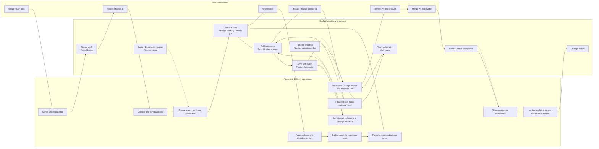
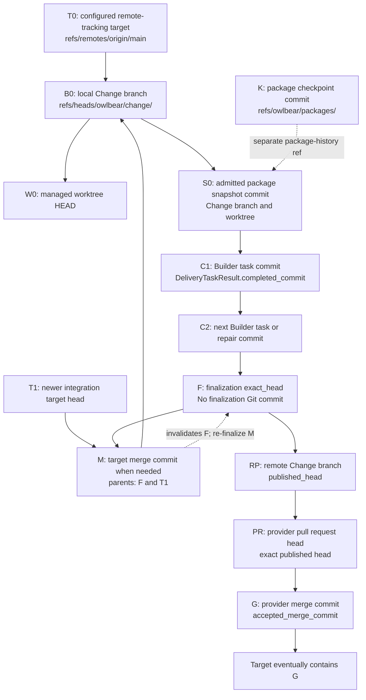
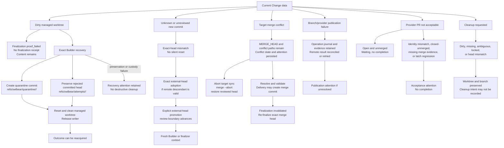

# Delivery Data, Worktree, And Commit Lifecycle

> **Owning request:** User-requested current-state research; no Delivery task ID
> **Date:** 2026-09-02
> **Question:** What data, Git objects, worktrees, runtime records, provider records, and cleanup actions are created, changed, retained, or deleted across the full Delivery lifecycle?
> **Status:** Current behavior research draft

## 1. Context And Scope

This document is the technical companion to [Current User and Cockpit Delivery Flow](user-delivery-cockpit-flow.md). The companion follows the user-facing journey. This document follows the data that makes that journey possible, including the managed Change worktree, local and remote Git references, exact commit identities, runtime authority, provider records, and cleanup.

The lifecycle is traced from the user invoking `/ideate` through `/design`, `/orchestrate`, and `/finalize-change`, the user reviewing and merging the provider pull request, Cockpit publication controls, checkpoint supervision, acceptance observation, Change history, and any later worktree cleanup. The diagrams treat user commands and Cockpit controls as first-class events because those events select the next data mutation or observation.

This is a description of current behavior, not a proposed lifecycle. The exact current command is `/finalize-change`; `/finalize` is used as shorthand in conversation only. Publication is currently advanced through Delivery-owned Cockpit controls and the background checkpoint supervisor; the retired `/publish-change` prompt is not part of the current surface.

The document includes failures that are modeled, repeatable, or recoverable through the current system. It does not create deep branches for accidental HTTP 500 responses or other unintentional failures. Such failures are listed as bounded outputs when the implementation gives them a typed result. Confirmed behavior is separated from limits and questions for later improvement work.

The inventory distinguishes:

- durable filesystem records;
- Git objects and refs;
- the live managed worktree and Git worktree registration;
- short-lived transaction manifests, lock files, and temporary indexes;
- external provider objects and observations; and
- data that is deliberately not created, such as a second per-task worktree or a local Delivery merge of the provider pull request.

## 2. Sources Studied

| Source | What it establishes |
| --- | --- |
| [`user-delivery-cockpit-flow.md`](user-delivery-cockpit-flow.md) | Current user and Cockpit states, command names, visibility conditions, controls, and user-facing outputs |
| [`share/prompts/ideate.prompt.md`](../../share/prompts/ideate.prompt.md), [`share/prompts/design.prompt.md`](../../share/prompts/design.prompt.md), and [`share/skills/w-design-session/SKILL.md`](../../share/skills/w-design-session/SKILL.md) | Native Design package creation, revision, checkpoint, validation, approval, and admission procedure |
| [`share/agents/orchestrator.agent.md`](../../share/agents/orchestrator.agent.md) and [`share/skills/w-orchestration/SKILL.md`](../../share/skills/w-orchestration/SKILL.md) | Acquisition, claim custody, worker dispatch, transition forwarding, and exact failed-claim recovery |
| [`share/agents/builder.agent.md`](../../share/agents/builder.agent.md) and [`share/skills/w-packet-building/SKILL.md`](../../share/skills/w-packet-building/SKILL.md) | Builder worktree custody, explicit scoped commits, exact task result evidence, and retry/return/block behavior |
| [`share/agents/finalizer.agent.md`](../../share/agents/finalizer.agent.md) and [`share/skills/w-change-finalization/SKILL.md`](../../share/skills/w-change-finalization/SKILL.md) | Finalization proof, clean exact-head requirements, independent review, and the absence of publication work in finalization |
| [`serve/delivery/src/owlbear_delivery/portfolio_application.py`](../../serve/delivery/src/owlbear_delivery/portfolio_application.py), [`serve/delivery/src/owlbear_delivery/checkpoint_supervisor.py`](../../serve/delivery/src/owlbear_delivery/checkpoint_supervisor.py), and [`serve/cockpit/web/src/components/WorkItemDetail.tsx`](../../serve/cockpit/web/src/components/WorkItemDetail.tsx) | Target convergence, checkpoint publication, pull-request readiness, background retry, user merge boundary, and acceptance observation |
| [`serve/delivery/src/owlbear_delivery/design_package.py`](../../serve/delivery/src/owlbear_delivery/design_package.py) | Active package files, package identity, package-history commits, and the `refs/owlbear/packages/<change-id>` ref |
| [`serve/delivery/src/owlbear_delivery/delivery_admission.py`](../../serve/delivery/src/owlbear_delivery/delivery_admission.py) | Contract compilation, admission receipt, runtime authority files, revisions, and admission transaction order |
| [`serve/delivery/src/owlbear_delivery/change_workspace.py`](../../serve/delivery/src/owlbear_delivery/change_workspace.py) | Change branch and worktree creation, writer custody, reviewed boundaries, target merge, external-head handling, quarantine, recovery, and cleanup |
| [`serve/delivery/src/owlbear_delivery/delivery_runtime.py`](../../serve/delivery/src/owlbear_delivery/delivery_runtime.py) | Frontier persistence, task/result/finalization/acceptance authority, checkpoint queue, dispositions, and terminal state |
| [`serve/delivery/src/owlbear_delivery/portfolio_application.py`](../../serve/delivery/src/owlbear_delivery/portfolio_application.py) | Application-level sequencing for admission, orchestration, finalization, publication, acceptance, state snapshots, and worktree cleanup |
| [`serve/delivery/src/owlbear_delivery/change_publication.py`](../../serve/delivery/src/owlbear_delivery/change_publication.py) | Exact Change-branch push, publication operation journals, remote-head fencing, and supersession branches |
| [`serve/delivery/src/owlbear_delivery/draft_pull_request.py`](../../serve/delivery/src/owlbear_delivery/draft_pull_request.py) | Provider pull-request operations, receipts, history, generated summaries, draft-state changes, check observations, and pull-request observations |
| [`serve/delivery/src/owlbear_delivery/acceptance.py`](../../serve/delivery/src/owlbear_delivery/acceptance.py) | Completion receipt and display metadata paths, identity rules, and atomic terminal publication |
| [`serve/delivery/src/owlbear_delivery/completed_history.py`](../../serve/delivery/src/owlbear_delivery/completed_history.py) | Receipt-backed history reconstruction and legacy target-history fallback |
| [`serve/delivery/src/owlbear_delivery/delivery_state.py`](../../serve/delivery/src/owlbear_delivery/delivery_state.py) | Sanitized remote Delivery-state snapshots and the `owlbear/delivery-state` publication branch |
| [`serve/delivery/src/owlbear_delivery/runtime_transaction.py`](../../serve/delivery/src/owlbear_delivery/runtime_transaction.py) and [`serve/delivery/src/owlbear_delivery/storage_io.py`](../../serve/delivery/src/owlbear_delivery/storage_io.py) | Crash-safe file publication, transaction manifest recovery, lock files, atomic writes, and temporary-file cleanup |
| [`serve/delivery/src/owlbear_delivery/delivery_application_loader.py`](../../serve/delivery/src/owlbear_delivery/delivery_application_loader.py) and [`.owlbear/.gitignore`](../.gitignore) | Startup roots, primary-checkout requirement, derived Delivery paths, ignored runtime paths, and startup rejection conditions |
| [`serve/delivery/tests/test_change_workspace.py`](../../serve/delivery/tests/test_change_workspace.py) | Executable worktree, package snapshot, dirty-state, quarantine, recovery, external-head, target-sync, and cleanup behavior |
| [`serve/delivery/tests/test_portfolio_application.py`](../../serve/delivery/tests/test_portfolio_application.py), [`serve/delivery/tests/test_change_publication.py`](../../serve/delivery/tests/test_change_publication.py), and [`serve/delivery/tests/test_delivery_runtime.py`](../../serve/delivery/tests/test_delivery_runtime.py) | Application sequencing, exact-head transitions, publication, acceptance, state, recovery, and runtime invariants |
| [`serve/cockpit/src/owlbear_cockpit/routes/target_work.py`](../../serve/cockpit/src/owlbear_cockpit/routes/target_work.py), [`serve/delivery/src/owlbear_delivery/work_items.py`](../../serve/delivery/src/owlbear_delivery/work_items.py), and [`serve/cockpit/web/src/components/WorkItemDetail.tsx`](../../serve/cockpit/web/src/components/WorkItemDetail.tsx) | Cockpit API actions, projected visibility, cleanup/recovery controls, and publication detail controls |

No external sources were needed. No external source attribution entry was added.

## 3. System Boundaries And Identity

### 3.1 Storage roots

| Root or object | Current role | Normal lifetime |
| --- | --- | --- |
| Primary repository checkout | The user's checkout and Delivery's repository anchor | Exists before and after every Change; Delivery startup requires this to be the primary Git worktree |
| `.owlbear/delivery/packages/<change-id>/` | Active authored Design package: `intent.md`, `design.md`, `authority.json`, and `manifest.json` | Created during Design; remains the active package after admission and completion; no normal deletion path was found |
| `.owlbear/delivery/runtime/` | Host-local runtime authority, coordination, completion, publication, transaction, and lock state | Created as needed; most records remain for replay, audit, restart, or history |
| `.owlbear/delivery/runtime/changes/<change-id>/` | Admitted `contract.json`, `frontier.json`, `admission.json`, and revision history | Created at admission; remains after completion or abandonment |
| `.owlbear/delivery/runtime/coordination/changes/<change-id>.json` | One mutable coordination record for the Change worktree, branch, custody, leases, receipts, and cleanup | Created when the managed workspace is ensured; remains after worktree removal with cleanup evidence |
| `.owlbear/delivery/worktrees/<change-id>/` | One warm linked writable Change worktree | Created at admission; remains through the lifecycle until explicit eligible cleanup |
| `refs/heads/owlbear/change/<change-id>` | Local canonical Change branch | Created with the worktree; retained by current cleanup, which removes the worktree but not the branch |
| `refs/owlbear/packages/<change-id>` | Local package-history checkpoint ref | Created by Design checkpoint; points to the latest package-history commit; not a remote backup |
| `refs/owlbear/attempts/<change-id>/<attempt-id>` | Preserved rejected committed Builder head | Created for retry/restart preservation; current core has no matching deletion path |
| `refs/owlbear/quarantine/<change-id>/<attempt-id>` | Preserved dirty worktree content in an isolated commit | Created during automatic dirty Builder recovery; current core has no matching deletion path |
| `refs/owlbear/recoveries/<change-id>/<operation-id>` | Legacy blocked-Implementation recovery ref | Conditional legacy path; not part of the ordinary current Builder sequence |
| Remote `owlbear/change/<change-id>` branch | Provider-facing exact Change branch | Created or fast-forwarded by checkpoint publication; Delivery does not delete it |
| Provider pull request and checks | External publication and acceptance state | Created or observed by provider operations; remains under provider retention and repository settings |
| Remote `owlbear/delivery-state` branch | Sanitized resumable Delivery snapshot | Updated at selected semantic checkpoints; contains snapshot files, not live worktree custody |

Runtime and worktree paths are ignored on the development branch. Active package files remain trackable. The ignore rules also classify `.storage.lock` and publication runtime paths as managed runtime artifacts rather than product files.

### 3.2 Exact identities

The system uses several different identity classes. They are not interchangeable.

| Identity | Shape and location | Authority it represents |
| --- | --- | --- |
| `change_id` | Lowercase hyphenated identifier in package, runtime, branch, worktree, and provider paths | The logical Change across all stores |
| `package_id` | SHA-256 digest of canonical `manifest.json` | Exact authored Design package bytes and their source hashes |
| Contract or authority digest | SHA-256 digest of canonical compiled contract or authority bytes | The admitted executable Design authority |
| `checkpoint_commit` | Git commit recorded in `admission.json` | Package-history commit on `refs/owlbear/packages/<change-id>` |
| `last_reviewed_commit` | 40-hex commit in coordination | The current reviewed source boundary allowed for the next owned operation |
| `target_head` | 40-hex commit in coordination and target-sync evidence | The exact integration-target commit observed or merged |
| `publication_base_head` | 40-hex commit in coordination | Baseline used to derive repository automation changes and publication summaries |
| `completed_commit` | 40-hex commit in each promoted `DeliveryTaskResult` | Exact Builder commit bound to one task's observations and review |
| `finalized_head` or `exact_head` | 40-hex commit in finalization, publication, ready, acceptance, and completion records | Exact reviewed Change branch head approved for publication |
| `published_head` | 40-hex commit in branch publication and runtime checkpoint state | Exact head pushed to the remote Change branch and represented by the provider PR |
| `accepted_merge_commit` | 40-hex provider merge commit in the acceptance latch and completion receipt | The external product-side merge observed after the user merges the PR; normally differs from `finalized_head` |
| Operation, claim, attempt, receipt, observation, and review IDs | Stable strings or content-addressed SHA-256 values in runtime records and journals | Replay, custody, evidence, and cross-store binding; they do not stand in for a Git commit |

`last_reviewed_commit` is the key local boundary. A branch may contain a descendant commit, but Delivery does not treat that descendant as reviewed merely because it exists. External-head adoption and promotion are separate authority steps.

## 4. Graphical Overview

### 4.1 User interaction and data flow

The user and Cockpit events are shown alongside the data mutations. Cockpit has copied commands for Design, orchestration, and finalization, while publication and worktree controls call Delivery APIs directly.

The first package checkpoint and the first provider pull request may occur before all implementation work is complete. Admission queues an admitted-Design checkpoint, and the application may reconcile it immediately when publication providers are configured. Later promoted task results and finalization queue later checkpoints against the same Change publication history.

### 4.2 Normal commit and ref lineage

The labels `T0`, `S0`, `C1`, and so on are placeholders for actual 40-hex commit identities. They show the parent relationships and the record that names each identity, not a literal fixed number of commits.

The target-convergence branch is conditional. If the current target is already an ancestor of `F`, no `M` is created and the exact finalized head is published. If the target is not contained, Delivery merges the target in the managed Change worktree. The resulting `M` becomes the new branch head and reviewed boundary for target-sync purposes, but the old finalization is invalid until the new exact head is finalized.

The package checkpoint `K` is a separate Git object history created by `commit-tree`; it is not the Change branch snapshot. The admitted package snapshot `S0` is a normal commit on the Change branch and is the commit that makes the package visible in the managed source history.

### 4.3 Known failure and recovery paths

## 5. Normal Data Flow

### 5.1 Startup and workspace composition

Before a user command can use Delivery, the application loader composes the package store, runtime coordinator, worktree manager, runtime objects, publication providers, and optional remote-state publisher.

1. Startup requires the configured workspace to be the primary Git worktree. A linked checkout cannot be used as the Delivery repository anchor.
2. The loader derives `.owlbear/delivery/packages`, `.owlbear/delivery/runtime`, and `.owlbear/delivery/worktrees`. Symlinked or malformed parents are rejected.
3. Existing transaction manifests are recovered by `RuntimeTransaction.recover_all` where the owning store permits recovery. Interrupted migration and retirement journals fail startup until their owning recovery path handles them.
4. The configured remote-tracking target must resolve to a commit. The initial Change branch is based on this exact target head; the user checkout's current `HEAD` is not used as the Change base.
5. A Delivery runtime is composed from each admitted `contract.json`. A missing coordination record means the runtime cannot simply guess the reviewed boundary; recovery requires exact authority.

The startup path does not create a per-task worktree. It creates the managers that can later ensure one warm worktree per Change.

### 5.2 `/ideate`: active Design package creation

The Designer uses the Design package store for a native Change. This is separate from the Cockpit Ideas notebook.

1. A new native package creates four files under `.owlbear/delivery/packages/<change-id>/`:
   - `intent.md`, authored intent;
   - `design.md`, authored design;
   - `authority.json`, initially empty before generated authority is published; and
   - `manifest.json`, whose canonical bytes contain the source SHA-256 values.
2. `package_id` is the SHA-256 digest of canonical `manifest.json`. Repeating the same request is replayable. Different bytes for the same Change are a package conflict.
3. A Design revision replaces the authored bytes transactionally after comparing the supplied `expected_package_id`. The generated authority is cleared by the revision.
4. A Design checkpoint writes a separate Git tree and commit with `hash-object`, `mktree`, and `commit-tree`, then updates `refs/owlbear/packages/<change-id>`. The checkpoint commit contains the four package files and has no parent on its first checkpoint; later checkpoints parent the previous package checkpoint.
5. The package remains active on disk. The package checkpoint ref and Git objects are not the managed Change branch.

Cockpit visibility begins when the verified active package is discovered as Design work. No Change worktree is required merely to create or revise an unadmitted Design package.

### 5.3 `/design`: contract publication, admission, and first worktree

The successful admission sequence is ordered inside `PortfolioApplication.admit_delivery_change` and `DeliveryAuthorityRegistry.admit`.

#### 5.3.1 Publish admitted authority

1. The registry reads and verifies the active package, compiles the authored sources into a canonical `DeliveryContract`, and rejects compiler diagnostics.
2. The package store writes generated `authority.json` and a new manifest transactionally. The manifest now binds the authority bytes as well as the authored bytes.
3. The package store checkpoints the complete package again. The resulting Git commit is recorded as `DeliveryAdmissionReceipt.checkpoint_commit`; `admission.json` therefore points to the package-history commit, not to the Change branch snapshot.
4. The registry writes `.owlbear/delivery/runtime/changes/<change-id>/` with:
   - `contract.json`, canonical executable authority;
   - `frontier.json`, initial Outcome bindings and no active claims; and
   - `admission.json`, contract digest, source-binding digest, integration target, checkpoint commit, and frontier IDs.
5. If a previous admitted contract exists, the previous three files are copied to `changes/<change-id>/revisions/<old-contract-digest>/` before the active files are replaced. Carry-forward preserves unchanged Outcome authority and invalidates changed or dependent Outcomes.

All runtime file publication is transaction-backed. A transaction manifest under `.owlbear/delivery/runtime/transactions/` is removed after successful publication. A crash may leave the manifest for deterministic recovery at the next owning read or startup.

#### 5.3.2 Ensure the managed Change workspace

After authority admission succeeds, the application ensures the workspace.

1. The worktree manager resolves the configured `refs/remotes/<remote>/<target>` head as `target_head`.
2. If `refs/heads/owlbear/change/<change-id>` does not exist, it creates that local branch at `target_head`.
3. It creates the linked worktree at `.owlbear/delivery/worktrees/<change-id>` with `git worktree add`. The worktree is checked out on the canonical local Change branch.
4. It writes `.owlbear/delivery/runtime/coordination/changes/<change-id>.json`. The initial `target_head`, `publication_base_head`, and `last_reviewed_commit` all represent the target-based branch head.
5. The application snapshots the admitted package into the managed Change worktree. It writes the four package files below `.owlbear/delivery/packages/<change-id>/`, stages only those paths, and creates a normal Change-branch commit with message `chore: snapshot admitted Design package (...)`.
6. The `ChangeDesignPackageSnapshotReceipt` records `previous_head` and `snapshot_head`. Coordination advances `last_reviewed_commit` to `snapshot_head`. The worktree and local Change branch now point to this snapshot commit.
7. Admission queues an `ADMITTED_DESIGN` checkpoint. If publication providers are configured, the application may immediately reconcile that checkpoint, which can push the branch and create the first draft provider pull request.

The primary checkout is not changed by the package snapshot. The worktree test `test_snapshot_design_package_commits_managed_change_worktree_only` verifies that the managed worktree branch advances while the repository checkout's `HEAD` and status remain unchanged.

### 5.4 `/orchestrate`: claims, planning, and Builder commits

`/orchestrate` is a loop around Delivery acquisition and bounded worker dispatch. It is not itself a Git integration operation.

#### 5.4.1 Acquire and claim

1. `acquire_frontier_work` selects a dependency-ready Outcome and returns a serialized `DeliveryLaunchPackage` with Change, Outcome, task, claim, package, branch, worktree, source head, and reviewed boundary identities.
2. Delivery persists the active claim in `frontier.json`. For a Builder launch, the application also persists `ChangeCoordination.writer` with the same attempt and claim IDs. Planner launches do not acquire a Change writer.
3. The launch points Planner and Builder at the same managed Change worktree. There is no per-task or proof worktree.
4. The Orchestrator dispatches the configured worker and forwards the worker's transition unchanged. It does not calculate a commit, create a branch, or choose a transition.

#### 5.4.2 Planner data path

1. Planner reads `show_plan_context` from the current authority and publishes a `DeliveryPlanCandidate` through `publish_delivery_plan`.
2. The candidate is stored in the active Outcome binding in `frontier.json`; there is no Planner-created Change-branch commit for the plan.
3. The worker's `advance`, `retry`, `return`, or `block` transition is applied by `transition_delivery`. On a successful planning advance, task definitions become promoted task authority in the frontier and the claim-scoped candidate is cleared.
4. A planning retry or return changes frontier authority and claim state only, unless the route includes a separately preserved implementation commit from a previous stage.

#### 5.4.3 Builder data path

1. Builder calls `show_build_context` and independently verifies the assigned worktree branch, `HEAD`, ancestry, writer custody, and cleanliness.
2. Builder edits only the task's maintained surfaces inside the assigned worktree.
3. Builder creates an explicit scoped Git commit. The commit is created by the Builder agent using the repository's scoped commit procedure; Delivery does not create the implementation commit.
4. The Builder runs required observations against the exact candidate commit and constructs observation receipts. An independent `build-reviewer` reviews that same commit and produces a review receipt.
5. `publish_delivery_result` stores a `DeliveryResultCandidate` in `frontier.json`. The candidate binds the task digest, exact `completed_commit`, observation IDs, and review ID to the active claim.
6. The Builder returns `advance` only after the result candidate is published. `transition_delivery` validates the candidate and promotes it to `DeliveryTaskResult` in the Outcome binding.
7. Promotion advances `last_reviewed_commit` to the exact completed commit, clears the claim-scoped candidate, and releases the Change writer. The worktree is required to be clean and its branch head must equal the candidate commit.
8. A successful promoted result queues a checkpoint trigger. The queue is frontier state, not a separate task file.

A local implementation review finding creates a successor repair commit. The rejected commit remains immutable and can be preserved by an attempt ref when the transition is a retry. No amend, rebase, squash, or silent rewrite is used.

#### 5.4.4 Builder failure and retry data

A normal worker transition leaves the managed worktree clean before Delivery applies it. If a Builder dispatch fails or an unstructured result leaves an active claim, exact recovery is used.

- A clean rejected committed head can be preserved at `refs/owlbear/attempts/<change-id>/<attempt-id>`. Delivery resets the Change branch and worktree to `last_reviewed_commit`, then releases the writer.
- A dirty worktree is first captured by `commit-tree` into a quarantine commit with the reviewed branch head as its only parent. The ref is `refs/owlbear/quarantine/<change-id>/<attempt-id>`, and `DirtyWorktreeQuarantineReceipt` records the exact changed paths, base head, ref, and quarantine commit. Delivery then resets and cleans the managed worktree and releases custody.
- Recovery returns `recovered` when the exact state is restored. If the quarantine cannot be created or custody cannot be proven, Delivery retains recovery attention and does not discard bytes.
- The attempt and quarantine refs are evidence refs. The inspected current core contains creation and verification paths but no normal deletion operation for them.

### 5.5 `/finalize-change`: exact reviewed head, no product commit

Finalization is a data-boundary operation, not a merge operation.

1. The Finalizer reads `show_finalization_context` and observes the managed Change branch and worktree directly.
2. It requires no active writer, no publication lease, no cleanup intent, no quarantine state, a clean managed worktree, a branch head equal to the requested exact head, and ancestry from `last_reviewed_commit`.
3. It runs maintained observations against that exact head and obtains independent advisory review. Each observation and review is content-addressed and bound to the exact head.
4. `finalize_change` creates a `DeliveryFinalizationReceipt` in `frontier.json`. The receipt binds:
   - `operation_id`;
   - `exact_head`;
   - admitted authority digest;
   - all promoted task-result digests;
   - finalization observation IDs; and
   - the finalization review ID.
5. The operation may transactionally advance coordination's `last_reviewed_commit` to the exact head when a finalization boundary needs to be recorded. It does not create a new product commit, push a branch, create or update a pull request, mark the pull request ready, or observe acceptance.
6. Finalization queues a `FINALIZATION` checkpoint in `frontier.json`.

If the Change head later moves, `DeliveryFinalizationInvalidationReceipt` replaces the current finalization authority in the frontier with expected and observed heads and a reason. The old exact head is no longer publishable as current authority.

### 5.6 Publication: target convergence and checkpoint publication

The publication tail is entered through the corresponding Cockpit controls. A background checkpoint supervisor retries pending checkpoint reconciliation while a Delivery host is alive; it does not cross exact-head finalization, user review, or provider merge boundaries.

#### 5.6.1 Target convergence

1. Publication observes the current configured target head and checks whether it is an ancestor of the finalized Change head.
2. If the target is already contained, no target merge commit is created.
3. If the target has advanced, `sync_change_with_target` fetches the exact target into the configured remote-tracking ref and runs `git merge --no-edit` in the managed Change worktree.
4. A fast-forward updates the Change branch to the target-inclusive head without a merge commit. A non-conflicting divergent merge creates a two-parent merge commit on the Change branch. `ChangeTargetSyncReceipt` records:
   - operation ID;
   - expected and fetched target head;
   - Change head before the merge;
   - merged head; and
   - whether the result is a merge commit.
5. Coordination updates `target_head`, `target_sync_receipt`, and `last_reviewed_commit` to the target-inclusive head. The previous finalization no longer matches. Publication returns `needs_finalization`; the new head must be finalized before publication continues.
6. The target merge does not mutate the primary user checkout. It mutates only the managed Change worktree and its local branch.

#### 5.6.2 Preserved target conflict

If `git merge` stops with conflicts:

1. Git leaves `MERGE_HEAD`, the conflict index, and conflict files in the managed Change worktree.
2. Delivery records `ChangeTargetSyncConflictState` in coordination with the exact operation ID, target head, pre-merge Change head, conflict ID, and conflict paths.
3. The runtime captures publication attention so the Change is visible as blocked by the exact conflict.
4. `abort_target_sync_conflict` runs `git merge --abort`, verifies that the worktree is clean and restored to the pre-merge reviewed head, and records `ChangeTargetSyncAbortReceipt`. It creates no merge commit.
5. `resolve_target_sync_conflict` validates that no unmerged paths remain and, when a merge is in progress, runs `git commit --no-edit`. It verifies the resulting commit has exactly the requested Change and target parents, then records `ChangeTargetSyncReceipt` and advances the reviewed boundary. The old finalization is still invalid and the exact merge head must be finalized again.

The current Cockpit offers **Abort target sync** and **Validate resolved merge** for this state. The publication workflow guidance treats semantic conflict repair as a reviewed boundary, so the UI operation and workflow ownership should be kept distinct when this current behavior is assessed later.

#### 5.6.3 Publish the exact Change branch

Once a clean finalized head contains the current target:

1. `reconcile_change_checkpoint` derives the checkpoint summary from the exact head and the known `publication_base_head`.
2. `ChangeBranchPublisher` creates a replayable operation record below `.owlbear/delivery/runtime/publications/change-branches/operations/`. The operation binds the local canonical branch, target branch, expected remote head, and exact `published_head`.
3. The publisher reserves the Change workspace with an expiring publication lease, verifies the local branch and worktree are still at the reviewed exact head, and pushes that existing commit to the remote `owlbear/change/<change-id>` branch. It does not create a new local commit.
4. It re-observes the remote branch. The resulting `ChangeBranchPublicationReceipt` records the remote, branch, target branch, expected remote head, and exact published head.
5. The runtime records the published head and retains the pending checkpoint until the complete provider checkpoint has been reconciled.
6. If the canonical predecessor publication has attention and a supersession is explicitly chosen, the publisher creates a successor branch `owlbear/change/<change-id>+s<n>`. The predecessor branch and publication history remain intact.

#### 5.6.4 Reconcile the provider pull request

1. On the first checkpoint, the provider adapter creates or reconciles a draft pull request bound to the exact remote Change branch and target branch.
2. The local DraftPullRequestPublisher stores operation and receipt records below `.owlbear/delivery/runtime/publications/pull-requests/` and records ordered publication history.
3. It updates only the generated summary block in the pull request body. User prose is not replaced by the generated-summary operation.
4. The runtime records the provider repository, pull-request number, node ID, and exact head in `change_publication_history` and the current publication identity.
5. Checkpoint acknowledgement clears the pending checkpoint in `frontier.json`. A reconciled checkpoint therefore means the branch and draft PR are bound to the exact finalized head; it does not mean the Change is completed.
6. If the baseline needed to calculate the summary cannot be resolved, publication captures `publication-baseline-unavailable` attention and leaves the checkpoint unresolved. An explicit baseline recovery operation is required before the summary can be safely derived.

### 5.7 Check publication, mark ready, and optional review

1. **Check publication** reads provider checks for the exact published head and stores a `PublicationCheckObservationReceipt` below `check-observations/<change-id>/`. The receipt records provider evidence digest, exact commit, check state, conclusion, required status, and observation time.
2. **Mark ready** stores a draft-state operation and receipt below `draft-state-operations/` and `draft-state-receipts/`, asks the provider to set the pull request from draft to ready, and verifies the resulting provider state.
3. The runtime stores `PullRequestReadyReceipt` in `frontier.json`. It binds the current finalization ID, exact head, provider repository, PR number, node ID, and provider evidence digest.
4. The runtime enters awaiting-merge only after the ready receipt is reconciled to the current finalization and publication identity.
5. If the provider later regresses the PR to draft or reports required-check failure, the runtime captures publication attention and removes or invalidates the active ready authority as required by the current state machine.
6. The user may review the pull request and final product in the provider at this point. There is no separate local review commit or Cockpit state that represents optional product review.

### 5.8 User merge and acceptance observation

1. The user merges the provider pull request. Delivery does not perform this merge and does not create the provider's merge commit.
2. The provider exposes the merged PR state, the exact PR head SHA, the target branch, the merge timestamp, and `merge_commit_sha`. The provider's merge commit is `accepted_merge_commit` in Delivery terminology.
3. Cockpit can call **Check GitHub acceptance**, and the visible Delivery page can run bounded periodic acceptance reconciliation.
4. `observe_acceptance` first verifies finalization, ready authority, published head, publication identity, repository, PR number, node ID, base branch, and PR head. Completion is never inferred from a local branch or from the existence of a ready receipt.
5. A matching merged provider observation creates `DeliveryMergedPullRequestLatch`. The latch preserves the first accepted tuple and rejects later regression or drift.
6. Delivery reads exact-head provider check observations, creates `CompletionReceipt`, and atomically writes:
   - `.owlbear/delivery/runtime/completions/<change-id>/<completion-id>.json`;
   - `.owlbear/delivery/runtime/completions/<change-id>/display.json`; and
   - the terminal `change_completion` projection into `frontier.json`.
7. The application publishes a sanitized remote Delivery-state snapshot when configured. The snapshot contains terminal authority and completion evidence but no active claim or live worktree custody.
8. The normal current Delivery projection no longer lists the completed Change. Change history can now rebuild its receipt-backed completion record.

The completion receipt deliberately contains both `finalized_change_head` and `accepted_merge_commit`. The first is the exact reviewed Change branch head; the second is the external provider merge evidence. They answer different questions and should not be collapsed.

### 5.9 Change history and post-terminal cleanup

1. `CompletedHistoryCatalog` rebuilds receipt-backed completion history from local completion bundles, scans the configured target ref for legacy completion packages, and also retains terminal abandoned Changes as abandonment records.
2. Accepted history displays completion identity, title, Outcome summaries, finalization receipt identity, finalized Change head, provider PR identity, accepted target ref, accepted merge commit, merge time, acceptance observation identity, check observations, review identities, and completion time. Abandoned history displays abandonment identity, title, Outcome summaries, prior stage, reason, and cleanup state.
3. A terminal Change's runtime authority, active package, package checkpoint ref, local Change branch, coordination record, publication journals, provider PR, and completion or abandonment record are not automatically removed by terminal recording.
4. Worktree cleanup is a separate explicit Delivery operation. For an abandoned Change, **Clean abandoned worktree** calls `cleanup_abandoned_change_worktree`. For a completed Change, `cleanup_completed_change_worktree` requires the exact completion ID.
5. `ChangeWorkspaceManager.cleanup` writes a durable cleanup intent containing Change ID, canonical branch, worktree path, and current branch head. It then verifies no active writer or publication lease, validates the worktree registration, path, branch, exact head, and cleanliness, runs `git worktree remove`, verifies the registration and filesystem are gone, and writes a cleanup receipt.
6. Cleanup removes the linked worktree and Git registration. It retains the local `refs/heads/owlbear/change/<change-id>` branch, its commits, the coordination record, and the cleanup receipt. It does not delete the remote Change branch, package ref, attempt refs, quarantine refs, publication journals, or completion evidence.
7. There is no normal automatic worktree cleanup call in the inspected application path. Change history exposes abandoned cleanup state and the current detail model can render terminal cleanup controls when supplied a publication detail; completed-worktree cleanup still has no normal history route.

## 6. Artifact Inventory And Lifetime

The table below is the current data-side inventory. "Delete authority" means the code path that can remove the artifact, not necessarily the actor who clicked the Cockpit control.

| Artifact | Created or changed by | Created or changed when | Used by | Normal lifetime | Delete authority and condition |
| --- | --- | --- | --- | --- | --- |
| Active package directory and four files | DesignPackageStore | `/ideate`, Design revision, generated contract publication | Designer, admission, snapshot, publication summary, history | Through and after the Change | No normal deletion path found in the current Delivery core |
| Package `manifest.json` | DesignPackageStore | Every package creation/revision/authority publication | `package_id`, source binding, package verification | With active package | Same as active package |
| Package-history Git tree and commit | DesignPackageStore via `hash-object`, `mktree`, `commit-tree` | Design checkpoint and admission contract publication | Package ref, admission receipt, package history | Git object retention; latest commit reachable from package ref | No package-ref deletion path found |
| `refs/owlbear/packages/<change-id>` | DesignPackageStore | Package checkpoint | Resume and package-history verification | Until ref maintenance removes it | No normal removal path found |
| Runtime `contract.json` | DeliveryAuthorityRegistry | Successful admission | Runtime composition and source-bound authority | Until runtime state is retired or migrated | No normal per-Change deletion in the current lifecycle |
| Runtime `frontier.json` | DeliveryRuntime and atomic runtime transactions | Admission and every state mutation | All Delivery projections and transitions | Through completion, abandonment, and history | No normal per-Change deletion in the current lifecycle |
| Runtime `admission.json` | DeliveryAuthorityRegistry | Successful admission | Remote state snapshots and authority verification | Through completion | No normal per-Change deletion found |
| Runtime `revisions/<digest>/*` | DeliveryAuthorityRegistry | Contract revision | Historical authority and carry-forward verification | Historical runtime evidence | No normal deletion path found |
| Coordination JSON | PortfolioCoordinator | First `ChangeWorkspaceManager.ensure` | Worktree, branch, custody, leases, receipts, cleanup | Through and after worktree cleanup | Updated by Delivery; file is retained after cleanup |
| Managed worktree directory | Git worktree manager | Admission or exact missing-worktree recovery | Builder, finalizer, target sync, publication checks | Until explicit eligible cleanup | `cleanup_change_worktree`, only abandoned/completed and clean/exact |
| Git worktree registration metadata | Git `worktree add` | Managed worktree creation | Git registration and safety checks | Until `git worktree remove` | Git via ChangeWorkspaceManager cleanup or explicit recovery/removal path |
| Local canonical Change branch | ChangeWorkspaceManager | First workspace ensure | Builder commits, finalization, publication, recovery | Retained after worktree cleanup | No normal Change cleanup deletion |
| Builder implementation commit | Builder agent | Successful implementation or repair | Result evidence, reviewed boundary, publication | Git object retained and reachable from Change branch or attempt ref | No normal deletion or history rewrite |
| Attempt preservation ref | ChangeWorkspaceManager restart/recovery | Retry of a committed rejected head | Exact retry and recovery evidence | Current core does not remove it | No normal deletion path found |
| Quarantine commit and ref | ChangeWorkspaceManager quarantine | Dirty Builder recovery | Byte-preserving recovery verification | Current core does not remove it | No normal deletion path found |
| `MERGE_HEAD` and conflict index state | Git target merge | Target synchronization conflict | Abort or resolve target sync | Until abort or successful resolution | Git `merge --abort` or successful merge commit through Delivery |
| Target-sync receipt | ChangeWorkspaceManager and DeliveryRuntime | Successful target merge or validated conflict resolution | Finalization invalidation, publication detail, remote snapshot | Through completion | Retained in coordination/frontier |
| Target-sync conflict state | ChangeWorkspaceManager | Preserved target merge conflict | Conflict-specific Cockpit controls and attention | Until abort or resolution | Abort/resolve exact operation |
| Finalization receipt | DeliveryRuntime | Successful `/finalize-change` | Checkpoint queue, publication, ready, acceptance | Until head drift replaces it or completion retains its identity | Replaced by finalization invalidation on drift; no separate deletion call |
| Finalization invalidation | DeliveryRuntime | Observed head drift or target sync | Re-finalization visibility and publication block | Until a later valid finalization replaces it | Replaced by new finalization state |
| Pending checkpoint trigger | DeliveryRuntime | Admission, promoted task, verified Outcome, or finalization | Checkpoint reconciliation | Until acknowledged or invalidated | Delivery queue mutation |
| Checkpoint supervisor thread | DeliveryCheckpointSupervisor | Delivery host startup | Bounded retry of pending checkpoint reconciliation | Host process lifetime | Stops on host shutdown; pending state remains durable |
| Change-branch publication operation JSON | ChangeBranchPublisher | Checkpoint push or supersession preparation | Push replay, remote-head fencing, response-unknown recovery | Retained under publication operations | No normal cleanup path found |
| Change-branch publication receipt | ChangeBranchPublisher/runtime | Verified remote branch head | Runtime published head and PR publication | Through completion | Retained in runtime publication history or operation state |
| Provider PR operation JSON | DraftPullRequestPublisher | Create/reconcile PR, draft-state change, summary update, supersession | Idempotent provider mutation | Retained under pull-request runtime state | No normal cleanup path found |
| Provider PR receipt/history | DraftPullRequestPublisher | Provider identity observed | Runtime publication identity, supersession, history | Through completion and history | Retained; provider PR itself follows provider retention |
| Generated summary operation/receipt | DraftPullRequestPublisher | PR summary update | Exact generated block replay | Retained under publication state | No normal cleanup path found |
| Check observation receipt | DraftPullRequestPublisher | Check publication or completion observation | Read-only check evidence and completion receipt | Through history | Retained under `check-observations/<change-id>/` |
| Pull-request observation receipt | DraftPullRequestPublisher | Acceptance polling or explicit acceptance check | Acceptance latch and attention | Through history | Retained under `pull-request-observations/<change-id>/` |
| Ready/draft state operation and receipt | DraftPullRequestPublisher | Mark-ready or return-to-draft | Exact PR state authority | Through completion | Retained under draft-state directories |
| Change publication disposition | DeliveryRuntime | Provider or publication attention | Cockpit resolve/supersede path | Until exact resolution or terminal disposition | Runtime transition records resolution; no generic file deletion |
| Completion receipt | DeliveryRuntime and CompletionReceiptStore | Matching merged PR observation | Change history and terminal verification | Durable history | No normal deletion path found |
| Completion display metadata | CompletionReceiptStore | Completion publication | History display | Durable history | No normal deletion path found |
| Remote Change branch | ChangeBranchPublisher | Checkpoint publication | Provider PR head and external review | Provider retention; Delivery does not delete it | No Delivery delete operation |
| Provider pull request, user prose, checks, merge commit | Provider adapter and user/provider UI | PR publication, user review, merge, provider checks | Acceptance observation and history | Provider retention | Provider/GitHub controls, not local Delivery cleanup |
| Remote Delivery-state snapshot | DeliveryStatePublisher | Selected checkpoint, ready, acceptance, or bootstrap | Restart and remote-state reconciliation | History on `owlbear/delivery-state` | No per-Change deletion path found |
| `.storage.lock` | `locked_roots` | First lock on each storage root | Process coordination | Fixed file remains; lock descriptor is released | File is ignored and not unlinked; not an unbounded per-operation record |
| Runtime transaction YAML | RuntimeTransaction | Before a multi-file publication | Crash recovery | Removed after successful commit; may remain after crash until recovery | Owning `recover`/`recover_all` path |
| Atomic-write `.tmp-*` file | `atomic_write` | During publication-state replacement | Temporary staging only | Removed after rename or error cleanup | `atomic_write` finally/error cleanup |
| Quarantine temporary Git index | Worktree quarantine | During tree capture and `commit-tree` | Temporary isolated index only | Removed in `finally` | Quarantine operation cleanup |

### 6.1 What is deliberately not created

The current design does not create:

- a separate worktree for every Planner task, Builder task, proof run, or finalizer review;
- a Delivery-created merge commit for the provider pull request after the user merges it;
- a local checkout mutation in the primary repository for Change implementation or target sync;
- a durable file for every claim-scoped candidate; candidates and frontier authority are stored in `frontier.json`;
- a second independent source of truth for a finalization head; the exact head is repeated in typed receipts and projections for binding, not because each copy is independently authoritative.

## 7. Commit And Hash Ledger

| Commit or hash | First producer | Recorded in | Why it exists |
| --- | --- | --- | --- |
| Package source hashes | DesignPackageManifest | `manifest.json` and verified package model | Detect authored-byte changes and derive stable package identity |
| `package_id` | DesignPackageStore | Package result, verified package, snapshot intent/receipt, package checkpoints, publication summary inputs | Bind all Design package operations to one exact manifest |
| Package checkpoint commit | DesignPackageStore | `refs/owlbear/packages/<change-id>` and `admission.json.checkpoint_commit` | Preserve semantic package history independently of the Change branch |
| Contract/authority digest | Admission and runtime | `admission.json`, runtime authority, task results, finalization receipt, state snapshot | Prove that execution and publication use the admitted authority |
| Initial target head | ChangeWorkspaceManager | Coordination `target_head`, `publication_base_head`, `last_reviewed_commit`, initial branch ref | Establish the exact starting point for the Change branch |
| Package snapshot head | ChangeWorkspaceManager | Change branch, worktree HEAD, `ChangeDesignPackageSnapshotReceipt`, coordination reviewed boundary, pending checkpoint | Put the admitted Design package into the source branch that workers and publication use |
| Builder `completed_commit` | Builder agent | Observations, review receipt, `DeliveryTaskResult`, Outcome binding, coordination reviewed boundary | Bind one task result to one exact implementation state |
| Preserved attempt commit | Recovery path | `refs/owlbear/attempts/...`, retry transition/recovery result | Keep a rejected committed head available without rewriting the Change branch |
| Quarantine commit | Delivery recovery | `refs/owlbear/quarantine/...`, `DirtyWorktreeQuarantineReceipt`, recovery result | Preserve staged, unstaged, deleted, renamed, and untracked non-ignored bytes before cleaning the worktree |
| Finalization `exact_head` | Finalizer and Delivery | `DeliveryFinalizationReceipt`, finalization checkpoint, publication and ready receipts, completion receipt | Bind final proof and independent review to the exact source head |
| Target `target_head` | Publication target observation | Target-sync request/receipt, coordination, publication summary baseline, state snapshot | Fence target convergence against one exact fetched target commit |
| Target-sync `merged_head` | Delivery `git merge` or validated conflict resolution | `ChangeTargetSyncReceipt`, coordination, frontier, new finalization request | Identify the target-inclusive Change head and its parent relationship |
| Remote `published_head` | Existing local Change branch, pushed by ChangeBranchPublisher | Operation JSON, `ChangeBranchPublicationReceipt`, frontier published state, provider PR receipt | Prove that the remote Change branch exposes the exact reviewed head |
| Provider PR head SHA | Provider observation | Provider publication receipt/history, checks, ready receipt, acceptance observation | Bind provider state to the exact published Change head |
| Provider `accepted_merge_commit` | Provider after user merge | Acceptance latch, `CompletionReceipt`, Change history | Prove the external target-side merge that completes the user-visible lifecycle |
| Receipt IDs and evidence digests | Typed model factories | Coordination, frontier, publication state, completion files, remote snapshots | Make operation results replayable and detect altered evidence; they are not commit IDs |

A repeated SHA in several records is intentional. For example, `finalized_head`, `published_head`, and the PR head must agree before ready authority is valid, while `accepted_merge_commit` must remain distinct because it is produced by the external provider merge.

## 8. Known Error And Attention Paths

### 8.1 Dirty worktree

Dirty state has different outputs depending on the operation that encounters it.

- **Finalization:** `show_finalization_context` reports readiness diagnostics and the Finalizer returns `proof_failed`. No finalization receipt is created. The managed worktree remains untouched so the user or owning worker does not lose content.
- **Builder recovery:** exact `recover_claim` preserves dirty non-ignored bytes in a quarantine commit, resets the worktree to the recorded branch/review boundary, verifies cleanliness, and releases writer custody. If preservation or custody verification fails, recovery attention is retained with the worktree path, branch head, worktree head, reviewed head, custody status, and retry condition.
- **Target sync:** target synchronization requires a clean managed Change worktree. A dirty worktree prevents the merge from starting and does not create a target-sync receipt.
- **Publication:** Change branch publication requires the canonical branch, reviewed boundary, and clean managed worktree. A dirty state produces a typed publication conflict or provider-facing error without pushing a new head.
- **Cleanup:** cleanup refuses a dirty worktree with `WORKTREE_DIRTY`. It does not remove the directory, does not discard content, and does not record successful cleanup.

### 8.2 Unknown or unreviewed new commit

There are several distinct cases that should not be collapsed into one "unknown commit" error.

- **Uncommitted new bytes:** clean-state checks fail. Delivery does not decide whether to keep or discard them during finalization or cleanup.
- **Local committed branch advance:** if the branch head is not the exact requested head or is outside the reviewed boundary, finalization, publication, and source acquisition reject it. The system does not silently reset a new commit.
- **Remote Change descendant:** `adopt_external_head` can fetch and fast-forward an exact remote descendant into the managed Change branch and worktree, recording an adoption receipt while leaving `last_reviewed_commit` unchanged. `promote_external_head` is a separate operation that grants review authority to the adopted head. Builder acquisition requires explicit promotion before using the adopted head as reviewed source.
- **Divergent or malformed external head:** adoption rejects the branch without mutating the managed workspace. The current Cockpit detail controls documented for publication do not include a general external-head adoption/promotion button; the operations are exposed through the Delivery MCP surface.
- **Missing Git object:** provider publication returns typed `NOT_FOUND` or `INVALID_RESPONSE` variants depending on whether a required local or remote commit cannot be resolved or violates the provider response contract.

### 8.3 Target-sync conflict

A target conflict is preserved rather than flattened into a generic failure.

- Git conflict state remains in the managed worktree through `MERGE_HEAD` and conflict paths.
- Coordination retains operation identity, target head, pre-merge Change head, and conflict paths.
- Frontier retains publication attention, so Cockpit can show conflict-specific controls.
- Abort removes the merge state and restores the reviewed head without a merge commit.
- Validate/resolve creates and verifies an exact two-parent merge commit when the worktree is resolved, then invalidates any prior finalization and requires fresh finalization.
- A conflict with a stale operation ID or target head is rejected rather than applied to a different merge state.

### 8.4 Finalization head drift

When a finalization exists and Delivery observes a different current Change head:

1. Delivery records expected and observed heads in `DeliveryFinalizationInvalidationReceipt`.
2. The current finalization authority is no longer valid.
3. A ready provider pull request may be returned to draft when provider observation shows it is bound to the changed head.
4. Cockpit exposes **Finalization invalidated** and a re-finalization command when the projection can derive that action.
5. No old finalization head is published as if it were current.

### 8.5 Publication operation and provider failures

Branch and provider publication are fenced and replayable.

- A push timeout before the write starts is retry-safe. A timeout after a push starts is response-unknown and is reconciled by observing the remote branch before retrying.
- A remote branch that changed, diverged, or is behind the expected fence produces a conflict. Delivery does not force-push the Change branch.
- Authentication, rate limit, remote rejection, unavailable provider state, malformed provider response, and missing Git commit have typed provider failure codes. The operation journal remains available for replay or diagnosis.
- Pull-request creation, summary update, draft-state mutation, and supersession each keep operation and receipt identities so a retry does not blindly create a second publication.
- Required provider check failure can produce retained publication attention. It is not silently waived by marking the PR ready.

### 8.6 Acceptance waiting and acceptance attention

- A matching open, unmerged PR is a waiting result. It does not create completion or terminal failure.
- A PR with a changed head, wrong repository/number/node ID/base branch, closed-unmerged state, missing merge evidence, or evidence that regresses from an established merged latch creates typed acceptance attention.
- Acceptance attention is stored in the frontier with provider observation evidence. Completion is not written.
- A matching merged PR latches exact merged evidence and then allows atomic completion publication.
- A later observation that contradicts an established merged latch is rejected as regression rather than replacing the first accepted tuple.

### 8.7 Missing, damaged, or ambiguous worktree

`list_retained_change_worktrees` reports independent facts about coordination, Git registration, filesystem presence, branch, worktree head, detached state, locks, prunability, and cleanliness.

- A missing canonical directory is not automatically recreated by ordinary `ensure`.
- Explicit recovery requires confirmation and the exact recorded `last_reviewed_commit`.
- A foreign registration, unregistered directory with content, branch mismatch, detached worktree, or ambiguous ownership creates worktree attention without discarding content.
- Recovery recreates the canonical linked worktree from the retained Change branch only after the exact reviewed authority and ownership checks pass.

### 8.8 Cleanup refusal and partial cleanup

Cleanup is intentionally conservative.

1. Delivery first checks that the Change is abandoned or completed. A deferred or active Change cannot be cleaned.
2. Completed cleanup requires the exact completion ID.
3. Active writer custody and publication leases block cleanup.
4. Dirty, missing, locked, detached, mismatched, prunable, foreign, or unexpected filesystem state blocks cleanup.
5. A cleanup intent is durable and content-addressed. If removal fails after intent publication, retry can replay the exact intent rather than inventing another identity.
6. Successful removal records `ChangeWorktreeCleanup` and leaves the local branch and all evidence refs intact.

There is no current automatic garbage-collection pass for the Change branch, package checkpoint, attempt refs, quarantine refs, publication journals, or completed runtime records in the inspected lifecycle.

### 8.9 Transaction, lock, and startup failures

These are bounded output classes rather than deep user-flow branches in this document:

- malformed or altered transaction manifests fail transaction recovery;
- transaction destination conflicts fail atomic publication without accepting mixed bytes;
- storage roots that are symlinks or unsafe paths fail before mutation;
- `.storage.lock` contention serializes operations or returns an operation-specific busy/conflict result;
- remote Delivery-state snapshot conflicts stop remote-state publication without claiming convergence;
- startup rejects interrupted migration or retirement journals, invalid runtime roots, stale legacy roots, missing primary worktree registration, and mismatched local state against a remote snapshot;
- remote provider unavailability, authentication, timeout, response-unknown, or rate-limit errors remain typed operation outputs.

## 9. Current-State Observations For Later Assessment

These are observations to carry into a separate improvement discussion. They are not recommendations or product decisions.

1. The primary managed Change worktree is created at admission, not at the first Builder task, and is reused by Builder, Finalizer, target synchronization, and publication validation.
2. Admission creates both a separate package-history commit and a Change-branch package snapshot commit. The two commits have different refs and different purposes.
3. Builder commits are the implementation evidence. Finalization does not make a commit; target synchronization may make a merge commit; the provider user merge makes the accepted merge commit.
4. Current cleanup removes only the linked worktree and Git registration. It deliberately retains the local Change branch and cleanup evidence.
5. Attempt and quarantine refs are created to preserve failed work, but no normal deletion path was found in the inspected current Delivery core. They are the clearest candidates for a later retention-policy review because each retry or dirty recovery can add another reachable ref.
6. Active Design packages, package refs, runtime authority, publication journals, provider observations, completion receipts, and remote snapshots also have no normal per-Change deletion path in the inspected lifecycle. Their persistence may be intentional history, but their intended retention is not expressed by the ordinary cleanup operation.
7. Runtime transaction manifests, atomic-write temporary files, and quarantine temporary indexes have bounded cleanup paths. A leftover transaction manifest represents an interrupted publication requiring recovery; a leftover temporary file represents an abnormal cleanup failure rather than normal lifecycle history.
8. The Cockpit has a direct completed-worktree cleanup model and API, but the normal completion refresh moves the user to history and the history detail does not expose the cleanup control. The data operation exists, while its ordinary user route is not continuous with the completion view.
9. External-head adoption and promotion are exact data-side operations, but they are not among the ordinary Cockpit publication controls documented in the current detail surface.
10. Target conflict validation can create a Delivery-owned merge commit from a resolved managed worktree, while the publication workflow guidance places semantic conflict repair at a separately reviewed boundary. The current data path is documentable, but its intended ownership should be settled before treating the button as a general user repair path.
11. The completion record distinguishes the reviewed Change head from the provider's accepted merge commit. Any later cleanup or history design that keeps only one of these hashes would lose a current correctness distinction.

## 10. Confidence And Limits

**Confidence:** High for the local Delivery core, worktree manager, runtime models, publication adapters, completion store, Cockpit projection, and the covered tests. The focused worktree check covering package snapshot, target-based branch creation, dirty preservation/quarantine, exact recovery, and cleanup passed with 8 tests and 0 failures on 2026-09-01.

**Limits:**

- The document follows the current source and tests. It does not inspect a live remote repository, GitHub API response, or a real completed Change in this workspace.
- Provider-side branch deletion, PR retention, check retention, merge strategy, and repository settings are external behavior. Delivery creates and observes provider objects but does not own their garbage collection.
- The absence statements about deletion are bounded to the inspected current Delivery source and route surface. A separately maintained migration, repository-maintenance, or provider policy could remove artifacts outside this lifecycle.
- Process memory, OS caches, Git's unreachable-object pruning, and ordinary editor-created files are outside the inventory unless Delivery explicitly records or relies on them.
- The exact UI reachability of a command depends on VS Code prompt registration and Cockpit runtime configuration; this document records the command and route surfaces present in the repository.
