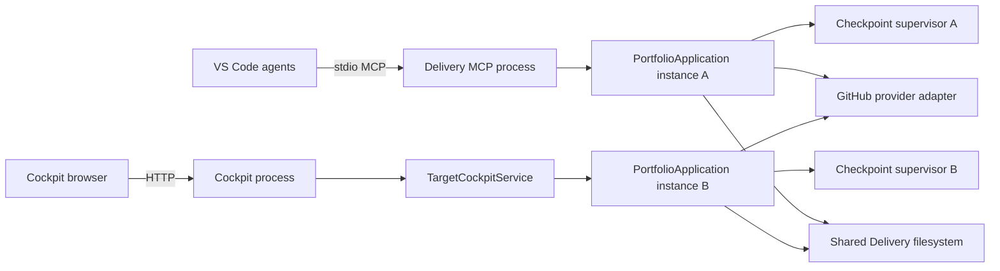
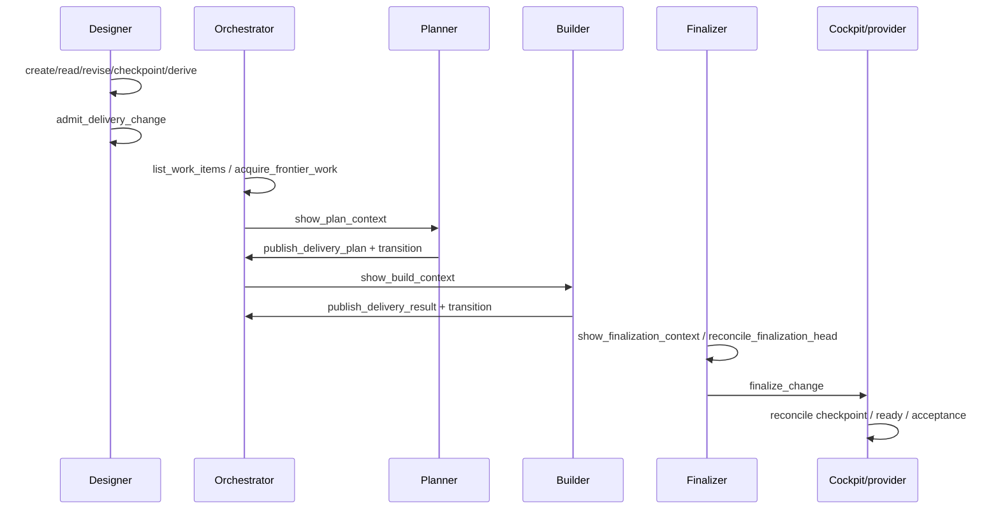

# Delivery Interface Usage Audit

> **Owning request:** User-requested full-depth Delivery interface analysis
> **Date:** 2026-09-11
> **Question:** Who uses which Delivery Python, HTTP, and MCP interfaces, when and why are they used, which surfaces are regular versus exceptional or compatibility-only, and where can the interface be reduced without weakening authority, custody, replay, or operator control?
> **Status:** Current-state research. No Delivery state, package, claim, MCP operation, commit, or source file was mutated by this audit.
> **Count update:** Application and MCP counts were refreshed at `eaef98036742b1d03ca7f7064c66411d0c5a50e9` after `recover_out_of_band_head` was added; the original analysis baseline remains recorded below.
> **Post-baseline implementation delta:** The additive facade now measures **69 public `PortfolioApplication` methods**, **57 registered MCP operations**, **247 root exports**, **22 unique explicit agent-granted Delivery operation names**, and **29 Cockpit Delivery routes**. The new live operation names are `get_change`, `answer`, and `repair_change`; the detailed 54-operation inventory and ownership tables below remain the `eaef980` historical baseline until the facade contract is finalized.
> **Implementation plan:** [Delivery Resilience Evolution Plan](delivery-resilience-evolution-plan.md) supersedes this audit's provisional implementation sequence and incorporates the later GPT-6 Astra and Claude Opus 5 challenges.

## 1. Executive Summary

Delivery has three related but distinct public boundaries:

1. **Core Python application:** `PortfolioApplication` is the domain-facing application boundary. It has **66 public methods** in the refreshed source baseline. It coordinates package authority, runtime state, claims, worktrees, exact commits, publication, provider observations, recovery, and completed history.
2. **Delivery MCP:** `TargetMCPAdapter` exposes **54 strict MCP operations**, registered from one data-driven operation tuple. The 54 operations map one-for-one to 54 application methods. They are not 54 arbitrary wrappers: their names, request models, error translation, annotations, and agent bindings form a transport contract.
3. **Cockpit HTTP:** `TargetCockpitService` exposes operator-facing HTTP routes over a separate application instance. It uses **24 of the 54 MCP-equivalent operations**, plus **five additional convenience or batch application methods**, plus one bound method reference for `portfolio_read_view`. The HTTP surface is not a thin mirror of MCP; it deliberately resolves some caller context server-side.

The most important result is that **MCP tool count is not currently the best reduction target**. The 54 tools are semantically named, strict, tested, and already protected by a prohibited-operation ledger. The highest-value reduction opportunities are instead:

- reduce the declared Python root re-export surface after a staged import migration;
- remove or privatize four `PortfolioApplication` methods with no production caller, after confirming no external consumer promise is intended;
- decide whether the current Cockpit-only convenience methods belong in the core application or in a dedicated operator service, without collapsing exact-identity safeguards;
- make the operator-console tool ownership explicit, because 13 MCP operations are referenced by repair skills but granted to no named agent and exposed by no Cockpit route;
- repair wiring and ownership defects before deleting anything, especially the finalizer's missing `promote_external_head` grant, the unsynchronized administrative config write path, and duplicate checkpoint supervisors.

No static source census can establish actual production frequency. The document therefore separates:

- **observed reachability:** a source caller, route, agent binding, or background constructor exists;
- **code-defined cadence:** a source declares a polling or retry interval;
- **workflow frequency class:** normal, routine operator, exceptional, compatibility, or test-only;
- **telemetry:** unavailable in the repository, so no request-count claim is made.

### 1.1 Recommended direction

Do not merge all MCP tools into a generic `delivery(operation=...)` dispatcher. Preserve semantic operation names while reducing the amount of manually mirrored contract knowledge through generated or contract-tested registries.

Pursue interface reduction in this order:

1. Establish a mechanically generated inventory and ownership test for all 54 operations.
2. Correct agent/skill grants and decide the owner of operator-console-only operations.
3. Remove or privatize the four test-only `PortfolioApplication` methods, subject to a deliberate external-consumer decision.
4. Reduce root re-exports in two stages: first names with no root importer, then test-only root imports after migrating tests to owning submodules.
5. Reassess the 12 Cockpit-only methods with a signature and authority matrix; do not merge exact-identity APIs with server-resolved convenience APIs merely because they have similar names.
6. Revisit MCP count only after the ownership and re-export work shows a concrete duplicated contract, not because 54 is visually large.

**Overall confidence:** High for current counts, registrations, caller classifications, and code-defined cadence. Medium for external-consumer absence and runtime frequency because static repository evidence cannot prove consumers outside this checkout or production call volume.

### 1.2 Post-baseline implementation reading

The current implementation adds a coherent `get_change` read projection, a version-bound `answer`
path for retained request resolution, and a proposal-backed `repair_change` path. A constrained
Repairer agent now owns only those high-level interactions, while Orchestrator may route an exact
Change-specific repair proposal to it. This is an additive migration boundary, not evidence that
the older low-level operations are ready for removal.

The three new MCP operations are intentionally absent from the historical matrix below. Refresh
the matrix only after request, block, disposition, and repair-proposal answer parity is complete;
otherwise the document would imply a final surface while the facade is still being shaped.

## 2. Scope, Method, And Evidence Limits

### 2.1 Scope

The audit covers:

- `serve/delivery/src/owlbear_delivery/` core Python modules;
- `serve/delivery-mcp/src/owlbear_delivery_mcp/` MCP models, adapter, registration, and startup;
- `serve/cockpit/src/owlbear_cockpit/` HTTP adapter and application startup;
- `serve/cockpit/web/src/` frontend API functions, polling hooks, and Delivery page usage;
- `serve/delivery-github/src/owlbear_delivery_github/` provider boundary;
- `serve/tools/src/owlbear_tools/` direct Delivery configuration and diagnostic utilities;
- `share/agents/`, `share/skills/`, `share/prompts/`, `.vscode/mcp.json`, and `seed/.vscode/mcp.json`;
- Delivery tests, Cockpit route/frontend tests, package-boundary tests, and export-contract tests;
- current Delivery research documents used as historical evidence or competing claims.

The audit does not treat the following as current production callers:

- generated Python indexes;
- `.owlbear/delivery/worktrees/**` copies;
- `.owlbear/scratch/**` copies;
- historical research prose without current source corroboration;
- test doubles, fixtures, and fake applications, except as evidence of an intentionally tested contract;
- external repositories, deployed installations, or production telemetry not present in this checkout.

### 2.2 Procedure

The investigation used:

1. direct source reads at the owning application, adapter, registration, and startup boundaries;
2. exact text searches for operation names, method names, imports, agent grants, skill references, and routes;
3. Python AST scans over the main checkout, excluding generated worktrees and scratch copies;
4. source-level comparison of the current `dev` head and the worktree during an intermediate phase;
5. direct inspection of tests that pin operation inventories, annotations, prohibited names, supervisor behavior, and exported names;
6. three independent Claude Opus 5 challenge checkpoints: initial interface-map correction, phase-change taxonomy challenge, and final grouping/consolidation challenge;
7. current repository status and commit identity checks before documenting the final baseline.

The original audit baseline and refreshed count baseline are:

| Fact | Current evidence |
| --- | --- |
| Branch | `dev` |
| Original audit HEAD | `8ff70e38ac280da9ffd97d216fd57aed9e36f36a` |
| Original audit counts | 53 MCP operations, 65 public `PortfolioApplication` methods, and 242 root exports |
| Refreshed count HEAD | `eaef98036742b1d03ca7f7064c66411d0c5a50e9` |
| Tracked worktree | Clean at the final baseline check |
| Untracked artifacts | Three active Delivery package directories, five `.owlbear/memory` files, and one unrelated research file were present and left untouched |
| Unique MCP operations | 54 |
| Public `PortfolioApplication` methods | 66 |
| Non-MCP public application methods | 12 |
| Root `owlbear_delivery.__all__` entries | 244 at the refreshed count baseline |
| Declared agent-granted Delivery tools | 19 |
| Cockpit methods corresponding to MCP operation names | 24 |
| Additional Cockpit-only application methods used by routes | 5, plus one bound `portfolio_read_view` reference |
| Cockpit Delivery HTTP route decorators | 29 in `routes/target_work.py` |
| Code-defined active portfolio polling | 3 seconds |
| Code-defined active acceptance reconciliation | 30 seconds, exponential backoff to 5 minutes after provider failure |
| Code-defined checkpoint supervisor interval | 5 seconds, batch limit 8 |

### 2.3 Evidence vocabulary

| Evidence class | Meaning | What it does not prove |
| --- | --- | --- |
| `registration-pinned` | The name is in the authoritative MCP operation tuple or test registry | That any user has called it in production |
| `production-call-site` | Current production source calls or references the method | How often the call executes |
| `agent-granted` | An agent frontmatter `tools:` list grants the operation | That the workflow actually selected it in a session |
| `skill-referenced` | A skill or prompt instructs the operation | That the invoking agent can call it or that the route is live |
| `route-reachable` | Cockpit HTTP and frontend code expose a route/function | Operator usage frequency |
| `code-defined-cadence` | A timer or loop specifies an interval | Real-world request volume or host uptime |
| `test-only` | Current production source has no caller but maintained tests exercise the surface | That removal is safe for external consumers |
| `compatibility` | Current code reads, normalizes, or validates an older shape | That a migration tool or old installation remains supported |
| `unresolved` | Static evidence cannot identify the owner or external reachability | Permission to delete or consolidate |

## 3. Sources Studied

| Source | Role in this audit | Evidence limit |
| --- | --- | --- |
| [`serve/delivery/README.md`](../../serve/delivery/README.md) | Declared core package boundary, configuration, lifecycle areas, and portability contract | Documentation, not a complete method inventory |
| [`serve/delivery-mcp/README.md`](../../serve/delivery-mcp/README.md) | Declared MCP operation groups, startup, and operator routes | Operation prose must be checked against registration |
| [`portfolio_application.py`](../../serve/delivery/src/owlbear_delivery/portfolio_application.py) | Owning application methods and sequencing | Large module; method-level paths were read at controlling boundaries, not every helper body |
| [`delivery_runtime.py`](../../serve/delivery/src/owlbear_delivery/delivery_runtime.py) | Frontier state machine and exact authority invariants | Runtime internals are not automatically public caller interfaces |
| [`change_workspace.py`](../../serve/delivery/src/owlbear_delivery/change_workspace.py) | Worktree, writer, publication lease, target-sync, recovery, and compatibility records | Core implementation, not a transport contract by itself |
| [`target_server.py`](../../serve/delivery-mcp/src/owlbear_delivery_mcp/target_server.py) | Authoritative 54-operation registry, annotations, strict flattening, adapter delegation, and error mapping | It does not show which agents or users invoke each operation |
| [`target_models.py`](../../serve/delivery-mcp/src/owlbear_delivery_mcp/target_models.py) | Strict MCP request/response models and transport constraints | Model existence does not prove workflow use |
| [`server.py`](../../serve/delivery-mcp/src/owlbear_delivery_mcp/server.py) | Live MCP application construction and checkpoint supervisor ownership | Separate process behavior is inferred from entry points, not host telemetry |
| [`target_work.py`](../../serve/cockpit/src/owlbear_cockpit/routes/target_work.py) | HTTP service adapter, route groups, and direct/bound core method references | HTTP route reachability does not prove UI use |
| [`target_context.py`](../../serve/cockpit/src/owlbear_cockpit/target_context.py) and [`main.py`](../../serve/cockpit/src/owlbear_cockpit/main.py) | Cockpit application construction and supervisor startup | Deployment topology remains environment-dependent |
| [`useWorkItems.ts`](../../serve/cockpit/web/src/hooks/useWorkItems.ts) | Frontend polling and acceptance reconciliation cadence | Code-defined schedule, not production telemetry |
| [`workItems.ts`](../../serve/cockpit/web/src/api/workItems.ts) | Frontend HTTP endpoint inventory | Does not prove the page is mounted or used |
| [`publication_provider.py`](../../serve/delivery/src/owlbear_delivery/publication_provider.py) | Provider seam and exact external operation vocabulary | Provider implementation is separately owned |
| [`github.py`](../../serve/delivery-github/src/owlbear_delivery_github/github.py) | Fixed GitHub provider implementation and timeouts | Does not prove live GitHub traffic in this audit |
| [`delivery_config.py`](../../serve/tools/src/owlbear_tools/delivery_config.py) | Direct administrative config read/write and blocker scan | It is a tool boundary, not the core application boundary |
| [`__init__.py`](../../serve/delivery/src/owlbear_delivery/__init__.py) | Root re-export surface | `__all__` alone does not remove explicit root attributes |
| [`test_delivery_adapter.py`](../../serve/delivery-mcp/tests/test_delivery_adapter.py) | Full operation delegation, strict validation, annotation, and prohibited-name contract | Tests prove asserted behavior only |
| [`test_target_server.py`](../../serve/delivery-mcp/tests/test_target_server.py) | Live assembled MCP registry and excluded tools | Does not prove agent invocation |
| [`test_checkpoint_supervisor.py`](../../serve/delivery/tests/test_checkpoint_supervisor.py) | Background supervisor retry/stop behavior | Does not test two independent supervisors sharing one runtime |
| [`test_init_exports.py`](../../tests/test_init_exports.py) | Root-export contract subset | It checks only eight named exports, not all 242 |
| [`w-design-session`](../../share/skills/w-design-session/SKILL.md), [`w-orchestration`](../../share/skills/w-orchestration/SKILL.md), [`w-frontier-planning`](../../share/skills/w-frontier-planning/SKILL.md), [`w-packet-building`](../../share/skills/w-packet-building/SKILL.md), [`w-change-finalization`](../../share/skills/w-change-finalization/SKILL.md) | Normal agent workflow ownership and operation ordering | Prose can drift from frontmatter grants |
| [`w-delivery-attention-resolution`](../../share/skills/w-delivery-attention-resolution/SKILL.md), [`w-target-conflict-resolution`](../../share/skills/w-target-conflict-resolution/SKILL.md), [`w-address-pr-feedback`](../../share/skills/w-address-pr-feedback/SKILL.md) | Operator and repair-only operation reachability | These skills have no owning agent declaration in the shared agent set |
| [`.vscode/mcp.json`](../../.vscode/mcp.json) and [`seed/.vscode/mcp.json`](../../seed/.vscode/mcp.json) | Current and seeded MCP process wiring | Configuration shows possible launch topology, not active processes |
| [`delivery-system-audit-2026-09-05.md`](delivery-system-audit-2026-09-05.md) | Prior Delivery audit and historical findings | Its 52-operation count is stale; current source is authoritative |
| [`delivery-data-worktree-commit-lifecycle.md`](delivery-data-worktree-commit-lifecycle.md) | Data and custody lifecycle context | It is a lifecycle study, not a caller-frequency census |

## 4. System Topology And Ownership

### 4.1 Runtime topology



The important ownership fact is that Cockpit and Delivery MCP do **not** share an in-process `PortfolioApplication` instance. Each process constructs its own application and its own `DeliveryCheckpointSupervisor` against the same workspace roots. `locked_roots()` provides descriptor-backed filesystem locking for canonical roots, but it does not make the two application objects one coherent scheduler and does not eliminate duplicate background observation.

### 4.2 Core package modules

| Module | Responsibility hidden behind it | Main callers | Interface depth assessment |
| --- | --- | --- | --- |
| `design_package.py` | Authored Design bytes, manifest identity, compare-and-swap revision, package checkpoint Git history | Designer path, admission, Cockpit Design view, tests | Deep: hides file transactions, manifest verification, and Git checkpoint mechanics |
| `target_contract.py` / `delivery_contract_discovery.py` | Compile authored intent/design into source-bound executable authority | Designer and admission | Deep: callers receive typed compilation result rather than implementing parsing/identity rules |
| `delivery_admission.py` | Validate quiescence, publish contract/frontier/receipt transactionally, carry forward unaffected outcomes | Admission application path, tests | Deep and authority-bearing; not a generic CRUD wrapper |
| `delivery_runtime.py` | Frontier state machine, claim state, task/result/finalization/attention/acceptance invariants | `PortfolioApplication`, tests | Deep internal state owner; broad model exports are mostly test-facing |
| `change_workspace.py` | Branch/worktree custody, writer identity, publication lease, exact target sync, external head adoption, quarantine, cleanup | `PortfolioApplication`, tests, recovery workflows | Deep and safety-critical; deletion would move custody complexity into callers |
| `change_publication.py` | Exact remote Change-branch publication and replay | `PortfolioApplication`, tests | Deep provider-independent publication seam |
| `draft_pull_request.py` | Draft PR creation/update, generated summary, draft-state mutation, provider observations, publication history | `PortfolioApplication`, GitHub provider, tests | Deep external publication seam |
| `publication_provider.py` | Fixed provider protocol and transport-neutral evidence models | Core and GitHub adapter | Justified seam: true external service dependency |
| `delivery_state.py` | Sanitized remote state snapshots, bootstrap, CAS publication, replay | Loader/application, tests | Deep portability/recovery boundary |
| `completed_history.py` | Receipt-backed completion and abandonment projections, pagination, search | Application, Cockpit/MCP history routes, tests | Deep read model; history is not runtime authority |
| `portfolio_application.py` | Composes all preceding owners into lifecycle-safe caller operations | MCP adapter, Cockpit service, supervisor, tests | Broad but deep. Splitting by line count alone would risk scattering locks and identity checks |
| `checkpoint_supervisor.py` | Host-lifetime retry loop for pending state/checkpoint publication | MCP and Cockpit startup | Small lifecycle adapter; duplicated per process |
| `storage_io.py` / `runtime_transaction.py` | Cross-process root locks, atomic writes, crash recovery | Core stores and some tools | Infrastructure seam; callers should not reproduce it |

### 4.3 The application boundary

`PortfolioApplication` is the correct semantic boundary for lifecycle callers because it concentrates:

- runtime reconciliation before reads and mutations;
- checkpoint locks and acquisition locks;
- exact claim, attempt, writer, branch, and head identity checks;
- provider observation and response-unknown handling;
- durable state publication and replay;
- recovery and quarantine decisions;
- projection assembly for operator views.

The module is wide, but the deletion test supports it: removing the application boundary would force MCP, HTTP, supervisors, and future callers to coordinate the same identities, locks, provider calls, and durable state transitions independently. The likely improvement is **smaller named internal responsibilities or generated adapters**, not a second application layer that merely forwards the same methods.

## 5. Authoritative Interface Counts

### 5.1 MCP registration is data-driven

The current MCP registry is defined by `DELIVERY_OPERATION_NAMES` and `DELIVERY_OPERATION_ANNOTATIONS` in [`target_server.py`](../../serve/delivery-mcp/src/owlbear_delivery_mcp/target_server.py). `register_target_tools()` loops over that mapping, creates one flattened tool per adapter method, and installs an `extra="forbid"` Pydantic argument model.

This matters because a decorator grep, a method-count grep, or a README count is not an exhaustive registry check. The authoritative equality that should remain mechanically tested is:

```python
tuple(DELIVERY_OPERATION_ANNOTATIONS) == DELIVERY_OPERATION_NAMES
```

### 5.2 Operation annotation buckets

The source names five constants, but the wire-level annotation values form four distinct buckets:

| Wire bucket | Operations | Count | Meaning |
| --- | --- | ---: | --- |
| Read-only/idempotent/non-destructive | `_READ` | 17 | Reads or provider observations projected as read tools |
| Idempotent write/non-destructive | `_WRITE` | 30 | Replay-safe state/publication/recovery operations |
| Non-idempotent write/non-destructive | `_OPERATOR_WRITE` and `_ACQUIRE` | 4 | `resolve_request`, `clear_block`, `administrative_move`, `acquire_frontier_work`; `_ACQUIRE` and `_OPERATOR_WRITE` have identical wire values |
| Idempotent/destructive | `_CLEANUP` | 3 | The three explicit worktree cleanup operations |

The source-level distinction between acquire and operator write is useful documentation, but not observable through the current MCP annotation values. It should not be used as the main argument for retaining separate transport categories.

### 5.3 Core versus MCP versus Cockpit

| Surface | Count | What the count means |
| --- | ---: | --- |
| `PortfolioApplication` public methods | 66 | Direct application-level methods defined on the class |
| MCP-exposed application methods | 54 | Exact same-name methods represented by strict MCP tools |
| Public methods not MCP-exposed | 12 | Mostly Cockpit convenience/batch/projection methods, plus test/internal-only methods |
| Root `__all__` names | 244 | Re-export declarations from the core package root, including models, errors, providers, stores, and application types |
| Agent frontmatter Delivery grants | 19 | Explicit `owlbear-delivery/<name>` entries in named shared agents |
| Cockpit methods matching MCP names | 24 | Core operation names called by `TargetCockpitService` |
| Cockpit-only application methods | 5 direct plus one bound reference | Server-resolved convenience, batch, or aggregate methods not represented in MCP |

The refreshed 244 root names are not 244 production consumers. The original AST census over 235
unique main-checkout Python source/test files, plus the two added submodule-used recovery names,
found:

| Export class | Count | Interpretation |
| --- | ---: | --- |
| Root-imported by non-test production packages | 17 | Highest-confidence cross-package root API |
| Root-imported only by tests | 144 | Test coupling; not proof of external API demand |
| No root importer but referenced through submodule/name use | 82 | Candidates for root re-export declaration reduction; exact import migration is not needed if only `__all__` is changed |
| No AST name/reference beyond the root export declaration | 1 | `RequiredPublicationChecksFailedError`; strongest local dead-export candidate |

These counts are repository-local and static. They do not prove that an external consumer does not use an explicit root import, and `__all__` reduction alone does not remove an attribute still imported into `__init__.py`.

## 6. Full MCP Operation Inventory

The following table is the historical refreshed 54-operation contract at `eaef980`. `Use class` is
the usage grouping developed in this audit, not runtime telemetry. The post-baseline additive
operations are `get_change`, `answer`, and `repair_change`; see section 1.2 for their current
ownership and migration status.

### 6.1 Design and admission

| Operation | Core purpose | Primary caller | Use class | Reduction view |
| --- | --- | --- | --- | --- |
| `create_design_session` | Create or replay authored intent/design package | Designer | Hot normal | Keep; creates durable authority identity |
| `read_design_session` | Read verified package bytes and package ID | Designer, Cockpit Design view | Hot normal and routine read | Keep; exact rehydration boundary |
| `revise_design_session` | CAS-replace authored package and clear generated authority | Designer | Hot normal when design changes | Keep; CAS semantics are distinct from create |
| `publish_design_checkpoint` | Checkpoint verified package history without product refs | Designer | Hot normal gate | Keep; package history is distinct from Change branch |
| `derive_delivery_contract` | Compile package to typed Delivery authority without admission | Designer | Hot normal gate/read | Keep; compiler boundary |
| `admit_delivery_change` | Publish source-bound contract/frontier/receipt and ensure workspace | Designer | Hot normal, once per admitted Change | Keep; atomic admission boundary |

### 6.2 Portfolio projection and operator reads

| Operation | Core purpose | Primary caller | Use class | Reduction view |
| --- | --- | --- | --- | --- |
| `list_work_items` | Return bounded semantic work-item projections | Orchestrator, MCP clients | Hot normal orchestration read | Keep; distinct flat projection from Cockpit grouped view |
| `delivery_health` | Return bounded quarantined/unavailable-state diagnostics | Orchestrator on hint, MCP operator | Hot conditional/operator read | Keep; must remain read-only and typed |
| `list_retained_change_worktrees` | Show retained worktree custody and cleanup/recovery facts | Repair skill/operator | C-prime operator console | Keep until guided Cockpit route exists |
| `show_work_item` | Show one exact semantic work item by MCP Work Item ID | MCP operator/repair callers | C-prime operator console | Keep; key semantics differ from detailed view |
| `show_work_item_view` | Show rich semantic/operator detail by detail key | Cockpit HTTP through matching method | Routine operator read | Keep; it enriches cleanup/conflict/finalization detail |
| `show_operator_context` | Show exact outcome block/request/claim/recovery context | Repair skill/operator | C-prime operator console | Keep; not a generic work-item view |
| `preview_administrative_move` | Calculate invalidation closure without mutation | Cockpit/operator | Routine operator read before mutation | Keep; preview is a safety boundary |
| `show_integration_attention` | Read one typed Integration attention | Repair skill/operator | C-prime operator console | Keep until guided route replaces skill |
| `list_completed_changes` | Page receipt-backed completion/abandonment history | Cockpit history | Routine operator read | Keep; pagination/history contract |
| `search_completed_changes` | Search bounded completed-history summaries | Cockpit history | Routine operator read | Keep; query/cursor semantics differ from list |
| `show_completed_change` | Read one exact history record | Cockpit history | Routine operator read | Keep; exact identity/error semantics |

### 6.3 Orchestration, planning, build, and finalization

| Operation | Core purpose | Primary caller | Use class | Reduction view |
| --- | --- | --- | --- | --- |
| `acquire_frontier_work` | Recover eligible claims and activate up to capacity | Orchestrator | Hot normal loop | Keep; non-idempotent acquisition authority |
| `show_plan_context` | Project exact Planning claim context | Planner | Hot normal per Planning claim | Keep; stage-specific typed context |
| `show_build_context` | Project exact Build task/writer context | Builder | Hot normal per Build claim | Keep; custody-specific typed context |
| `publish_delivery_plan` | Store validated claim-bound task chain candidate | Planner | Hot normal per Planning claim | Keep; unioning with result would weaken type/role clarity |
| `publish_delivery_result` | Store exact-commit reviewed Build result candidate | Builder | Hot normal per Build task | Keep; exact commit and reviewer evidence are distinct |
| `transition_delivery` | Apply worker-owned transition unchanged | Orchestrator | Hot normal per handled launch | Keep; mechanical transition authority |
| `show_finalization_context` | Resolve current exact Change head/readiness | Finalizer | Hot normal once per finalization attempt | Keep; current head and custody are engine-derived |
| `reconcile_finalization_head` | Retain/invalidate finalization from current head/provider evidence | Finalizer, Cockpit-adjacent workflows | Hot conditional before finalization | Keep; reconciliation differs from finalization mutation |
| `finalize_change` | Persist exact-head observations and independent review receipt | Finalizer | Hot normal once per Change head | Keep; terminal proof boundary |
| `recover_claim` | Preserve/restart exact failed Planner/Builder claim | Orchestrator, Cockpit | C exceptional; can be routine after dispatch failure | Keep; claim identity and dirty-byte preservation are safety-critical |
| `recover_integration_repair_claim` | Recover retained legacy Integration repair claim | Orchestrator/repair skill | C-prime legacy/operator | Keep only while legacy claim state remains readable; do not merge with outcome claim recovery without state proof |

### 6.4 Publication and acceptance

| Operation | Core purpose | Primary caller | Use class | Reduction view |
| --- | --- | --- | --- | --- |
| `repair_delivery_state_snapshot` | Confirmed repair of one known local frontier successor | Repair skill/operator | C-prime operator console | Keep; confirmation-gated authority-gap repair |
| `recover_out_of_band_head` | Preserve an out-of-band local head and restore the exact reviewed remote head | Repair skill/operator | C-prime operator console | Keep until high-level repair can derive and preserve all three head identities |
| `repair_target_sync_publication` | Confirmed repair of committed target merge/publication mismatch | Repair skill/operator | C-prime operator console | Keep; binds three exact heads plus operation identity |
| `observe_change_publication_checks` | Observe provider checks at exact published head | Cockpit, repair skill | B routine operator/provider read | Keep; provider-crossing read is not represented by `open_world_hint` |
| `mark_change_ready` | Mark exact finalized published PR ready | Skill-only currently; Cockpit uses convenience wrapper | B routine operator publication | Keep exact request form; grant/route ownership must be corrected |
| `prepare_review_repair` | Return open PR to draft and invalidate old finalization | PR feedback workflow | C exceptional repair | Keep; not equivalent to generic attention resolution |
| `reconcile_change_checkpoint` | Reconcile one checkpoint and raise bounded failures | Cockpit, repair workflows | B routine operator publication | Keep single-operation error contract |
| `sync_change_with_target` | Fetch/merge exact configured target into managed Change | Target-conflict workflow | C exceptional, sometimes publication routine | Keep exact-target form; current-target wrapper is a separate convenience |
| `adopt_external_head` | Adopt exact remote Change descendant without granting review authority | Attention workflow | C exceptional | Keep; adoption is provenance, not promotion |
| `promote_external_head` | Explicitly grant review authority to adopted head | Attention/finalization workflow | C exceptional | Keep; exact promotion must remain distinct from adoption |
| `abort_target_sync_conflict` | Abort preserved merge conflict and clear exact conflict | Cockpit/target-conflict workflow | C exceptional | Keep; abort and resolve are mutually exclusive outcomes |
| `resolve_target_sync_conflict` | Validate and commit a reviewed target merge | Cockpit/target-conflict workflow | C exceptional | Keep; Delivery owns merge identity and two-parent proof |
| `supersede_publication` | Publish successor branch/PR for exact publication attention | Cockpit/repair skill | C exceptional | Keep exact predecessor identity form |
| `observe_acceptance` | Complete one Change from fresh exact merged-PR evidence | Cockpit/repair skill | B routine terminal observation | Keep; not a proposal or merge operation |
| `resolve_change_disposition` | Clear one exact provider/publication/acceptance attention | Cockpit/repair skill | C exceptional | Keep; does not restore ready/publication authority |

### 6.5 Lifecycle disposition and cleanup

| Operation | Core purpose | Primary caller | Use class | Reduction view |
| --- | --- | --- | --- | --- |
| `defer_change` | Pause one Change while retaining state/worktree | Cockpit/attention skill | C exceptional operator disposition | Keep; user disposition differs from failure recovery |
| `resume_change` | Resume one exact deferred Change | Cockpit/attention skill | C exceptional operator disposition | Keep; not a generic state setter |
| `abandon_change` | Terminal user abandonment | Cockpit/attention skill | C exceptional destructive disposition | Keep; irreversible semantic meaning |
| `cleanup_abandoned_change_worktree` | Remove eligible abandoned worktree | Cockpit | C exceptional cleanup | Keep; branch/evidence retention differs from completed cleanup |
| `cleanup_abandoned_change_worktree_after_target_sync_discard` | Discard retained abandoned merge then clean | Cockpit/attention skill | C exceptional destructive cleanup | Keep; explicit discard confirmation is not generic cleanup |
| `cleanup_completed_change_worktree` | Remove eligible completed worktree with completion ID | Cockpit | C exceptional cleanup | Keep; receipt-gated terminal cleanup |
| `recover_change_worktree` | Recreate missing managed worktree from reviewed authority | Cockpit/attention skill | C exceptional recovery | Keep; not cleanup or branch adoption |

The full inventory shows why a generic “execute Delivery operation” tool would be a poor first reduction: operations with similar verbs often differ in whether they accept caller identities, resolve identities server-side, cross a provider boundary, create a commit, preserve bytes, clear authority, or require destructive confirmation.

## 7. Python Application Surface And Direct Callers

### 7.1 The 12 public methods outside MCP

| Method | Current production evidence | Classification | Meaning |
| --- | --- | --- | --- |
| `adopt_external_head_after_acceptance_attention` | Cockpit service and route | Cockpit-only | Stricter acceptance-attention-bound adoption; not redundant with generic adoption |
| `cleanup_change_worktree` | Called by `cleanup_abandoned_change_worktree` and `cleanup_completed_change_worktree` inside `PortfolioApplication` | Public but internal-only | Shared cleanup implementation boundary; candidate for private rename after call-site/test review |
| `list_integration_attention` | No production source caller; many tests | Test-only candidate | Stable projection useful to tests, but no current MCP/Cockpit/agent consumer |
| `list_work_item_groups` | No production source caller; Cockpit fakes implement it | Test-scaffold candidate | Strongest dead-method candidate; current production uses `portfolio_read_view().groups` |
| `mark_current_change_ready` | Cockpit service and route | Cockpit-only | Resolves current finalization server-side before exact core call |
| `portfolio_operating_view` | No production caller; used in tests; `portfolio_read_view` composes the same private projection | Test-only wrapper candidate | Pure public convenience wrapper with no production need found |
| `portfolio_read_view` | Cockpit service uses it as a bound method passed to `_invoke` | Cockpit-only aggregate | Single immutable capture of groups, operating facts, and health |
| `reconcile_awaiting_acceptance` | Cockpit batch acceptance route and frontend hook | Cockpit-only batch | Bounded batch/fairness/cursor contract differs from single acceptance observation |
| `reconcile_pending_checkpoints` | `DeliveryCheckpointSupervisor` only | Background-host API | Failure-tolerant batch used by each live host process |
| `show_change_checkpoint_publication` | No production source caller; tests | Test-only candidate | Checkpoint queue inspection can potentially move behind test/runtime diagnostic boundary |
| `supersede_current_publication` | Cockpit service and route | Cockpit-only | Reads current provider publication identity before exact supersession |
| `sync_change_with_current_target` | Cockpit service and route | Cockpit-only | Resolves configured target head before exact target-sync operation |

The `PortfolioApplication` method `cleanup_change_worktree` is not dead: it is the shared implementation used by two public terminal cleanup routes. Its public visibility is the issue, not its behavior.

### 7.2 Direct application callers

| Caller | Boundary | What it owns |
| --- | --- | --- |
| `TargetMCPAdapter` | MCP transport | Strict request validation, flattened schema, error classification, JSON/model serialization, async dispatch choice |
| `TargetCockpitService` | HTTP transport | Route-specific request models, HTTP status/error projection, server-side identity resolution, response projection |
| `DeliveryCheckpointSupervisor` | Background host thread | Retry cadence and bounded checkpoint batch; core owns checkpoint semantics |
| `delivery_application_loader.py` | Composition | Builds all core stores, coordinators, publishers, and runtime instances |
| `serve/tools/delivery_config.py` | Administrative tool | Reads Delivery config/runtime paths and writes tracked config directly; does not use the application boundary |
| Delivery tests | Verification | Exercise core methods, models, and internal seams directly; this is not production usage |

The core package itself has many internal method calls that are not external interface use. For interface reduction, distinguish:

- **application boundary methods:** transport/host callers should use these;
- **runtime methods:** application-owned state machine operations;
- **model factories and records:** callers construct evidence but do not own persistence;
- **storage/workspace helpers:** internal seams that should not be promoted to MCP.

### 7.3 Application method families

| Family | Representative methods | Normal caller |
| --- | --- | --- |
| Design package | `create_design_session`, `read_design_session`, `revise_design_session`, `publish_design_checkpoint` | Designer, Cockpit Design view |
| Compilation/admission | `derive_delivery_contract`, `admit_delivery_change` | Designer |
| Acquisition/worker context | `acquire_frontier_work`, `show_plan_context`, `show_build_context`, `transition_delivery` | Orchestrator, Planner, Builder |
| Worker publication | `publish_delivery_plan`, `publish_delivery_result` | Planner, Builder |
| Finalization | `show_finalization_context`, `reconcile_finalization_head`, `finalize_change` | Finalizer |
| Provider publication | `reconcile_change_checkpoint`, `observe_change_publication_checks`, `mark_change_ready`, `observe_acceptance` | Cockpit/operator/workflows |
| Target/head operations | sync, adoption, promotion, conflict abort/resolve, supersession | Operator repair/workflows |
| Disposition | attention resolution, defer/resume/abandon, request/block/admin move | Cockpit/operator |
| Custody/recovery | claim, worktree, publication baseline, snapshot, target-sync repair | Operator/Orchestrator/supervisor |
| Projection/history | work items, health, operator context, completed history | Cockpit/MCP/operator |

## 8. HTTP And Frontend Usage

### 8.1 Cockpit route groups

`TargetCockpitService` is the HTTP adapter. Its route groups are:

| HTTP group | Methods | User reason | Cadence/use class |
| --- | --- | --- | --- |
| `GET /api/work-items` | `portfolio_read_view` | Current grouped portfolio, operating guidance, health | Code-defined every 3 seconds while current Delivery view is open |
| `GET /api/changes/{id}/work-items/{key}` | `show_work_item_view` | Selected semantic/operator detail | Code-defined every 3 seconds while detail is open |
| `GET /api/design-work/{id}` | `read_design_session` | Inspect unadmitted Design sources | Code-defined every 3 seconds while Design detail is open |
| `GET /api/work-items/completed*` | list/search/show history | Inspect terminal records | On-demand; paginated, not polling by the Delivery hook |
| request/block/claim controls | resolve request, clear block, recover claim, administrative move | User/operator intervention | On-demand |
| publication controls | reconcile checkpoint, mark ready, observe checks, observe acceptance | Advance or inspect provider publication | On-demand, plus acceptance batch loop |
| acceptance batch | `reconcile_awaiting_acceptance` | Observe awaiting-merge Changes without one request per row | Code-defined every 30 seconds; backoff to 5 minutes on provider failure |
| target controls | current-target sync, abort/resolve conflict | Bring a Change to current integration target | On-demand |
| lifecycle controls | defer/resume/abandon | User disposition | On-demand |
| worktree controls | cleanup abandoned/completed, discard-and-clean, recover | Explicit custody maintenance | On-demand and confirmation-gated |

The frontend API module [`workItems.ts`](../../serve/cockpit/web/src/api/workItems.ts) is a one-to-one HTTP client for these route families. The frontend does not call `PortfolioApplication` or MCP directly.

### 8.2 Polling does not equal tool frequency

The frontend uses a shared `usePollingFetch` hook with an in-flight guard, visibility handling, abort behavior, and a pending-poll coalescer. This gives a **code-defined upper schedule** for active pages, not a production count:

- portfolio view: 3 seconds;
- selected work-item detail: 3 seconds;
- selected Design detail: 3 seconds;
- acceptance reconciliation: initial visible poll, then 30 seconds, exponential backoff to 5 minutes after provider failure;
- publication checks: explicit user action, not the general 3-second detail polling;
- history: initial/on-demand page requests, not the active portfolio timer.

The application method `observe_change_publication_checks` is the only current read annotation that clearly crosses the external provider boundary. Its transport annotation does not express that remote I/O dimension.

## 9. Agent And Skill Ownership

### 9.1 Normal agent chain



### 9.2 Declared grants and unowned operator-console tools

At the historical baseline, only **19 of 54** operation names occurred in named agent `tools:` lists.
The current post-baseline census has **22 unique explicitly granted operation names** because
`get_change` is granted to Orchestrator and Repairer, while `answer` and `repair_change` are granted
to Repairer. The historical explicitly granted operations were:

`acquire_frontier_work`, `admit_delivery_change`, `create_design_session`, `delivery_health`, `derive_delivery_contract`, `finalize_change`, `list_work_items`, `publish_delivery_plan`, `publish_delivery_result`, `publish_design_checkpoint`, `read_design_session`, `reconcile_finalization_head`, `recover_claim`, `recover_integration_repair_claim`, `revise_design_session`, `show_build_context`, `show_finalization_context`, `show_plan_context`, `transition_delivery`.

The following **13 operations are referenced by repair/operator skills, granted to no named shared agent, and have no same-named `PortfolioApplication` call in the current Cockpit service**:

`adopt_external_head`, `list_retained_change_worktrees`, `mark_change_ready`, `prepare_review_repair`, `promote_external_head`, `recover_out_of_band_head`, `recover_publication_baseline`, `repair_delivery_state_snapshot`, `repair_target_sync_publication`, `show_integration_attention`, `show_operator_context`, `show_work_item`, `sync_change_with_target`.

This same-name classification does not mean all behavior is absent from Cockpit. Cockpit reaches
readiness, target sync, detailed work-item lookup, and acceptance-attention adoption through
server-resolved convenience methods and routes (`mark_current_change_ready`,
`sync_change_with_current_target`, `show_work_item_view`, and
`adopt_external_head_after_acceptance_attention`).

This is not proof that the operations are unreachable. The universal system instruction advertises `owlbear-delivery/*`, and VS Code tool search may expose tools beyond an agent's explicit frontmatter. The repository does not contain a deterministic proof that dynamic tool search bypasses the closed allowlist. This is a decision-critical wiring gap:

- if frontmatter is authoritative, the three operator skills have no owning agent and their instructions are currently non-executable;
- if tool search can grant dynamically, the agent authority model is less closed than the frontmatter suggests;
- either way, a standing contract test should compare tool references, agent grants, and actual invocability.

### 9.3 Confirmed grant mismatch

[`w-change-finalization`](../../share/skills/w-change-finalization/SKILL.md) says that finalization owns the finalization-bound `promote_external_head` step for a completed adopted Change. [`finalizer.agent.md`](../../share/agents/finalizer.agent.md) does not grant `promote_external_head`. This is a concrete workflow/interface mismatch, not a speculative frequency issue. The smallest correction is to decide whether the finalizer should receive that exact operation or whether the skill should hand off to an explicitly granted operator route; do not silently make the call through an unlisted tool.

## 10. Usage Frequency And Lifecycle Groups

### 10.1 Group A — Hot normal process

These operations are part of the intended Design-to-finalization worker chain. They are likely the highest call volume per active Change, but exact counts are unavailable.

| Surface | Operations | Evidence |
| --- | --- | --- |
| Design | `create_design_session`, `read_design_session`, `revise_design_session`, `publish_design_checkpoint`, `derive_delivery_contract`, `admit_delivery_change` | Designer grants and design skill procedure |
| Orchestration | `list_work_items`, `acquire_frontier_work`, `delivery_health` when acquisition supplies a hint, `transition_delivery` | Orchestrator grants and orchestration skill |
| Planning | `show_plan_context`, `publish_delivery_plan` | Planner grants and planning skill |
| Build | `show_build_context`, `publish_delivery_result` | Builder grants and build skill |
| Finalization | `show_finalization_context`, `reconcile_finalization_head`, `finalize_change` | Finalizer grants and finalization skill |

Important qualifiers:

- `delivery_health` is conditional rather than every-cycle hot path: the orchestration skill calls it only when acquisition returns a non-empty health hint.
- `reconcile_finalization_head` is conditional when an existing finalization ID/head needs reconciliation.
- `transition_delivery` is one worker result per handled launch, not a general board update.

### 10.2 Group B — Routine operator/publication process

These operations are not necessarily per task, but are part of the ordinary published-Change tail and the active Cockpit experience:

- `reconcile_change_checkpoint` after finalization or a meaningful checkpoint;
- `observe_change_publication_checks` on explicit user inspection;
- `mark_change_ready` after exact finalization and checkpoint publication;
- `observe_acceptance` as an explicit user retry/observation;
- `reconcile_awaiting_acceptance` through Cockpit's 30-second code-defined batch loop;
- `list_completed_changes`, `search_completed_changes`, and `show_completed_change` on history navigation;
- `portfolio_read_view` and `show_work_item_view` through 3-second Cockpit polling.

These are normal from the product perspective even though some are user-driven rather than agent-driven.

### 10.3 Group B-plus — Background host maintenance

`reconcile_pending_checkpoints` is neither an agent operation nor a user click. It is called by a `DeliveryCheckpointSupervisor` thread every 5 seconds with a batch limit of 8 in each MCP and Cockpit process.

The current implementation suppresses exceptions in the supervisor loop, while the durable checkpoint result records failure state. This preserves host liveness but makes supervisor health less observable. Two separate host processes can also run the same loop against one workspace. The correct consolidation decision depends on whether Cockpit and MCP are supported concurrently:

| Option | Benefit | Risk | Confidence |
| --- | --- | --- | --- |
| Keep both supervisors; rely on per-Change locks | No topology change; each host remains self-healing | Duplicate provider/Git reads and hidden failures; two retry schedules | High that behavior is currently possible |
| Elect one supervisor owner | Removes duplicate background work | Requires a durable host ownership/lease contract and behavior when owner dies | Medium; not justified without supported-topology decision |
| Keep both but make reconciliation lock/metrics explicit | Smallest change; duplicate attempts become visible | Does not eliminate duplicate wakeups/provider reads | Medium-high; likely best first observation step |

### 10.4 Group C-prime — Operator-console and repair skill surface

These are user/operator operations reachable in skill prose but not currently granted to a named shared agent or exposed as Cockpit routes:

`adopt_external_head`, `list_retained_change_worktrees`, `mark_change_ready`, `prepare_review_repair`, `promote_external_head`, `recover_publication_baseline`, `repair_delivery_state_snapshot`, `repair_target_sync_publication`, `show_integration_attention`, `show_operator_context`, `show_work_item`, `sync_change_with_target`.

This is the most important usage-category distinction missed by the first inventory. They are not “unused”; they are **console-only or skill-only by current repository wiring**, with ownership unresolved. Their likely invocation rate is rare and user-driven, but that is an inference from workflow shape, not measured data.

### 10.5 Group C — Exceptional repair, recovery, and destructive disposition

These operations preserve safety during failure or intentional user disposition:

- target sync and conflict: `sync_change_with_target`, `abort_target_sync_conflict`, `resolve_target_sync_conflict`;
- external head: `adopt_external_head`, `promote_external_head`;
- publication repair: `prepare_review_repair`, `supersede_publication`, `repair_target_sync_publication`, `recover_publication_baseline`;
- state repair: `repair_delivery_state_snapshot`;
- attention/request/block: `resolve_change_disposition`, `resolve_request`, `clear_block`, `administrative_move`, `preview_administrative_move`;
- claim/worktree recovery: `recover_claim`, `recover_integration_repair_claim`, `recover_change_worktree`;
- lifecycle disposition: `defer_change`, `resume_change`, `abandon_change`;
- cleanup: the three `cleanup_*_worktree` operations.

These should not be compressed into a single “repair” operation. Their conservation boundaries differ:

| Boundary | Distinct value that would be lost by generic merge |
| --- | --- |
| Attention resolution | Clears an exact disposition but does not recreate provider authority |
| Target conflict abort | Discards a preserved merge attempt only after exact identity checks |
| Target conflict resolve | Commits a two-parent merge and invalidates finalization |
| Adoption | Records provenance without review authority |
| Promotion | Grants review authority only after adoption evidence |
| Claim recovery | Preserves dirty bytes and writer custody before reset/release |
| Worktree cleanup | Destructive filesystem action with lifecycle-specific receipt preconditions |
| Abandonment/defer | User semantic disposition, not infrastructure failure handling |
| Review repair preparation | Returns provider PR to draft and invalidates finalization/ready authority |

### 10.6 Group D — Compatibility and legacy acceptance

Current compatibility is concentrated in core model loading and receipt validation, not in a current standalone Delivery migration package:

- `ChangeCoordination` before-validators discard retired publication reservation fields and normalize persisted list forms;
- `DeliveryFrontier` discards stale target-sync receipts when a matching conflict is present;
- `PublicationPullRequestObservationReceipt` accepts a legacy provider-evidence/identity digest shape when newer mergeability fields are absent;
- `CapacityLedger` remains a model/export and legacy artifact reader/test subject, while current loader behavior ignores `capacity-ledger.json` as active authority;
- tests preserve migrated-frontier, legacy-baseline, retired reservation, and legacy observation behavior;
- MCP explicitly excludes 15 old operation names, including `start_job`, `finish_plan`, `finish_build`, `finish_assembly`, `return_delivery`, and other prior lifecycle vocabulary.

There is no evidence in the current `serve/tools/src/owlbear_tools/` tree of the historical `delivery_migration.py` or `delivery_integration_retirement.py` modules referenced by older research. Those references must not be treated as live callers.

Compatibility logic is not one uniform category:

| Compatibility kind | Current owner | Disposition |
| --- | --- | --- |
| Persisted-shape normalization | `change_workspace.py`, `delivery_runtime.py` | Keep until supported state inventory proves deletion safe |
| Legacy evidence digest acceptance | `draft_pull_request.py` | Keep or version-gate; it validates historical receipts, not active workflow |
| Ignored obsolete capacity artifact | application loader/tests | Keep read-only ignore behavior while old workspaces may contain it |
| Retired MCP operation names | MCP contract tests | Keep absence test; do not reintroduce aliases |
| Historical research/migration prose | `.owlbear/research/` | Mark stale when source no longer exists; do not count as active interface |

### 10.7 Group E — Test-only and structural surfaces

The strongest current test-only public `PortfolioApplication` methods are:

- `list_integration_attention`;
- `list_work_item_groups`;
- `portfolio_operating_view`;
- `show_change_checkpoint_publication`.

`cleanup_change_worktree` is public but internally called by the two lifecycle-specific cleanup methods, so it is not test-only. Many of the 244 root exports are test-imported models and error types; test use proves valuable verification access, not necessarily an intended consumer API.

Tests also preserve fake applications and adapter records. They should be classified separately from live callers because they intentionally test the transport contract at the boundary.

## 11. Similarity And Consolidation Analysis

### 11.1 Candidates that should not be merged now

| Candidate | Apparent similarity | Hidden difference | Disposition |
| --- | --- | --- | --- |
| `show_plan_context` / `show_build_context` / `show_finalization_context` | All return “context” | Different claim/custody/head invariants and different worker ownership | Keep separate typed operations |
| `publish_delivery_plan` / `publish_delivery_result` | Both publish worker output | Planning task-chain authority differs from exact-commit reviewed result | Keep separate |
| `observe_acceptance` / `reconcile_awaiting_acceptance` | Both inspect acceptance | Single exact completion receipt versus bounded batch with per-Change statuses/cursor | Keep separate |
| `reconcile_change_checkpoint` / `reconcile_pending_checkpoints` | Both publish checkpoints | One exact operation raises bounded failure; one drains siblings and returns failure-tolerant results | Keep separate |
| `show_work_item` / `show_work_item_view` | Both show work | MCP Work Item ID and detailed view key are deliberately different identities/return models | Keep separate |
| `show_integration_attention` / `list_integration_attention` | Both expose Integration attention | One exact Change query versus portfolio status projection | Keep separate or privatize only the unused list after proof |
| `abort_target_sync_conflict` / `resolve_target_sync_conflict` | Both exit conflict | One discards merge, the other commits reviewed merge and creates a new head | Keep separate |
| `adopt_external_head` / `adopt_external_head_after_acceptance_attention` | Both adopt a remote head | Acceptance variant validates a specific disposition and provider PR identity; it is stricter, not merely convenient | Keep separate |
| `cleanup_*_worktree` variants | All remove worktrees | Abandoned, abandoned-conflict-discard, and completed receipt authority differ | Keep separate at MCP boundary |

### 11.2 Real but bounded consolidation candidates

#### Candidate A — Root export reduction

**Status quo:** 244 root names, 17 root-imported by production packages, 144 root-imported only by tests, 82 with no root importer but other name/submodule evidence, and 1 with no AST reference found.

| Option | Pros | Cons/risks | Confidence |
| --- | --- | --- | --- |
| A1. Remove only the one no-reference name from `__all__` | Minimal blast radius; easy absence proof | Tiny reduction; explicit attribute remains if import line stays | High |
| A2. Remove the 82 no-root-importer names from `__all__` but retain explicit imports | Honest declaration reduction without import migration | `__all__` is not the actual runtime attribute surface; may confuse consumers | High for local effect, medium for external contract |
| A3. Migrate tests to owning submodules, then remove test-only root re-exports/imports | Real root-surface reduction; clearer ownership | Broad test churn; external consumers may rely on root imports; requires package-boundary review | Medium |
| A4. Keep root as a deliberately broad facade | No breakage; convenient tests and integrations | No reduction; perpetuates unclear ownership | High as current behavior |

**Recommendation:** A1/A2 can be staged as declaration cleanup, but A3 is the meaningful reduction. Do not describe A2 as deleting the API until the import lines and explicit attributes are removed.

#### Candidate B — Four test-only application methods

Methods: `list_integration_attention`, `list_work_item_groups`, `portfolio_operating_view`, `show_change_checkpoint_publication`.

| Option | Pros | Cons/risks | Confidence |
| --- | --- | --- | --- |
| B1. Delete after moving tests to owning projections/private helpers | Removes unused public surface | Tests may encode deliberate future boundary; external consumers unknown | Medium-high locally |
| B2. Rename/private-mark and retain test access through a test fixture helper | Clarifies non-public status while preserving coverage | Python privacy is convention only; still exists | Medium |
| B3. Promote one or more to a documented operator API | Preserves useful projection capability | Expands declared surface; no current production need | Low necessity |

**Recommendation:** B2 first for methods that are implementation helpers or diagnostic views; B1 only after a repository-wide absence test and an explicit external-compatibility decision.

#### Candidate C — Cockpit-only convenience methods

Pairs and their differences:

| Convenience method | Exact method | Difference | Recommendation |
| --- | --- | --- | --- |
| `mark_current_change_ready(change_id)` | `mark_change_ready(change_id, request)` | Server resolves finalization ID/head/operation ID | Keep core convenience wrapper; exact agent/MCP contract remains available |
| `sync_change_with_current_target(change_id, operation_id)` | `sync_change_with_target(change_id, expected_target, operation_id)` | Server resolves current target head | Keep; resolving the target in Cockpit would duplicate a safety lookup |
| `supersede_current_publication(change_id, operation_id)` | `supersede_publication(change_id, expected_publication_id, operation_id)` | Server resolves provider publication identity | Keep; exact identity must still be enforced internally |
| `adopt_external_head_after_acceptance_attention(...)` | `adopt_external_head(...)` | Acceptance variant adds exact disposition and observed PR validation | Keep; the convenience variant is stricter, not weaker |
| `reconcile_awaiting_acceptance(change_ids)` | `observe_acceptance(change_id)` | Batch result/cursor/fairness versus one completion receipt | Keep; distinct batch contract |
| `portfolio_read_view()` | `list_work_items()` | Immutable grouped/operating/health capture versus flat work-item list | Keep; not duplicates |

**Options:**

- C1: keep these six as core application operations and derive HTTP/MCP adapters mechanically;
- C2: move server-side identity resolution into `TargetCockpitService` and call exact core operations;
- C3: expose convenience operations as an explicit operator MCP namespace.

**Recommendation:** C1 now. C2 would duplicate authority lookup and provider semantics in the adapter; C3 would increase agent-visible surface and blur the agent/operator boundary. Revisit only if a second non-Cockpit consumer needs the same convenience behavior.

#### Candidate D — Supervisor ownership

The supervisor is a legitimate small module, not a redundant forwarding wrapper. The questionable part is multiplicity: MCP and Cockpit each start one against the same workspace.

**Recommendation:** first make ownership and observability explicit. A single-owner lease or host election is justified only if shared-root co-running is a supported topology and duplicate provider work is material. Do not merge supervisor logic into `PortfolioApplication`; that would make host lifecycle and retry scheduling domain state.

#### Candidate E — MCP contract generation

The adapter already derives flattened argument signatures from request models. The remaining duplicated knowledge is in:

- `DELIVERY_OPERATION_NAMES`;
- `DELIVERY_OPERATION_ANNOTATIONS`;
- adapter methods;
- MCP target models;
- agent frontmatter;
- skills and README operation inventories;
- tests' expected sets;
- Cockpit/HTTP mappings.

**Recommendation:** retain semantic names but generate or mechanically validate the registry, schema, annotations, and coverage matrix. This reduces maintenance interfaces without creating a generic runtime dispatcher.

#### Candidate F — Administrative config write path

`serve/tools/delivery_config.py` performs a blocker scan and then calls `atomic_write()` directly for `.owlbear/delivery/config.json`; it does not use `locked_roots()`. This creates a TOCTOU window between “no Delivery work exists” and changing the target branch. The file is tracked policy rather than runtime frontier state, so the correct fix is not necessarily to call the full `PortfolioApplication`; it is to define one config mutation owner and synchronize the blocker check with the write.

**Recommendation:** treat as a separate safety/interface task before allowing config-surface reduction. Do not fold it into MCP consolidation.

## 12. Material Wiring And Risk Findings

### F1 — Finalizer skill requests an ungranted tool

**Evidence:** The finalizer agent grants three Delivery operations; `w-change-finalization` names `promote_external_head` for completed adopted Changes. **Impact:** A valid adopted-head finalization path can fail at the tool boundary before the core authority operation runs. **Confidence:** High. **Smallest fix:** align the grant and skill route, then add a frontmatter-to-skill operation availability test.

### F2 — Operator-console ownership is unresolved

**Evidence:** 13 operations occur in repair skill prose but in no named agent grant and no same-named Cockpit application call; several have operator-equivalent Cockpit convenience routes. **Impact:** Prompt-only repair paths may still be non-executable under a closed frontmatter allowlist, while route-equivalent behavior needs explicit mapping before retirement. **Confidence:** High for the grant mismatch and same-name classification; low for actual runtime grant closure. **Smallest fix:** define one operator owner/entry agent, map each convenience route, and add a deterministic availability contract.

### F3 — Administrative target-config mutation has a TOCTOU boundary

**Evidence:** `delivery_config.py` scans runtime paths and then writes tracked Delivery config with `atomic_write`, without `locked_roots`. **Impact:** A concurrent Delivery start or mutation can pass the blocker scan and then observe a changed target policy. **Confidence:** Medium-high; the write is atomic, but the precondition is not synchronized. **Smallest fix:** lock the configuration/precondition boundary or make config changes a core-owned operation with an explicit quiescence fence.

### F4 — Two independent checkpoint supervisors can operate on one workspace

**Evidence:** both Cockpit startup and MCP lifespan construct/start `DeliveryCheckpointSupervisor`; each calls `reconcile_pending_checkpoints` every 5 seconds. **Impact:** duplicate wakeups/provider reads and hidden exceptions; per-Change locks bound mutation collision but do not make the processes one scheduler. **Confidence:** High for possibility, unknown for production incidence. **Smallest fix:** document supported topology and expose supervisor health before choosing one-owner election.

### F5 — Static counts are not production frequency

**Evidence:** no request telemetry or operation counters were found. **Impact:** a later deletion based on “rare” or “unused” could remove an operator-only path that is low-volume but high-consequence. **Confidence:** High. **Smallest fix:** preserve reachability/evidence classes and, if needed, add low-cost operation counters before making frequency-based deletion decisions.

### F6 — Compatibility and retirement evidence can be mistaken for live use

**Evidence:** current tests preserve legacy persisted shapes and explicitly exclude 15 old MCP names; older research references removed migration modules. **Impact:** stale research can inflate the perceived interface or lead to deleting required readers. **Confidence:** High. **Smallest fix:** maintain a current compatibility inventory and mark historical documents stale when the owning source is gone.

## 13. Decision Matrix For Interface Reduction

| Decision | Option | User-visible/operational value | Main risk | Confidence | Required proof before implementation |
| --- | --- | --- | --- | --- | --- |
| MCP count | Keep semantic 54; generate/check metadata | Preserves role clarity and exact safety semantics | Registry still appears large | High | Registry/model/agent/skill coverage test |
| MCP count | Generic `delivery(operation, payload)` | Fewer tool names | Loses typed discovery, per-tool annotations, role separation, and clearer error authority | High risk | None recommended |
| Root exports | Remove one unreferenced name | Small clarity improvement | External explicit import not visible locally | High local / medium external | Import absence search and `__all__` contract |
| Root exports | Remove 82 no-root-importer declarations | Significant declared-surface reduction | `__all__` is not the full attribute surface; external consumers unknown | Medium-high | Package export snapshot and consumer compatibility decision |
| Root exports | Remove 144 test-only root imports | Real ownership clarity | Broad test migration and external breakage | Medium | Migrate tests to submodules; full Python suite |
| Four test-only methods | Delete | Shrinks core API | Hidden external/test fixture contract | Medium-high local | No production references, replacement test boundary, full suite |
| Four test-only methods | Make private/diagnostic | Clarifies ownership with less breakage | Still present; convention-only privacy | Medium-high | Private caller inventory and focused tests |
| Cockpit wrappers | Keep in core | Centralizes identity resolution and safety checks | Broad application surface | High | Signature/authority contract tests |
| Cockpit wrappers | Move to HTTP adapter | Fewer core methods | Duplicated identity/provider logic and weaker locality | Low | Only consider with second equivalent consumer |
| Supervisor | Keep two, improve visibility | Smallest topology change | Duplicate work persists | Medium-high | Concurrent two-process probe and error observability |
| Supervisor | Elect one owner | Less duplicate work | New lease/failure-recovery machinery | Medium | Supported shared-root decision and crash-owner proof |
| Admin config | Keep direct tool but lock precondition | Small change | Another special path remains | Medium-high | Race test around blocker scan/write |
| Admin config | Route through core config API | One owner | Core gains tracked-policy responsibility | Medium | Config ownership and startup race tests |

## 14. Recommended Implementation Sequence

This sequence is intentionally analysis-first and can be turned into Delivery work later.

### Phase 0 — Freeze the inventory contract

Add or strengthen a read-only contract test that:

1. asserts 54 registered operations and no duplicates;
2. asserts annotation sets and exact prohibited-name absence;
3. maps every MCP operation to one adapter method and one application method;
4. maps every operation to at least one declared owner class: agent, Cockpit, operator skill, supervisor, history, or compatibility;
5. fails when a skill names an operation that no available owner can invoke;
6. excludes `.owlbear/delivery/worktrees/**` and `.owlbear/scratch/**` from source census.

### Phase 1 — Repair wiring before reduction

Resolve F1/F2:

- grant or reroute `promote_external_head`;
- choose the owner of the three operator-only skills;
- decide whether `tool_search` can bypass agent frontmatter, and document that as an authority rule;
- ensure repair prompts are executable from a named entry surface.

### Phase 2 — Reduce declared Python exports

Use the AST census as a baseline:

- remove the one no-reference `__all__` name first, or record why it is retained;
- remove no-root-importer names from `__all__` only if the package intends a declaration-only reduction;
- migrate tests from root imports to owning submodules before removing explicit root imports;
- keep a small intentionally documented root facade for true cross-package consumers.

### Phase 3 — Resolve test-only application methods

For `list_integration_attention`, `list_work_item_groups`, `portfolio_operating_view`, and `show_change_checkpoint_publication`:

- verify no production or generated runtime caller;
- determine whether any external consumer contract is promised;
- move diagnostic assertions to the owning projection or a private helper;
- delete or private-rename one method at a time;
- run the narrow Delivery/Cockpit tests after each removal.

### Phase 4 — Decide host topology and administrative locking

Before changing supervisors or configuration:

- decide whether Cockpit and Delivery MCP may run concurrently against one workspace;
- if yes, test two processes and one shared runtime root;
- measure duplicate supervisor/provider work or add diagnostic counters;
- synchronize `delivery_config.py` blocker validation with config mutation;
- preserve atomic config replacement.

### Phase 5 — Reassess MCP reduction

Only after phases 0–4, review operation pairs using the authority matrix. Remove a tool only when:

- another operation has the same authority preconditions, confirmation, error/retry semantics, and return contract;
- all agent, skill, Cockpit, tests, and documentation callers are migrated;
- its absence is asserted in the registry and prohibited-name tests;
- a focused normal or repair path proves the replacement preserves the user-visible outcome.

## 15. Validation Plan

### 15.1 Static checks

```text
uv run python <AST census excluding .owlbear/delivery/worktrees and .owlbear/scratch>
uv run pytest serve/delivery-mcp/tests/test_delivery_adapter.py serve/delivery-mcp/tests/test_target_server.py -q --tb=short
uv run pytest tests/test_init_exports.py serve/delivery/tests/test_checkpoint_supervisor.py -q --tb=short
```

The AST census should report:

- current operation count and exact tuple;
- current root export count and HEAD-to-worktree delta;
- application method-to-caller classifications;
- agent grants, skill references, Cockpit routes, and uncovered names;
- prohibited names absent from adapters/registry;
- direct configuration writers and lock usage.

### 15.2 Behavior checks for future reduction

| Change | Cheapest discriminating check |
| --- | --- |
| Remove/privatize a Python method | Import/caller absence scan plus the owning focused tests |
| Remove a root re-export | Explicit import scan, package-boundary tests, and `tests/test_init_exports.py` |
| Change an MCP operation | Real `MCPServer` registry test, strict input schema test, one assembled adapter call, and agent/skill inventory check |
| Move a Cockpit convenience wrapper | Route-level test proving the same exact identity/confirmation/error behavior |
| Change supervisor ownership | Two-process shared-root test, checkpoint lock contention test, and process-restart test |
| Fix config locking | Race test where a new Change appears between blocker scan and config write |
| Retire compatibility reader | Fixture test proving supported current state and an explicit decision that old state is no longer supported |

### 15.3 Full proof boundary

No proposed reduction should be considered complete from a green unit test alone. The assembled proof must cover:

- one normal Design -> admission -> Plan -> Build -> finalization path;
- one Cockpit grouped projection and one detail projection;
- one exact provider publication/acceptance observation;
- one dirty claim recovery and one target-sync conflict route;
- one operator-only repair path;
- one restart/replay path;
- one current compatibility fixture if any legacy reader remains;
- absence of every intentionally retired operation and caller.

## 16. Conclusions

### Keep

- the deep `PortfolioApplication` boundary;
- semantic MCP operation names and strict request models;
- separate exact-identity and server-resolved convenience operations;
- distinct target-sync abort/resolve, adoption/promotion, claim recovery, cleanup, and disposition operations;
- current compatibility readers until supported state is explicitly retired;
- typed repair receipts, provider evidence, and destructive confirmations.

### Reduce

- root re-export declarations and eventually explicit root imports;
- uncalled public diagnostic/projection methods;
- manually duplicated operation inventories through generated/validated metadata;
- unresolved agent/skill ownership ambiguity.

### Do not claim yet

- actual operation frequency;
- external-consumer absence;
- that the 13 skill-only operations are dead;
- that two supervisors are a measured production incident;
- that a generic MCP dispatcher would preserve the current safety contract.

The current system is broad because it owns several genuinely different boundaries: semantic authority, worker custody, external publication, operator repair, and history. The reduction opportunity is real, but it is concentrated in declaration and ownership ambiguity rather than in a simple count of MCP names.

## 17. Follow-Up Research Questions

These are evidence or policy questions for the next shaping step, not unresolved claims hidden in the recommendations:

1. Is Cockpit plus Delivery MCP against one workspace a supported concurrent topology?
2. Are named agent `tools:` lists closed authority, or can `tool_search` make unlisted Delivery tools callable?
3. Are the three repair skills intended to be invoked by the current agent, a future operator agent, or Cockpit-only routes?
4. Does the project promise compatibility for external imports from `owlbear_delivery`, or may the root facade be broken deliberately?
5. Are old capacity/receipt/frontier shapes still within the supported installation set, or can their readers be retired?
6. Is a code-defined cadence sufficient for operational expectations, or should Delivery expose bounded supervisor/acceptance freshness metrics?

## 18. Prior Research Reconciliation

| Prior claim | Current disposition |
| --- | --- |
| 2026-09-05 audit reported 52 MCP operations | Stale count; refreshed registry has 54 |
| Earlier broad audit identified thin transport/UI mirroring | Still relevant; this audit adds exact ownership counts and the 13 skill-only tier |
| Earlier data/worktree lifecycle audit described checkpoint supervisor and legacy history | Current and useful; this audit adds caller classification rather than replacing lifecycle authority |
| Capacity-consolidation research described legacy capacity ledger behavior | Current compatibility evidence remains, but historical migration-module references must be revalidated before use |
| Historical target architecture proposed deleting broad legacy surfaces | Proposal only; current source and tests are the authority for this audit |

The research artifact is deliberately advisory. It does not create a Delivery change, choose a user-owned topology policy, or authorize interface deletion.
