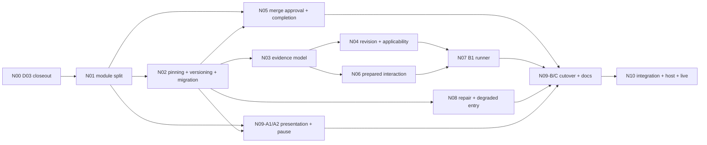

# Delivery Redesign — Local Execution Plan

> **Owning request:** after D03, continue the Delivery redesign in local VS Code Copilot chats instead
> of GitHub Copilot cloud. Re-cut the remaining work around what was actually needed. Functionality
> and quality must match the original specification as revised by the user's dated decisions.
> **Created:** 2026-10-02
> **Question:** How do we finish the remaining redesign scope from the current D03 state, with
> parallel local chats, without losing functionality, quality or live Delivery state?
> **Baseline:** `dev` at `62dfc3fba`, plus the D03 candidate on
> [PR #326](https://github.com/maba-pag/owlbear/pull/326), merged on 2026-10-03 as `881b500f`.
> **Status:** approved by the user on 2026-10-02 after the plan gate (`plan-sound` in round 7 of
> fresh GPT-6.1 Sol challenges). Revised the same day for the support baseline (N00-C; `plan-sound`
> in revision round 2) and for the start report and model split (`plan-sound`). Revised on 2026-10-03
> for pinned Node and Chromium-only Cockpit (`plan-sound` in revision round 2). This is the
> execution authority; on `dev` since N00-B.

| Document | Role once this plan is approved |
| --- | --- |
| This plan | Execution authority: working rules, package cut, order, status and chat prompts |
| [Programme](change-continuation-delivery-redesign.md) sections 1–11 and 13–14, including the dated revisions to section 1.1 merged with PR #326 | Product requirements and acceptance scenarios (V01–V24) |
| Programme section 0 and sections 12.2–12.8 | Historical. Their execution schedule and staffing are replaced here; WP/P identifiers remain for traceability |
| [Cloud flight guide](delivery-cloud-flight-handoff.md) | Superseded and historical. Cloud sessions are no longer used for this programme |
| `delivery-cloud-d03-plan.md` (on PR #326 until merged) | Historical record of D03 |
| `delivery-nNN-plan.md` (one per package, created by its P phase) | That package's contract, phases, progress and verification gaps |

## 0. Agent Start Here

Each chat works on one item of this plan. The user names either an item (`N03-P`, `N03-B`) or a
lane (`lane A`, `lane B`).

**Reading route:** read [section 1](#1-working-rules) in full. Check the item against the
[phase prerequisites](#42-phase-prerequisites), the [status table](#44-status) and the
[ready rule](#43-ready-rule-and-default-schedule). Then read only
the selected package in [section 5](#5-packages) and its package plan, if one exists. Open
programme sections only when the package names them or a contract question needs them. Do not load
the whole programme, D03's history or old chats by default.

| The user writes | Meaning |
| --- | --- |
| `Work on N03-P` | **Plan** package N03 |
| `Work on N03-B` | **Implement** phase B of N03 according to its approved package plan |
| `Continue lane A` | Pick the next ready item for lane A using the [ready rule](#43-ready-rule-and-default-schedule), name it with its reason, then do it |
| `Resume N03-B` | Continue an interrupted item from its branch, PR, package plan progress and challenge reports. Do not redo work that is already recorded |
| `Repair N03-B: <findings or link>` | Fix the named findings (external review, CI) within the phase; then run the implementation gate again |
| `Status` | Read-only programme status: merged, in progress, ready, blocked; open user decisions |

**Start report.** Before working on an item, the agent tells the user, in this order:

1. The item it starts and why it is ready (its prerequisites in [4.2](#42-phase-prerequisites)).
2. **Parallel now:** the first ready item of the other lane under the
   [ready rule](#43-ready-rule-and-default-schedule), checked against this item's editable paths,
   with its copy-ready prompt. If none is ready, it names what that lane's next item waits for.
3. **Unlocked by this item:** the items that become ready once this item merges.

The same parallel report is repeated in the end-of-turn handoff ([1.8](#18-status-and-handoff)),
because merges during the work can change it.

Copy-ready chat prompts. Start each lane chat in that lane's VS Code window ([1.2](#12-where-work-happens)):

```text
Continue lane A using .owlbear/research/delivery-redesign-execution-plan.md.
```

```text
Continue lane B using .owlbear/research/delivery-redesign-execution-plan.md.
```

```text
Work on N05-P using .owlbear/research/delivery-redesign-execution-plan.md.
```

### Actions

**Plan (P).** Read the package section, the programme sections it names, current source on
`origin/dev`, and the results and progress of its dependencies. Run feasibility probes for every
premise that could invalidate the design, for example real host, provider, OS or browser behavior.
Probes run locally under [1.3](#13-servers-live-state-and-rehearsals). Write
`.owlbear/research/delivery-nNN-plan.md` using the [format](#17-package-plans). Pass the
[plan gate](#15-review-gates). Ask the user each genuine decision through `vscode_askQuestions`,
giving status quo, problem, options and a recommendation. Open a docs-only PR. Merging that PR
approves the plan. Product code is not edited in a P phase.

**Implement (A, B, …).** This requires the merged package plan and merged dependencies. State the
behavior hypothesis and the first discriminating check, then implement in the owning modules. Keep
each schema, export, adapter, mirror, test and doc companion in the same phase. Run the
[proof](#14-proof), the live-compatibility gate where it applies and the
[implementation gate](#15-review-gates). Update the package plan progress and the status row.
Publish the PR and report it as merge-ready. Never merge. Stop at the end of the phase.

**Live activation and host steps** are N00-M, the N02-D pinning step, N10-H and N10-M. They need
the user present and the explicit authorization described in that package.

## 1. Working Rules

### 1.1 Authority and boundaries

- **Never use Delivery to implement Delivery.** Programme work never creates Design sessions,
  admissions, claims, results, requests or transitions in live Delivery state. Delivery tools may
  be used read-only to observe live status. They may also be used freely against disposable
  portfolios for tests and rehearsals.
- Product meaning comes from the programme and its dated user decisions. A phase must not weaken a
  requirement, test or safety property to make progress. A local coding defect is fixed locally.
- **Support baseline** (user decision 2026-10-02; [N00-C](#n00--d03-closeout-and-transition)
  implements it, every later phase keeps it):
  - Python 3.14 only. Earlier versions are unsupported; users update.
  - Node only at the pinned `serve/cockpit/web/.nvmrc` version (24.21.0 on 2026-10-03). Node is a
    development and CI tool; consumers get the prebuilt Cockpit bundle.
  - Cockpit supports Chromium browsers only (Chrome and Edge).
  - macOS and Linux (Ubuntu). Windows is unsupported.
  - Ubuntu support means: CI passes on the Ubuntu workers wherever it applies, and no
    implementation depends on macOS-only behavior. Platform-dependent code is either portable or
    has an explicit Ubuntu path, and that path is exercised by tests on the Ubuntu workers.
  - Host-only acceptance (N10-H) runs on macOS; the B1 managed-Mac check is macOS by definition.
- Stop and ask the user only for a genuine product, permission, privacy, destructive-action or
  live-state decision. Ask through `vscode_askQuestions`, stating status quo, problem, options and a
  recommendation. Never guess intent.
- Change this plan's sequence, rules or package cut only through a P-type revision that passes the
  plan gate and gets the user's approval.

### 1.2 Where work happens

- **The main checkout `/Users/GGN7H9Q/Projects/owlbear-dev` runs live Delivery and is frozen.**
  Its tracked `.vscode/mcp.json` starts `owlbear-delivery` with `uv run python -m owlbear_delivery_mcp`
  from this checkout, and `uv run cockpit` does the same. Whatever code is checked out there becomes
  the live controller on the next (re)start. D03 requires that controller to run from the primary
  worktree, so it cannot be moved to a lane worktree.
  - In N00-M, after PR #326 is merged, the agent switches the main checkout to a local branch
    `delivery-live` at the merged D03 commit. From then on, nobody pulls, merges or checks out
    programme code in the main checkout. Programme PRs merge into `origin/dev` only.
  - The freeze ends only through N02-D (pinned controller plus an authorized, rehearsed upgrade)
    or N10-M. A passing LC gate on a copy never authorizes running new code against live state.
  - Other work in this repository uses a worktree from `origin/dev`, not the main checkout.
    Delivery only requires the primary worktree; it does not read or advance that worktree's
    branch.
- **Each lane gets its own git worktree, VS Code window and chat.** The agent creates the worktree
  once per lane, on its current phase branch:

  ```shell
  git -C /Users/GGN7H9Q/Projects/owlbear-dev fetch origin
  git -C /Users/GGN7H9Q/Projects/owlbear-dev worktree add ../owlbear-dev-lane-a -b redesign/<id>-<slug> origin/dev
  cd ../owlbear-dev-lane-a && uv sync --locked && npm --prefix serve/cockpit/web ci
  ```

  For each later phase, the agent creates the new branch inside the existing lane worktree from
  fresh `origin/dev`. It never reuses another lane's worktree. The user opens the worktree folder in
  its own VS Code window and starts that lane's chat there.
- **In lane windows, disable the `owlbear-delivery` MCP server** (Command Palette → *MCP: List
  Servers* → `owlbear-delivery` → *Disable*). From a linked worktree it refuses to start ("Delivery
  must start from the primary Git worktree"), so leaving it enabled only produces startup errors.
  The other MCP servers may stay enabled.
- **One branch and one PR per phase.** Name branches `redesign/<id>-<slug>`, for example
  `redesign/n03-b-finalization-context`. Each PR targets `dev` and is titled `N03-B: <title>`.
  **Claim by publishing:** an item's first action is to create its branch from fresh `origin/dev`
  and push it, before any edit. Then the agent re-checks the
  [ready rule](#43-ready-rule-and-default-schedule); if another lane's in-progress item now
  conflicts, it deletes its own new branch and stops; if both items see each other, lane B's item
  yields. The PR is opened at closeout.
  Before the final challenge, rebase onto `origin/dev` if `dev` moved. Only one writer works on a
  branch, and two chats never work on the same phase.
- **Commits** use the `commit-owned` helper and the format `type: description (#N03-B, copilot)`.
- **Push and PR authority** (user decision [U-1](#7-decisions), 2026-10-02): for this programme,
  agents may push their own `redesign/*` branch, using `--force-with-lease` only on their own branch
  after a rebase, and may create or update that branch's PR. They never push `dev` or `main`, never
  merge and never change repository settings. This is a scoped exception to
  [workspace governance](../../share/skills/r-workspace-governance/SKILL.md)'s "never push".
- Scratch output goes to the lane worktree's `.owlbear/scratch/`.

### 1.3 Servers, live state and rehearsals

- Agents may start MCP servers, Cockpit, the Playwright stacks, real-process tests and probe
  servers. These use disposable state: temporary repositories, temporary local bare remotes and
  isolated ports. A development server never points at the main checkout's `.owlbear/delivery` or at
  the real `origin` Delivery state branch.
- **Live state is read-only for programme work.** The exceptions are the live activations: N00-M
  (D03), the N02-D pinning step and the N10-M migration. Each needs the user's authorization at that
  step and follows N00-M's procedure: quiesce, stop both controllers, verified backup, switch,
  sync dependencies and rebuild the Cockpit bundle, restart and verify, and preserve-before-restore
  on failure. N02-D and N10-M add their package's migration or upgrade step between backup and
  restart.
- **Live-compatibility gate (LC).** It applies to any phase that changes persisted formats, record
  loading, startup or migrations. Before merge, the candidate must load a copy of live Delivery
  state. The copy must be fully isolated: live Change worktrees' `.git` files and coordination
  records hold absolute paths into the main checkout, so copying `.owlbear/delivery` alone is not
  enough. N00-A establishes and records the isolation recipe (worktrees, Git administration, refs,
  host-local identities and the remote, for which the `url.<bare>.insteadOf` fixture technique in
  `serve/delivery/tests/test_delivery_state.py` applies). The recipe preserves record and receipt
  bytes, including their absolute paths, and never rewrites them to manufacture compatibility.
  Take the copy while no live Delivery work runs (the user confirms; the controller may stay up).
  Every LC run proves isolation affirmatively before loading: mount information shows the copy as
  the only mount at or under the main checkout's absolute path and the real checkout not mounted;
  the copy marker is present at that path; and `git rev-parse --git-common-dir` of the copy and of
  every copied worktree resolves inside the copy. After the run, live record hashes are unchanged.
  The main checkout shares its `.git` with all lane worktrees, so hashing it would fail on ordinary
  lane commits; it is not hashed. Run the candidate's
  `delivery-diagnose`, then a read-only application load that lists and reads every live Change.
  It passes when every Change loads as an available Change, not as an unavailable projection,
  either directly or after a registered migration (available from N02-B) converts the copy. Record
  the result on the PR. *Load form* (phases that keep persisted formats): the unmodified copy
  loads. *Full form* (phases that change a persisted format, from N02-B on): additionally, the
  migrated copy loads, and a copy whose records are migration-required or unsupported is refused
  with a typed version diagnostic before any write. LC proves
  compatibility only; it never activates code against live state
  ([1.2](#12-where-work-happens)). From N02-D on, LC becomes the upgrade rehearsal for the pinned
  controller.
- **Host rehearsals** use real VS Code windows and real Copilot dispatch against a disposable
  project or portfolio, as D03's two-window proof did. Record the evidence on the PR.
- **GitHub:** read-only queries against `maba-pag/owlbear` are allowed. Use the GitHub MCP tools
  or `git`; avoid the `gh` CLI in the VS Code terminal, which has coincided with VS Code crashes.
  Any provider mutation test needs a disposable repository and the user's explicit permission,
  recorded among that package's P decisions.

### 1.4 Proof

- **Inner loop:** run the smallest discriminating test right after the first substantive edit.
- **Phase closeout:** run `uv run test --changed` from the lane worktree. Add `npm test` and
  `npm run build` when frontend types or behavior change, and `npm run test:e2e:work` when Cockpit
  interaction or HTTP contracts change. Run scoped `uv run ruff check` / `ruff format --check`,
  Biome on changed frontend files, and the agent-ecosystem tests when `share/` changes.
- **Package closeout** (last phase): run the full `uv run test` once.
- MegaLinter runs in CI. Run it locally only to diagnose a CI failure.
- **CI on the exact PR head:** every one of the four workflows (Source, Dependency, Cockpit, Agent
  ecosystem) that the PR's paths trigger, and every check the repository requires, must be green.
  Path-filtered workflows that did not trigger (for example on docs-only P phases) are recorded as
  "not triggered", never as passed. A real failure is fixed. Tests are never skipped, weakened or
  relabeled.
- **Assembled claims use real wiring.** Use registered MCP through `Client(assemble_target_server(...))`,
  the HTTP test client, the default application loader and the maintained disposable E2E stack.
  Fakes sit only below provider or host owners.
- **Mandatory companions** (from D03): every new readiness reason, action or status ships in the
  same phase with its `serve/cockpit/web/src/api/workItems.ts` mirror, its rendering in
  `workItemPresentation.ts` and `WorkItemDetail.tsx` / `WorkPortfolioPage.tsx` with a component
  test, and the backend/frontend
  parity assertion in `tests/test_cockpit_boundary.py`. Every new frontier-writing operation joins
  the central mutability policy and its `tests/test_delivery_worktree_authority.py` coverage.
- **Record proof on the PR:** commands, counts, exact head. Distinguish your own runs from
  reported ones.

### 1.5 Review gates

The user requires repeated challenges until the result is clean, both for plans and during
implementation.

- **Plan gate.** Applies to every P phase and every revision of this plan. Follow
  [`challenge-plan_sol`](../../.github/prompts/challenge-plan_sol.prompt.md): a fresh, unnamed
  `GPT-6.1 Sol (copilot)` subagent per round, then caller reconciliation with exactly one
  disposition per finding (`fix-now`, `reject` or `block`). Revise the plan and start a fresh round
  until a round returns `plan-sound` with no `fix-now`. Only then present open user decisions.
- **Implementation gate.** Applies to every implementation phase, after proof, on the exact
  committed head. Follow [`challenge-implementation_sol`](../../.github/prompts/challenge-implementation_sol.prompt.md).
  Reconcile, repair, rerun the affected proof and challenge the new head with a fresh subagent.
  Repeat until `implementation-sound` with no `fix-now`. The last phase of a package also gets a
  cumulative challenge of the whole package diff against its plan.
- **Pattern check.** Keep challenging until the round is clean. But if one contract area produces
  new material findings in three consecutive rounds, report it to the user as a probable contract
  gap and propose a package-plan revision instead of more local patches. This changes the approach,
  not the cleanliness bar.
- **Independence.** The challenger must belong to a different model family from the implementing
  chat. The default implementer is Claude Opus 5.5 ([1.6](#16-models)). Code delegated to GPT-6 Luna
  under 1.6 is accepted under the Opus chat's ownership and review; the user accepted that overlap
  with the GPT-6.1 Sol challenger on 2026-10-02. Native GitHub Copilot PR review is optional extra
  evidence, not a substitute.

### 1.6 Models

User decision 2026-10-02: Opus leads; Luna does bounded slices; Sol challenges.

| Role | Model | Does |
| --- | --- | --- |
| Chat lead (every P and implementation item) | **Claude Opus 5.5** | Reads and plans; decides contracts; writes the risky code; reviews every delegated diff; runs proof; reconciles challenges; reports |
| Implementation subagent | **GPT-6 Luna** (`runSubagent`, `model: GPT-6 Luna (copilot)`) | Bounded, fully specified slices only |
| Challenger (plan and implementation gates) | **GPT-6.1 Sol**, a fresh subagent each round | Independent read-only review ([1.5](#15-review-gates)) |

- **Luna may do:** mechanical code moves with an exact source and destination (N01); companion
  edits after Opus has fixed the contract (frontend mirrors, rendering, parity assertions); test
  scaffolding and fixtures for specified scenarios; documentation and instruction updates;
  support-baseline edits (N00-C); diagnosing CI or lint failures.
- **Opus keeps:** contract and interface decisions; persisted formats, versions and migrations;
  crash, replay and custody logic; live-activation and pinning paths; security and private-input
  handling; anything a package plan marks high risk; challenge reconciliation and user decisions.
- **Delegation contract:** each Luna dispatch names the exact goal, the editable paths, the
  behavior to preserve or produce, the checks to run, and what to report back. Luna does not commit,
  push, open PRs, start live servers or touch live state. Opus reviews the diff, reruns the relevant
  checks itself and commits. A Luna result that misses its contract is redone or taken over by
  Opus, not patched by more delegation in a loop.
- The user can choose another lead model, as long as it is not the challenger's family.
- A stronger model never waives proof or review.

### 1.7 Package plans

A package plan is `.owlbear/research/delivery-nNN-plan.md`. Keep it to the current specification:
no diary, no session transcripts. Evidence and history live on the PRs.

1. **Contract.** Result; requirements, with programme section, WP/P/V and issue references;
   invariants; interfaces and error cases; existing owners to reuse; exclusions; user decisions and
   their outcomes.
2. **Feasibility probes.** What was executed in P, the result, and which premise it settles.
3. **Phases.** For each phase: ID, prerequisites, editable paths, required companions, positive and
   negative scenarios, inner-loop and closeout commands, whether the LC gate applies, and its size
   and risk.
4. **Progress.** One row per phase: PR, exact head, proof summary, challenge rounds and verdict,
   status.
5. **Verification gaps.** For each gap: claim, reason it is unproven, available evidence, owner, and
   whether it blocks merge, a successor phase or only N10.

### 1.8 Status and handoff

- Each phase PR updates its package plan's progress and its own row in the [status table](#44-status).
  If two lanes conflict on that table, keep both rows.
- End every chat turn with: item; branch and PR; exact head; proof run; challenge verdicts;
  remaining findings or decisions; the current **parallel now** item of the other lane (as in the
  [start report](#0-agent-start-here)); and one copy-ready next prompt in a `text` block (normally
  `Continue lane X using …`). If the next step is a user decision or a user merge, say so instead
  of giving a prompt.

## 2. Status Quo

### 2.1 Delivered so far

| Package | Result | Where |
| --- | --- | --- |
| D00 | Reviewed readiness work consolidated; bootstrap removed | `dev`, PR #316 |
| D01 | Engine readiness rendered in Cockpit (states, reasons, basis, unavailable Changes); replay regression fixed | `dev` (`dcee688c6`) |
| D02 | `/continue-change`: Change-scoped `acquire_change_action` / `execute_change_action`; engine actions `reconcile-checkpoint`, `sync-target`, `mark-ready`, `observe-acceptance`; issued finalization launch; typed yielding; named-host rehearsal | `dev` (`1ab5ae7e4`) |
| D03 | Recovery. See 2.2 | PR #326, 182 commits, +50k/−3.7k lines, all four workflows green on `42d19ddf` |

### 2.2 What D03 delivered and what it left open

**Delivered:**

- Native Orchestrator settlement (`settle_worker_invocation`) of exact ended invocations for
  Planner, Builder and Finalizer: `retry`, request-bearing `block`, Planning/Design `return`,
  completed timeout and `ended-without-result`. Work is preserved and the same task is reacquired
  with prior-attempt context.
- A durable retry ledger: three attempts per failure episode, semantic keys, backoff, exhaustion.
- Stale-claim recovery. Issuer records name the issuing VS Code window. A claim settles
  automatically as `host-lost` once that window process is gone. While the window lives, the user
  can confirm `release_stuck_worker` (MCP, Cockpit, `/release-stuck-worker`). Both paths require
  that no leftover process uses the worktree and that it has had no writes for 30 seconds. A lost
  or released Finalizer gets an engine-authored unknown-check report.
- Lost-response replay for engine actions; reconciliation of only the selected Change's publication;
  containment of unknown outcomes; settled target-stale attention syncs through the engine owner.
- Read-only offline diagnosis: `delivery-diagnose` in `serve/tools` (no runtime imports, bounded),
  reached through `/repair-delivery`.
- Strict MCP parameter validation; containment, retry history and release surfaces in Cockpit;
  updated workflow skills.

**Left open or bounded** (these limits are explicit; they are not defects):

- No physical worker exclusion. `UnavailableRecoveryEvidenceProvider` stays the default, and
  unknown or possibly live execution stays contained.
- No automatic dirty-worktree recovery of unattributed edits. This is the approved bounded-recovery
  boundary.
- **Design-return readmission is refused before authority mutation. Correcting it is open work**
  ([N04](#n04--same-change-revision-activation-and-evidence-applicability)).
- Claims issued by Cockpit or CLI never settle automatically. Writes deep inside ignored trees are
  not observed.
- Unknown invocations can still hold all execution capacity until settled or released. The user
  acknowledged this at N00-M on 2026-10-03 ([N00](#n00--d03-closeout-and-transition)).
- Deferred review findings L1 and L2 (provider observation freshness, an unmergeable PR shown as
  waiting for merge approval) go to [N05](#n05--exact-head-merge-approval-completion-and-publication-continuity).
  L5 (the target-sync lock spans fetch) goes to [N02](#n02--controller-pinning-versioned-state-and-migration-core).

### 2.3 Requirement changes that emerged

| Date | User decision | Effect on remaining work |
| --- | --- | --- |
| 2026-09-25 | Bounded recovery now; explicit containment otherwise | V06/V08/V10/V13 read as revised in programme section 13. Broader automatic recovery needs a separate approved design |
| 2026-09-30 | Native Orchestrator settlement; no Copilot CLI, sampling or alternate host | Every later worker flow builds on `settle_worker_invocation` and the retry ledger |
| 2026-10-02 | Crashed returned workers settle as `ended-without-result` | Same |
| 2026-10-02 | A + B option 1: window-identity evidence plus user-confirmed release | Upgrade and drain logic (N02) must respect issuer records and passive custody |
| 2026-10-02 | Local chats instead of cloud; no dogfooding; repeated challenges until clean; behavior-preserving split first | This plan |
| 2026-10-02 | Python 3.14 only; macOS and Ubuntu; Windows dropped | N00-C, then the [support baseline](#11-authority-and-boundaries) applies to every phase |
| 2026-10-03 | Node only at the `.nvmrc` version; Cockpit on Chromium (Chrome, Edge) only | Added to N00-C and the support baseline |
| 2026-10-02 | Opus leads every chat; Luna subagents for bounded slices; Sol challenges; start report names parallel work | [1.6](#16-models), [section 0](#0-agent-start-here) |

### 2.4 Lessons applied

1. **Infeasible premises surfaced late.** D03 planned around host exclusion, which no supported VS
   Code capability provides. Rule: P phases now run real feasibility probes before contract approval
   ([Plan action](#actions)).
2. **Mid-package decisions rewrote the contract.** Rule: P phases surface the decision points
   up front with options.
3. **Repeated challenges found real defects.** Rule: they are kept, but run per phase PR, so each
   round reviews a small delta ([1.5](#15-review-gates)).
4. **Module size slowed agents and will cause conflicts.** Rule: N01 runs before parallel feature
   work.
5. **The D03 plan grew into a 1,548-line diary.** Rule: lean package plans ([1.7](#17-package-plans)).
6. **One long-lived package PR.** Rule: one PR per phase, merged often.

### 2.5 Code shape on the D03 head

| Module | Lines |
| --- | --- |
| `serve/delivery/src/owlbear_delivery/portfolio_application.py` | 11,875 (389 functions, 70 classes) |
| `change_workspace.py` | 9,455 |
| `delivery_runtime.py` | 6,840 |
| `delivery_application_loader.py` | 2,463 |
| `recovery.py` | 2,052 |
| Delivery core total | 44,711 |
| `serve/delivery/tests/test_portfolio_application.py` | 17,211 |
| Private-attribute patches in tests | 101 |

### 2.6 Live state and open items

- **Live Delivery** (main checkout, `.owlbear/delivery/runtime/changes`):
  - `delivery-action-readiness`: product merged via PR #316 (merge commit `364daf61`). The live record is
    unfinished (Implementation, 4 of 5 results, schema-1 evidence, not finalized); N10-M disposes of it.
  - `frontier-serialization-contract`: issue #215, open PR #314. This is a Delivery fix, so under
    the no-dogfooding rule it is absorbed into N02.
  - `macos-managed-browser-authentication`: B1, open PR #312, TASK-004 managed-Mac pilot pending.
  - The `.vscode/mcp.json` registration of `owlbear-delivery` was restored on 2026-09-13. The
    programme's "intentionally removed" note is stale.
- **Open Delivery issues and their allocation:**
  - #213 Design re-entry → N04
  - #215 strict frontier round-trip → N02
  - #216 fence expired claims and #221 retry convergence → covered by D03; verify and propose
    closure in N00
  - #218 memory-curation coupling: fixed on `dev` by PR #308; N09-A1 records closure evidence
    (N09 plan U1)
  - #219 typed proof verdicts and #222 whole-Change acceptance in finalization → N03
  - #220 bounded remote Git → N02
  - #225 PR-feedback continuity → N05

## 3. Requirement Traceability

Every programme requirement keeps exactly one owner. "Done" means delivered and proven on `dev`;
N10 reruns it as regression.

| Requirement | Owner | Notes |
| --- | --- | --- |
| V01 full journey with only prompt/form/approval user actions | N10 (automated + host) | Uses D02 continuation, N05 merge and N09 entry |
| V02, V04, V05 | Done (D01/D02) | Regression in N10 |
| V03, V06–V10, V13 | Done (D03, bounded) | N03 adds finalization assurance to V03; regression in N10 |
| V11 target advances during final verification | D03 partly; N05 completes | Approval invalidated on target change; fresh review |
| V12 lost push/merge response | N05 | |
| V14 requirement change with old code/proof | N04 | |
| V15 repeated request IDs, unchanged proven claim | N03 model, N04 applicability, N07 B1 | |
| V16 revised target not covered | N04, N07 | |
| V17 assisted check, handler unavailable | N06 | |
| V18 invalid state while UI loads | D03 offline CLI; N08 Cockpit degraded start | |
| V19 approval, then head change or protection failure | N05 | |
| V20 unknown corruption, missing provenance | D03 diagnosis; N02 refusal; N08 proposals | |
| V21 crash after each revision/migration step | N02 migration; N04 activation | |
| V22 private input, expiry, cancel | N06 | |
| V23 real managed-device check | N07 runner; N10-H real device | |
| V24 upgrade with active work, unsupported downgrade | N02 | |
| WP2 steps 4–5, P08/P09, R2/R3, sections 10.1–10.3, J05–J07, governance conflict | N05 | |
| WP4, P12–P14, section 8, #213, D03 Design-return | N03 (evidence model), N04 (activation/applicability) | |
| WP5, P15–P18, section 9 | N06 (core and input), N07 (B1 and presentation) | |
| WP6, P19–P21, section 11 | N02 (versioning, migration, pinning, upgrade), N08 (repair application, degraded entry, distribution) | |
| WP7 and R1: retire `/orchestrate` as normal entry; section 4.2 labels; section 4.3 progress copy; P22 docs | N09 | |
| P23 cumulative matrix, P24 host acceptance and activation | N10 | |
| Support baseline: Python 3.14; pinned Node; Chromium-only Cockpit; macOS and Ubuntu; no Windows | N00-C | Kept by every later phase ([1.1](#11-authority-and-boundaries)) |
| Programme section 4.2 controls | Change requirements → N04; Approve merge → N05; Help with this step → N06; Repair Delivery → N08; Copy continuation prompt, Pause/Resume → N09 | Each control ships with its owning behavior |

## 4. Package Map, Dependencies and Status

### 4.1 Packages

| ID | Title | Size / risk |
| --- | --- | --- |
| N00 | D03 closeout and transition | S / medium |
| N01 | Behavior-preserving split of the large Delivery modules | L / medium |
| N02 | Controller pinning, versioned state and migration core | L / high |
| N03 | Evidence model and finalization assurance | L / high |
| N04 | Same-Change revision activation and evidence applicability | XL / high |
| N05 | Exact-head merge approval, completion and publication continuity | L / high |
| N06 | Prepared interaction core and private local input | L / high |
| N07 | B1 assisted-check runner and assistance presentation | L / high |
| N08 | Offline repair application, degraded Cockpit and distribution | M / medium |
| N09 | Continuation entry cutover and Cockpit entry surface | M / medium |
| N10 | Integration, fault matrix, host acceptance and live migration | L / high |

### 4.2 Phase prerequisites

This table is the only dependency authority. A prerequisite is met when that item's PR is merged
into `origin/dev` (for N00-M: when the user has completed the step). A package plan may add
prerequisites for its own phases; it may not remove these. Plans name symbols rather than paths,
so implementation re-resolves paths after N01 moves code.

| Item | Prerequisites |
| --- | --- |
| N00-A | — |
| N00-M | N00-A clean; user acknowledgment ([7](#7-decisions)) |
| N00-B | N00-M |
| N00-C | N00-B |
| N01-P | N00-B |
| N01-A, N01-B | N01-P, N00-C (A and B run in parallel) |
| N01-C | N01-A, N01-B |
| N02-P | N00-B |
| N02-A | N02-P, N01-C |
| N02-B | N02-A |
| N02-C | N02-B |
| N02-D | N02-C |
| N03-P | N02-P |
| N03-A | N03-P, N02-B |
| N03-B | N03-A |
| N03-C | N03-B |
| N04-P | N03-P |
| N04-A | N04-P, N03-C |
| N04-B, N04-C, N04-D | the previous N04 phase |
| N05-P | N02-P |
| N05-A | N05-P, N01-P, N00-C; N05-P must list editable paths disjoint from every N01 phase's paths |
| N05-B | N05-A, N01-C, N02-B |
| N05-C, N05-D | the previous N05 phase |
| N06-P | N03-P |
| N06-A | N06-P, N03-C |
| N06-B, N06-C | the previous N06 phase |
| N07-P | N04-P, N06-P |
| N07-A | N07-P, N04-D, N06-C |
| N07-B | N07-A |
| N08-P | N02-P |
| N08-A | N08-P, N02-B |
| N08-B | N08-A |
| N08-C | N08-B, N02-D |
| N09-P1 (plans N09-A1, N09-A2) | N00-B |
| N09-A1 | N09-P1, N01-C |
| N09-A2 | N09-A1, N02-B |
| N09-P2 (plans N09-B, N09-C) | N05-P, N06-P, N07-P, N08-P, N09-A2 |
| N09-B | N09-P2, N05-D, N06-C, N07-B, N08-C |
| N09-C | N09-B |
| N10-P | N09-P2 |
| N10-A | N10-P, N09-C |
| N10-H | N10-A |
| N10-M | N10-H; user authorization at the step |

Format-marker order (N05-P): N03-A and N05-B each add an N02 format step. The second to merge
renumbers its migration onto the first and reruns the LC full form. This adds no prerequisite.

Package-level view (derived from the table):



### 4.3 Ready rule and default schedule

An item is **ready** when all of these hold:

- Its prerequisites in [4.2](#42-phase-prerequisites) and in its package plan are met.
- It is not done. An item with a PR is done when that PR is merged (shown in the
  [status table](#44-status) once recorded). N00-M has no PR; it is done when PR #326 is merged and
  the main checkout is on `delivery-live` (`git -C <main checkout> branch --show-current`).
- It is not in progress: no open PR exists for it and no remote `redesign/<id>-*` branch without a
  merged PR. A merged PR overrides a retained branch.
- No in-progress implementation phase in another lane lists a core module that this phase also
  lists as editable. Shared companion files (frontend mirrors, parity tests, this plan's status
  table) do not block; their conflicts are resolved by rebase and both rows are kept.

`Continue lane X` picks, in order:

1. An interrupted or repair-pending item of lane X.
2. The first ready item of lane X, in schedule order.

An item belongs to the lane in whose column it appears in the schedule below. A lane never picks
another lane's item on its own; if nothing in lane X is ready, the agent reports what blocks each
of its next items and stops. Moving an item to another lane needs the user's explicit
`Work on <item>` in that lane's chat, which the agent confirms against the ready rule first.

The schedule below is consistent with 4.2. It assigns lanes and orders the work; 4.2 decides
readiness. N00-A and N00-M run in the main checkout's window; N00-B is lane A's first worktree
phase.

| Stage | Lane A | Lane B | Exit |
| --- | --- | --- | --- |
| 0 | N00-A, N00-M (main checkout), then N00-B | — | PR #326 merged; live frozen and verified; this plan approved |
| 1 | N01-P, then N01-A | N00-C, N02-P, N09-P1, then N01-B | N01-A, N01-B merged |
| 1b | N01-C | N05-P, then N05-A | N01-C merged |
| 2 | N02-A … N02-D | N09-A1, N03-P, N08-P | N02-B merged |
| 3 | N03-A … N03-C | N05-B … N05-D, N08-A, N08-B, N09-A2 | N03 merged |
| 4 | N04-P … N04-D | N06-P … N06-C, N08-C | N04, N06, N08 merged |
| 5 | N07-P … N07-B | N09-P2, N10-P | N07 merged |
| 6 | N09-B, N09-C, N10-A, N10-H, N10-M | — | Programme complete |

Stage 3 note (N05-P): N03 and N05-B…D list shared core modules (`application_readiness.py`,
`application_acquisition.py`, `work_items.py`, `workspace_models.py`), so the ready rule runs them
sequentially where their editable paths overlap, despite the lane split.

### 4.4 Status

Each item's merging PR sets its row to `merged` with the PR number; N00-B records N00-M as `done`.
N10-H and N10-M each publish their evidence in their own docs-only PR, so they follow the normal
rule. In-progress state lives on GitHub ([4.3](#43-ready-rule-and-default-schedule)), not here.
A P phase that re-splits its phases updates 4.2, the schedule and these rows in its PR, giving
every new item exactly one lane.

| Item | State | PR |
| --- | --- | --- |
| This plan | approved 2026-10-02 | — |
| N00-A | merged | #326 (head `4ef678fe`; Sol `implementation-sound`; LC repair `7c05d377`; CI green) |
| N00-M | done | #326 merged as `881b500f`; main checkout on `delivery-live`; health clean; 3 Changes available; 114 live records unchanged vs. backup `~/owlbear-backups/n00m-20261003-015344` |
| N00-B | merged | #340 |
| N00-C | merged | #341 |
| N01-P | merged | #342 (plan gate `plan-sound`, round 3) |
| N01-A | merged | #344 (code head `693b6dc3b`; Sol `implementation-sound`; LC load form pass) |
| N01-B | merged | #346 (code head `fc4ca75b5`; Sol blocker resolved by executed exact-candidate proof; LC load form pass) |
| N01-C | merged | #347 (code head `1ba931191`; cumulative Sol `implementation-sound`; LC load form pass) |
| N02-P | merged | #345 (plan gate `plan-sound`, round 4; amends §1.3, D9: confirmation pending; U1/U2 pending before N02-D) |
| N02-A | merged | #348 (code head `f225ad508`; Sol `implementation-sound` round 3; LC load form pass) |
| N02-B | — | — |
| N02-C | — | — |
| N02-D | — | — |
| N03-P | merged | #349 (plan gate `plan-sound`, round 6; D11 confirmation pending; U1 before N03-A) |
| N03-A | — | — |
| N03-B | — | — |
| N03-C | — | — |
| N04-P | — | — |
| N04-A | — | — |
| N04-B | — | — |
| N04-C | — | — |
| N04-D | — | — |
| N05-P | merged | #353 (plan gate `plan-sound`, round 12; amendments confirmation pending; U1, U3, U4 before N05-B; U2 before A-R) |
| N05-A | — | — |
| N05-B | — | — |
| N05-C | — | — |
| N05-D | — | — |
| N06-P | — | — |
| N06-A | — | — |
| N06-B | — | — |
| N06-C | — | — |
| N07-P | — | — |
| N07-A | — | — |
| N07-B | — | — |
| N08-P | merged | #350 (plan gate `plan-sound`, round 7; amends N02-B abort (N02 D10); D11 confirmation pending; U1–U3 before their phases) |
| N08-A | — | — |
| N08-B | — | — |
| N08-C | — | — |
| N09-P1 | merged | #351 (plan gate `plan-sound`, round 8; D9 re-split confirmation pending; U1 before N10-M) |
| N09-A1 | merged | #354 (code head `3573866ac`; Sol `implementation-sound` round 3) |
| N09-A2 | — | — |
| N09-P2 | — | — |
| N09-B | — | — |
| N09-C | — | — |
| N10-P | — | — |
| N10-A | — | — |
| N10-H | — | — |
| N10-M | — | — |

## 5. Packages

Each package lists its result, scope, exclusions, covered requirements, plan inputs, what its P
phase must settle, an initial phase split and the main conflict surfaces. Plan inputs name what the
P phase reads; readiness comes only from [4.2](#42-phase-prerequisites). The P phase can re-split
the phases, but it may not drop requirements or change dependencies without a plan-gate-reviewed
revision of this file.

### N00 — D03 closeout and transition

**Result:**

- PR #326 merged into `dev` after a clean challenge of its final delta.
- Live Delivery verified working on the merged code.
- This plan approved and referenced by the process documents.
- Superseded instructions retired.
- The support baseline is implemented: Python 3.14 only; pinned Node; Chromium-only Cockpit; macOS
  and Ubuntu; no Windows.

**Phases:**

- **N00-A — Pre-merge proof.** Starts once the review repairs in flight on PR #326 are finished.
  Runs in the main checkout's chat, but all work on PR #326 happens in its existing worktree
  `.owlbear/scratch/pr326-opus-repair` (branch `d03-repair-326`, pushing to `copilot/d03-p`),
  never in the main checkout.
  - Run the implementation gate on PR #326's head at that point, for the delta since the last head
    with a clean cumulative challenge recorded on the PR (`baf6d812` as of 2026-10-02). Repeat
    until clean. Any further repair changes the head, and the gate covers the new head.
  - Establish the isolated LC recipe ([1.3](#13-servers-live-state-and-rehearsals)), then run the LC
    gate (load form) of the PR head with it. If no isolated recipe works, stop and report: N00-M
    is blocked, and evidence is never rewritten to make a copy load.
  - Verify that #216 and #221 are covered by D03 tests and draft closure comments. Posting them is
    the user's call.
  - Present the D03 capacity-risk statement for the user to acknowledge.
- **N00-M — Activate D03 (user).** This is a live activation ([1.3](#13-servers-live-state-and-rehearsals)),
  run from the main checkout's chat in one maintenance window.
  1. **Quiesce.** The user stops starting Delivery work in any chat. Preflight, read-only, against
     the running controller: `delivery_health`, `list_changes` and `get_change` for each live
     Change. Stop and report if any Change holds a running claim or writable custody, a started
     engine action, or a pending publication or checkpoint; the user decides how to settle it.
  2. **Stop.** The user stops `owlbear-delivery` (*MCP: List Servers* → *Stop*) and closes Cockpit.
     The agent verifies that no `owlbear_delivery_mcp` or `owlbear_cockpit` process from the main
     checkout remains. Nothing can now change live state.
  3. **Back up.** Record the main checkout's current commit, and copy `.owlbear/delivery` to a
     timestamped directory outside the repository. Verify the copy (file count and hashes).
  4. **Merge and switch.** The user acknowledges the capacity risk, merges PR #326 and authorizes
     activation. The agent switches the main checkout to the local branch `delivery-live` at the
     merge commit ([1.2](#12-where-work-happens)), then runs `uv sync --locked` and rebuilds the
     untracked Cockpit bundle there (`npm --prefix serve/cockpit/web ci` and `run build`), so both
     controllers serve the activated revision.
  5. **Restart and verify.** The user starts `owlbear-delivery` (and Cockpit, if used). Read-only:
     `delivery_health`, `list_changes` and `get_change` for the three live Changes; every Change
     loads as available. Cockpit serves the new bundle (built after the switch; D03's **Release
     stuck worker** control is present, not clicked). The user may then resume Delivery work. The
     agent reports the result for N00-B to record.
  6. **If verification fails:** stop both controllers again and copy the current
     `.owlbear/delivery` to a second timestamped directory first. Do not restore the backup
     automatically: startup may already have written newer receipts or publications. Report the
     difference between both copies; restoring the old commit and backup is a user decision.
- **N00-B — Transition documents** (lane A's first worktree phase: branch and PR):
  - Add this plan to `dev` and record the N00-M result in the status table.
  - Point the programme header and section 0 to this plan.
  - Mark the flight guide superseded.
  - Replace the *Direct Delivery Redesign* section of
    [Copilot instructions](../../.github/copilot-instructions.md) with a short pointer to this plan
    and its rules.
  - Retarget the *Delivery Redesign Tasks* section of the
    [cloud-agent instructions](../../.github/instructions/cloud-agent.instructions.md) to "not
    executed in cloud; see this plan".
  - Set this plan's status line to record that it is on `dev`.
- **N00-C — Support baseline** (lane B worktree phase: branch and PR; no package plan, this entry
  is its contract). Implements the [support baseline](#11-authority-and-boundaries) before N01
  moves code, so N01's before/after test equivalence runs on one interpreter, and the formatter
  changes land before N01 moves those files.
  - **Python:** every `requires-python` becomes `>=3.14.7` (the pinned `.python-version`). The root
    ruff `target-version` becomes `py314`; apply the resulting formatter changes (ruff lint
    reported no new findings in a dry run on 2026-10-02). Regenerate `uv.lock`. Renovate's `pep621`
    Python rule in `.github/renovate.json` allows only 3.14 releases.
  - **CI:** the Dependency workflow's Python matrix becomes the `.python-version` version only.
    Steps that ran only on 3.12.14 keep their proof and run on that version; none is dropped.
    Update `tests/test_dependency_verification_workflow.py` to assert the new matrix and
    conditions. Check the other workflows and `copilot-setup-steps.yml` for version references.
  - **Node:** `engines.node` in `serve/cockpit/web/package.json` becomes `>=` the `.nvmrc` version.
    The Cockpit workflow's Node matrix becomes that version only; update
    `.github/scripts/check_node_runtime.py` and its tests to match. The checker must fail when
    `.nvmrc` and the `engines` floor differ (today it only rejects a pin below the floor). Check
    Renovate's Node rules in `.github/renovate.json` so an `.nvmrc` update also raises the floor.
  - **Browsers:** Vite's `BROWSER_TARGET` keeps only the Chrome and Edge targets. The compatibility
    Playwright configuration, the workflow's `E2E_COMPAT_BROWSERS` and their tests cover Chromium
    only. Remove Firefox, Safari and iOS statements from Cockpit docs.
  - **Windows:** `setup/init.py` refuses Windows with a clear message before changing anything.
    Remove Windows instructions and limitations from the setup guide, sharing guide, operating
    guide, consumer README and seed templates. Remove Windows-only code paths and tests.
  - **Instructions and docs:** replace "Python 3.12.14+" and similar wording in
    [Copilot instructions](../../.github/copilot-instructions.md), the system instructions, the
    Python instructions and skills, READMEs and setup docs with the baseline.
  - **Acceptance:** no active support declaration, execution path, CI matrix, dependency policy or
    instruction still names Python 3.12/3.13, Node 24.16, Firefox, Safari/WebKit, iOS or Windows,
    except the refusal message and the statement that Windows is unsupported. Use `git grep` for
    `3.12`, `3.13`, `py312`, `py313`, `24.16`, `firefox`, `webkit`, `safari`, `ios`, `Windows`,
    `PowerShell` and `.ps1` to find candidates and classify every hit. Leave unchanged:
    Delivery authority and history (`.owlbear/delivery/`), research and source citations
    (`.owlbear/research/`, `.owlbear/sources/`), scratch, lock files, vendored assets, and test
    fixtures whose version literals are data rather than support policy. Behavior is otherwise
    unchanged: no test assertion changes except those directly required by the support baseline
    (workflow matrices, browser projects and Node runtime-contract tests, including an aligned
    pin/floor that passes and a raised pin with a stale floor that fails).
  - **Proof:** `uv sync --locked`, ruff check and format check, the full `uv run test` once,
    `npm test`, `npm run build` and `npm run test:e2e` in `serve/cockpit/web`, and the triggered CI
    workflows on the exact head. No LC gate: persisted formats and loading are unchanged, and live
    already runs 3.14.7.

**Excluded:** any D03 code change, unless the challenge finds a defect; that is repaired on PR #326
first.

### N01 — Behavior-preserving split of the large Delivery modules

**Result:** `portfolio_application.py`, `change_workspace.py` and `delivery_runtime.py` (plus
`delivery_application_loader.py` if the plan finds it warranted) are decomposed into cohesive
internal modules. Guideline: about 2,500 lines per module at most. Every behavior and public
contract stays the same:

- `owlbear_delivery.__all__` is identical.
- Every `PortfolioApplication` public method and signature is unchanged.
- MCP, HTTP and Cockpit are untouched.
- No test assertion changes. Only imports and patch targets move with the code.

**Excluded:** behavior changes, renaming public symbols, new features, test rewrites, opportunistic
cleanup.

**P must settle:**

- The domain module map, for example application readiness, acquisition, continuation actions,
  settlement and recovery routes, finalization, lifecycle, publication, operator views. Workspace:
  coordination, custody, worktree lifecycle, quarantine, target sync. Runtime: models,
  transitions, requests.
- The composition technique for the 300-plus-method facade (mixins versus delegating
  collaborators). Weigh how the 101 private patches move, import-cycle rules and type checking.
- The equivalence protocol:
  - `pytest --collect-only` node IDs identical before and after;
  - identical pass counts for the Delivery, MCP, tools, Cockpit and workspace suites;
  - `git diff --color-moved` shows only moved blocks plus import edits;
  - an import-time and cycle test;
  - an `__all__` equality test.

**Phases:**

- N01-P.
- N01-A: application facade.
- N01-B: workspace module.
- N01-C: runtime module, plus the loader if warranted.

A and B run in parallel; C starts after both are merged. While N01 runs, no other phase edits these
modules. Plans and provider-only work (N05-A) may proceed. LC gate: load form.

### N02 — Controller pinning, versioned state and migration core

**Result:**

- The live controller is pinned. This repository's live Delivery MCP and Cockpit run a pinned,
  deliberately upgraded revision instead of the working checkout, so merges into `dev` no longer
  change live behavior.
- Every persisted Delivery record family has an explicit version in one registry. Startup refuses
  unsupported or newer (downgrade) state before reading or mutating it.
- Registered migrations run fenced and copy-first, with a backup and replay at every durable
  boundary. Unknown corruption is never blessed.
- A drain/fence → migrate → restart → verify procedure supports deliberate upgrades with active
  work.
- Remote Git and target-sync fetch are bounded.
- Frontier JSON has one canonical strict round-trip contract.

**Covers:** programme section 11.3 and WP6 steps 3 and 5; P19 core and P20 pinning/upgrade; V21
(migration), V24, the V20 refusal half; #215, #220, L5. Also absorbs the scope of the live
`frontier-serialization-contract` Change.

**Excluded:** repair proposals for corrupted or abnormal states, Cockpit degraded start and consumer
distribution (N08).

**P must settle:**

- Inventory of record families and versions, in source and in live state. The research baseline
  lists config, host, coordination, frontier, target-sync receipt, external head adoption,
  transactions, admission/authority, completions, state publication, finalization reports and the
  D03 families: retry ledger, action and recovery receipts, claim issuers.
- The pinning mechanism, probed for real:
  - where the pinned controller lives;
  - how `.vscode/mcp.json` and `uv run cockpit` start it;
  - its interaction with seed and consumer configuration;
  - how restarts behave in VS Code.
- How an upgrade is triggered: prompt and/or Cockpit.
- Drain semantics against D03 custody: running claims with issuer records, passive Builder
  handoffs, passive Finalizer reservations, started engine actions, pending publications.
- The migration contract and the root cause of #215.
- **User decision:** confirm pinning of this repository's own live controller and the upgrade UX.

**Phases:**

- N02-P.
- N02-A: version registry, startup capability gate, downgrade refusal, #215 canonical frontier
  round-trip. N02-A changes no persisted format: today's D03 formats are registered as the
  baseline versions, so it uses the load-form LC.
- N02-B: fenced migration operation (proposal on copy → apply → verify; crash/replay; refusal of
  unknown corruption), below application composition next to D03's offline boundary; formalized
  LC rehearsal tool. N02-B is the first phase that may change a persisted format; migration and
  refusal ship together.
- N02-C: bounded remote Git with typed unknown-write readback (#220); bounded target-sync fetch
  and lock (L5).
- N02-D: controller pinning and the upgrade procedure. Rehearse on a copy, then pin the live
  controller in an **H step with the user present**. This ends the main-checkout freeze of
  [1.2](#12-where-work-happens); from then on, live code changes only through the rehearsed
  upgrade procedure.

LC gate: load form for N02-A; full form from N02-B.

### N03 — Evidence model and finalization assurance

**Result:**

- Every proof observation states its typed result: passed, failed, expected-negative, manual
  procedure, artifact, or missing/waived with an owner.
- Each observation also records:
  - which acceptance claims and claim versions it covers;
  - under which exact code, procedure and environment;
  - the target class;
  - its time;
  - who confirmed it (machine observation versus human confirmation);
  - a bounded locator.
- Finalization loads the admitted acceptance authority. It fails closed on failed, unmet or
  uncovered required evidence. The independent reviewer receives the same semantic context and diff
  baseline.
- Per Change, an evidence projection (claim → evidence → status) is readable through `get_change`,
  MCP, HTTP and a Cockpit technical summary.

**Covers:** #219, #222; the programme section 8.4 model; U6, U7; groundwork for V15; stronger V03
assurance.

**Excluded:** revision activation and applicability after revision (N04); human assistance (N06).

**Plan inputs:** N02-P (migration contract). N03-P alone owns the stable acceptance identities
(programme section 8.4), including how they survive a revision; N04-P consumes that contract.

**P must settle:**

- Where stable acceptance identities come from (Design package criteria versus contract outcomes)
  and how they survive revision.
- Migration of existing observations: unknown coverage unless attributable; never relabeled.
- The finalization projection.
- Proof submission guidance for Builder and Finalizer.

**Phases:**

- N03-P.
- N03-A: typed observations, coverage metadata, acceptance identities, finalization validation,
  registered migration, strict MCP models; the finalization semantic context (including bounded task
  authority), basis digest, review binding of the observation set and receipt-construction skill text.
  Existing frontiers stay `readable-legacy` 18 until their next normal mutation writes 19; no frontier
  rewrite migration.
- N03-B: finalization procedures and proof guidance: `w-change-finalization`, the `build-reviewer`
  finalization mode, `w-packet-building`; host rehearsal.
- N03-C: evidence projection through `get_change`, operator views, MCP, HTTP and Cockpit.

LC gate: full form for N03-A and N03-C; not applicable to N03-B. Amended by N03-P (its D11).

### N04 — Same-Change revision activation and evidence applicability

**Result:**

- The user changes a nonterminal Change's requirements through Cockpit **Change requirements** or
  `/design <change-id>`.
- The Designer loads the active proposal, decisions, task and evidence history, and the current
  block.
- The engine stops new incompatible work. Current custody finishes or settles through the D03
  routes. No revision activates while writable custody remains.
- The candidate is challenged and approved, then activated through one replayable operation:
  prepare → snapshot → local commit → publish → reconcile. The operation spans package, admission,
  contract, frontier remap, managed-branch snapshot and publication. A crash at any boundary
  restarts to the old approved state or the exact new state, without duplicate child commits.
  Acquisition is blocked during activation.
- An applicability report classifies each obligation as reusable, partial, invalidated or unknown,
  with reviewer justification. It replaces the blanket request created by
  `_carry_forward_unresolved_binding`: the agent reassesses and plans, and asks the user for at most
  the minimum human step.
- D03's retained-handoff Design return can be readmitted.
- Completed Changes stay immutable; further work starts a successor Change.

**Covers:** programme sections 8.1–8.4, WP4, P12, P13 (applicability), P14; V14, V15, V16, V21
(activation); #213; source finding S01 (workflow prohibition versus source); D03 Design-return.

**Plan inputs:** the approved N03-P contract, including acceptance identities; N02-P (migration
contract).

**P must settle:**

- The candidate versus active layout, reusing `DesignPackageStore` revisions and admission
  `revisions/`.
- The activation participants and their identities.
- Quiescence rules against every D03 custody state.
- Acceptance identity mapping across a revision.
- Probes: activation replay on copies, including a copy of B1's live revision history.

**Phases:**

- N04-P.
- N04-A: prepare/activate/reconcile operation with crash injection at every durable boundary and
  acquisition blocking.
- N04-B: applicability assessment, reviewer step and carry-forward replacement.
- N04-C: Designer workflow (`w-design-session`, `designer.agent.md`) for same-Change resume;
  Design-return readmission; MCP/HTTP; Cockpit **Change requirements**.
- N04-D: cumulative proof with B1-like fixtures (repeated request IDs; a revised target not
  covered by old evidence).

LC gate: full form.

### N05 — Exact-head merge approval, completion and publication continuity

**Result:**

- When a Change is ready, Cockpit shows **Approve merge** with the repository, PR, exact reviewed
  head, target, proof and required-check summary, and the merge method. The continuation chat
  offers the same bounded approval.
- The approval binds the exact head and target. Before the merge, the provider re-reads PR state,
  head, target, rules, mergeability and checks. A head change invalidates the approval. A target
  change requires sync, revalidation and fresh review where the proof depends on it. No GitHub
  merge API fences the target; enforced rules or the user's N05 U3 decision govern that race.
- An unknown merge response is read back before any retry. There is never a duplicate or
  unapproved merge.
- Completion is observed exactly once, including merges done manually in GitHub.
- The worktree of a completed Change is cleaned automatically when eligible; unexpected contents
  are preserved.
- Waits are distinct: checks running, provider outage, pending user approval.
- L1: fresh observations are fenced into the readiness basis. L2: a known-unmergeable PR shows its
  real reason instead of `merge-approval-required`, which N05-B adds as a readiness reason (today
  it is only an engine-result reason).
- Governance states that engine/provider publication is system work and that agents never push
  arbitrarily.
- PR-feedback repair has a durable handoff and replay-safe replies (#225).

**Covers:** WP2 steps 4–5, P08, P09, R2, R3; programme sections 10.1–10.3; J05–J07; V11 (approval
part), V12, V19; L1, L2; #225.

**Plan inputs:** D02/D03 publication owners; N02-P (record versioning).

**P must settle:**

- GitHub capabilities, probed read-only ([1.3](#13-servers-live-state-and-rehearsals)): merge methods, rulesets and protections,
  merge queue, required-check reads, and the head-SHA fence on the merge mutation.
- Approval record and invalidation rules.
- Engine action shape.
- Auto-cleanup eligibility.
- **User decision:** whether a real merge rehearsal on a disposable repository is permitted, and
  the merge-method policy.

**Phases:**

- N05-P.
- N05-A: provider merge and readback adapter with fakes; revises the forbidden-effect gates that
  assert Delivery never merges into an allowlist. Its editable paths must be disjoint from
  every N01 phase so that it can run during N01.
- N05-B: approval identity and invalidation, engine merge action, readiness L1/L2, distinct waits,
  exactly-once completion, automatic cleanup.
- N05-C: MCP/HTTP and Cockpit confirm/cancel/error states, stale-confirmation E2E, continuation
  prompt path, governance text.
- N05-D: #225 PR-feedback continuity.

LC gate: full form from N05-B.

### N06 — Prepared interaction core and private local input

**Result:**

- A typed prepared-interaction contract with the programme section 9.1 fields. Handlers come from a
  code registry, never shell text from a request.
- Preparation is agent work. The Change shows "needs you" only once the step is actionable.
- Local input is handed off through a loopback or Cockpit form with origin checks and a one-time
  token, and becomes an opaque input reference. Inputs expire and can be cancelled.
- Secrets never appear in transcripts, logs, receipts or URLs. Human confirmation is recorded
  separately from machine observation, using N03 provenance.
- Cockpit offers **Help with this step**, **Not now**, **Explain existing evidence**, and **Check
  not available here** when no handler is available (V17).
- A synthetic handler proves the whole flow end to end.

**Covers:** programme sections 9.1, 9.3, 9.4; P15, P16; V17, V22; U3.

**Plan inputs:** the approved N03-P contract (provenance and observation model).

**P must settle:**

- The relation to the existing `DeliveryRequest` model.
- The form host and its origin/token design, probed in a real browser.
- Input descriptors and sensitivity classes.
- Binding to the candidate and its resources, and when that binding goes stale.
- **User decision:** the retention and privacy policy for private inputs and evidence.

**Phases:**

- N06-P.
- N06-A: lifecycle, registry, readiness gate and binding, with migration and strict MCP models.
- N06-B: secure local input and V22 negative tests: credential-like URL, logs and receipts, expired
  session, cancel is not a pass.
- N06-C: MCP/HTTP and Cockpit presentation; synthetic-handler E2E.

LC gate: full form.

### N07 — B1 assisted-check runner and assistance presentation

**Result:**

- B1's remaining human obligation (the TASK-004 managed-Mac pilot) becomes runnable as a prepared
  interaction:
  - The agent launches the reviewed B1 candidate from its worktree with the owned Edge profile.
  - The user enters an approved address in the local form, signs in in the visible window and
    confirms.
  - The agent runs restart and cleanup and records only bounded evidence: no URLs, hostnames,
    cookies or page content.
- Existing B1 evidence, including the three reported exercises, is reassessed through N04
  applicability before any new check is requested. The UI shows the exact gap per claim
  (programme section 9.2).
- B1's product tasks are not programme work. B1 stays a live product Change; the runner consumes
  its candidate.

**Covers:** P17, P18; V15 and V16 on B1 data; V23 preparation; programme section 9.2; source S16.

**Plan inputs:** the approved N04-P and N06-P contracts; B1 candidate on PR #312.

**P must settle:**

- The handler location and how candidate code runs: its worktree and environment.
- Profile custody and contention.
- Synthetic sites for tests.
- **User input:** which earlier B1 evidence exists and how Jira versus Confluence evidence is
  treated, without silently changing the requirement.

**Phases:**

- N07-P.
- N07-A: runner with synthetic sites.
- N07-B: evidence reassessment and presentation; cumulative proof.

The real-device run is N10-H.

### N08 — Offline repair application, degraded Cockpit and distribution

**Result:**

- Beyond D03's read-only diagnosis, `/repair-delivery` can create fenced proposals for known
  recoverable states and apply them under policy and confirmation. Unknown corruption is preserved
  and only diagnosed.
- Cockpit starts and shows degraded Changes plus the **Repair Delivery** entry without a healthy
  `PortfolioApplication` (V18).
- A reviewed, isolated maintenance route for platform code defects exists (programme section 11.2).
- Setup and distribution give consumer installations controller selection and upgrade parity with
  N02 (P21).

**Covers:** P19 (application), P20 (offline application), P21; V18, V20; programme sections 11.1
and 11.2; R4; the Repair Delivery control from section 4.2.

**Plan inputs:** the approved N02-P contract.

**P must settle:**

- The catalogue of supported proposals, derived from D03 diagnosis findings and known recoverable
  states.
- The confirmation policy.
- The design for Cockpit degraded start.
- The consumer upgrade path through `setup/init.py` and the `main` sync.

**Phases:**

- N08-P.
- N08-A: proposals and application below application composition: a repair kind of N02-B's
  migration engine in Delivery, with a tools CLI.
- N08-B: Cockpit degraded start, the Repair Delivery entry and its Delivery core changes: per-Change
  containment (V18) and a read-only loader preflight before startup effects.
- N08-C: setup and distribution, maintenance route, operating docs.

LC gate: full form for A.

### N09 — Continuation entry cutover and Cockpit entry surface

**Result:**

- `/continue-change` is the normal entry. `/orchestrate` is retired as a normal entry; portfolio
  monitoring and engine coordination are retained according to the capability inventory.
- `finalize-change`, `resolve-delivery-attention`, `resolve-target-conflict`, `address-pr-feedback`,
  `release-stuck-worker` and `inspect-change` each become either internal handlers routed through
  continuation or explicitly exceptional entries. Each retirement needs demonstrated replacement
  proof.
- Cockpit uses the programme section 4.2 labels: **Copy continuation prompt**, and **Pause/Resume**
  as policy state.
- Cockpit shows the section 4.3 progress descriptions, including **Waiting for chat to resume**.
- Memory curation no longer blocks acquisition (#218): verified fixed on `dev` by PR #308 (N09
  plan D10); N09-A1 records the closure evidence.
- WIRING, operating docs, setup guide and READMEs are reconciled (P22).

**Covers:** R1; WP7 steps 1–2; programme sections 4.2, 4.3 and 6 (waiting for chat); J03, J08,
issue #218; P22.

**P must settle:**

- The capability inventory: every public prompt and control, its normal and exceptional
  capabilities, and the proof of its replacement.
- Pause semantics versus the existing Defer.

**Phases:**

- N09-P1: plans N09-A1 and N09-A2 (presentation, Pause/Resume semantics, #218).
- N09-A1: presentation, progress copy, Change-level Pause/Resume, #218 closure evidence.
- N09-A2: Pause drains active work (coordination format change; after N02-B).
- N09-P2: capability inventory; plans N09-B and N09-C using the approved N05–N08 plans.
- N09-B: retirement and routing.
- N09-C: documentation reconciliation.

### N10 — Integration, fault matrix, host acceptance and live migration

**Result:**

- The cumulative V01–V24 automated matrix passes on the exact candidate (P23).
- A cumulative challenge comes back clean.
- Host acceptance with the user:
  - a real VS Code / Copilot journey on a disposable project, from start through completion;
  - a fresh-session resume at each stopping point;
  - stale-claim scenarios;
  - the B1 V23 check on the managed device.
- Live migration: the pinned controller is upgraded to the final release and the live Changes are
  migrated:
  - `delivery-action-readiness` completes or is observed;
  - `frontier-serialization-contract` is abandoned through the supported route and PR #314 closed;
    the user confirms this at the step, since its scope is delivered by N02;
  - B1 continues.
- The programme is closed: section 0 of the programme and this plan are marked complete.

**Phases:**

- N10-P: acceptance map from V01–V24, U1–U8 and programme section 14.5 to proof and gaps.
- N10-A: matrix and gap fixes.
- N10-H: host acceptance, with the user present. Its docs-only PR records the evidence.
- N10-M: live migration and activation; explicit user authorization. Its docs-only PR records the
  evidence and closes the programme.

## 6. Programme Completion

The programme is complete when all of the following hold:

- The user can start a Change, resume it after interruption, answer a genuine prepared question,
  approve the merge and see accepted completion, without running tests, editing files or operating
  Git or Delivery internals (programme section 14.5; U1–U8).
- Every V01–V24 scenario has the proof named in programme section 13, as revised. Host-only claims
  have host evidence.
- Every supported failure fixture either resumes automatically or exposes one working prompt or
  control.
- Live Changes are migrated and the pinned controller runs the final release.
- Issues #213, #215, #216, #218–#222 and #225 are closed with evidence.
- Documentation matches shipped behavior.
- No `fix-now` finding is open.

## 7. Decisions

**Decided by the user on 2026-10-02:**

- **U-1 — Push and PR authority: allowed.** Agents push their own `redesign/*` branches and create
  or update their PRs ([1.2](#12-where-work-happens)). Claim-by-publishing and parallel lanes depend
  on it.
- **U-2 — Main-checkout freeze: accepted.** From N00-M until N02-D, the main checkout stays on
  `delivery-live` and all other work in this repository happens in worktrees
  ([1.2](#12-where-work-happens)).
- **Plan approval:** approved.

**Decided at their step:**

- **N00-M (decided 2026-10-03):** the user acknowledged D03's capacity risk, merged PR #326 and
  authorized activation.

**Decided later, inside their package's P phase:**

- **N02:** pinning of this repository's live controller and the upgrade UX.
- **N05:** merge-method policy (U1); real merge rehearsal on a disposable repository (U2); target
  freshness and the execution-time target race (U3).
- **N06:** retention and privacy policy for private inputs.
- **N07:** treatment of earlier B1 evidence.
- **N10-M:** abandoning the `frontier-serialization-contract` live Change; the disposition of the
  unfinished live record `delivery-action-readiness` (product merged via PR #316).
