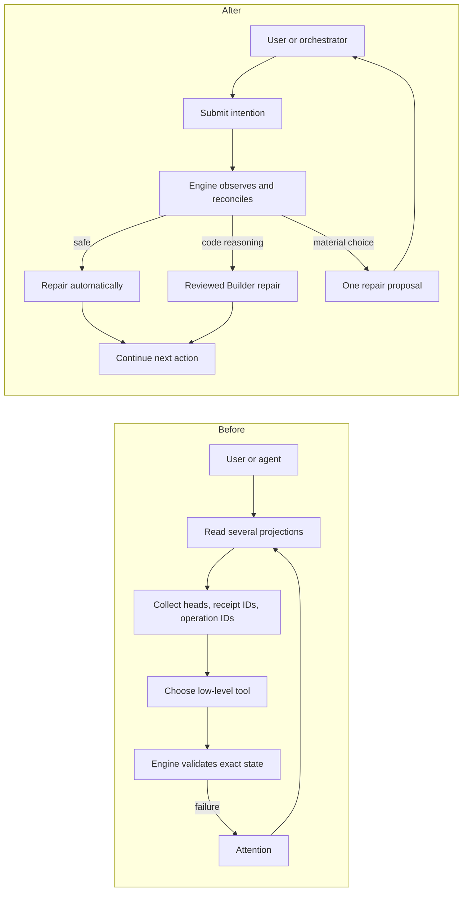

# Delivery Resilience Evolution Plan

> **Date:** 2026-09-11
> **Status:** Standalone implementation plan; not Delivery runtime authority
> **Source evidence:** [Delivery Interface Usage Audit](delivery-interface-usage-audit-2026-09-11.md)
> **Recommendation:** Targeted hardening first, then an additive intention facade over the proven core

## 1. Decision

Delivery is a mature, failure-hardened system. Its exact authority, one-writer custody, dirty-byte
quarantine, transaction recovery, reviewed commits, provider reconciliation, and failure-derived
tests are valuable. The problem is operational resilience: deterministic recoverable conditions are
too often exposed as attention, and callers must collect internal identities and sequence low-level
repair operations.

Do not replace `DeliveryRuntime`, `PortfolioApplication`, `ChangeWorkspaceManager`, transaction
storage, or publication providers. Evolve them in place:

1. repair concrete safety and liveness defects;
2. make deterministic convergence engine-owned;
3. add one coherent repair interaction for real ambiguity;
4. add an intention-oriented facade over proven primitives;
5. remove low-level caller surfaces only after assembled parity proof.

This is evolutionary rework, not a clean core replacement and not preservation of the status quo.

### Implementation custody

Changes to Delivery itself must not be implemented through Delivery. Use an ordinary isolated Git
branch/worktree, direct scoped commits, independent review, and maintained tests. Delivery may be
used again for its own development only after the new canary proves restart and repair behavior.

## 2. Product Promise

Delivery preserves its proven safety guarantees while becoming materially more self-healing and
simpler to operate:

- safe deterministic convergence happens inside the engine;
- repository reasoning remains reviewed Builder work;
- materially different outcomes produce one bounded proposal and one user answer;
- orchestration resumes automatically after repair;
- unrelated Changes continue when one Change is quarantined;
- routine callers do not manipulate internal heads, receipt IDs, operation IDs, or cleanup variants.

## 3. Before And After Information Flow

"After" below is the target architecture, not current behavior.

| Concern | Before | After |
| --- | --- | --- |
| Current state | Several work-item, operator, health, Integration, and finalization projections | One `get_change` projection |
| Portfolio state | Separate active, history, health, and worktree queries | One filtered `list_changes` |
| Caller knowledge | Heads, claims, attempts, disposition IDs, publication IDs, operation IDs | Change version, claim ID while working, proposal ID when deciding |
| Repair diagnosis | Engine errors plus a long manual skill | Engine-owned repair classification |
| Retry decision | Agents interpret `retry_safe` and error prose | Explicit convergence policy and operation fingerprint |
| Publication | Cockpit or skills sequence reconcile, checks, ready, and acceptance | Bounded background convergence; manual observation is a nudge |
| Recovery after restart | Replay semantic frontier from remote state snapshots | Initially retain snapshots; simplify only after a reduced recovery contract is proved |
| Multiple hosts | Separate caches and supervisors | Authoritative reread under lock and one bounded reconciliation owner |
| Failure scope | Some failures stop acquisition or require manual routing | Quarantine one Change; unrelated Changes continue |

## 4. Before And After Change Flow

| Stage | Before | After |
| --- | --- | --- |
| Design | Create, read, revise, derive, checkpoint, approve, admit | `put_design`, then version-bound `admit_change` |
| Planning | Acquire, read context, publish candidate, return transition, forward transition | `next_actions` dispatches Planner; `submit_result` records and advances |
| Building | Acquire, read context, commit, publish result, return transition, forward transition | Same reviewed-commit guarantee; one `submit_result` |
| Finalization | User invokes Finalizer manually | Engine emits a Finalizer action when ready |
| Publication | Reconcile checkpoint, observe checks, mark ready | Automatic bounded convergence after finalization |
| Acceptance | Cockpit page periodically observes merge | Host reconciliation observes provider state and records completion |
| Recoverable failure | Emit attention; user or agent selects several tools | Engine repairs inline and resumes |
| Code repair | Separate exceptional workflow | Engine emits reviewed Builder repair action |
| Ambiguous repair | User manually launches attention workflow | One proposal with consequences; Repairer asks one question |
| Fatal corruption | May obstruct startup or portfolio operation | Quarantine only the attributable Change |

## 5. Interface Direction

### Current surface

- 65 public `PortfolioApplication` methods at the audited baseline;
- 53 MCP tools;
- 29 Cockpit Delivery routes;
- multiple caller-specific projections;
- at least eight caller-visible identity/CAS token forms;
- separate normal, repair, cleanup, recovery, publication, and compatibility APIs.

The numeric reduction is not the goal. The goal is to remove caller choreography while retaining
internal exactness.

### Candidate intention surface

| Intention | Responsibility |
| --- | --- |
| `put_design` | Create or replace one exact versioned Design |
| `admit_change` | Admit the exact approved Design version |
| `list_changes` | Portfolio, health, history, and search projection |
| `get_change` | Complete semantic state, evidence links, next action, and repair proposal |
| `next_actions` | Return Planner, Builder, Finalizer, or repair interaction launches |
| `submit_result` | Claim-bound, discriminated, replay-safe worker/finalizer result |
| `repair` | Diagnose, converge automatically, return reviewed repair work, or return one proposal |
| `answer` | Resolve an exact question or proposal after version revalidation |
| `set_change_intent` | Pause, resume, abandon, or approve an invalidating administrative intention |

This list is directional, not a hard count. Do not create polymorphic mega-payloads merely to keep
the count at nine.

### MCP mapping direction

| Current tools | Target |
| --- | --- |
| `create/read/revise_design_session` | `put_design`, `get_change` |
| `publish_design_checkpoint`, `derive_delivery_contract`, `admit_delivery_change` | `admit_change` |
| Work-item, health, retained-worktree, and history queries | `list_changes`, `get_change` |
| Plan, Build, finalization, operator, and Integration context queries | Action payload or `get_change` |
| `acquire_frontier_work` | `next_actions` |
| Plan/result publication, transition, and finalization | `submit_result` |
| Request, block, and disposition resolution | `answer` |
| Defer, resume, abandon, and administrative move | `set_change_intent` or proposal |
| Claim/worktree/state/publication recovery, target sync, adoption, promotion, supersession, cleanup | Internal convergence or `repair` |
| Checkpoint, checks, ready, and acceptance operations | Internal bounded observe/reconcile loop |

Low-level methods remain private and contract-tested until their behavior is genuinely subsumed.
The target is not nine names hiding the same manual sequence.

## 6. Guarantees

### Keep

- one writer and one warm worktree per Change;
- dirty-byte preservation before reset or cleanup;
- exact reviewed commits and independent review;
- semantic Design version binding and exact admission approval;
- atomic writes, descriptor locks, transaction manifests, and identical replay;
- provider-observed completion;
- per-Change quarantine and sibling progress;
- remote semantic snapshots until replacement recovery proof passes;
- the maintained failure catalogue, adapted by retained guarantee.

### Change

- timeout becomes suspicion, never proof of worker death;
- automatic replay uses explicit idempotent-intent policy, never `retry_safe` alone;
- callers stop calculating internal recovery/publication identities;
- repeated failures gain fingerprints, budgets, and next-eligible retry time;
- background reconciliation gains bounded backoff and visible health;
- repair states map to one classification and action/proposal model;
- Finalizer becomes an engine-selected action rather than a manual normal step;
- acceptance no longer depends on Cockpit page visibility.

### Delete after parity

- ungranted low-level MCP repair and cleanup tools;
- manual attention choreography;
- duplicate supervisor ownership;
- separate legacy Integration repair claims;
- compatibility readers only at a quiescent clean cutover;
- caller-visible internal operation/head/disposition/publication tokens.

### Do not add without a residual problem

- SQLite or another state database;
- a new daemon process;
- an all-powerful Git repair agent;
- dual writes or runtime-state migration;
- backward-compatible aliases for retired tools.

## 7. Repair Policy

| Class | Owner | Admission rule | Examples |
| --- | --- | --- | --- |
| Automatic convergence | Engine | One outcome; no semantic choice; no unpreserved loss; no reviewed-authority advancement; no non-fast-forward external mutation | transaction replay, exact checkpoint replay, stale-finalization invalidation, reproducible worktree restoration, completed-worktree GC |
| Reviewed repair | Builder plus build-reviewer | Requires repository/code reasoning or creates a product commit | target merge, merge-conflict resolution, foreign-commit review |
| User proposal | Repairer interaction | Materially different valuable outcomes or intentional loss/invalidation | divergent histories, discard, abandonment, backward invalidation, semantic Design change |
| Waiting | Engine | External condition may change without intervention | open PR, provider outage within retry budget, dependency wait |
| Fatal per-Change quarantine | Engine/operator | No trustworthy attributable authority remains | missing branch and package authority, irreconcilable Change-local corruption |
| Host fatal | Host startup | Shared root cannot be trusted | shared transaction-root corruption, invalid repository root |

An isolated quarantine commit is permitted because it preserves bytes without advancing the Change
branch, reviewed boundary, publication, or completion authority.

## 8. Exact Implementation Plan

### Phase 0 - Work isolation and baselines

Implementation mode:

1. create an ordinary Git branch/worktree outside `.owlbear/delivery/worktrees`;
2. do not admit a Delivery Change for Delivery source changes;
3. record the current full and focused test baselines;
4. map every existing repair test to a retained guarantee or explicit deletion;
5. make scoped commits by phase and never dual-write old/new runtime schemas.

Acceptance:

- no Delivery runtime/package/claim is created for this plan;
- Change ID `delivery-resilience-evolution` and branch
  `owlbear/change/delivery-resilience-evolution` are permanently retired because withdrawn PR #315
  remains discoverable as provider history; implementation must use a different Git branch name;
- unrelated active Changes continue untouched;
- source baseline and dirty-worktree ownership are recorded.

### Phase 1 - Execution safety

#### 1A. Fence stale writers

- Separate timeout suspicion from turnover authority.
- Extend dispatch result/state so termination is established by the dispatch owner or an enforced
  writer fence.
- Unknown liveness retains custody and emits one bounded repair action.
- Confirmed-dead recovery preserves dirty bytes, restores reviewed state, releases custody, and
  permits successor acquisition.

Proof:

- keep an old worker alive past timeout and prove no reset/relaunch occurs;
- prove confirmed termination still performs clean and dirty recovery;
- prove unrelated Changes launch when capacity remains;
- prove stale worker output cannot mutate successor authority.

#### 1B. Bound worker retry convergence

- Persist a normalized failure fingerprint, attempt count, last failure, and next eligible retry.
- Reset only the relevant budget after real progress.
- Route repeated equivalent failure to typed attention rather than fresh-worker loops.

Proof:

- repeated identical failures stop at the configured budget;
- independent Changes continue;
- a successful result clears the matching budget only.

### Gate A

Stop and assess operational value. Proceed only when live-writer and repeated-worker failure tests
show safer progress without increasing manual recovery for ordinary failures.

### Phase 2 - Background convergence

#### 2A. One bounded checkpoint supervisor

- Retain acquisition-time replay as the fast path.
- Ensure one mutation owner per workspace using existing locks and authoritative rereads first.
- Add capped exponential backoff, attempt counters, last error, and next retry.
- Surface degraded supervisor state in health.
- Do not add leader-election state unless a two-host test proves existing locks insufficient.

#### 2B. Browser-independent acceptance

- Move acceptance scheduling from the visible Cockpit hook into host reconciliation.
- Preserve exact provider identity and merged-head checks.
- Treat manual observe as a nudge, not the normal scheduler.

Proof:

- persistently failing provider calls are bounded and visible;
- Cockpit plus MCP does not duplicate external mutation;
- MCP-only and Cockpit-only hosts resume pending convergence;
- host restart resumes from durable retry state;
- acceptance completes with no browser page open.

### Gate B

Proceed only if background attempts are bounded, observable, and resume correctly across host
restart. Otherwise revise this phase before adding a facade.

### Phase 3 - Coherent repair ownership

#### 3A. Unified classification and proposal

- Replace scattered caller-facing attention taxonomies with one projection over existing evidence.
- Add immutable `RepairProposal` containing version, consequences, allowed answer, and continuation.
- Revalidate proposal version under lock before applying an answer.
- Keep low-level exact receipts internally.

#### 3B. Constrained Repairer

- Add one named repair coordinator with `get_change`, `repair`, `answer`, and one-question user
  interaction.
- Give it no unrestricted source edit, reset, cleanup, commit, or raw Git authority.
- For repository reasoning, dispatch an engine-authored Builder repair launch.

#### 3C. Reviewed repair launch

- Add a bounded repair launch with immutable scope, allowed starting state, exact evidence, custody,
  reviewer policy, completion condition, and continuation target.
- Reuse Builder and build-reviewer; do not create a second repair state machine.

Proof:

- every maintained attention fixture maps to automatic convergence, reviewed repair, one proposal,
  waiting, per-Change quarantine, or host fatal;
- one target conflict runs from diagnosis through reviewed repair to automatic resumption;
- one destructive alternative requires a stale-safe user proposal;
- Repairer cannot edit the worktree directly.

### Gate C

If any retained repair still requires callers to sequence hidden primitives, revise the
classification/proposal contract before facade or adapter work.

### Phase 4 - Additive intention facade

- Implement `list_changes`, `get_change`, and `next_actions` over current projections and guidance.
- Implement version-bound `put_design` and `admit_change` over current package/admission stores.
- Implement finite discriminated `submit_result` over current publish/transition/finalize behavior.
- Implement `repair`, `answer`, and `set_change_intent` over current primitives and proposal policy.
- Preserve all low-level methods and tests during parity.
- Keep internal effect IDs for replay, but stop exposing them to ordinary callers.

Proof:

- every action is executable without a caller joining separate projections;
- dropped responses replay identically, while different replays conflict;
- stale Design approval and stale repair answers fail safely;
- normal Plan, Build, Finalizer, repair, publication, and acceptance journeys pass through the
  facade;
- real MCPServer and HTTP contract tests exercise the assembled facade.

### Gate D

No public tool is removed until normal and repair parity passes and the facade produces a measurable
reduction in caller choreography. A smaller registry alone is not success.

### Phase 5 - Caller cutover

In separate scoped commits, switch:

1. Orchestrator and worker agents;
2. Repairer and repair prompt;
3. Delivery MCP adapter and strict models;
4. Cockpit HTTP service;
5. Cockpit frontend hooks and controls;
6. documentation and setup references.

Then remove low-level tools from grants and public registries. Keep proven core primitives private
until no retained behavior depends on their separate contracts.

Proof:

- active agent/skill/prompt references contain no retired tool names;
- Cockpit has no retired HTTP routes or hidden choreography;
- fresh canary completes Design through provider-observed completion;
- injected worker, publication, response-loss, target-conflict, restart, and repair failures
  converge through the facade.

### Phase 6 - Clean cutover and optional deletion

Before incompatible runtime/schema cleanup:

- briefly stop new admission;
- finish or explicitly abandon active Changes;
- preserve source branches and quarantine refs;
- migrate no claims, attempts, frontier positions, repair state, or compatibility schemas;
- switch all callers together;
- remove compatibility readers and old public operations in the same bounded cutover.

Remote state is a separate decision. Keep `owlbear/delivery-state` unless a fresh clone containing
only the promised surviving artifacts proves one of these safe outcomes:

1. admitted authority and reviewed permission are reconstructed exactly; or
2. missing review permission forces explicit re-admission and fresh review before execution.

Never infer reviewed authority from a branch tip.

### Gate E

Cleanup is final only after fresh-canary, fresh-clone, two-host, crash, response-loss, and fault
injection proof passes on the cutover surface.

## 9. Existing Changes

During additive Phases 1-4, existing Changes continue under the current runtime. No state migration
is needed.

At incompatible cutover:

| Existing state | Action |
| --- | --- |
| Nearly complete | Finish under current Delivery |
| Unfinished but valuable | Preserve Design/source branch, explicitly abandon old runtime, then re-admit and re-plan under the new interface |
| Active or dirty Builder | Establish termination, preserve bytes/commit/quarantine evidence, then abandon or finish before cutover |
| Blocked/broken | Preserve Design and source; discard old runtime only after explicit abandonment |
| Completed | Retain provider/completion history; do not migrate operational runtime |
| Unadmitted Design draft | Preserve authored intent/design and import through `put_design` |

Never migrate live claims, attempts, frontier positions, attention records, pending repair state, or
old receipt schemas.

## 10. Commit And Review Boundaries

Recommended independently reviewable commits:

1. writer termination/fencing model and tests;
2. worker retry fingerprint/budget and tests;
3. supervisor backoff/health and tests;
4. browser-independent acceptance scheduling and tests;
5. repair classification/proposal models and table-driven tests;
6. Builder repair launch and assembled repair test;
7. constrained Repairer and ecosystem wiring;
8. core read/action facade;
9. versioned Design/admission facade;
10. discriminated result/answer/repair facade;
11. MCP adapter cutover;
12. Cockpit backend cutover;
13. Cockpit frontend cutover;
14. agent/prompt cutover;
15. compatibility/public-surface cleanup after canary proof.

Each commit must keep retained guarantees green. Do not combine safety semantics, adapter migration,
and compatibility deletion in one commit.

## 11. Validation Matrix

| Claim | Required evidence |
| --- | --- |
| Live writer cannot be recycled | Real overlapping-worker fault injection |
| Dirty bytes survive | Binary, renamed, deleted, staged, unstaged, and untracked fixtures |
| Retry is bounded | Persisted fingerprint/backoff tests and restart proof |
| No duplicate background mutation | Two-host contention and provider-call count |
| Repair is coherent | Every attention fixture maps to one policy class |
| User choices are exact | Stale proposal and changed-consequence rejection |
| Reviewed repair remains reviewed | Exact repair commit and build-reviewer receipt |
| Facade does not hide choreography | Assembled journeys use only intention operations |
| Replay is safe | Dropped-response identical replay and different-replay conflict |
| One bad Change is isolated | Corrupt attributable Change while sibling completes |
| Fresh-clone authority is safe | No inferred review permission from branch tip |
| Cutover is complete | Retired names absent across MCP, HTTP, agents, skills, prompts, docs |

## 12. Stop Conditions

Stop and revise rather than continuing when:

- writer fencing requires a speculative process/lease subsystem with no executable benefit;
- automatic convergence would make a semantic or destructive choice;
- repair proposals cannot represent a retained failure without low-level caller choreography;
- the facade increases rather than reduces caller knowledge;
- a retained failure test must be deleted while its guarantee still exists;
- fresh-clone recovery cannot establish or safely revoke review permission;
- current primitives cannot support the required convergence without recreating equivalent public
  complexity.

Only the last condition justifies reconsidering a clean core replacement.
