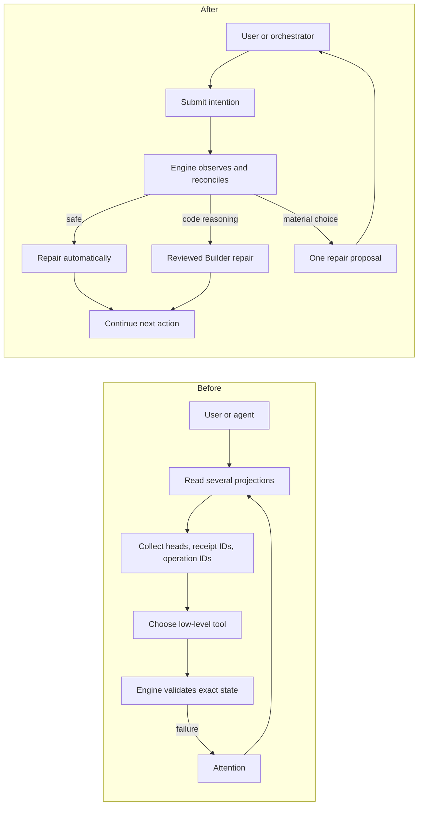

# Delivery Resilience Evolution Plan

> **Date:** 2026-09-11
> **Status:** Standalone implementation plan; not Delivery runtime authority
> **Source evidence:** [Delivery Interface Usage Audit](delivery-interface-usage-audit-2026-09-11.md)
> **Recommendation:** Targeted hardening first, then an additive intention facade over the proven core
> **Implementation snapshot:** version-bound `put_design` and `admit_change`, `get_change`, unified request/block/disposition `answer`, version-bound `set_change_intent`, grouped `list_changes`, Builder `submit_result`, claim-facing `acquire_actions`, and high-level `repair` are implemented additively through core and MCP. The live **Post-baseline** census is **76 public core methods**, **57 registered MCP operations**, **253 root exports**, and **29 Cockpit Delivery routes**. The unfenced lifecycle MCP aliases and low-level answer/repair MCP tools are retired; the constrained Repairer route is wired to Change-specific proposals and bounded Decision options. Action free-text provenance and remaining low-level retirement remain future gates.

## 1. Decision

Delivery is a mature, failure-hardened system. Its exact authority, one-writer custody, dirty-byte
quarantine, transaction recovery, reviewed commits, provider reconciliation, and failure-derived
tests are valuable. The problem is operational resilience: deterministic recoverable conditions are
too often exposed as attention, and callers must collect internal identities and sequence low-level
repair operations.

Do not replace `DeliveryRuntime`, `PortfolioApplication`, `ChangeWorkspaceManager`, transaction
storage, or publication providers. Evolve them in place:

1. repair concrete safety and liveness defects;
2. make deterministic convergence engine-owned;
3. add one coherent repair interaction for real ambiguity;
4. add an intention-oriented facade over proven primitives;
5. remove low-level caller surfaces only after assembled parity proof.

This is evolutionary rework, not a clean core replacement and not preservation of the status quo.

### Implementation custody

Use current Delivery for additive, self-hostable changes: its MCP host runs from the primary
workspace while Builder edits an isolated managed Change worktree. A self-hosted Change must finish
under the currently running contract before its implementation is merged and activated.

Use an ordinary isolated Git branch/worktree only for a change that would make its own in-flight
state unreadable after restart, remove operations it still needs to finish, or alter application
bootstrap before that Change completes. Decide custody per implementation slice from that concrete
hazard; do not apply a blanket self-hosting prohibition. Every route still requires scoped commits,
independent review, and maintained tests.

## 2. Product Promise

Delivery preserves its proven safety guarantees while becoming materially more self-healing and
simpler to operate:

- safe deterministic convergence happens inside the engine;
- repository reasoning remains reviewed Builder work;
- materially different outcomes produce one bounded proposal and one user answer;
- orchestration resumes automatically after repair;
- unrelated Changes continue when one Change is quarantined;
- routine callers do not manipulate internal heads, receipt IDs, operation IDs, or cleanup variants.

## 3. Before And After Information Flow

"After" below is the target architecture, not current behavior.

| Concern | Before | After |
| --- | --- | --- |
| Current state | Several work-item, operator, health, Integration, and finalization projections | One `get_change` projection |
| Portfolio state | Separate active, history, health, and worktree queries | One filtered `list_changes` |
| Caller knowledge | Heads, claims, attempts, disposition IDs, publication IDs, operation IDs | Change version, claim ID while working, proposal ID when deciding |
| Repair diagnosis | Engine errors plus a long manual skill | Engine-owned repair classification |
| Retry decision | Agents interpret `retry_safe` and error prose | Explicit convergence policy and operation fingerprint |
| Publication | Cockpit or skills sequence reconcile, checks, ready, and acceptance | Bounded background reconciliation; readiness waits for non-blocking required checks; manual observation is a nudge |
| Recovery after restart | Replay semantic frontier from remote state snapshots | Initially retain snapshots; simplify only after a reduced recovery contract is proved |
| Multiple hosts | Separate caches and supervisors | Authoritative reread under lock and at most one effective attempt per Change and retry window |
| Failure scope | Some failures stop acquisition or require manual routing | Quarantine one Change; unrelated Changes continue |

## 4. Before And After Change Flow

| Stage | Before | After |
| --- | --- | --- |
| Design | Create, read, revise, derive, checkpoint, approve, admit | `put_design`, then version-bound `admit_change` |
| Planning | Acquire, read context, publish candidate, return transition, forward transition | `acquire_actions` returns a claimed Planner launch; Orchestrator dispatches it and `submit_result` records and advances |
| Building | Acquire, read context, commit, publish result, return transition, forward transition | Same reviewed-commit guarantee; one `submit_result` |
| Finalization | User invokes Finalizer manually | Engine emits a Finalizer action when ready |
| Publication | Reconcile checkpoint, observe checks, mark ready | Automatic bounded reconciliation after finalization; mark ready only when required checks are complete and non-blocking |
| Acceptance | Cockpit page periodically observes merge | Host reconciliation observes provider state and records completion |
| Recoverable failure | Emit attention; user or agent selects several tools | Engine repairs inline and resumes |
| Code repair | Separate exceptional workflow | Engine emits reviewed Builder repair action |
| Ambiguous repair | User manually launches attention workflow | One proposal with consequences; Repairer asks one question |
| Fatal corruption | May obstruct startup or portfolio operation | Quarantine only the attributable Change |

### Readiness decision

PR readiness intentionally moves from a user-triggered Cockpit action to engine-owned convergence.
This does not transfer merge authority: the user still reviews and merges in GitHub. The engine may
mark a finalized, fully published PR ready immediately when the repository's required workflows are
draft-gated and therefore absent or skipped before `ready_for_review`; readiness starts those checks
and is not evidence that they passed. If required contexts are observable while draft, pending checks
wait within the same bounded provider budget before readiness. After readiness, pending required
checks remain waiting, a terminal required-check failure produces repair attention and returns the PR
to draft before reviewed repair begins, and only complete non-blocking required checks permit normal
acceptance waiting. This deliberately replaces the current behavior, which marks ready and records
required-check failure afterward. Phase 2 must verify which provider rollup shape represents
draft-gated absence or skip; it must not treat an unknown empty rollup as passing without that
repository-specific proof.

## 5. Interface Direction

### Current surface

- 66 public `PortfolioApplication` methods at the committed plan baseline;
- 54 MCP tools;
- 29 Cockpit Delivery routes;
- multiple caller-specific projections;
- at least eight caller-visible identity/CAS token forms;
- separate normal, repair, cleanup, recovery, publication, and compatibility APIs.

The numeric reduction is not the goal. The goal is to remove caller choreography while retaining
internal exactness.

### Candidate intention surface

| Intention | Responsibility |
| --- | --- |
| `put_design` | Create or replace one exact versioned Design |
| `admit_change` | Admit the exact approved Design version |
| `list_changes` | Portfolio, health, history, and search projection |
| `get_change` | Complete semantic state, evidence links, next action, and repair proposal |
| `acquire_actions` | Claim and return Planner, Builder, Finalizer, or repair interaction launches |
| `submit_result` | Claim-bound, discriminated, replay-safe worker/finalizer result |
| `repair` | Diagnose, converge automatically, return reviewed repair work, or return one proposal |
| `answer` | Resolve an exact question or proposal after version revalidation |
| `set_change_intent` | Pause, resume, abandon, or approve an invalidating administrative intention |

This list is directional, not a hard count. Do not create polymorphic mega-payloads merely to keep
the count at nine.

### MCP mapping direction

| Current tools | Target |
| --- | --- |
| `create/read/revise_design_session` | `put_design`, `get_change` |
| `publish_design_checkpoint`, `derive_delivery_contract`, `admit_delivery_change` | `admit_change` |
| Work-item, health, retained-worktree, and history queries | `list_changes`, `get_change` |
| Plan, Build, finalization, operator, and Integration context queries | Action payload or `get_change` |
| `acquire_frontier_work` | `acquire_actions` (claiming, non-idempotent) |
| Plan/result publication, transition, and finalization | `submit_result` |
| Request, block, and disposition resolution | `answer` |
| Defer, resume, abandon, and administrative move | `set_change_intent` or proposal |
| Claim/worktree/state/publication recovery, target sync, adoption, promotion, supersession, cleanup | Internal convergence or `repair` |
| Checkpoint, checks, ready, and acceptance operations | Internal bounded observe/reconcile loop |

Low-level methods remain private and contract-tested until their behavior is genuinely subsumed.
The target is not nine names hiding the same manual sequence.

## 6. Guarantees

### Keep

- one writer and one warm worktree per Change;
- dirty-byte preservation before reset or cleanup;
- exact reviewed commits and independent review;
- atomic writes, descriptor locks, transaction manifests, and identical replay;
- provider-observed completion;
- per-Change quarantine and sibling progress;
- remote semantic snapshots until replacement recovery proof passes;
- the maintained failure catalogue, adapted by retained guarantee.

### Change

- timeout becomes suspicion, never proof of worker death;
- admission becomes bound to the exact approved Design version; the current admission request does
  not carry that version;
- automatic replay uses explicit idempotent-intent policy, never `retry_safe` alone;
- callers stop calculating internal recovery/publication identities;
- repeated failures gain fingerprints, budgets, and next-eligible retry time;
- background reconciliation gains bounded backoff and visible health;
- repair states map to one classification and action/proposal model;
- Finalizer becomes an engine-selected action rather than a manual normal step;
- PR readiness becomes engine-owned only after required checks are complete and non-blocking;
- acceptance no longer depends on Cockpit page visibility.

### Delete after parity

- ungranted low-level MCP repair and cleanup tools;
- manual attention choreography;
- duplicate checkpoint attempts across hosts;
- separate legacy Integration repair claims;
- compatibility readers only when the persisted formats they read are deliberately retired;
- caller-visible internal operation/head/disposition/publication tokens.

### Do not add without a residual problem

- SQLite or another state database;
- a new daemon process;
- an all-powerful Git repair agent;
- dual writes or runtime-state migration;
- backward-compatible aliases for retired tools.

## 7. Repair Policy

| Class | Owner | Admission rule | Examples |
| --- | --- | --- | --- |
| Automatic convergence | Engine | One outcome; no semantic choice; no unpreserved loss; no reviewed-authority advancement; no non-fast-forward external mutation | transaction replay, exact checkpoint replay, stale-finalization invalidation, reproducible worktree restoration, completed-worktree GC |
| Reviewed repair | Builder plus build-reviewer | Requires repository/code reasoning or creates a product commit | target merge, merge-conflict resolution, foreign-commit review |
| User proposal | Repairer interaction | Materially different valuable outcomes or intentional loss/invalidation | divergent histories, discard, abandonment, backward invalidation, semantic Design change |
| Waiting | Engine | External condition may change without intervention | open PR, provider outage within retry budget, dependency wait |
| Fatal per-Change quarantine | Engine/operator | No trustworthy attributable authority remains | missing branch and package authority, irreconcilable Change-local corruption |
| Host fatal | Host startup | Shared root cannot be trusted | shared transaction-root corruption, invalid repository root |

An isolated quarantine commit is permitted because it preserves bytes without advancing the Change
branch, reviewed boundary, publication, or completion authority.

## 8. Exact Implementation Plan

### Phase 0 - Work isolation and baselines

Implementation mode:

1. classify each implementation slice as self-hostable or restart-incompatible using the custody
  rule in Section 1;
2. use current Delivery for self-hostable slices and an ordinary isolated Git branch/worktree only
  for restart-incompatible or final public-surface removal work;
3. record the current full and focused test baselines;
4. map every existing repair test to a retained guarantee or explicit deletion;
5. make scoped commits by phase and do not introduce an incompatible runtime schema in this plan.

Acceptance:

- each self-hosted slice completes under the current Delivery contract before activation; isolated
  slices create no Delivery runtime/package/claim;
- Change ID `delivery-resilience-evolution` and branch
  `owlbear/change/delivery-resilience-evolution` are permanently retired because withdrawn PR #315
  remains discoverable as provider history; implementation must use a different Git branch name;
- unrelated active Changes continue untouched;
- source baseline and dirty-worktree ownership are recorded.

### Phase 1 - Execution safety

#### 1A. Fence stale writers

- Separate timeout suspicion from turnover authority.
- Initial policy: elapsed time only emits suspected-stale attention. It never resets or releases a
  worktree. Turnover requires the dispatch owner to record that the worker invocation ended, or an
  operator to confirm the owner is dead after checking current process/session evidence.
- Add a heartbeat or enforceable writer fence only if Gate A proves that explicit termination
  confirmation strands ordinary claims.
- Unknown liveness retains custody and emits one bounded repair action.
- Confirmed-dead recovery preserves dirty bytes, restores reviewed state, releases custody, and
  permits successor acquisition.

Proof:

- keep an old worker alive past timeout and prove no reset/relaunch occurs;
- prove confirmed termination still performs clean and dirty recovery;
- prove unrelated Changes launch when capacity remains;
- prove stale worker output cannot mutate successor authority.

#### 1B. Bound worker retry convergence

- Persist a failure fingerprint comprising Change ID, work-scope ID, worker role, failed operation,
  and normalized error code. Exclude timestamps, provider prose, and other unstable detail.
- Persist attempt count, last failure, and next eligible retry for that fingerprint.
- Real progress means a newly accepted plan, result, or transition that changes durable authority;
  clear only the matching fingerprint's budget.
- Route repeated equivalent failure to typed attention rather than fresh-worker loops.

Proof:

- repeated identical failures stop at the configured budget;
- independent Changes continue;
- a successful result clears the matching budget only.

#### 1C. Bind admission to approved Design

- Add the exact approved package/version identity to admission intent.
- Revalidate that identity under the admission lock before compiling or publishing authority.
- Preserve identical admission replay; reject a different active package even when the Change ID is
  unchanged.

Proof:

- approve package `P`, revise to `P2`, and prove admission of `P` is rejected;
- prove an identical retry of the admitted package returns the same receipt;
- prove concurrent package revision cannot be silently admitted under stale approval.

### Gate A

Stop and assess operational value. Proceed only when live-writer and repeated-worker failure tests
show safer progress without increasing manual recovery for ordinary failures.

### Phase 2 - Background convergence

#### 2A. One bounded checkpoint attempt per retry window

- Retain acquisition-time replay as the fast path.
- Retain the existing persisted exponential backoff, attempt count, last attempt, and last error.
- Re-read retry eligibility under the per-Change checkpoint lock so concurrent Cockpit and MCP hosts
  can produce at most one effective provider attempt for a Change in one retry window.
- Explicit `reconcile_change_checkpoint` requests revalidate the same lock-time retry eligibility;
  a manual nudge inside an active retry window returns current state without another provider call.
- Expose the derived next eligible retry and degraded supervisor state in health.
- Keep opportunistic supervisors in both hosts unless the two-host proof shows that lock-time
  eligibility revalidation is insufficient. Do not add leader-election state speculatively.

#### 2B. Browser-independent acceptance

- Move acceptance scheduling from the visible Cockpit hook into host reconciliation.
- Preserve exact provider identity and merged-head checks.
- Treat manual observe as a nudge, not the normal scheduler.

Proof:

- persistently failing provider calls are bounded and visible;
- one forced provider failure with Cockpit and MCP active increments the persisted attempt count
  exactly once in that retry window;
- MCP-only and Cockpit-only hosts resume pending convergence;
- host restart resumes from durable retry state;
- acceptance completes with no browser page open.
- draft-gated required workflows are started by readiness without treating absent or skipped draft
  checks as proof of success;
- a failing required check produces actionable repair evidence and returns the PR to draft before
  reviewed repair begins;
- indefinitely pending checks reach bounded waiting attention rather than waiting forever.

### Gate B

Proceed only if background attempts are bounded, observable, and resume correctly across host
restart. Otherwise revise this phase before adding a facade.

### Phase 3 - Coherent repair ownership

#### 3A. Unified classification and proposal

- Replace scattered caller-facing attention taxonomies with one projection over existing evidence.
- Add immutable `RepairProposal` containing version, consequences, allowed answer, and continuation.
- Revalidate proposal version under lock before applying an answer.
- Keep low-level exact receipts internally.

#### 3B. Reviewed repair launch

- Add a bounded repair launch with immutable scope, allowed starting state, exact evidence, custody,
  reviewer policy, completion condition, and continuation target.
- Reuse Builder and build-reviewer; do not create a second repair state machine.
- The Orchestrator remains the only worker dispatcher. A repair interaction returns the
  engine-authored launch to Orchestrator; it never dispatches Builder directly.

Proof:

- every maintained attention fixture maps to automatic convergence, reviewed repair, one proposal,
  waiting, per-Change quarantine, or host fatal;
- one target conflict runs from diagnosis through reviewed repair to automatic resumption;
- one destructive alternative requires a stale-safe user proposal;
- proposal application cannot accept raw Git commands or dispatch a worker directly.

### Gate C

If any retained repair still requires callers to sequence hidden primitives, revise the
classification/proposal contract before facade or adapter work.

### Phase 4 - Additive intention facade

- Implement `list_changes`, `get_change`, and claiming `acquire_actions` over current projections,
  guidance, and acquisition. `acquire_actions` remains non-idempotent because it creates claims;
  `get_change` is the read-only preview.
- Implement version-bound `put_design` and `admit_change` over current package/admission stores.
- Implement finite discriminated `submit_result` over current publish/transition/finalize behavior.
- Implement `repair`, `answer`, and `set_change_intent` over current primitives and proposal policy.
- Preserve all low-level methods and tests during parity.
- Keep internal effect IDs for replay, but stop exposing them to ordinary callers.

Proof:

- every action is executable without a caller joining separate projections;
- dropped responses replay identically, while different replays conflict;
- stale Design approval and stale repair answers fail safely;
- normal Plan, Build, Finalizer, repair, publication, and acceptance journeys pass through the
  facade;
- real MCPServer and HTTP contract tests exercise the assembled facade.
- Repairer cannot edit the worktree or invoke low-level repair operations directly.

The constrained Repairer is introduced only after `get_change`, `repair`, and `answer` exist. It is
a `share/agents/*.agent.md` definition granted only those high-level operations plus one-question
interaction. It cannot edit a worktree, invoke raw Git, call low-level repair operations, or dispatch
Builder. Orchestrator dispatches any Builder repair launch returned by `acquire_actions`.

### Gate D

No public tool is removed until normal and repair parity passes and the facade produces a measurable
reduction in caller choreography. A smaller registry alone is not success.

### Phase 5 - Caller cutover

In separate scoped commits, switch:

1. Delivery MCP adapter and strict models, with old and facade operations temporarily sharing the
  same core authority;
2. Cockpit HTTP service;
3. Cockpit frontend hooks and controls;
4. Repairer, Orchestrator, Finalizer, and worker agents after the facade tools are callable;
5. repair prompt, remaining skills, documentation, and setup references.

Keep old public operations available during caller migration. Their retirement belongs only to
Phase 6 after Gate E; proven core primitives remain private until no retained behavior depends on
their separate contracts.

Proof:

- active agent/skill/prompt references contain no retired tool names;
- Cockpit has no retired HTTP routes or hidden choreography;
- fresh canary completes Design through provider-observed completion;
- injected worker, publication, response-loss, target-conflict, restart, and repair failures
  converge through the facade.

### Phase 6 - Public-surface retirement and optional storage cleanup

This plan does not require an incompatible runtime-schema cutover. The facade and automatic
convergence use the current authority stores, so existing Changes continue without abandonment,
re-admission, or state migration while callers move incrementally.

After every caller uses the facade:

- remove retired MCP tools, HTTP routes, grants, and prompt choreography in one bounded
  public-surface change;
- retain proven core primitives privately until no retained behavior depends on their separate
  contracts;
- remove a compatibility reader only after current persisted state no longer requires it or after
  its exact historical evidence has an explicitly retained reader;
- preserve source branches, quarantine refs, completion history, and current runtime authority.

If implementation later proves that an incompatible persisted-schema change is necessary, stop and
create a separate cutover plan. That future plan may freeze admission and finish or abandon active
Changes, but this plan does not assume that cost.

Remote state is a separate decision. Keep `owlbear/delivery-state` unless a fresh clone containing
only the promised surviving artifacts proves one of these safe outcomes:

1. admitted authority and reviewed permission are reconstructed exactly; or
2. missing review permission forces explicit re-admission and fresh review before execution.

Never infer reviewed authority from a branch tip.

### Gate E

Public-surface retirement is final only after fresh-canary, fresh-clone, two-host, crash,
response-loss, and fault-injection proof passes on the facade. Storage cleanup is not required for
this gate.

## 9. Existing Changes

Existing Changes continue under the same runtime and persisted schemas throughout this plan. They
may begin under the current tools and finish through the facade after caller cutover because both
surfaces delegate to the same authority owners. No state migration or forced abandonment is needed.
Phases 1B and 2 add only optional persisted fields with defaults, so records written before those
changes remain readable without dual writes or a migration step.

If a separately approved future persisted-schema cutover is required:

| Existing state | Action |
| --- | --- |
| Nearly complete | Finish under current Delivery |
| Unfinished but valuable | Preserve Design/source branch, explicitly abandon old runtime, then re-admit and re-plan under the new interface |
| Active or dirty Builder | Establish termination, preserve bytes/commit/quarantine evidence, then abandon or finish before cutover |
| Blocked/broken | Preserve Design and source; discard old runtime only after explicit abandonment |
| Completed | Retain provider/completion history; do not migrate operational runtime |
| Unadmitted Design draft | Preserve authored intent/design and import through `put_design` |

Do not introduce live-claim, attempt, frontier-position, attention, or pending-repair migration into
this evolutionary plan.

## 10. Commit And Review Boundaries

Recommended independently reviewable task/commit groups, each assigned one architecture domain:

1. writer termination/fencing model and tests;
2. worker retry fingerprint/budget and tests;
3. Delivery admission binding to the exact approved Design package version;
4. Delivery-MCP admission request-model binding;
5. Agent-config Design-session update for version-bound admission;
6. Delivery checkpoint-attempt ownership and retry-health projection;
7. Cockpit/API projection of Delivery retry health;
8. Delivery engine-owned readiness gating and browser-independent acceptance scheduling;
9. Cockpit removal of manual readiness and browser-owned acceptance scheduling;
10. Delivery repair classification/proposal models and table-driven tests;
11. Delivery Builder repair launch and assembled repair test;
12. Delivery core read/action facade;
13. Delivery versioned Design/admission facade;
14. Delivery discriminated result/answer/repair facade;
15. Agent-config constrained Repairer and orchestration wiring after facade availability;
16. Delivery-MCP adapter cutover;
17. Cockpit backend cutover;
18. Cockpit frontend cutover;
19. Agent-config agent and skill cutover;
20. Delivery-MCP public registry cleanup after canary proof;
21. Cockpit retired-route cleanup after canary proof;
22. Agent-config retired-tool reference cleanup after canary proof.

Each task targets one architecture domain and each commit must keep retained guarantees green. Do
not combine Delivery safety semantics, adapter migration, Cockpit migration, agent configuration,
and compatibility deletion in one task or commit.

Before publishing the detailed task chain, update the architecture scope map to classify
`share/prompts/**` and setup code explicitly. Prompt changes then follow the mapped agent-config
domain, setup code follows its mapped owner, and setup guides plus root documentation remain separate
docs tasks. Do not smuggle currently unmapped prompt or setup files into task 19.

## 11. Validation Matrix

| Claim | Required evidence |
| --- | --- |
| Live writer cannot be recycled | Real overlapping-worker fault injection |
| Dirty bytes survive | Binary, renamed, deleted, staged, unstaged, and untracked fixtures |
| Retry is bounded | Persisted fingerprint/backoff tests and restart proof |
| No duplicate background mutation | Two-host contention and provider-call count |
| Repair is coherent | Every attention fixture maps to one policy class |
| User choices are exact | Stale proposal and changed-consequence rejection |
| Reviewed repair remains reviewed | Exact repair commit and build-reviewer receipt |
| Facade does not hide choreography | Assembled journeys use only intention operations |
| Replay is safe | Dropped-response identical replay and different-replay conflict |
| One bad Change is isolated | Corrupt attributable Change while sibling completes |
| Fresh-clone authority is safe | No inferred review permission from branch tip |
| Public-surface retirement is complete | Retired names absent across MCP, HTTP, agents, skills, prompts, docs |

## 12. Stop Conditions

Stop and revise rather than continuing when:

- writer fencing requires a speculative process/lease subsystem with no executable benefit;
- automatic convergence would make a semantic or destructive choice;
- repair proposals cannot represent a retained failure without low-level caller choreography;
- the facade increases rather than reduces caller knowledge;
- a retained failure test must be deleted while its guarantee still exists;
- fresh-clone recovery cannot establish or safely revoke review permission;
- current primitives cannot support the required convergence without recreating equivalent public
  complexity.

Only the last condition justifies reconsidering a clean core replacement.
