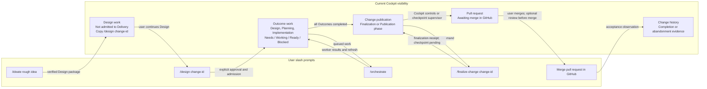
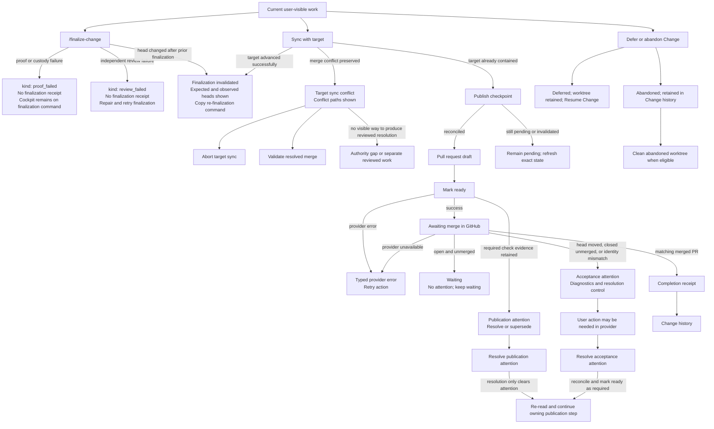

# Current User and Cockpit Change Flow

> **Owning request:** User-requested current-state research; no Delivery task ID
> **Date:** 2026-09-02
> **Question:** What does a user currently do, see, and receive from `/ideate` through a Change becoming visible in Change history, including the normal path and known recoverable failures?
> **Status:** Current behavior research draft

## 1. Context and Question

This document describes the current user-facing path through Design, Delivery, publication, provider acceptance, and Change history. It focuses on the two interfaces a user is expected to operate:

- slash prompts executed by VS Code agents; and
- Cockpit navigation, work-item rows, detail flyouts, buttons, copied commands, status messages, and history.

Delivery operations are grouped when they form one user-visible sequence. Internal commits, worktree custody, locks, and receipts are included only when they explain a visible prerequisite, output, or recovery action. Worktree management as a technical subject is intentionally out of scope for this document and can be researched separately.

The normal journey ends when an accepted Change has a persisted completion record and appears in **Change history**. An abandoned Change is also retained there as an abandonment record, separate from accepted completion. Worktree cleanup is described only where the current Cockpit exposes a user action. Accidental 500 errors are not modeled as workflow branches. Known, repeatable, or user-recoverable failures are either followed to a visible recovery route or listed as a bounded output note.

This is documentation of the status quo, not a proposed lifecycle model. Names such as `Design`, `Finalization`, `Publication`, `Awaiting merge`, and `Acceptance` are retained because they are the names currently emitted by the Delivery projection or rendered by Cockpit.

## 2. Sources Studied

| Source | What it establishes |
| --- | --- |
| [`share/prompts/ideate.prompt.md`](../../share/prompts/ideate.prompt.md) and [`share/prompts/design.prompt.md`](../../share/prompts/design.prompt.md) | User entry points for creating, resuming, revising, validating, and admitting one native Design package |
| [`share/prompts/orchestrate.prompt.md`](../../share/prompts/orchestrate.prompt.md) and [`share/skills/w-orchestration/SKILL.md`](../../share/skills/w-orchestration/SKILL.md) | User-invoked Delivery acquisition, worker dispatch, transition forwarding, recovery, and quiescence output |
| [`share/prompts/finalize-change.prompt.md`](../../share/prompts/finalize-change.prompt.md) and [`share/skills/w-change-finalization/SKILL.md`](../../share/skills/w-change-finalization/SKILL.md) | Exact-head finalization prerequisites, proof/review output, and finalization failure forms |
| [`serve/delivery/src/owlbear_delivery/portfolio_application.py`](../../serve/delivery/src/owlbear_delivery/portfolio_application.py), [`serve/delivery/src/owlbear_delivery/work_items.py`](../../serve/delivery/src/owlbear_delivery/work_items.py), and [`serve/delivery/src/owlbear_delivery/checkpoint_supervisor.py`](../../serve/delivery/src/owlbear_delivery/checkpoint_supervisor.py) | Target convergence, checkpoint publication, pull-request readiness, acceptance observation, projected publication phases, and background checkpoint retry |
| [`share/prompts/resolve-delivery-attention.prompt.md`](../../share/prompts/resolve-delivery-attention.prompt.md) and [`share/skills/w-delivery-attention-resolution/SKILL.md`](../../share/skills/w-delivery-attention-resolution/SKILL.md) | Interactive attention diagnosis, user choices, authorized remedies, and authority-gap behavior |
| [`serve/delivery/src/owlbear_delivery/work_items.py`](../../serve/delivery/src/owlbear_delivery/work_items.py) | The projection that decides when outcome/publication rows exist, their labels, needs, next steps, and available actions |
| [`serve/delivery/src/owlbear_delivery/portfolio_operating.py`](../../serve/delivery/src/owlbear_delivery/portfolio_operating.py) and [`serve/delivery/src/owlbear_delivery/portfolio_application.py`](../../serve/delivery/src/owlbear_delivery/portfolio_application.py) | Portfolio visibility, session guidance, admitted/unadmitted status, publication operations, acceptance reconciliation, and completed-history visibility |
| [`serve/cockpit/web/src/pages/WorkPortfolioPage.tsx`](../../serve/cockpit/web/src/pages/WorkPortfolioPage.tsx), [`serve/cockpit/web/src/components/WorkPortfolioTable.tsx`](../../serve/cockpit/web/src/components/WorkPortfolioTable.tsx), and [`serve/cockpit/web/src/components/WorkItemDetail.tsx`](../../serve/cockpit/web/src/components/WorkItemDetail.tsx) | Current Cockpit pages, rows, detail controls, confirmations, feedback, polling, and route changes |
| [`serve/cockpit/web/src/components/PortfolioOperatingSummary.tsx`](../../serve/cockpit/web/src/components/PortfolioOperatingSummary.tsx), [`serve/cockpit/web/src/components/DesignWorkSection.tsx`](../../serve/cockpit/web/src/components/DesignWorkSection.tsx), and [`serve/cockpit/web/src/components/CompletedHistoryWorkspace.tsx`](../../serve/cockpit/web/src/components/CompletedHistoryWorkspace.tsx) | Session suggestions, pre-admission Design visibility, and completed-history browsing |
| [`serve/cockpit/src/owlbear_cockpit/routes/target_work.py`](../../serve/cockpit/src/owlbear_cockpit/routes/target_work.py) and [`serve/cockpit/web/src/api/workItems.ts`](../../serve/cockpit/web/src/api/workItems.ts) | The HTTP controls and typed retry/error boundary behind Cockpit actions |
| [`serve/cockpit/web/src/__tests__/WorkPortfolio.test.tsx`](../../serve/cockpit/web/src/__tests__/WorkPortfolio.test.tsx), [`tests/test_cockpit_work_items.py`](../../tests/test_cockpit_work_items.py), and [`serve/delivery/tests/test_work_items.py`](../../serve/delivery/tests/test_work_items.py) | Executable examples of the current labels, visibility rules, action calls, failure feedback, and terminal history behavior |

No external sources were needed. No external source attribution entry was added.

## 3. Analysis

### 3.1 The two different meanings of "idea"

There are two current surfaces that can be confused:

1. `/ideate` creates or resumes a native, identified Design package owned by Delivery. The package contains authored intent and design bytes, has a `change_id` and `package_id`, and is initially **unadmitted**.
2. Cockpit's **Ideas** navigation opens a separate `/api/ideas` notebook. It supports editing, preview, save, unsaved-change protection, and disk-conflict choices. It does not invoke `/ideate`, create a native Change, or link a notebook entry to Design.

After `/ideate` has created a verified package, the Delivery portfolio discovers that package and exposes it as **Design work**. That is why a native idea can become visible in Cockpit even though the Ideas notebook is a different feature.

### 3.2 User interfaces and their current roles

| Interface | Current role | Direct result |
| --- | --- | --- |
| `/ideate` | Start discovery from a rough idea, or resume a named native Change | One active Design package, or the existing verified package rehydrated |
| `/design <change-id>` | Continue the named Design package through revision and admission gates | Explicitly admitted Delivery authority, if every gate and approval succeeds |
| `/orchestrate` | Run Delivery acquisition and dispatch the bounded Planner/Builder work returned by Delivery | Worker transitions, exact recovery results, typed attention, or quiescence |
| `/finalize-change <change-id>` | Prove and independently review one exact managed Change head | A finalization receipt and queued checkpoint, or a typed finalization/review failure |
| `/resolve-delivery-attention <change-id> <attention-id>` | Diagnose one exact retained Change or Integration attention and choose an authorized remedy | Resolved attention, deferred/abandoned Change, provider-waiting state, or an authority gap |
| Cockpit publication controls and checkpoint supervisor | Advance target synchronization, checkpoint publication, readiness, and acceptance observation at their separate authority boundaries | Draft/ready pull-request publication, user merge boundary, attention, or Change history |
| Cockpit `/delivery` | Show current Design, outcome, and Change-publication work; expose current controls and copied commands | A continuously refreshed operational view |
| Cockpit `/delivery/history` | Browse, search, and inspect completed records | Archived completion evidence |
| Cockpit `/ideas` | Edit the separate ideas notebook | Saved notebook content only |
| GitHub provider UI | The current user merge boundary; optional final product review can happen here before merge | A merged or unmerged pull request observation |

There is no separate `/accept` prompt. The user merges the pull request in GitHub, and acceptance is then observed by Cockpit's reconciliation loop or by the **Check GitHub acceptance** button.

### 3.3 Graphical normal path

The following diagram groups Delivery internals by the user-visible operation that owns them. It does not claim that every intermediate internal receipt is a separate user state.



### 3.4 Graphical attention and error paths

The diagram follows failures that have a current user-visible route. A command-side failure can leave the Cockpit projection unchanged; that is itself recorded as an output because it affects discoverability of the next step.



### 3.5 How current visibility is derived

#### Portfolio-level surfaces

| Current surface | Appears when | What the user receives |
| --- | --- | --- |
| **Session suggestions: Start with** | There are no unfinished Changes and no Design work | Copied `/ideate` and `/design <change-id>` commands. The `/ideate` command is not present in the product navigation or Ideas notebook. |
| **Session suggestions: Continue Design with** | One or more verified packages or admitted Changes are at Design | Copied `/design <change-id>` command(s). |
| **Session suggestions: Process queued work with** | Delivery has queued work and no active claims take precedence | Copied `/orchestrate` command. |
| **Session suggestions: `/orchestrate` is already working** | Delivery has active claims | A message that no new orchestration session is needed, with a copied `/orchestrate` command. |
| **Session suggestions: Review items that need you** | Portfolio work items have `needs = you` | A count-only message. The separate `Needs you` metric can filter the portfolio. |
| **Session suggestions: No session action needed** | The portfolio is waiting on dependencies and has no higher-priority guidance | A wait message; the normal portfolio polling continues. |
| **Design work** | A status is `admission = unadmitted` and `stage = design` | A row marked **Not admitted to Delivery**, a copied `/design <change-id>`, and a flyout containing verified intent/design sources. |
| **Delivery status: Runtime unavailable** | An admitted Change exists but its persisted runtime cannot be composed or read | The Change ID, stage if available, diagnostic code/detail, and no Cockpit repair control. |
| **Current Delivery group** | A Change is nonterminal | A Change group with outcome rows. Completed and abandoned Changes are excluded from Current delivery. |
| **Change history** | A completion or abandonment record is available from the history catalog | A paginated/searchable history list and receipt, legacy completion, or abandonment detail. |

The portfolio request is polled every three seconds. An open detail is also polled every three seconds. Acceptance reconciliation is different: visible `awaiting-merge` Changes are reconciled automatically every 30 seconds while the page is visible, with bounded backoff after provider failures.

#### Outcome rows and detail actions

Outcome rows use independent axes:

- `needs`: `Needs you`, `Blocked`, or no intervention;
- `activity`: `Working`, `Ready`, or `Idle`; and
- `next_step`: the current human-readable route.

A row's available action is selected from the first applicable condition below:

| Condition in the current Outcome binding | Cockpit action | Success output and resulting visibility |
| --- | --- | --- |
| Outcome is at `Design` | No direct row action; the row says **Re-admission required**. Returned Design detail may say **Resume `/design <change-id>`**. | The user returns to `/design`; the Outcome remains at Design until admitted authority is restored. |
| An unresolved Delivery request exists | **Answer request**, with a decision selector and/or response field | **Request answered.** The detail is refreshed and the request shows the recorded answer. |
| An unresolved requestless block exists | **Clear block**, requiring an operator note and evidence locator | **Block cleared.** The binding is refreshed and may become available to Delivery. |
| Recovery attention exists for a lost claim | **Recover confirmed-lost claim**, with confirmation showing the exact attempt and claim IDs | **Claim recovered.** The claim is released through Delivery; the next acquisition cycle can reconsider the Outcome. |
| A prior stage is available for an administrative backward move | **Review backward move**, then a confirmation listing invalidated Outcomes | **Moved backward. Reset: ...** or **Moved backward.** This is an administrative control, not the normal execution path. |
| No user/dependency attention and no active claim | The row says **Ready for Orchestration**; no direct `/orchestrate` button is attached to the row | The user copies/runs `/orchestrate`; Delivery chooses the launch order and worker. |
| Active worker claim | The row says **Working** and identifies Planner/Builder and task when available | Orchestration/worker output refreshes the row. The user does not transition the claim manually. |
| Incomplete dependency | The row says **Blocked** and names the dependency | The user waits for the dependency; no false action is offered. |
| Reviewed Outcome | The row says **Complete** and exposes acceptance/task evidence in detail | It contributes to the Change's publication gate. |

#### Change-publication row and phase actions

A separate **Change publication** row is added when all Outcomes are complete, or when the Change is deferred, abandoned, or has a retained Change publication/acceptance attention. Its `stage` field is null; the publication phase and `next_step` carry the user-facing progress.

| Current publication phase | Cockpit wording/action | When it becomes visible | Successful result |
| --- | --- | --- | --- |
| `ready-for-finalization` | **Ready for finalization**; copied `/finalize-change <change-id>` | All Outcomes are complete, no valid finalization exists, and Delivery exposes the finalization action. Finalization is withheld when active claims or an Integration repair claim remain. | The command's successful result is a finalization receipt and a queued checkpoint. |
| `finalization-invalidated` | **Finalization invalidated**; expected/observed heads may be shown; copied `/finalize-change <change-id>` labeled **Re-finalize Change** | A previously finalized exact head no longer matches the current Change head. | A successful re-finalization creates fresh exact-head authority and queues publication again. |
| `review-repair` | **Review feedback repair**; copied `/address-pr-feedback <change-id>` | Pull-request feedback repair has invalidated the prior finalization while the provider pull request remains open. | A reviewed repair commit can be finalized again. |
| `checkpoint-pending` | **Checkpoint pending** and button **Publish checkpoint** | Finalization exists but its checkpoint has not been reconciled, or the published head differs from the finalized head. | **Publication checkpoint reconciled.** The Change branch and draft pull request are bound to the finalized head when reconciliation completes. |
| `pull-request-draft` | **Pull request is draft**; button/link **Mark ready**; detail button **Check publication** | The checkpoint is published and the pull request remains draft. | **Pull request marked ready.** The Change enters awaiting merge, unless provider evidence creates publication attention. |
| `awaiting-merge` | **Awaiting merge in GitHub**; next step **Merge pull request in GitHub**; button **Check GitHub acceptance**; detail button **Check publication** | A matching ready pull request exists and has not yet been accepted. | A matching merged observation can create the completion record. An open, unmerged PR remains waiting. |
| `acceptance-observed` | **Acceptance observed**; no normal current-portfolio row after completion | A matching merged pull-request observation has been latched and completion is recorded. | The current Change is removed from normal Delivery and appears in Change history. A direct publication detail can still render cleanup if a retained worktree is eligible. |
| `deferred` | **Change deferred**; button **Resume Change**; Change controls retain **Abandon Change** | The user has explicitly deferred the Change with a reason. The worktree is retained. | **Change resumed.** The refreshed projection returns to the prior applicable Delivery/publication work. |
| `abandoned` | **Change abandoned**; no resume or defer action | The user has explicitly confirmed abandonment. | **Change abandoned.** It is excluded from Current delivery and retained in Change history. If cleanup is eligible, **Clean abandoned worktree** is shown. |

A retained `publication.attention` takes precedence over the ordinary publication action. Its label is **Resolve publication attention** or **Resolve acceptance attention**, and the detail shows diagnostics plus the exact disposition ID. For ordinary publication attention, the detail may also show **Supersede publication** when publication history exists. A target-sync conflict is a special publication attention: the generic resolver and supersession controls are suppressed while the conflict-specific controls are shown.

### 3.6 Normal path in user-facing groups

#### Group 1: Start and shape one native Change

1. The user invokes `/ideate` with a rough idea, or with an existing native `change_id` to resume it.
2. The Designer calls `create_design_session` once for a new identity or `read_design_session` for an existing one. It preserves the returned `package_id` for compare-and-swap revision.
3. The user and Designer clarify intent and design one material question at a time. Authored revisions remain in the active package; the package is not yet admitted to Delivery.
4. Cockpit can now discover the verified package. In `/delivery`, the user sees **Design work**, **Not admitted to Delivery**, the generated display title, and a copied `/design <change-id>` command. The detail flyout shows the verified Intent and Design sources.
5. The user invokes `/design <change-id>` to continue. The Designer rehydrates the same package, performs derivation, challenge, baseline, checkpoint, validation, and explicit approval in the defined order, then calls `admit_delivery_change` only for the unchanged approved package.
6. Successful admission produces admitted Delivery authority, a frontier, and an initial admitted Design package checkpoint. When publication providers are configured, admission also attempts the first checkpoint reconciliation. The user-facing result is that the Change is now admitted and its active Delivery work can appear in the portfolio.

The Cockpit does not have a **Start `/ideate`** button in the Ideas page. The only current copied `/ideate` call to action is the `create-change` session suggestion when the Delivery portfolio has no unfinished Change or Design work.

#### Group 2: Run Delivery work

1. Admitted Outcomes appear in the Change group at their current progress stage: Design, Planning, or Implementation.
2. If no user request, block, dependency, or active claim controls the next step, the Outcome says **Ready for Orchestration**. Portfolio guidance offers copied `/orchestrate`.
3. The user invokes `/orchestrate`. Delivery owns acquisition, capacity, task identity, claim custody, launch order, and the expected worker role. The Orchestrator dispatches Planner/Builder work and forwards each worker transition unchanged.
4. The output is a bounded session report: launches handled, transitions forwarded, exact recoveries, typed Integration attention, and eventual quiescence or a fail-closed stop. Cockpit refreshes the Outcome rows to **Working**, **Ready**, **Blocked**, **Needs you**, or **Complete**.
5. If a Delivery request, requestless block, or confirmed-lost claim appears, the corresponding Outcome row and detail control become visible. The user answers, supplies evidence, or confirms exact claim loss; these actions do not replace worker execution.
6. When all Outcomes are reviewed and complete, the Change publication row is added.

The normal execution sequence is therefore not a button chain in Cockpit. `/orchestrate` is a copied session command, while the per-Outcome user controls appear only when Delivery says a human intervention is needed.

#### Group 3: Prove and finalize the reviewed Change

1. The publication row displays **Ready for finalization** and a copied `/finalize-change <change-id>` command. This command is intentionally not executed by the Cockpit button surface.
2. The Finalizer reads `show_finalization_context`, verifies the managed Change head and clean custody, runs relevant maintained checks, obtains an independent exact-commit review, and calls `finalize_change` only when the identities still match.
3. Success returns `kind: finalized`, the exact head, and a `finalization_id`. Delivery queues a checkpoint; Cockpit refreshes to **Checkpoint pending**.
4. A finalization attempt does not publish the checkpoint, mark a pull request ready, merge a pull request, or observe acceptance. Those are later user-facing groups.

#### Group 4: Converge the target and publish the checkpoint

Cockpit exposes publication operations as individual detail controls. A Delivery checkpoint supervisor retries pending checkpoint reconciliation while a host process is alive; it does not cross the user merge or reviewed-code boundaries.

1. **Target convergence.** The publication workflow first checks whether the current integration target is already contained by the finalized Change head. If it is not, it invokes target synchronization through the managed Change worktree. A successful synchronization changes the Change head and invalidates the old finalization, so the user receives `needs_finalization` and `/finalize-change <change-id>` rather than a published unfinalized merge.
2. **Checkpoint publication.** Once the finalized head contains the current target, `reconcile_change_checkpoint` publishes the Change branch and creates or reconciles the draft pull request and generated summary. The Cockpit button is **Publish checkpoint**. A result with `reconciled = false` does not claim success; the row remains **Checkpoint pending** and the exact state must be refreshed.
3. **Draft inspection and optional review.** The user can inspect the pull request in the provider before making it ready. The current publication detail shows repository, pull-request number, and heads; the history detail later provides a direct pull-request link. There is no separate Cockpit state named "user review".
4. **Publication checks.** In draft and awaiting-merge phases, **Check publication** can observe provider checks for the exact published head. It records and displays check names, required/optional status, blocking state, provider status/conclusion, observed commit, and observation time. This is an observation control, not a merge control.
5. **Ready boundary.** **Mark ready** calls the Delivery ready operation. Delivery may retain required check failures as publication attention after marking the pull request ready; it does not make the Cockpit check observation itself a readiness gate.

The wording is intentionally kept as current: the checkpoint is called published before the provider pull request is merged, while the Change is not completed until acceptance observes the user-merged pull request. This terminology is noted as a documentation bycatch below, not resolved here.

#### Group 5: User merge and acceptance

1. The row changes to **Awaiting merge in GitHub**. The card says **Needs you**, names **Merge pull request in GitHub**, and displays the provider repository and pull-request number in detail.
2. The user may review the pull request and resulting product in GitHub, then merges it there. Delivery does not merge the pull request.
3. Cockpit automatically reconciles eligible awaiting-merge Changes every 30 seconds while the page is visible. The user can also press **Check GitHub acceptance** when the provider merge boundary has been reached.
4. If the provider reports an open, unmerged pull request with the exact expected head, the result is waiting. A manual observation renders `ERR_DELIVERY_ACCEPTANCE_WAITING` as status feedback rather than as a terminal failure.
5. If the provider reports a matching merged pull request, Delivery creates the receipt-backed completion record. Cockpit shows **GitHub acceptance observed.**, refreshes the portfolio, removes the completed Change from Current delivery, and routes the user to `/delivery/history` when the selected Change disappears.
6. Change history then exposes accepted completion evidence or, for an abandoned Change, the abandonment reason, prior stage, retained outcomes, and cleanup state. This is the terminal user-facing point covered by this document.

### 3.7 Separate user disposition paths

These controls are available on the Change publication detail for a non-abandoned Change, including a Change that is otherwise moving through finalization or publication.

#### Defer

- The user enters a reason and presses **Defer Change**.
- Delivery records the deferral and retains the Change worktree.
- Cockpit refreshes the publication row to **Change deferred** and exposes **Resume Change**.
- Resume calls `resume_change` without another reason. The refreshed projection returns to the previously applicable state; it does not imply that publication or finalization authority has been recreated.

#### Abandon

- The user enters a reason, presses **Abandon Change**, and confirms a modal that says abandonment is permanent and the Change will be retained in Change history as an abandoned record.
- Delivery records terminal abandonment without merging or completing the Change.
- Cockpit removes the abandoned Change from Current delivery and retains it in Change history with **Change abandoned**.
- When Delivery says cleanup is eligible, the detail exposes **Clean abandoned worktree** and a confirmation. Successful cleanup returns **Abandoned Change worktree cleaned up.** The Change remains abandoned.

### 3.8 What the Cockpit does after a terminal Change

The current portfolio excludes completed and abandoned Changes. Change history is a separate read surface with:

- `/delivery/history` navigation;
- paginated list loading;
- debounced full-text search;
- **Load more** for later pages;
- a completion or abandonment detail flyout; and
- retry and stale-result feedback when history reads fail.

The receipt-backed history detail distinguishes the finalized Change head from the accepted merge commit and retains pull-request identity, target, merge, completion, acceptance-observation, check-observation, and review identities. An abandoned record retains the abandonment reason, prior stage, outcomes, and whether worktree cleanup remains available. A legacy package record can also appear and is labeled **Legacy package**.

The current `WorkItemDetail` component also knows how to render **Clean completed worktree** for an `acceptance-observed` publication detail when Delivery reports cleanup eligibility and supplies the exact completion ID. However, normal completion refresh removes the Change from the current portfolio and routes the user to history, while the history detail has no cleanup control. The current source therefore exposes the completed cleanup operation in the publication detail model but does not establish a normal history-based route to it. This is recorded as a visibility observation, not treated as part of the normal archive path.

## 4. Visibility and Action Matrix

The following matrix lists the user-facing controls that can affect or explain the flow. A copied command is deliberately distinguished from a button that calls the Cockpit API directly.

| User control or output | Surface | Current visibility condition | Delivery or provider operation grouped behind it | Success output | Failure/attention output |
| --- | --- | --- | --- | --- | --- |
| Copy `/ideate` | Delivery session suggestions only | No unfinished Change and no Design work | User starts a Designer session | New native Design package or resumed package | Agent session reports package conflict or invalid input; no native package is admitted |
| Copy `/design <change-id>` | Design work row, Design detail, session suggestions | Verified unadmitted package or Design re-entry | Read/revise package, derive, challenge, baseline, checkpoint, validate, approve, admit | Admitted authority and active Delivery work | Package conflict, unresolved gate, failed baseline/challenge/validation, or no admission; package remains available for resume |
| Copy `/orchestrate` | Session suggestions | Queued work or active orchestration guidance | Acquire, dispatch Planner/Builder, forward transitions, recover failed claims | Worker transitions, refreshed rows, or quiescence | Typed Integration attention, exact recovery result, unclaimed acquisition failure, or fail-closed stop |
| Answer request | Outcome detail | Unresolved Delivery request | Resolve one request with selected option/text | **Request answered.** | Typed Delivery rejection; request remains unresolved |
| Clear block | Outcome detail | Requestless unresolved block and required note/locator supplied | Clear one exact block with evidence | **Block cleared.** | Block remains and error feedback is shown |
| Recover confirmed-lost claim | Outcome detail | Delivery reports recovery attention and user confirms exact claim loss | Recover exact attempt/claim | **Claim recovered.** | Recovery attention remains; no process-status inference is used |
| Review/confirm backward move | Outcome detail under **Administrative actions** | Earlier stage is available | Preview and apply a reasoned administrative move | **Moved backward. Reset: ...** | Snapshot may be stale; the user must review again |
| Copy `/finalize-change <change-id>` | Publication row and publication detail | `ready-for-finalization` or `finalization-invalidated` and Delivery exposes finalization action | Exact-head custody checks, maintained observations, independent review, finalization | `kind: finalized`, finalization ID, queued checkpoint | `proof_failed`, `review_failed`, or `dispatch_failure`; no finalization receipt |
| Publish checkpoint | Publication detail and action link | `checkpoint-pending` | Publish Change branch, create/reconcile draft PR, update generated summary, acknowledge checkpoint | **Publication checkpoint reconciled.** | Still pending, invalidated finalization, provider/baseline failure, or typed Delivery error |
| Sync with target | Publication detail | No Change attention, and phase is not deferred, abandoned, or acceptance-observed | Read current target and synchronize through Delivery | **Target synchronized with the integration target.** | Target-sync conflict with preserved paths, finalization invalidation, or typed target/provider error |
| Abort target sync | Publication detail | A target-sync conflict and matching publication attention | Abort exact preserved target-sync operation | **Target sync conflict aborted.** | Stale attention or exact identity rejection |
| Validate resolved merge | Publication detail | A target-sync conflict and matching publication attention | Validate the exact resolved target-sync operation | **Resolved target sync is ready for review.** | Conflict remains or authority/review is missing |
| Check publication | Publication detail | `pull-request-draft` or `awaiting-merge`, published head and publication identity available | Observe provider checks for exact published head | Exact commit, check list, blocking state, and observation time shown | Typed provider/check error; retry control remains. A changed published head clears stale local results |
| Mark ready | Publication detail or action link | `pull-request-draft` | Mark current exact PR ready; Delivery also observes required checks | **Pull request marked ready.** or publication attention | Provider error or retained publication attention with diagnostics/disposition ID |
| Supersede publication | Publication detail | Ordinary publication attention, publication history exists, and no target-sync conflict | Publish successor PR/publication from current reviewed head | **Publication superseded.** | Retry-safe provider failure reuses operation identity; exact identity errors remain |
| Resolve publication attention | Publication detail and action link | `publication-attention`, except target-sync conflict presentation | Clear exact Change disposition | **Change attention resolved.** | Resolution does not itself restore finalization/checkpoint/ready authority |
| Resolve acceptance attention | Publication detail and action link | `acceptance-attention` | Clear exact Change disposition | **Change attention resolved.** | Provider action, reconciliation, reopening, or re-readying may still be required |
| Check GitHub acceptance | Publication detail and action link | `awaiting-merge` | Observe exact provider PR; create completion only on matching merge | **GitHub acceptance observed.** and navigation to history after refresh | Open/unmerged yields `ERR_DELIVERY_ACCEPTANCE_WAITING`; mismatch/closed-unmerged can create attention; provider failure is retryable |
| Automatic checkpoint reconciliation | Delivery host process | Pending checkpoint exists and publication providers are configured | Bounded background checkpoint reconciliation | Published branch/draft PR or retained pending state | Pending checkpoint remains durable; sibling Changes continue independently |
| Automatic acceptance reconciliation | Current Delivery page | Visible `awaiting-merge` publication cards | Batch provider observations every 30 seconds | Completion, waiting, or refreshed attention state | Provider-unavailable banner with **Retry acceptance check**; waiting remains nonterminal |
| Defer Change | Publication detail | Non-abandoned Change publication detail; omitted when already deferred | Record reasoned deferral and retain worktree | **Change deferred.** | Typed rejection; reasoned controls remain |
| Resume Change | Publication detail and action link | `deferred` | Resume exact deferred Change | **Change resumed.** | Typed rejection; remains deferred |
| Abandon Change | Publication detail | Non-abandoned Change publication detail | Record explicit permanent abandonment | **Change abandoned.** | Confirmation remains open on failure; Change is not completed |
| Clean abandoned worktree | Publication detail | Abandoned phase and Delivery reports cleanup eligible | Remove managed abandoned worktree while retaining branch/state | **Abandoned Change worktree cleaned up.** | Blocked cleanup reason or confirmation-preserved typed failure |
| Recover missing worktree | Publication detail | Missing worktree attention, valid reviewed head, and recovery eligibility | Recreate canonical managed worktree after confirmation | **Missing Change worktree recovered.** | Blocked reason, ownership attention, or confirmation-preserved typed failure |
| Clean completed worktree | Publication detail only in the model | `acceptance-observed` and exact completion ID/cleanup eligibility | Remove managed completed worktree | **Completed Change worktree cleaned up.** | Blocked cleanup reason or typed cleanup failure; normal history detail does not expose this control |
| History search/inspect | Change history | Completion or abandonment record is listed | Read/search completion catalog | Terminal evidence and provider link/detail | Retry history, retry loading more, stale result status, or close missing detail |

## 5. Known Error and Attention Paths

### 5.1 Finalization proof, dirty worktree, or unknown new commit

The Finalizer is deliberately exact-head and clean-custody based. Before it calls `finalize_change`, it verifies the managed branch, Change head, reviewed head, and clean state, then runs maintained checks and obtains an independent review.

The relevant current outputs are:

```yaml
kind: proof_failed
change_id: <change-id>
failed_operation: <preflight or maintained check>
reason: <bounded reason>
```

or:

```yaml
kind: review_failed
change_id: <change-id>
exact_head: <exact reviewed head>
reason: <bounded reason>
```

A dirty worktree or an unknown new commit therefore produces no finalization receipt. The command session reports the reason, but the Cockpit publication row has no finalization-failure detail endpoint. It normally remains **Ready for finalization** with the copied finalization command until the underlying condition is corrected. If Delivery later observes a finalized head drift, the row instead becomes **Finalization invalidated**, shows expected/observed heads, and offers the copied re-finalization command.

This is a documented failure output rather than a separate deep Cockpit branch because the current Cockpit does not receive the command's proof result directly.

### 5.2 Target became stale

When the finalized Change does not contain the current integration target, publication uses target synchronization before checkpoint publication.

- Successful synchronization returns a target-sync receipt and the Cockpit message **Target synchronized with the integration target.**
- The Change head has changed, so the prior finalization is invalidated.
- The publication workflow returns `needs_finalization` with `/finalize-change <change-id>`.
- The user must finalize the new exact head before the checkpoint can be published.

The sync is therefore not a transparent background refresh from the user's point of view; it is a grouped operation with a deliberate return to finalization.

### 5.3 Target-sync merge conflict

A target-sync merge conflict is preserved as a Change publication attention. Cockpit shows:

- **Target sync conflict**;
- operation ID, target head, and reviewed head;
- conflict paths when Git reports them; and
- **Abort target sync** and **Validate resolved merge** when the matching Change attention record is present.

Abort returns a typed abort receipt and clears the exact conflict exit. Validation requires the preserved conflict to have been resolved in the exact Delivery context; it does not itself invent reviewed implementation authority. If the matching attention record is not present, Cockpit says **Waiting for the matching Change attention record.**

The current visible controls do not explain a complete user-side path for producing a reviewed conflict resolution. The publication workflow explicitly refuses raw Git conflict repair and can report an authority gap when no exact reviewed Delivery route exists. That is retained here as a known current boundary, not expanded into worktree instructions.

### 5.4 Publication checkpoint does not finish

A checkpoint reconciliation can return `reconciled = false`, or a later read can show that the pending checkpoint or finalization authority changed. Cockpit deliberately does not display **Publication checkpoint reconciled.** unless the response says it was reconciled. The row remains **Checkpoint pending**, and the user must use the refreshed exact state rather than assume a draft pull request exists.

A publication-baseline-unavailable condition can be retained as publication attention. It is not expanded here because its repair is an authority/recovery operation rather than a normal user choice.

### 5.5 Provider checks and publication attention

`mark_change_ready` marks the exact pull request ready and observes required provider checks. Required failures can be retained as publication attention after the ready operation. Cockpit then shows the diagnostics and disposition ID, and can expose both **Resolve publication attention** and **Supersede publication** for ordinary publication attention.

The attention-resolution workflow is more specific than the button label:

- re-observe exact-head checks when the diagnostic is a required-check failure;
- clear the disposition only when the current evidence permits it; and
- re-read finalization/checkpoint authority before trying readiness again.

Provider-unavailable errors are typed by the backend and rendered with a retryable action. The UI also tells the user when returned check results were truncated or became stale because the published head changed.

### 5.6 Acceptance waiting, provider failure, and acceptance attention

These are distinct current outcomes:

| Provider observation | Current result | User path |
| --- | --- | --- |
| Open PR, not merged, exact expected head | `waiting`; manual button can show `ERR_DELIVERY_ACCEPTANCE_WAITING` | Wait. No attention is created. Cockpit continues polling. |
| Provider unavailable | `provider-unavailable` or a typed provider error | Use **Retry acceptance check** or retry the command. The Change remains awaiting merge. |
| Open PR head differs from finalized head | `head-moved`; finalization is invalidated and acceptance attention may be captured | Inspect exact diagnostics, resolve the provider/Change condition through the owning attention workflow, then re-finalize/re-publish as required. |
| Closed PR without merge | `attention`; **Acceptance attention** | The user may need to act in the provider, then resolve the exact attention and follow the refreshed publication route. |
| Provider identity/base/head/merge evidence does not match | `attention`; diagnostics retained | Do not infer completion. Resolve only after the exact evidence is corrected or the owning workflow reports an authority gap. |
| Matching merged PR, merge commit, target, head, and timestamps | `completed`; completion receipt | Cockpit refreshes and moves the user to Change history. |

The current UI exposes an acceptance-resolution button, but it does not itself merge, reopen, or otherwise repair the provider pull request.

### 5.7 Missing or retained worktree when it reaches the user surface

Worktree details are deliberately bounded in the Cockpit, but two user controls are visible:

- **Recover missing worktree** appears only when Delivery reports a missing worktree, a valid exact reviewed head, and recovery eligibility. The modal requires explicit confirmation and states that the Change branch/reviewed head remain unchanged.
- **Clean abandoned worktree** or **Clean completed worktree** appears only after the corresponding terminal state and Delivery cleanup eligibility. The modal states that the directory is removed while the branch and cleanup receipt remain.

If the worktree is dirty, locked, missing required authority, affected by an active writer/publication lease, or has another ownership attention, Cockpit renders a blocked reason rather than offering destructive cleanup. A failed confirmation keeps the modal open and displays typed error feedback.

### 5.8 Lower-level or less useful branches noted but not expanded

The following are known output conditions but are not expanded into full flow trees here:

- malformed Cockpit input (`422` typed validation response);
- missing Change, work item, Design package, or history record (`404`/unavailable detail);
- busy attention resolution or acceptance reconciliation skipped because state changed;
- Delivery runtime unavailable or persisted authority invalid;
- provider authentication, timeout, or unavailable errors on publication calls;
- publication check lists truncated by the bounded response;
- history page/search/detail read failure with stale-result retention; and
- cleanup blocked by active writer, publication lease, nonterminal state, orphan state, or worktree attention.

These outputs are still visible through retry, stale-result, diagnostic, or blocked-state copy where the current Cockpit has a surface for them. Unintentional server 500s are outside the modeled workflow.

## 6. Bycatch Observations About Gaps and User Orientation

These observations are deliberately secondary to the current-state documentation.

1. **`/ideate` is discoverable only in a narrow Cockpit context.** The Delivery empty-state session suggestion copies `/ideate`, but the Ideas page and primary navigation do not link to it. A user who starts in the Ideas notebook or opens Cockpit with existing work must already know the prompt or encounter a Design row.
2. **The control surface is mixed.** Design, orchestration, and finalization are copied slash commands; publication, acceptance, disposition, and recovery are direct Cockpit buttons. This is current behavior, but it makes the boundary between "Cockpit guides" and "user must start an agent session" uneven.
3. **Some visible controls expose deterministic Delivery operations rather than a user decision.** In particular, **Publish checkpoint**, **Mark ready**, **Check GitHub acceptance**, and **Sync with target** are individual operations because each has a distinct authority/result boundary. The checkpoint supervisor retries only the durable checkpoint obligation.
4. **`Sync with target` is visible more broadly than the publication prompt uses it.** The detail component shows it for most nonterminal, nonattention publication phases, while the publication workflow treats target synchronization as the first step only when the finalized head does not contain the current target. The backend remains authoritative, but the UI can invite an operation that the grouped publication workflow would decide is unnecessary.
5. **Attention resolution is not symmetrical with the attention prompt.** Cockpit can directly call **Resolve publication attention** or **Resolve acceptance attention**, while `/resolve-delivery-attention` is an interactive diagnosis and choice workflow. The direct button does not present the prompt's preservation/provider-action/authority-gap choices. This may be intentional for a disposition that Delivery already authorizes, but the current surfaces do not explain the distinction.
6. **Acceptance attention has no complete Cockpit repair route.** The detail shows diagnostics and a disposition ID, but the current Work Item view does not provide a provider pull-request link or an explicit reopen/action route. The user may need to leave Cockpit, act in GitHub, run the attention prompt, and then return to the publication sequence.
7. **Finalization failure visibility ends at the command session.** Dirty custody, an unknown new commit, failed maintained checks, and failed independent review produce useful Finalizer output, but the Cockpit publication card generally remains at the same finalization command until a later Delivery observation changes its projection. The UI does not show the failure reason in the publication detail.
8. **Completed cleanup is modeled but not normally reachable from history.** The publication detail can render a completed-worktree cleanup action, but normal completion removes the Change from Current delivery and the history detail exposes no cleanup control. The status quo does not establish whether completed cleanup is intended to be automatic, optional, or only available through a direct route.
9. **Abandoned records share the Change history surface with accepted completions.** This keeps terminal evidence discoverable without treating abandonment as successful completion.
10. **Terminology crosses boundaries.** A checkpoint can be published while a Change is still awaiting merge in GitHub; only acceptance observation creates an accepted completion record. The distinction is operationally meaningful, but "published" can still be read as "merged" by users.

None of these observations is a conclusion that the current design is wrong. They identify places where a later improvement discussion should ask whether Cockpit is showing a necessary user decision, a required user action, an optional review boundary, or a deterministic Delivery operation that could be grouped more fully.

## 7. Recommendation, Confidence, and Limits

### Current documentation conclusion

The current user path is coherent enough to document as:

```text
native Design package
  -> explicit Design admission
  -> admitted Outcome work
  -> Orchestration until Outcomes are reviewed complete
  -> exact-head Finalization
  -> target convergence and checkpoint publication
  -> draft/ready pull request
  -> user merge in GitHub
  -> provider acceptance observation
    -> Change history
```

The main factual distinction to preserve in future documentation is that a native `/ideate` package, the Cockpit Ideas notebook, an admitted Delivery Change, a publication row, and a Change-history record are different current surfaces. The current flow also has two kinds of user intervention: meaningful input/choice at Design and attention/disposition boundaries, and operational actions such as evidence entry, target-sync exit, defer/abandon, acceptance observation, and cleanup.

### Confidence

High confidence for current labels, visibility conditions, direct Cockpit controls, API operation names, polling behavior, completion routing, and the normal publication/acceptance boundaries. These are grounded in the current projection, React components/hooks, backend routes, prompts, and tests.

Medium confidence for the exact user experience after command-side finalization failures and target-sync conflict resolution, because those operations report through agent sessions and/or preserved Delivery authority rather than through a dedicated Cockpit failure record. The document reports what the current sources guarantee and marks the missing user-facing continuation as an observation.

### Limits

- This is not a worktree-management or data-lineage study.
- It does not inspect live GitHub or a running Cockpit session; provider behavior is represented from current source contracts and tests.
- It does not propose new states, rename current labels, or decide whether publication should mean PR creation or merge.
- It does not model accidental server 500s.
- The checkpoint supervisor retries pending publication work, but does not replace user review, provider merge, or exact-head finalization.
