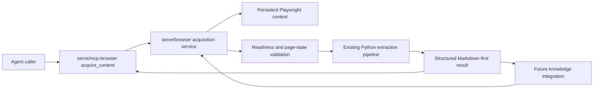

## Context

OwlBear currently has the pieces of browser extraction but not a complete acquisition capability. The change crosses browser lifecycle, extraction, MCP transport, tool configuration, agent guidance, and dependency setup, so the design must establish one behavioral owner and one result contract before implementation.

### Current-State Evidence

| Claim | Evidence state | Controlling authority | Consequence |
|---|---|---|---|
| DDGS extraction is a synchronous unauthenticated HTTP request without browser rendering, browser storage, or authentication inputs. | Observed, high confidence | Installed `ddgs 9.14.4` behavior and OwlBear DDGS MCP usage | DDGS cannot satisfy rendered or authenticated acquisition. |
| Browser launch, persistent context, extraction, cleanup, and Markdown conversion already exist in Python. | Observed, high confidence | `serve/browser/src/owlbear_browser/` | Extend the existing package instead of introducing another extraction runtime. |
| Current browser fetch waits only for `domcontentloaded`, captures immediately, and returns a string. | Observed, high confidence | `serve/browser/src/owlbear_browser/fetcher.py` | Readiness, validation, provenance, links, and structured failures require a new acquisition contract. |
| The browser MCP currently exposes interactive operations but not structured acquisition. | Observed, high confidence | `serve/mcp-browser/src/owlbear_mcp_browser/server.py` | Add a thin acquisition tool without merging it with arbitrary actions. |
| Knowledge models browser transport, but the MCP knowledge composition intentionally raises an unwired-browser error. | Observed, high confidence | `serve/knowledge/.../protocols/sources.py`, `serve/knowledge/.../source_fetcher.py`, and `serve/mcp-knowledge/.../_types.py` | This change must not claim source ingestion or hide integration inside the MCP adapter. |
| Playwright Chromium with Microsoft's SSO extension and a persistent profile acquired corporate SharePoint, Jira, and Confluence on managed Windows. | Observed assembled evidence, high confidence | `.owlbear/research/cdp-spike-results.md` | Preserve this launch capability and repeat corporate proof when the environment is available. |
| Corporate policy blocks CDP through `RemoteDebuggingAllowed=0`. | Observed production-policy evidence, high confidence | `.owlbear/research/cdp-spike-results.md` and managed browser policy | CDP is not a supported foundation or fallback. |
| Microsoft corporate SSO behavior on the future managed Mac is unknown. | Unresolved | Future managed-macOS environment | Failure limits Microsoft corporate SSO on that host; it must not disable public or ordinary persistent-session auth. |

### Stakeholders and Constraints

- The direct user is a single OwlBear operator supplying a known URL from a local workspace.
- Agents need an MCP tool now; future knowledge ingestion needs an in-process Python API.
- Corporate credentials and MFA material must remain between the user and the visible browser.
- Intranet URLs and enterprise SSO redirects cannot be modeled reliably by a static public-host policy.
- Markdown is the downstream content contract. HTML is evidence for diagnostics, not normal payload.
- MarkItDown continues to own supported document formats, and existing interactive browser tools retain their current purpose.

## Goals / Non-Goals

**Goals:**

- Define one typed single-page acquisition request/result contract in `serve/browser`.
- Acquire meaningful content from rendered public pages and persistent-session authenticated pages.
- Let users complete authentication manually without passing credential values through OwlBear tools.
- Expose the core contract through a thin, structured MCP tool.
- Produce Markdown, provenance, normalized inert links, stable hashing, and non-sensitive diagnostics.
- Fail explicitly for authentication, access, readiness, selection, redirect validation, download, navigation, and extraction problems.
- Remove DDGS completely and make the remaining tool-routing choices unambiguous.
- Prove load-bearing behavior at assembled browser boundaries rather than relying only on mocked delegation tests.

**Non-Goals:**

- Crawling, approving, registering, refreshing, relating, or ingesting discovered pages.
- Making `AuthenticatedWebConfig.auth_profile` or `page_limit` operational in this change.
- Calling the browser MCP server from the knowledge MCP server.
- Credential capture, password or MFA automation, generic form automation, or caller-provided JavaScript.
- Replacing MarkItDown or the separately authorized interactive browser tools.
- Promising Microsoft corporate SSO on macOS before assembled validation is possible.

## Architecture

`serve/browser` is the behavioral owner. It owns request validation below transport concerns, browser-page lifecycle, authentication and readiness classification, content selection, extraction, link normalization, hashing, redaction, and result semantics.

`serve/mcp-browser` composes that service in its existing lifespan and exposes a tool whose input and output are serializable representations of the core types. It may perform MCP schema validation and map unexpected exceptions to the server's established error envelope, but it does not implement a second acquisition policy.

`serve/knowledge` and `serve/mcp-knowledge` remain unchanged. The required next proposal composes the core library directly and decides source lifecycle, approval, refresh, and page-limit semantics.

## Decisions

### 1. Use a typed result instead of `fetch(url) -> str`

The core API will accept an acquisition request and return a discriminated result. The result has a stable status plus fields that are populated according to that status.

The success representation includes:

- `status`
- `requested_url`
- `canonical_url`, defined as the validated final browser URL
- ordered `redirect_chain`
- `title`
- canonical `markdown`
- normalized `discovered_links`
- `content_hash`, computed as SHA-256 over normalized canonical Markdown
- timezone-aware UTC `fetched_at`
- structured non-sensitive `diagnostics`

Expected non-success statuses include `authentication_required`, `content_not_ready`, `selector_not_found`, `access_denied`, `redirect_rejected`, `unsupported_target`, `download_rejected`, `navigation_failed`, and `extraction_failed`. Implementation may refine names while preserving the normative distinctions in the specs.

Diagnostics identify the acquisition stage, deadlines and selectors used, final URL, and redacted observations. They never contain cookies, storage state, authorization headers, credential values, session tokens, or unredacted sensitive response headers. Sanitized HTML is produced only when diagnostics are explicitly requested and remains size-bounded.

**Rejected:** Extending the existing string fetcher with exceptions only. It cannot represent provenance, inert links, successful empty-value prohibitions, or stable transport serialization without parallel side channels.

### 2. Keep a lifespan-owned persistent browser context

The browser service owns one dedicated persistent Playwright profile for the server lifespan. Each acquisition uses a page within that context. Normal terminal outcomes close the attempt page; an `authentication_required` outcome leaves the visible interaction page available and records it as a pending authentication attempt. A retry reuses the profile and either reuses or replaces the pending page in a bounded way so tabs do not accumulate.

Browser startup reports capabilities rather than equating support with one operating system. At minimum the report distinguishes persistent-profile support, visible manual-auth support, and optional Microsoft SSO-extension support. The proven Windows extension discovery remains an optional launch integration. Its absence is diagnostic, not a browser startup failure for unrelated pages.

**Rejected:** CDP connection to the user's managed browser. Corporate policy blocks it, and its availability would make the core design environment-dependent.

**Rejected:** Passing cookies or storage state through MCP. That would expose session secrets and duplicate browser-profile ownership.

### 3. Use a staged acquisition state machine

The core executes these stages under explicit deadlines:

1. Validate the request and accept only HTTP(S) navigation without caller script or credential fields.
2. Create or select the bounded acquisition page and install navigation, redirect, response, and download observers.
3. Navigate to `domcontentloaded` under a navigation deadline.
4. Reject a download and collect the ordered web redirect chain and final URL.
5. Classify authentication, consent, trust, access-denied, and unrelated-final-page states using combined URL, document, response, and content signals.
6. If a readiness selector exists, wait for its required visible/non-empty state.
7. Otherwise repeatedly derive meaningful candidate content and require non-empty content stability across observations within the readiness deadline.
8. If a content selector exists, require a non-empty match and scope extraction and link discovery to that region.
9. Extract and clean Markdown, reject an empty result, normalize links, hash canonical Markdown, and return provenance.

Fixed delays may be used only as a polling interval or test fixture behavior; elapsed time alone never establishes success.

Authentication and access classification is deliberately evidence-based rather than a global domain list. Signals are combined so a page containing the word "login" in ordinary content does not automatically fail. The result reports which non-sensitive signals caused classification. Unknown ambiguous terminal pages fail closed as validation failures instead of becoming content success.

**Rejected:** `domcontentloaded` plus a fixed sleep. Existing spike code showed feasibility, but this cannot distinguish a loaded shell from stable user content.

### 4. Treat the explicit root URL as local user authorization

The acquisition tool is a local, user-directed browser capability. A valid caller-supplied HTTP(S) URL authorizes navigation to that page and its HTTP(S) redirects, including private and loopback destinations. Redirects remain observable and the final page must pass content/authentication validation.

The blast radius is constrained by capability shape:

- only one explicit page is acquired;
- discovered links are returned as inert data;
- no caller JavaScript is accepted;
- non-web schemes and downloads are rejected;
- no arbitrary actions are added to the acquisition request;
- diagnostics are redacted;
- existing interactive actions remain separately granted.

**Rejected:** Reusing the current static domain allowlist and blanket private-address check for acquisition. Those controls would prevent the intended intranet workflow and cannot anticipate enterprise identity redirects. They remain independently reviewable for existing interactive tools, whose contract is not changed here.

### 5. Reuse the Python extraction pipeline

The service uses Playwright's rendered DOM, scopes it to the optional content selector, removes known noise with the existing `lxml` cleaner, extracts Markdown with trafilatura, and retains the local Markdown fallback. Link discovery operates on the same selected and sanitized content region, resolves relative links against the final URL, retains HTTP(S) links only, removes fragments for identity, and deduplicates while preserving document order.

Canonical Markdown is normalized before emptiness validation and hashing. This makes unchanged-content comparison insensitive to inconsequential whitespace normalization while retaining meaningful link and table content.

**Rejected:** Cheerio and NodeHtmlMarkdown. The existing Python stack already covers DOM cleanup and Markdown extraction; a second runtime would add packaging, parity, and lifecycle cost without a missing demonstrated capability.

**Rejected:** Returning rendered HTML as the normal result. It is too large, unstable, and unsuitable as the knowledge content contract.

### 6. Expose one thin MCP acquisition tool

The MCP server adds a clearly named acquisition tool accepting:

- required URL;
- optional readiness selector;
- optional content selector;
- bounded navigation and readiness timeouts;
- explicit diagnostic-HTML opt-in.

The tool does not accept credentials, arbitrary headers containing secrets, cookies, storage state, JavaScript, click/type instructions, or crawl settings. It serializes the core discriminated result without converting expected non-success statuses into generic transport errors.

Registration is added to the active workspace and seed MCP configuration using the package's supported entry point. Existing interactive tools are preserved as separate operations.

### 7. Retire DDGS atomically across the product surface

Remove the direct dependency and regenerate the lock through `uv`; remove DDGS MCP registrations from active and seed workspaces; remove its grants from agents; remove setup/bootstrap behavior; and update active research/system guidance to the routing contract in the specs.

Known public pages continue to use built-in web access. Rendered or authenticated pages use browser acquisition. Supported documents continue to use MarkItDown. There is no hidden compatibility fallback and no replacement open-ended search provider in this change.

Removal and browser registration land in the same change so agents are not left with only the known-broken path.

### 8. Preserve the knowledge boundary for the next proposal

This change must not modify the browser placeholder in `serve/mcp-knowledge` merely to make existing tests pass. The next proposal must decide how approved discovered pages become refreshable sources, how authentication profiles map to persistent browser profiles, how `page_limit` applies, and how source identity and refresh failures are represented.

That integration will import the reusable `serve/browser` API. It will not invoke the browser MCP server from the knowledge MCP server.

## Assembled Proof Boundaries

| Product invariant | Normal assembled proof boundary | Replaceable lower dependency |
|---|---|---|
| A normal agent invocation returns meaningful rendered Markdown and provenance. | MCP client -> running browser MCP -> real Playwright page -> extraction -> serialized result | MCP framework serialization, cleaner internals, Markdown extractor |
| Delayed SPA shells are not returned early. | Local deterministic delayed-render page -> real Playwright readiness loop -> result | Polling implementation and stability metric |
| Authentication never becomes false content success. | Persistent browser profile -> auth-required page/manual completion -> retry -> protected content | Site classifier signals and profile location |
| Redirects, downloads, selectors, access denial, and empty extraction fail distinctly. | Local deterministic web fixture -> real browser navigation and validation -> structured status | Individual fixtures and diagnostic wording |
| Corporate Microsoft SSO remains viable on proven Windows. | Managed Windows -> Playwright Chromium + Microsoft SSO extension + persistent profile -> SharePoint Markdown | Extension-discovery implementation, when equivalent evidence exists |
| DDGS is unavailable and agents receive a viable replacement route. | Fresh dependency/config initialization plus agent/tool inspection -> browser MCP invocation | Setup mechanics and guidance wording |

Unit tests remain appropriate for URL validation, redaction, status construction, content-stability decisions, selector handling, link normalization, Markdown hashing, and capability reporting. MCP serialization tests prove field fidelity but do not replace the assembled browser boundary.

The deterministic assembled suite should serve delayed rendering, redirects, login/consent, access denial, empty content, downloads, selector misses, extraction failure, and cookie-backed protected content from a local fixture server. A headed persistent-profile test proves that authentication state survives an acquisition retry without tool-level credential input.

Corporate SharePoint proof is environment-dependent and repeated on managed Windows when available. Its temporary absence from generic CI does not weaken the deterministic assembled suite, but implementation cannot claim that platform integration based only on mocks.

## Adversarial Review

An independent challenge during refinement produced three material conclusions retained in this design:

- **Accepted:** Static origin lists and blanket private-network rejection contradict explicit intranet acquisition and real enterprise SSO behavior. The safer constraint is a narrow, user-directed, non-crawling capability with transparent redirects and no arbitrary script/actions.
- **Accepted:** Successful transport or non-empty HTML is not product proof. Login, consent, denial, shell, and unrelated redirect states require explicit validation and loud non-success results.
- **Accepted:** Browser acquisition and knowledge source lifecycle are separate consequential changes. The core API must serve the follow-on integration, but this proposal must not conceal source approval, refresh, or ingestion work inside transport wiring.

No unresolved adversarial challenge changes the confirmed product intent.

## Risks / Trade-offs

- **Heuristic page-state classification produces false positives or negatives** -> Combine independent URL, response, DOM, and meaningful-content signals; expose redacted classification evidence; fail ambiguous terminal states closed; maintain deterministic fixtures for each class.
- **A visible authentication page remains open indefinitely** -> Track at most a bounded number of pending authentication pages, replace stale attempts on retry, and close them during lifespan shutdown.
- **Persistent profiles retain sensitive browser state** -> Keep profile storage local with restrictive permissions, never serialize it through tools or diagnostics, and document its lifecycle in setup guidance.
- **User-authorized private-network navigation has broad reach** -> Limit the capability to one explicit HTTP(S) page and web redirects, reject scripts/downloads/non-web schemes, keep links inert, and retain separate grants for interactive actions.
- **Content-stability checks increase latency** -> Use bounded observations and configurable deadlines; optimize only with assembled timing evidence, never by returning before content validity is established.
- **Site-specific authentication pages evade generic classification** -> Return ambiguous or not-ready states rather than content success and allow diagnostics to support targeted classifier improvements.
- **DDGS removal reduces research discovery** -> This is an explicit accepted product trade-off; do not carry dormant dependency or configuration. A future search capability requires a separate justified proposal.
- **Microsoft SSO is not validated on macOS** -> Report the optional capability accurately and preserve manual persistent-session auth. Do not gate unrelated acquisition or claim corporate Mac support.

## Migration Plan

1. Introduce the core request/result types and pure validation, normalization, hashing, and redaction behavior without changing existing interactive tools.
2. Extend browser lifespan and acquisition orchestration with capability reporting, bounded pending-auth pages, readiness, validation, extraction, and structured outcomes.
3. Add the thin MCP tool and prove contract fidelity against the core API.
4. Register browser MCP in active and seed workspace configuration.
5. Remove DDGS dependency, lock entries, MCP configuration, setup behavior, agent grants, and active guidance in one coordinated update.
6. Run focused unit and deterministic assembled browser proofs, then repeat managed-Windows SharePoint acquisition when that environment is available.
7. Create the required follow-on OpenSpec proposal for linked-page approval and refreshable knowledge ingestion using the completed core API.

There is no runtime compatibility mode. Operational rollback is a source-level revert of the coordinated change if the replacement acquisition path is unusable; DDGS is not retained as a disabled fallback.

## Open Facts

| Fact | Controlling authority | Evidence state | Owner | Consequence if wrong | Latest resolution point |
|---|---|---|---|---|---|
| Microsoft corporate authentication works with the chosen persistent Playwright approach on the future managed Mac. | Future managed-macOS browser, identity policy, and Microsoft SSO facilities | Unknown; Windows path only is proven | OwlBear operator during managed-Mac availability | Microsoft corporate pages remain unsupported on that host; public and ordinary manual-session auth remain supported | Before claiming or documenting managed-macOS Microsoft corporate SSO support; not a blocker for this change |

No other unresolved fact currently requires a product decision before implementation.